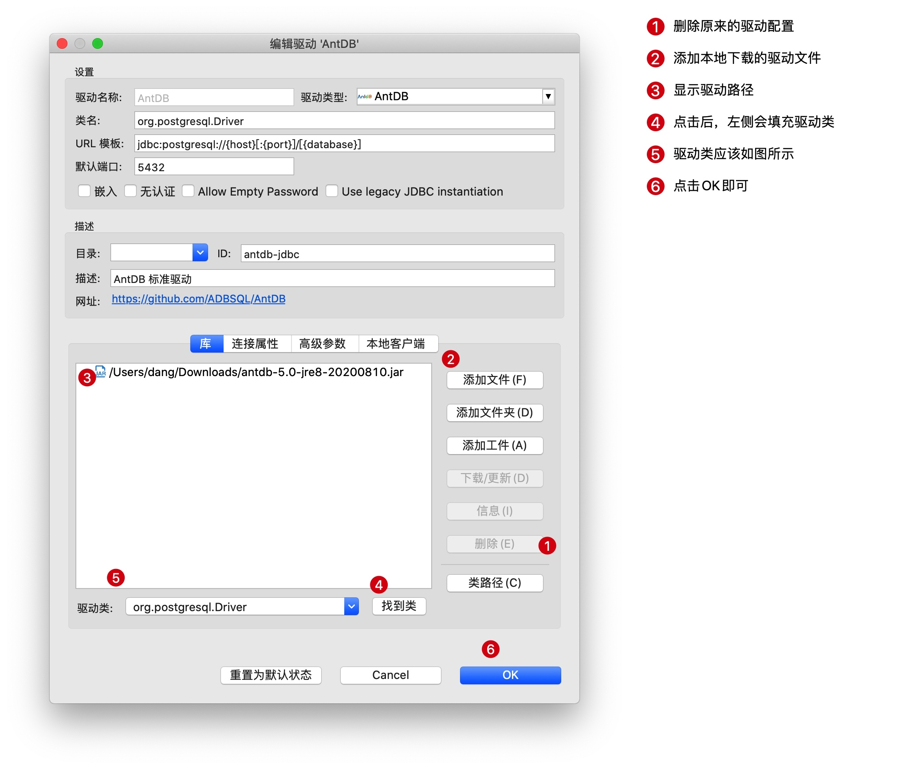

# AntDB 用户手册

- 文档名称：《AntDB用户手册》
- 对象：开发DBA/应用开发人员

---
## 阅读说明

本文档为通用指导文档，用户在参考的时候，对如下情况可能需要根据实际进行替换修改：

- IP地址
- 目录名称、目录路径
- 用户名称
- 表名

特别提醒：

**在psql客户端中，可以通过 `\h cmd` 快速获取该命令的帮助信息。**

## 连接数据库

### 连接说明

在集群搭建完成之后，就可以登录数据库进行相应的操作。默认可以使用与操作系统同名的用户(比如`antdb`)登录`postgres`数据库。

> 与操作系统用户同名的用户默认为超级用户(superuser)。

**集群版中，客户端登录的时候，需要指定gtmcoord或者coord的连接端口，而非adbmgr的端口，这点需要特别注意。**

在首次通过客户端连接的时候，可能会出现如下报错：

```
FATAL:  no pg_hba.conf entry for host "10.21.28.35", user "adb01", database "postgres", SSL off
```

原因是：在节点的hba中没有开放访问IP。

**解决方式** 

**AntDB单机版本：**

pg_hba.conf添加一行可信任配置：

```
host all all 10.21.28.0/24 trust
```

重新加载配置即可。

```
pg_ctl -D /data/pgxc_data/cd1/  reload
```

> -D  后面的参数为数据目录。

reload执行成功后，重新尝试登录。

> 建议在主备环境上都执行下，防止主备切换后应用无法连接现在的备节点。

**AntDB集群版本：**
登录adbmgr执行下述命令即可：

```
add hba coordinator all("host all all 10.21.28.0 24 trust");
add hba gtmcoord all("host all all 10.21.28.0 24 trust");
```

> 示例中的IP根据实际情况进行修改。
>
> 如果执行报错，通过`\h add hba`可查看帮助信息。

执行成功后，重新尝试登录。

### psql登录

在集群主机上，默认安装了`psql`客户端，可以直接使用。如果需要在集群之外的主机上通过`psql`登录，则需要安装对应的`postgres`客户端。

通过`psql --help`命令可以得到`psql`的帮助信息：

```
psql is the PostgreSQL interactive terminal.

Usage:
  psql [OPTION]... [DBNAME [USERNAME]]

General options:
  -c, --command=COMMAND    run only single command (SQL or internal) and exit
  -d, --dbname=DBNAME      database name to connect to (default: "danghb")
  -f, --file=FILENAME      execute commands from file, then exit
  -l, --list               list available databases, then exit
  -v, --set=, --variable=NAME=VALUE
                           set psql variable NAME to VALUE
                           (e.g., -v ON_ERROR_STOP=1)
  -V, --version            output version information, then exit
  -X, --no-psqlrc          do not read startup file (~/.psqlrc)
  -1 ("one"), --single-transaction
                           execute as a single transaction (if non-interactive)
  -?, --help[=options]     show this help, then exit
      --help=commands      list backslash commands, then exit
      --help=variables     list special variables, then exit

Input and output options:
  -a, --echo-all           echo all input from script
  -b, --echo-errors        echo failed commands
  -e, --echo-queries       echo commands sent to server
  -E, --echo-hidden        display queries that internal commands generate
  -L, --log-file=FILENAME  send session log to file
  -n, --no-readline        disable enhanced command line editing (readline)
  -o, --output=FILENAME    send query results to file (or |pipe)
  -q, --quiet              run quietly (no messages, only query output)
  -s, --single-step        single-step mode (confirm each query)
  -S, --single-line        single-line mode (end of line terminates SQL command)

Output format options:
  -A, --no-align           unaligned table output mode
  -F, --field-separator=STRING
                           field separator for unaligned output (default: "|")
  -H, --html               HTML table output mode
  -P, --pset=VAR[=ARG]     set printing option VAR to ARG (see \pset command)
  -R, --record-separator=STRING
                           record separator for unaligned output (default: newline)
  -t, --tuples-only        print rows only
  -T, --table-attr=TEXT    set HTML table tag attributes (e.g., width, border)
  -x, --expanded           turn on expanded table output
  -z, --field-separator-zero
                           set field separator for unaligned output to zero byte
  -0, --record-separator-zero
                           set record separator for unaligned output to zero byte

Connection options:
  -h, --host=HOSTNAME      database server host or socket directory (default: "local socket")
  -p, --port=PORT          database server port (default: "5432")
  -U, --username=USERNAME  database user name (default: "danghb")
  -w, --no-password        never prompt for password
  -W, --password           force password prompt (should happen automatically)

For more information, type "\?" (for internal commands) or "\help" (for SQL
commands) from within psql, or consult the psql section in the PostgreSQL
documentation.

Report bugs to <pgsql-bugs@postgresql.org>.
```

其中我们需要我们重点关注的是：

- `-h`  指定数据库服务器的主机名称或者IP
- `-p` 指定数据库服务的端口
- `-d` 指定需要连接的数据库名称
- `-U` 指定需要连接的数据库用户名

一个完整的示例如下：

```
psql -h 192.168.1.1 -p 5432  -d postgres -U antdb
```

如果服务端对连接客户端设置了`trust`认证，则可以直接登录，如果设置了`md5`认证，则会提示输入密码：

```
Password for user antdb: 
```

按照提示输入密码即可。

登录成功提示符：

```
psql (4.0.0 cbabf9feaf based on PG 10.7)
Type "help" for help.

postgres=# 
```


> 可以通过更换`-h`和`-p`的参数值来连接集群中不同的coord节点。
>
> 集群中各个coord节点提供的功能都是一样的，后续操作登录任意coord节点均可。

### dbeaver登录

dbeaver 是一款开源的数据库连接客户端，通过jdbc的方式可以连接多种类型的数据库，包括Oracle、postgres、mysql、db2、sql server等。

AntDB基于postgres实现，所以也可以使用dbeaver 连接AntDB。

> 如果需要通过 `DBeaver` 创建存储过程，请使用 AntDB 修改过的 DBeaver 版本和  JDBC 驱动。
DBeaver 下载：http://120.55.76.224/files/dbeaver/
JDBC 驱动下载： http://120.55.76.224/files/jdbc/


DBeaver 社区版本下载地址：https://dbeaver.io/download/，如下图所示：


选择社区版本，并选择合适的操作系统版本下载安装即可。

> dbeaver 备份地址：http://120.55.76.224/files/dbeaver/

打开dbeaver后，选择添加数据库连接，数据库类型选择`AntDB`:


在弹出的界面中，修改驱动配置：


点击  `编辑驱动设置`， 修改驱动为本地下载的 AntDB 提供的 JDBC 驱动：


在弹出的界面中，填写需要连接的数据库配置信息：


根据集群搭建的情况，填写相应的信息，填写无误后，可以点击`测试连接`按钮进行测试：


测试成功，如上图所示。

连接建立后，就可以通过客户端执行SQL了，首先新建SQL编辑器:


在打开的SQL编辑器中，输入SQL，执行：


在右侧的编辑区输入SQL，在左侧的功能区，分别可以执行单条SQL、执行SQL脚本、查看执行计划等。

在dbeaver界面的左侧，可以展开查看数据库中的对象：


更多的用法，可以在网络上搜索。

注意事项：

* 事务控制    

在客户端中修改数据的时候，要注意客户端的事务控制设置，如果为手动提交，则需要在执行完修改语句后，点击提交按钮，进行事务提交。


* `select * from tab` 查询    

在对大表进行无过滤查询的时候，客户端默认会查询全表数据后，再显示200条数据，会造成大表的查询非常慢，甚至影响了生产环境的正常使用。建议进行如下设置，可在查询语句后面自动加上limit 语句。


可参考的链接：

- https://sspai.com/post/44247 DBeaver : 通用的数据库管理工具和 SQL 客户端
- https://my.oschina.net/sprouting/blog/1809316  
- https://github.com/dbeaver/dbeaver/wiki 
- https://dbeaver.com/docs/wiki/Data-transfer/ 使用 DBeaver 进行数据的导出导入

### Java 连接

Java应用连接AntDB可以使用PostgreSQL自带的Java驱动，下载地址：https://jdbc.postgresql.org/download.html    

如果需要在jdbc串中使用Oracle语法，则需要使用AntDB提供的jdbc驱动，下载地址：http://120.55.76.224/files/jdbc/

驱动类为：

```
driver=org.postgresql.Driver
```

连接串格式如下：

```
conn=jdbc:postgresql://10.21.20.256:11010/postgres?binaryTransfer=False&forceBinary=False&reWriteBatchedInserts=true
```

如果要使用Oracle语法，则连接串增加语法参数：

```
conn=jdbc:postgresql://10.21.20.256:11010/postgres?binaryTransfer=False&forceBinary=False&reWriteBatchedInserts=true&grammar=oracle
```

如果是xml配置文件，则需要将`&` 替换为 `&amp;`:

```
conn=jdbc:postgresql://10.21.20.256:11010/postgres?binaryTransfer=False&amp;forceBinary=False&amp;reWriteBatchedInserts=true&amp;grammar=oracle
```

可以配置多个地址防止节点发生切换后数据库不可访问，在 jdbc 串中配置如下：

```
jdbc:postgresql://10.21.20.256:6432,10.21.20.257:6432,10.21.20.258:6432/postgres?targetServerType=master&binaryTransfer=False&forceBinary=False&grammar=oracle
```

也可以配置多个地址进行负载均衡，在 jdbc 串中配置如下：

```
jdbc:postgresql://10.21.20.256:6432,10.21.20.257:6432,10.21.20.258:6432/postgres?targetServerType=master&loadBalanceHosts=true&binaryTransfer=False&forceBinary=False&grammar=oracle
```

其中：

- `10.21.20.256`为AntDB中coordinator的地址。
- `11010`为AntDB中coordinator的端口。
- `postgres`指定了需要连接的数据库名称。
- `targetServerType` 指定了只连 master 节点，即可读可写的节点。会按照给定的顺序去进行连接，第一个连不上或者不是 master 节点的时候，去连第二个，以此类推。
- `loadBalanceHosts`  从给定的连接信息中随机选择节点进行连接，达到负载均衡的目的。

更多的连接参数可以参考：https://jdbc.postgresql.org/documentation/head/connect.html

开发测试人员在进行连接的时候，可以咨询DBA或者系统管理员获取以上信息。

### Python 连接

AntDB基于postgres开发，所以使用连接postgres的python驱动即可。 python连接postgres的驱动也有好几个，具体可看：https://wiki.postgresql.org/wiki/Python 本例中我们选择流行度比较高的psycopg2。

文档地址：http://initd.org/psycopg/docs/，py2、py3均可使用。

#### 安装psycopg2

在centos下，直接执行：   

```
yum install python-psycopg2
```

如果是内网环境，且没有yum源，可以去github上下载源码进行安装，源码地址：[https://github.com/psycopg/psycopg2](https://github.com/psycopg/psycopg2),按照readme的说明操作即可。

安装好psycopg2之后，进行测试：

```
python -c "import psycopg2"
```
返回空，表示安装成功。

#### 连接AntDB

如果有使用python连接postgres的经验，那在AntDB中操作是完全一样的。
首先需要import psycopg2，然后使用psycopg2提供的conn方法创建连接即可。代码示例如下：

```python
import psycopg2
conn = psycopg2.connect(database="postgres", user="dang31", password="123", host="10.1.226.256", port="1234")
```
此时就创建好了一个连接，供后续使用。
在进行数据库操作之前，需要先建立一个cursor，在cursor中进行相应的操作：

```
cur = conn.cursor()
```
创建表：

```
cur.execute("create t_test (id int,name text)")
```
插入数据：

```
cur.insert("insert into t_test values (1,'name')")
```
删除数据：

```
cur.execute("delete from t_test where id=%s",(3,)) 
```
更新数据：

```
cur.execute("update  t_test set name=%s where id=%s",('c',1)) 
```
查询数据：

```
cur.execute("select * from t_test;")
rows = cur.fetchall()
pprint.pprint(rows)
```

完整的脚本如下：

```python
#!/usr/bin/env python
# -*- coding: UTF-8 -*-

import psycopg2
import sys
import pprint

adb_conn="dbname=postgres user=dang31 password=123 host=10.1.226.256 port=1234"

try:
   conn = psycopg2.connect(adb_conn)
except psycopg2.Error as e:
    print"Unable to connect!"
    print e.pgerror
    print e.diag.message_detail
    sys.exit(1)
else:
    print"Connected!"    
    cur = conn.cursor()
#该程序创建一个光标将用于整个数据库使用Python编程。
print ("version:")
cur.execute("select version();")  
rows = cur.fetchall()
pprint.pprint(rows)
print ("create  table")
cur.execute("create table t_test (id int,name text);")   
print ("insert into table")
cur.execute("insert into t_test (id,name) values (%s,%s)",(1,'a'))
cur.statusmessage
cur.execute("insert into t_test (id,name) values (%s,%s)",(3,'b')) 
cur.mogrify("insert into t_test (id,name) values (%s,%s)",(3,'b')) 
cur.execute("select * from t_test;")
print ("fetchone")
row = cur.fetchone()
pprint.pprint(row)
cur.execute("select * from t_test;")
rows = cur.fetchall()
print ("fetchall")
pprint.pprint(rows)
print ("delete from table")
cur.execute("delete from t_test where id=%s",(3,)) 
cur.execute("select * from t_test;")
rows = cur.fetchall()
pprint.pprint(rows)
print ("update  table")
cur.execute("update  t_test set name=%s where id=%s",('c',1)) 
cur.execute("select * from t_test;")
rows = cur.fetchall()
pprint.pprint(rows)
print ("drop  table")
cur.execute("drop table if EXISTS  t_test ");

conn.commit()
#connection.commit() 此方法提交当前事务。如果不调用这个方法，无论做了什么修改，自从上次调用#commit()是不可见的，从其他的数据库连接。
conn.close() 
#connection.close() 此方法关闭数据库连接。请注意，这并不自动调用commit（）。如果你只是关闭数据库连接而不调用commit（）方法首先，那么所有更改将会丢失
```

输出结果为：

```
Connected!
version:
[('PostgreSQL 11.6 ADB 5.0.0 37c61ca18f on x86_64-pc-linux-gnu, compiled by gcc (GCC) 4.8.5 20150623 (Red Hat 4.8.5-36), 64-bit',)]
create  table
insert into table
fetchone
(3, 'b')
fetchall
[(1, 'a'), (3, 'b')]
delete from table
[(1, 'a')]
update  table
[(1, 'c')]
drop  table
```

更多的操作，可以参考psycopg 的文档：https://www.psycopg.org/docs/index.html

### C++连接

C++ 中可以通过OTL模板库来访问不同的数据库，我们推荐使用OTL+ODBC的方式访问AntDB。

OTL的文档：http://otl.sourceforge.net/otl3.htm

#### 配置OBDC

安装ODBC开发包：

```
yum install unixODBC-devel
```

安装pg odbc： https://odbc.postgresql.org/ https://www.postgresql.org/ftp/odbc/versions/

```
wget  https://ftp.postgresql.org/pub/odbc/versions/src/psqlodbc-11.01.0000.tar.gz
tar xzvf psqlodbc-11.01.0000.tar.gz 
cd psqlodbc-11.01.0000 
./configure 
make 
make install #root 执⾏
```

安装的路径：

```
/bin/mkdir -p '/usr/local/lib' 
/bin/sh ./libtool --mode=install /bin/install -c psqlodbcw.la psqlodbca.la '/usr/local/lib' 
libtool: install: /bin/install -c .libs/psqlodbcw.so /usr/local/lib/psqlodbcw.so 
libtool: install: /bin/install -c .libs/psqlodbcw.lai /usr/local/lib/psqlodbcw.la 
libtool: install: /bin/install -c .libs/psqlodbca.so /usr/local/lib/psqlodbca.so 
libtool: install: /bin/install -c .libs/psqlodbca.lai /usr/local/lib/psqlodbca.la 
libtool: finish: PATH="/data/sy/hive/hive-2.3.3/bin:/data/sy/hadoop/hadoop-2.8.5/bin:/data/sy/hadoop/hadoop-
2.8.5/sbin:/data/sy/jdk/jdk1.8.0_191/bin:/data/sy/jdk/jdk1.8.0_191/jre/bin:/home/adb40sy/mysql/install/bin:/data/sy/hive/h ive-2.3.3/bin:/data/sy/hadoop/hadoop-2.8.5/bin:/data/sy/hadoop/hadoop-
2.8.5/sbin:/data/sy/jdk/jdk1.8.0_191/bin:/data/sy/jdk/jdk1.8.0_191/jre/bin:/usr/local/sbin:/usr/local/bin:/sbin:/bin:/usr/ sbin:/usr/bin:/root/bin:/usr/local/madlib/Versions/1.15/bin:/sbin" ldconfig -n /usr/local/lib

---------------------------------------------------------------------Libraries have been installed in:
/usr/local/lib
If you ever happen to want to link against installed libraries in a given directory, LIBDIR, you must either use libtool, and specify the full pathname of the library, or use the `-LLIBDIR' flag during linking and do at least one of the following:
- add LIBDIR to the `LD_LIBRARY_PATH' environment variable during execution
- add LIBDIR to the `LD_RUN_PATH' environment variable during linking
- use the `-Wl,-rpath -Wl,LIBDIR' linker flag
- have your system administrator add LIBDIR to `/etc/ld.so.conf'
See any operating system documentation about shared libraries for more information, such as the ld(1) and ld.so(8) manual pages.
```

isql测试：

```

**********************************************
* unixODBC - isql                            *
**********************************************
* Syntax                                     *
*                                            *
*      isql DSN [UID [PWD]] [options]        *
*                                            *
* Options                                    *
*                                            *
* -b         batch.(no prompting etc)        *
* -dx        delimit columns with x          *
* -x0xXX     delimit columns with XX, where  *
*            x is in hex, ie 0x09 is tab     *
* -w         wrap results in an HTML table   *
* -c         column names on first row.      *
*            (only used when -d)             *
* -mn        limit column display width to n *
* -v         verbose.                        *
* -lx        set locale to x                 *
* -q         wrap char fields in dquotes     *
* -3         Use ODBC 3 calls                *
* -n         Use new line processing         *
* -e         Use SQLExecDirect not Prepare   *
* -k         Use SQLDriverConnect            *
* --version  version                         *
*                                            *
* Commands                                   *
*                                            *
* help - list tables                         *
* help table - list columns in table         *
* help help - list all help options          *
*                                            *
* Examples                                   *
*                                            *
*      isql WebDB MyID MyPWD -w < My.sql     *
*                                            *
*      Each line in My.sql must contain      *
*      exactly 1 SQL command except for the  *
*      last line which must be blank (unless *
*      -n option specified).                 *
*                                            *
* Please visit;                              *
*                                            *
*      http://www.unixodbc.org               *
*      nick@lurcher.org                      *
*      pharvey@codebydesign.com              *
**********************************************
```

修改odbc默认配置(vi /etc/odbcinst.ini)：

默认PG的配置： 

```
[PostgreSQL]
Description     = ODBC for PostgreSQL
Driver          = /usr/lib64/psqlodbc.so
#Driver         = /usr/lib/psqlodbcw.so
#Setup          = /usr/lib/libodbcpsqlS.so
#Driver64       = /usr/lib64/psqlodbcw.so
#Setup64        = /usr/lib64/libodbcpsqlS.so
FileUsage       = 1

```

可以不动这个配置参数，在⾃⼰的环境中找出上述⽂件，建⽴软链接：

```
root@intel175 ~]# find / -name 'psqlodbcw.so'
/ssd/home/billing/soft/psqlodbc-11.01.0000/.libs/psqlodbcw.so
/usr/local/lib/psqlodbcw.so
[root@intel175 ~]# find / -name 'libodbcpsqlS.so'
/usr/lib64/libodbcpsqlS.so

ln -s /usr/local/lib/psqlodbcw.so /usr/lib/otlobbc.so 
ln -s /usr/local/lib/psqlodbcw.so /usr/lib64/otlobbc.so
ln -s /usr/lib64/libodbcpsqlS.so /usr/lib/libodbcpsqlS.so
```

配置DSN

```
vi /etc/odbc.ini

[antdb]
Description = Test to antdb 
Driver = PostgreSQL 
Database = postgres 
Servername = localhost 
UserName = billing
Password = billing 
Port = 4333
```

连接测试：

```
[billing@intel175 soft]$ isql antdb -v
+---------------------------------------+
| Connected!	|
|	|
| sql-statement	|
| help [tablename]	|
| quit	|
|	|
+---------------------------------------+
SQL> select count(*) from pg_class;
+---------------------+
| count	|
+---------------------+
| 380	|
+---------------------+
SQLRowCount returns 1
1 rows fetched SQL>
```
如果执行isql测试出现如下的错误
```
[unixODBC][Driver Manager]Data source name not found, and no default driver specified
```
首先确认odbc的环境变量，是否正确指向了自己的配置文件，确认方法
```
[antdb@adb01 mgr1]$dbcinst -j
unixODBC 2.3.1
DRIVERS............: /etc/odbcinst.ini  # 确认路径是上面配置odbcinst.ini文件路径
SYSTEM DATA SOURCES: /etc/odbc.ini      # 确认路径是上面配置odbc.ini文件路径
FILE DATA SOURCES..: /etc/ODBCDataSources
USER DATA SOURCES..: /home/antdb/.odbc.ini
SQLULEN Size.......: 8
SQLLEN Size........: 8
SQLSETPOSIROW Size.: 8
```
再确认/etc/odbc.ini文件的访问权限，确认执行isql的用户有读权限

#### 通过OTL操作数据库示例

- 创建文件：test_antdb.cpp

```C++
#include <iostream>
using namespace std;

#include <stdio.h>
#include <string.h>
#include <stdlib.h>

#define OTL_ODBC_UNIX // uncomment this line if UnixODBC is used
#define OTL_ODBC_ALTERNATE_RPC
#if !defined(_WIN32) && !defined(_WIN64)
#define OTL_ODBC
#else 
#define OTL_ODBC_POSTGRESQL // required with PG ODBC on Windows
#endif
#include "otlv4.h" // include the OTL 4.0 header file

otl_connect db; // connect object

void insert()
// insert rows into table
{ 
 otl_stream o(10000, // PostgreSQL 8.1 and higher, the buffer can be > 1
              "insert into test_tab values(:f1<int>,:f2<int>)", 
                 // SQL statement
              db // connect object
             );
 char tmp[8];
 for(int i=1;i<=10;++i){
  sprintf(tmp,"Name%d\0",i);
  // o<<i<<i*10;
  o<<i<<i;
  o.flush();
  cout<<"Number:"<<i<<endl;
 }
}
void update(const int af1)
// insert rows into table
{ 
 otl_stream o(1, // PostgreSQL 8.1 and higher, buffer size can be >1
              "UPDATE test_tab "
              "   SET f2=:f2<int> "
              " WHERE f1=:f1<int>", 
                 // UPDATE statement
              db // connect object
             );
 o<<otl_null()<<af1+1; // set f2 to NULL

}
void select(const int af1)
{ 
 otl_stream i(50, // On SELECT, the buffer size can be > 1
              "select * from test_tab where f1>=:f11<int> and f1<=:f12<int> and rownum < 10", 
                 // SELECT statement
              db // connect object
             ); 
   // create select stream

 int f1;
//  char f2[31];
 int f2;

#if (defined(_MSC_VER) && _MSC_VER>=1600) || defined(OTL_CPP_11_ON)
// C++11 (or higher) compiler
#if defined(OTL_ANSI_CPP_11_VARIADIC_TEMPLATES)
 otl_write_row(i,af1,af1); // Writing input values into the stream
#else
  // when variadic template functions are not supported by the C++
  // compiler, OTL provides nonvariadic versions of the same template
  // functions in the range of [1..15] parameters
 otl_write_row(i,af1,af1); // Writing input values into the stream
  // the old way (operators >>() / <<()) is available as always:
  // i<<af1<<af1; // Writing input values into the stream
#endif
 for(auto& it : i){
  it>>f1;
  cout<<"f1="<<f1<<", f2=";
  it>>f2;
  if(it.is_null())
   cout<<"NULL";
  else
   cout<<f2;
  cout<<endl;
 }
#else
// C++98/03 compiler
 i<<af1<<af1; // Writing input values into the stream
 while(!i.eof()){ // while not end-of-data
   i>>f1;
   cout<<"f1="<<f1<<", f2=";
   i>>f2;
   if(i.is_null())
     cout<<"NULL";
   else
     cout<<f2;
   cout<<endl;
 }
#endif

}

int main()
{
 otl_connect::otl_initialize(); // initialize ODBC environment
 try{

  //db.rlogon("scott/tiger@postgresql");
  //db.rlogon("billappxc/123@sunyu");
  db.rlogon("danghb/123@antdb");

  otl_cursor::direct_exec
   (
    db,
    "drop table IF EXISTS test_tab",
    otl_exception::disabled // disable OTL exceptions
   ); // drop table

  //  db.commit();

  otl_cursor::direct_exec
   (
    db,
    "create table test_tab(f1 bigint, f2 bigint)"
    );  // create table

  otl_cursor::direct_exec
   (
    db,
    "set grammar to oracle"
    );  // set grammar

  // db.commit();
  insert(); // insert records into the table
  //db.commit();
  //return 0;
  update(10); // update records in the table
  select(8); // select records from the table
  select(3); // select records from the table
  select(5); // select records from the table
  db.commit();
 }

 catch(otl_exception& p){ // intercept OTL exceptions
  cerr<<p.msg<<endl; // print out error message
  cerr<<p.stm_text<<endl; // print out SQL that caused the error
  cerr<<p.sqlstate<<endl; // print out SQLSTATE message
  cerr<<p.var_info<<endl; // print out the variable that caused the error
 }

 db.logoff(); // disconnect from ODBC

 return 0;
}

```

- 编译文件

```
g++ test_antdb.cpp -L/usr/lib -lotlobbc -o test_antdb -g
```

- 执行程序

```
./test_antdb
Number:1
Number:2
Number:3
Number:4
Number:5
Number:6
Number:7
Number:8
Number:9
Number:10
f1=8, f2=8
f1=3, f2=3
f1=5, f2=5
```

注意事项：
- 程序中对绑定变量的使用，需要保证绑定变量类型和传值类型一致，否则会报错：

```
Incompatible data types in stream operation
UPDATE test_tab    SET f2=?         WHERE f1=?       

Variable: :f2<INT>, datatype in operator <</>>: CHAR
```

## 查看和修改事务自动提交

一个完整的事务包括如下步骤：
* begin transaction;
* execute some sql;
* commit or  rollback;

自动提交的含义是：每条语句会作为一个事务，在语句执行之前，客户端自动执行 `begin`,在语句执行完成后，客户端自动执行事务结束操作：提交或者回滚，在 autocommit 打开后，事务的开始和结束操作均由客户端自动完成。

如果 autocommit 为 off， 则需要手动开启事务并手动结束事务。

主要说明下在 `psql` 和  `jdbc` 中的 `autocommit` 的默认行为和如何修改。

### psql

psql 中的 autocommit 是默认开启的，也就是事务是自动提交的。     
如何确认呢？在 psql 中执行  `\set` 就可以看到：
```
postgres=# \set
AUTOCOMMIT = 'on'
COMP_KEYWORD_CASE = 'preserve-upper'
DBNAME = 'postgres'
ECHO = 'none'
```

在输出中可以看到 `AUTOCOMMIT = 'on'`.
如何修改呢？ 在  psql 中执行 `\set AUTOCOMMIT off`：
```
postgres=# \set AUTOCOMMIT off
postgres=# \set 
AUTOCOMMIT = 'off'
COMP_KEYWORD_CASE = 'preserve-upper'
DBNAME = 'postgres'
ECHO = 'none'
```

退出 psql 后，设置失效。通过 psql 重新登录后，`autocommit` 恢复默认值：
```
[danghb@localhost ~]$ psql
psql (5.0.0 035f740 based on PG 11.6)
Type "help" for help.

postgres=# \set 
AUTOCOMMIT = 'on'
```

如果想 psql 中的 autocommit 默认为 off， 需要修改一个配置文件：`~/.psqlrc`,效果如下：
```
postgres=# \! cat ~/.psqlrc
\set AUTOCOMMIT off
postgres=# \set
AUTOCOMMIT = 'off'
```
在通过 psql 登录的时候，会首先加载 `~/.psqlrc` 中的内容。

### jdbc

在 Java 中可以使用如下语句进行 autocommit 的查看和设置：

```java
System.out.print("default autocommit is "+connection.getAutoCommit()+"\n");
connection.setAutoCommit(false);
System.out.print("current autocommit is "+connection.getAutoCommit()+"\n");
```

执行后，输出如下：
```
default autocommit is true
current autocommit is false
```

在程序中使用的时候，建议设置 autocommit 为 false，手动去控制事务，便于进行业务逻辑的控制。


## 语法切换

AntDB兼容Oracle、MySQL、DB2语法，其中对Oracle的兼容度最高。支持在服务器级别、会话级别、语句级别的兼容性开关设置。

下面以Oracle语法切换为例进行说明。

### 服务器级别

默认数据库语法为`postgres`,如果想全局使用Oracle语法，则可以在服务器级别设置语法参数。

登录adbmgr，设置所有coordinator的`grammar`参数：

```
postgres=# set coordinator all (grammar=oracle);
SET PARAM
postgres=# show cd1 grammar;
          type          | status |             message              
------------------------+--------+----------------------------------
 coordinator master cd1 | t      | debug_print_grammar = off       +
                        |        | grammar = oracle
(1 row)
```

连接Coordinator节点，登录数据库，查看语法参数，并执行Oracle语法语句：

```
psql (4.0.0  based on PG 10.7)
Type "help" for help.

postgres=# show grammar ;
 grammar 
---------
 oracle
(1 row)

postgres=# select * from dual;
 DUMMY 
-------
 X
(1 row)

```

### 会话级别

如果没有进行服务器级别设置，默认登录数据库后的语法为`postgres`：

```
postgres=# show grammar ;
 grammar  
----------
 postgres
(1 row)
```

此时执行Oracle语法的语句，会报错：

```
postgres=# select * from dual;
ERROR:  relation "dual" does not exist
LINE 1: select * from dual;                 ^
```

session 级别切换到Oracle语法，再次执行Oracle语法的语句：

```
postgres=# set grammar to oracle;
SET
postgres=# show grammar ;
 grammar 
---------
 oracle
(1 row)

postgres=# select * from dual;
 DUMMY 
-------
 X
(1 row)
```

执行成功。

### 语句级别

如果仅仅是某条语句想使用Oracle语法，则可以用hint的方式指定语法：

```

postgres=# show grammar ;
 grammar  
----------
 postgres
(1 row)

postgres=# select * from dual;
ERROR:  relation "dual" does not exist
LINE 1: select * from dual;
                      ^
postgres=# /*ora*/select * from dual;
 DUMMY 
-------
 X
(1 row)

postgres=# show grammar ;
 grammar  
----------
 postgres
(1 row)

postgres=# 
```

## 创建用户

在`psql`中通过 `\h create user` 可以得到创建用户的帮助信息：

```sql
postgres=# \h create user
Command:     CREATE USER
Description: define a new database role
Syntax:
CREATE USER name [ [ WITH ] option [ ... ] ]

where option can be:

      SUPERUSER | NOSUPERUSER
    | CREATEDB | NOCREATEDB
    | CREATEROLE | NOCREATEROLE
    | INHERIT | NOINHERIT
    | LOGIN | NOLOGIN
    | REPLICATION | NOREPLICATION
    | BYPASSRLS | NOBYPASSRLS
    | CONNECTION LIMIT connlimit
    | [ ENCRYPTED ] PASSWORD 'password'
    | VALID UNTIL 'timestamp'
    | IN ROLE role_name [, ...]
    | IN GROUP role_name [, ...]
    | ROLE role_name [, ...]
    | ADMIN role_name [, ...]
    | USER role_name [, ...]
    | SYSID uid

postgres=# 
```

创建普通用户使用如下简单的示例即可：

```
create user user1 password '123';
```

在帮助信息中，可以看到，在创建用户的同时，可以指定用户的一些权限，比如是否超级用户、是否可以创建数据库，同时还可以限制该用户的连接数、用户有效期等。

创建完成后，通过`\du`命令可以看到集群中有哪些用户：

```
postgres=# \du
                                   List of roles
 Role name |                         Attributes                         | Member of 
-----------+------------------------------------------------------------+-----------
 danghb    | Superuser, Create role, Create DB, Replication, Bypass RLS | {}
 user1     |                                                            | {}
```


## 创建数据库

与 Oracle 不同，在 AntDB 中可以创建多个数据库，且不同的数据库之间是完全隔离的。

AntDB在初始化完成后，会默认有三个数据库：

- template0 模板库，不可修改。
- template1 模板库，可以修改，`create database`即是从这个模板库继承对象
- postgres  系统数据库，存放集群信息等数据，不建议作为业务库使用。

使用`\h create database`可以得到创建数据库命令的帮助信息：

```
postgres=# \h create database
Command:     CREATE DATABASE
Description: create a new database
Syntax:
CREATE DATABASE name
    [ [ WITH ] [ OWNER [=] user_name ]
           [ TEMPLATE [=] template ]
           [ ENCODING [=] encoding ]
           [ LC_COLLATE [=] lc_collate ]
           [ LC_CTYPE [=] lc_ctype ]
           [ TABLESPACE [=] tablespace_name ]
           [ ALLOW_CONNECTIONS [=] allowconn ]
           [ CONNECTION LIMIT [=] connlimit ]
           [ IS_TEMPLATE [=] istemplate ] ]

postgres=# 
```

简单的创建数据库命令如下：

```
postgres=# create database testdb1;
CREATE DATABASE
```

在帮助信息中，可以看到，在创建数据库的时候，同样可以进行一些参数的设置，比如指定：
* 数据库的用户： OWNER
* 字符集：ENCODING
* 表空间：TABLESPACE
* 连接数限制： CONNECTION LIMIT

在`psql`中可以通过`\l` 命令查看集群中有哪些数据库：

```
postgres=# \l
                          List of databases
   Name    | Owner  | Encoding | Collate | Ctype | Access privileges 
-----------+--------+----------+---------+-------+-------------------
 testdb1   | antdb | UTF8     | C       | C     | 
 postgres  | antdb | UTF8     | C       | C     | 
 template0 | antdb | UTF8     | C       | C     | =c/antdb        +
           |        |          |         |       | antdb=CTc/antdb
 template1 | antdb | UTF8     | C       | C     | =c/antdb        +
           |        |          |         |       | antdb=CTc/antdb
(5 rows)
```

* 如果在业务模型设计中，数据库和用户具有强绑定的关系，比如某个数据库归某个用户使用，可以在创建数据库的时候指定 `owner=crm`
* 也可以将数据库的权限赋给指定的几个用户,如：`grant all on database to crm1,crm2,crm3`
* 数据库之间的对象不能直接访问，也不能通过赋权访问，完全是隔离的。

## 创建schema

在AntDB中，schema是用户在一个数据库中的一个对象。一个用户可以有多个schema，在不同的schema中，可以存放同名的对象。

为了兼容Oracle用户的使用习惯，建议在数据库中创建与用户同名的schema，之后再进行建表等操作。

在`psql`通过`\h create schema`可以得到创建schema的帮助信息：

```
testdb1=> \h create schema
Command:     CREATE SCHEMA
Description: define a new schema
Syntax:
CREATE SCHEMA schema_name [ AUTHORIZATION role_specification ] [ schema_element [ ... ] ]
CREATE SCHEMA AUTHORIZATION role_specification [ schema_element [ ... ] ]
CREATE SCHEMA IF NOT EXISTS schema_name [ AUTHORIZATION role_specification ]
CREATE SCHEMA IF NOT EXISTS AUTHORIZATION role_specification

where role_specification can be:

    user_name
  | CURRENT_USER
  | SESSION_USER

testdb1=> 
```

使用`user1`用户登录`testdb1`数据库：

```
psql -d testdb1 -U user1
```

创建同名schema：

```
create schema AUTHORIZATION CURRENT_USER;
```

通过`\dn` 可以查看数据库中的schema：

```
testdb1=> \dn
   List of schemas
    Name     | Owner  
-------------+--------
 dbms_lock   | danghb
 dbms_output | danghb
 public      | danghb
 user1       | user1
(4 rows)
```

## 建表

确保连接信息正确后，就可以进行建表操作。通过如下SQL进行查询验证连接信息：

```
testdb1=> select current_database(),current_user,current_schema;
 current_database | current_user | current_schema 
------------------+--------------+----------------
 testdb1          | user1        | user1
(1 row)
```

### 创建分片表

> 注意：仅在分布式版本中可以创建分片表

AntDB支持多种分片方式，默认为hash分片。

创建如下测试表，可以看出分片键选择的默认行为。

```
create table test1
(
    id int,
    name text
);
create table test2
(
    id int,
    name text,
    primary key (name)
);
create table test3
(
    id int,
    name text
) distribute by hash(name);
create table test4
(
    id int,
    name text,
    constraint c_name unique(name)
);
create table test5
(
    id int,
    name text
) distribute by replication;
```

在`psql`中通过`\d+ tablename`命令可以看到表分片方式：

```
testdb1=> \d+ test1
                                    Table "user1.test1"
 Column |  Type   | Collation | Nullable | Default | Storage  | Stats target | Description 
--------+---------+-----------+----------+---------+----------+--------------+-------------
 id     | integer |           |          |         | plain    |              | 
 name   | text    |           |          |         | extended |              | 
Distribute By: HASH(id)
Location Nodes: ALL DATANODES

testdb1=> \d+ test5
                                    Table "user1.test5"
 Column |  Type   | Collation | Nullable | Default | Storage  | Stats target | Description 
--------+---------+-----------+----------+---------+----------+--------------+-------------
 id     | integer |           |          |         | plain    |              | 
 name   | text    |           |          |         | extended |              | 
Distribute By: REPLICATION
Location Nodes: ALL DATANODES
```

可以看到`test1`和`test5` 有不同的分片方式。

在AntDB中也提供了不同分片方式之间的转换。

复制表修改为分片表：

```
alter table test5 distribute by hash(id);
```

分片表修改为复制表：

```
alter table test5 distribute by replication;
```

修改分片字段：

```
alter table test5 distribute by hash(name);
```

### 创建分区表

AntDB在支持分片的同时，也支持分区表。

Oracle 语法下使用 Oracle 的创建语句：
```
/*ora*/
create table t_part_range 
(
    id number,
    in_date date,
    name VARCHAR2(30)
)
partition by range(in_date)
(
    partition t_part_range_part1 values less than (to_date('2016-01-01','yyyy-mm-dd')),
    partition t_part_range_part2 values less than (to_date('2017-01-01','yyyy-mm-dd')),
    partition t_part_range_part3 values less than (to_date('2018-01-01','yyyy-mm-dd')),
    partition t_part_range_part4 values less than (to_date('2019-01-01','yyyy-mm-dd')),
    partition t_part_range_partmax values less than (MAXVALUE)
)
distribute by hash(name);
```

查看分区表的详细信息：

```
testdb1=> \d+ t_part_range
                                   Table "user1.t_part_range"
 Column  |     Type     | Collation | Nullable | Default | Storage  | Stats target | Description 
---------+--------------+-----------+----------+---------+----------+--------------+-------------
 id      | numeric      |           |          |         | main     |              | 
 in_date | oracle.date  |           |          |         | plain    |              | 
 name    | varchar2(30) |           |          |         | extended |              | 
Partition key: RANGE (in_date)
Partitions: t_part_range_part1 FOR VALUES FROM (MINVALUE) TO ('2016-01-01 00:00:00'),
            t_part_range_part2 FOR VALUES FROM ('2016-01-01 00:00:00') TO ('2017-01-01 00:00:00'),
            t_part_range_part3 FOR VALUES FROM ('2017-01-01 00:00:00') TO ('2018-01-01 00:00:00'),
            t_part_range_part4 FOR VALUES FROM ('2018-01-01 00:00:00') TO ('2019-01-01 00:00:00'),
            t_part_range_partmax FOR VALUES FROM ('2019-01-01 00:00:00') TO (MAXVALUE)
Distribute By: HASH(name)
Location Nodes: ALL DATANODES
```

上述分区表的创建方式是AntDB兼容了Oracle的语法，如果要使用AntDB原生的分区表创建，请使用如下语句：

```
testdb1=> create table t_part_range_2
testdb1-> (id int,name varchar(100),i_time timestamp not null) 
testdb1-> partition by range(id);
CREATE TABLE
testdb1=> create table t_range_1 partition of t_part_range_2 for values from (1) to (1000);
CREATE TABLE
testdb1=> create table t_range_2 partition of t_part_range_2 for values from (1000) to (3000);
create table t_range_3 partition of t_part_range_2 for values from (3000) to (5000);
create table t_range_4 partition of t_part_range_2 for values from (5000) to (8000);
create table t_range_5 partition of t_part_range_2 for values from (8000) to (10000);CREATE TABLE
testdb1=> create table t_range_3 partition of t_part_range_2 for values from (3000) to (5000);
CREATE TABLE
testdb1=> create table t_range_4 partition of t_part_range_2 for values from (5000) to (8000);
CREATE TABLE
testdb1=> create table t_range_5 partition of t_part_range_2 for values from (8000) to (10000);
CREATE TABLE
```

查看分区表的详细信息：

```
testdb1=> \d+ t_part_range_2
                                         Table "user1.t_part_range_2"
 Column |            Type             | Collation | Nullable | Default | Storage  | Stats target | Description 
--------+-----------------------------+-----------+----------+---------+----------+--------------+-------------
 id     | integer                     |           |          |         | plain    |              | 
 name   | character varying(100)      |           |          |         | extended |              | 
 i_time | timestamp without time zone |           | not null |         | plain    |              | 
Partition key: RANGE (id)
Partitions: t_range_1 FOR VALUES FROM (1) TO (1000),
            t_range_2 FOR VALUES FROM (1000) TO (3000),
            t_range_3 FOR VALUES FROM (3000) TO (5000),
            t_range_4 FOR VALUES FROM (5000) TO (8000),
            t_range_5 FOR VALUES FROM (8000) TO (10000)
Distribute By: HASH(id)
Location Nodes: ALL DATANODES
```

> 注意：与Oracle不同的是，AntDB中分区表的分区名与主表在同一个命令空间中，所以不同的分区表，不能使用同样的分区名。

### 创建临时表
AntDB 的临时表只存在于当前会话中，会话结束后，临时表也就消失了。
查看帮助信息：
```sql
CREATE [ [ GLOBAL | LOCAL ] { TEMPORARY | TEMP } | UNLOGGED ] TABLE [ IF NOT EXISTS ] table_name
    OF type_name [ (
  { column_name [ WITH OPTIONS ] [ column_constraint [ ... ] ]
    | table_constraint }
    [, ... ]
) ]
[ PARTITION BY { RANGE | LIST | HASH } ( { column_name | ( expression ) } [ COLLATE collation ] [ opclass ] [, ... ] ) ]
[ WITH ( storage_parameter [= value] [, ... ] ) | WITH OIDS | WITHOUT OIDS ]
[ ON COMMIT { PRESERVE ROWS | DELETE ROWS | DROP } ]
[ TABLESPACE tablespace_name ]
```
其中 `[ ON COMMIT { PRESERVE ROWS | DELETE ROWS | DROP } ]`  部分决定了 临时表及其数据的生命周期。

* PRESERVE ROWS ： 默认值，事务提交后，数据还在，跟随表的生命周期。
* DELETE ROWS ： 事务提交后，临时表里的数据也被删除。
* DROP： 事务提交后，临时表也被删除。

通过实例查看数据的生命周期：
`drop` :
```sql
postgres=# begin;
BEGIN
postgres=# CREATE TEMP TABLE mytemp(c INT) on commit drop;
CREATE TABLE
postgres=# insert into mytemp select 1;
INSERT 0 1
postgres=# select * from mytemp;
 c 
---
 1
(1 row)

postgres=# commit;
COMMIT
postgres=# select * from mytemp;
ERROR:  relation "mytemp" does not exist
LINE 1: select * from mytemp;
```

`delete rows`:
```sql
postgres=# CREATE TEMP TABLE mytemp(c INT) on commit delete rows;
CREATE TABLE
postgres=# begin;
BEGIN
postgres=# insert into mytemp select 1;
INSERT 0 1
postgres=# select * from mytemp;
 c 
---
 1
(1 row)

postgres=# commit;
COMMIT
postgres=# select * from mytemp;
 c 
---
(0 rows)
```

默认：
```sql
postgres=# CREATE TEMP TABLE mytemp(c INT);
CREATE TABLE
postgres=# begin;
BEGIN
postgres=# insert into mytemp select 1;
INSERT 0 1
postgres=# select * from mytemp;
 c 
---
 1
(1 row)

postgres=# commit;
COMMIT
postgres=# select * from mytemp;
 c 
---
 1
(1 row)
```


## 建索引

AntDB支持`btree、hash、gist、gin、spgist、brin`等不同类型的索引，默认为`btree`。

创建索引的语法可以通过帮助信息获取：

```
postgres=# \h create index
Command:     CREATE INDEX
Description: define a new index
Syntax:
CREATE [ UNIQUE ] INDEX [ CONCURRENTLY ] [ [ IF NOT EXISTS ] name ] ON table_name [ USING method ]
    ( { column_name | ( expression ) } [ COLLATE collation ] [ opclass ] [ ASC | DESC ] [ NULLS { FIRST | LAST } ] [, ...] )
    [ WITH ( storage_parameter = value [, ... ] ) ]
    [ TABLESPACE tablespace_name ]
    [ WHERE predicate ]
```

### 单列索引

```
postgres=# create index idx_t_count_id on t_count (id);
CREATE INDEX

postgres=# \di+ idx_t_count_id
                               List of relations
 Schema |      Name      | Type  | Owner  |  Table  |    Size    | Description 
--------+----------------+-------+--------+---------+------------+-------------
 public | idx_t_count_id | index | danghb | t_count | 8192 bytes | 
(1 row)
```

### 部分索引

AntDB中支持对某个字段的部分值创建索引，使用索引的场景会更加灵活。

```
postgres=# create index idx_t_count_id_part on t_count (id) where id < 10;
CREATE INDEX
postgres=# \di+ idx_t_count_id_part
                                 List of relations
 Schema |        Name         | Type  | Owner  |  Table  |    Size    | Description 
--------+---------------------+-------+--------+---------+------------+-------------
 public | idx_t_count_id_part | index | danghb | t_count | 8192 bytes | 
(1 row)
postgres=# \d+ t_count
                                  Table "public.t_count"
 Column |  Type   | Collation | Nullable | Default | Storage  | Stats target | Description 
--------+---------+-----------+----------+---------+----------+--------------+-------------
 id     | integer |           |          |         | plain    |              | 
 name   | text    |           |          |         | extended |              | 
Indexes:
    "idx_t_count_id_part" btree (id) WHERE id < 10
Distribute By: HASH(id)
Location Nodes: ALL DATANODES
```

### 复合索引

```
postgres=# create index idx_t_count_id_name on t_count (id,name);
CREATE INDEX
postgres=# \di+ idx_t_count_id_name
                                 List of relations
 Schema |        Name         | Type  | Owner  |  Table  |    Size    | Description 
--------+---------------------+-------+--------+---------+------------+-------------
 public | idx_t_count_id_name | index | danghb | t_count | 8192 bytes | 
(1 row)
```

### 唯一索引

```
postgres=# create unique index idx_t_count_unique_id on t_count (id);
CREATE INDEX
postgres=# \di+ idx_t_count_unique_id
                                  List of relations
 Schema |         Name          | Type  | Owner  |  Table  |    Size    | Description 
--------+-----------------------+-------+--------+---------+------------+-------------
 public | idx_t_count_unique_id | index | danghb | t_count | 8192 bytes | 
(1 row)
```

目前由于AntDB的限制，在创建唯一索引的时候，唯一键须包含分片键，否则会创建失败：

```
postgres=# create unique index idx_t_count_unique_id on t_count (name);
ERROR:  Cannot create index whose evaluation cannot be enforced to remote nodes
postgres=#
```

带上分片键后再次执行：

```
postgres=# \d+ t_count
                                     Table "public.t_count"
 Column |     Type     | Collation | Nullable | Default | Storage  | Stats target | Description 
--------+--------------+-----------+----------+---------+----------+--------------+-------------
 id     | numeric      |           |          |         | main     |              | 
 name   | varchar2(20) |           |          |         | extended |              | 
Indexes:
    "idx_t_count_unique_id" UNIQUE, btree (id)
    "idx_t_count_id" btree (id)
    "idx_t_count_id_name" btree (id, name)
Distribute By: HASH(id)
Location Nodes: db1_4, db2_2, db3_1
postgres=# create unique index idx_t_count_unique_name on t_count (name,id);
CREATE INDEX
postgres=# \di+ idx_t_count_unique_name
                                   List of relations
 Schema |          Name           | Type  | Owner  |  Table  |    Size    | Description 
--------+-------------------------+-------+--------+---------+------------+-------------
 public | idx_t_count_unique_name | index | danghb | t_count | 8192 bytes | 
(1 row)
```

### 其他类型索引

通过`using`语法，可以执行非`btree`类型的索引， 比如创建`brin`类型的索引：

```
postgres=# create index  idx_t_count_id on t_count using brin (id);
CREATE INDEX
postgres=# \di+ idx_t_count_id
                            List of relations
 Schema |      Name      | Type  | Owner  |  Table  | Size  | Description 
--------+----------------+-------+--------+---------+-------+-------------
 public | idx_t_count_id | index | danghb | t_count | 48 kB | 
(1 row)

postgres=# \d+ t_count
                                     Table "public.t_count"
 Column |     Type     | Collation | Nullable | Default | Storage  | Stats target | Description 
--------+--------------+-----------+----------+---------+----------+--------------+-------------
 id     | numeric      |           |          |         | main     |              | 
 name   | varchar2(20) |           |          |         | extended |              | 
Indexes:
    "idx_t_count_unique_name" UNIQUE, btree (name, id)
    "idx_t_count_id" brin (id)
Distribute By: HASH(id)
Location Nodes: db1_4, db2_2, db3_1

postgres=# 
```


## 增删改查

### 表中插入数据

表创建完成后，表中没有数据，可以使用insert语句向表中插入一行或多行数据。

通过`\h insert` 可以得到insert命令的帮助信息：

```
postgres=# \h insert
Command:     INSERT
Description: create new rows in a table
Syntax:
[ WITH [ RECURSIVE ] with_query [, ...] ]
INSERT INTO table_name [ AS alias ] [ ( column_name [, ...] ) ]
    [ OVERRIDING { SYSTEM | USER} VALUE ]
    { DEFAULT VALUES | VALUES ( { expression | DEFAULT } [, ...] ) [, ...] | query }
    [ ON CONFLICT [ conflict_target ] conflict_action ]
    [ RETURNING * | output_expression [ [ AS ] output_name ] [, ...] ]

where conflict_target can be one of:

    ( { index_column_name | ( index_expression ) } [ COLLATE collation ] [ opclass ] [, ...] ) [ WHERE index_predicate ]
    ON CONSTRAINT constraint_name

and conflict_action is one of:

    DO NOTHING
    DO UPDATE SET { column_name = { expression | DEFAULT } |
                    ( column_name [, ...] ) = [ ROW ] ( { expression | DEFAULT } [, ...] ) |
                    ( column_name [, ...] ) = ( sub-SELECT )
                  } [, ...]
              [ WHERE condition ]
```

常用的insert语法包括：

- insert into table vaules (); 每次一行数据
- insert into table vaules (),(),(),()....;  每次多行数据
- insert into table select * from table2;  从其他表导入数据
- insert into t_count values (1,'a') ON CONFLICT (id) do update set name='b' ;  insert的同时处理冲突

### 删除表中的数据

delete 用于删除表中的数据，语句比较简单：

```
postgres=# \h delete
Command:     DELETE
Description: delete rows of a table
Syntax:
[ WITH [ RECURSIVE ] with_query [, ...] ]
DELETE FROM [ ONLY ] table_name [ * ] [ [ AS ] alias ]
    [ USING using_list ]
    [ WHERE condition | WHERE CURRENT OF cursor_name ]
    [ RETURNING * | output_expression [ [ AS ] output_name ] [, ...] ]
```

在使用的时候，如果对执行语句不是很确定，可以将语句放在事务中执行，因为`psql`会自动提交：

```
postgres=# begin;
BEGIN
postgres=# select * from t_count ;
 id | name 
----+------
  1 | c
(1 row)

postgres=# delete from t_count where id=1;
DELETE 1
postgres=# rollback;
ROLLBACK
postgres=# select * from t_count ;
 id | name 
----+------
  1 | c
(1 row)
```

注意：

- 尽量避免在生产环境对全表进行delete操作。
- 如果delete的数据量比较大，可以考虑使用新建表的形式将不删除的数据放入新表，然后删除旧表，重命名新表。

### 更新表中的数据

update用于更新表中的数据，帮助信息如下：

```
postgres=#  \h update
Command:     UPDATE
Description: update rows of a table
Syntax:
[ WITH [ RECURSIVE ] with_query [, ...] ]
UPDATE [ ONLY ] table_name [ * ] [ [ AS ] alias ]
    SET { column_name = { expression | DEFAULT } |
          ( column_name [, ...] ) = [ ROW ] ( { expression | DEFAULT } [, ...] ) |
          ( column_name [, ...] ) = ( sub-SELECT )
        } [, ...]
    [ FROM from_list ]
    [ WHERE condition | WHERE CURRENT OF cursor_name ]
    [ RETURNING * | output_expression [ [ AS ] output_name ] [, ...] ]
```

update与delete语句一样，可以通过条件控制来更新单条数据和多条数据。

注意：

- 尽量避免在生产环境对全表进行update操作。
- 如果update的数据量比较大，可以考虑使用新建表的形式将数据的新值放入新表，未更新的数据也放入新表中，然后删除旧表，重命名新表。

### 查看表中的数据

select 语句的用法比较丰富，配合AntDB中的函数、表关联、group by、order by等关键字，高效完成用户的查询需求。

常用select语句：

- select * from t;
- select t1.col1,t1.col2 from t t1;
- select t1.col1,t1.col2 from t t1 where t1.col1 < 10
- select t1.col1,t2.col2 from a t1, b t2 where t1.id=t2.id;
- select t1.col1,count(*) from a t1group by t1.col1;
- select t1.col1,count(*) from a t1group by t1.col1 order by 2;

## 赋权

## 执行计划

在AntDB中，可以使用`explain`命令查看SQL的执行计划，帮助信息如下：

```
postgres=# \h explain
Command:     EXPLAIN
Description: show the execution plan of a statement
Syntax:
EXPLAIN [ ( option [, ...] ) ] statement
EXPLAIN [ ANALYZE ] [ VERBOSE ] statement

where option can be one of:

    ANALYZE [ boolean ]
    VERBOSE [ boolean ]
    COSTS [ boolean ]
    BUFFERS [ boolean ]
    TIMING [ boolean ]
    SUMMARY [ boolean ]
    FORMAT { TEXT | XML | JSON | YAML }
```

### 查看执行计划

```sql
explain select * from test1 where id=1;

                         QUERY PLAN                          
-------------------------------------------------------------
 Cluster Gather  (cost=0.00..27.68 rows=6 width=36)
   ->  Seq Scan on test1  (cost=0.00..25.88 rows=6 width=36)
         Filter: (id = 1)
(3 rows)
```

上述操作不会真正执行SQL语句，仅仅打印执行计划，如果想看SQL的真实执行计划，需要加上`analyze`关键字：

```sql
postgres=# explain analyze select * from test1 where id=1;
                                              QUERY PLAN                                               
-------------------------------------------------------------------------------------------------------
 Cluster Gather  (cost=0.00..27.68 rows=6 width=36) (actual time=1.527..1.527 rows=0 loops=1)
   ->  Seq Scan on test1  (cost=0.00..25.88 rows=6 width=36) (actual time=0.054..0.054 rows=0 loops=1)
         Filter: (id = 1)
 Planning Time: 0.345 ms
 Execution Time: 2.256 ms
(5 rows)
```

与之前相比较，会发现执行计划多了`actual`的内容，表示SQL真实执行时候的一些指标。

> 因为`analyze`会真正执行SQL，所以在查看insert、delete、update等语句的执行计划时，谨慎使用`analyze`。

每一行代表一个执行步骤，其中的指标说明如下：

* `cost=0.00..27.68`: 预计的cost大小，0.00表示第一行数据返回的cost，27.68表示所有数据返回的cost。
* `rows=6`: 预估或者实际执行返回的行数。
* `width=36`:预估的行宽度，单位字节。
* `time=1.527..1.527`：实际执行的时间，单位 ms。与cost类似，先显示第一行返回的时间，再显示所有结果返回的时间。
* `loops=1`: 该步骤执行了多少次。


## 常用系统表

#### pgxc_node

查看集群中的节点信息。（仅集群版本）

```
postgres=# select * from pgxc_node;
 node_name | node_type | node_port |  node_host   | nodeis_primary | nodeis_preferred | nodeis_gtm |   node_id   | node_master_oid 
-----------+-----------+-----------+--------------+----------------+------------------+------------+-------------+-----------------
 gcn1      | C         |     52501 | 10.21.20.175 | f              | f                | t          |   601273785 |               0
 cn1       | C         |     52505 | 10.21.20.175 | f              | f                | f          | -1178713634 |               0
 cn2       | C         |     52506 | 10.21.20.175 | f              | f                | f          | -1923125220 |               0
 cn3       | C         |     52507 | 10.21.20.175 | f              | f                | f          |  1101067607 |               0
 cn4       | C         |     52508 | 10.21.20.175 | f              | f                | f          |   174139599 |               0
 dn2_1     | D         |     52541 | 10.21.20.175 | f              | t                | f          | -1743627245 |               0
 dn3_1     | D         |     52551 | 10.21.20.175 | f              | f                | f          |   633885874 |               0
 dn4_1     | D         |     52561 | 10.21.20.175 | f              | f                | f          |  2087277516 |               0
 dn1_3     | D         |     52533 | 10.21.20.175 | t              | f                | f          |   915764440 |               0
(9 rows)
```


#### pg_class

数据库中的除了函数、存储过程之外的对象信息。一个对象为一个relation。

#### pg_proc

数据库中的函数、存储过程对象信息。

#### pg_tables/pg_indexes

相对直观一点的表、索引的信息。

#### pg_stat_user_tables/pg_stat_user_indexes

表或者索引的使用量统计 ，包括表上执行过delete、insert、update的行数，对表执行vacuum、analyze的时间和次数等。

#### pg_stat_activity

当前数据库的session信息，包括session的用户名、数据库、事务启动时间、等待事件、执行的SQL等信息。

#### pg_locks

当前数据库的锁信息，包括持有锁的进程ID、锁类型、是否等待其他锁等信息。

## 数据的导入导出

#### COPY

AntDB内置copy命令可以快速的将文本数据导入数据库表中，同时也可以将表中数据导出到文件中。copy帮助信息如下：

```
postgres=# \h copy
Command:     COPY
Description: copy data between a file and a table
Syntax:
COPY table_name [ ( column_name [, ...] ) ]
    FROM { 'filename' | PROGRAM 'command' | STDIN }
    [ [ WITH ] ( option [, ...] ) ]

COPY { table_name [ ( column_name [, ...] ) ] | ( query ) }
    TO { 'filename' | PROGRAM 'command' | STDOUT }
    [ [ WITH ] ( option [, ...] ) ]

where option can be one of:

    FORMAT format_name
    OIDS [ boolean ]
    FREEZE [ boolean ]
    DELIMITER 'delimiter_character'
    NULL 'null_string'
    HEADER [ boolean ]
    QUOTE 'quote_character'
    ESCAPE 'escape_character'
    FORCE_QUOTE { ( column_name [, ...] ) | * }
    FORCE_NOT_NULL ( column_name [, ...] )
    FORCE_NULL ( column_name [, ...] )
    ENCODING 'encoding_name'
```

导出数据到文本：

```
postgres=# copy t_demo to  '/data/antdb/t_demo.data';
COPY 100001
postgres=# \! ls -lrt /data/antdb/t_demo.data
-rw-r--r-- 1 antdb antdb 1602433 Oct 17 14:39 /data/antdb/t_demo.data
postgres=# 
```

导入文本数据到表中：

```
postgres=# select count(*) from t_demo;
 count 
-------
     0
(1 row)

postgres=# copy t_demo from  '/data/antdb/t_demo.data';
COPY 100001
postgres=# select count(*) from t_demo;
 count  
--------
 100001
(1 row)

postgres=# 
```

默认是空白字符为分隔符，如果有其他分隔符，需要使用`DELIMITER` 关键字说明：

```
postgres=# copy t_demo to  '/data/antdb/t_demo.data' DELIMITER ',';
COPY 100001
postgres=# \! head -1 /data/antdb/t_demo.data
5,z
```
> 目前分隔符支持单个可见字符，不支持多个字符。

如果数据中本身有 `\` ,默认情况下，会进行转义，比如 `\abc` 会存储为 `abc` ， `\n` 会存储为 换行。
如想保持数据原始值，在copy的时候需要指定 `escape` 选项，示例如下：
```sql
postgres=# select * from t_test;
 id | name 
----+------
(0 rows)

postgres=# copy t_test from stdin delimiter '^' ;
Enter data to be copied followed by a newline.
End with a backslash and a period on a line by itself, or an EOF signal.
>> 1^\abc
>> \.
COPY 1
postgres=# select * from t_test;
 id | name 
----+------
  1 | abc
(1 row)
postgres=# copy t_test from stdin (format csv,delimiter '^',escape '\');
Enter data to be copied followed by a newline.
End with a backslash and a period on a line by itself, or an EOF signal.
>> 1^\abc
>> \.
COPY 1
postgres=# select * from t_test;
 id | name 
----+------
  1 | abc
  1 | \abc
(2 rows)


postgres=#  copy t_test from stdin (format csv,delimiter '^',escape '\');
Enter data to be copied followed by a newline.
End with a backslash and a period on a line by itself, or an EOF signal.
>> 1^\N
>> \.
COPY 1
postgres=# select * from t_test;
 id | name 
----+------
  1 | abc
  1 | \abc
  1 | \N
(3 rows)

postgres=# copy t_test from stdin (format csv,delimiter '^',escape '\');
Enter data to be copied followed by a newline.
End with a backslash and a period on a line by itself, or an EOF signal.
>> 1^  
>> \.
COPY 1
postgres=# select * from t_test;
 id | name 
----+------
  1 | abc
  1 | \abc
  1 | \N
  1 | 
(4 rows)
```

#### pg_dump/pg_restore

pg_dump/pg_restore 用于数据库的逻辑备份，可以导出对象定义、表的数据等。

> 在AntDB集群版本中，需要连接到coord节点上执行。

示例：

##### 导出schema中单个或多个对象的定义

`-s` 仅仅导出定义。

```
pg_dump -s -t 'user01.test*' testdb -f test_dump.sql --verbose   
```

#####  导出分区表

AntDB 新增 `--include-partition` 选项，可以导出指定表的的主表和所有分区，目前仅支持一级分区。

```
pg_dump  --include-partition -t cr.t_part_range -f t_part_range.sql

```

##### 导出db中所有对象的定义

```
pg_dump -s testdb -f test_dump.sql --verbose    
```

##### 导出某个db到文件夹中

`-Fd` 指定导出到文件夹。

```
pg_dump -Fd testdb -f /postgres/pgsql/dump/pgdump
```

> 1. 在使用-Fd的时候可以使用参数 -j 并行导出，加快导出的速度，但同时也会增加db的负载，需要结合当时的负载来决定并行度。另外并行会增加db的连接数，需要保证连接够用。
>
> 2. 只有在-Fd模式才支持并行:

##### 导出单个或多个schema中的数据

`-n` 指定导出某个或某类schema。

```
pg_dump -n user01 testdb -f test_dump.sql --verbose 
pg_dump -n 'user*' testdb -f test_dump.sql --verbose 
```

##### 排除某些schema的数据导出

`-N` 排除导出某个或某类schema。

```
pg_dump -N user01 testdb -f test_dump.sql --verbose 
pg_dump -N 'user*' testdb -f test_dump.sql --verbose 
```

##### 导出单个或多个对象的数据

利用`-t` 参数可以单独导出某张表的数据,在不指定` -n schema`的时候，默认导出public下的数据。

```
pg_dump -t test testdb -f test_dump.sql --verbose 
pg_dump -t user01.test testdb -f test_dump.sql --verbose
```

同样，可以利用通配符导出某类表：

```
pg_dump -t 'user01.test*' testdb -f test_dump.sql --verbose 
```

导出多个schema下的同类表：

```
pg_dump -t 'user*.test*' testdb -f test_dump.sql --verbose 
pg_dump -t 'user01.test*' -t 'user02.test*' testdb -f test_dump.sql --verbose 
```

##### 导出除了单个或多个表之外的所有表数据

`-T`进行表的排除：

```
pg_dump -T 'user01.test*' testdb -f test_dump.sql --verbose 
```

结合参数 --exclude-table-data的使用，可以在导出数据的时候，仅导出部分表的定义,其他表则导出定义和数据

```
pg_dump -t 'user*.test*' --exclude-table-data='user02.test*' testdb -f test_dump.sql --verbose 
```


##### 列出备份文件包含的内容

```
pg_restore -l testdb.dump
pg_restore -l -n user01 testdb.dump
```

与pg_dump 不同的是，pg_restore的 -t -n 不能使用通配符，在restore的时候需要注意。

同时，restore提供了一个参数 -L 来从配置文件中读取需要恢复的对象或数据，而配置文件则可以通过 -l 来生成。

```
pg_restore -l  -n user01 testdb.dump > user01.lst
```

##### 恢复整个database

恢复到原来的dbname

```
pg_restore -C -d postgres testdb.dump
```

恢复到新的dbname中

```
createdb -T template0 testdb01;
pg_restore  -d testdb01 testdb.dump
```

##### 恢复表数据

```
pg_restore -a -t test -n user01 testdb.dump -d testdb 
```

> 如果在导入的时候，表已经存在，表中的数据默认情况下还会继续导入，对于表上没有主键或者唯一索引的情况，数据就会重复导入，会造成业务上的数据重复。针对这种情况，pg_restore提供了no-data-for-failed-tables选项来防止重复数据的进入，即在表创建失败的时候，表中的数据不进行导入。建议除非在--clean的情况下(即创建对象前先删除)，不使用该选项，否则在进行数据导入的时候均启用。

##### 恢复索引

`-I `选项可以单独恢复索引

```
pg_restore  -I idx_test02_id -n user01 testdb.dump -d testdb --verbose
```

##### 恢复触发器

```
pg_restore  -T delete_test_trigger -n user01 testdb.dump -d testdb --verbose
```

##### 恢复函数

```
pg_restore  -P 'test_delete_trigger()' -n user01 testdb.dump -d testdb --verbose
```

##### 其他恢复选项

- --no-tablespaces 在恢复的时候不指定表空间，所有的对象默认恢复到所在数据库的默认表空间。对于数据的迁移和新环境的搭建很有帮助。
- --if-exists 配合 --clean参数一起使用，在删除对象的时候加上 if exists。
- -f filename 可以利用该参数将备份文件内容恢复到文本文件中。


