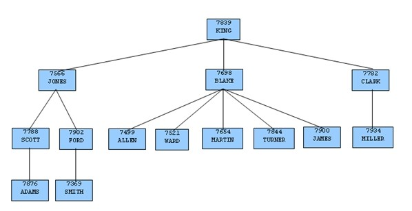

AntDB Oracle兼容性开发者手册

文档日期： 2020/10/12

AISWare AntDB Oracle兼容参考手册

**文档约定**

| 约定对象             | 内容                                                                |
|----------------------|---------------------------------------------------------------------|
| 运行数据库的系统帐号 | 文中统一采用antdb作为运行数据库的系统帐号。                         |
| 数据库管理员名称     | 文中统一采用antdb作为数据库管理员名称。                             |
| 示例环境             | 除安装卸载相关内容以外的章节，文中示例都采用Linux环境进行示例操作。 |

1.  本文档主要对新增的特性进行了介绍。

2.  关于PostgreSQL原有特性的详细介绍，请参考《PostgreSQL11 中文文档.chm》。

3.  关于兼容的oracle语法特性的详细介绍，请参考Oracle官方网站。

# 入门

## **基础知识**

### **AntDB介绍**

本指南介绍了在AISWare AntDB（以下简称AntDB）中具备的Oracle兼容特性。Oracle兼容特性是指对于运行在Oracle环境下的应用程序，只需要对其程序代码进行很小的改动（在一些情况下甚至不进行改动），就可以使这个应用程序运行在AntDB环境中。

AntDB包括了的大量功能特性，允许开发人员开发兼容PostgreSQL或者Oracle的数据库程序。本指南只针对与Oracle相兼容的功能特性。如果要学习AntDB的所有功能特性，请参考AntDB文档集。

在AntDB中开发与Oracle兼容的程序时，需要特别关注在设计程序时需要用到功能特性。例如开发一个与Oracle兼容的应用程序意味着要做出如下选择：

使用与Oracle相兼容的数据类型定义应用程序用到的数据库表。

-   应用程序要使用与Oracle兼容的SQL语句。

-   在SQL语句和程序逻辑中使用与Oracle兼容的系统和内置函数。

-   使用与Oracle兼容的存储过程语言创建服务器端的程序逻辑，如存储过程，函数。

-   使用与Oracle数据字典相兼容系统目录视图。

上面这些特性在AntDB单机版本都可以提供。

在本指南的其余部分中对这些特性中的每一项进行了详细解释。

### **访问数据库**

您可以使用如下方法访问数据库：

1.  运行AntDB交互式命令行程序psql，它允许您交互地输入、编辑和执行SQL命令。

2.  使用我们现有的图形前端工具，比如pgAdmin或者带ODBC或JDBC支持的办公套件来管理数据库。

3.  使用某种语言接口或者驱动编写一个客户端应用程序来访问数据库，如libpq，JDBC，ODBC等接口。

**示例**

下面使用psql命令以antDB用户连接到postgres数据库。在连接后设置当前会话的语法为ORACLE，然后执行SQL语句表的过程：

```
[antdb@localhost ~]$ psql -U antdb -d postgres  -p 40009 
psql (12.3)
Type "help" for help.

postgres=# set grammar to oracle;
SET
postgres=# select now() from dual;
              NOW()                
------------------------------------
 2020-10-15 10:17:37.939801 +08:00
(1 row)

```


## **更新说明**

本章节列出了在AntDB单机版本中新增加的Oracle兼容特性。

## **本指南中的相关书写约定**

在本手册中使用了特定的排版习惯约定，用来解释不同命令，语句，程序，示例等等的含义和用法。这部分提供了关于排版习惯的总结。

在下面的叙述中，一个术语是指一个词或者一组词，可以是编程语言关键字，用户提供的值，文字等等。一个术语的确切含义是根据它所在的环境而决定的。

-   对于经常出现的术语，如在示例中使用的SQL命令，表名和列名，编程语言的关键字等等，使用灰色背景的字体。

-   管道符号｜表示对管道任意一侧术语的选择。这个符号是用来分隔在方括号（这是可选项）或括号（这是必选项）内2个或2个以上不同的术语。

-   方括号［］表示可以替换括号中的一个术语。例如，表达式[a\|b]表示可以选择“a"或“b”中的一个，或者两个都不选。

-   大括号｛｝表示必须使用括号中的一个术语。例如，表达式{a\|b}表示必须使用“a"或"b"中的一个。

-   省略号...用于表示可以重复正在处理的术语。例如， 我们可以使用表达式[ a \|
    b]得到这样一个序列“b a a b a”。

## **设置Oracle兼容配置参数**

默认数据库语法为postgres，AntDB支持在服务器级别、会话级别、语句级别的兼容性开关设置。

### **服务器级别**

登录adbmgr，设置所有coordinator的grammar参数：

```
postgres=# set coordinator all (grammar=oracle);
SET PARAM
postgres=# show param cd1 grammar;
          type          | status |             message              
------------------------+--------+------------------------------------
 coordinator master cd1 | t      | debug_print_grammar = off       +
                        |        | grammar = oracle
(1 row)

```

连接Coordinator节点，登录数据库，查看语法参数，并执行Oracle语法语句：

```
show grammar ;

 grammar 
----------------
 oracle
(1 row)

select * from dual;

 DUMMY 
--------------
 X
(1 row)
```


### **会话级别**

如果没有进行服务器级别设置，默认登录数据库后的语法为postgres：

```
show grammar ;
 grammar  
-----------------
 postgres
(1 row)
```


此时执行Oracle语法的语句，会报错：

```
select * from dual;
ERROR:  relation "dual" does not exist
LINE 1: select * from dual;   
```


session 级别切换到Oracle语法，再次执行Oracle语法的语句：

```
postgres=# set grammar to oracle;
SET
postgres=# show grammar ;
 grammar 
---------
 oracle
(1 row)
postgres=# select * from dual;
 DUMMY 
-------
 X
(1 row) 
```


执行成功。

### **语句级别**

如果仅仅是某条语句想使用Oracle语法，则可以用hint的方式指定语法，在执行SQL语句的开头加上“/*ora*/”标记：

```
postgres=# show grammar ;
 grammar  
----------
 postgres
(1 row)
postgres=# /*ora*/select * from dual;
 DUMMY 
-------
 X
(1 row)
```


**grammar**参数

该参数决定了使用数据库时的兼容类型。参数类型属于数据库服务端会话级可变参数，可以设置的值包括：

postgres：采用和PostgreSQL兼容的类型。是该参数的缺省值；

oracle：采用和Oracle兼容的类型；

## **关于本指南中的示例**

在本指南中的示例都是通过PSQL程序来演示的。为更加清楚演示示例中的要点，会省略掉运行PSQL时出现的一些提示。

注意下面这些要点：

为了产生本指南中示例的运行结果，必须在Oracle兼容配置和缺省配置（postgres语法）之间做出选择，方式参考前一小节。我们可以在PSQL中使用下面的命令检测缺省的Oracle兼容性配置，然后查看是否显示出下面这个输出结果。

```
postgres=# show grammar ;
 grammar 
---------
 oracle
(1 row)
```


# SQL语言入门教程

本章为关系型数据库系统的初学者提供了关于SQL语言的介绍。在下面的示例中会讨论到基本SQL数据库操作，例如创建数据表，向表中插入记录，查询以及更新记录。

同时在这章中也会讨论更多的高级概念例如视图，外键和事务。

## **基本说明**

AISWare AntDB是一种关系型数据库管理系统（RDBMS），用于管理在关系中存储的数据。对一张表来说，关系实际上是一个数学上的术语。在表中存储数据的概念现在为大家所熟知，我们可能会把它当成唯一一种存储数据的形式。但是这里还有其它一些数据库系统的组织形式。在类似UNIX操作系统上的文件和目录系统就是一个层次型数据库系统的示例。

每一张表都是一个带有名称的记录集。在表中每条记录都是一个相同的列集合，而每一列都属于特定的数据类型。每一条记录中列的顺序都是固定的。重要的一点是要记住，SQL语言不能确保记录在表中按照的固定顺序出现（尽管为了显示，可以对记录进行排序输出）。

### **示例数据库**

在这个文档的整个内容中，我们将使用一个示例数据库来帮助我们解释一些从基本到高级的数据库概念。

#### 安装示例数据库

当安装AntDB时，会自动创建一个名称为postgres的数据库。在这个示例数据库中创建本指南中要用到所有表和程序。

表和程序将在搜索路径中第一个模式中创建，用户必须在这个模式上有权限创建表和存储过程。通过使用下列命令，可以显示搜索路径。

```
SHOW SEARCH_PATH;
```


我们可以在PSQL中使用命令来修改搜索路径。

本示例中使用sql语句与oracle语法不同的地方：

-   执行存储过程之前需要设置

```
\set PLSQL_MODE ON
```


-   当存储过程没有参数的时候，Oracle中可以只写存储过程名，不加括号；但是在AntDB中，需要存储过程名字后加空括号。

```
Oracle：create procedure name is ……
AntDB：create procedure name() is ……
```


-   存储过程返回使用return，不要使用returns

#### 示例数据库的介绍

示例数据库的内容是一个组织内雇员的一些情况。

它包含了三种类型的记录：雇员个人信息记录，部门信息记录和雇员历史信息记录。

每一个雇员都有一个标识号码，姓名，开始工作时间，薪水，和主管经理。一些雇员除了薪水外，还有佣金。所有与雇员相关的信息都存放在表emp中。

由于在示例中公司是分布在不同的区域，数据库会保持对公司各个部门地理位置的跟踪。每个公司雇员都会被分配到一个部门。每个部门由唯一的部门编号和名称来标识。每个部门和一个地理位置相关联。所有与部门相关的信息存放在表dept中。

因为一些雇员已经为公司工作了很长时间，在不同的职位上工作过，接受过加薪，或者调换过工作部门，所以公司同时也跟踪雇员的工作信息。当雇员状态发生改变的时候，公司会记录在前一个职位的结束日期。同时为该雇员增加一条新工作职位信息的记录，内容是新工作职位的开始日期，工作名称，部门，薪水，和状态改变的原因。所有雇员记录的历史信息都在表jobhist中。

下面是整个示例数据库表的实体关系图。


执行下面的sql语句创建相关表。

```
set grammar to oracle;
BEGIN;
--
--  Create and load tables used in the documentation examples.
--
--  Create the 'dept' table
--
CREATE TABLE dept (
deptno  NUMBER(2) NOT NULL CONSTRAINT dept_pk PRIMARY KEY,
dname   VARCHAR2(14) CONSTRAINT dept_dname_uq UNIQUE,
loc VARCHAR2(13)
);
--
--  Create the 'emp' table
--
CREATE TABLE emp (
empno   NUMBER(4) NOT NULL CONSTRAINT emp_pk PRIMARY KEY,
ename   VARCHAR2(10),
job VARCHAR2(9),
mgr NUMBER(4),
hiredate    DATE,
sal NUMBER(7,2) CONSTRAINT emp_sal_ck CHECK (sal > 0),
comm    NUMBER(7,2),
deptno  NUMBER(2) CONSTRAINT emp_ref_dept_fk
REFERENCES dept(deptno)
);
--
--  Create the 'jobhist' table
--
CREATE TABLE jobhist (
empno   NUMBER(4) NOT NULL,
startdate   DATE NOT NULL,
enddate DATE,
job VARCHAR2(9),
sal NUMBER(7,2),
comm    NUMBER(7,2),
deptno  NUMBER(2),
chgdesc VARCHAR2(80),
CONSTRAINT jobhist_pk PRIMARY KEY (empno, startdate),
CONSTRAINT jobhist_ref_emp_fk FOREIGN KEY (empno)
REFERENCES emp(empno) ON DELETE CASCADE,
CONSTRAINT jobhist_ref_dept_fk FOREIGN KEY (deptno)
REFERENCES dept (deptno) ON DELETE SET NULL,
CONSTRAINT jobhist_date_chk CHECK (startdate <= enddate)
);
--
--  Create the 'salesemp' view
--
CREATE OR REPLACE VIEW salesemp AS
SELECT empno, ename, hiredate, sal, comm FROM emp WHERE job = 'SALESMAN';
--
--  Sequence to generate values for function 'new_empno'.
--
CREATE SEQUENCE next_empno START WITH 8000 INCREMENT BY 1;

--
--  Load the 'dept' table
--
INSERT INTO dept VALUES (10,'ACCOUNTING','NEW YORK');
INSERT INTO dept VALUES (20,'RESEARCH','DALLAS');
INSERT INTO dept VALUES (30,'SALES','CHICAGO');
INSERT INTO dept VALUES (40,'OPERATIONS','BOSTON');
--
--  Load the 'emp' table
--
INSERT INTO emp VALUES (7369,'SMITH','CLERK',7902,'17-DEC-80',800,NULL,20);
INSERT INTO emp VALUES (7499,'ALLEN','SALESMAN',7698,'20-FEB-81',1600,300,30);
INSERT INTO emp VALUES (7521,'WARD','SALESMAN',7698,'22-FEB-81',1250,500,30);
INSERT INTO emp VALUES (7566,'JONES','MANAGER',7839,'02-APR-81',2975,NULL,20);
INSERT INTO emp VALUES (7654,'MARTIN','SALESMAN',7698,'28-SEP-81',1250,1400,30);
INSERT INTO emp VALUES (7698,'BLAKE','MANAGER',7839,'01-MAY-81',2850,NULL,30);
INSERT INTO emp VALUES (7782,'CLARK','MANAGER',7839,'09-JUN-81',2450,NULL,10);
INSERT INTO emp VALUES (7788,'SCOTT','ANALYST',7566,'19-APR-87',3000,NULL,20);
INSERT INTO emp VALUES (7839,'KING','PRESIDENT',NULL,'17-NOV-81',5000,NULL,10);
INSERT INTO emp VALUES (7844,'TURNER','SALESMAN',7698,'08-SEP-81',1500,0,30);
INSERT INTO emp VALUES (7876,'ADAMS','CLERK',7788,'23-MAY-87',1100,NULL,20);
INSERT INTO emp VALUES (7900,'JAMES','CLERK',7698,'03-DEC-81',950,NULL,30);
INSERT INTO emp VALUES (7902,'FORD','ANALYST',7566,'03-DEC-81',3000,NULL,20);
INSERT INTO emp VALUES (7934,'MILLER','CLERK',7782,'23-JAN-82',1300,NULL,10);
--
--  Load the 'jobhist' table
--
INSERT INTO jobhist VALUES (7369,'17-DEC-80',NULL,'CLERK',800,NULL,20,'New Hire');
INSERT INTO jobhist VALUES (7499,'20-FEB-81',NULL,'SALESMAN',1600,300,30,'New Hire');
INSERT INTO jobhist VALUES (7521,'22-FEB-81',NULL,'SALESMAN',1250,500,30,'New Hire');
INSERT INTO jobhist VALUES (7566,'02-APR-81',NULL,'MANAGER',2975,NULL,20,'New Hire');
INSERT INTO jobhist VALUES (7654,'28-SEP-81',NULL,'SALESMAN',1250,1400,30,'New Hire');
INSERT INTO jobhist VALUES (7698,'01-MAY-81',NULL,'MANAGER',2850,NULL,30,'New Hire');
INSERT INTO jobhist VALUES (7782,'09-JUN-81',NULL,'MANAGER',2450,NULL,10,'New Hire');
INSERT INTO jobhist VALUES (7788,'19-APR-87','12-APR-88','CLERK',1000,NULL,20,'New Hire');
INSERT INTO jobhist VALUES (7788,'13-APR-88','04-MAY-89','CLERK',1040,NULL,20,'Raise');
INSERT INTO jobhist VALUES (7788,'05-MAY-90',NULL,'ANALYST',3000,NULL,20,'Promoted to Analyst');
INSERT INTO jobhist VALUES (7839,'17-NOV-81',NULL,'PRESIDENT',5000,NULL,10,'New Hire');
INSERT INTO jobhist VALUES (7844,'08-SEP-81',NULL,'SALESMAN',1500,0,30,'New Hire');
INSERT INTO jobhist VALUES (7876,'23-MAY-87',NULL,'CLERK',1100,NULL,20,'New Hire');
INSERT INTO jobhist VALUES (7900,'03-DEC-81','14-JAN-83','CLERK',950,NULL,10,'New Hire');
INSERT INTO jobhist VALUES (7900,'15-JAN-83',NULL,'CLERK',950,NULL,30,'Changed to Dept 30');
INSERT INTO jobhist VALUES (7902,'03-DEC-81',NULL,'ANALYST',3000,NULL,20,'New Hire');
INSERT INTO jobhist VALUES (7934,'23-JAN-82',NULL,'CLERK',1300,NULL,10,'New Hire');

COMMIT;

```


在下一节中将开始讨论基本SQL命令。

#### 创建一张新的数据表

通过指定表名，以及表中所有列的名称和数据类型，我们可以创建一张新的表。下面是示例表emp的简化版本，只包括在定义表时需要的最基本信息。

```
CREATE TABLE emp (
empno	NUMBER(4),
ename	VARCHAR2(10),
job	 VARCHAR2(9),
mgr	 NUMBER(4),
hiredate	DATE,
sal	NUMBER(7,2),
comm	NUMBER(7,2),
deptno	NUMBER(2)
);
```


在PSQL中可以把这条命令以多行形式输入。当遇到一个分号的时候，PSQL认为命令输入结束。

我们可以在SQL命令中任意使用空格（例如，空格，TABs和换行符）。这样在输入命令时排版方式可以和上面的不同，我们甚至可以在一行中写出整条命令。注释的开始位置是由两个破折号表示的，在破折号后面直到命令结束的所有字符都会被忽略掉。对于关键词和标识符来说，除了用双引号引起来的标识符保持原有的大小写形式外（在上面的示例没有这样的操作），SQL语句是不区分大小写的。

VARCHAR2(10)是一种数据类型，可以存储长度最大为10个字符的任意字符串。NUMBER(7,2）是精度为7，范围为2的数值。NUMBER(4)是精度为4，范围是0的数值。

AntDB支持常用的SQL数据类型，例如INTEGER，SMALLINT，NUMBER，REAL，DOUBLE PRECISION，CHAR，VARCHAR2，DATE 和 TIMESTAMP以及这些类型的各种同义词。

如果不再需要一张表或者想以相同的表名创建不同定义的表，那么可以使用下列命令删除它：

```
DROP TABLE tablename; 
```


#### 向表中插入一条记录

INSERT语句用于向一张表中插入记录：

```
INSERT INTO emp VALUES (7369,'SMITH','CLERK',7902,'17-DEC-80',800,NULL,20);
```


需要注意的是所有的数据类型都不使用明确的输入格式。如在这个示例中，必须用单引号把非数值类型的常量引起来。我们可以使用多种格式的日期类型值，但是对于本教程来说，我们坚持使用含义明确的格式。

迄今为止在SQL命令使用的语法中，要求必须记住列在表中的顺序。但这里另外一种语法，允许将所有列名不按照在表中的顺序列出。

```
INSERT INTO emp(empno,ename,job,mgr,hiredate,sal,comm,deptno) VALUES (7499,'ALLEN','SALESMAN',7698,'20-FEB-81',1600,300,30); 
```


如果希望在语句中只出现某些列，那么可以根据不同的顺序写出这些列，例如，如果佣金是未知的，我们可以这样写：

```
INSERT INTO emp(empno,ename,job,mgr,hiredate,sal,deptno) VALUES (7369,'SMITH','CLERK',7902,'17-DEC-80',800,20);
```


很多开发人员认为与在隐含方式下依赖列的顺序相比，明确地写出列是一种更好的书写风格。

#### 查询表

SQL命令中的SELECT语句用于对表进行查询操，并且从中获取数据。这个语句分成了选择列表（列出要返回数据列的内容），表列表（列出要从哪些表中获取数据），和可选的条件限定部分（指定限制条件的部分）。下面的查询不以特定的顺序列出关于所有雇员信息的的所有列。

```
SELECT * FROM emp;
```


在这里，在选择列表中的“\*”表示输出所有列。下面是这个查询的输出：

```
EMPNO | ENAME  |    JOB    | MGR   |      HIREDATE        | SAL  | COMM | DEPTNO 
------+--------+-----------+-------+----------------------+------+------+--------
 7369 | SMITH  | CLERK     | 7902  | 1980-12-17 00:00:00  |  800 |      |     20
 7499 | ALLEN  | SALESMAN  | 7698  | 1981-02-20 00:00:00  | 1600 |  300 |     30
 7521 | WARD   | SALESMAN  | 7698  | 1981-02-22 00:00:00  | 1250 |  500 |     30
 7566 | JONES  | MANAGER   | 7839  | 1981-04-02 00:00:00  | 2975 |      |     20
 7654 | MARTIN | SALESMAN  | 7698  | 1981-09-28 00:00:00  | 1250 | 1400 |     30
 7698 | BLAKE  | MANAGER   | 7839  | 1981-05-01 00:00:00  | 2850 |      |     30
 7782 | CLARK  | MANAGER   | 7839  | 1981-06-09 00:00:00  | 2450 |      |     10
 7788 | SCOTT  | ANALYST   | 7566  | 1987-04-19 00:00:00  | 3000 |      |     20
 7839 | KING   | PRESIDENT |       | 1981-11-17 00:00:00  | 5000 |      |     10
 7844 | TURNER | SALESMAN  | 7698  | 1981-09-08 00:00:00  | 1500 |    0 |     30
 7876 | ADAMS  | CLERK     | 7788  | 1987-05-23 00:00:00  | 1100 |      |     20
 7900 | JAMES  | CLERK     | 7698  | 1981-12-03 00:00:00  |  950 |      |     30
 7902 | FORD   | ANALYST   | 7566  | 1981-12-03 00:00:00  | 3000 |      |     20
 7934 | MILLER | CLERK     | 7782  | 1982-01-23 00:00:00  | 1300 |      |     10
(14 rows)
```


在选择列表中可以指定任意形式的表达式。例如，可以这样做：

```
SELECT ename, sal, sal * 24 AS yearly_salary, deptno FROM emp;

 ENAME  | SAL  | YEARLY_SALARY | DEPTNO 
--------+------+---------------+--------
 SMITH  |  800 |         19200 |     20
 ALLEN  | 1600 |         38400 |     30
 WARD   | 1250 |         30000 |     30
 JONES  | 2975 |         71400 |     20
 MARTIN | 1250 |         30000 |     30
 BLAKE  | 2850 |         68400 |     30
 CLARK  | 2450 |         58800 |     10
 SCOTT  | 3000 |         72000 |     20
 KING   | 5000 |        120000 |     10
 TURNER | 1500 |         36000 |     30
 ADAMS  | 1100 |         26400 |     20
 JAMES  |  950 |         22800 |     30
 FORD   | 3000 |         72000 |     20
 MILLER | 1300 |         31200 |     10
(14 rows)

```


在这里需要注意的是如何使用AS子句重新标识输出列。(AS是一个可选的子句)

在查询中可以使用WHERE子句来指定哪些记录是需要的。WHERE子句包含一个布尔类型表达式，只有满足布尔表达式返回值为真的记录，才能返回。通常布尔操作符（AND，OR和NOT）在限定条件中使用。例如，我们使用下面的查询获取在编号为20的部门工作，薪水超过\$1000.00的雇员记录。

```
SELECT ename, sal, deptno FROM emp WHERE deptno = 20 AND sal > 1000;

 ENAME | SAL  | DEPTNO 
-------+------+--------
 JONES | 2975 |     20
 SCOTT | 3000 |     20
 ADAMS | 1100 |     20
 FORD  | 3000 |     20
(4 rows)

```


你可以要求查询的输出结果按照排序的顺序输出：

```
SELECT ename, sal, deptno FROM emp ORDER BY ename;

 ENAME  | SAL  | DEPTNO 
--------+------+--------
 ADAMS  | 1100 |     20
 ALLEN  | 1600 |     30
 BLAKE  | 2850 |     30
 CLARK  | 2450 |     10
 FORD   | 3000 |     20
 JAMES  |  950 |     30
 JONES  | 2975 |     20
 KING   | 5000 |     10
 MARTIN | 1250 |     30
 MILLER | 1300 |     10
 SCOTT  | 3000 |     20
 SMITH  |  800 |     20
 TURNER | 1500 |     30
 WARD   | 1250 |     30
(14 rows)

```


你也可以要求查询结果中删除重复记录:

```
SELECT DISTINCT job FROM emp;

    JOB    
------------
 CLERK
 PRESIDENT
 MANAGER
 SALESMAN
 ANALYST
(5 rows)
```


在下一节中演示了如何使用一个查询从多张表中获取记录。

#### 表之间的连接操作

到现在为止，我们使用的查询语句一次只访问一张表。但是查询语句实际上可以一次访问多张表，或者以同时处理表中多条记录的方式访问同一张表。我们把同时访问相同或不同表中多条记录的查询称为连接查询。例如，假如你想列出所有的雇员记录以及相关的部门名称和位置，就需要在表emp每一条记录的deptno列和表dept所有记录中的deptno列之间作出比较，然后查询出在两张表中相关值匹配的记录。我们使用下面这个查询完成这个操作。

```
SELECT emp.ename, emp.sal, dept.deptno, dept.dname, dept.loc FROM emp, dept WHERE emp.deptno = dept.deptno;

 ENAME  | SAL  | DEPTNO |   DNAME    |   LOC    
--------+------+--------+------------+----------
 SMITH  |  800 |     20 | RESEARCH   | DALLAS
 ALLEN  | 1600 |     30 | SALES      | CHICAGO
 WARD   | 1250 |     30 | SALES      | CHICAGO
 JONES  | 2975 |     20 | RESEARCH   | DALLAS
 MARTIN | 1250 |     30 | SALES      | CHICAGO
 BLAKE  | 2850 |     30 | SALES      | CHICAGO
 CLARK  | 2450 |     10 | ACCOUNTING | NEW YORK
 SCOTT  | 3000 |     20 | RESEARCH   | DALLAS
 KING   | 5000 |     10 | ACCOUNTING | NEW YORK
 TURNER | 1500 |     30 | SALES      | CHICAGO
 ADAMS  | 1100 |     20 | RESEARCH   | DALLAS
 JAMES  |  950 |     30 | SALES      | CHICAGO
 FORD   | 3000 |     20 | RESEARCH   | DALLAS
 MILLER | 1300 |     10 | ACCOUNTING | NEW YORK
(14 rows)
```


这里需要注意结果集的2个地方

-   结果集中没有符合部门编号为40的记录。这是因为在表emp中没有匹配部门编号为40的记录，所以连接操作忽略了在表dept中不匹配的记录，稍后，我们将看到如何解决这个问题。

-   通常来说，我们更希望列出以表名来限定的输出列，而不是使用“\*”或者像下面这样，没有使用表名进行限定的列名：

```
SELECT ename, sal, dept.deptno, dname, loc FROM emp, dept WHERE emp.deptno = dept.deptno; |
```


因为所有的列都有不同的名称（除了因为两个表中都有名称为deptno的列，必须进行限定），解析器会自动找出这些列所属的表，但是最好是能够在连接查询中使用完全限定的列名。

迄今为止看到的连接查询可以以另一种形式写出来：

```
SELECT emp.ename, emp.sal, dept.deptno, dept.dname, dept.loc FROM emp INNER JOIN dept ON emp.deptno = dept.deptno; 
```


这种语法不像上面的那种用的那么普遍，但是我们把它显示在这里可以帮助你理解下面要说明的问题。

你将注意到在上面连接查询的结果集中，没有返回属于部门编号为40的雇员信息，因此部门编号为40的记录没有出现在输出结果集中。现在，我们要在没有相匹配雇员记录的情况下，在结果中显示属于部门编号为40的记录。需要做的事情是让查询去扫描表dept，并且为每一条记录寻找表emp上所匹配的记录。如果没有找到相匹配的记录，使用“空”值来替代emp表中列的值。我们把这种查询称为外连接（我们到现在为止看到的连接都是内连接）。命令的具体形式如下:

```
SELECT emp.ename, emp.sal, dept.deptno, dept.dname, dept.loc FROM dept LEFT OUTER JOIN emp ON emp.deptno = dept.deptno;

 ENAME  | SAL  | DEPTNO   |   DNAME    |   LOC    
--------+------+----------+------------+----------
 SMITH  |  800 |       20 | RESEARCH   | DALLAS
 ALLEN  | 1600 |       30 | SALES      | CHICAGO
 WARD   | 1250 |       30 | SALES      | CHICAGO
 JONES  | 2975 |       20 | RESEARCH   | DALLAS
 MARTIN | 1250 |       30 | SALES      | CHICAGO
 BLAKE  | 2850 |       30 | SALES      | CHICAGO
 CLARK  | 2450 |       10 | ACCOUNTING | NEW YORK
 SCOTT  | 3000 |       20 | RESEARCH   | DALLAS
 KING   | 5000 |       10 | ACCOUNTING | NEW YORK
 TURNER | 1500 |       30 | SALES      | CHICAGO
 ADAMS  | 1100 |       20 | RESEARCH   | DALLAS
 JAMES  |  950 |       30 | SALES      | CHICAGO
 FORD   | 3000 |       20 | RESEARCH   | DALLAS
 MILLER | 1300 |       10 | ACCOUNTING | NEW YORK
        |      |       40 | OPERATIONS | BOSTON
(15 rows)
```


上面的这个查询称为左外连接，因为在连接操作符左边表的每条记录将在输出中出现至少一次，而在连接操作符右边的表只输出与连接操作符左边表中记录相匹配的记录。当从连接操作符左边表查询出一条记录，而在操作符右侧没有相匹配的记录，那么在右边表中的列将用空值替代。

另外一种外连接的语法是在WHERE子句的连接条件中使用外连接操作符“（+）”。外连接操作符的位置是在表中列名的后面，对于没有匹配的记录，将使用空值替代这些列的值。所以对于在表dept中所有和表emp不匹配的记录来说，AntDB都会为任何在选择列表中包含列emp的表达式返回一个空值。因此，上面的示例可以重新写成下面这个样子：

```
SELECT emp.ename, emp.sal, dept.deptno, dept.dname, dept.loc FROM dept, emp WHERE emp.deptno(+) = dept.deptno;

 ENAME  | SAL  | DEPTNO |   DNAME    |   LOC    
--------+------+--------+------------+----------
 SMITH  |  800 |     20 | RESEARCH   | DALLAS
 ALLEN  | 1600 |     30 | SALES      | CHICAGO
 WARD   | 1250 |     30 | SALES      | CHICAGO
 JONES  | 2975 |     20 | RESEARCH   | DALLAS
 MARTIN | 1250 |     30 | SALES      | CHICAGO
 BLAKE  | 2850 |     30 | SALES      | CHICAGO
 CLARK  | 2450 |     10 | ACCOUNTING | NEW YORK
 SCOTT  | 3000 |     20 | RESEARCH   | DALLAS
 KING   | 5000 |     10 | ACCOUNTING | NEW YORK
 TURNER | 1500 |     30 | SALES      | CHICAGO
 ADAMS  | 1100 |     20 | RESEARCH   | DALLAS
 JAMES  |  950 |     30 | SALES      | CHICAGO
 FORD   | 3000 |     20 | RESEARCH   | DALLAS
 MILLER | 1300 |     10 | ACCOUNTING | NEW YORK
        |      |     40 | OPERATIONS | BOSTON
(15 rows)

```


我们也可以对同一个表进行连接操作，这种连接称为自连接。例如，假定我们希望找出每个雇员和这个雇员主管经理的名字，那么我们需要在表emp每条记录的mgr列和表emp其它记录中的empno列进行比较。

```
SELECT e1.ename || ' works for ' || e2.ename AS "Employees and their Managers" FROM emp e1, emp e2 WHERE e1.mgr = e2.empno;

Employees and their Managers 
-----------------------------
 SMITH works for FORD
 ALLEN works for BLAKE
 WARD works for BLAKE
 JONES works for KING
 MARTIN works for BLAKE
 BLAKE works for KING
 CLARK works for KING
 SCOTT works for JONES
 TURNER works for BLAKE
 ADAMS works for SCOTT
 JAMES works for BLAKE
 FORD works for JONES
 MILLER works for CLARK
(13 rows)
```


在这里，我们已经在选择列表和连接条件中把表emp重新标识为e1来表示雇员记录，同时在选择列表和连接条件中把表emp标识为e2来表示匹配作为经理的雇员记录，这种形式的化名可以用于在查询中使用来减少输入，例如：

```
SELECT e.ename, e.mgr, d.deptno, d.dname, d.loc FROM emp e, dept d WHERE e.deptno = d.deptno;

 ENAME  | MGR   |   DEPTNO |   DNAME    |   LOC    
--------+-------+----------+------------+-----------
 SMITH  |  7902 |       20 | RESEARCH   | DALLAS
 ALLEN  |  7698 |       30 | SALES      | CHICAGO
 WARD   |  7698 |       30 | SALES      | CHICAGO
 JONES  |  7839 |       20 | RESEARCH   | DALLAS
 MARTIN |  7698 |       30 | SALES      | CHICAGO
 BLAKE  |  7839 |       30 | SALES      | CHICAGO
 CLARK  |  7839 |       10 | ACCOUNTING | NEW YORK
 SCOTT  |  7566 |       20 | RESEARCH   | DALLAS
 KING   |       |       10 | ACCOUNTING | NEW YORK
 TURNER |  7698 |       30 | SALES      | CHICAGO
 ADAMS  |  7788 |       20 | RESEARCH   | DALLAS
 JAMES  |  7698 |       30 | SALES      | CHICAGO
 FORD   |  7566 |       20 | RESEARCH   | DALLAS
 MILLER |  7782 |       10 | ACCOUNTING | NEW YORK
(14 rows)

```


这种形式缩写将在后面会经常遇到。

#### 聚合函数

像大多数的关系型数据库产品一样，AntDB支持聚合函数。聚合函数用于为多条输入记录计算出一个单独的结果。例如，在这里我们可以看到用于在记录集上进行计算的聚合函数COUNT，SUM， AVG (average)，MAX (maximum)和 MIN (minimum)。

例如，我们可以使用下面的查询在表emp中找出最高和最低的薪水：

```
SELECT MAX(sal) highest_salary, MIN(sal) lowest_salary FROM emp;

HIGHEST_SALARY | LOWEST_SALARY 
---------------+-----------------
          5000 |          800
(1 row)

```


如果我们想找出薪水最多的雇员，我们可能会这样尝试：

```
SELECT ename FROM emp WHERE sal = MAX(sal);

ERROR:  aggregate functions are not allowed in WHERE
LINE 1: SELECT ename FROM emp WHERE sal = MAX(sal);
                                          ^
```


这个查询没有运行，因为聚合函数MAX不能在WHERE子句中使用。之所以有这个限制是因为用于聚合计算的记录是由WHERE子句确定的，所以必须在执行聚合函数前执行WHERE子句。但是通过使用子查询，我们可以重新使用查询来得到需要的结果。

```
SELECT ename FROM emp WHERE sal = (SELECT MAX(sal) FROM emp);

 ENAME 
------------
 KING
(1 row)
```


子查询是独立运行的，用于在外层查询的范围之外找出它自己的运行结果。

当在查询中与GROUP BY子句结合使用的时候，聚合函数是非常有用的。例如，下面的查询获得了每个部门内最高的薪水。

```
SELECT deptno, MAX(sal) FROM emp GROUP BY deptno;

  DEPTNO | MAX(SAL)  
---------+-----------
      10 |      5000
      30 |      2850
      20 |      3000
(3 rows)
```


这个查询为每个部门产生一条输出记录。每个聚合函数的结果是在所匹配部门的记录上计算得出的。我们可以通过使用HAVING子句来过滤这些分组后的记录。

```
SELECT deptno, MAX(sal) FROM emp GROUP BY deptno HAVING AVG(sal) > 2000;

  DEPTNO | MAX(SAL)  
---------+-----------
      10 |      5000
      20 |      3000
(2 rows)
```


这个查询对于那些平均薪水大于2000的部门得出了相同的结果。

最后的这个查询用于获得在每个部门工作职责是分析员，所在部门的平均薪水大于2000，且拥有最多薪水的职员。

```
SELECT deptno, MAX(sal) FROM emp WHERE job = 'ANALYST' GROUP BY deptno HAVING AVG(sal) >
2000;

  DEPTNO | MAX(SAL)  
---------+-----------
      20 |      3000
(1 row)
```


在WHERE和HAVING子句之间有一个细微的区分。WHERE子句在分组和聚合函数运行前过滤出符合条件的记录。而HAVING子句是在对记录分组完成后并且已使用聚合函数在每个组上计算完毕后，才将符合条件的记录过滤出。

所以在前面的示例中，只考虑了工作职责为分析员的情况。在这个输出的子集中，雇员信息根据部门分组，并且只有那些在组中工作职责为分析员，且平均薪水大于2000的记录才出现在最后结果中。最后的结果只有部门编号为20的组符合条件，它的最高薪水是3000。

#### 更新操作

我们可以使用UPDATE命令来更新已存在记录中列的值。例如，下列的命令显示了每一个有经理职位的雇员得到百分之十加薪之前和之后结果。

```
SELECT ename, sal FROM emp WHERE job = 'MANAGER';

 ENAME | SAL  
-------+------
 JONES | 2975
 BLAKE | 2850
 CLARK | 2450
(3 rows)

UPDATE emp SET sal = sal * 1.1 WHERE job = 'MANAGER';

SELECT ename, sal FROM emp WHERE job = 'MANAGER';

 ENAME |  SAL   
-------+--------
 JONES | 3272.5
 BLAKE |   3135
 CLARK |   2695
(3 rows)
```


#### 删除操作

DELETE命令用于从表中删除记录。例如，下列的命令显示在删除部门编号为20的所有雇员信息之前和之后的结果。

```
SELECT ename, deptno FROM emp;

 ENAME  | DEPTNO 
--------+--------
 SMITH  |     20
 ALLEN  |     30
 WARD   |     30
 MARTIN |     30
 SCOTT  |     20
 KING   |     10
 TURNER |     30
 ADAMS  |     20
 JAMES  |     30
 FORD   |     20
 MILLER |     10
 JONES  |     20
 BLAKE  |     30
 CLARK  |     10
(14 rows)

DELETE FROM emp WHERE deptno = 20;

SELECT ename, deptno FROM emp;

 ENAME  | DEPTNO 
--------+---------------
 ALLEN  |     30
 WARD   |     30
 MARTIN |     30
 KING   |     10
 TURNER |     30
 JAMES  |     30
 MILLER |     10
 BLAKE  |     30
 CLARK  |     10
(9 rows)
```


在使用不带有WHERE子句的DELETE命令时，我们应该特别小心。如下所示：

```
DELETE FROM tablename; 
```


这个语句将从指定的表中删除所有记录。在执行这样的操作前，系统不会要求确认是否进行这样的操作。

### **高级概念**

在前面一章中，我们介绍了在AntDB中使用SQL命令去存储和访问数据的基本方法。这章讨论了更多SQL命令的高级特性，可以用来简化对于数据的管理并且防止数据的丢失或损坏。

#### 视图

先看看下面的这条SELECT命令：

```
SELECT ename, sal, sal * 24 AS yearly_salary, deptno FROM emp;

 ENAME  | SAL  | YEARLY_SALARY | DEPTNO 
--------+------+---------------+--------
 SMITH  |  800 |         19200 |     20
 ALLEN  | 1600 |         38400 |     30
 WARD   | 1250 |         30000 |     30
 JONES  | 2975 |         71400 |     20
 MARTIN | 1250 |         30000 |     30
 BLAKE  | 2850 |         68400 |     30
 CLARK  | 2450 |         58800 |     10
 SCOTT  | 3000 |         72000 |     20
 KING   | 5000 |        120000 |     10
 TURNER | 1500 |         36000 |     30
 ADAMS  | 1100 |         26400 |     20
 JAMES  |  950 |         22800 |     30
 FORD   | 3000 |         72000 |     20
 MILLER | 1300 |         31200 |     10
(14 rows)

```


如果这个查询经常用到，那么可以使用这个查询来创建一个视图。这样就能以简便的方式重复使用这个查询，而无需每次重复输入整条SELECT命令。

```
CREATE VIEW employee_pay AS SELECT ename, sal, sal * 24 AS yearly_salary, deptno FROM emp; 
```


在执行查询的过程中，我们可以像使用普通表名一样地使用视图名称employee_pay。

```
SELECT * FROM employee_pay;

 ENAME  | SAL  | YEARLY_SALARY | DEPTNO 
--------+------+---------------+---------
 SMITH  |  800 |         19200 |     20
 ALLEN  | 1600 |         38400 |     30
 WARD   | 1250 |         30000 |     30
 JONES  | 2975 |         71400 |     20
 MARTIN | 1250 |         30000 |     30
 BLAKE  | 2850 |         68400 |     30
 CLARK  | 2450 |         58800 |     10
 SCOTT  | 3000 |         72000 |     20
 KING   | 5000 |        120000 |     10
 TURNER | 1500 |         36000 |     30
 ADAMS  | 1100 |         26400 |     20
 JAMES  |  950 |         22800 |     30
 FORD   | 3000 |         72000 |     20
 MILLER | 1300 |         31200 |     10
(14 rows)

```


充分使用视图是良好设计SQL数据库的关键部分。视图提供了一致性接口来封装数据表的详细结构，而表的结构在程序改动的时候是可以改变。

我们可以在使用真实表的地方使用视图。通常在其他视图的基础上创建视图这种使用方式不常见。

#### 外键

假如想确保所有的雇员属于一个已存在的部门，那么这种约束就称为维护数据的参照完整性。在最简化的数据库系统中，是通过如下方式实现：首先在表dept中检查是否有匹配的记录存在，然后插入或拒绝新的雇员记录。这种方式有很多问题，并且非常的不方便。AntDB为用户提供了一个更为简便的实现方式。

我们在章节1.1.3部分出现的表emp上加了一个外键，修改后的表emp是下面这个样子：

```
CREATE TABLE emp (
empno	NUMBER(4) NOT NULL CONSTRAINT emp_pk PRIMARY KEY,
ename	VARCHAR2(10),
job	VARCHAR2(9),
mgr	NUMBER(4),
hiredate	DATE,
sal	NUMBER(7,2),
comm	NUMBER(7,2),
deptno	NUMBER(2) CONSTRAINT emp_ref_dept_fk
REFERENCES dept(deptno)
);
```


如果在表emp中尝试运行下面的这条INSERT命令，那么外键约束emp_ref_dept_fk要确保部门编号为50的记录在表dept中存在。而事实上因为这个部门不存在，所以系统拒绝执行这个命令。

```
INSERT INTO emp VALUES (8000,'JONES','CLERK',7902,'17-AUG-07',1200,NULL,50);

ERROR:	insert or update on table "emp" violates foreign key constraint "emp_ref_dept_fk"
DETAIL:	Key (deptno)=(50) is not present in table "dept".
```


通过利用外键的系统行为，可以对程序进行更良好的调整。正确使用外键会改进你所设计的数据库程序的质量，所以我们鼓励你学习更多关于外键的知识。

#### ROWID列

rowid是一行的唯一标识，具有全局唯一性。

与rowid相关的参数设置有2个。

1. default_with_rowids： 用于控制rowid开关。
2. default_with_rowid_id ：用于生成rowid值的高位，默认值是无效值-1。如果打开开关，需要将此值设置为0-1023，但是不建议设置0和1023，此值在产生第一个rowid值之后不可更改。

 有三种方式打开rowid开关。

- 设置全局开关。

直接修改配置文档postgresql.conf，设置如下参数：

```
default_with_rowids = on
```

此时，在数据库中创建的表都默认会有rowid列。

- session级别设置。

在同一个session内，执行下面的语句，则只有在当前会话中创建的表默认带有rowid列。

```
set default_with_rowids = on
```

- 表级别设置

create table语句加with rowid，如下所示：

```
create table tt(id int, sal int) with rowid;
insert into tt values(1, 1000),(2, 4000),(4, 8000);
select rowid, * from tt;
    ROWID     | ID | SAL  
--------------+----+------
 ZAAAAAAAQAA= |  1 | 1000
 ZQAAAAAAQAA= |  2 | 4000
 ZgAAAAAAQAA= |  4 | 8000
(3 rows)
```

注意：更新一行数据时行，集群版本下，对应行rowid会更新。单机版本下，对应行rowid不会更新。因此，单机版本更加兼容Oracle。

#### ROWNUM伪列

ROWNUM是一个伪列，它的作用就是根据从查询中获取记录的顺序，为每一条记录分配一个递增，唯一的整数值。因此ROWNUM的分配是按照第一条取出记录的ROWNUM是1，第二条取出记录的ROWNUM是2，这样的顺序进行的。

我们可以使用这个特性去限制查询一次所获取的记录总数。在下面的示例中演示了这个特性：

```
SELECT empno, ename, job FROM emp WHERE ROWNUM < 5;

 EMPNO | ENAME |   JOB    
-------+-------+----------
  7369 | SMITH | CLERK
  7499 | ALLEN | SALESMAN
  7521 | WARD  | SALESMAN
  7566 | JONES | MANAGER
(4 rows)
```


ROWNUM的值在结果集的排序操作发生之前把值分配给结果集中的每一条记录。因此，结果集是根据ORDER
BY子句指定的顺序返回。但是正如在下面的示例中看到，在一个升序排序的输出中不是必须用到ROWNUM值。

```
SELECT ROWNUM, empno, ename, job FROM emp WHERE ROWNUM < 5 ORDER BY ename;

 ROWNUM |  EMPNO  | ENAME |   JOB    
--------+---------+-------+----------
      1 |    7876 | ADAMS | CLERK
      2 |    7499 | ALLEN | SALESMAN
      3 |    7698 | BLAKE | MANAGER
      4 |    7782 | CLARK | MANAGER
(4 rows)
```

在下面的示例中显示了如何为表jobhist中每一条记录添加一个序列数。首先在表上增加一个名称为seqno的列，
然后在UPDATE命令中把ROWNUM设定为seqno。这样我们就为表jobhist增加一个带有序列数的列。

```
ALTER TABLE jobhist ADD column seqno NUMBER(3);
UPDATE jobhist SET seqno = ROWNUM;
```


下面的SELECT命令显示了新的seqno值：

```
SELECT seqno, empno, TO_CHAR(startdate,'DD-MON-YY') AS start, job FROM jobhist;

 SEQNO | EMPNO |   START   |    JOB    
-------+-------+-----------+-------------------
     1 |  7369 | 17-DEC-80 | CLERK
     2 |  7499 | 20-FEB-81 | SALESMAN
     3 |  7521 | 22-FEB-81 | SALESMAN
     4 |  7566 | 02-APR-81 | MANAGER
     5 |  7654 | 28-SEP-81 | SALESMAN
     6 |  7698 | 01-MAY-81 | MANAGER
     7 |  7782 | 09-JUN-81 | MANAGER
     8 |  7788 | 19-APR-87 | CLERK
     9 |  7788 | 13-APR-88 | CLERK
    10 |  7788 | 05-MAY-90 | ANALYST
    11 |  7839 | 17-NOV-81 | PRESIDENT
    12 |  7844 | 08-SEP-81 | SALESMAN
    13 |  7876 | 23-MAY-87 | CLERK
    14 |  7900 | 03-DEC-81 | CLERK
    15 |  7900 | 15-JAN-83 | CLERK
    16 |  7902 | 03-DEC-81 | ANALYST
    17 |  7934 | 23-JAN-82 | CLERK
(17 rows)
```


#### 层次查询

层次查询是一种特定类型的查询，用于在基于形成父子关系数据中以层次顺序返回结果集中的记录。层次通常是用一个反转顺序的树结构来表示的。树由相互连接的节点组成。每个节点都可能会连接0个，1个，甚至多个子节点。除了最上层根节点没有父节点外，每个节点都会连接到一个父节点。每棵树都只有一个根节点。而没有任何子节点的节点称为叶节点。树至少有一个叶节点-例如，在最小的树就是由一个单独的节点组成，在这种情况下，这个节点既是根节点，也是叶节点。

在层次查询中，结果集中的记录表示一棵或多棵树中的节点。

注意：如果一条记录出现在多棵树中，这条记录就会在结果集中出现多次。

在查询中层次关系是通过CONNECT BY子句描述的，其中CONNECT
BY子句决定了记录在结果集中返回的顺序。下面显示了SELECT命令中CONNECT
BY子句的使用环境和相关的可选子句。

> SELECT select_list FROM table_expression [ WHERE ...]
>
> [ START WITH start_expression ]
>
> CONNECT BY { PRIOR parent_expr = child_expr |
>
> child_expr = PRIOR parent_expr }
>
> [ ORDER SIBLINGS BY column1 [ ASC | DESC ]
>
> [, column2 [ ASC | DESC ] ] ...
>
> [ GROUP BY ...]
>
> [ HAVING ...]
>
> [ other ...]

select_list是一个或多个表达式，包括结果集的字段。table_expression是一张或多张表或者视图，是获取记录的来源。other是任何附加的合法SELECT子句。在后面的章节中会介绍到与层次查询相关的子句例如START
WITH， CONNECT BY和ORDER SIBLINGS BY等。

##### 定义记录的父/子关系

对于任何指定的记录，它的父节点和子节点是由CONNECT BY子句来决定。CONNECT
BY子句必须由2个表达式组成，用等号进行比较。除此之外，这两个表达式必须以关键字PRIOR为前缀。

确定记录子节点的步骤如下：

1.  在记录上计算parent_expr。

2.  从计算后table_expression中获取的其他记录，然后在这些记录上计算child_expr。

3.  如果parent_expr等于child_expr, 那么说明这条记录是记录的子节点。

4.  在table_expression中的剩余记录中重复上面的计算过程。所有满足步骤3中等式关系的记录都是记录的子节点。

注意：决定一条记录是否是子节点的计算过程是在WHERE子句应用到table_expression前，在table_expression所返回的每一条记录上发生的。

通过迭代式反复执行这个过程一一将前面步骤中找到的子节点当成父节点，我们就构建了一棵由节点组成的颠倒树。当最终子节点集没有他们自己的子节点-也就是那些叶节点的时候，整个过程结束.包含CONNECT BY子句的SELECT命令通常包括START WITH 子句。START WITH子句用于决定作为根节点的记录。例如，初始化为父节点的记录取决于是前面介绍算法的应用。在下一节中将会详细解释这个子句。

##### 选择根节点

START WITH 子句用于确定那些由table_expression查询出来做为根节点的的记录。所有由table_expression选择出来的记录变成树的根节点，其中start_expression计算为”true”。因此，在结果集中潜在树的数量等于根节点的数目。因此，如果没有使用START WITH子句，那么每一条由table_expression返回的记录都是它自己所拥有树的根节点。

##### 在示例程序中树的组织形式

考虑一下在示例程序中的表emp。根据包含主管经理雇员编号的mgr列，表emp中的记录形成一个层次结构。每个雇员最多只有一个经理。KING是公司的董事长，他没有主管经理。由此，记录为KING的mgr列是空的。同时，也存在这样一种可能，一个雇员可以是多个雇员的经理。如下所示，这种关系形成了典型的树状结构图。



为形成一个基于这种关系的层次查询，SELECT命令须包括子句CONNECT BY PRIOR empno = mgr。例如，对于公司的董事长，雇员号为7839的KING，任何mgr列是7839的雇员都是直接向KING汇报。（包括JONES，BLAKE和CLARK，这些都是KING的子节点）。类似的情况下，对于雇员JONES来说，任何其他雇员的mgr列为7566的都是JONES记录的子节点-在这个示例中包括SCOTT和FORD。

组织结构图的最上层是KING，所以在这棵树里只有一个根节点。START WITH mgr IS NULL子句只选择KING作为初始化根节点。

完整的SELECT命令显示如下。

```
SELECT ename, empno, mgr
FROM emp
START WITH mgr IS NULL
CONNECT BY PRIOR empno = mgr;
```


查询输出中记录以从上到下，从左到右的顺序从根节点到叶节点遍历了每一个分枝。下面是这个查询的输出。

```
 ENAME  | EMPNO | MGR  
--------+-------+------
 KING   |  7839 |     
 CLARK  |  7782 | 7839
 BLAKE  |  7698 | 7839
 JONES  |  7566 | 7839
 MILLER |  7934 | 7782
 JAMES  |  7900 | 7698
 TURNER |  7844 | 7698
 MARTIN |  7654 | 7698
 WARD   |  7521 | 7698
 ALLEN  |  7499 | 7698
 FORD   |  7902 | 7566
 SCOTT  |  7788 | 7566
 SMITH  |  7369 | 7902
 ADAMS  |  7876 | 7788
(14 rows)
```


##### 节点的层次

LEVEL是一个伪列，可以在SELECT命令中出现列的地方使用。对于结果集中的每一条记录，LEVEL都会返回一个非零的整数值来指定由这条记录所表示的节点层次深度。分配的顺序是按照根节点LEVEL是1，根节点的直接子节点LEVEL是2进行的。

在下面的查询中对上一条查询命令进行了修改，在语句中加上了LEVEL伪列。除此之外，通过使用LEVEL值，雇员名称被缩进，这样能够进一步强调每条记录在层次中的深度。

```
SELECT LEVEL, LPAD (' ', 2 * (LEVEL - 1)) || ename "employee", empno, mgr
FROM emp START WITH mgr IS NULL
CONNECT BY PRIOR empno = mgr;
```


这个查询的输出如下：

```
 LEVEL |  employee   | EMPNO | MGR  
-------+-------------+-------+------
     1 | KING        |  7839 |     
     2 |   CLARK     |  7782 | 7839
     2 |   BLAKE     |  7698 | 7839
     2 |   JONES     |  7566 | 7839
     3 |     MILLER  |  7934 | 7782
     3 |     JAMES   |  7900 | 7698
     3 |     TURNER  |  7844 | 7698
     3 |     MARTIN  |  7654 | 7698
     3 |     WARD    |  7521 | 7698
     3 |     ALLEN   |  7499 | 7698
     3 |     FORD    |  7902 | 7566
     3 |     SCOTT   |  7788 | 7566
     4 |       SMITH |  7369 | 7902
     4 |       ADAMS |  7876 | 7788
(14 rows)

```


##### 排序同层次节点

同层次节点共享一个父节点，并且是在相同层次上的节点。例如，在上面的输出中，雇员 ALLEN，WARD，MARTIN，TURNER和JAMES 就是同层次节点，这是因为他们在相同层次上，有一个共同的一个父节点BLAKE。JONES，BLAKE和 CLARK也是同层次节点，因为他们在相同的层次上，并且拥有共同的父节点，KING。

通过使用ORDER SIBLINGS BY子句来查询列的值，同层次节点可以以升序或者降序的顺序出现。这样就实现了对结果集的排序。这是ORDER BY 句特定的使用情况，只能用于层次查询。

通过增加ORDER SIBLINGS BY ename ASC子句，我们对上一个查询做出进一步修改。

```
SELECT LEVEL, LPAD (' ', 2 * (LEVEL - 1)) || ename "employee", empno, mgr
FROM emp START WITH mgr IS NULL
CONNECT BY PRIOR empno = mgr
ORDER SIBLINGS BY ename ASC;
```

现在查询的输出结果已经修改了，所以同层次节点根据名称以升序的顺序出现。在KING下面的同层次节点BLAKE、CLARK和 JONES是以字母顺序出现的。在BLAKE下面的同层次节点 ALLEN、JAMES、MARTIN、TURNER和WARD也是以字母顺序出现的。

```
 LEVEL |  employee   | EMPNO | MGR  
-------+-------------+-------+------
     1 | KING        |  7839 |     
     2 |   BLAKE     |  7698 | 7839
     3 |     ALLEN   |  7499 | 7698
     3 |     JAMES   |  7900 | 7698
     3 |     MARTIN  |  7654 | 7698
     3 |     TURNER  |  7844 | 7698
     3 |     WARD    |  7521 | 7698
     2 |   CLARK     |  7782 | 7839
     3 |     MILLER  |  7934 | 7782
     2 |   JONES     |  7566 | 7839
     3 |     FORD    |  7902 | 7566
     4 |       SMITH |  7369 | 7902
     3 |     SCOTT   |  7788 | 7566
     4 |       ADAMS |  7876 | 7788
(14 rows)
```


在最后的这个示例中增加了WHERE子句，并且查询从3个根节点开始。在构建完节点树后，WHERE子句过滤出树中的记录，这样就形成了最终结果集。

```
SELECT LEVEL, LPAD (' ', 2 * (LEVEL - 1)) || ename "employee", empno, mgr
FROM emp WHERE mgr IN (7839, 7782, 7902, 7788)
START WITH ename IN ('BLAKE','CLARK','JONES')
CONNECT BY PRIOR empno = mgr
ORDER SIBLINGS BY ename ASC;
```


查询的输出结果集显示根节点（LEVEL1）- BLAKE，CLARK和 JONES。
除此之外，不满足WHERE子句的记录不会在输出中出现。

```
 LEVEL | employee  | EMPNO | MGR  
-------+-----------+-------+------
     1 | BLAKE     |  7698 | 7839
     1 | CLARK     |  7782 | 7839
     2 |   MILLER  |  7934 | 7782
     1 | JONES     |  7566 | 7839
     3 |     SMITH |  7369 | 7902
     3 |     ADAMS |  7876 | 7788
(6 rows)
```


#### 多维分析

多维分析是指在数据仓库应用程序中常用的使用各种维度组合检查数据的过程。维度是用于对数据进行分类的类别，如时间、地理位置、公司部门、产品线等等。与特定维度集相关联的结果称为事实。事实通常是与产品销售、利润、数量、数量等相关的数字。

为了根据关系数据库系统中的一组维度获取这些事实，通常使用SQL聚合。SQL聚合基本上意味着根据某些标准(维度)对数据进行分组，结果集由每个组中数据的计数、总和和平均值等事实的聚合组成。

SQL SELECT命令的GROUP BY子句支持以下命令，这些命令简化了生成聚合结果的过程。

-   ROLLUP

-   CUBE

-   GROUPING SETS

##### ROLLUP扩展

ROLLUP是GROUP BY语句的扩展。作用是按照ROLLUP子句中指定的分组列表，创建从最详细级别汇总到总计的小计。首先他会计算出指定在GROUP BY子句中标准合计值，然后他会渐进地创建更高级别的合计值，是通过在GROUP BY子句列表中多列的右边第一个列开始往左边移动。最终，它会计算总和。

ROLLUP的语法如下：

GROUP BY ROLLUP ( *attributeList* )

分组级别或总计的数量为n +1，其中n表示ROLLUP表达式列表中的项目数。带括号的列表算作一项。

如果是Group by ROLLUP(A, B, C)的话，首先会对(A、B、C)进行GROUP BY，然后对(A、B)进行GROUP BY，然后是(A)进行GROUP BY，最后对全表进行GROUP BY操作。

如果是GROUP BY A, ROLLUP(B, C)，GROUP BY子句在(2+1=3)聚合级别创建小计。也就是说，在级别(A, B, C)， (B,C)和(A)。

在GROUP BY子句的上下文中指定的ROLLUP如下所示：

SELECT select_list FROM ...

GROUP BY [... ,] ROLLUP ( expression_list ) [, ...]

select_list中指定的项目也必须出现在ROLLUP expression_list中；或者它们必须是诸如COUNT，SUM，AVG，MIN或MAX之类的集合函数；或者它们必须是常量或函数，其返回值与组中的各个行无关（例如，SYSDATE函数）。

如果希望输出以层次结构或其他有意义的结构显示，则应使用ORDER BY子句。如果未指定ORDER BY子句，则不能保证结果集的顺序。

举例：

```
SELECT loc, dname, job, COUNT(*) AS "employees" FROM emp e, dept d
WHERE e.deptno = d.deptno
GROUP BY ROLLUP (loc, dname, job)
ORDER BY 1, 2, 3;
```


以下是查询的结果。loc，dname和job的每个唯一组合的员工数，以及loc和dname的每个唯一组合的小计，loc的每个唯一值的总和，最后一行显示总计。

```
   LOC    |   DNAME    |    JOB      | employees 
----------+------------+-------------+------------
 CHICAGO  | SALES      | CLERK       |          1
 CHICAGO  | SALES      | MANAGER     |          1
 CHICAGO  | SALES      | SALESMAN    |          4
 CHICAGO  | SALES      |             |          6
 CHICAGO  |            |             |          6
 DALLAS   | RESEARCH   | ANALYST     |          2
 DALLAS   | RESEARCH   | CLERK       |          2
 DALLAS   | RESEARCH   | MANAGER     |          1
 DALLAS   | RESEARCH   |             |          5
 DALLAS   |            |             |          5
 NEW YORK | ACCOUNTING | CLERK       |          1
 NEW YORK | ACCOUNTING | MANAGER     |          1
 NEW YORK | ACCOUNTING | PRESIDENT   |          1
 NEW YORK | ACCOUNTING |             |          3
 NEW YORK |            |             |          3
          |            |             |         14
(16 rows)

```


如果ROLLUP列表中的前两列用圆括号括起来，那么小计级别也不同。

```
 SELECT loc, dname, job, COUNT(*) AS "employees" FROM emp e, dept d
WHERE e.deptno = d.deptno
GROUP BY ROLLUP ((loc, dname), job)
ORDER BY 1, 2, 3;
```


现在对于每个唯一的loc和dname组合都有一个小计，但是对于loc的唯一值没有小计。

```
   LOC    |   DNAME    |    JOB    | employees 
----------+------------+-----------+-----------
 CHICAGO  | SALES      | CLERK     |         1
 CHICAGO  | SALES      | MANAGER   |         1
 CHICAGO  | SALES      | SALESMAN  |         4
 CHICAGO  | SALES      |           |         6
 DALLAS   | RESEARCH   | ANALYST   |         2
 DALLAS   | RESEARCH   | CLERK     |         2
 DALLAS   | RESEARCH   | MANAGER   |         1
 DALLAS   | RESEARCH   |           |         5
 NEW YORK | ACCOUNTING | CLERK     |         1
 NEW YORK | ACCOUNTING | MANAGER   |         1
 NEW YORK | ACCOUNTING | PRESIDENT |         1
 NEW YORK | ACCOUNTING |           |         3
          |            |           |        14
```


##### CUBE扩展

CUBE扩展类似于ROLLUP扩展。但是，与ROLLUP不同，ROLLUP产生分组并基于ROLLUP表达式列表中项目的从左到右列表产生层次结构，而CUBE基于CUBE表达式列表中所有项目的每个排列产生分组和小计。因此，与在同一表达式列表上执行的ROLLUP相比，结果集包含的行更多。

CUBE(A, B, C)，则首先会对(A、B、C)进行GROUPBY，然后依次是(A、B)，(A、C)，(A)，(B、C)，(B)，(C)，最后对全表进行GROUPBY操作。有2的N次方种组合方式。

示例：

以下查询根据loc，dname和job列的排列产生一个多维数据集。

```
SELECT loc, dname, job, COUNT(*) AS "employees" FROM emp e, dept d
WHERE e.deptno = d.deptno
GROUP BY CUBE (loc, dname, job)
ORDER BY 1, 2, 3;
```


以下是查询的结果。对于loc，dname和job的每种组合，都有一个雇员数量的计数，对于loc和dname的每种组合，对于loc和job的每种组合，对于dname和job的每种组合，每种都有小计。loc的唯一值，dname的每个唯一值，job的每个唯一值以及最后一行上显示的总计。

```
  LOC     |   DNAME    |    JOB    | employees 
----------+------------+-----------+-------------
 CHICAGO  | SALES      | CLERK     |         1
 CHICAGO  | SALES      | MANAGER   |         1
 CHICAGO  | SALES      | SALESMAN  |         4
 CHICAGO  | SALES      |           |         6
 CHICAGO  |            | CLERK     |         1
 CHICAGO  |            | MANAGER   |         1
 CHICAGO  |            | SALESMAN  |         4
 CHICAGO  |            |           |         6
 DALLAS   | RESEARCH   | ANALYST   |         2
 DALLAS   | RESEARCH   | CLERK     |         2
 DALLAS   | RESEARCH   | MANAGER   |         1
 DALLAS   | RESEARCH   |           |         5
 DALLAS   |            | ANALYST   |         2
 DALLAS   |            | CLERK     |         2
 DALLAS   |            | MANAGER   |         1
 DALLAS   |            |           |         5
 NEW YORK | ACCOUNTING | CLERK     |         1
 NEW YORK | ACCOUNTING | MANAGER   |         1
 NEW YORK | ACCOUNTING | PRESIDENT |         1
 NEW YORK | ACCOUNTING |           |         3
 NEW YORK |            | CLERK     |         1
 NEW YORK |            | MANAGER   |         1
 NEW YORK |            | PRESIDENT |         1
 NEW YORK |            |           |         3
          | ACCOUNTING | CLERK     |         1
          | ACCOUNTING | MANAGER   |         1
          | ACCOUNTING | PRESIDENT |         1
          | ACCOUNTING |           |         3
          | RESEARCH   | ANALYST   |         2
          | RESEARCH   | CLERK     |         2
          | RESEARCH   | MANAGER   |         1
          | RESEARCH   |           |         5
          | SALES      | CLERK     |         1
          | SALES      | MANAGER   |         1
          | SALES      | SALESMAN  |         4
          | SALES      |           |         6
          |            | ANALYST   |         2
          |            | CLERK     |         4
          |            | MANAGER   |         3
          |            | PRESIDENT |         1
          |            | SALESMAN  |         4
          |            |           |        14
(42 rows)
```


##### GROUPING SETS扩展

在GROUP BY子句中使用GROUPING SETS扩展提供了一种生成一个结果集的方法，该结果集实际上是基于不同分组的多个结果集的串联。换句话说，执行UNION ALL操作将多个分组的结果集组合为一个结果集。

请注意是UNION ALL操作，因此GROUPING SETS扩展不会从组合在一起的结果集中消除重复的行。

grouping sets就是对参数中的每个参数做grouping，也就是有几个参数做几次grouping，例如使用group
by grouping sets(A,B,C)，则对(A)，(B)，(C)进行group by，如果使用group by grouping sets((A,B),C)，则对(A,B)，(C)进行group by。

单个GROUPING SETS扩展的语法如下：

GROUPING SETS (

{ *expr_1* \| ( *expr_1a* [, *expr_1b* ] ...) \|

ROLLUP ( *expr_list* ) \| CUBE ( *expr_list* )

} [, ...] )

GROUPING SETS扩展可以包含一个或多个逗号分隔的表达式，括在括号内的表达式列表，ROLLUP扩展和CUBE扩展的任意组合。

GROUPING SETS扩展是在GROUP BY子句的上下文中指定的，如下所示：

SELECT select_list FROM ...

GROUP BY [... ,] GROUPING SETS ( *expression_list* ) [, ...]

select_list中指定的项目也必须出现在GROUPING SETS expression_list中。或者它们必须是诸如COUNT，SUM，AVG，MIN或MAX之类的集合函数；或者它们必须是常量或函数，其返回值与组中的各个行无关（例如，SYSDATE函数）。

如果希望输出以有意义的结构显示，则应使用ORDER BY子句。 如果未指定ORDER BY子句，则不能保证结果集的顺序。

以下查询生成由列loc，dname和job给出的组的并集。

```
SELECT loc, dname, job, COUNT(*) AS "employees" FROM emp e, dept d
WHERE e.deptno = d.deptno
GROUP BY GROUPING SETS (loc, dname, job)
ORDER BY 1, 2, 3;
```


结果如下：

```
   LOC    |   DNAME    |    JOB    | employees 
----------+------------+-----------+-----------
 CHICAGO  |            |           |         6
 DALLAS   |            |           |         5
 NEW YORK |            |           |         3
          | ACCOUNTING |           |         3
          | RESEARCH   |           |         5
          | SALES      |           |         6
          |            | ANALYST   |         2
          |            | CLERK     |         4
          |            | MANAGER   |         3
          |            | PRESIDENT |         1
          |            | SALESMAN  |         4
(11 rows)
```


这等效于以下查询，该查询使用UNION ALL运算符。

```
SELECT NULL, dname, NULL, COUNT(*) AS "employees" FROM emp e, dept d
WHERE e.deptno = d.deptno
GROUP BY dname
UNION ALL
SELECT NULL, NULL, job, COUNT(*) AS "employees" FROM emp e, dept d
WHERE e.deptno = d.deptno
GROUP BY job
ORDER BY 1, 2, 3;
```


以下示例显示了如何在GROUPING SETS表达式列表中一起使用各种类型的GROUP BY扩展名。

```
SELECT loc, dname, job, COUNT(*) AS "employees" FROM emp e, dept d
WHERE e.deptno = d.deptno
GROUP BY GROUPING SETS (loc, ROLLUP (dname, job), CUBE (job, loc))
ORDER BY 1, 2, 3;
```


输出是结果集的串联，这些结果集将分别从GROUP BY loc，GROUP BY ROLLUP（dname，job）和GROUP BY CUBE（job，loc）产生。

```
   LOC    |   DNAME    |    JOB      | employees 
----------+------------+-------------+------------
 CHICAGO  |            | CLERK       |         1
 CHICAGO  |            | MANAGER     |         1
 CHICAGO  |            | SALESMAN    |         4
 CHICAGO  |            |             |         6
 CHICAGO  |            |             |         6
 DALLAS   |            | ANALYST     |         2
 DALLAS   |            | CLERK       |         2
 DALLAS   |            | MANAGER     |         1
 DALLAS   |            |             |         5
 DALLAS   |            |             |         5
 NEW YORK |            | CLERK       |         1
 NEW YORK |            | MANAGER     |         1
 NEW YORK |            | PRESIDENT   |         1
 NEW YORK |            |             |         3
 NEW YORK |            |             |         3
          | ACCOUNTING | CLERK       |         1
          | ACCOUNTING | MANAGER     |         1
          | ACCOUNTING | PRESIDENT   |         1
          | ACCOUNTING |             |         3
          | RESEARCH   | ANALYST     |         2
          | RESEARCH   | CLERK       |         2
          | RESEARCH   | MANAGER     |         1
          | RESEARCH   |             |         5
          | SALES      | CLERK       |         1
          | SALES      | MANAGER     |         1
          | SALES      | SALESMAN    |         4
          | SALES      |             |         6
          |            | ANALYST     |         2
          |            | CLERK       |         4
          |            | MANAGER     |         3
          |            | PRESIDENT   |         1
          |            | SALESMAN    |         4
          |            |             |        14
          |            |             |        14
(34 rows)
```


##### GROUPING函数 

GROUPING函数是GROUPING SETS，CUBE和ROLLUP的帮助函数。在对GROUP
BY子句使用ROLLUP，CUBE或GROUPING
SETS扩展时，有时可能难以区分扩展生成的各个小计级别以及结果集中的基础聚合行。
GROUPING函数提供了一种区分方法。

下面显示了使用GROUPING函数的一般语法。

SELECT [ *expr* ...,] GROUPING( *col_expr* ) [, *expr* ] ...

FROM ...

GROUP BY [...,]

{ ROLLUP \| CUBE \| GROUPING SETS }( [...,] *col_expr*

[, ...] ) [, ...]

GROUPING函数参数只有一个，该参数必须是GROUP BY子句的ROLLUP，CUBE或GROUPING SETS扩展的表达式列表中指定的维列的表达式。表示结果集的一行是否对该列做了grouping。对于对该列做了grouping的行而言，grouping()=0，反之为1；以下查询显示GROUPING函数的返回值如何对应于小计行。

```
SELECT loc, dname, job, COUNT(*) AS "employees",
  GROUPING(loc) AS "gf_loc",
  GROUPING(dname) AS "gf_dname",
  GROUPING(job) AS "gf_job"
FROM emp e, dept d
WHERE e.deptno = d.deptno
GROUP BY ROLLUP (loc, dname, job)
ORDER BY 1, 2, 3;
```


在最右三列中显示GROUPING函数输出的列中，小计行上对应于各列的值的小计将显示为1。

```
   LOC    |   DNAME    |    JOB    | employees | gf_loc | gf_dname | gf_job 
----------+------------+-----------+-----------+--------+----------+--------
 CHICAGO  | SALES      | CLERK     |         1 |      0 |        0 |      0
 CHICAGO  | SALES      | MANAGER   |         1 |      0 |        0 |      0
 CHICAGO  | SALES      | SALESMAN  |         4 |      0 |        0 |      0
 CHICAGO  | SALES      |           |         6 |      0 |        0 |      1
 CHICAGO  |            |           |         6 |      0 |        1 |      1
 DALLAS   | RESEARCH   | ANALYST   |         2 |      0 |        0 |      0
 DALLAS   | RESEARCH   | CLERK     |         2 |      0 |        0 |      0
 DALLAS   | RESEARCH   | MANAGER   |         1 |      0 |        0 |      0
 DALLAS   | RESEARCH   |           |         5 |      0 |        0 |      1
 DALLAS   |            |           |         5 |      0 |        1 |      1
 NEW YORK | ACCOUNTING | CLERK     |         1 |      0 |        0 |      0
 NEW YORK | ACCOUNTING | MANAGER   |         1 |      0 |        0 |      0
 NEW YORK | ACCOUNTING | PRESIDENT |         1 |      0 |        0 |      0
 NEW YORK | ACCOUNTING |           |         3 |      0 |        0 |      1
 NEW YORK |            |           |         3 |      0 |        1 |      1
          |            |           |        14 |      1 |        1 |      1
(16 rows)
```


## **SQL语言**

本章介绍了在AntDB中与Oracle兼容的SQL语言集，包括SQL语法，命令，数据类型，函数等。它们可以同时在AntDB和Oracle中使用。

本章由以下部分组成：

● AntDB SQL语法和语言组成部分的初步讨论。

● 数据类型的讨论。

● SQL命令的综述。

● 内置函数的讨论。

### **SQL语法**

本节介绍了SQL语言的基本语法，这是深入理解后面章节中关于如何使用SQL语言定义和修改数据内容的基础。

#### 词法结构

SQL语言由一个命令序列组成。一条命令由多个符号构成，以分号结束。当我们输入完所有的字符后就结束了命令的输入。关于哪些符号可以在命令中使用这些命令的指定语法决定的。

一个符号可以是一个关键词，一个标识符，一个用括号引起来的标识符，文字（或常量），或者一个特定的字符。这些符号通常由空格（如空格，Tab键，换行符）进行分隔的，但是如果没有语义上不明确的地方（通常是指特定的字符与其它类型的符号相连接），则是不需要的。

除此之外，在输入的SQL语句中通常会遇到注释。注释不是符号，注释可以等同于空格。

例如，下面是在语法上有效的SQL语句：

```
SELECT * FROM MY_TABLE;
UPDATE MY_TABLE SET A = 5;
INSERT INTO MY_TABLE VALUES (3, 'hi there');
```


这是由3条命令组成的序列，每一行有一条命令。（通常这不是必须的，事实上，在一行中可以存放多条命令，或者将命令分拆到不同的行中）

SQL语法与用什么符号标识命令，什么是操作符或者是参数不是完全一致的。在一条命令中前几个符号通常是命令名称，所以在上面的示例中，我们通常是谈论一条SELECT，UPDATE和INSERT命令。但是例如，UPDATE命令要求在指定的位置上出现一个SET符号。而对于另外一种不同形式的INSERT命令，则会要求只有在指定的地方出现一个VALUES记号，才能完成这条命令的输入。我们将在章节2.3中介绍每条命令精确的语法规则。

#### 标识符和关键字

在上面示例中出现的符号，例如SELECT、UPDATE或者是VALUES，实际上是关键字的示例。这就是说，在SQL语言中，一些词是有固定含义的。符号MY_TABLE和A是关于标识符的示例。根据在命令中使用的情况，这些符号表示数据表，列或者其他数据库对象的名称。因此，一些时候，他们被简称为“names”。关键字和标识符有相同的句法结构，这就意味着在不知道所使用语言的情况下，不能确认符号是标识符或者是关键字。

SQL语言的标识符和关键字必须以一个字母（a-z或者A-Z）开头，而后面的字符可以是字母，下划线，数字（0-9)，\$符号或者数值符号（\#）。

标识符和关键词不区分大小写的，因此

```
UPDATE MY_TABLE SET A = 5;
```


等同于

```
uPDaTE my_TabLE SeT a = 5; 
```


通常的书写习惯是关键词大写，而名称小写，例如：

```
UPDATE my_table SET a = 5; 
```


第二种类型的标识符包括：分隔标识符或者引用标识符—是由双引号引起的一个字符序列构成。分隔标识符只能是一个标识符，而不能是一个关键字。所以，我们可以使用"select"表示一个名称为”select”的列或者数据表。然而如果没有用引号将select引起来,那么它只能被当作一个关键字，在这种情况下如果用它表示一个数据表名和列名，将会引发一个错误。

使用引用标识符的示例如下：

```
UPDATE "my_table" SET "a" = 5; 
```


除了带有编码0的字符，引用标识符能够包含任何字符。（我们可以写2个双引号来包含一个双引号）这样可以允许创建包含空格和&符号的表名或者列名。但是依然适用名称长度的限制。

如果使用双引号将标识符引起来，那么这个标识符就会大小写敏感，但是那些没有放到引号中的标识符会被当成小写。例如，AntDB认为标识符FOO， foo和"foo"相同，但是对于"Foo"和"FOO"来说，无论是这两者之间相互比较，还是和上面三个标识符相比较都是不同的。(在AntDB中，将未用引号引起来的名称自动变成小写，这与Oracle不兼容，实际上在Oracle中未被引号引起来的名称会变成大写。因此在Oracle中foo等同于"FOO"，而不等于"foo"。如果你想写一个简洁的应用程序，对于特定的名称，建议你要么都用引号引起来，要么永远不要这么做)。但是，在AntDB中，未用双引号引起来的列名，select查询出来的列名都是以大写展示，与Oracle一致。

关于大小写的示例如下

```
create table TEST1(ID int, NAME varchar(5));
insert into test1(name) values('Tom');
select * from test1;

create table TEST2("ID" int, "NAME" varchar(5));
insert into TEST2("NAME") values('Tom');
select * from test2;

create table "TesT3"(ID int, NAME varchar(5));
insert into "TesT3" (NAME) values('Tom');
select * from "TesT3";
```


上面select语句查询的结果一样，如下：

```
 ID | NAME 
----+------
    | Tom
(1 row)
```


#### 常量

在AntDB中隐含状态下指定类型的常量是字符串和数值。我们也可以明确指定常量的类型，这样可以更加精确地表示常量，同时也便于系统对常量进行更有效率的处理。

在本章节后面的部分中，将讨论这些可供选择的方法。

#### 字符串常量

在SQL语言中字符串常量是由单引号引起来的任意字符串，例如 ‘This is a string'就是一个字符串常量。如果想在字符串常量中包含一个单引号，需要写2个相连续的单引号，例如， 'Dianne''s horse'。 需要注意的是这和包含双引号的用法不同。

##### 数值常量

下面是一些可使用的数值常量：

```
digits
digits.[digits][e[+-]digits]
[digits].digits[e[+-]digits]
digitse[+-]digits
```

其中digits是一位或多位的数字(每一位数字范围是0到9)。如果使用了一个小数点，那么在小数点前面或后面必须至少有一位数字。如果出现了指数底(e)，那么指数的底数后面必须至少跟随一位数字。在常量中不得嵌入任何空格或者除了上面提到字符之外的其他字符。需要注意的是在常量前面出现的正号或负号不是常量的一部分，而是只是常量上的操作符。

下面是一些有效数值常量的示例：

```
42
3.5
4.
0.001
5e2
1.925e-3
```


如果一个数值型常量既不包括小数点也不包括指数，它的值符合INTEGER类型(32 bit)，那么这个数值在初始状态下就被认为是INTEGER类型, 如果它的值符合BIGINT类型(64 bit)，那么就会被认为是BIGINT类型,否则就会被当成NUMBER类型。我们把包含小数点或者指数的常量当成NUMBER类型。

在初始状态下，分配给一个数值常量的数据类型仅仅是类型解析算法的开始。在大多数情况下，会根据使用环境把最合适的数据类型自动赋给常量。必要的时候，通过使用下一节中介绍的关于指派类型的内容，可以把一个数值型变量的值解释为指定数据类型的值。

##### 其它类型的常量

我们可以使用下面的的表示法输入任意类型的常量：

CAST('string' AS type)

为了将常量转换成参数type指定的类型，将字符串常量的文本传递到输入转换部分。转换后的结果是变成了指定数据类型的常量。如果关于常量的类型没有不明确的地方（例如，直接把常量赋予一个数据表的列），那么可以省略明确的类型指派。

CAST也可以用于在运行时指定任意表达式的类型转换。

#### 注释

注释是以2个破折号开头的字符串，一直到一行的结尾。例如：

```
-- This is a standard SQL comment
```


我们也可以使用C语言风格的注释：

```
/* multiline comment
* block
*/
```


注释以/\*开始，遇到\*/结束。

在作进一步语法分析前，会从输入的SQL语句中删除注释，用空格替代。

### **数据类型**

在下面的表中显示了常用的内置数据类型。

| 名字             | 别名                                                                     | 描述                                                                             |
|------------------|--------------------------------------------------------------------------|----------------------------------------------------------------------------------|
| BLOB             |                                                                          | 二进制大对象                                                                     |
| BOOLEAN          |                                                                          | 逻辑布尔值（true/false）类型                                                     |
| CHAR[(n)]        | CHARACTER[(n)]                                                           | 固定长度为n字符串类型                                                            |
| CLOB             |                                                                          | 字符串大对象                                                                     |
| DATE             |                                                                          | compat参数为oracle时为精确到秒的日期时间类型，其他情况下为精确到天的日期时间类型 |
| DOUBLE PRECISION | FLOAT, FLOAT(25) – FLOAT(53), BINARY_DOUBLE                              | 双精度浮点数值类型                                                               |
| INTEGER          | INT, BINARY_INTEGER                                                      | 有符号的4字节长度整数类型                                                        |
| NUMBER           | DECIMAL, NUMERIC                                                         | 带有小数位的精确数值类型                                                         |
| NUMBER(p[, s])   | DECIMAL(p[, s]),  NUMERIC(p[, s])                                        | 可使用数值范围s，带有最大精度p的精确数值类型                                     |
| REAL             | FLOAT(1) – FLOAT(24), BINARY_FLOAT                                       | 单精度浮点数值类型                                                               |
| RAW[(n)]         |                                                                          | 最大长度为n的变长二进制串类型                                                    |
| TIMESTAMP[(p)]   |                                                                          | 可以精确到秒p的日期时间类型                                                      |
| VARCHAR2[(n)]    | CHAR VARYING[(n)], CHARACTER VARYING[(n)], VARCHAR[(n)],  NVARCHAR2[(n)] | 最大长度为n的变长字符串类型                                                      |

在下面的章节中会详细介绍了每一种数据类型。

#### 数值类型

数值类型包含4字节整数，4字节和8字节浮点数以及固定精度的小数。在下面的表中列出了可以使用的数值类型。

| 名称              | 所占存储大小     | 描述                                  | 范围                              |
|-------------------|------------------|---------------------------------------|-----------------------------------|
| INTEGER           | 4字节            | 通常用于整数                          | \-2,147,483,648 to +2,147,483,647 |
| NUMBER            | 存储空间大小可变 | 使用用户指定的精度                    | 没有限制                          |
| NUMBER(p [, s ] ) | 存储空间大小可变 | 可使用范围s,最大精度为p的精确数值类型 | 最大38位                          |
| NUMERIC           |                  | 相当于number(38,0)                    |                                   |
| REAL              |                  | 相当于number                          |                                   |
| FLOAT             |                  | 相当于number                          |                                   |
| DOUBLE PRECISION  |                  | 相当于number                          |                                   |
| BINARY_DOUBLE     |                  | 相当于number                          |                                   |
| BINARY_FLOAT      |                  | 相当于number                          |                                   |
| DECIMAL           |                  | 相当于number                          |                                   |

在下面的章节中会详细介绍这些数据类型。

##### 整数类型

INTEGER类型用于存储整个数值，数值不带有小数部分。如果尝试存储的数值超出允许的数值范围，将会产生错误。

##### 带有任意精度的数值

NUMBER类型能够用于存储对于精度位数没有限制的数字，并且可以用于执行精确计算。当要求高精确度时，推荐使用这种类型来存储货币总量和其他类型的数量值。

下面是我们所使用的术语：NUMBER类型数值的范围是小数点右边部分的小数位数。NUMBER类型数值的精度是指整个数值包含的所有数字，也就是小数点左右两边的所有数字。所以，我们可以说数值23.5141的精度为6，范围是4。我们可以认为整数的范围是0。

NUMBER类型数值的精度和范围是可以配置的。通过使用下面所示的语法，可以把列的数据类型声明为NUMBER。

NUMBER(precision, scale)

精度必须为整数，范围可以是0或整数，我们也可以采用如下方法声明：

NUMBER(precision)

指定数值范围为0。而通过将列指定为不带任意精度和范围的NUMBER类型，可以列中存储任意精度和范围的数值，其中精度值可达到实际应用的上限。这种类型的列将不会把输入值强制为转换为任意特定的范围。如果列的数据类型是带有范围的NUMBER类型，那么会强制把输入值的范围转换为指定范围。（SQL标准中要求缺省的范围值为0，例如：强制指定数值的精度为整数的精度，从最方便使用的角度考虑，最好明确地指定精度和范围）。

如果数值的精度或者范围大于列的数据类型所声明的精度和范围，那么系统将会试图对这个值进行四舍五入。如果不能对数值进行四舍五入的处理来满足数据类型的限制，则会产生一个错误。

##### 浮点类型

在AntDB中，REAL、DOUBLE PRECISION、BINARY_DOUBLE、BINARY_FLOAT、DECIMAL、NUMERIC都是用postgres中的numeric类型实现的，和number一样。

```
postgres=# create table test(id int, a number(10,4),b binary_float, c float(4), d binary_double, e double precision, f real, g  decimal(5,3), h numeric);
CREATE TABLE
postgres=# \d+ test
                                      Table "public.test"
 Column |     Type      | Collation | Nullable | Default | Storage | Stats target | Description 
--------+---------------+-----------+----------+---------+---------+--------------+---------------------
 id     | integer       |           |          |         | plain   |              | 
 a      | numeric(10,4) |           |          |         | main    |              | 
 b      | numeric       |           |          |         | main    |              | 
 c      | numeric       |           |          |         | main    |              | 
 d      | numeric       |           |          |         | main    |              | 
 e      | numeric       |           |          |         | main    |              | 
 f      | numeric       |           |          |         | main    |              | 
 g      | numeric(5,3)  |           |          |         | main    |              | 
 h      | numeric(38,0) |           |          |         | main    |              | 
Access method: heap

```


#### 字符类型

>   在下面的表中显示了在AntDB常用的字符类型。

| 名称         | 描述                                                                |
|--------------|---------------------------------------------------------------------|
| CHAR [ (n) ] | 固定长度。实际数据如果没有达到指定长 度的话，会添加空格补齐长度的。 |
| CLOB         | 长度可变，用text类型实现，存储任意 长度字符串                       |
| VARCHAR2(n)  | 带有限制的可变长度类型                                              |

CHAR(n)和VARCHAR2(n)是两种最常用的字符类型，其中n是一个正整数。这些类型可存储长度达到参数n指定长度的字符串。对于CHAR类型来说，如果不写n,那么缺省值就是1。如果尝试向列存储长度超过最大长度的字符串，将产生错误，除非超出长度的字符都是空格，这种情况下将会把字符串按照最大长度截断。如果存储的字符串长度小于声明的长度，那么对于CHAR类型的字符串值来说，将会用空格补齐，而对于VARCHAR2类型的字符串值来说，会按照实际长度存储。

如果为VARCHAR2(n)或者CHAR(n)明确地指定了n值的大小，那么将会把超出长度的值截断到参数n指定的长度，而不产生错误。（这也是SQL标准所要求的）

CHAR型的字符串值实际上是通过附加空格来达到参数n所指定的长度，并且在存储和显示时都是以这种方式进行的。然而，附加的空格在语义上是不重要的。当比较两个CHAR型字符串值的时候，对于尾部的空格是忽略不计的，当把CHAR型的值转换成另外一种字符串类型的时候将会删除这些空格。需要注意的是，对于VARCHAR2来说，尾部的空格在语义上有意义的。

第三种用来存储长字符串的字符类型是CLOB数据类型。除了没有指定长度的限制外，CLOB在语义上等同于VARCHAR2。通常来说当字符串的最大长度不可知的时候，建议使用CLOB类型，而不是VARCHAR2类型。

CLOB类型，用text类型实现，可以存储任意长度的字符串。

对于这三种类型数据的存储空间要求来说，如果字符串长度小于127个字节，那么实际存储空间的大小就是实际字符串的长度加上1个字节，如果字符串长度大于等于127个字节，那么实际存储空间的大小就是实际字符串长度加上4个字节。对于CHAR型数据来说，字符串后面附加的空格也是需要存储空间的。而系统会自动压缩长字符串，这样在磁盘上要求的实际存储空间要少一些。长字符串值是存储在后台表中，所以在快速访问短列值的时候，它们不会产生干扰。

数据库字符集决定了用来存储文本的字符集。

#### 二进制数据

BLOB数据类型允许存储二进制字符串。

| 名称 | 存储空间                                                                                                                                              | 描述                                      |
|------|-------------------------------------------------------------------------------------------------------------------------------------------------------|-------------------------------------------|
| BLOB | 如果二进制串的长度小于127个字节，实际 要求的长度是二进制串长度加上1个字节， 如果二进制串长度大于等于127个字符，那 么长度为二进制串的长度加上4个字节。 | 可变长度的二进制字符串，最大 存储2G的数据 |

Blob类型的数据，select的结果是如果是16进制的数据，可以通过设置参数bytea_output =
'escape'，来显示实际插入的数据。

```
postgres=#  create table test(id int, a blob);
CREATE TABLE
postgres=# insert into test values(1, 'abcd');
INSERT 0 1
postgres=# select * from test;
 ID |     A      
----+------------
  1 | \x61626364
(1 row)
postgres=# set bytea_output = 'escape';
SET
postgres=#  select * from test;
 ID |  A   
----+------
  1 | abcd
(1 row)
```


二进制串是一个8位字节(或字节)的序列-与字符串相比，二进制串有两点不同：首先，二进制串允许存放值为0的8位字节和其他无法打印显示的八位字节（定义的范围超过32-126）。第二，在二进制串上进行的操作实际是处理字节，与之相反的是对字符串的编码和处理取决于本地设置。

#### 日期/时间类型

AntDB支持在下面表中列出的日期/时间类型。

| 名称              | 存储空间 大小 | 描述       | 最低值          | 最高值        | 精确度 |
|-------------------|---------------|------------|-----------------|---------------|--------|
| DATE              | 8字节         | 日期和时间 | 公 元 前 4713年 | 公元 294276年 | 1秒    |
| TIMESTAMP [ (p) ] | 8字节         | 日期和时间 | 公 元 前 4173年 | 公元 294276年 | 1毫秒  |
| INTERVAL          | 16字节        | 时间间隔   |                 |               | 1毫秒  |

Date类型底层实际存储的是年月日时分秒，如果不指定时间，则会显示年月日00:00:00。

timestamp(p)：我们可以在TIMESTAMP类型的值上指定一个代表精度的值p，用来指定在秒字段中能够保留的小数位数。参数p的取值范围在0到6之间，缺省值是6，如果用户指定p的值大于6，会自动转化为6。

Interval：表示时间间隔，可以和时间进行加减操作。与Oracle相比，
AntDB对Interval并没有完全支持，具体见下文。

##### 日期/时间输入

日期和时间输入值一般格式是ISO 8601
SQL兼容格式，Oracle缺省的dd-MON-yy格式，以及其他的一些对年月日有明确的区分的格式。然而避免在格式上出现不明确的最好方法是使用函数TO_DATE。

任何日期或者时间输入值都需要像文本字符串那样用单引号引起来，我们可以使用下面这种SQL标准语法。

type 'value'

其中type即可以是日期类型，也可以是TIMESTAMP类型。value是内容为日期/时间的字符串。

###### 日期

在下面的表中列出了一些允许使用的日期输入格式，所有这些格式的值都等同于1999年1月8号。

| 示例            |
|-----------------|
| January 8, 1999 |
| 1999-01-08      |
| 1999-Jan-08     |
| Jan-08-1999     |
| 08-Jan-1999     |
| 08-Jan-99       |
| Jan-08-99       |
| 19990108        |
| 990108          |

我们可以把日期类型值分配给数据类型为DATE或者TIMESTAMP的列或者变量。如果日期类型的值不附带时间类型值，那么小时，分钟和秒数的字段值都是零。

```
create table test(id int, dt date);
insert into test values(1,'January 8, 1999');
insert into test values(2,'1999-01-08');
insert into test values(3,'1999-Jan-08');
insert into test values(4,'Jan-08-1999');
insert into test values(5,'08-Jan-1999');
insert into test values(6,'08-Jan-99');
insert into test values(7,'Jan-08-99');
insert into test values(8,'19990108');
insert into test values(9,'990108');

postgres=# select * from test;
 ID |         DT          
----+---------------------
  1 | 1999-01-08 00:00:00
  2 | 1999-01-08 00:00:00
  3 | 1999-01-08 00:00:00
  4 | 1999-01-08 00:00:00
  5 | 1999-01-08 00:00:00
  6 | 1999-01-08 00:00:00
  7 | 1999-01-08 00:00:00
  8 | 1999-01-08 00:00:00
  9 | 1999-01-08 00:00:00
(9 rows)
```


###### 时间

在下面的表中显示了一些日期或者时间戳类型值中带有时间部分的示例。

| 示例         | 描述                                 |
| ------------ | ------------------------------------ |
| 04:05:06.789 | ISO 8601                             |
| 04:05:06     | ISO 8601                             |
| 04:05        | ISO 8601                             |
| 040506       | ISO 8601                             |
| 04:05 AM     | 和04:05的含义一样， AM不影响实际的值 |
| 04:05 PM     | 和16:05一样; 输入的小时值不能大于12  |

```
create table test(id int, ts timestamp(6));
insert into test values(1,'1999-01-08 04:05:06.789');
insert into test values(2,'1999-Jan-08 04:05');
insert into test values(3,'January 8, 1999 040506');
insert into test values(4,'19990108 04:05 AM');
insert into test values(5,'08-Jan-99 04:05 PM');
postgres=# select * from test;
 ID |           TS            
----+-------------------------
  1 | 1999-01-08 04:05:06.789
  2 | 1999-01-08 04:05:00
  3 | 1999-01-08 04:05:06
  4 | 1999-01-08 04:05:00
  5 | 1999-01-08 16:05:00
(5 rows)
```


###### 时间戳

一个有效的时间戳类型输入值是由一个日期和一个时间类型值组成。时间戳中日期部分和时间部分能够进行格式化。

下面这个关于时间戳的示例，使用了Oracle的缺省格式。

```
08-JAN-99 04:05:06
```


下面这个关于时间戳的示例，遵循了ISO8601标准的格式。

```
1999-01-08 04:05:06
```


###### 时间间隔

Interval是指两个日期或时间之前的间隔。

-   **INTERVAL YEAR TO MONTH：**

**格式：**
```
INTERVAL 'integer [- integer ]' { YEAR \| MONTH } [ TO { YEAR \| MONTH } ]

INTERVAL 'integer [- integer ]' { YEAR \| MONTH } [ (precision) ]
```
其中precision是指精度，在AntDB中不会实际限制精度，只是语法上支持。在Oracle中，如果指定的precision太小会报错，但是AntDB不会报错，仍然按照实际的精度显示。

**示例：**

```
postgres=#  select interval '100' year(2) from dual;
 INTERVAL  
------------------
       100 years
(1 row)
```


-   **INTERVAL DAY TO SECOND**

**格式**：
```
INTERVAL '{ integer \| integer time_expr \| time_expr }'

{{ DAY \| HOUR \| MINUTE \| SECOND }}

[ TO { DAY \| HOUR \| MINUTE \| SECOND [ (fractional_seconds_precision) ] } ]

INTERVAL '{ integer \| integer time_expr \| time_expr }'

{ { DAY \| HOUR \| MINUTE \| SECOND} [ (leading_precision) ] }
```
其中precision是指精度，在AntDB中不会实际限制精度，只是语法上支持。在Oracle中，如果指定的precision太小会报错，但是AntDB不会报错，仍然按照实际的精度显示。且秒的精度只能精确到6位。如果指定秒的精度大于6位，则会转化为6。

**示例：**

```
select INTERVAL '4 5:12:10.222' DAY TO SECOND(3) from dual;
select INTERVAL '4 5:12' DAY TO MINUTE  from dual;
select INTERVAL '400' DAY(3)  from dual;
select INTERVAL '11:12:10.2222222' HOUR TO SECOND(6)  from dual;
select INTERVAL '11:20' HOUR TO MINUTE  from dual;
select INTERVAL '10' HOUR  from dual;
select INTERVAL '10:22' MINUTE TO SECOND  from dual;
select INTERVAL '10' MINUTE  from dual;
select INTERVAL '4' DAY  from dual;
select INTERVAL '25' HOUR  from dual;
select INTERVAL '40' MINUTE  from dual;
select INTERVAL '120' HOUR(3) from dual; 
select INTERVAL '20' DAY - INTERVAL '240' HOUR = INTERVAL '10-0' DAY TO SECOND  from dual;
```


与Oracle相比，还有支持不全的地方，例如，不支持以下格式：

```
select INTERVAL '400 5' DAY(3) TO HOUR from dual;
select INTERVAL '30.12345' SECOND(2,4)  from dual;
select INTERVAL '10:22' MINUTE(1) TO SECOND  from dual;
```


##### 日期/时间输出格式

日期/时间类型的缺省输出格式是ISO8601格式yyyy-mm-dd。在Oracle中，默认的输出格式是被称为Redwood日期的格式(dd-MON-yy)。但是在AntDB中，如果想要输出这样的日期格式，需要使用to_char函数来格式化输出。

```
select to_char(sysdate,'DD-MON-MM hh24:mi:ss') from dual;
TO_CHAR(SYSDATE,'DD-MON-MM HH24:MI:SS')  
------------------------------------------
 03-SEP-09 15:51:47
(1 row)
```


在下面的表中显示了关于Redwood和ISO8601这两种风格输出格式的示例。

| 描述              | 示例                |
|-------------------|---------------------|
| Redwood 风格      | 31-DEC-05 07:37:16  |
| ISO 8601/SQL 标准 | 1997-12-17 07:37:16 |

#### 布尔类型

AntDB提供标准SQL类型BOOLEAN。BOOLEAN只能具备两种状态中的一种：“true”或是“false”。而第三种状态"未知"是由SQL语言中的空值表示。

| 名称    | 存储空间大小 | 描述                |
|---------|--------------|---------------------|
| BOOLEAN | 1字节        | 逻辑布尔类型(真/假) |

代表“true”状态的有效值是 TRUE， 代表“false”状态的有效值是FALSE。

### **SQL命令**

本节的内容是在AntDB中与Oracle相兼容的SQL命令综述。本节中介绍的SQL命令可以同时在Oracle数据库和AntDB数据库中使用。

请注意下面这些要点：

- 由于AntDB中其它命令与Oracle不兼容，或者由于它们可以提供Oracle的SQL命令能实现类似或者相同的功能，但是在语法上不同，所以没有在本节列出。

- 在本节中介绍的SQL命令没有列出完整的语法，选项和命令中有效的功能。在命令描述和语法中省略了与Oracle不兼容的语法，选项和功能。

#### ALTER INDEX

**名称**

ALTER INDEX——改变索引的定义

**概要**

ALTER INDEX name RENAME TO new_name

**描述**

ALTER
INDEX命令改变一个已存在索引的定义。RENAME命令用于改变索引的名称。该命令不影响存储的数据。

**参数**

name

要修改的索引名称（可以采用模式限定的方式引用）。

new_name

新的索引名称。

**示例**

重新命名一个索引的名称

```
ALTER INDEX name_idx RENAME TO empname_idx; 
```


#### ALTER TABLE

**名称**

ALTER TABLE——改变数据表的定义

**概要**

ALTER TABLE name action [, ...]

ALTER TABLE name RENAME COLUMN column TO new_column

ALTER TABLE name RENAME TO new_name

其中action是下面这些操作之一：

```
MODIFY column type [column type] 

MODIFY (column type [,column type][, ... ]) 

ADD column type [ column_constraint [ ... ] ]

DROP COLUMN column

ADD table_constraint

DROP CONSTRAINT constraint_name [ CASCADE ]
```


**描述**

ALTER TABLE改变一个已存在表的定义。下面是在这条命令后面能跟随的子命令：

MODIFY column type

这条子命令的作用是重新定义某一列的数据类型，可以一次修改一列或者多列。

ADD column type

这条子命令的语法和在CREATE TABLE命令中的相同，它的作用是为一张表添加了一个新列。

DROP COLUMN

这条子命令的作用是从一张表中删除了一个列。同时也会删除涉及到这一列的索引和表约束。

ADD table_constraint

这条子命令的语法和在CREATE
TABLE命令中使用的相同，它的作用是为一张表添加了一个新的约束。

DROP CONSTRAINT

这条子命令从一张数据表上删除了约束。通常不要求在表上的约束有一个唯一的名称，所以这里可能有多个约束符合指定名称。所有符合指定名称的约束都会被删除。

RENAME

RENAME命令改变一张表（或索引，序列或者视图）或者在一张表上单独列的名称，而对存储的数据没有任何作用。

只有表的所有者，才能使用ALTER TABLE命令。

**参数**

name

一张要修改的表的名称（可以采用模式限定的方式引用）。

column

一个新的或者已存在列的名称。

new_column

一个已存在列的新名称。

new_name

表的新名称。

type

新增加列的数据类型。

table_constraint

表上新的表约束。

constraint_name

要删除的约束得名称。

CASCADE

自动删除依赖于被删除约束的对象。

**注意**

当使用ADD
COLUMN命令增加一列的时候，在所有记录中这一个列的值都会被初始化为该列的缺省值（如果没有指定DEFAULT子句，那么缺省值就是空值）。

增加一个带有非空缺省值列的时候将会要求对整个表的重写。对于大表来说，将会花费很长的时间；并且临时会要求双倍的磁盘空间。

增加CHECK或者NOT NULL约束可以要求在扫描表的时候检测已存在记录是否符合约束。

DROP
COLUMN命令实际上不删除列，只是将该列对于SQL操作设置成不可见。后面的插入和更新操作对于这个列只存储一个空值。因此，删除列的操作很快，但是不会立即减少数据表在磁盘上的存储空间。因为没有回收所删除列的空间。只有当对已存在记录执行更新操作的时候，才会回收相关存储空间。

不允许修改系统视图的任何部分。

更多关于有效参数的描述，请参照CREATE TABLE命令。

**示例**

为数据表增加一个类型为VARCHAR2的列：

```
ALTER TABLE emp ADD COLUMN address VARCHAR2(30); 
```


从表中删除一列：

```
ALTER TABLE emp DROP COLUMN address; 
```


重新命名已存在的列：

```
ALTER TABLE emp RENAME COLUMN address TO city; 
```


重新命名已存在的表：

```
ALTER TABLE emp RENAME TO employee; 
```


为一张表增加一个检查约束：

```
ALTER TABLE emp ADD CONSTRAINT sal_chk CHECK (sal \> 500); 
```


从表中删除一个检查约束：

```
ALTER TABLE emp DROP CONSTRAINT sal_chk; 
```


#### COMMENT

**名称**

COMMENT ——定义或者改变对象的注释

**概要**

COMMENT ON

{

TABLE table_name \|

COLUMN table_name.column_name

} IS 'text'

**描述**

COMMENT命令用于保存一个数据库对象的注释。如果修改对象的注释，需要对同一对象下运行新的COMMENT命令。每一个对象只能存储一个注释字符串。如果想删除注释，为’text’指定一个空字符串（两个连续的单引号，中间没有空格）就可以了。当删除对象后，相关的注释也会被自动删除。

**参数**

table_name

被注释表的名称，表名可以采用模式限定的方式引用。

table_name.column_name

由参数table_name指定的被注释表的列名。表名可以采用模式限定的方式引用。

text

新的注释。

**注意**

对于注释来说，没有相应的安全机制。任何登录到数据库上的用户可以看到数据库中所有对象的注释（尽管只有超级用户能够修改它所不拥有的对象的注释）。因此不要在注释中写上对于安全非常重要的信息。

**示例**

为表emp增加一个注释：

```
COMMENT ON TABLE emp IS 'Current employee information'; 
```


为表emp的列empno增加注释：

```
COMMENT ON COLUMN emp.empno IS 'Employee identification number';
```


删除上面添加的注释：

```
COMMENT ON TABLE emp IS ''; COMMENT ON COLUMN emp.empno IS '';
```


#### COMMIT

**名称**

COMMIT——提交当前的事务

**概要**

COMMIT [ WORK ]

**描述**

COMMIT命令用于提交当前事务。当这个命令完成后，由事务产生的所有更新操作对于其他事务均可见。如果系统产生崩溃，所提交的更新操作依然永久有效。

**参数**

WORK

可选的关键字-没有任何作用。

**注意**

使用ROLLBACK命令可以终止一个事务。不在事务的里面执行COMMIT命令不会产生任何副作用。

**示例**

提交当前的事务并且使所有的更改操作永久有效：

``` COMMIT;
COMMIT;
```


#### CREATE FUNCTION

**名称**

CREATE FUNCTION ——
定义一个新的函数，执行此操作之前，要先设置将PLSQL_MODE打开，方法如下：

```
\set PLSQL_MODE ON
```

**概要**

CREATE [ OR REPLACE ] FUNCTION name

[ (argname [ IN \| IN OUT \| OUT ] argtype [ DEFAULT value ]

[, ...]) ]

RETURN rettype

{ IS \| AS }

[ declaration; ] [, ...]

BEGIN

statement; [...]

[ EXCEPTION

{ WHEN exception [ OR excepti\`on ] [...] THEN

statement; [, ...] } [, ...]

]

END [ name ]

**描述**

CREATE FUNCTION 命令用于定义了一个新的函数。而CREATE OR REPLACE
FUNCTION命令既可以创建一个新的函数，也可以用新创建的函数定义替代已存在的函数定义。

如果在命令中包含了模式的名称，那么函数是在指定模式下创建。否则就在当前模式下创建。新创建函数的名称不能和同一模式下任何带有相同参数类型函数的名称相同。然而，带有不同参数类型的函数可以使用相同的函数名称（我们把这种方式称为重载）。（函数的重载是一个AntDB的特性，与Oracle不兼容）。

通过使用CREATE OR REPLACE FUNCTION命令，我们可以更新已存在函数的定义。但是不能用这种方法改变函数的名称或者参数类型（如果你进行这样的尝试话，实际上是另外创建一个新的函数）。而且CREATE OR REPLACE
FUNCTION命令不会改变已存在函数的返回值，除非删除函数后重新创建。

创建函数的用户是新创建函数的所有者。

关于函数的更多信息，参见章节2.5。

**参数**

name

要创建函数的名称（可以采用模式限定的方式引用）。

argname

一个参数的名称。参数是通过在函数体内使用这个名称来引用的。

IN \| IN OUT \| OUT

参数模式。IN将参数声明为输入参数。这是缺省的情况。 IN OUT 允许参数既可以接收值，也可以返回值。 而OUT则指定参数只用于输出。

argtype

函数参数的数据类型。参数类型可以是基本数据类型，带有%TYPE的列的类型拷贝，或者是一个用户定义类型，比如嵌套表或者是一个对象类型。对于任何基础数据类型来说，不应该指定长度。例如，我们应该使用VARCHAR2这种形式，而不是VARCHAR2(10)。

通过使用tablename.columnname%TYPE这种形式，可以引用一个列类型。这样当表定义发生改变的时候，我们可以不用对函数的具体实现进行修改。

DEFAULT value

当调用函数时没有为参数提供值，我们使用这个参数为输入参数提供一个缺省值。而对于模式为IN
OUT或者OUT的参数来说，可以不指定参数DEFAULT的值。

rettype

返回值的数据类型，可以是已列出参数类型中的任何一种。和参数argtype一样,对参数rettype不应该指定长度。

declaration

变量，类型或者是REF CURSOR的声明。

statement

SPL程序语句。需要注意的是对于一个DECLARE - BEGIN - END的代码块来说，它本身就被认为一条SPL语句。因此，函数体内部可以包含嵌套代码块。

exception

异常条件的名称，例如NO_DATA_FOUND，OTHERS等等。

**注意**

AntDB允许进行函数重载；这就是说不同函数只要参数类型不同，就可以使用相同的名称。

如果您是使用psql命令创建函数、存储过程和触发器，或者执行匿名块语句，您需要将SQL语句的最后一个分号“;”替换为反斜杠“/”。

**示例**

函数emp_comp函数把2个数值作为输入参数，然后返回一个计算后的值。我们使用SELECT命令来演示这个函数的使用方法。

```
\set PLSQL_MODE ON
CREATE OR REPLACE FUNCTION emp_comp (
p_sal	NUMBER,
p_comm	NUMBER
) RETURN NUMBER
IS
BEGIN
RETURN (p_sal + NVL(p_comm, 0)) * 24;
END;
/
\set PLSQL_MODE OFF
SELECT ename "Name", sal "Salary", comm "Commission", emp_comp(sal, comm)
"Total Compensation"	FROM emp;

  Name  | Salary | Commission | Total Compensation 
--------------+--------+-------------------+---------------------------------
 SMITH  |    800 |            |              19200
 ALLEN  |   1600 |        300 |              45600
 WARD   |   1250 |        500 |              42000
 JONES  |   2975 |            |              71400
 MARTIN |   1250 |       1400 |              63600
 BLAKE  |   2850 |            |              68400
 CLARK  |   2450 |            |              58800
 SCOTT  |   3000 |            |              72000
 KING   |   5000 |            |             120000
 TURNER |   1500 |          0 |              36000
 ADAMS  |   1100 |            |              26400
 JAMES  |    950 |            |              22800
 FORD   |   3000 |            |              72000
 MILLER |   1300 |            |              31200
(14 rows)
```


函数sal_range返回在指定薪水范围内雇员的总数。下面的匿名代码块调用几次函数，其中在前两次调用中使用了参数的缺省值。

```
\set PLSQL_MODE ON
CREATE OR REPLACE FUNCTION sal_range (
p_sal_min	NUMBER DEFAULT 0,
p_sal_max	NUMBER DEFAULT 10000
) RETURN INTEGER
IS
v_count	INTEGER;
BEGIN
SELECT COUNT(*) INTO v_count FROM emp
WHERE sal BETWEEN p_sal_min AND p_sal_max;
RETURN v_count;
END;
/
\set PLSQL_MODE OFF

select sal_range();
SAL_RANGE 
--------------------
        14
(1 row)
```


#### CREATE INDEX

**名称**

CREATE INDEX——定义一个新的索引

**概要**

CREATE [ UNIQUE ] INDEX name ON table

( { column \| ( expression ) } )

[ TABLESPACE tablespace ]

**描述**

CREATE INDEX命令用于在指定的表上创建一个索引。索引主要是用来提高数据库的性能（不正确的索引使用方法会降低性能）。

索引的关键字字段可以是列名，也可以是写在括号中的表达式。我们可以指定多个字段来创建多列索引。

索引字段可以是由表记录中一列或者多列表字段值计算出来的一个表达式。我们可以使用这种特性来快速访问基于基础数据转换后的数据。例如，由UPPER(col)计算得出的索引值允许子句WHERE UPPER(col) = 'JIM'使用索引。

AntDB提供B-树结构的索引。

在缺省情况下，不能为IS NULL子句使用索引。

在索引定义中用到的所有函数和操作符必须是不可改变的，也就是说，它们的结果只取决于它们的参数而与外面的影响无关（例如另外一张表的内容或者当前系统时间的改变）。这个限制确保索引的行为是明确界定的，如果在索引中使用用户定义的函数，必须记住在创建它的时候把函数标识为不可改变。

**参数**

UNIQUE

当创建索引（如果数据已经存在）和每一次添加数据的时候，这个参数会让系统去检查表中的重复值。如果进行的插入或更新操作产生了重复值，将产生错误。

name

要创建索引的名称。它不包含模式名称。索引只能它的源表所在模式中创建。

table

要创建索引的表的名称（可以采用模式限定的方式引用）。

column

表中列的名称。

expression

基于表中一列或多列的表达式。如语法所示，表达式通常必须用括号括起来。然而，如果表达式是函数调用的形式，可以不用写括号。

tablespace

用于创建索引的表空间。如果没有指定这个参数，那么使用参数default_tablespace所指定的表空间。如果default_tablespace参数值是空字符串，那么使用数据库的缺省表空间。

**注意**

最多可为多列索引指定32个字段。

**示例**

在表emp中名称为ename的列上创建一个B-树索引：

```
CREATE INDEX name_idx ON emp (ename); 
```


在表空间index_tblspc上创建一个和上面一样的索引：

```
CREATE INDEX name_idx ON emp (ename) TABLESPACE index_tblspc; 
```


#### CREATE PROCEDURE

**名称**

CREATE PROCEDURE -- 定义一个新的存储过程。执行此操作之前，要先设置将PLSQL_MODE打开，创建好存储过程后，再把此参数设置为OFF，否则，事务不会自动提交，命令“/”可以提交事务。方法如下：

\\set PLSQL_MODE ON

\\set PLSQL_MODE OFF

**概要**

CREATE [ OR REPLACE ] PROCEDURE name

([argname [ IN \| IN OUT \| OUT ] argtype [ DEFAULT value ]

[, ...] ] )

{ IS \| AS }

[ declaration; ] [, ...]

BEGIN

statement; [...]

[ EXCEPTION

{ WHEN exception [ OR exception ] [...] THEN

statement; [, ...] } [, ...]

]

END [ name ]

**描述**

CREATE PROCEDURE命令定义一个新的存储过程。CREATE OR REPLACE PROCEDURE命令既可以创建一个新的存储过程，也可以用新创建的存储过程定义替代已存在的存储过程定义。如果包含了模式的名称，那么存储过程是在指定模式下创建，否则就是在当前模式下创建。新的存储过程名不应与同一模式下任何存储过程的名称相同.除非打算使用CREATE OR REPLACE PROCEDURE命令更新一个已存在存储过程的定义。

创建存储过程的用户是新创建存储过程的所有者。

关于存储过程的更多内容参见章节3。

**参数**

name

所创建存储过程的名称（可以采用模式限定的方式引用）。

argname

参数的名称。参数是通过在存储过程体内部的名称来引用的。

IN \| IN OUT \| OUT

参数模式。IN将参数声明为输入参数。这是缺省的情况。IN OUT允许参数既可以接收值，也可以返回值。 OUT指定参数只是用作输出。

argtype

存储过程参数的数据类型。参数类型可以是基本数据类型，使用%TYPE作为数据类型的已存在列的拷贝，或者一个用户定义类型，比如嵌套表或者一个对象类型。对于任何基础数据类型来说，不应该指定长度-例如，指定VARCHAR2，而不是VARCHAR2（10）。

通过使用tablename.columnname%TYPE，我们可以引用一个列的类型。当表的定义发生改变的时候，使用这种方式可以使我们不用修改存储过程的主体。

DEFAULT value

当调用存储过程的时候没有为参数提供值时，它可以为输入参数提供一个缺省值。对于模式为IN OUT或者OUT的参数来说，不指定参数DEFAULT。

DEFINER \| CURRENT_USER

用来指定是否能使用存储过程所有者（DEFINER）或者当前执行存储过程的用户（CURRENT_USER）的权限来确定是否允许访问在存储过程中引用的数据库对象。在存储过程所有者（DEFINER）这种情况下，使用存储过程所有者的搜索路径来解析对非限定的数据库对象的引用。同时，在当前执行存储过程的用户（CURRENT_USER）这种情况下，使用当前正在执行存储过程用户的搜索路径来解析对非限定数据库对象的引用。DEFINER是缺省选项。

declaration

变量，类型或者是REF CURSOR的声明。

statement

SPL程序语句。需要注意的是一个DECLARE-BEGIN-END的代码块本身就被认为是一条SPL语句。因此，函数体内部可以包含嵌套代码块。

exception

异常条件的名称，例如NO_DATA_FOUND，OTHERS等等。

**示例**

下面这个存储过程列出了表emp中的雇员：

```
\set PLSQL_MODE ON
CREATE OR REPLACE PROCEDURE list_emp()
IS
v_empno	NUMBER(4);
v_ename	VARCHAR2(10);
CURSOR emp_cur IS
SELECT empno, ename FROM emp ORDER BY empno;
BEGIN
OPEN emp_cur;
DBMS_OUTPUT.PUT_LINE('EMPNO	ENAME');
DBMS_OUTPUT.PUT_LINE('-----	-------');
LOOP
FETCH emp_cur INTO v_empno, v_ename;
EXIT WHEN emp_cur%NOTFOUND;
DBMS_OUTPUT.PUT_LINE(v_empno || '	' || v_ename);
END LOOP;
CLOSE emp_cur;
END;
/
\set PLSQL_MODE OFF
select list_emp();

NOTICE:  7369   SMITH
NOTICE:  7499   ALLEN
NOTICE:  7521   WARD
NOTICE:  7566   JONES
NOTICE:  7654   MARTIN
NOTICE:  7698   BLAKE
NOTICE:  7782   CLARK
NOTICE:  7788   SCOTT
NOTICE:  7839   KING
NOTICE:  7844   TURNER
NOTICE:  7876   ADAMS
NOTICE:  7900   JAMES
NOTICE:  7902   FORD
NOTICE:  7934   MILLER
 LIST_EMP 
----------
 
(1 row)
```


下面这个存储过程首先根据雇员编号查询雇员编号，雇员姓名和工作种类，如果没有找到结果，那么使用雇员名称查询，最后使用IN OUT参数和OUT参数将结果返回。这个存储过程是在一个匿名代码块中调用的。

注意，下面的例子中，emp_job的最后一个参数是输出，在oracle中，可以通过emp_job(v_empno,v_ename, v_job) 将结果直接赋给v_job变量。但是在AntDB中，调用存储过程的时候，结果变量不能放在参数中，只能通过这样的方式调用：re= emp_job(v_empno, v_ename);再从re中将结果提取出来。

```
\set PLSQL_MODE ON
CREATE OR REPLACE PROCEDURE emp_job (
p_empno	IN OUT numeric,
p_ename	IN OUT varchar2,
p_job	OUT	varchar2
)
IS
v_empno	emp.empno%TYPE; --函数参数不支持此种格式的定义
v_ename	emp.ename%TYPE;
v_job	emp.job%TYPE;
BEGIN
SELECT ename, job INTO v_ename, v_job FROM emp WHERE empno = p_empno;
p_ename := v_ename;
p_job	:= v_job;
DBMS_OUTPUT.PUT_LINE('Found employee # ' || p_empno);
EXCEPTION
WHEN NO_DATA_FOUND THEN
BEGIN
SELECT empno, job INTO v_empno, v_job FROM emp
WHERE ename = p_ename;
p_empno := v_empno;
p_job	:= v_job;
DBMS_OUTPUT.PUT_LINE('Found employee ' || p_ename);
EXCEPTION
WHEN NO_DATA_FOUND THEN
DBMS_OUTPUT.PUT_LINE('Could not find an employee with ' ||
'number, ' || p_empno || ' nor name, '	|| p_ename);
p_empno := NULL;
p_ename := NULL;
p_job	:= NULL;
END;
END;
/

DECLARE
v_empno emp.empno%TYPE;
v_ename emp.ename%TYPE;
v_job   emp.job%TYPE;
re record;
BEGIN
v_empno := 7782;
v_ename := 'CLARK';
re := emp_job(v_empno, v_ename);
DBMS_OUTPUT.PUT_LINE('Employee No: ' || v_empno);
DBMS_OUTPUT.PUT_LINE('Name  : ' || v_ename);
DBMS_OUTPUT.PUT_LINE('Job   : ' || re.p_job);
END;
/
\set PLSQL_MODE OFF

Found employee CLARK
Employee No: 7782
Name	: CLARK
Job	: MANAGER
```


#### CREATE ROLE

**名称**

CREATE ROLE —— 定义一个新的数据库角色

**概要**

CREATE ROLE name

**描述**

CREATE
ROLE命令用于在AntDB集群中添加一个新的角色。角色是一个实体，能够拥有数据库对象和数据库权限。我们可以把一个角色认为是一个用户，一个组或者根据用途来决定角色的性质。新创建的角色没有LOGIN权限，所以它不能启动一个会话。我们可以使用ALTER ROLE命令来为角色授予LOGIN权限。拥有CREATEROLE权限的用户或者超级用户才能使用CREATE ROLE 命令。

需要注意的是，角色是在数据库集群层面内定义的，所以新创建的角色对所有集群内数据库有效。

**参数**

name

新创建角色的名称。

**示例**

创建一个角色，名称是admins。

```
CREATE ROLE admins;
```


#### CREATE SEQUENCE

**名称**

CREATE SEQUENCE —— 定义一个新的序列生成器。

**概要**

CREATE SEQUENCE name [ INCREMENT BY increment ]

[ { NOMINVALUE \| MINVALUE minvalue } ]

[ { NOMAXVALUE \| MAXVALUE maxvalue } ]

[ START WITH start ] [ CACHE cache \| NOCACHE ] [ CYCLE \| NOCYCLE ]

**描述**

CREATE SEQUENCE命令用于创建一个新的序列数字生成器。这个操作涉及到创建和初始化一个名称为参数name所指定，带有单条记录的表。运行这条命令的用户是新创建序列生成器的所有者。

如果指定了模式名称，那么序列在指定模式中创建，否则就在当前模式中创建。在同一模式中，序列的名称不能与其他的序列，表，索引或者视图相同。

序列创建完成后，使用函数NEXTVAL和CURRVAL对序列进行操作。这些函数的用法在章节2.5.6部分有详细说明。

**参数**

name

创建的序列的名称（可以采用模式限定的方式引用）。

increment

我们可以使用可选的INCREMENT BY increment子句把当前序列的值加上指定增量值，这样可以产生一个新的数值。一个正数增量将会产生一个升序序列，一个负数增量产生一个降序序列值。这个参数的缺省值是1。

NOMINVALUE \| MINVALUE minvalue

可选子句MINVALUE minvalue决定一个序列可以产生的最小值。如果没有使用这个子句，将使用缺省值。升序的缺省值是1，降序的缺省值是 -2 \^ 63。需要注意的是可以使用关键字NOMINVALUE把序列可产生的最小值设定回缺省值。

NOMAXVALUE \| MAXVALUE maxvalue

可选子句 MAXVALUE maxvalue 决定一个序列可以产生的最大值。如果没有使用这个子句，将使用缺省值。升序的缺省值是2 ^ 63 -1，降序的缺省值是-1。需要注意的是可以使用关键字NOMAXVALUE把序列可产生的最大值设定回缺省值。

start

可选子句START WITH start 允许序列从任意一个位置开始。对于升序序列来说，缺省值是minvalue，对于降序序列来说缺省值是maxvalue。指定的start值必须大于等于minvalue。

cache

可选子句CACHE cache指定了为快速访问，有多少序列数预先分配，并存储在内存中。这个参数的最小值是1（每次只产生一个值，例如, NOCHACHE）, 并且这也是缺省值。

CYCLE \| NOCYCLE

当升序序列和降序序列达到各自的最大值和最小值，CYCLE选项允许序列返回到初始位置。如果达到了限制值，那么下一次产生的数值就是各自的最小值和最大值。

如果使用NOCYCLE或者不写（默认是NOCYCLE）,当序列达到最大值的时候，任何对NEXTVAL的调用将返回一个错误。

**注意**

序列基于大整数算法，所以数值不能超过8字节长度的整数(从-9223372036854775808 到9223372036854775807 )。在一些版本比较老的平台，可能没有编译器支持8字节长度的整数，在这种情况下，序列只能使用规则整数算法（范围是从-2147483648 to +2147483647）。

当多个会话并发访问一个缓存设置大于1的序列对象的时候，可能会取得不希望的结果。这是因为每一个会话在访问序列对象的过程中都要分配和缓存连续的序列值，因此都要增加序列对象的最新值。然后，会话中接下来cache-1次NEXTVAL函数的调用仅仅返回预先分配的值，而没有实际与序列对象联系。这样，当会话结束的时候，任何已分配但是没有在会话中使用的值将会丢失。这样就会在序列中产生一个漏洞。

此外，尽管可以保证对多个会话分配各自不同的序列值，但是当考虑到所有会话的时候，产生的相关数值还是会超出序列范围。例如,当缓存设置为10的时候，会话A可以保留数值1..10并且返回NEXTVAL=1,然后会话B可能保留数值11..20,然后在会话A产生NEXTVAL=2的前面返回NEXTVAL=11。因此把缓存设置设定为1是安全的，能够保证NEXTVAL值顺序产生：缓存设置大于1的时候，只能保证NEXTVAL值都是不同的，不能保证他们是顺序产生的。而且最后的值只是反映了任意一个会话所保留的值，无论它是不是已经通过NEXTVAL返回。

**示例**

创建一个名称为serial的升序序列，从101开始：

```
CREATE SEQUENCE serial START WITH 101; 
```


从这个序列中选择下一个数值：

```
SELECT serial.NEXTVAL FROM DUAL;

SERIAL.NEXTVAL  
-----------------
             101
(1 row)
```


创建一个名称为supplier_seq的序列，使用NOCACHE选项：

```
CREATE SEQUENCE supplier_seq
MINVALUE 1
START WITH 1
INCREMENT BY 1
NOCACHE;
```


从这个序列中选择下一个值：

```
SELECT supplier_seq.NEXTVAL FROM DUAL;

SUPPLIER_SEQ.NEXTVAL  
---------------------------------------
                     1
(1 row)
```


#### CREATE TABLE

**名称**

CREATE TABLE —— 定义一张新表

**概要**

CREATE [ GLOBAL TEMPORARY ] TABLE table_name (

{ column_name data_type [ DEFAULT default_expr ]

[ column_constraint [ ... ] ] \| table_constraint } [, ...]

)

[ ON COMMIT { PRESERVE ROWS \| DELETE ROWS } ]

[ TABLESPACE tablespace ]

[ table_partitioning_clauses ]

[WITH NOLOGGING]

column_constraint是下列选项之一：

[ CONSTRAINT constraint_name ]

{ NOT NULL \|

NULL \|

UNIQUE [ USING INDEX TABLESPACE tablespace ] \|

PRIMARY KEY [ USING INDEX TABLESPACE tablespace ] \|

CHECK (expression) \|

REFERENCES reftable [ ( refcolumn ) ]

[ ON DELETE action ] }

[ DEFERRABLE \| NOT DEFERRABLE ]

table_constraint是下列选项之一：

[ CONSTRAINT constraint_name ]

{ UNIQUE ( column_name [, ...] )

[ USING INDEX TABLESPACE tablespace ] \|

PRIMARY KEY ( column_name [, ...] )

[ USING INDEX TABLESPACE tablespace ] \|

CHECK ( expression ) \|

FOREIGN KEY ( column_name [, ...] )

REFERENCES reftable [ ( refcolumn [, ...] ) ]

[ ON DELETE action ] }

[ DEFERRABLE \| NOT DEFERRABLE ]

其中的table_partitioning_clauses是：

PARTITION BY RANGE ( column_name [, ... ] )

(

PARTITION partition VALUES LESS THAN {( expr [, ... ] )\| MAXVALUE }

[ TABLESPACE tablespace ]

[, ... ]

)

或者

PARTITION BY LIST ( column_name [, ... ] )

(

PARTITION partition VALUES(expre [, ... ])

[ TABLESPACE tablespace ] [, ... ])

)

或者

PARTITION BY HASH ( column_name [, ... ] )

(

PARTITION partition VALUES(expre [, ... ])

[ TABLESPACE tablespace ] [, ... ])

)

**描述**

CREATE TABLE命令在当前数据库中创建一张新表，新创建的表初始状态下没有内容。执行CREATE
TABLE命令的用户是新创建表的所有者。

如果指定了模式名称（例如，CREATE TABLE myschema.mytable ...），那么就在指定的模式中创建表,否则就是在当前模式下创建表。而临时表只在一个特定的模式下存在，所以在创建临时表的时候不需要指定模式名称。表名不能和同一模式下其他表，序列，索引或者视图的名称一样。

CREATE TABLE命令同时也会自动创建一个数据类型用来表示与表中一条记录相对应的复合类型。因此，在同一模式中，表不能和已存在数据类型有相同的名称。

一张表可以有最多1600个数据列(而在实际情况下，由于字段长度的限制，真正有效的限制值更低一些)。

可选的约束子句指定约束（或者是测试）条件。只有满足这些约束（或者测试）条件，才能执行插入或更新记录的操作。约束实际是一个SQL对象，以各种方式帮助定义在表中有效值的集合。

这里有两种方式定义约束：表级约束和列级约束。列级约束做为列定义的一部分而进行定义的。表级约束不和特定的列相联系，它包括多个列。我们可以把每个列级约束写成一个表级约束：如果约束只影响一列，那么一个列级约束只是一种简单的表示方法。

**参数**

GLOBAL TEMPORARY

如果指定了这个参数，那么会创建一张临时表。在会话结束时会自动删除临时表，我们也可以在当前事务结束时进行这个操作（详细信息参照下面提到的参数ON
COMMIT）。如果相同名称的永久表存在，那么当临时表存在的时候，永久有效的表对于当前会话来说是不可见的，除非使用模式限定的名称来引用这些表。除此之外，临时表在创建它的会话范围之外也是不可见的（全局临时表在这个方面与Oracle不兼容）。任何在临时表上创建的索引也是临时存在的。

table_name

所创建表的名称（可以采用模式限定的方式引用）。

column_name

在新表中要创建列的名称。

data_type

列的数据类型。数据类型可能包括数组定义。

DEFAULT default_expr

DEFAULT子句为出现在列定义中的列分配一个缺省值。这个值可以是任意表达式（但不允许使用子查询和当前表中对其他列的引用）。缺省表达式的数据类型必须匹配列的数据类型。

当在插入操作中没有为列指定值的时候，我们可以使用缺省表达式。如果没有为列指定缺省值。那么缺省值为空。

CONSTRAINT constraint_name

为列或者表约束所指定的名称（这个名称可选）。如果没有指定的话，那么系统会为这个约束自动产生一个名称。

NOT NULL

不允许列中包含空值。

NULL

列中允许包含空值。这是缺省状态。这个子句只是为了与非标准的SQL数据库相兼容而提供的。在新的应用中不提倡这个参数。

UNIQUE – 列级约束

UNIQUE (column_name [, ...] ) – 表级约束

UNIQUE约束指定表中一组列只能包含唯一值。唯一性表级约束的操作与列级约束相同，只是它具有在多个列上进行约束的能力。

对于一个唯一性约束来说，它不认为空值是相等的。

每一个唯一性表级约束所命名的列集合和在表上定义的其它唯一性或者主键约束命名的列集合不能一样。（否则就会列出两个一样的约束）

PRIMARY KEY – 列级约束

PRIMARY KEY ( column_name [, ...] ) – 表级约束

主键约束指定表上的一列或者多列数据只包含唯一（不可重复），非空的值。从技术上来说，主键仅仅是唯一性约束和非空约束的组合。但是将一个列的集合标识为主键提供了关于模式设计的元数据，因为主键会使其它表将这个列集合做为记录的唯一性标识。

无论是做为列级约束，还是表级约束，每个表只能指定一个主键。

主键约束命名的列集合应该与同一表上为其他唯一性约束命名的列集合不同。

CHECK (expression)

CHECK子句指定了一个产生布尔结果值的表达式。只有满足这个布尔表达式，插入或者更新记录的操作才能成功。如果表达式的计算结果为“true”或者是“unkonw”，那么表示满足条件。任何无法满足表达式的插入或者更新操作记录都将产生一个错误异常，并且插入和更新操作不能改变数据库的记录值。指定为列级约束的检查约束只能访问相关列的值，同时出现在表级约束的表达式可以引用多列值。

当前，CHECK表达式不能包含子查询或者引用非当前记录列的变量。

REFERENCES reftable [ ( refcolumn ) ] [ ON DELETE action ] - 列级约束

FOREIGN KEY ( column [, ...] ) REFERENCES reftable [ ( refcolumn [, ...] ) ] [ ON DELETE action ] - 表级约束

这些子句指定了一个外键约束，要求新创建表的相关列只能包含符合所引用表中的列的值。如果没有使用refcolumn,那么使用reftable的主键。被引用的列必须是被引用表中具有唯一性或者主键约束的列。

除此之外，当所引用列的数据发生改变时，在这个表上相关列上也要执行相关的操作。当删除引用表的记录的时候，ON DELETE子句会指定要执行的操作。尽管约束可以是延迟的，但是引用操作不能延迟。针对每个子句，下面是一些可以允许的操作。

CASCADE

分别删除任何引用被删除记录的记录，或者将引用列上的值更新为被引用列的值。

SET NULL

将引用列的值设定为空。如果被引用的列的值经常改变，在外键列上最好加上一个索引。这样与外键列相关的引用操作能够执行的更有效率。

DEFERRABLE

NOT DEFERRABLE

用于控制约束是否可以延迟。每一条命令执行后，非延迟的约束就会立即进行检查。可延迟的约束检查只有在事务结束后才进行。NO DEFERRABLE是缺省选项。当前只有外键约束使用这个子句。其他所有的约束类型是不可延迟的。

ON COMMIT

在事务块结束时处理临时表的操作可以由ON COMMIT来控制。这里有两个选项：

PRESERVE ROWS

在事务结束时不进行特定的操作。这是缺省系统行为（需要注意的它与Oracle不兼容。Oracle在缺省状态下是DELETE ROWS）。

DELETE ROWS

在每一个事务结束的时候，删除临时表中的所有记录。实质上，就是在每一次提交后，自动执行一个TRUNCATE操作。

TABLESPACE tablespace

tablespace是新创建表所在表空间的名称。如果没有指定的话，就是用参数default_tablespace指定的表空间。如果参数default_tablesapce的值是空的，那么就用数据库的缺省表空间。

USING INDEX TABLESPACE tablespace

这个子句允许选择创建与唯一性或者主键相关的索引所在的表空间。如果没有指定的话，就是用参数default_tablespace指定的表空间。如果default_tablesapce的参数值是空的，那么就用数据库的缺省表空间。

PARTITION BY RANGE ( column_name [, ... ] )

分区子句用于创建分区表。其中PARTITION BY RANGE关键字用于创建范围分区。它使用一套VALUES LESS
THAN操作符显示了某一范围内的值。当使用范围分区时，您必须使用VALUES LESS THAN定义至少一个分区。

PARTITION BY LIST ( column_name [, ... ] )

创建列表分区

PARTITION BY HASH ( column_name [, ... ] )

创建哈希分区

WITH NOLOGGING

指不记录wal日志，写入速度快，备库无数据，只有结构。当数据库crash后，数据库重启时自动清空unlogged table的数据。正常关闭数据库，再启动时，unlogged table有数据。

**注意**

为实现强制唯一性，AntDB自动为每一个唯一性约束或者主键约束创建一个索引。因此对于标识为主键的列，不用显式地创建一个索引。（更多信息参见CREATE INDEX命令）

**示例**

创建表dept和emp：

```
CREATE TABLE dept (
deptno	NUMBER(2) NOT NULL CONSTRAINT dept_pk PRIMARY KEY,
dname	VARCHAR2(14),
loc	VARCHAR2(13)
);
```


创建外键约束，注意单机版本支持以下SQL，但是在AntDB集群版中，外键和主键必须在一个字段上。

```
CREATE TABLE emp (
empno	NUMBER(4) NOT NULL CONSTRAINT emp_pk PRIMARY KEY,
ename	VARCHAR2(10),
job	VARCHAR2(9),
mgr	NUMBER(4),
hiredate	DATE,
sal	NUMBER(7,2),
comm	NUMBER(7,2),
deptno	NUMBER(2) CONSTRAINT emp_ref_dept_fk
REFERENCES dept(deptno)
);
```


为表dept定义一个唯一性表级约束。单机版本可以在表中多列上定义唯一性表级约束。但是集群版本只能在一列上创建唯一性约束。

```
CREATE TABLE dept (
deptno	NUMBER(2) NOT NULL CONSTRAINT dept_pk PRIMARY KEY,
dname	VARCHAR2(14) CONSTRAINT dept_dname_uq UNIQUE,
loc	VARCHAR2(13)
);
```


定义一个列级检查约束：

```
CREATE TABLE emp (
empno	NUMBER(4) NOT NULL CONSTRAINT emp_pk PRIMARY KEY,
ename	VARCHAR2(10),
job	VARCHAR2(9),
mgr	NUMBER(4),
hiredate	DATE,
sal	NUMBER(7,2) CONSTRAINT emp_sal_ck CHECK (sal > 0),
comm	NUMBER(7,2),
deptno	NUMBER(2) CONSTRAINT emp_ref_dept_fk
REFERENCES dept(deptno)
);
```


定义一个表级检查约束：

```
CREATE TABLE emp (
empno	NUMBER(4) NOT NULL CONSTRAINT emp_pk PRIMARY KEY,
ename	VARCHAR2(10),
job	VARCHAR2(9),
mgr	NUMBER(4),
hiredate	DATE,
sal	NUMBER(7,2),
comm	NUMBER(7,2),
deptno	NUMBER(2) CONSTRAINT emp_ref_dept_fk
REFERENCES dept(deptno),
CONSTRAINT new_emp_ck CHECK (ename IS NOT NULL AND empno > 7000)
);
```


为表jobhist定义一个主键表级约束。我们可以在表中多列上定义主键表级约束。注意，集群版本中，主键列必须是分片键。

```
CREATE TABLE jobhist (
empno	NUMBER(4) NOT NULL,
startdate	DATE NOT NULL,
enddate	DATE,
job	VARCHAR2(9),
sal	NUMBER(7,2),
comm	NUMBER(7,2),
deptno	NUMBER(2),
chgdesc	VARCHAR2(80),
CONSTRAINT jobhist_pk PRIMARY KEY (empno, startdate)
```


为列job分配一个文本常量缺省值，并将记录插入的日期设定为列hiredate的缺省值。

```
CREATE TABLE emp (
empno	NUMBER(4) NOT NULL CONSTRAINT emp_pk PRIMARY KEY,
ename	VARCHAR2(10),
job	VARCHAR2(9) DEFAULT 'SALESMAN',
mgr	NUMBER(4),
hiredate	DATE DEFAULT SYSDATE,
sal	NUMBER(7,2),
comm	NUMBER(7,2),
deptno	NUMBER(2) CONSTRAINT emp_ref_dept_fk
REFERENCES dept(deptno)
);
```


在表空间diskvol1创建表dept。

```
CREATE TABLE dept (
deptno	NUMBER(2) NOT NULL CONSTRAINT dept_pk PRIMARY KEY,
dname	VARCHAR2(14),
loc	VARCHAR2(13)
) TABLESPACE diskvol1;
```


创建范围分区表。

```
CREATE TABLE CUSTOMER 
( 
    CUSTOMER_ID NUMBER NOT NULL PRIMARY KEY, 
    FIRST_NAME  VARCHAR2(30) NOT NULL, 
    LAST_NAME   VARCHAR2(30) NOT NULL, 
    PHONE        VARCHAR2(15) NOT NULL, 
    EMAIL        VARCHAR2(80), 
    STATUS       CHAR(1) 
) 
PARTITION BY RANGE (CUSTOMER_ID) 
( 
    PARTITION CUS_PART1 VALUES LESS THAN (100000) TABLESPACE custs01, 
    PARTITION CUS_PART2 VALUES LESS THAN (200000) TABLESPACE custs01 
);
```


创建LIST分区表。

```
CREATE TABLE CUSTOMER 
( 
    CUSTOMER_ID NUMBER NOT NULL PRIMARY KEY, 
    FIRST_NAME  VARCHAR2(30) NOT NULL, 
    LAST_NAME   VARCHAR2(30) NOT NULL, 
    PHONE        VARCHAR2(15) NOT NULL, 
    EMAIL        VARCHAR2(80), 
    STATUS       CHAR(1) 
) 
PARTITION BY LIST (CUSTOMER_ID) 
( 
    PARTITION CUS_PART1 VALUES(100000,200000) TABLESPACE custs01, 
    PARTITION CUS_PART2 VALUES(300000) TABLESPACE custs01 
);
```


#### CREATE TABLE AS

**名称**

CREATE TABLE AS —— 根据查询的结果定义一张新表。

**概要**

CREATE [ GLOBAL TEMPORARY ] TABLE table_name

[ (column_name [, ...] ) ]

[ ON COMMIT { PRESERVE ROWS \| DELETE ROWS } ]

[ TABLESPACE tablespace ]

AS query

**描述**

CREATE TABLE AS创建一张新表，并且将SELECT命令返回的结果集填充到新表中。新表列的名称和数据类型与SELECT命令输出的列一样（除非明确给出新创建表的列名）。

CREATE TABLE AS命令和创建视图的命令有一些类似的地方，但实际上两个命令的作用完全不一样：CREATE
TABLE AS 创建一张新表并且只运行一次查询，将查询的内容填充到新表中。新表不跟踪源表中内容的变化，而无论什么时候查询视图，总是重新运行定义视图的SELECT命令。

**参数**

GLOBAL TEMPORARY

如果指定了这个参数，那么所创建的表是临时表。详细内容请参考CREATE TABLE命令。

table_name

要创建的数据表的名称（可以采用模式限定的方式引用）。

column_name

新表中列的名称。如果没有提供列名，那么列名就是查询输出中的列名。

query

查询语句（SELECT命令）。所允许语法描述请参考SELECT命令。

#### CREATE VIEW

**名称**

CREATE VIEW —— 定义一个新的视图。

**概要**

CREATE [ OR REPLACE ] VIEW name [ ( column_name [, ...] ) ]

AS query

**描述**

CREATE VIEW命令定义一个新的查询视图。视图不是实际物化的，而是每一次查询视图的时候，都是实际运行视图定义中查询语句。

CREATE OR REPLACE VIEW命令的功能类似，但是如果相同名称的视图已经存在，那么将用新创建的视图替代已存在视图。

如果指定了模式名称（例如，CREATE VIEW myschema.myview ...），那么视图就在指定模式下创建。否则就在当前模式下创建。所创建视图的名称必须和同一模式下其它视图，表，序列或者索引有所区别。

**参数**

name

所创建视图的名称（可以采用模式限定的方式引用）。

column_name

所创建视图列的名称（可选）。如果没有使用这个参数，那么就是用查询输出中的列名。

query

为视图提供列和行的查询语句（是SELECT命令）。

关于有效查询的更多信息，参考SELECT命令。

**注意**

当前，视图是只读的-系统不允许在视图上执行插入，更新或者删除操作。通过在视图上创建规则，将视图上插入，更新等操作重写为到在其他表上的相应操作，可以得到可更新视图的效果。

是否允许访问视图中引用的表由视图所有者拥有权限来决定的。如果在使用视图的查询中直接调用函数，那么在视图中调用的函数也做相同的处理。因此，使用视图的用户必须有权限调用视图用到的所有函数。

**示例**

创建一个视图，包含所有在部门编号为30的雇员：

```
CREATE VIEW dept_30 AS SELECT * FROM emp WHERE deptno = 30; 
```


#### DELETE

**名称**

DELETE —— 删除表中的记录。

**概要**

DELETE FROM table

[ WHERE condition ]

[ RETURNING return_expression [, ...]

{ INTO { record \| variable [, ...] }

\| BULK COLLECT INTO collection [, ...] } ]

**描述**

DELETE命令用于从指定的表中删除满足WHERE子句条件的记录。如果没有使用WHERE子句，那么就会删除表中所有的记录。命令结果虽然有效，但是清空了表的所有内容。

注意：TRUNCATE 命令提供更快速的机制从表中删除所有记录。

只有在SPL程序中使用DELETE命令时，才能指定RETURNING INTO { record \|variable [, ...] }子句，除此之外，DELETE命令的结果集只能有一条记录，否则会产生异常。如果结果集为空，那么就会把目标记录的内容或者变量设定为空。

只有在SPL程序中使用DELETE命令，才能指定RETURNING BULK COLLECT INTO collection [, ...]子句。如果指定了多个集合作为BULK COLLECT INTO子句的目标对象，那么每一个集合必须有一个单独的标量字段组成，集合不能是记录。DELETE命令的结果集既可以不包括记录，也可包括一条至多条记录。为结果集中每条记录进行计算的return_expression成为一个集合的成员，这个集合的位置从第一个成员开始。任何在集合中已存在记录都会被删除。如果结果集是空的，那么集合也将是空的。

如果要从表中删除记录，则必须在表上拥有DELETE权限，为了在条件表达式中表中读取值，还需要有SELECT权限。

**参数**

table

一个已存在的数据表的名称（可以采用模式限定的方式引用）。

condition

一个表达式，返回一个布尔类型值，用于决定需要删除的记录。

return_expression

一个包含表中一列或多列的表达式。如果在return_expression中指定了表的列名，那么当计算return_expression的时候，所替代的值就是被删除记录中的值。

record

这是一个记录，计算后return_expression的值赋给了这个记录的字段。顺序是这样的，第一个return_expression分配给记录中的第一个字段，第二个分配给记录中的第二个字段，以此类推。记录中的字段数量必须和表达式的数量相吻合，并且字段类型必须和分配给它们的表达式类型兼容。

variable

一个变量，对参数return_expression计算完后会把结果值分配给这个变量。如果指定了多个表达式和变量，那么按照第一个return_expression分配给第一个变量，第二个return_expression分配给第二个变量，这样的顺序进行。在关键字INTO后面的变量数量必须和关键字RETURNING后面的相一致，并且变量的类型必须和分配给它们的表达式相兼容。

collection

集合的成员是通过计算后的return_expression来创建的。这里既可以是一个单独的集合，属于单一字段的集合或者一个记录类型的集合，也可以有多个集合，其中每个集合由一个单一字段组成。返回表达式在数量和顺序上必须和所有指定集合的字段相匹配。每一个相对应的return_expression和集合的字段必须是类型兼容的。

**示例**

从表jobhist中删除所有雇员编号为7900的记录：

```
DELETE FROM jobhist WHERE empno = 7900; 
```


清空表jobhist的所有内容：

```
DELETE FROM jobhist; 
```


SPL语言中使用delete：

```
CREATE OR REPLACE FUNCTION delete_sal (eno in int) return void
IS
type t_table is table of emp;
var_sal t_table;
temp int;
BEGIN
delete from emp where empno = eno returning * bulk collect into var_sal ;
for i in 1..var_sal.count loop
    DBMS_OUTPUT.PUT_LINE(var_sal[i].empno); 
	DBMS_OUTPUT.PUT_LINE(var_sal[i].ENAME); 
	DBMS_OUTPUT.PUT_LINE(var_sal[i].JOB);
	DBMS_OUTPUT.PUT_LINE(var_sal[i].HIREDATE);
end loop;

END;
/
```


#### DROP FUNCTION

**名称**

DROP FUNCTION -- 删除一个函数

**概要**

DROP FUNCTION name [ ([ type [, ...] ]) ]

**描述**

DROP FUNCTION
命令删除一个已经存在函数的定义。只有数据库的超级用户或者函数的所有者才能执行这个命令。如果函数有参数，就要指定参数类型。（这个要求与Oracle不兼容，AntDB允许对函数名称的进行重载，所以在AntDB中的DROP
FUNCTION命令中需要完整的函数签名）。

**参数**

name

已存在函数的名称（可以采用模式限定的方式引用）。

type

在函数中参数的数据类型。

**示例**

下面的命令删除了函数emp_comp：

```
| DROP FUNCTION emp_comp(NUMBER, NUMBER); 
```


#### DROP INDEX

**命令**

DROP INDEX -- 删除一个索引

**概要**

DROP INDEX name

**描述**

DROP
INDEX命令从数据库系统中删除一个已存在的索引。只有数据库的超级用户或者索引的所有者才能执行这条命令。如果有任何对象对索引有依赖关系，那么执行这条命令将会报错，不能删除索引。

**参数**

name

要删除索引的名称（可以采用模式限定的方式引用）。

**示例**

这条命令删除名称为name_idx的索引。

```
DROP INDEX name_idx; 
```


#### DROP PROCEDURE

**名称**

DROP PROCEDURE -- 删除一个存储过程

**概要**

DROP PROCEDURE name

**描述**

DROP PROCEDURE 命令删除一个已存在的存储过程。只有数据库的超级用户或者存储过程的所有者才能执行这条命令。

**参数**

name

一个已存在存储过程的名称（可以采用模式限定的方式引用）。

**示例**

下面这条命令删除存储过程select_emp。

```
DROP PROCEDURE select_emp;
```


#### DROP SEQUENCE

**名称**

DROP SEQUENCE -- 删除一个序列

**概要**

DROP SEQUENCE name [, ...]

**描述**

DROP
SEQUENCE命令删除一个序列生成器。只有数据库的超级用户或者序列的所有者才能执行这条命令。

**参数**

name

序列的名称（可以采用模式限定的方式引用）。

**示例**

删除序列serial：

```
DROP SEQUENCE serial; 
```


#### DROP TABLE

**名称**

DROP TABLE —— 删除一张表

**概要**

DROP TABLE name

**描述**

DROP
TABLE命令用于从数据库中删除表。只有表的所有者才能删除一张表。如果想清空表的内容，而不是删除表，请使用DELETE命令。

DROP TABLE命令同时删除表中的索引，规则，触发器和约束。

**参数**

name

要删除表的名称（可以采用模式限定的方式引用）

**示例**

删除表emp：

```
DROP TABLE emp;
```


#### DROP VIEW

**名称**

DROP VIEW -- 删除一个视图

**概要**

DROP VIEW name

**描述**

DROP
VIEW删除一个已存在视图。只有视图的所有者才能执行这条命令。如果其它对象和这个视图有依赖关系(例如通过这个视图产生另外一个视图)，那么将不能删除该视图。

**参数**

name

要删除的视图名称（可以采用模式限定的方式引用）。

**示例**

这条命令删除视图dept_30：

```
DROP VIEW dept_30;
```


#### INSERT

**名称**

INSERT -- 在表中创建新记录。

**概要**

INSERT INTO table [ ( column [, ...] ) ]

{ VALUES ( { expression \| DEFAULT } [, ...] )

[ RETURNING return_expression [, ...]

{ INTO { record \| variable [, ...] }

\| BULK COLLECT INTO collection [, ...] } ]

\| query }

**描述**

INSERT命令用于向表中插入新的记录。我们既可以一次插入一条记录，也可以根据一个查询的结果插入多条记录。

在目的列表中的列可是以以任意顺序列出。对于目的列表中没有出现的列，INSERT命令插入缺省值，这个缺省值既可以是在声明列时指定的，也可以是空值。

如果与每一列对应的表达式不是正确的数据类型，那么将尝试进行自动类型转换。

只有在SPL程序中使用INSERT命令，并且是在仅使用了VALUES子句的时候，我们才可以指定RETURNING
INTO { record \| variable [, ...] }子句。

只有在SPL程序中使用INSERT命令的时候，才能使用RETURNING BULK COLLECT INTO collection [, ...]子句。如果指定了多个集合作为BULK COLLECT INTO 子句的目标，那么每一个集合必须由一个单独的标量字段组成。针对每一条插入的记录进行计算的return_expression变成了集合中的成员，这个集合的位置从第一个成员开始。任何在集合中已存在的记录将会被删除。如果结果集是空的，那么集合也将是空的。

为了向表中插入数据，必须在表上拥有INSERT权限。如果是将查询子句中查询结果插入到表中，那么还需要在查询用到的表上拥有SELECT权限.

**参数**

table

已存在表的名称（可以采用模式限定的方式引用）。

column

在表中列的名称。

expression

分配给列的表达式或者值。

DEFAULT

使用缺省值填充到列中。

query

提供要插入记录的SELECT语句。具体语法请参见SELECT命令。

return_expression

包含表中一列或多列的表达式。如果在return_expression中指定了表的一个列，那么当计算return_expression的时候，用于替代列的值由以下情况决定：

如果在INSERT命令中为return_expression中指定的列分配了值，那么在计算return_expression时就使用被分配的值。

如果在INSERT命令中没有为return_expression中指定的列分配值，并且在表中列定义中没有缺省值，那么在计算return_expression时就使用空值。

如果在INSERT命令中没有为return_expression中指定的列分配值，但是在表中列定义中有缺省值，那么在计算return_expression时就使用缺省值。

record

记录的字段值是计算后的return_expression。按照第一个计算后的return_expression分配给记录中的第一个字段，第二个计算后的return_expression分配给记录中的第二个字段这样的顺序进行分配。记录中字段的数量必须和表达式的数量一致。字段的类型和分配给它们的表达式必须是类型兼容的。

variable

变量的值是计算后的return_expression。如果指定了多个return_expression和变量，那么按照第一个 return_expression分配给第一个变量，第二个return_expression分配给第二个变量这样的一个顺序进行分配。关键字INTO后面变量的数量必须和RETURNING子句后面表达式的数量一样，并且变量和分配给它们的表达式必须类型兼容。

collection

集合中的成员是通过计算后的return_expression来创建的。这里即可以是一个单独的集合，包含单独字段的集合或者记录类型的集合，也可以有多个集合，每个集合由一个单独字段组成。返回表达式的数量和出现顺序必须和所有指定集合中的字段一致。每个与collection中字段相对应的return_expression的类型必须兼容。

**示例**

向表emp插入一条记录：

```
INSERT INTO emp VALUES (8021,'JOHN','SALESMAN',7698,'22-FEB-07',1250,500,30); 
```


在第二个示例中，目标列表中的没有列comm，因此将向这个列插入空值作为缺省值：

```
INSERT INTO emp (empno, ename, job, mgr, hiredate, sal, deptno) VALUES (8022,'PETERS','CLERK',7698,'03-DEC-06',950,30); 
```


在第三个示例中，在列hiredate和comm上没有指定值，而是使用了DEFAULT子句：

```
INSERT INTO emp VALUES (8023,'FORD','ANALYST',7566,NULL,3000,NULL,20);
```


在这个示例中为部门名称创建一张表，将从表dept中查询出dname列的值插入表deptname中：

```
CREATE TABLE deptnames (
deptname	VARCHAR2(14)
);
INSERT INTO deptnames SELECT dname FROM dept;
```

#### LOCK

**名称**

LOCK -- 锁定一张表

**概要**

LOCK TABLE name [, ...] IN lockmodeMODE [  [ WAIT [, integer] | NOWAIT ]

其中lockmode是下列五个选项之一：

| lock_mode           | 描述                                                         |
| ------------------- | ------------------------------------------------------------ |
| ROW SHARE           | 允许同时访问表，但阻止用户锁定整个表以进行独占访问。         |
| ROW EXCLUSIVE       | 允许对表进行并发访问，但阻止用户以独占访问方式锁定整个表并以共享方式锁定表。 |
| SHARE               | 允许并发查询，但用户无法更新锁定的表。                       |
| SHARE ROW EXCLUSIVE | 用户可以查看表中的记录，但是无法更新表或锁定`SHARE`表中的表。 |
| EXCLUSIVE           | 允许查询锁定的表格，但不能进行其他活动。                     |

**描述**

LOCK TABLE 命令用于获取一个表级锁，在必要的时候等待任何冲突的锁释放。如果指定了NOWAIT，那么LOCK TABLE命令不会等待获取期望的锁：如果不能马上获取锁，那么这条命令会中断并且产生一个错误。当获得一个锁的时候，锁作为当前事务的剩余部分被保持（这里没有“UNLOCK TABLE”命令。当事务结束的时候，会自动释放锁的。）

当命令中引用到表自动获取一个锁的时候，AntDB总是尽量使用最小限制级别的锁模式。当需要更高限制级别锁的时候，可以使用LOCK TABLE命令。例如，我们可能希望一个程序在运行级别为read committed的事务期间，需要在表里的数据保持稳定状态。要实现这个目的，可以在查询前在表上获取一个SHARE锁模式。这将防止并发的更改数据操作，并将确保随后对表的读操作看到已提交数据的稳定视图，因为SHARE锁模式和写进程获取的行级EXCLUSIVE锁冲突，并且在任何行级EXCLUSIVE锁的并发持有者提交或者回滚事务之前，LOCK TABLE *name* IN SHARE MODE命令将处于等待状态。

当运行一个串行隔离级别的事务时，为了达到上面提到的类似效果，在执行任何数据修改语句之前，必须执行LOCK TABLE命令。当开始执行第一条数据修改语句的时候，一个串行事务能看到的数据处于冻结状态。随后的LOCK TABLE命令将防止同步写操作，但是它不能保证事务读到的数据与最新提交的值相对应。 

如果这种排序方式的事务改变表中的数据，那么它应该使用SHARE ROW EXCLUSIVE锁模式，而不是SHARE模式。

这条命令确保一次只运行一个这种类型的事务。否则就会产生死锁：2个事务可能会同时获取SHARE模式锁，并且将不能获取ROW EXCLUSIVE模式锁来实际执行数据更新操作。（需要注意的是一个事务本身拥有的锁从来不会产生冲突，所以当一个事务获取SHARE模式锁，但不是其它事务获取SHARE模式的时候，它可以获取ROW EXCLUSIVE模式锁）。为避免死锁，必须确保所有事务以相同的顺序在同一的对象获取锁，并且如果对于单独对象，涉及到多个锁模式，那么事务应该首先获取最高限制的锁模式。

**参数**

name

要锁定表的名称（可以采用模式限定的方式引用）。命令LOCK TABLE a,b等同于LOCK TABLE A; LOCK TABLE b。 锁定表的顺序是在LOCK TABLE 命令中指定的。

lockmode

锁模式

WAIT

指定数据库将等待(达到指定整数的特定秒数)以获取 DML 锁定。

NOWAIT

指定LOCK TABLE命令不应该等待任何相冲突的锁释放：如果在没有等待的情况下不能立即获得指定的锁，那么就会中断事务。

**注意**

所有形式的锁都要求UPDATE或DELETE权限。

LOCK TABLE 只是在事务块的内部有用，因为当事务结束后，马上就删除锁。

LOCK TABLE只处理表级锁，所以涉及到ROW的模式名称都是错误名词。这些模式名称通常能够指示出用户要在被锁定的表内部获取行级锁的意图。ROW EXCLUSIVE锁模式是一个可共享的表级锁。要记住的是，当关注LOCK TABLE的时候所有的锁模式都有相同的语义，只是在关于哪几种模式之间有冲突的规则上有所区别。

**示例**

```
--session1：
create table test(id int, num int);
insert into test values(1,2);
begin;
lock table test in SHARE mode nowait;

--session2执行下列命令会一直等待锁释放
update test set num = 3 where id = 1;
```


#### ROLLBACK

**名称**

ROLLBACK —— 中断当前事务

**概要**

ROLLBACK

**描述**

ROLLBACK命令回滚当前事务，并且放弃事务进行的所有更新操作。

**参数**

WORK

可选的关键字 – 在实际操作中没有任何作用。

**注意**

使用COMMIT命令可以成功终止一个事务。

在事务的外部执行ROLLBACK命令不会产生副作用。

**示例**

放弃所有数据更改操作:

```
ROLLBACK;
```


#### ROLLBACK TO SAVEPOINT

**名称**

ROLLBACK TO SAVEPOINT —— 将事务回滚到一个保存点

**概要**

ROLLBACK TO [ SAVEPOINT ] savepoint_name

**描述**

对所有在保存点建立后执行的命令进行回滚。如果需要的话，保存点依然保持有效并且可以再次用来回滚。在命名保存点后，ROLLBACK TO SAVEPOINT命令在隐含状态下消除先前建立的所有保存点。

**参数**

savepoint_name

要回滚到的保存点的名称。

**注意**

指定一个没有建立的保存点名称会产生一个错误。

在 SPL程序内部不支持ROLLBACK TO SAVEPOINT 命令。

**示例**

撤销保存点depts后面命令的操作：

```
INSERT INTO dept VALUES (50, 'HR', 'NEW YORK');
SAVEPOINT depts;
INSERT INTO emp (empno, ename, deptno) VALUES (9001, 'JONES', 50);
INSERT INTO emp (empno, ename, deptno) VALUES (9002, 'ALICE', 50);
ROLLBACK TO SAVEPOINT depts;
```


#### SAVEPOINT

**名称**

SAVEPOINT -- 在当前事务中定义一个新的保存点

**概要**

SAVEPOINT savepoint_name

**描述**

SAVEPOINT命令在当前事务中建立一个新的保存点。

保存点是在事物内部的一个特定标记，允许保存点建立后执行的命令回滚到保存点所在的位置，恢复在保存点创建时事务的状态。

**参数**

savepoint_name

保存点的名称。

**注意**

使用ROLLBACK TO SAVEPOINT命令回滚到一个保存点的位置。

我们只能在事务块内部建立保存点。在事物内部可以建立多个保存点。

当新的保存点名称与先前建立的保存点名称一样的时候，尽管当进行回滚操作的时候只使用最近建立的保存点，但是仍保持原有的保存点。

当前在SPL程序内部不支持SAVEPOINT命令。

**示例**

建立一个保存点，然后回滚在保存点后面执行的所有命令:

```
BEGIN;
INSERT INTO dept VALUES (50, 'HR', 'NEW YORK');
SAVEPOINT depts;
INSERT INTO emp (empno, ename, deptno) VALUES (9001, 'JONES', 50);
INSERT INTO emp (empno, ename, deptno) VALUES (9002, 'ALICE', 50);
SAVEPOINT emps;
INSERT INTO jobhist VALUES (9001,'17-SEP-07',NULL,'CLERK',800,NULL,50,'New Hire');
INSERT INTO jobhist VALUES (9002,'20-SEP-07',NULL,'CLERK',700,NULL,50,'New Hire');
ROLLBACK TO depts;
COMMIT;
```


上面的事务向表dept提交一条数据，但是对向表emp,和jobhist插入记录的操作进行了回滚。

#### SELECT

**名称**

SELECT —— 从表或者视图中获取记录。

**概述**

SELECT [ optimizer_hint ] [ ALL \| DISTINCT ]

\* \| expression [ AS output_name ] [, ...]

FROM from_item [, ...]

[ WHERE condition ]

[ [ START WITH start_expression ]

CONNECT BY { PRIOR parent_expr = child_expr \|

child_expr = PRIOR parent_expr }

[ ORDER SIBLINGS BY expression [ ASC \| DESC ] [, ...] ]

]

[ GROUP BY expression [, ...] [ LEVEL ] ]

[ HAVING condition [, ...] ]

[ { UNION [ ALL ] \| INTERSECT \| MINUS } select ]

[ ORDER BY expression [ ASC \| DESC ] [, ...] ]

[ FOR UPDATE ]

from_item是下列选项之一

table_name [ alias ]

( select ) alias

from_item [ NATURAL ] join_type from_item

[ ON join_condition \| USING ( join_column [, ...] ) ]

**描述**

SELECT命令从一张或多张表上获取记录，命令的处理流程如下：

1.  首先计算在FROM列表中的所有成员。（在FROM列表中每一个成员都是一个真实或虚拟的表）如果在FROM列表中指定了多个成员，那么这些成员就会执行连接操作。（参见下面的FROM子句）

2.  如果指定了WHERE子句，那么所有不满足查询条件的记录将不会出现在输出中。（参见下面的WHERE子句）

3.  如果指定了GROUP BY子句，那么就会把输出的记录根据一个或者多个值分成组。如果使用了HAVING子句，那么只显示出符合指定条件的组（参见下面的GROUP BY 和HAVING子句部分）
  
4.  如果使用了UNION, INTERSECT和MINUS操作符，那么就会把多个SELECT命令的输出组合成一个单独的结果集。操作符UNION返回一个或全部结果集的记录。INTERSECT返回在所有结果集中都存在的记录。操作符MINUS返回出现在第一个结果集中的记录，但不返回出现在第二个结果集中的记录。在这所有三种情况中，不存在重复记录。在使用UNION操作符的时候。如果指定了关键字ALL，则不会删除重复记录（详细信息请看UNION，INTERSECT和MINUS子句）。
  
5.  实际的输出记录是通过对每条记录使用SELECT输出表达式来计算得出的（参见下面的SELECT列表）。

6.  CONNECT BY子句用于查询有层次关系的数据。这样的数据在记录之间是有父子关系的（参见CONNECT BY 子句）。
  
7.  如果指定了ORDER BY子句，那么返回的记录依照指定的顺序排序。如果没有使用ORDER BY子句，那么返回记录的顺序就是系统以最快速度产生记录时的顺序（参见下面的ORDER BY子句）。

8.  DISTINCT子句从结果集中删除重复的记录。如果指定了ALL（这是缺省情况），那么将返回所有记录，这其中包括重复数据（参见下面的DISTINCT子句）。
  
9.  FOR UPDATE子句使SELECT语句锁定了所选择的记录行，避免其它事务对这些记录的同步修改。（参见下面的FOR UPDATE子句）。

用户必须在表上有SELECT权限才能读取它的数据，如果使用 FOR UPDATE子句，则同时要求UPDATE权限。

##### FROM 子句

FROM子句为SELECT命令指定一张或多张数据表。如果指定了多张数据表，那么结果集是所有数据表的的笛卡尔乘积。我们通常会使用查询条件限制查询返回的记录，以减小笛卡尔乘积的结果集。

FROM子句包含下列成员:

table_name

是已存在表或视图的名称（可以采用模式限定的方式引用）。

alias

在FROM子句后面对真实表名进行替代的名称。化名用于简写表名或者消除自连接时表名不明确的情况（这是由于相同的表需要扫描多次）。当提供了化名后，它将完全隐含表或者函数的真实名称。例如，对于语句FROM  foo as f 来说，SELECT命令实际上要参考的是FROM子句后面的f， 而不是foo。

select

在FROM子句中，可以出现另外一个层次的SELECT语句。这个层次SELECT命令的输出可以当作为单一SELECT命令运行期间所创建的临时表。需要注意的是这个层次的SELECT命令必须用括号括起来，并且要为这个语句的输出提供一个化名。

join_type

join_type属于如下这几种连接类型之一。

[ INNNER ] JOIN

LEFT [ OUTER ] JOIN

RIGHT [ OUTER ] JOIN

FULL [ OUTER ] JOIN

CROSS JOIN

对于连接类型INNER和OUTER来说，我们必须指定一个连接条件，也就是NATUREL, ON join_condition或者USING (join_column [, ...] )这三个中的一个。具体含义参见下面的解释。而对于CROSS JOIN来说，不会出现这些子句。

JOIN子句的作用是将FROM子句后面的两个表或视图结合起来进行查询。如果必要的话，我们可以使用括号来确定嵌套的顺序。如果没有括号的话，JOINS嵌套的顺序是从左到右。在任何情况下，JOIN子句的绑定级别比FROM后用逗号分隔的表或视图要高。

CROSS JOIN 和 INNER JOIN的操作结果都是一个简单的笛卡尔乘积。它的结果集和在最上层FROM子句中两个表或视图进行的连接操作所获取的一样，但是连接条件是有限制的。CROSS JOIN 等同于INNER JOIN ON(TRUE),这样就不会使用限定条件删除某些记录。这些连接类型仅仅是为了记法方便，如果不与FROM和WHERE子句一起工作，将没有任何意义。

LEFT OUTER JOIN返回符合条件的笛卡尔乘积中所有记录（例如，所有通过连接条件的组合记录），加上与子句右侧表中记录不匹配的左侧表中记录的拷贝。通过为子句右侧表的列插入空值，左侧的记录行延伸到连接表的整个宽度。

与LEFT OUTER JOIN相反，RIGHT OUTER JOIN 返回所有通过连接条件的记录，加上与子句右侧表中不匹配的记录，这只是记法的方便。通过将子句左侧的表转换成右侧的表，可以将RIGHT OUTER JOIN 转换为LEFT OUTER JOIN。

FULL OUTER JOIN 返回所有符合连接条件的记录，加上不符合条件的子句左侧表中的记录（用空值延伸到右侧）和加上不符合条件的子句右侧表中的记录（用空值延伸到左侧）。

ON join_condition

join_condition是产生布尔类型返回值的表达式（和WHERE子句类似），用于指定在连接中哪些记录匹配连接条件。

USING (join_column [, ...] )

这里有一种形式的子句，USING (a, b, ... ) ，是ON left_table.a = right_table.a AND
left_table.b = right_table.b ....
的缩写。USING子句意味着每对相等的列只有一个能够被包含在连接输出，而不是全部。

NATURAL

NATURAL是USING列表的简写，用于提及两张表中的所有列有相同的名字。

##### WHERE 子句

WHERE子句是可选的，使用方法如下

WHERE condition

condition是计算结果为布尔类型的表达式。在输出中不会出现任何不满足这个条件的记录。当实际记录中的值为任何变量所引用的时候，如果表达式返回“true”，那么记录满足查询条件。

##### GROUP BY 子句

可选的GROUP BY子句使用方法如下

GROUP BY expression [, ...]

GROUP BY子句将所有共享分组表达式值的输出记录精简为一条记录。分组表达式可以是输入列名，或者输出列名或者序数，或者是从输入列值中形成的任意表达式。在出现语义不明确的时候，在GROUP BY子句后面出现的名称被解释为输入列的名称而不是输出列的名称。

如果使用了聚合函数，那么函数就会在每个组中所有记录上运算。为每个组产生一个单独的值。（与之相反，如果没有GROUP BY子句,聚合函数在所有查询出的记录上产生一个单独的值） 当出现GROUP BY子句的时候，在SELECT列表中没有用于分组的列是无法使用聚合函数的，因为这里有多种可能的值来为非分组的列返回值。

**示例：**

```
select job,sum(SAL) from jobhist group by job;

      JOB    | SUM(SAL)  
-------------+--------------
 CLERK       |     7140
 PRESIDENT   |     5000
 MANAGER     |     8275
 SALESMAN    |     5600
 ANALYST     |     6000
(5 rows)
```


##### HAVING 子句

HAVING子句不是必选的，它的使用方法如下

HAVING condition

其中condition和在WHERE子句中指定的一样。

HAVING子句用于消除已分组的记录中不满足条件的记录。HAVING和WHERE子句不同；WHERE子句在应用GROUP BY子句前过滤出特定的记录，而HAVING子句过滤出由GROUP BY子句所创建的分组记录。除非是在一个聚合函数中引用，在条件中引用的每一列都必须明确地引用一个分组列。

##### SELECT列表

SELECT列表（位于关键字SELECT和FROM之间）指定了形成SELECT命令输出记录的表达式。表达式能够参考在FROM子句中计算的列。通过使用子句AS output_name, 可以为输出列指定另外一个名称。这个名字主要是用来标识要显示的列。它也可以用来参考在ORDER BY和GROUP BY子句中列的值，而不是在WHERE 或者HAVING子句中的；在因为那里必须明确的写出表达式。

我们可以在输出列表中写上\*，而不是表达式名称，作为简写来表示选择记录中的所有列。

##### UNION子句

UNION子句的使用方式如下：

select_statement UNION [ ALL ] select_statement

select_statement是不带有ORDER BY 或 FOR UPDATE子句的SELECT语句。（如果ORDER BY是在括号中，那么这个子句添加在子表达式中，如果没有括号的话，这些子句将应用到UNION子句的结果中，而不是UNION右侧的输入表达式）。

UNION操作符用于计算SELECT语句所返回记录的联合结果集。如果记录至少出现在一个结果集中，那么这条记录就会出现在两个结果集中的联合中，在UNION操作符中出现的两个SELECT语句必须产生相同数量的列，并且对应的列必须是数据类型相兼容的。

除非使用了ALL选项，否则UNION子句的结果不包含任何重复的记录。ALL选项保留所有的重复记录。

除非使用括号指定计算顺序，否则在SELECT语句中的多个UNION操作符是以从左到右的顺序进行计算的。

当前，既不能为UNION结果集指定FOR UPDATE子句，也不能为UNION的输入指定这个子句。

**示例：**

```
create table test1(id int， sal int);
Insert into test1 values(1, 20000);
Insert into test1 values(2, 30000);
create table test2(id int， sal int);
Insert into test2 values(1, 30000);
Insert into test2 values(2, 40000);
select * from test1 union select * from test2;
ID  |  SAL  
----+----------
  1 | 30000
  2 | 40000
  1 | 20000
  2 | 30000
(4 rows)
```


##### MINUS 子句

MINUS子句的使用方式如下:

select_statement MINUS select_statement

select_statement是不带ORDER BY 或 FOR UPDATE子句的SELECT语句。

操作符MINUS计算出的记录集是属于操作符左边的的SELECT语句，而不是操作符右边语句的结果集。指的是左边有，右边没有的结果集。

操作符MINUS的结果集不包含任何重复的记录。

除非用括号指定计算顺序，否则在同一SELECT语句中多个MINUS操作的计算顺序都是从左到右。

MINUS的绑定级别和UNION一样。

**示例**：

```
create table test1(id int, sal int);
Insert into test1 values(1, 20000);
Insert into test1 values(2, 30000);
create table test2(id int, sal int);
Insert into test2 values(1, 30000);
Insert into test2 values(2, 40000);
select sal from test1 minus select sal from test2;

       SAL
---------------------
     20000
```


##### CONNECT BY 子句

当执行层次查询的时候，使用CONNECT
BY子句可以决定记录之间的父-子关系。这个子句使用方式如下:

CONNECT BY { PRIOR parent_expr = child_expr \|

child_expr = PRIOR parent_expr }

parent_expr是在候选父记录上计算的表达式。如果对于由FROM子句返回的记录，表达式parent_expr
= child_expr的结果值是“true”，那么就把这条记录当作父记录上的子节点记录。

下面的可选子句可以在带有CONNECT BY子句的关联指定：

START WITH start_expression

在start_expression上计算值为“true”的FROM子句返回的记录变成层次的根节点。

ORDER SIBLINGS BY expression [ ASC \| DESC ] [, ...]

层次中同层次节点记录是按照结果集中表达式来排序的.

##### ORDER BY 子句

ORDER BY子句是可选的，它的使用方式如下：

ORDER BY expression [ ASC \| DESC ] [, ...]

expression可以是输出列（SELECT列表项）的名称和序数，也可以是从输入列值中形成的任意表达式。

我们可以使用ORDER BY子句根据指定的表达式来为结果集排序。具体的比较顺序是从最左边的表达式开始，如果两条记录相等，然后就再根据下一个表达式进行比较。如果根据所有指定表达式，记录相等，那么他们就根据应用的顺序返回。

序数是指结果列的位置（以从左到右的顺序）。这个特性可以用来根据没有唯一名称列为基础定义排序的顺序。当然，这不是绝对必要的，因为可以使用AS子句为列分配一个名称。

我们可以在ORDER BY子句中使用任意的表达式，包含没有出现在SELECT 命令列表中的列。因此，下面的语句是有效的：

```
SELECT ename FROM emp ORDER BY empno; 
```


这个特性的限制是应用到 UNION, INTERSECT, 或者MINUS结果集的ORDER BY子句,只可能输出列的名称或者数量，而不是表达式。

如果ORDER BY表达式是一个简单的名称，匹配所有结果列和输入列的名称，ORDER BY将把它解释为结果列的名称，这在相同情况下与GROUP BY子句的选择相反。这个不一致的现象是为了和SQL标准相兼容。

我们也可以在ORDER BY子句中表达式的后面加上关键字ASC(升序)或者DESC(降序)。如果没有这些关键字，那么在缺省情况下，ASC作为缺省的关键字。

空值排序级别比其他任何值都高，换句话说，在升序排序中，空值在是最后的位置，在降序排列中，空值在开始的位置。

字符串数据的排序是根据在数据库集群初始化时建立的本地指定的核对顺序来排序的。

##### DISTINCT子句

如果指定了DISTINCT子句，那么会从结果集中的删除所有重复记录（每一组重复记录中只保留一条记录）。ALL子句的效果相反，将保留所有的记录，这是缺省情况。

##### FOR UPDATE 子句

FOR UPDATE子句的使用方式如下：

FOR UPDATE

FOR UPDATE子句锁定SELECT命令返回的记录，和为进行更新操作而锁定记录的效果是一样的。这样做可以在当前事务结束之前，防止其它事务修改或删除这些记录。也就是说，在当前事务结束之前，其他进程尝试进行对这些记录进行UPDATE,DELETE,或者SELECT FOR UPDATE，将会进入阻塞状态。如果在其它事务中的UPDATE，DELETE 或SELECT FOR
UPDATE语句已经锁定了一条或多条记录，那么 SELECT FOR UPDATE 操作将会等到其他事务完成，然后锁定并返回被更新的记录（如果记录被删除，就不会有记录）

当所返回的记录不能以表记录的形式明确识别，就不能使用FOR UPDATE子句。例如，这个子句不能带着聚合函数操作。

**示例**

连接表dept和表emp：

```
SELECT d.deptno, d.dname, e.empno, e.ename, e.mgr, e.hiredate
FROM emp e, dept d
WHERE d.deptno = e.deptno;

 deptno |   dname    | empno | ename  | mgr  |      hiredate       
--------+------------+-------+--------+------+---------------------
     30 | SALES      |  7499 | ALLEN  | 7698 | 1981-02-20 00:00:00
     30 | SALES      |  7521 | WARD   | 7698 | 1981-02-22 00:00:00
     20 | RESEARCH   |  7566 | JONES  | 7839 | 1981-04-02 00:00:00
     30 | SALES      |  7654 | MARTIN | 7698 | 1981-09-28 00:00:00
     30 | SALES      |  7698 | BLAKE  | 7839 | 1981-05-01 00:00:00
     10 | ACCOUNTING |  7782 | CLARK  | 7839 | 1981-06-09 00:00:00
     20 | RESEARCH   |  7788 | SCOTT  | 7566 | 1987-04-19 00:00:00
     10 | ACCOUNTING |  7839 | KING   |      | 1981-11-17 00:00:00
     30 | SALES      |  7844 | TURNER | 7698 | 1981-09-08 00:00:00
     20 | RESEARCH   |  7876 | ADAMS  | 7788 | 1987-05-23 00:00:00
     30 | SALES      |  7900 | JAMES  | 7698 | 1981-12-03 00:00:00
     20 | RESEARCH   |  7902 | FORD   | 7566 | 1981-12-03 00:00:00
     10 | ACCOUNTING |  7934 | MILLER | 7782 | 1982-01-23 00:00:00
     20 | RESEARCH   |  7369 | SMITH  | 7902 | 1980-12-17 00:00:00
(14 rows)
```


计算出所有雇员的薪水总和，并且按照部门编号对结果进行分组：

```
SELECT deptno, SUM(sal) AS total
FROM emp
GROUP BY deptno;

 deptno |  total   
--------+----------------
     10 |  8750.00
     30 |  9400.00
     20 | 11075.00
(3 rows)
```


下面首先计算出所有雇员的薪水总和，按照部门编号对结果进行分组。并且显示总和小于10000的组：

```
SELECT deptno, SUM(sal) AS total
FROM emp
GROUP BY deptno
HAVING SUM(sal) < 10000;

 deptno |  total  
--------+---------
     10 | 8750.00
     30 | 9400.00
(2 rows)
```


下面2个示例是以相同的方式，根据第二列（dname）的内容排序查询结果：

```
SELECT * FROM dept ORDER BY dname;

 deptno |   dname    |   loc    
--------+------------+----------
     10 | ACCOUNTING | NEW YORK
     40 | OPERATIONS | BOSTON
     20 | RESEARCH   | DALLAS
     30 | SALES      | CHICAGO
(4 rows)

SELECT * FROM dept ORDER BY 2;

 deptno |   dname    |   loc    
--------+------------+----------
     10 | ACCOUNTING | NEW YORK
     40 | OPERATIONS | BOSTON
     20 | RESEARCH   | DALLAS
     30 | SALES      | CHICAGO
(4 rows)
```


##### SET TRANSACTION

**名称**

SET TRANSACTION -- 设置当前事务的特性

**概要**

SET TRANSACTION transaction_mode

其中transaction_mode是下列几种选项之一

ISOLATION LEVEL { SERIALIZABLE \| READ COMMITTED }

READ WRITE \| READ ONLY

**描述**

SET TRANSACTION设置当前事务的特性，而对后面的事务没有任何作用。允许使用的事务处理特性是事务隔离别级别和事务访问模式（读/写或者只读）。当其它事务处于并发运行状态时候，事务的隔离级别决定了事务能看到的数据：

READ COMMITTED

语句只能看到这个语句运行前提交的记录。这是缺省设置。

SERIALIZABLE

在事务中执行完成第一个查询或者数据修改语句之前，所有当前事务的语句只能看到已提交的记录。

在事务中第一个查询或者数据修改语句（包括SELECT、INSERT、DELETE、UPDATE或者FETCH）运行后，事务隔离级别不能改变。

事务访问模式决定了事务是读/写模式，还是只读模式。读/写模式是缺省状况。当事务是只读模式的时候，不允许执行下面这些SQL命令：INSERT,UPDATE,如果他们写入的不是临时表那么也包括DELETE命令；所有的CREATE、
ALTER和DROP命令。COMMENT、GRANT、REVOKE、TRUNCATE；并且如果执行的命令包括上面列出的命令，也包括EXECUTE命令。这是一个高级别关于只读的概念，不能防止到磁盘的所有写操作。

##### TRUNCATE

**名称**

TRUNCATE —— 清空一张表

**概要**

TRUNCATE TABLE name

**描述**

TRUNCATE命令快速从表中清除所有记录，和非限定的DELETE语句的作用相同，但是因为它不实际扫描表，所以执行速度更快。对清空大表内容这样的操作来说，这条命令是非常有用的

**参数**

name

要截断表的名称（可以采用选模式限定的方式引用）。

**注意**

如果从其它表到要截断的表有外键引用，则不能使用TRUNCATE命令。在这种情况下，检查有效性的操作将会要求进行表扫描，在实际应用中我们不推荐这么做。

TRUNCATE命令将不会触发任何用户在表上定义的ON DELETE触发器。

**示例**

截断表bigtable。

```
TRUNCATE TABLE bigtable; 
```


##### UPDATE

**名称**

UPDATE —— 更新表的记录。

**概要**

UPDATE table

SET column = { expression \| DEFAULT } [, ...]

[ WHERE condition ]

[ RETURNING return_expression [, ...]

{ INTO { record \| variable [, ...] }

\| BULK COLLECT INTO collection [, ...] } ]

**描述**

UPDATE命令改变所有满足条件的记录中指定列的值。我们只需要SET子句中显示要修改值的列，而没有被修改的列保持原先的值。

RETURNING INTO { record \| variable [, ...] }子句只能在SPL程序中使用。如果结果集是空的，就会把目标变量或变量的内容设定为空。

用户在表上必须有UPDATE权限，才能更新记录，而且如果需要从任何表中为表达式或者条件读取值，那么也需要相关SELECT权限。

**参数**

table

要更新数据表的名称。（可以采用模式限定的方式引用）

column

表中一个列的名称。

expression

分配给列的表达式。表达式可以是表中列原来的值和其他列的值。

DEFAULT

将列设定为它的缺省值。（如果没有指定表达式，那么将分配空值）

condition

一个返回BOOLEAN类型值的表达式，只有符合表达式返回值为真的记录才能被更新。

return_expression

包含表中一列或多列的表达式。如果表中列名在return_expression中指定，那么当计算return_expression的时候，替代列的值以下列方式决定：

如果UPDATE命令中，对return_expression中指定的列分配了值，那么所分配的值在计算return_expression时使用。

如果UPDATE命令中，没有对return_expression中指定的列分配值，那么在所操作记录中列的当前值就是return_expression的计算结果。

record

记录的字段值是计算后的return_expression。按照第一个return_expression分配给记录中的第一个字段，第二个return_expression分配给记录中的第二个字段..这样的顺序进行赋值。记录中字段的数量必须匹配表达式的数量，并且字段的数据类型必须和所分配表达式的类型相兼容。

variable

计算后的表达式分配给了一个变量。如果指定了多个return_expression和变量，那么按照第一个return_expression分配给第一个变量，第二个return_expression分配给记录中的第二个变量，这样的顺序进行赋值分配。在关键字后所指定的变量数量必须和关键字RETURNING后面表达式的数量完全一致，并且变量必须和所分配表达式在类型上相兼容。

collection

集合的成员是由计算后的表达式来创建的。这里既可以是一个单独的集合（可以是单独字段的集合或者是记录类型的集合）也可以是多个由单独字段组成的集合。所返回表达式必须在数量，和出现顺序上与所有指定集合中的字段相匹配。每一个对应的return_expression和集合字段必须是类型兼容的。

**示例**

在表dept中，将部门编号为20的地理位置改成AUSTIN：

```
UPDATE dept SET loc = 'AUSTIN' WHERE deptno = 20; 
```


把表emp中所有工作是 SALESMAN的雇员薪水增加百分之十，佣金增加500元。

```
UPDATE emp SET sal = sal \* 1.1, comm = comm + 500 WHERE job = 'SALESMAN'; 
```


把某一个员工的工资增加1000块钱，并且打印这个员工的信息。

```
\set PLSQL_MODE ON
CREATE OR REPLACE FUNCTION update_sal (eno in int) return int
IS
type t_table is table of emp;
var_sal t_table;
BEGIN
update emp set sal = sal + 1000  where empno = eno returning * bulk collect into var_sal;

for i in 1..var_sal.count loop
 DBMS_OUTPUT.PUT_LINE(var_sal[i].empno); 
	DBMS_OUTPUT.PUT_LINE(var_sal[i].ENAME); 
	DBMS_OUTPUT.PUT_LINE(var_sal[i].JOB);
	DBMS_OUTPUT.PUT_LINE(var_sal[i].HIREDATE);
end loop;
return var_sal.count;
END;
/
select update_sal(7876);
NOTICE:  7876
NOTICE:  ADAMS
NOTICE:  CLERK
NOTICE:  1987-05-23 00:00:00
 UPDATE_SAL 
------------
          1
(1 row)
```


#### 分区表

分区有利于管理非常大的表和索引，它使用了一种“分而治之”的逻辑。分区引入了一种分区键（partition
key）的概念，分区键用于根据某个区间值（或范围值）、特定值列表或散列函数值执行数据的聚集。下面按某种顺序列出分区的好处。

**提高数据的可用性：**这个特点对任何类型的系统都适用，而不论系统本质上是OLTP还是仓库系统。

**由于从数据库中去除了大段，相应地减轻了管理的负担。**在一个100GB的表上执行管理操作时（如重组来删除移植到行，或者在“净化”旧信息后回收表左边的“空白”空间），与在各个10GB的表分区上执行同样的操作相比，前者负担大得多。

**改善某些查询的性能：**主要在大型仓库环境中有这个好处，通过使用分区，可以消除很大的数据区间，从而不必考虑它们，相应地根本不用访问这些数据。但这在事务性系统中并不适用，因为这种系统本身就只是访问少量的数据。

**可以把修改分布到多个单独的分区上，从而减少大容量OLTP系统上的竞争：**如果一个段遭遇激烈的竞争，可以把它分为多个段，这就可以得到一个副作用：能成比例地减少竞争。

##### 创建分区表

**说明**：本章节介绍如何创建一个范围分区表、列表分区表和哈希分区表。

**示例**：

1、创建了一个带有5个分区的分区表sales_range：

```
CREATE TABLE sales_range
(
salesman_id  NUMBER(5), 
salesman_name VARCHAR2(30), 
sales_amount  NUMBER(10), 
sales_date    DATE
)
PARTITION BY RANGE(sales_date)
(
PARTITION sales_jan2010 VALUES LESS THAN(TO_DATE('01/02/2010','DD/MM/YYYY')),
PARTITION sales_feb2010 VALUES LESS THAN(TO_DATE('01/03/2010','DD/MM/YYYY')),
PARTITION sales_mar2010 VALUES LESS THAN(TO_DATE('01/04/2010','DD/MM/YYYY')),
PARTITION sales_apr2010 VALUES LESS THAN(TO_DATE('01/05/2010','DD/MM/YYYY')),
PARTITION sales_may2010 VALUES LESS THAN(TO_DATE('01/06/2010','DD/MM/YYYY'))
);
```


2、创建一个LIST分区表

```
CREATE TABLE CUSTOMER 
( 
    CUSTOMER_ID NUMBER NOT NULL PRIMARY KEY, 
    FIRST_NAME  VARCHAR2(30) NOT NULL, 
    LAST_NAME   VARCHAR2(30) NOT NULL, 
    PHONE        VARCHAR2(15) NOT NULL, 
    EMAIL        VARCHAR2(80), 
    STATUS       CHAR(1) 
) 
PARTITION BY LIST (CUSTOMER_ID) 
( 
    PARTITION CUS_PART1 VALUES(100000,200000) TABLESPACE custs01, 
    PARTITION CUS_PART2 VALUES(300000) TABLESPACE custs01 
);
```


3、创建一个HASH分区表

```
create table test_part(
  id        number,
  pro_num   varchar2(40), 
  app_type  varchar2(40)
)
partition by hash(pro_num)
(
 partition part_01,
 partition part_02,
 partition part_03,
 partition part_04,
 partition part_05
);
```


##### 删除分区

使用ALTER TABLE…DROP PARTITION命令删除分区定义和存储在该分区中的数据。

概要：

ALTER TABLE table_name DROP PARTITION partition_name;

**参数：**

table_name

分区表的名称(可选模式限定)。

partition_name

需要被删除的分区名称。

**示例：**

```
CREATE TABLE sales
(
  dept_no     number,   
  part_no     varchar2,
  country     varchar2(20),
  date        date,
  amount      number
)
PARTITION BY LIST(country)
(
  PARTITION europe VALUES('FRANCE', 'ITALY'),
  PARTITION asia VALUES('INDIA', 'PAKISTAN'),
  PARTITION americas VALUES('US', 'CANADA')
);
 ALTER TABLE sales DROP PARTITION americas;
```


##### 清空分区

使用ALTER TABLE…TRUNCATE PARTITION命令从指定的分区中删除数据，保持分区结构不变。必须对表具有TRUNCATE权限才能调用ALTER table…TRUNCATE分区。

概要：

ALTER TABLE table_name TRUNCATE PARTITION partition_name

**参数：**

table_name

分区表的名称(可选模式限定)。

partition_name

需要被清空数据的分区名称。

示例：

```
CREATE TABLE sales
(
  dept_no     number,   
  part_no     varchar2,
  country     varchar2(20),
  date        date,
  amount      number
)
PARTITION BY LIST(country)
(
  PARTITION europe VALUES('FRANCE', 'ITALY'),
  PARTITION asia VALUES('INDIA', 'PAKISTAN'),
  PARTITION americas VALUES('US', 'CANADA')
);
INSERT INTO sales VALUES
(10, '4519b', 'FRANCE', '17-Jan-2012', '45000'),
(20, '3788a', 'INDIA', '01-Mar-2012', '75000'),
(40, '9519b', 'US', '12-Apr-2012', '145000'),
(20, '3788a', 'PAKISTAN', '04-Jun-2012', '37500'),
(40, '4577b', 'US', '11-Nov-2012', '25000'),
(30, '7588b', 'CANADA', '14-Dec-2012', '50000'),
(30, '9519b', 'CANADA', '01-Feb-2012', '75000'),
(30, '4519b', 'CANADA', '08-Apr-2012', '120000'),
(40, '3788a', 'US', '12-May-2012', '4950'),
(10, '9519b', 'ITALY', '07-Jul-2012', '15000'),
(10, '9519a', 'FRANCE', '18-Aug-2012', '650000'),
(10, '9519b', 'FRANCE', '18-Aug-2012', '650000'),
(20, '3788b', 'INDIA', '21-Sept-2012', '5090'),
(40, '4788a', 'US', '23-Sept-2012', '4950'),
(40, '4788b', 'US', '09-Oct-2012', '15000'),
(20, '4519a', 'INDIA', '18-Oct-2012', '650000'),
(20, '4519b', 'INDIA', '2-Dec-2012', '5090');
--删除分区america中的数据
ALTER TABLE sales TRUNCATE PARTITION americas;
```


查看sales表的结构，仍旧包含americas分区，但是分区数据已经清空。

```
postgres=# \d+ sales
                                    Partitioned table "public.sales"
 Column  |        Type         | Collation | Nullable | Default | Storage  | Stats target | Description 
---------+---------------------+-----------+----------+---------+----------+--------------+-------------
 dept_no | numeric             |           |          |         | main     |              | 
 part_no | oracle.varchar2     |           |          |         | extended |              | 
 country | oracle.varchar2(20) |           |          |         | extended |              | 
 date    | oracle.date         |           |          |         | plain    |              | 
 amount  | numeric             |           |          |         | main     |              | 
Partition key: LIST (country)
Partitions: americas FOR VALUES IN ('US', 'CANADA'),
            asia FOR VALUES IN ('INDIA', 'PAKISTAN'),
            europe FOR VALUES IN ('FRANCE', 'ITALY')

SELECT tableoid::regclass, * FROM sales;
 TABLEOID | DEPT_NO | PART_NO | COUNTRY  |        DATE         | AMOUNT 
----------+---------+---------+----------+---------------------+---------------
 europe   |      10 | 4519b   | FRANCE   | 2012-01-17 00:00:00 |  45000
 europe   |      10 | 9519b   | ITALY    | 2012-07-07 00:00:00 |  15000
 europe   |      10 | 9519a   | FRANCE   | 2012-08-18 00:00:00 | 650000
 europe   |      10 | 9519b   | FRANCE   | 2012-08-18 00:00:00 | 650000
 asia     |      20 | 3788a   | INDIA    | 2012-03-01 00:00:00 |  75000
 asia     |      20 | 3788a   | PAKISTAN | 2012-06-04 00:00:00 |  37500
 asia     |      20 | 3788b   | INDIA    | 2012-09-21 00:00:00 |   5090
 asia     |      20 | 4519a   | INDIA    | 2012-10-18 00:00:00 | 650000
 asia     |      20 | 4519b   | INDIA    | 2012-12-02 00:00:00 |   5090
(9 rows)
```


##### 使用分区表

**说明**：本章节介绍如何对分区表进行修改、查询等操作。

**示例**：

下面往分区表sales_range中插入了6条记录，然后删除、修改和查询了各一条记录，最后查询了分区表sales_range中的子表sales_may2010里面的数据：

```
-- Insert Record
insert into sales_range values
(4205, 'stone', 876234, '2010-01-12'),
(7126, 'data', 648295, '2010-05-06'),
(3891, 'base', 237491, '2010-03-25'),
(5018, 'haha', 230329, '2010-02-09'),
(9201, 'hello', 239429, '2010-05-15'),
(2816, 'world', 457219, '2010-04-18');

delete from sales_range where salesman_name = ‘base’;

update sales_range set sales_amount = 520746 where salesman_name = ‘hello’;

select * from sales_range where salesman_name = ‘stone’;

-- Scan Single Partition
select * from sales_range PARTITION(sales_may2010);
```


### **操作符**

#### 逻辑操作符

我们通常用到的逻辑操作符是：AND，OR，NOT

SQL语言使用3个布尔类型逻辑值，其中空值代表“未知”，具体请看下面的真值表。

AND/OR真值表

| a    | B    | a AND b | a OR b |
|------|------|---------|--------|
| 真   | 真   | 真      | 真     |
| 真   | 假   | 假      | 真     |
| 真   | 空值 | 空值    | 真     |
| 假   | 假   | 假      | 假     |
| 假   | 空值 | 假      | 空值   |
| 空值 | 空值 | 空值    | 空值   |

NOT真值表

| a    | NOT a |
|------|-------|
| 真   | 假    |
| 假   | 真    |
| 空值 | 空值  |

操作符AND和OR是可交换的，这就是说，可以交换操作符左边和右边的操作数，而不会影响最后的操作结果。

#### 比较操作符

下面表中显示了通常使用的比较操作符。

| 操作符 | 描述       |
|--------|------------|
| \<     | 小于号     |
| \>     | 大于号     |
| \<=    | 小于等于号 |
| \>=    | 大于等于号 |
| =      | 等于号     |
| \<\>   | 不等号     |
| !=     | 不等号     |

对于所有实际使用的数据类型来说，我们都可以使用比较操作符。所有比较操作符都是二元操作符，用于返回布尔类型的值；像1\<2\<3这样的表达式是无效的（因为这里小于操作符不能在数值3和一个布尔类型值之间进行比较）。

除了比较操作符外，也可以使用BETWEEN操作符，如下所示：

a BETWEEN x AND y

它等同于

a \>= x AND a \<= y

类似地，

a NOT BETWEEN x AND y

等同于

a \< x OR a \> y

除了在CPU运算的时候需要把第一形式的表达式重写成第二种外，这两种形式的表达式没有任何区别。

为检查一个值是否为空，我们可以使用下列形式的表达式：

expression IS NULL

expression IS NOT NULL

不要使用像expression = NULL这样的表达式。因为NULL不等于空值（空值代表不确定的值，所以不能确定两个不确定的值是否相等）。这个行为符合SQL标准。

如果表达式计算值为空，那么一些程序可能期望expression = NULL的返回值为真。而在这里强烈推荐修改程序来符合SQL标准。

#### 数学操作符

系统提供了数学操作符对AntDB所支持数据类型的值进行操作。而在后面的章节中将介绍对那些没有通用数学约定的类型进行数值改变操作（例如，日期/时间类型）的实际动作。

下面的表显示了允许使用的数学操作符。

| 操作符 | 描述                           | 示例   | 结果 |
|--------|--------------------------------|--------|------|
| \+     | 加法                           | 2 + 3  | 5    |
| \-     | 减法                           | 2 – 3  | \-1  |
| \*     | 乘法                           | 2 \* 3 | 6    |
| /      | 除法（使用整除来截断最后结果） | 4 / 2  | 2    |

#### 串联操作符

| 操作符             | 描述       | 示例                            |
| ------------------ | ---------- | ------------------------------- |
| string \|\| string | 字符串连接 | select 'Ant'\|\|'DB' from dual; |

#### 日期时间操作符

下表说明了基本算术操作符（+，-）的功能。在进行本节的内容学习前，应该从章节2.2.4中熟悉了日期/时间类型的背景信息。

| 操作符 | 示例                                                              | 结果                |
|--------|-------------------------------------------------------------------|---------------------|
| \+     | DATE '2001-09-28' + 7                                             | 2001-10-05 00:00:00 |
| \+     | TIMESTAMP '2001-09-28 13:30:00' + 3                               | 2001-10-01 13:30:00 |
| \-     | DATE '2001-10-01' - 7                                             | 2001-09-24 00:00:00 |
| \-     | TIMESTAMP '2001-09-28 13:30:00' - 3                               | 2001-09-25 13:30:00 |
| \-     | TIMESTAMP '2001-09-29 03:00:00' - TIMESTAMP '2001-09-27 12:00:00' | 1 day 15:00:00      |

#### 使用LIKE操作符进行模式匹配

AntDB提供的模式匹配功能是通过使用传统的SQL
LIKE操作符来实现的。LIKE操作符的使用语法如下所示。

string LIKE pattern [ ESCAPE escape-character ]

string NOT LIKE pattern [ ESCAPE escape-character ]

每个参数pattern都定义了一个字符串集，如果参数pattern定义的字符串集中包含参数string的值，那么LIKE表达式返回true.正如所期望的，如果LIKE表达式返回为真，那么NOT LIKE表达式返回为假，反之亦然。与NOT LIKE相等的表达式是NOT (string LIKE pattern)。

如果参数pattern不包括百分号或者下划线，那么模式只表示字符串本身，在这种情况下，LIKE操作符和等于号的作用相同。在参数pattern中的下划线表示匹配单个字符，而百分号则表示匹配任意字符串。

**示例：**

```
'abc' LIKE 'abc'	true
'abc' LIKE 'a%'	true
'abc' LIKE '_b_'	true
'abc' LIKE 'c'	false
```


LIKE模式匹配覆盖整个字符串，如果想从字符串中任意位置开始匹配，那么模式必须以百分号开始，以百分号结束。

如果只想匹配字符串中的下划线或者百分号，那么在模式中，必须通过使用换码符对这两个字符分别进行处理。缺省的换码符是反斜线，但是我们也可以通过使用ESCAPE子句来选择一个不同的换码符。如果想匹配换码符本身，那么就需要写上两个换码符。

需要注意的是在字符串中，反斜线已经有了特定含义，所以当匹配模式中包含一个反斜线的时候，在SQL语句中实际上要写上2个反斜线。因此，书写一个包含以文字方式出现的反斜线意味着必须在语句中写上4个反斜线。而通过使用ESCAPE子句来选择不同的换码符，就可以避免这种情况的发生；这样反斜线对于LIKE操作符来说就没有特定的含义了（但是对于字符串分析器来说，它仍然具有特定含义，所以需要在字符串中写2个反斜线）。

我们也可以通过使用ESCAPE‘’来不选择换码符。这样可以有效地禁用换码符机制，使其不可能关闭匹配模式中的下划线和百分号的特定含义。

### **函数**

AntDB为操作内置数据类型的值提供了大量函数和操作符。

#### 数学函数

下面的表显示了AntDB兼容的Oracle数学函数。AntDB支持大部分的隐式类型转换，通过使用不同的参数类型，以多种方式使用这些函数。除非特别说明，任何形式的函数都返回和它的参数类型相同的值。

| 函数名         | 参数个数 | 描述                                                         | 举例                                      |
| -------------- | -------- | ------------------------------------------------------------ | ----------------------------------------- |
| ABS            | 1        | 绝对值                                                       | ABS(-15)                                  |
| BITAND         | 2        | 按位与                                                       | BITAND(6,3)                               |
| CEIL           | 1        | 向上取整                                                     | CEIL(5.2)                                 |
| EXP            | 1        | e 的 n 次方                                                  | EXP(4)                                    |
| FLOOR          | 1        | 向下取整                                                     | FLOOR(15.7)                               |
| LN             | 1        | LN(x),x的自然对数                                            | LN(95)                                    |
| LOG            | 2        | log(x,y)返回以x为底的数值y的对数                             | LOG(10,100)                               |
| MOD            | 2        | mod(x,y)返回x除以y的余数                                     | MOD(11,4)                                 |
| POWER          | 2        | power(x, y)，x的y次方                                        | POWER(3,2)                                |
| REMAINDER      | 2        | remainder(x,y)，返回x除以y的余数                             | REMAINDER(bin_float, bin_double)          |
| ROUND (number) | 1\~2     | ROUND(n [, integer ]) 四舍五入                               | round(4.5455, 2) round(4.4)               |
| SIGN           | 1        | 返回一个数字的正负标志                                       | SIGN(-15)                                 |
| SQRT           | 1        | 平方根                                                       | SQRT(26)                                  |
| TRUNC (number) | 1\~2     | TRUNC(n1 [, n2 ])按照指定的精度截断                          | trunc(4.567,2)                            |
| WIDTH_BUCKET   | 4        | WIDTH_BUCKET(x, min, max, num_buckets)，范围MIN到MAX被分为bainum_buckets节，每节有相同du的大小。返回x所在的那一节。如果x小于MIN，将返回0，如果x大于或等于MAX，将返回num_buckets+1.MIN和MAX都不能为NULL，num_buckets必须是一个正整数。如果x是NULL，则返回NULL。 | WIDTH_BUCKET(credit_limit, 100, 5000, 10) |

下面的表显示了允许使用的三角函数。

| 函数名 | 参数个数 | 描述                         | 举例                          |
| ------ | -------- | ---------------------------- | ----------------------------- |
| ATAN   | 1        | 反正切                       | ATAN(.3)                      |
| ATAN2  | 2        | 反正切                       | ATAN2(.3, .2)                 |
| COS    | 1        | 余弦                         | COS(180 \* 3.14159265359/180) |
| COSH   | 1        | 双曲余弦                     | COSH(0)                       |
| ACOS   | 1        | 反余弦，参数取值范围 (-1, 1) | ACOS(.3)                      |
| SIN    | 1        | 正弦                         | SIN(30 \* 3.14159265359/180)  |
| SINH   | 1        | 返回x的双曲正弦值            | SINH(1)                       |
| ASIN   | 1        | 反正弦，参数取值范围 (-1, 1) | ASIN(.3)                      |
| TAN    | 1        | 正切                         | TAN(135 \* 3.14159265359/180) |
| TANH   | 1        | 双曲正切                     | TANH(.5)                      |

#### 字符串函数

在这个章节中介绍了用于检测和操作字符串值的函数。AntDB支持隐式类型转换，会将函数参数转化为合理的参数类型，但是并非支持全部的类型转换。所以用户使用函数时，最好按照每个函数的参数类型要求去使用。

##### 返回字符类型的字符串函数

| 名称           | 参数个数 | 功能                                                         | 举例                                                         |
| -------------- | -------- | ------------------------------------------------------------ | ------------------------------------------------------------ |
| CHR            | 1        | 将ASCII转换为字符                                            | CHR(56)  CHR (196 USING NCHAR_CS)                            |
| CONCAT         | 2        | CONCAT(char1, char2) 字符串连接                              | concat('Ant', 'DB')                                          |
| INITCAP        | 1        | 将每个单词的第一个字母大写,其它字母变为小写返回              | INITCAP('the soap')                                          |
| LOWER          | 1        | 字符串转换为小写                                             | LOWER('MR. SCOTT MCMILLAN')                                  |
| UPPER          | 1        | 将字母转成大写                                               | UPPER(last_name)                                             |
| LPAD           | 2\~3     | LPAD(string, length INTEGER [, fill ]) 通过使用参数fill指定的字符(缺省是空格)从左边填充参数 string，使其达到长度 length。如果字符串的长 度超过参数length指定的 长度,那么就会从右边截断 字符串。 | LPAD('Page 1',15,'\*.')                                      |
| RPAD           | 2\~3     | RPAD(string, length INTEGER [, fill ]) 通过使用字符fill(缺省是空格)从右边填充字符串string，使其达到参数length指定 的长度。如果字符string 的长度超过参数length的 值，那么将把字符串string截断 为length指定的长度 |                                                              |
| LTRIM          | 1\~2     | 去除字符串的左边的空格或者字符                               | LTRIM('\<=====\>BROWNING\<=====\>', '\<\>=')                 |
| RTRIM          | 1\~2     | 去除字符串的右边的空格或者字符                               | RTRIM('\<=====\>BROWNING\<=====\>', '\<\>=')                 |
| NLS_INITCAP    | 1        | NLS_INITCAP（string）功能：返回字符串每个单词第一个字母大写而单词中的其他字母小写的string。Oracle中此函数支持2个参数，AntDB只做了部分支持。 | select nls_initcap('a c b d e') from dual;                   |
| NLS_LOWER      | 1        | NLS_LOWER（string）返回字符串中的所有字母都是小写形式的string。Oracle中此函数支持2个参数，AntDB只做了部分支持。 | select nls_lower('A c B d e') from dual;                     |
| NLS_UPPER      | 1        | nls_upper（string）返回字符串中的所有字母都是大写的形式的string。Oracle中此函数支持2个参数，AntDB只做了部分支持。 | select nls_upper('A c B d e') from dual;                     |
| REGEXP_REPLACE | 2\~6     | REGEXP_REPLACE ( source_char, pattern [, replace_string [, position [, occurrence [, match_param ]]] ] )用于通过正则表达式来进行匹配替换，默认情况下，每次匹配到的正则，都替换为replace_string | SELECT regexp_replace('13,453,5', '([0-9]{2,3})', '''\\1''') FROM dual; |
| REGEXP_SUBSTR  | 2\~6     | REGEXP_SUBSTR(String, pattern, position, occurrence, modifier)在source_char中搜索与指定的模式匹配的字符串。 | REGEXP_SUBSTR('11a22A33a','[\^A]+',1,1,'i')                  |
| REGEXP_COUNT   | 2\~4     | REGEXP_COUNT ( source_char, pattern [, position [, match_param]]) pattern 在source_char 串中出现的次数。如果未找到匹配，则函数返回0 | REGEXP_COUNT('reinitializing', 'i', 1)                       |
| REPLACE        | 2\~3     | REPLACE(char, search_string [, replacement_string ]) 字符串替换 | select replace ('asd','sd','aa') from dual;                  |
| TRANSLATE      | 3        | TRANSLATE ( 'char' , 'from_string' , 'to_string' )返回将from_string中的每个字符替换为to_string中的相应字符以后的string。 | TRANSLATE('SQL\*Plus User''s Guide', ' \*/''', '___')        |
| SOUNDEX        | 1        | 返回string的声音表示形式.这对于比较两个拼写不同但是发音类似的单词而言很有帮助 | SOUNDEX(last_name) = SOUNDEX('SMYTHE')                       |
| SUBSTR         | 2\~3     | SUBSTR (char, position [, substring_length ]) 从字符串中的参数position指定位置，开始获取参数substring_length指定的字符个数，作为 子字符串从参数string中 取出。如果没有指定count, 那么子字符串的长度就是从 字符串的开始位置到字符串 的结尾。 | select substr('Hello World', 1,3) from dual;                 |

##### 返回数值类型的字符串函数

| 名称         | 参数个数 | 功能                                                         | 举例                                                         |
| ------------ | -------- | ------------------------------------------------------------ | ------------------------------------------------------------ |
| ASCII        | 1        | 字符对应的 ASCII 码的数字                                    | ASCII(SUBSTR(last_name, 1, 1))                               |
| INSTR        | 2\~4     | INSTR(string , substring [, position [, occurrence ] ])要截取的字符串在源字符串中的位置 | INSTR('CORPORATE FLOOR','OR', 3, 2)                          |
| LENGTHB      | 1        | LENGTHB给出该字符串的byte                                    | select lengthb('你好') from dual;                            |
| LENGTH       | 1        | length(string)string返回字符串的字符个数                     | select length('你好') from dual;                             |
| REGEXP_COUNT | 2\~4     | REGEXP_COUNT ( source_char, pattern [, position [, match_param]])返回pattern 在source_char 串中出现的次数。如果未找到匹配，则函数返回0。position 变量告诉Oracle 在源串的什么位置开始搜索。在开始位置之后每出现一次模式，都会使计数结果增加1。 | select REGEXP_COUNT('GEORGE','GE',1,'i') from DUAL;          |
| REGEXP_INSTR | 2\~7     | 正则表达式搜索字符串，返回的字符串中的匹配内容的位置信息。   | REGEXP_INSTR('500 Oracle Parkway, Redwood Shores, CA', '[\^ ]+', 1, 6) |

#### 日期和时间函数

下表显示了所有可以用于处理日期/时间类型值的函数，在进行本节的内容学习前，应该参考前面数据类型章节中的日期/时间类型的背景信息。

| 名称               | 参数个数 | 功能                                                         | 举例                                                         |
| ------------------ | -------- | ------------------------------------------------------------ | ------------------------------------------------------------ |
| ADD_MONTHS         | 2        | ADD_MONTHS(DATE, NUMBER)返回参数DATE指定日期加上参数NUMBER指定的月数后的结果。 | ADD_MONTHS(hire_date, 1)                                     |
| EXTRACT (datetime) | 2        | EXTRACT ( { YEAR \| MONTH \| DAY \| HOUR \| MINUTE \| SECOND } FROM { expr })找出日期或间隔值的字段值 | SELECT EXTRACT(MONTH FROM SYSDATE) "MONTH" FROM DUAL;        |
| LAST_DAY           | 1        | LAST_DAY(DATE) 返回日期代表月份的最后一天，如果日期包含时间部分，这部内容对于结果没有影响。 | LAST_DAY(SYSDATE)                                            |
| MONTHS_BETWEEN     | 2        | MONTHS_BETWEEN(date1, date2) 返回两个日期间之间的月数        | select months_between(to_date('2018-11-12', 'yyyy-mm-dd'), to_date('2017-11-12', 'yyyy-mm-dd')) as zs from dual; |
| NEW_TIME           | 3        | NEW_TIME(date, timezone1, timezone2) 将一个日期和时间值转换成另一种时区的日期和时间值 | new_time(sysdate,'PDT','GMT')                                |
| NEXT_DAY           | 2        | NEXT_DAY(DATE, dayofweek) 参数2是个枚举值，在指定日期后参数dayofweek代表的日期。 | SELECT NEXT_DAY(SYSDATE, 2) FROM DUAL;                       |
| ROUND (date)       | 1\~2     | ROUND（r[,f]）将日期r按f的格式进行四舍五入。如果f不填，则四舍五入到最近的一天。 ROUND (date)参数2是个枚举值： CC,SCC SYYYY,YYYY,YEAR,SYEAR,YYY,YY,Y IYYY,IY,IY,I Q MONTH,MON,MM,RM WW IW W DDD,DD,J,Day DAY,DY,D HH,HH12,HH24,Hour MI | ROUND (TO_DATE ('27-OCT-00'),'YEAR')                         |
| SYS_EXTRACT_UTC    | 1        | SYS_EXTRACT_UTC(datetime_with_timezone)返回与指定时间相对应的标准 UTC 时间 | SELECT SYS_EXTRACT_UTC(TIMESTAMP '2020-03-28 11:30:00.00 -08:00') FROM DUAL; |
| TRUNC (date)       | 1\~2     | TRUNC（date[,fmt]）按照指定格式截取日期                      | TRUNC(TO_DATE('27-OCT-92','DD-MON-YY'), 'YEAR')              |
| CURRENT_DATE       | 0        | 调用不需要括号和参数，返回系统当前日期                       | CURRENT_DATE                                                 |
| CURRENT_TIMESTAMP  | 0\~1     | CURRENT_TIMESTAMP [ (timestamp_precision) ]可以带参数，也可以不带参数，以timestamp with time zone数据类型返回当前会话时区中的当前日期 | CURRENT_TIMESTAMP                                            |
| DBTIMEZONE         | 0        | 调用不需要括号和参数                                         | DBTIMEZONE                                                   |
| SYSDATE            | \-1      | 返回目前系统的时间                                           | SYSDATE                                                      |
| SYSTIMESTAMP       | \-1      | 返回本机数据库上当前系统日期和时间(包括微秒和时区)           | SYSTIMESTAMP                                                 |
| SESSIONTIMEZONE    | \-1      | 返回会话时区                                                 | SESSIONTIMEZONE                                              |
| LOCALTIMESTAMP     | 0\~1     | 可以带参数，也可以不带参数                                   | LOCALTIMESTAMP [ (timestamp_precision) ]                     |

##### ADD_MONTH

函数ADD_MONTHS在指定的日期上加上（如果第二个参数是负数，那么就是减）指定月数。

在执行结果中日期和在给定日期中月份的日期是相同的，除非指定日期是月份的最后一天，在这种情况下，所得到的结果日期是执行结果中月份的最后一天。

示例：

```
SELECT ADD_MONTHS('13-JUN-07',4) FROM DUAL;

ADD_MONTHS('13-JUN-07',4)  
----------------------------
 2007-10-13 00:00:00
(1 row)

SELECT ADD_MONTHS('31-DEC-06',2) FROM DUAL;

ADD_MONTHS('31-DEC-06',2)  
----------------------------
 2007-02-28 00:00:00
(1 row)


SELECT ADD_MONTHS('31-MAY-04',-3) FROM DUAL;

ADD_MONTHS('31-MAY-04',-3)  
-----------------------------
 2004-02-29 00:00:00
(1 row)
```


##### EXTRACT

函数EXTRACT用于从日期/时间字段中获取像年份或小时这样的子字段。函数EXTRACT返回值的类型是number。下面是有效字段名称：

-   YEAR

表示年的字段。

```
SELECT EXTRACT(YEAR FROM TIMESTAMP '2001-02-16 20:38:40') FROM DUAL;

EXTRACT(YEAR FROM TIMESTAMP '2001-02-16 20:38:40')  
-------------------------------------------------------
                                                2001
(1 row)
```


-   MONTH

表示一年中的月份（1-12）。

```
SELECT EXTRACT(MONTH FROM TIMESTAMP '2001-02-16 20:38:40') FROM DUAL;

EXTRACT(MONTH FROM TIMESTAMP '2001-02-16 20:38:40')  
----------------------------------------------------------
                                                    2
(1 row)
```


-   DAY

表示一个月中的日期（1-31）。

```
SELECT EXTRACT(DAY FROM TIMESTAMP '2001-02-16 20:38:40') FROM DUAL;

EXTRACT(DAY FROM TIMESTAMP '2001-02-16 20:38:40')  
-------------------------------------------------------
                                                 16
(1 row)
```


-   HOUR

表示小时字段（0-23）。

```
SELECT EXTRACT(HOUR FROM TIMESTAMP '2001-02-16 20:38:40') FROM DUAL;

EXTRACT(HOUR FROM TIMESTAMP '2001-02-16 20:38:40')  
-----------------------------------------------------
                                                  20
(1 row)
```


-   MINUTE

表示分钟字段（0-59）。

```
SELECT EXTRACT(MINUTE FROM TIMESTAMP '2001-02-16 20:38:40') FROM DUAL;

EXTRACT(MINUTE FROM TIMESTAMP '2001-02-16 20:38:40')  
---------------------------------------------------------
                                                    38
(1 row)

```


-   SECOND

表示秒字段，包含小数部分（0-59）。

```
SELECT EXTRACT(SECOND FROM TIMESTAMP '2001-02-16 20:38:40.45') FROM DUAL;

 EXTRACT(SECOND FROM TIMESTAMP '2001-02-16 20:38:40.45')  
-----------------------------------------------------------
                                                    40.45
(1 row)
```


##### SYS_EXTRACT_UTC

SYS_EXTRACT_UTC 函数是返回与指定时间相对应的标准 UTC 时间。

SYS_EXTRACT_UTC (datetime_with_timezone)

**示例：**

```
SELECT SYS_EXTRACT_UTC(TIMESTAMP '2020-03-28 11:30:00.00 -08:00') FROM DUAL;

SYS_EXTRACT_UTC(TIMESTAMP '2020-03-28 11:30:00.00 -08:00')  
-------------------------------------------------------------
 2020-03-28 03:30:00
(1 row)
```


##### MONTHS_BETWEEN

函数MONTHS_BETWEEN返回2个日期之间的月数。如果第一个日期大于第二个日期，那么返回结果是一个正数数值，反之，返回结果则是一个负数。

如果所有日期参数中月份的日期相同，或者所有日期参数分别是月份中的最后一天，那么结果就是整的月数。

**示例：**

```
SELECT MONTHS_BETWEEN('15-DEC-06','15-OCT-06') FROM DUAL;

MONTHS_BETWEEN('15-DEC-06','15-OCT-06')  
------------------------------------------
                                        2
(1 row)


SELECT MONTHS_BETWEEN('15-OCT-06','15-DEC-06') FROM DUAL;

MONTHS_BETWEEN('15-OCT-06','15-DEC-06')  
------------------------------------------
                                       -2
(1 row)


SELECT MONTHS_BETWEEN('31-JUL-00','01-JUL-00') FROM DUAL;

MONTHS_BETWEEN('31-JUL-00','01-JUL-00')  
------------------------------------------
                        0.967741935483871
(1 row)


SELECT MONTHS_BETWEEN('01-JAN-07','01-JAN-06') FROM DUAL;

MONTHS_BETWEEN('01-JAN-07','01-JAN-06')  
------------------------------------------
                                       12
(1 row)
```


##### NEXT_DAY

函数NEXT_DAY返回大于指定日期参数的第一个周日期。我们应该至少指定周日期的前三个字母，例如SAT，如果日期中包括时间部分，对结果没有影响。

下面是函数NEXT_DAY的示例。

```
SELECT NEXT_DAY(TO_DATE('13-AUG-07','DD-MON-YY'),'SUNDAY') FROM DUAL;

NEXT_DAY(TO_DATE('13-AUG-07','DD-MON-YY'),'SUNDAY')  
-----------------------------------------------------
 2007-08-19 00:00:00
(1 row)

SELECT NEXT_DAY(TO_DATE('13-AUG-07','DD-MON-YY'),'MON') FROM DUAL;

NEXT_DAY(TO_DATE('13-AUG-07','DD-MON-YY'),'MON')  
---------------------------------------------------
 2007-08-20 00:00:00
(1 row)

SELECT NEXT_DAY(current_timestamp,'SUNDAY') FROM DUAL;

 NEXT_DAY(CURRENT_TIMESTAMP,'SUNDAY')  
---------------------------------------
 2020-10-04 17:08:05
(1 row)
```


##### LAST_DAY

日期 date 所在月份的最后一天的日期。

LAST_DAY (date)

**举例：**

```
SELECT SYSDATE, LAST_DAY(SYSDATE)Last, LAST_DAY(SYSDATE)-SYSDATE "Left" FROM DUAL;
     ORA_SYS_NOW          |        Last          | Left 
--------------------------+----------------------+------
   2020-09-29 17:12:29    | 2020-09-30 17:12:29  |   1
(1 row)
```


##### NEW_TIME

函数NEW_TIME用于将一个日期和时间值从一个时区转换到另外一个时区。这个函数返回值类型为DATE。语法如下：

NEW_TIME(DATE, time_zone1, time_zone2)

其中参数time_zone1和time_zone2必须是从下面列表中列Time
Zone中取出的字符串类型值。

| 时区 | 以UTC为基准的偏移时区 | 描述                                   |
|------|-----------------------|----------------------------------------|
| AST  | UTC+4                 | 大西洋(Atlantic)标准时间               |
| ADT  | UTC+3                 | 大西洋(Atlantic)夏令时间               |
| BST  | UTC+11                | 白令海(Bering)标准时间                 |
| BDT  | UTC+10                | 白令海(Bering)夏令时间                 |
| CST  | UTC+6                 | 中央(Central)标准时间                  |
| CDT  | UTC+5                 | 中央(Central)夏令时间                  |
| EST  | UTC+5                 | 东部(Eastern)标准时间                  |
| EDT  | UTC+4                 | 东部((Eastern)夏令时间                 |
| GMT  | UTC                   | 格林尼治(Greenwich)标准时间            |
| HST  | UTC+10                | 阿拉斯加-夏威夷(Alaska-Hawaii)标准时间 |
| HDT  | UTC+9                 | 阿拉斯加-夏威夷(Alaska-Hawaii)夏令时间 |
| MST  | UTC+7                 | 山地(Mountain)标准时间                 |
| MDT  | UTC+6                 | 山地(Mountain)夏令时间                 |
| NST  | UTC+3:30              | 纽芬兰(Newfoundland)标准时间           |
| PST  | UTC+8                 | 太平洋(Pacific)标准时间                |
| PDT  | UTC+7                 | 太平洋(Pacific)夏令时间                |
| YST  | UTC+9                 | 育空河(Yukon)标准时间                  |
| YDT  | UTC+8                 | 育空河(Yukon)夏令时间                  |

下面是一个关于函数NEW_TIME的示例：

```
SELECT NEW_TIME(TO_DATE('08-13-07 10:35:15','MM-DD-YY HH24:MI:SS'),'AST', 'PST') "Pacific Standard Time" FROM DUAL;

Pacific Standard Time 
-----------------------
 2007-08-13 06:35:15
(1 row)
```


##### ROUND

函数ROUND根据指定的模板模式返回一个经过取整的日期类型值。如果没有指定模板模式，那么就把日期取整到最近的一天。下面的表显示了函数ROUND所使用的模板模式。

| 模式                                | 描述                                                                                                                                                       |
|-------------------------------------|------------------------------------------------------------------------------------------------------------------------------------------------------------|
| CC, SCC                             | 如果最后两位数字小于等于50，返回1月1号，在cc01中cc是给定年份的头两位数字。而如果最后2位数字大于50，就要对给定的年份的前两位数字加上1；（对于公元年份来说） |
| SYYY, YYYY, YEAR, SYEAR, YYY, YY, Y | 返回1月1日，在yyyy中，yyyy被取整到与之最为接近的年，向前取整到6月30号，向后可取整到7月1号                                                                  |
| IYYY, IYY, IY, I                    | 将日期取整到ISO年份的开始，如果月份和日期在6月30号前，那么是向前取整， 如果月份和日期在7月1日后，则向后取整。                                              |
| Q                                   | 如果月份和日期在每个季度第二个月的15号前，以向前取整的方式决定季度的第 一天，如果月份和日期在每个季度的第二个月16日或者更往后，则向后取整。                |
| MONTH, MON, MM, RM                  | 如果月份的日期在每月的15日或者之前，那么返回指定月份的第一天；如果月份 的日子在16号或者之后，那么返回下一个月的第一天。                                    |
| WW                                  | 取整到和一年中第一天相同的周日期对应的最近日期。                                                                                                           |
| IW                                  | 取整到和ISO年份中第一天相同周的日期对应的最近日期。                                                                                                        |
| W                                   | 取整到和月中第一天相同的周日期对应的最近日期。                                                                                                             |
| DDD, DD, J                          | 取整到最近日期的开始；如果日期是11:59:59AM或者更早,那么就取整到同一天的 开始时间，而如果日期是12:00PM或更往后, 则将日期取整到第二天的开始时间。            |
| DAY, DY, D                          | 取整到最近的周日期为星期天的日期。                                                                                                                         |
| HH, HH12, HH24                      | 取整到最近的小时数。                                                                                                                                       |
| MI                                  | 取整到最近的分钟数。                                                                                                                                       |

下面是函数ROUND的使用示例。

下面的示例将日期取整到与之最接近的世纪的开始年份。

```
SELECT TO_CHAR(ROUND(TO_DATE('1950','YYYY'),'CC'),'DD-MON-YYYY') "Century" FROM DUAL;

   Century   
------------------
 01-JAN-2001
(1 row)

SELECT TO_CHAR(ROUND(TO_DATE('1951','YYYY'),'CC'),'DD-MON-YYYY') "Century" FROM DUAL;

   Century   
-------------------
 01-JAN-2001
(1 row)
```


下面的示例将日期取整到与之最近年份的开始日期。

```
SELECT TO_CHAR(ROUND(TO_DATE('30-JUN-1999','DD-MON-YYYY'),'Y'),'DD-MON-YYYY') "Year" FROM DUAL;

    Year     
-------------
 01-JAN-1999
(1 row)

SELECT TO_CHAR(ROUND(TO_DATE('01-JUL-1999','DD-MON-YYYY'),'Y'),'DD-MON-YYYY') "Year" FROM DUAL;

Year
-------------
01-JAN-2000
(1 row)
```


下面的示例将日期取整到与之最接近ISO年份的开始日期。第一个示例把日期取整为2004年，对于2004年的ISO年份来说，实际上是在2003年12月29号开始。第二个示例把日期取整到2005年。对于2005年的ISO年份来说，实际上是在2005年的1月3号开始。（ISO年份是以7天为跨度从第一个星期一开始，从星期一到星期日，包含新的一年里至少4天的日期。因此，可以从前一年的12月开始一个ISO年份）

```
SELECT TO_CHAR(ROUND(TO_DATE('30-JUN-2004','DD-MON-YYYY'),'IYYY'),'DD-MON-YYYY') "ISO Year" FROM DUAL;

ISO Year
-------------
29-DEC-2003
(1 row)

SELECT TO_CHAR(ROUND(TO_DATE('01-JUL-2004','DD-MON-YYYY'),'IYYY'),'DD-MON-YYYY') "ISO Year" FROM DUAL;

ISO Year
-------------
03-JAN-2005
(1 row)
```


下面的示例把日期取整到与之最接近的季度。

```
SELECT ROUND(TO_DATE('15-FEB-07','DD-MON-YY'),'Q') "Quarter" FROM DUAL;

       Quarter       
---------------------
 2007-01-01 00:00:00
(1 row)


SELECT ROUND(TO_DATE('16-FEB-07','DD-MON-YY'),'Q') "Quarter" FROM DUAL;

       Quarter       
---------------------
 2007-04-01 00:00:00
(1 row)
```


下面的示例将日期取整与之到最近的月份。

```
SELECT ROUND(TO_DATE('15-DEC-07','DD-MON-YY'),'MONTH') "Month" FROM DUAL;

        Month        
---------------------
 2007-12-01 00:00:00
(1 row)

SELECT ROUND(TO_DATE('16-DEC-07','DD-MON-YY'),'MONTH') "Month" FROM DUAL;

        Month        
---------------------
 2008-01-01 00:00:00
(1 row)
```


下面的示例将日期取整与之最接近的星期。所以在第一个示例中，与2007年1月18日最接近的星期一是2007年1月15日。在第二个示例中，与2007年1月19日最接近的星期一是2007年1月22日。

```
SELECT ROUND(TO_DATE('18-JAN-07','DD-MON-YY'),'WW') "Week" FROM DUAL;

        Week         
---------------------
 2007-01-15 00:00:00
(1 row)

SELECT ROUND(TO_DATE('19-JAN-07','DD-MON-YY'),'WW') "Week" FROM DUAL;

        Week         
---------------------
 2007-01-22 00:00:00
(1 row)
```


下面的示例把日期取整与之到最近的以ISO格式表示的星期数。以ISO格式表示的周数从星期一开始，在第一个示例中，与日期2004年1月1日是最接近的星期一是2003年12月29日。在第二个示例中，与2004年1月2日最接近的星期一是2004年1月5日。

```
SELECT ROUND(TO_DATE('01-JAN-04','DD-MON-YY'),'IW') "ISO Week" FROM DUAL;

      ISO Week       
---------------------
 2003-12-29 00:00:00
(1 row)

SELECT ROUND(TO_DATE('02-JAN-04','DD-MON-YY'),'IW') "ISO Week" FROM DUAL;

      ISO Week       
---------------------
 2004-01-05 00:00:00
(1 row)
```


下面的示例把日期值取整到与之最接近的一周，其中周的开始日期被认为是和每月第一天相同。

```
SELECT ROUND(TO_DATE('05-MAR-07','DD-MON-YY'),'W') "Week" FROM DUAL;

        Week         
---------------------
 2007-03-08 00:00:00
(1 row)


SELECT ROUND(TO_DATE('04-MAR-07','DD-MON-YY'),'W') "Week" FROM DUAL;

        Week         
---------------------
 2007-03-01 00:00:00
(1 row)
```


下面的示例把日期值取整到与之最接近的日期。

```
SELECT ROUND(TO_DATE('04-AUG-07 11:59:59 AM','DD-MON-YY HH:MI:SS AM'),'J') "Day" FROM DUAL;

         Day         
---------------------
 2007-08-04 00:00:00
(1 row)

SELECT ROUND(TO_DATE('04-AUG-07 12:00:00 PM','DD-MON-YY HH:MI:SS AM'),'J') "Day" FROM DUAL;

         Day         
---------------------
 2007-08-05 00:00:00
(1 row)
```


下面的示例把日期值取整到与之最接近，周日期为星期天的日期。

```
SELECT ROUND(TO_DATE('08-AUG-07','DD-MON-YY'),'DAY') "Day of Week" FROM DUAL;

     Day of Week     
---------------------
 2007-08-05 00:00:00
(1 row)

SELECT ROUND(TO_DATE('09-AUG-07','DD-MON-YY'),'DAY') "Day of Week" FROM DUAL;

     Day of Week     
---------------------
 2007-08-12 00:00:00
(1 row)
```


下面的示例把日期值取整到与之最接近的小时值。

```
SELECT TO_CHAR(ROUND(TO_DATE('09-AUG-07 08:29','DD-MON-YY HH:MI'),'HH'),'DD-MON-YY HH24:MI:SS') "Hour" FROM DUAL;

Hour
--------------------
09-AUG-07 08:00:00
(1 row)

SELECT TO_CHAR(ROUND(TO_DATE('09-AUG-07 08:30','DD-MON-YY HH:MI'),'HH'),'DD-MON-YY HH24:MI:SS') "Hour" FROM DUAL;

Hour
--------------------
09-AUG-07 09:00:00
(1 row)
```


下面的示例把日期值取整到与之最接近的分钟值。

```
SELECT TO_CHAR(ROUND(TO_DATE('09-AUG-07 08:30:29','DD-MON-YY HH:MI:SS'),'MI'),'DD-MON-YY HH24:MI:SS') "Minute" FROM DUAL;

Minute
--------------------
09-AUG-07 08:30:00
(1 row)

SELECT TO_CHAR(ROUND(TO_DATE('09-AUG-07 08:30:30','DD-MON-YY HH:MI:SS'),'MI'),'DD-MON-YY HH24:MI:SS') "Minute" FROM DUAL;

Minute
--------------------
09-AUG-07 08:31:00
(1 row)
```


##### TRUNC

函数TRUNC返回一个根据指定模板模式截断的日期类型值。如果没有使用模板模式，那么就把日期截断到离它最近的一天。下面的表格显示了函数TRUNC所允许使用的模板模式。

| 模式                                | 描述                                                                              |
|-------------------------------------|-----------------------------------------------------------------------------------|
| CC, SCC                             | 返回1月1日，在cc01中cc是年份的前两位数字                                          |
| SYYY, YYYY, YEAR, SYEAR, YYY, YY, Y | 返回1月1日，yyyy是一个给出的年份                                                  |
| IYYY, IYY, IY, I                    | 返回包含给定日期中ISO年份的开始日期                                               |
| Q                                   | 返回包含给定日期中季度的第一天。                                                  |
| MONTH, MON, MM,                     | 返回指定月份的第一天。                                                            |
| RM                                  |                                                                                   |
| WW                                  | 返回在指定日期前面或相同最大日期，其中指定日期与和 一年中第一天的周日期数相对应。 |
| IW                                  | 返回包含给出日期的ISO星期的开始日期。                                             |
| W                                   | 返回在指定日期前面或相同最大日期，其中指定日期与 一年中第一天的周日期相对应。     |
| DDD, DD, J                          | 返回指定日期的开始时间。                                                          |
| DAY, DY, D                          | 返回一周的开始时间（从周日开始），包含给出的日期。                                |
| HH, HH12, HH24                      | 返回小时。                                                                        |
| MI                                  | 返回分钟。                                                                        |

下面是一些关于使用TRUNC函数的示例。

下面的示例把日期向前截断为日期所在世纪的开始日期。

```
SELECT TO_CHAR(TRUNC(TO_DATE('1951','YYYY'),'CC'),'DD-MON-YYYY') "Century" FROM DUAL;

   Century   
-------------
 01-JAN-1901
(1 row)
```


下面的示例把日期截断到日期中年份的开始日期。

```
SELECT TO_CHAR(TRUNC(TO_DATE('01-JUL-1999','DD-MON-YYYY'),'Y'),'DD-MON-YYYY') "Year" FROM DUAL;

    Year     
-------------
 01-JAN-1999
(1 row)
```


下面的示例把日期截断到ISO年份的开始日期。

```
SELECT TO_CHAR(TRUNC(TO_DATE('01-JUL-2004','DD-MON-YYYY'),'IYYY'),'DD-MON-YYYY') "ISO Year" FROM DUAL;

  ISO Year   
-------------
 29-DEC-2003
(1 row)
```


下面的示例把日期截断到当前日期所在季度的开始日期。

```
SELECT TRUNC(TO_DATE('16-FEB-07','DD-MON-YY'),'Q') "Quarter" FROM DUAL;

       Quarter       
---------------------
 2007-01-01 00:00:00
(1 row)
```


下面的示例把日期截断到一个月的开始日期。

```
SELECT TRUNC(TO_DATE('16-DEC-07','DD-MON-YY'),'MONTH') "Month" FROM DUAL;

        Month        
---------------------
 2007-12-01 00:00:00
(1 row)
```


下面的示例把日期截断到日期所在周的开始日期，周的开始日期是由一年中第一天的周日期决定的。例如：2007年的第一天是周一，所以在1月19日前面的周一的日期是1月15号。

```
SELECT TRUNC(TO_DATE('19-JAN-07','DD-MON-YY'),'WW') "Week" FROM DUAL;

        Week         
---------------------
 2007-01-15 00:00:00
(1 row)
```


下面的示例将日期截断到一个ISO周的开始。一个ISO周在星期一开始，落在ISO周的日期是2004年1月2号，那么这个ISO周从2003年12月29日开始。

```
SELECT TRUNC(TO_DATE('02-JAN-04','DD-MON-YY'),'IW') "ISO Week" FROM DUAL;

      ISO Week       
--------------------------------
 2003-12-29 00:00:00
(1 row)
```


下面的示例把日期截断到一周的开始日期，周的开始日期被认为和一个月的第一天相同。

```
SELECT TRUNC(TO_DATE('21-MAR-07','DD-MON-YY'),'W') "Week" FROM DUAL;

        Week         
--------------------------------
 2007-03-15 00:00:00
(1 row)
```


下面的示例把日期截断到一天的开始时间。

```
SELECT TRUNC(TO_DATE('04-AUG-07 12:00:00 PM','DD-MON-YY HH:MI:SS AM'),'J') "Day" FROM DUAL;

         Day         
--------------------------------
 2007-08-04 00:00:00
(1 row)
```


下面的示例把日期截断到一周的开始日期（周日）。

```
SELECT TRUNC(TO_DATE('09-AUG-07','DD-MON-YY'),'DAY') "Day of Week" FROM DUAL;

     Day of Week     
--------------------------------
 2007-08-05 00:00:00
(1 row)
```


下面的示例把日期截断到小时。

```
SELECT TO_CHAR(TRUNC(TO_DATE('09-AUG-07 08:30','DD-MON-YY HH:MI'),'HH'),'DD-MON-YY HH24:MI:SS') "Hour" FROM DUAL;

Hour
--------------------------------
09-AUG-07 08:00:00
(1 row)
```


下面的示例把日期截断到分钟。

```
SELECT TO_CHAR(TRUNC(TO_DATE('09-AUG-07 08:30:30','DD-MON-YY HH:MI:SS'),'MI'),'DD-MON-YY HH24:MI:SS') "Minute" FROM DUAL;

Minute
------------------------------
09-AUG-07 08:30:00
(1 row)
```


##### 当前日期/时间

AntDB提供了很多函数，用于返回与当前日期和时间相关的值。所有这些函数的返回值都是基于当前事务的开始时间。

-   CURRENT_DATE

-   CURRENT_TIMESTAMP

-   LOCALTIMESTAMP

-   LOCALTIMESTAMP(precision)

-   SYSDATE

-   SYSTIMESTAMP

-   SESSIONTIMEZONE

-   DBTIMEZONE

我们可以给LOCALTIMESTAMP提供一个精度参数，这样可以将结果取整到在秒字段中多个小数位。如果没有精度参数，返回是完全有效的精度。

```
SELECT CURRENT_DATE FROM DUAL;

        DATE         
---------------------
 2020-09-29 17:28:28
(1 row)

SELECT LOCALTIMESTAMP FROM DUAL;

         TIMESTAMP          
----------------------------
 2020-09-29 17:28:41.485867
(1 row)

SELECT LOCALTIMESTAMP(2) FROM DUAL;

       TIMESTAMP        
------------------------
 2020-09-29 17:30:27.93
(1 row)

SELECT SYSDATE FROM DUAL;

     ORA_SYS_NOW     
---------------------
 2020-09-29 17:29:11
(1 row)

SELECT SYSTIMESTAMP FROM DUAL;
        ORA_SYS_NOW         
-----------------------------------------
 2020-09-29 17:30:02.186407
(1 row)

SELECT SESSIONTIMEZONE FROM DUAL;
 ORA_SESSION_TIMEZONE 
--------------------------------------------
 +08:00
(1 row)

SELECT CURRENT_TIMESTAMP FROM DUAL;
        CURRENT_TIMESTAMP         
-----------------------------------------------------
 2020-09-29 17:31:41.56663 +08:00
(1 row)

SELECT DBTIMEZONE FROM DUAL;
 ORA_DBTIMEZONE 
--------------------------------
 +08:00
(1 row)
```


这些函数返回当前事务的开始时间，但是它们的值在事务运行期间不改变。这是一个值得考虑的特性：它的目的是允许单个事务有一致的当前时间，所以在同一事务中进行多个修改操作使用相同时间戳。其他数据库系统可以更频繁的使用这些值。

#### 转换函数

为将不同数据类型（包括日期/时间，整数，浮点数，数值）转换成格式化后的字符和将格式化后的字符串转换为特定的数据类型，AntDB的格式化函数提供了很多功能强大的工具。这些函数都是有通用的调用约定：第一个参数是格式化的值，第二个参数是字符串模板，用于定义输出或输入的格式。

| 名称                    | 参数个数 | 功能                                                         | 举例                                                         |
| ----------------------- | -------- | ------------------------------------------------------------ | ------------------------------------------------------------ |
| CONVERT                 | 2\~3     | 将字符串从一个字符集转化为另一个字符集，但是AntDB和Oracle的支持的字符集名字不同，这一点不兼容。 | convert('text_in_utf8', 'UTF8', 'LATIN1')                    |
| NUMTODSINTERVAL         | 1        | NUMTODSINTERVAL(x)将数字x转换为一个INTERVAL DAY TO SECOND 类型。 | NUMTODSINTERVAL(100, 'day')                                  |
| NUMTOYMINTERVAL         | 1        | NUMTOYMINTERVAL(x)将数字x转换为一个INTERVAL YEAR TO MONTH类型。 | NUMTOYMINTERVAL(1,'year')                                    |
| TO_CHAR (bfile \| blob) | 1\~2     | 将BFILE or BLOB转化为char类型                                | TO_CHAR(media_col, 873)                                      |
| TO_CHAR (character)     | 1        | 将指定的参数转化为string                                     | TO_CHAR('01110')                                             |
| TO_CHAR (datetime)      | 1\~2     | TO_CHAR({ datetime \| interval } [, fmt ]) 将日期按照指定的格式输出 | to_char(sysdate, ‘yyyy-mm-dd hh24:mi:ss’)                    |
| TO_CHAR (number)        | 1\~2     | TO_CHAR(n [, fmt])按照指定的格式格式化数字                   | to_char(1210.73, ‘9999.9’)                                   |
| TO_CLOB (bfile\|blob)   | 1\~3     | BLOB/BFILE 转换为 CLOB                                       | TO_CLOB(docu, 873, 'text/xml')                               |
| TO_CLOB (character)     | 1        | 将字符类型转化为clob类型                                     | TO_CLOB (AD_FLTEXTN)                                         |
| TO_DATE                 | 1\~2     | TO_DATE(c[,fmt]) 将c转换为日期类型，如果fmt参数不为空，则按照fmt中指定格式进行转换 | TO_DATE('January 15, 1989, 11:00 A.M.','Month dd, YYYY, HH:MI A.M.') |
| TO_DSINTERVAL           | 1        | 将字符串转换为一个 INTERVAL DAY TO SECOND 数据类型的值，该函数可以用来对一个日期时间值进行加减计算。 | TO_DSINTERVAL('100 00:00:00') TO_DSINTERVAL('P100DT05H')     |
| TO_MULTI_BYTE           | 1        | 与 TO_SINGLE_BYTE 相对                                       | dump(TO_MULTI_BYTE( 'A'))                                    |
| TO_NUMBER               | 1\~2     | TO_NUMBER(c[,fmt]) 字串按照fmt中指定格式转换为数值类型并返回 | TO_NUMBER('100.00', '9G999D99') to_number('\$123,233,455,623.3400','\$999,999,999,999.0000') |
| TO_SINGLE_BYTE          | 1        | 将x中的多字节字符转换为对应的单字节字符。返回类型与x类型相同 | TO_SINGLE_BYTE( CHR(15711393))                               |
| TO_TIMESTAMP            | 1\~n     | TO_TIMESTAMP(c1[,fmt]) 将指定字符按指定格式转换为timestamp格式。 | TO_TIMESTAMP ('10-Sep-02 14:10:10.123000', 'DD-Mon-RR HH24:MI:SS.FF') |
| TO_TIMESTAMP_TZ         | 1\~n     | 将字符串转换为 TIMESTAMP WITH TIME ZONE                      | TO_TIMESTAMP_TZ('1999-12-01 11:00:00 -8:00','YYYY-MM-DD HH:MI:SS TZH:TZM') |
| TO_YMINTERVAL           | 1\~n     | 将字符串X转换为一个interval year to month 类型               | select TO_YMINTERVAL('01-02') "14 months" from dual; select TO_YMINTERVAL('P1Y2M') from dual; |

注意：

convert函数的作用是将字符串从一种字符集转化成另一种字符集，但是AntDB支持的字符集和Oracle支持的字符集名称不同。所以，虽然函数的功能兼容，但是字符集名称不兼容。

在TO_CHAR函数的输出模板字符串中，这里有固定的模式可以识别，并且由格式化的数值所替代，而任何不是标准模式的文字是简单的逐字拷贝。类似的情况，在一个输入模板字符串中（对除了TO_CHAR以外的其他函数），模板模式能够标识出输入字符串的部分和要寻找的值。

下面的表显示了在函数TO_CHAR和TO_DATE中可以用来格式化数值的模板模式。

| 模式                     | 描述                                                                                                                                                                                                                                                                                                                                                                                                                                                      |
|--------------------------|-----------------------------------------------------------------------------------------------------------------------------------------------------------------------------------------------------------------------------------------------------------------------------------------------------------------------------------------------------------------------------------------------------------------------------------------------------------|
| HH                       | 一天中的小时(01-12)                                                                                                                                                                                                                                                                                                                                                                                                                                       |
| HH12                     | 一天中的小时(01-12)                                                                                                                                                                                                                                                                                                                                                                                                                                       |
| HH24                     | 一天中的小时(00-23)                                                                                                                                                                                                                                                                                                                                                                                                                                       |
| MI                       | 分钟(00-59)                                                                                                                                                                                                                                                                                                                                                                                                                                               |
| SS                       | 秒(00-59)                                                                                                                                                                                                                                                                                                                                                                                                                                                 |
| SSSSS                    | 从午夜算起已过去的秒数(0-86399)                                                                                                                                                                                                                                                                                                                                                                                                                           |
| AM or A.M. or PM or P.M. | 正午指示(大写)                                                                                                                                                                                                                                                                                                                                                                                                                                            |
| am or a.m. or pm or p.m. | 正午指示（小写）                                                                                                                                                                                                                                                                                                                                                                                                                                          |
| Y,YYY                    | 年（由4到多个数字组成），用逗号分隔                                                                                                                                                                                                                                                                                                                                                                                                                       |
| YEAR                     | 年                                                                                                                                                                                                                                                                                                                                                                                                                                                        |
| SYEAR                    | 年(表示公元前的日期可在前面加上减号)                                                                                                                                                                                                                                                                                                                                                                                                                      |
| YYYY                     | 年（4位到多个数字组成）                                                                                                                                                                                                                                                                                                                                                                                                                                   |
| SYYYY                    | 表示年（4位到多个数字组成）(表示公元前的日期可在前面加上减号)                                                                                                                                                                                                                                                                                                                                                                                             |
| YYY                      | 表示年的后三位数字                                                                                                                                                                                                                                                                                                                                                                                                                                        |
| YY                       | 表示年的后两位数字                                                                                                                                                                                                                                                                                                                                                                                                                                        |
| Y                        | 表示年的最后一位数字                                                                                                                                                                                                                                                                                                                                                                                                                                      |
| IYYY                     | 符合ISO表示法的年份(4位到多个数字组成)                                                                                                                                                                                                                                                                                                                                                                                                                    |
| IYY                      | 符合ISO表示法年份的后三位数字                                                                                                                                                                                                                                                                                                                                                                                                                             |
| IY                       | 符合ISO表示法年份的后两位数字                                                                                                                                                                                                                                                                                                                                                                                                                             |
| I                        | 符合ISO表示法年份的最后一位数字                                                                                                                                                                                                                                                                                                                                                                                                                           |
| BC or B.C. or AD or A.D. | 指示公元纪元（大写）                                                                                                                                                                                                                                                                                                                                                                                                                                      |
| bc or b.c. or ad or a.d. | 指示公元纪元（小写）                                                                                                                                                                                                                                                                                                                                                                                                                                      |
| MONTH                    | 全部大写的月份名称                                                                                                                                                                                                                                                                                                                                                                                                                                        |
| Month                    | 大小写混合的月份名称                                                                                                                                                                                                                                                                                                                                                                                                                                      |
| Month                    | 全部小写的月份名称                                                                                                                                                                                                                                                                                                                                                                                                                                        |
| MON                      | 大写月份名称的缩写（3个英文字符，如果本地化的语言，长度会有所变化）                                                                                                                                                                                                                                                                                                                                                                                       |
| Mon                      | 大小写月份名称的缩写（3个英文字符，如果本地化的语言，长度会有所变化）                                                                                                                                                                                                                                                                                                                                                                                     |
| Mon                      | 小写月份名称的缩写（3个英文字符，如果本地化的语言，长度会有所变化）                                                                                                                                                                                                                                                                                                                                                                                       |
| MM                       | 代表月份数字(01-12)                                                                                                                                                                                                                                                                                                                                                                                                                                       |
| DAY                      | 大写日的名称。                                                                                                                                                                                                                                                                                                                                                                                                                                            |
| Day                      | 大小写混合的日的名称                                                                                                                                                                                                                                                                                                                                                                                                                                      |
| Day                      | 小写日的名称                                                                                                                                                                                                                                                                                                                                                                                                                                              |
| DY                       | 大写日名称的缩写（3个英文字符，如果本地化的语言，长度会有所变化）                                                                                                                                                                                                                                                                                                                                                                                         |
| Dy                       | 大小写日名称的缩写（3个英文字符，如果本地化的语言，长度会有所变化）                                                                                                                                                                                                                                                                                                                                                                                       |
| Dy                       | 小写日名称的缩写（3个英文字符，如果本地化的语言，长度会有所变化）                                                                                                                                                                                                                                                                                                                                                                                         |
| DDD                      | 年的天数(001-366)                                                                                                                                                                                                                                                                                                                                                                                                                                         |
| DD                       | 月的天数(01-31)                                                                                                                                                                                                                                                                                                                                                                                                                                           |
| D                        | 一周中日期数（1-7, 星期日用1代表）                                                                                                                                                                                                                                                                                                                                                                                                                        |
| W                        | 月的周数(1-5)(第一周是从本月的第一天开始)                                                                                                                                                                                                                                                                                                                                                                                                                 |
| WW                       | 年的周数(1-53)(第一周从本年度的第一天开始)                                                                                                                                                                                                                                                                                                                                                                                                                |
| IW                       | 符合ISO表示法年的周数；新年中第一个星期二所在的第一周的日期                                                                                                                                                                                                                                                                                                                                                                                               |
| CC                       | 世纪的数（2位数字）; 21世纪从2001年-01月-01日开始                                                                                                                                                                                                                                                                                                                                                                                                         |
| SCC                      | 和世纪的数相同，除了公元前日期前边有一个减号做前缀。                                                                                                                                                                                                                                                                                                                                                                                                      |
| J                        | 儒略日（从公元前4712年1月1日开始算起）                                                                                                                                                                                                                                                                                                                                                                                                                    |
| Q                        | 季度                                                                                                                                                                                                                                                                                                                                                                                                                                                      |
| RM                       | 以罗马数字表示的月份(I-XII; I代表1月)(大写)                                                                                                                                                                                                                                                                                                                                                                                                               |
| Rm                       | 以罗马数字表示的月份(I-XII; I代表1月)(小写)                                                                                                                                                                                                                                                                                                                                                                                                               |
| RR                       | 当给定年的最后两位数字的时候，确定年份的前2位数字。结果是通过使用当前年份和所给定的用2位数字表示年的算法来得到的。用2位数字所表示年份的前两位数字将和当前年份的前两位数字相同。除了下列情况： 如果给定用2位数字表示的年小于50，并且当前年的最后两位数字大于等于50，那么当前年份的前两位数字加上1才等于给定年份的前两位数字。 如果给定用2位数字表示的年大于等于50，并且当前年的最后两位数字小于50，那么当前年份的前两位数字减去1等于给定年份的前两位数字。 |
| RRRR                     | 只影响函数TO_DATE，允许指定用2位或4位数字表示的年份。如果指定了2位数字表示的年份，那么将返回如RR格式所表示年的前两位数字，如果使用了4位数字表示的年，那么返回4位数字的年                                                                                                                                                                                                                                                                                  |

某些修改者可以应用到任何模板模式，以用来修改它的行为。例如，FMMonth是带有FM修改者的Month模式。下面的表显示了针对日期/时间格式的模式修改者。

| 修改者    | 描述                                   | 示例            |
|-----------|----------------------------------------|-----------------|
| FM prefix | 填充模式（压缩添加的空格和零）         | FMMonth         |
| TH suffix | 把序数后缀转换成大写                   | DDTH            |
| th suffix | 把序数后缀转换成小写                   | DDth            |
| FX prefix | 固定格式的全局选项（参见使用注意事项） | FX Month DD Day |
| SP suffix | 拼写模式                               | DDSP            |

*日期/时间格式函数的使用注意事项：*

-   FM压缩前面的0和尾部的空格，这些0和空格用于使输出符合固定宽度的模式。

-   如果没有使用FX选项，TO_TIMESTAMP和TO_DATE跳过输入字符串中的多个空格。必须将Fx指定为模板中第一个成员。例如TO_TIMESTAMP('2000
    JUN', 'YYYY MON')这种方式是正确的，但是TO_TIMESTAMP('2000 JUN', 'FXYYYY
    MON') 会返回错误，因为TO_TIMESTAMP只是期望一个空格。

-   在TO_CHAR函数中允许使用普通文本，并且函数的输出也是以文本方式实现的。

-   在把字符串从类型timestamp
    转换到date的过程中，如果这里有YYY,YYYY,或者是Y,YYY字段，那么CC字段可以忽略。如果使用了带有YY或者Y字段的CC值，那么年的计算方式就是(CC-1)\*100+YY。

下面的表格显示了格式化数值时可以使用的模板模式。

| 模式       | 描述                                   |
|------------|----------------------------------------|
| 9          | 带有指定数字个数的值                   |
| 0          | 以零开头的值                           |
| . (period) | 小数点                                 |
| , (comma)  | 组（以1000为单位）的分隔符             |
| \$         | 美元符号                               |
| PR         | 在尖括号中的负号                       |
| S          | 数值的固定符号（使用本地设置）         |
| L          | 货币符号（使用本地设置）               |
| D          | 小数点（使用本地设置）                 |
| G          | 组的分隔符（使用本地设置）             |
| MI         | 在指明的位置的负号（如果数字 \< 0）    |
| PL         | 在指明的位置的正号（如果数字 \> 0）    |
| SG         | 在指明的位置的正/负号                  |
| RN or rn   | 罗马数字（输入范围是从1到3999）        |
| V          | 所移动数字的位数（参见下面的注意事项） |

下面一些数值格式的使用注意事项：

-   数字9产生的值和9s的一样，如果没有指定数字的话，那么输出空格。

-   TH不转换小于0的值，并且不转换小数值。

V有效地用10的n次方和输入值相乘，其中n是V.TO_CHAR后面数字的数量。在这里不支持使用V和小数点组合（例如，不允许使用99.9V99这种形式）。

下面的表显示了一些使用TO_CHAR和TO_DATE函数的示例。

| 表达式                                              | 结果                      |
|-----------------------------------------------------|---------------------------|
| TO_CHAR(CURRENT_TIMESTAMP, 'Day, DD HH12:MI:SS')    | ' Wednesday, 30 11:17:21' |
| TO_CHAR(CURRENT_TIMESTAMP,'FMDay, FMDD HH12:MI:SS') | ' Wednesday, 30 11:16:34' |
| TO_CHAR(-0.1, '99.99')                              | ' -.10'                   |
| TO_CHAR(-0.1, 'FM9.99')                             | '-.1'                     |
| TO_CHAR(0.1, '0.9')                                 | ' 0.1'                    |
| TO_CHAR(12, '9990999.9')                            | ' 0012.0'                 |
| TO_CHAR(12, 'FM9990999.9')                          | '0012.'                   |
| TO_CHAR(485, '999')                                 | ' 485'                    |
| TO_CHAR(-485, '999')                                | '-485'                    |
| TO_CHAR(1485, '9,999')                              | ' 1,485'                  |
| TO_CHAR(1485, '9G999')                              | ' 1,485'                  |
| TO_CHAR(148.5, '999.999')                           | ' 148.500'                |
| TO_CHAR(148.5, 'FM999.999')                         | '148.5'                   |
| TO_CHAR(148.5, 'FM999.990')                         | '148.500'                 |
| TO_CHAR(148.5, '999D999')                           | ' 148.500'                |
| TO_CHAR(3148.5, '9G999D999')                        | ' 3,148.500'              |
| TO_CHAR(-485, '999S')                               | '485-'                    |
| TO_CHAR(-485, '999MI')                              | '485-'                    |
| TO_CHAR(485, '999MI')                               | '485 '                    |
| TO_CHAR (-485,'9SG99')                              | ‘4-85’                    |
| TO_CHAR (485,'9PL99')                               | ‘4+85’                    |
| TO_CHAR(485, 'FM999MI')                             | '485'                     |
| TO_CHAR(-485, '999PR')                              | '\<485\>'                 |
| TO_CHAR(485, 'L999')                                | ' 485'                    |
| TO_CHAR(485, 'RN')                                  | ' CDLXXXV'                |
| TO_CHAR(485, 'FMRN')                                | 'CDLXXXV'                 |
| TO_CHAR(5.2, 'FMRN')                                | 'V'                       |
| TO_CHAR(12, '99V999')                               | ' 12000'                  |
| TO_CHAR(12.4, '99V999')                             | ' 12400'                  |
| TO_CHAR(12.45, '99V9')                              | ' 125'                    |

#### 聚合和分析函数

聚合函数的作用是根据一个输入值的集合计算出一个单独的结果值。下面的表中列出了内置的聚合函数。

| 名称  | 参数个数 | 功能                                       | 举例                                                       |
| ----- | -------- | ------------------------------------------ | ---------------------------------------------------------- |
| AVG   | 1        | 用于计算一个组和数据窗口内表达式的平均值。 | select avg(col) from test1; avg(distinct col) avg(all col) |
| COUNT | 1        | 对一组内发生的事情进行累积计数             | count(col) count(distinct col) count(all col) count(\*)    |
| MAX   | 1        | 在一个组中的数据窗口中查找表达式的最大值   | max(col) max(distinct col) max(all col)                    |
| MIN   | 1        | 在一个组中的数据窗口中查找表达式的最小值   | min(col) min(distinct col) min(all col)                    |
| SUM   | 1        | 该函数计算组中表达式的累积和               | sum(col) sum(distinct col) sum(all col)                    |

应该注意的是除了函数COUNT外，当没有查询出记录时，其它函数返回空值。特别是，如果没有记录的话，函数SUM返回空值，而不是像期待的那样，返回0。当必要的时候，我们可以使用函数COALESCE将空值替换为0。

下面详细介绍通常用于统计分析的聚合函数。分析函数用于计算基于组的某种聚合值，它和聚合函数的不同之处是对于每个组返回多行，而聚合函数对于每个组只返回一行。之所以和上面的通用聚合函数分开列出，是为了更明确各自的功能。

##### 窗口函数说明

分析函数（也叫窗口函数）与聚合函数，都是对行集组（一组行的集合）进行聚合计算，不同的是，聚合函数每组只能返回一个值（一行），而窗口函数每组可以返回多个值（多行）。行集组又称为窗口（Window），由
analytic_clause 定义。而窗口大小取决于实际的行数或逻辑间隔（例如时间）。组内每一行都是基于窗口的逻辑计算的结果。触发一个分析函数需要特殊的关键字OVER 来指定窗口。

**窗口函数的语法：**

analytic_function ( [arguments] ) OVER ( [ partition_clause ]

[ order_by_clause [ windowing_clause ] ] )

其中：

-   over是关键字，用于标识分析函数。

-   analytic_function是指定的分析函数的名字。Oracle分析函数很多。

-   分区子句的格式为： partition by[,value_expr]...关键字partition
    by子句根据由分区表达式的条件逻辑地将单个结果集分成N组。这里的"分区partition"和"组group"都是同义词。

-   排序子句order-by-clause指定数据是如何存在分区内的。其格式为：

order [ siblings ] by { expr \| position \| c_alias } [ asc \| desc ] [ nulls
first \| nulls last ]

其中：

>   (1)、asc\|desc:指定了排列顺序。

>   (2)、nulls first\|nulls
>   last:指定了包含空值的返回行应出现在有序序列中的第一个或最后一个位置。

>   窗口子句windowing-clause给出一个固定的或变化的数据窗口方法，分析函数将对这些数据进行操作。在一组基于任意变化或固定的窗口中，可用该子句让分析函数计算出它的值。

##### KEEP函数说明

keep是一个特殊的分析函数，他的用法不同于通过over关键字指定的分析函数，可以用于这样一种场合下：取同一个分组下以某个字段排序后，对指定字段取最小或最大的那个值。

**语法：**

min \| max(column1) keep (dense_rank first \| last order by column2)

[ over (partion by column3) ]

**示例：**

```
SELECT deptno, MIN(t.mgr)  KEEP (DENSE_RANK FIRST ORDER BY t.sal) a   
from emp t  group by deptno;
```


含义：按deptno分组，分组内按sal排序，DENSE_RANK FIRST表示保留sal排在前面的一组数据（当排在前面的sal有重复值时，保存多条数据）。然后在每组记录中，执行前面的聚合函数，这里是min(t.mgr)。

执行结果：

```
 DEPTNO |  A   
--------+------
     10 | 7782
     30 | 7698
     20 | 7902
(3 rows)
```


具有统计用途的聚合函数

| 名称           | 参数个数 | 功能                                                         | 举例                                                         |
| -------------- | -------- | ------------------------------------------------------------ | ------------------------------------------------------------ |
| COVAR_POP      | 2        | COVAR_POP(expr1, expr2) 返回一对表达式的总体协方差           |                                                              |
| COVAR_SAMP     | 2        | COVAR_SAMP(expr1, expr2)返回一对表达式的样本协方差           |                                                              |
| CUME_DIST      | 0\~n     | 计算一个值在一组值中的累积分布                               | CUME_DIST(15500, .05) WITHIN GROUP (ORDER BY salary, commission_pct) |
| RANK           | 0\~n     | 基于 OVER 子句中的 ORDER BY 表达式确定一组值的排名。当有相同排序值时，将会有相同的排名，并且值相同的行数会被记录到下个排名中。 | RANK(15500) WITHIN GROUP (ORDER BY salary DESC)              |
| DENSE_RANK     | 0\~n     | 计算一组数值中的排序值，连续排序，有两个第二名时仍然跟着第三名 | DENSE_RANK() OVER (PARTITION BY department_id ORDER BY salary) |
| PERCENT_RANK   | 0\~n     | 百分比排名                                                   | PERCENT_RANK(15000, .05) WITHIN GROUP (ORDER BY salary       |
| REGR_SLOPE     | 2        | REGR_SLOPE：返回斜率，等于COVAR_POP(expr1, expr2) / VAR_POP(expr2) | REGR_SLOPE(expr1, expr2)                                     |
| REGR_INTERCEPT | 2        | REGR_INTERCEPT：返回回归线的y截距，等于                      | REGR_INTERCEPT(expr1, expr2)                                 |
| REGR_COUNT     | 2        | 返回用于填充回归线的非空数字对的数目                         | REGR_COUNT(expr1, expr2)                                     |
| REGR_R2        | 2        | 返回回归线的决定系数，计算式为： If VAR_POP(expr2) = 0 then return NULL If VAR_POP(expr1) = 0 and VAR_POP(expr2) != 0 then return 1 If VAR_POP(expr1) \> 0 and VAR_POP(expr2 != 0 then  return POWER(CORR(expr1,expr),2) | REGR_R2(expr1, expr2)                                        |
| REGR_AVGX      | 2        | 计算回归线的自变量(expr2)的平均值，去掉了空对(expr1, expr2)后，等于AVG(expr2) | REGR_AVGX(expr1, expr2)                                      |
| REGR_AVGY      | 2        | 计算回归线的应变量(expr1)的平均值，去掉了空对(expr1, expr2)后，等于AVG(expr1) | REGR_AVGY(expr1, expr2)                                      |
| REGR_SXX       | 2        | 返回值等于REGR_COUNT(expr1, expr2) \* VAR_POP(expr2)         | REGR_SXX(expr1, expr2)                                       |
| REGR_SYY       | 2        | 返回值等于REGR_COUNT(expr1, expr2) \* VAR_POP(expr1)         | REGR_SYY(expr1, expr2)                                       |
| REGR_SXY       | 2        | 返回值等于REGR_COUNT(expr1, expr2) \* COVAR_POP(expr1, expr2) | REGR_SXY(expr1, expr2)                                       |
| STDDEV         | 1        | 计算当前行关于组的标准偏离                                   | stddev(col) stddev(distinct col) stddev(all col)             |
| STDDEV_POP     | 1        | 该函数计算总体标准偏离，并返回总体变量的平方根               | STDDEV_POP(salary)                                           |
| STDDEV_SAMP    | 1        | 该函数计算累积样本标准偏离，并返回总体变量的平方根           | STDDEV_SAMP(salary)                                          |
| VAR_POP        | 1        | 该函数返回非空集合的总体变量（忽略null）                     | VAR_POP(salary)                                              |
| VAR_SAMP       | 1        | 该函数返回非空集合的样本变量（忽略null）                     | VAR_SAMP(salary)                                             |
| VARIANCE       | 1        | 如果表达式中行数为1，则返回0，如果表达式中行数大于1，则返回VAR_SAMP | variance(col)                                                |
| CORR           | 2        | 返回一对表达式的相关系数                                     | CORR(list_price, min_price)                                  |

##### COVAR_POP

计算协方差。

**示例：**

```
SELECT MGR , COVAR_POP ( SYSDATE - HIREDATE , sal )  AS covar_pop ,
COVAR_SAMP ( SYSDATE - HIREDATE , sal )  AS covar_samp
FROM emp GROUP BY MGR ORDER BY MGR , covar_pop , covar_samp ;

 MGR  |     COVAR_POP     |     COVAR_SAMP     
------+-------------------+---------------------
 7566 |                 0 |                  0
 7698 |             43976 |              54970
 7782 |                 0 |                   
 7788 |                 0 |                   
 7839 | 10547.22222222222 | 15820.833333333332
 7902 |                 0 |                  0
      |                 0 |                   
(7 rows)
```


##### COVAR_SAMP

计算样本协方差。

**示例：**

```
SELECT MGR , COVAR_SAMP( SYSDATE - HIREDATE , sal )  AS covar_pop ,
COVAR_SAMP ( SYSDATE - HIREDATE , sal )  AS covar_samp
FROM emp GROUP BY MGR ORDER BY MGR , covar_pop , covar_samp ;

 MGR  |     COVAR_POP      |     COVAR_SAMP     
------+--------------------+---------------------
 7566 |                  0 |                  0
 7698 |              54970 |              54970
 7782 |                    |                   
 7788 |                    |                   
 7839 | 15820.833333333332 | 15820.833333333332
 7902 |                  0 |                  0
      |                    |                   
(7 rows)
```


##### CUME_DIST

计算一个值在一组值中的累积分布。返回值的范围为 0 \< CUME_DIST \<= 1。

**示例：**

```
SELECT deptno , ename , sal, cume_dist ( ) over ( partition BY deptno ORDER BY sal DESC ) "RANK" FROM emp WHERE sal>2000;
 DEPTNO | ENAME  |  SAL  |        RANK         
--------+--------+-------+---------------------
     10 | KING   | 10000 |  0.3333333333333333
     10 | CLARK  |  7450 |  0.6666666666666666
     10 | MILLER |  6300 |                   1
     20 | ADAMS  |  8100 | 0.16666666666666666
     20 | FORD   |  8000 |                 0.5
     20 | SCOTT  |  8000 |                 0.5
     20 | JONES  |  7975 |  0.6666666666666666
     20 | SMITH  |  6800 |  0.8333333333333334
     20 | SMITH  |  4800 |                   1
     30 | BLAKE  | 11850 | 0.16666666666666666
     30 | ALLEN  |  7600 |  0.3333333333333333
     30 | TURNER |  6500 |                 0.5
     30 | WARD   |  6250 |  0.8333333333333334
     30 | MARTIN |  6250 |  0.8333333333333334
     30 | JAMES  |  5950 |                   1
(15 rows)
```


##### RANK

确定一组值的排名。当有相同排序值时，将会有相同的排名，并且值相同的行数会被记录到下个排名中。

**示例：**

计算在同一个部门内，每个人的工资排名。

```
select empno,ename,sal, deptno, rank() over (partition by deptno order by sal)  from emp;
 EMPNO | ENAME  |  SAL  | DEPTNO | RANK() OVER (PARTITION BY DEPTNO ORDER BY SAL)  
-------+--------+-------+--------+---------------------------------------------------
  7934 | MILLER |  6300 |     10 |                                              1
  7782 | CLARK  |  7450 |     10 |                                              2
  7839 | KING   | 10000 |     10 |                                              3
  7469 | SMITH  |  4800 |     20 |                                              1
  7369 | SMITH  |  6800 |     20 |                                              2
  7566 | JONES  |  7975 |     20 |                                              3
  7902 | FORD   |  8000 |     20 |                                              4
  7788 | SCOTT  |  8000 |     20 |                                              4
  7876 | ADAMS  |  8100 |     20 |                                              6
  7900 | JAMES  |  5950 |     30 |                                              1
  7521 | WARD   |  6250 |     30 |                                              2
  7654 | MARTIN |  6250 |     30 |                                              2
  7844 | TURNER |  6500 |     30 |                                              4
  7499 | ALLEN  |  7600 |     30 |                                              5
  7698 | BLAKE  | 11850 |     30 |                                              6
(15 rows)
```


##### DENSE_RANK

DENSE_RANK 窗口函数基于 OVER 子句中的 ORDER BY 表达式确定一组值中的一个值的排名。如果存在可选的 PARTITION BY子句，则为每个行组重置排名。带符合排名标准的相同值的行接收相同的排名。DENSE_RANK功能与RANK的区别在于：如果两行或多行并列,则排序值序列中无间隔。例如，如果两个行的排名为1，则下一个排名则为 2。

**示例：**

```
postgres=# SELECT deptno, ename, sal, DENSE_RANK ( ) OVER ( partition BY deptno ORDER BY sal DESC ) "RANK" FROM emp WHERE sal>6500;
 DEPTNO |  ENAME |  SAL  | RANK 
--------+--------+-------+---------
     10 | KING   | 10000 |    1
     10 | CLARK  |  7450 |    2
     20 | ADAMS  |  8100 |    1
     20 | SCOTT  |  8000 |    2
     20 | FORD   |  8000 |    2
     20 | JONES  |  7975 |    3
     20 | SMITH  |  6800 |    4
     30 | BLAKE  | 11850 |    1
     30 | ALLEN  |  7600 |    2
(9 rows)
```


##### PERCENT_RANK

计算给定行的百分比排名。该函数没有参数，但需要空括号。返回值范围介于 0 和 1（含
1）之间。任何集合中的第一行的 PERCENT_RANK 均为 0。

**示例：**

计算每一个员工在同一种职位内的百分比排名。

```
select empno,job, sal, percent_rank()  over (partition by job order by sal)  from emp;
 EMPNO |    JOB    |  SAL  | PERCENT_RANK() OVER (PARTITION BY JOB ORDER BY SAL)  
-------+-----------+-------+-------------------------------------------------------
  7902 | ANALYST   |  8000 |                                                    0
  7788 | ANALYST   |  8000 |                                                    0
  7469 | CLERK     |  4800 |                                                    0
  7900 | CLERK     |  5950 |                                                 0.25
  7934 | CLERK     |  6300 |                                                  0.5
  7369 | CLERK     |  6800 |                                                 0.75
  7876 | CLERK     |  8100 |                                                    1
  7782 | MANAGER   |  7450 |                                                    0
  7566 | MANAGER   |  7975 |                                                  0.5
  7698 | MANAGER   | 11850 |                                                    1
  7839 | PRESIDENT | 10000 |                                                    0
  7521 | SALESMAN  |  6250 |                                                    0
  7654 | SALESMAN  |  6250 |                                                    0
  7844 | SALESMAN  |  6500 |                                   0.6666666666666666
  7499 | SALESMAN  |  7600 |                                                    1
(15 rows)
```


##### REGR_SLOPE

计算斜率。

**示例：**

```
create table test(id int, num int);
insert into test values(1, 298),(2, 368),(3, 458),(4, 328),(5, 108),(6, 667),(7, 123),(8, 555);
select count(*),regr_slope(t.num,test.num) from 
(select id-1 as id, num from test) as t,test where t.id=test.id ;
 COUNT(*) | REGR_SLOPE(T.NUM,TEST.NUM)  
----------+-----------------------------
       28 |         -0.8425517064826854
(1 row)
```


##### REGR_INTERCEPT

计算截距。

**示例：**

```
select count(*),regr_intercept(t.num,test.num) from 
(select id-1 as id, num from test) as t,test where t.id=test.id ;
 COUNT(*) | REGR_INTERCEPT(T.NUM,TEST.NUM)  
----------+---------------------------------
       28 |               655.2852157477586
(1 row)
```


##### REGR_COUNT

regr_count(y, x) 计算x和y都不是空的记录数。

**示例：**

```
create table test(id int, num int);
insert into test values(1, 298),(2, null),(3, null),(null, 328),(null, 108),(6, 667);
select regr_count(id, num) from test;

REGR_COUNT(ID, NUM)  
----------------------
                    2
(1 row)
```


##### REGR_R2

计算相关性，相关性越高，说明这组数据用于预估的准确度越高。当获得最高的相关性(接近1)时,
预测数据最准确。

举例：

```
create table test(id int, num int);
insert into test values(1, 298),(2, 368),(3, 458),(4, 328),(5, 108),(6, 667),(7, 123),(8, 555);
```


计算两组数据的相关性：

```
select count(*),regr_r2(t.num,test.num) from 
(select id-1 as id, num from test) as t,test where t.id=test.id ;

 COUNT(*) | REGR_R2(T.NUM,TEST.NUM)  
----------+--------------------------
       28 |       0.6088521468006012
(1 row)
```


##### REGR_AVGX

regr_avgx(y, x)其实就是算x的平均值(数学期望), y在这里没有任何作用。

##### REGR_AVGY

regr_avgy(y, x)其实就是算y的平均值(数学期望) , x在这里没有任何作用。

##### REGR_SXX

返回值等于REGR_COUNT(expr1, expr2) \* VAR_POP(expr2) 。

##### REGR_SYY

返回值等于REGR_COUNT(expr1, expr2) \* VAR_POP(expr1) 。

##### REGR_SXY

返回值等于REGR_COUNT(expr1, expr2) \* COVAR_POP(expr1, expr2)。

##### STDDEV

计算当前行关于组的标准偏离。

**示例：**

例返回部门30按雇佣日期排序的薪水值的累积标准偏离.

```
select ename,hiredate,sal,stddev(sal) over(order by hiredate) a from emp where deptno=20;
ENAME |      HIREDATE       | SAL  |         A         
-------+---------------------+------+-------------------
 SMITH | 1980-12-17 00:00:00 | 4800 | 1414.213562373095
 SMITH | 1980-12-17 00:00:00 | 6800 | 1414.213562373095
 JONES | 1981-04-02 00:00:00 | 7975 | 1605.264775667865
 FORD  | 1981-12-03 00:00:00 | 8000 | 1503.935808692202
 SCOTT | 1987-04-19 00:00:00 | 8000 |  1393.24262065155
 ADAMS | 1987-05-23 00:00:00 | 8100 | 1309.428946780491
(6 rows)
```


##### STDDEV_POP

该函数计算总体标准偏离，并返回总体变量的平方根，其返回值与VAR_POP函数的平方根相同。

**示例：**

```
select deptno,ename,sal,stddev_pop(sal) over (partition by deptno) as pop from emp;
 DEPTNO | ENAME  |  SAL  |        POP        
---------------+------------+------------+-------------------
     10 | KING   | 10000 | 1546.142152441216
     10 | CLARK  |  7450 | 1546.142152441216
     10 | MILLER |  6300 | 1546.142152441216
     20 | SCOTT  |  8000 | 1195.339619336511
     20 | SMITH  |  6800 | 1195.339619336511
     20 | JONES  |  7975 | 1195.339619336511
     20 | FORD   |  8000 | 1195.339619336511
     20 | ADAMS  |  8100 | 1195.339619336511
     20 | SMITH  |  4800 | 1195.339619336511
     30 | ALLEN  |  7600 | 2057.506581601462
     30 | MARTIN |  6250 | 2057.506581601462
     30 | TURNER |  6500 | 2057.506581601462
     30 | JAMES  |  5950 | 2057.506581601462
     30 | BLAKE  | 11850 | 2057.506581601462
     30 | WARD   |  6250 | 2057.506581601462
(15 rows)
```


##### STDDEV_SAMP

该函数计算累积样本标准偏离，并返回总体变量的平方根，其返回值与VAR_POP函数的平方根相同。

**示例：**

```
begin;
CREATE TABLE employees (manager_id INT,last_name varchar(50),hiredate varchar(50),SALARY INT);
INSERT INTO employees VALUES(100, 'Raphaely', '2017-07-01', 1700);
INSERT INTO employees VALUES(100, 'De Haan', '2018-05-01',11000);      
INSERT INTO employees VALUES(100, 'Errazuriz', '2017-07-21', 1400);
INSERT INTO employees VALUES(100, 'Hartstein', '2019-05-01',14000);     
INSERT INTO employees VALUES(100, 'Raphaely', '2017-07-22', 1700);
INSERT INTO employees VALUES(100, 'Weiss',  '2019-07-11',13500);     
INSERT INTO employees VALUES(100, 'Russell', '2019-10-05', 13000);
INSERT INTO employees VALUES(100, 'Partners',  '2018-12-01',14000);     
INSERT INTO employees VALUES(200, 'Ross',  '2019-06-11',13500);     
INSERT INTO employees VALUES(200, 'Bell', '2019-05-25', 13000);
INSERT INTO employees VALUES(200, 'Part',  '2018-08-11',14000);
COMMIT;
SELECT manager_id, last_name, hiredate, salary,STDDEV_SAMP(salary) OVER (PARTITION BY manager_id 
ORDER BY hiredate ROWS BETWEEN UNBOUNDED PRECEDING AND CURRENT ROW) AS cum_sdev FROM employees ORDER BY manager_id, last_name, hiredate, salary, cum_sdev;

 MANAGER_ID | LAST_NAME |  HIREDATE  | SALARY |     CUM_SDEV      
------------+-----------+------------+--------+--------------------
        100 | De Haan   | 2018-05-01 |  11000 | 4702.127178203499
        100 | Errazuriz | 2017-07-21 |   1400 |  212.132034355964
        100 | Hartstein | 2019-05-01 |  14000 | 6340.346993658943
        100 | Partners  | 2018-12-01 |  14000 | 6064.899009876422
        100 | Raphaely  | 2017-07-01 |   1700 |                  
        100 | Raphaely  | 2017-07-22 |   1700 |  173.205080756888
        100 | Russell   | 2019-10-05 |  13000 | 6026.474330580265
        100 | Weiss     | 2019-07-11 |  13500 |  6244.31169717116
        200 | Bell      | 2019-05-25 |  13000 |  707.106781186548
        200 | Part      | 2018-08-11 |  14000 |                  
        200 | Ross      | 2019-06-11 |  13500 |               500
(11 rows)
```


##### VAR_POP

该函数返回分组序列的总体方差。

示例：

```
SELECT empno, sal, VAR_pop(sal) OVER (ORDER BY hiredate) as "var_pop"
FROM emp ORDER BY ename, sal, "var_pop" ;

EMPNO |  SAL  |       var_pop        
------------+----------+----------------------
  7876 |  8100 | 2799183.333333333333
  7499 |  7600 | 1386666.666666666667
  7698 | 11850 | 4748003.472222222222
  7782 |  7450 | 4070841.836734693878
  7902 |  8000 | 3328381.076388888889
  7900 |  5950 | 3328381.076388888889
  7566 |  7975 |              1251400
  7839 | 10000 |           3729306.25
  7654 |  6250 | 3401111.111111111111
  7934 |  6300 | 3166597.633136094675
  7788 |  8000 | 2967286.352040816327
  7469 |  4800 |              1000000
  7369 |  6800 |              1000000
  7844 |  6500 |       3678505.859375
  7521 |  6250 |           1044218.75
(15 rows)
```


##### VAR_SAMP

该函数返回分组序列的样本方差。

**示例**：

```
SELECT empno, sal, VAR_samp(sal)  OVER (ORDER BY hiredate) as "var_samp"
FROM emp ORDER BY ename, sal, "var_samp" ;

 EMPNO |  SAL  |       var_samp       
-------+-------+-----------------------
  7876 |  8100 |              2999125
  7499 |  7600 |              2080000
  7698 | 11850 | 5697604.166666666667
  7782 |  7450 |  4749315.47619047619
  7902 |  8000 | 3630961.174242424242
  7900 |  5950 | 3630961.174242424242
  7566 |  7975 |              1564250
  7839 | 10000 | 4143673.611111111111
  7654 |  6250 |              3826250
  7934 |  6300 | 3430480.769230769231
  7788 |  8000 | 3195539.148351648352
  7469 |  4800 |              2000000
  7369 |  6800 |              2000000
  7844 |  6500 | 4204006.696428571429
  7521 |  6250 | 1392291.666666666667
(15 rows)
```


##### VARIANCE

计算指定列的方差。

**示例：**

计算列**sal**的方差：

```
SELECT empno, sal, VARIANCE(sal) OVER (ORDER BY hiredate) "Variance"
FROM emp ORDER BY ename, sal, "Variance";
 EMPNO |  SAL  |       Variance       
-------+-------+------------------------
  7876 |  8100 |              2999125
  7499 |  7600 |              2080000
  7698 | 11850 | 5697604.166666666667
  7782 |  7450 |  4749315.47619047619
  7902 |  8000 | 3630961.174242424242
  7900 |  5950 | 3630961.174242424242
  7566 |  7975 |              1564250
  7839 | 10000 | 4143673.611111111111
  7654 |  6250 |              3826250
  7934 |  6300 | 3430480.769230769231
  7788 |  8000 | 3195539.148351648352
  7469 |  4800 |              2000000
  7369 |  6800 |              2000000
  7844 |  6500 | 4204006.696428571429
  7521 |  6250 | 1392291.666666666667
(15 rows)
```


##### CORR

计算一对表达式的相关系数。

**示例：**

```
postgres=# select corr(t.num,test.num) from 
postgres-# (select id-1 as id, num from test) as t,test where t.id=test.id ;
 CORR(T.NUM,TEST.NUM)  
------------------------------
   -0.7802897838627655
(1 row)
```


#### 其它类型函数

##### 序列操作函数

本节介绍了AntDB中用于操作序列对象的函数。序列对象（也被称为序列产生器或者简称为序列）是一个特定的单行记录表，由CREATE
SEQUENCE命令创建。一个序列对象通常为表的记录产生唯一标识。在下面列出的序列函数为从序列对象中获取连续的序列数提供了简单，多用户安全的方法。

sequence.NEXTVAL

sequence.CURRVAL

sequence是在CREATE
SEQUENCE命令中分配给序列的的标识符。下面介绍了这些函数的使用方法。

NEXTVAL

这个函数的作用是将序列对象的当前位置指到这个对象的下一个值。这个操作完成后是不能撤销的。即使多个会话同步执行NEXTVAL,每个会话将只能安全的取得一个唯一的序列值。

CURRVAL

返回在当前会话中函数NEXTVAL在序列中最近取得的数值。（如果在会话中的序列从来没有调用NEXTVAL，那么报告一条错误）。需要注意的是因为这个函数返回所在会话的序列数值，它会给出关于从当前会话开始的时候，是否有其他的会话执行了NEXTVAL的可预见性答案。

如果已经使缺省参数创建了一个序列对象，那么在这个对象上调用NEXTVAL函数将返回从1开始的连续数值。通过在CREATE SEQUENCE命令中使用特定参数，可以获取序列的其他系统行为。

重要注意事项：为避免从同一序列获取数值的同步事务阻塞，函数NEXTVAL操作永远不会回滚；这就是说，一旦获取了一个值，即使执行函数NEXTVAL的事务随后中断，也会认为已经使用了这个值。这就意味着中断的事务可能会在已经分配的值的序列留下未使用的值的“漏洞”。

具体使用参考SQL命令章节的CREATE SEQUENCE命令介绍。

##### 字符集

| 名称             | 参数 个数 | 功能                                                         | 用例                                         |
| ---------------- | --------- | ------------------------------------------------------------ | -------------------------------------------- |
| NLS_CHARSET_ID   | 1         | 返回字符集名称参应id值，AntDB的字符集ID值和Name与Oracle不同，这一点与Oracle不兼容。 | select nls_charset_id('zhs16gbk') from dual; |
| NLS_CHARSET_NAME | 1         | 根据字符id返回字符集名称，AntDB的字符集ID值和Name与Oracle不同，这一点与Oracle不兼容。 | select nls_charset_name(37) from dual;       |

#### 条件函数

| 名称     | 参数 个数 | 功能                                                         | 举例                                           |
| -------- | --------- | ------------------------------------------------------------ | ---------------------------------------------- |
| coalesce | 1\~n      | 参数中第一个非空值。只有当所有的参数都是空值的时候，才返回空值 |                                                |
| NULLIF   | 2         | NULLIF(value1, value2) 如果value1和value2相等，返回空值，否则它返回value1。 |                                                |
| LNNVL    | 1         | lnnvl(condition)，参数是一个表达式，如果表达式为true，则返回false；表达式为false，返回true。 | LNNVL(commission_pct \>= .2)                   |
| NANVL    | 2         | nanvl(n1,n2)，如果n1是NaN时，就返回n2，否则返回n1。          | NANVL(4.6,0)                                   |
| NVL      | 2         | NVL(c1,c2) ，从左向右，返回第一个不为空的参数。若两个参数都为空，返回null。 | NVL(TO_CHAR(commission_pct), 'Not Applicable') |
| NVL2     | 3         | NVL2(c1,c2,c3)， 如果c1非空则返回c2,如果c1为空则返回c3       | NVL2(commission, salary + commission, salary)  |
| DECODE   | 2n        | decode(条件,值1,返回值1,值2,返回值2,值n,返回值n,缺省值)，如果条件=值1，返回“返回值1；如果条件=值2，返回“返回值2” ，依次类推，没有找到对应的值，则返回默认值。 |                                                |

在本节中介绍了在AntDB中允许使用的条件表达式。这些条件表达式都是遵从SQL标准。

##### CASE

SQL语言的CASE表达式是一类条件表达式，与其它语言中if/else语句的功能类似：

CASE WHEN condition THEN result

[ WHEN ... ]

[ ELSE result ]

END

CASE子句可以在表达式出现的任何地方使用。condition是一个表达式，它的返回结果是BOOLEAN类型。如果返回结果为true，那么CASE表达式的值是在condition后面的result。如果返回结果为false,那么就会用相同的方式搜索CASE表达式后面的WHEN子句。如果WHEN condition的返回结果不为真，那么CASE表达式的值就是在ELSE子句中的result。如果没有使用ELSE子句并且没有条件匹配，那么结果返回为空。

**示例：**

```
SELECT * FROM test;

a
---
1
2
3
(3 rows)

SELECT a,
CASE WHEN a=1 THEN 'one'
WHEN a=2 THEN 'two'
ELSE 'other'
END
FROM test;

a | case
---+-------
1 | one
2 | two
3 | other
(3 rows)
```


所有result表达式的数据类型必须能够转换成一个单一的输出类型。

下面这个简化的CASE表达式是上面普通类型表达式的另一种特定使用方式。

CASE expression

WHEN value THEN result

[ WHEN ... ]

[ ELSE result ]

END

首先计算expression，然后和WHEN子句中所有指定的value进行了比较，直到找到了一个相等的条件。如果没有找到匹配条件，那么返回在ELSE子句中的result（或者是一个空值）。

我们可以使用简化的CASE语法重新写上面的示例：

```
SELECT a,
CASE a WHEN 1 THEN 'one'
WHEN 2 THEN 'two'
ELSE 'other'
END
FROM test;

a | case
--+-------
1 | one
2 | two
3 | other
(3 rows)
```


CASE表达式不计算那些不需要确认结果的子表达式。例如，下面是一个允许使用的方法，用来避免除零操作。

```
SELECT ... 	WHERE CASE WHEN x <> 0 THEN y/x > 1.5 ELSE false END;
```


##### COALESCE

函数COALESCE返回参数中第一个非空值。只有当所有的参数都是空值的时候，才返回空值。

COALESCE(value [, value2 ] ...)

当需要显示所取出来的值，我们通常使用缺省值来替代空值。

select COALESCE(value1 , value2, default_value)…

和CASE表达式一样，COALESCE不计算那些不需要决定结果的参数。这就是说，第一个非空参数右边的参数是不需要计算的。这个SQL标准函数提供了与函数NVL和IFNULL类似的功能，可以在其他的数据库系统中使用。

**示例：**

```
create table test(id int, math int,chinese int, english int);
insert into test(id, math) values(1,88);
insert into test(id, english) values(2,98);
insert into test(id, chinese) values(3,97);
insert into test(id) values(4);

SELECT COALESCE(math, chinese, english, 0) from test;
COALESCE 
-------------------
       88
       98
       97
        0
(4 rows)

SELECT COALESCE(math, chinese, english) from test; 
COALESCE 
------------------
       88
       98
       97
         
(4 rows)
```


##### NULLIF

如果value1和value2相等，函数NULLIF返回空值，否则返回value1。

NULLIF(value1, value2)

**示例：**

```
create table test(id int, math int);
insert into test values(1,88),(2,89),(3,100),(4,99);
select nullif(math, 100) from test;
 NULLIF 
----------------
     88
     89
       
     99
(4 rows)
```


##### LNNVL

LNNVL 函数判断条件中的一个或者两个操作数是否为 NULL。该函数可以在 WHERE
子句中使用，也可以作为 CASE 表达式中的 WHEN
条件。将条件作为参数，如果条件为FALSE或 UNKNOWN，则返回 TRUE；如果条件为
TRUE，则返回 FALSE。

LNNVL(condition)

**示例：**

```
select lnnvl(math = 100) from test;
 LNNVL(MATH = 100)  
-----------------------------------
 t
 t
 f
 t
(4 rows)
```


##### NANVL

nanvl(n1,n2) ----如果n1是NaN时，就返回n2，否则返回n1。要求n1和n2的类型都是numeric或者可以隐式转换成numeric的类型。

**示例：**

```
select nanvl('NaN',-1) from dual;
NANVL('NAN',-1)  
-----------------------
            -1
(1 row)

select nanvl(2,-1) from dual;
 NANVL(2,-1)  
---------------------
            2
(1 row)
```


##### NVL

NVL 函数从两个表达式返回一个非 NULL 值。如果 expr1 与 expr2 的结果皆为 NULL
值，则 NVL 函数返回 NULL。

NVL(expr1, expr2)

示例：

```
select NVL(null, 1) from dual;
 NVL(NULL, 1)  
---------------
 1
(1 row)

select NVL(2, null) from dual;
 NVL(2, NULL)  
---------------
 2
(1 row)

select NVL(null, null) from dual;
 NVL(NULL, NULL)  
------------------
 
(1 row)
```


##### NVL2

NVL2 函数根据表达式是否为空，返回不同的值。如果 expr1 不为空，则返回 expr2
的值，如果 expr1 为空，则返回 expr3 的值。expr2 和 expr3 类型不同的话，expr3
会转换为 expr1 的类型。

NVL2(expr1, expr2, expr3)

**示例：**

```
select math, NVL2(math, 'not null','is null') from test;
 MATH | NVL2(MATH, 'NOT NULL','IS NULL')  
------+-----------------------------------
   88 | not null
      | is null
      | is null
      | is null
(4 rows)
```


##### DECODE

decode(condition,x1, y1, x2, y2, x3,y3 [,xn, yn] ……, default_value)

该函数的含义如下：

IF condition=x1 THEN

RETURN(y1)

ELSIF condition=x2 THEN

RETURN(y2)

......

ELSIF condition=xn THEN

RETURN(yn)

ELSE

RETURN(default_value)

END IF

**示例：**

```
select EMPNO, decode(DEPTNO, 10, 1, 20, 2, 30,3, 0) from emp;
 EMPNO | DECODE(DEPTNO, 10, 1, 20, 2, 30,3, 0)  
-------+----------------------------------------
  7521 |                                      3
  7566 |                                      2
  7654 |                                      3
  7782 |                                      1
  7788 |                                      2
  7839 |                                      1
  7844 |                                      3
  7900 |                                      3
  7902 |                                      2
  7934 |                                      1
  7876 |                                      2
  7469 |                                      2
  7698 |                                      3
  7369 |                                      2
  7499 |                                      3
(15 rows)
```


#### 通用比较函数

##### GREATEST 

GREATEST函数用于从任意数量的表达式中查询出最大的数值。

GREATEST(value [, value2 ] ... )

表达式必须都可以转换成一个通用的数据类型，这个通用数据类型是结果的类型。而在列表中的空值是忽略的。只有所有的表达式计算值为空的时候，最后结果才为空值。

需要注意的函数GREATEST 不在SQL标准中体现，而是一个当前普遍的扩展函数。

比较：

MAX和MIN
是在一张表的某一column的一个group上找出最大值和最小值。而greatest和least可以在一行中找出最大值和最小值。

**示例：**

查询每个人的考试成绩中的所有科目的最高分。

```
create table test(id int, name varchar2(10), chinese number, english number, math number, physical number);
insert into test values(1,'Tom', 91, 89, 69, 88);
insert into test values(2,'Alice', 88, 81, 77, 100);
select name, greatest(chinese, english, math, physical) from test;
```


1、比较字符串的大小。

```
SELECT GREATEST('HAPPY', 'HAPPEN', 'HAPPINESS') "Greatest" FROM DUAL;
```


2、比较数字的大小。

```
SELECT GREATEST (1, '3.935', '2.4') "Greatest" FROM DUAL;
```


#####  LEAST

LEAST函数用于从任意数量的表达式中查询出最小的数值。

LEAST(value [, value2 ] ... )

表达式必须都可以转换成一个通用的数据类型，这个通用数据类型是结果的类型。而在列表中的空值是忽略的。只有所有的表达式计算值为空的时候，最后结果才为空值。

需要注意的函数LEAST不在SQL标准中体现，而是一个当前普遍的扩展函数。

比较：

MAX和MIN是在一张表的某一column的一个group上找出最大值和最小值。而greatest和least可以在一行中找出最大值和最小值。

举例：

1、查询每个人的所有科目中，考试成绩的最低分；

```
create table test(id int, name varchar2(10), chinese number, english number, math number, physical number);
insert into test values(1,'Tom', 91, 89, 69, 88);
insert into test values(2,'Alice', 88, 81, 77, 100);
select name, least(chinese, english, math, physical) from test;
```


2、比较字符串的大小。

```
SELECT LEAST('HAPPY', 'HAPPEN', 'HAPPINESS')  "Least"  FROM DUAL;
```


3、比较数字的大小。

```
SELECT LEAST (1, '3.925', '2.4')  "Least"  FROM DUAL;
```


#### 子查询表达式

这个部分介绍了在AntDB中遵循SQL标准的子查询表达式。所有在这部分提到的表达式返回值都是布尔类型（真/假）结果。

##### EXISTS

EXISTS的参数是一条以任意形式出现的SELECT语句或者子查询。我们首先运行子查询语句来决定这个子查询语句是否返回记录。

EXISTS ( subquery )

如果subquery至少有一条记录返回，那么EXISTS的结果是”true”；

如果subquery没有返回记录，那么EXISTS的结果是”false”。

子查询可以参考从它周围查询传递的变量，这样在运行子查询的时候，可以像一个常量那样操作。

我们通常执行子查询来确定是否至少有一条记录返回，而不是返回的所有记录才结束子查询。写一个有负作用的子查询(例如调用序列函数)是不明智的，而是否有负作用是很难预先判断出来的。

因为EXISTS的返回结果只取决于是否有记录返回，而不是这些记录的内容，子查询的输出列表一般来说没什么意义。一般比较通用的编码约定是以EXISTS（SELECT 1 WHERE...）的形式写所有的EXISTS测试。当然，对于这个规则来说，也有些例外的情况，例如使用INTERSECT的子查询。

这个示例和在列deptno上进行的内连接类似，但是对于每个表dept的记录来说最多只产生一条输出记录，尽管这里有多条匹配的表emp的记录：

```
SELECT dname FROM dept WHERE EXISTS (SELECT 1 FROM emp WHERE emp.deptno = dept.deptno);

dname
--------------
ACCOUNTING
RESEARCH
SALES
(3 rows)
```


##### IN

操作符IN在右侧是括号中的子查询，这个子查询必须只返回一列的内容。我们计算操作符左侧的表达式，然后与子查询结果中的每条记录进行比较。如果找到与子查询中相匹配的记录，那么IN操作的结果是 “true”。如果没有相等记录（包括像子查询没有返回记录这种特定的情况）则结果是“false”。

expression IN (subquery)

需要注意的是如果操作符左侧的表达式产生空值，或者在操作符右侧表中的记录没有与之相等的值，并且至少有一条右侧子查询返回的记录产生空值，那么IN构造的结果将是空值，而不是”false”.这和对于空值和布尔变量组合的SQL一般规则是一致的。

和EXISTS一样，设想子查询会完成对所有涉及记录的查询是不明智的。

##### NOT IN

在操作符右侧的是括号中的子查询，这个子查询必须只返回一列的内容。我们计算操作符左侧的表达式，然后与子查询结果中的每条记录进行比较。如果只返回了与子查询中不相等记录（包括特定的情况，也就是子查询没有返回记录），那么NOT IN操作的结果是“true”。如果找到相同的记录，那么返回结果是“false”。

expression NOT IN (subquery)

需要注意的是如果操作符左侧的表达式产生空值，或者在操作符右侧表中的记录没有与之不相等的值，并且操作符右侧子查询至少返回一条产生空值的记录，那么NOT IN构造的结果将是空值，而不是“true”。这和对于空值和布尔变量组合的SQL一般规则是一致的。

正如和EXISTS一样，设想子查询会完成对所有涉及记录的查询是不明智的。

##### ANY/SOME

在操作符右侧是括号中的子查询，这个子查询必须只返回一列的内容。我们计算操作符左侧的表达式，然后使用给定的操作符和子查询结果的每条记录进行比较，最后产生一个BOOLEAN类型的结果。如果取出了返回值为真的结果，那么ANY操作的结果是“true”。如果没有找到返回值为真的结果（包括子查询没有返回记录这种特定的情况），那么结果为“false”。

expression operator ANY (subquery)

expression operator SOME (subquery)

SOME是ANY的同义词。IN等同于'= ANY'。

需要注意的是如果这里没有成功返回的记录，并且操作符右侧的表达式至少有一行记录对于操作符的结果产生了空值，那么ANY操作构造的结果将是空，而不是“false”。这和对于空值和布尔变量组合的SQL一般规则是一致的。

正如和EXISTS一样，设想子查询会完成对所有涉及记录的查询是不明智的。

##### ALL

在操作符右侧的是括号中的子查询，这个子查询必须只返回一列的内容。我们计算操作符左侧的表达式,然后使用给定的操作符和子查询结果的每条记录进行比较，最后产生一个BOOLEAN类型的结果。如果和所有记录的比较结果都是真（包括子查询没有返回记录这种特殊情况），那么ALL操作的结果是“true”。如果找到任何比较结果为“false”的记录，那么ALL操作的结果是“false”。如果比较操作对于任何记录不返回“false”，并且为至少一条记录返回空值，那么最后结果是"空值"。

expression operator ALL (subquery)

NOT IN 等同于 ‘\<\> ALL’。

正如和EXISTS一样，设想子查询会完成对所有涉及记录的查询是不明智的。

## **存储过程语言**

本章介绍了存储过程语言—— SPL，SPL是一种高效，面向过程的编程语言。用来为AntDB编写用户自定义的存储过程，函数，触发器和包。

下面是SPL语言提供的一些对于开发应用程序有用的特性：

- 作为SQL语言的补充，SPL增加完全面向过程的编程功能特性。

- 为AntDB提供了一种单一通用的编程语言来创建存储过程，函数，触发器和包。

- 提升了代码的复用率。

- 容易使用。


本章首先介绍了SPL程序的基本组成部分，然后提供了关于SPL程序的结构以及如何创建过程或者函数的概要。关于如何利用SPL创建触发器的内容与本章的内容不同，需要一个单独的章节进行讨论。

在本章的其它章节中深入研究了SPL语言的细节并提供了相关应用程序的示例。

### **SPL的基本组成部分**

本节讨论了开发一个SPL程序所需要最基本的组成部分。

#### 字符集

SPL程序使用到下面这些字符：

-   大写字母A到Z, 小写字母a到b。

-   数字0到9。

-   符号( ) + - \* / \< \> = ! \~ \^ ; : . ' \@ % , " \# \$ & \_ \| { } ? [ ]。

-   Tab键，空格字符和回车键。

SPL语言所包含的标识符，表达式，语句，控制流程结构使用上面这些字符组成的。

注意：SPL程序可以操作的数据是由数据库编码所支持的字符集决定。

#### 大小写区分

从下面这个示例中可以看到：在SPL程序中使用的关键字和用户定义的标识符是不区分大小写的。

示例：DBMS_OUTPUT.PUT_LINE('Hello World');可以等同于下面这些语句:

```
dbms_output.put_line('Hello World');
Dbms_Output.Put_Line('Hello World');
DBMS_output.Put_line('Hello World');
```

但是，字符和字符串常量以及任何从AntDB数据库或外部数据源所取得数据是区分大小写的。语句DBMS_OUTPUT.PUT_LINE('Hello World!')；产生了如下的输出:

```
Hello World!
```

但是语句DBMS_OUTPUT.PUT_LINE('HELLO WORLD!')；的输出着这样的:

```
HELLO WORLD!
```


#### 标识符

标识符是用户定义的名称，用来标识组成SPL程序的各个部分，包括变量,游标,标签,程序和参数。

在SPL中有效标识符的语法规则与在SQL语言中的规则是一样的，
具体请参见在章节2.1.2中关于SQL语句标识符的讨论。

一个标识符不能定义为与SPL语言和SQL语言中关键字相同名字。下面这些示例是一些正确定义的标识符。

```
x
last___name
a_$_Sign
Many$$$$$$$$signs_____
THIS_IS_AN_EXTREMELY_LONG_NAME
A1
```


#### 限定词

限定词是一个指定对象的所有者或者是使用这个对象时所在环境的名称。所谓对象就是属于限定词实体的名称。通常来说，一个限定词拥有的实体就是一个限定词后面跟随一个'.'，后面再跟着这个限定词所拥有对象的名称。要注意的是'.'的前后都没有空格。

下面就是引用被限定的对象的语法

qualifier. [ qualifier. ]... object

qualifier是对象的所有者。object就是属于限定词的实体的名称。有一种情况是前一个限定词所拥有的实体，会被这个实体之后限定词和对象标识为限定词。

几乎所有的标识符都可以被限定。一个标识符是否可以被限定取决于标识符所表示的含义和使用这个标识符的环境。

下面是一些限定词的示例：

-   由存储过程和函数所属的模式来限定的名称 -
    例如，schema_name.procedure_name(...)

-   由触发器所属的模式来限定的名称 - 例如，schema_name.trigger_name

-   由列所属的数据表来限定的列名 - 例如，emp.empno

-   由数据表和模式所限定的列名 - 例如，public.emp.empno

一条通用的规则是，无论在一个SPL语句语法中的任何地方出现名称，它的被限定名称也都会被用到。

通常来说当像名称相同且属于两个不同的模式的两个存储过程在一个程序中被调用，或者在一个程序中SPL变量和一个数据表的列相同等这样的标识符命名冲突的情况出现时，会用到被限定的名称。

在实际应用中建议应该尽量避免使用限定词。在本章中，我们可以使用下面这些书写约定来避免命名冲突：

- 在SPL程序声明的所有的变量以v_的前缀开头。 例如， v_empno

- 在存储过程过程或者函数中定义的参数以p_的前缀开头。例如，p_empno

- 列名和表名不用特定的前缀开头。例如，在数据表emp中的列名empno


#### 常量

在SPL程序中可以使用常量（或称为直接变量）表示不同数据类型的值。例如-数值，字符串，日期等。常量一般可以是下面这些类型：

- 数值（包括整型和实数型）

- 字符和字符串

- 日期/时间


### **SPL程序**

SPL是一种面向过程，以代码块为结构的编程语言。我们可以使用SPL创建四种不同类型的程序，分别是存储过程，函数，触发器和包。关于存储过程和函数的内容会在本节中后面的部分详细讨论。

#### SPL 块结构

对于一个SPL程序来说，无论是存储过程，函数，它的代码块结构都是相同的。但是在AntDB中，不支持直接执行代码块，必须把代码块放入一个函数或者存储过程中执行。一个代码块由三个部分组成——一个可选的变量声明部分，一个必选的命令执行部分，和一个可选的捕获异常部分。一个最简单的代码块由命令执行部分构成，包含一条或多条写在关键字BEGIN和END中间的SPL语句。

代码块中可以有一个可选的变量声明部分，用来声明那些在执行和捕获异常部分中使用到的变量，游标和类型。声明部分是在执行部分中BEGIN关键字前面出现。声明部分以关键词DECLARE开始，这取决于当时使用代码块的情况。

最后，在BEGIN-END块里面可以有一个可选的，用于捕获异常的部分。
捕获异常的部分以关键字EXCEPTION开始，在代码块的结束位置结束。如果在代码块中的一条语句产生了一个异常，程序控制流程就会转到捕获异常的部分，在这个部分中是否对异常进行处理取决于异常和异常处理流程的内容。

下面就是一个代码块的通用结构。

[ [ DECLARE ]

declarations ]

BEGIN

statements

[ EXCEPTION

WHEN exception_condition THEN

statements [, ...] ]

END;

declarations是指在代码块中的一个或多个变量，游标或类型的声明。每一个声明必须以一个分号结束。关键字DECLARE的使用取决于在代码块所出现的环境。

statements 是一条或多条的SPL语句。每一条语句必须以一个分号结束。以关键词END标识的块结束的位置也要以分号结束。

代码块中出现的关键字EXCEPTION表示捕获异常部分的开始。exception_condition是指用来测试一种或多种类型异常的条件表达式。如果一个产生的异常与exception_condition中一个异常类型相匹配，那么将执行跟随在WHEN exception_condition子句后面的statements。这里可以有一个或多个WHEN exception_condition子句， 每一个子句后面都会跟随相应的语句。

注意：一个BEGIN/END块本身就是一个语句，因此代码块是可以嵌套的。捕获异常部分可以包含嵌套的代码块。

下面是一个示例，这是一个最简单的代码块。在这个代码块中的执行部分包含了一个NULL语句，NULL语句是一个可执行的语句中，不做任何工作。

```
BEGIN
NULL;
END;
```


下面这个代码块包含了变量声明和命令执行这两个部分。

```
DECLARE
v_numerator	NUMBER(2);
v_denominator	NUMBER(2);
v_result	NUMBER(5,2);
BEGIN
v_numerator := 75;
v_denominator := 14;
v_result := v_numerator / v_denominator;
DBMS_OUTPUT.PUT_LINE(v_numerator || ' divided by ' || v_denominator ||
' is ' || v_result);
END;
```


在上面的示例中，首先将3个数值变量声明为NUMBER数据类型，在执行部分中对两个变量分配了数值，然后使其中一个数值被另外一个数值整除。所得的结果存放在第三个变量中，最后使用第三个变量用来显示结果。

在下面的示例中显示了一个代码块，它包含了变量声明，命令执行和捕获异常这三个部分。

```
DECLARE
v_numerator	NUMBER(2);
v_denominator	NUMBER(2);
v_result	NUMBER(5,2);
BEGIN
v_numerator := 75;
v_denominator := 0;
v_result := v_numerator / v_denominator;
DBMS_OUTPUT.PUT_LINE(v_numerator || ' divided by ' || v_denominator ||
' is ' || v_result);
EXCEPTION
WHEN OTHERS THEN
DBMS_OUTPUT.PUT_LINE('An exception occurred');
END;
```


下面的这个输出结果显示了当代码块中的执行了除零操作时，在捕获异常部分中执行相关语句的结果。

```
An exception occurred
```


#### 存储过程概述

存储过程是一种SPL程序，可以做为一个单独的SPL应用来调用。当调用存储过程时，
它可以用输入参数的形式从调用者接收数值，
并且可以用输出参数的方式向调用者返回最终执行结果。在AntDB中，要使用PLSQL语言必须先打开plsql_mode。

##### 创建存储过程

CREATE PROCEDURE 命令定义并且命名了将要存放在数据库中的存储过程。

CREATE [ OR REPLACE ] PROCEDURE name [ (parameters) ]

{ IS \| AS }

[ declarations ]

BEGIN

statements

END [ name ];

name是存储过程的标识符， 如果定义了[ OR REPLACE ] 并且在模式中已经存在了有相同名字的存储过程，那么新创建的存储过程将替代已存在的存储过程。反之，新创建的存储过程将无法替代在同一模式下已存在的存储过程。parameters是一个正式参数的列表。declarations是变量，游标或者类型的声明。statements是SPL应用程序所使用的语句。BEGIN-END块包含一个捕获异常的部分。

下面是一个简单的存储过程，它不带有任何参数。注意，在AntDB中，即使不带任何参数，也要在函数或者存储过程名后加一个空括号，这一点与Oracle不兼容。

```
\set PLSQL_MODE ON
CREATE OR REPLACE PROCEDURE simple_procedure()
IS
BEGIN
DBMS_OUTPUT.PUT_LINE('That''s all folks!');
END;
```

通过在AntDB中编写代码，我们把这个存储过程存放到了数据库中。

关于创建存储过程的详细信息，请参见CREATE PROCEDURE 命令。

##### 调用存储过程

通过指定存储过程的名称，及其后面的参数，最后加上一个分号。就可以使用一个SPL应用调用另外一个存储过程了。

name [ (parameters) ];

name 是存储过程的标识，parameters指的是实际参数的列表。

注意：如果存储过程没有实际参数传递， 那么运行该存储过程的时候不应该带有括号。

下面是一个从匿名代码块中调用存储过程的示例：

```
BEGIN
simple_procedure;
END;

That's all folks!
```


注意：每种应用程序都有它们自己的方式来调用存储过程。例如：在Java应用程序中，对存储过程的调用是通过JDBC编程接口来实现的。

##### 删除存储过程

我们可以使用DROP PROCEDURE 从数据库中删除一个存储过程。

DROP PROCEDURE name;

name 是将要被删除掉存储过程的名称

在下面这个示例中，我们使用DROP PROCEDURE命令删除掉一个先前已创建的存储过程。

```
DROP PROCEDURE simple_procedure;
```

更多的信息参见DROP PROCEDURE命令。

#### 函数概述

函数是一种以表达式的方式调用的SPL程序。当函数运行完毕后，它将返回一个值代替在表达式中调用函数的地方。函数可以以输入参数的形式从调用该函数的程序接收数值。函数除了可以自己返回数值外，还可以以输出参数的方式向函数的调用者返回数值。但是应该注意，在实际编写程序的过程中，不提倡在函数中使用输出参数。

##### 创建函数

CREATE FUNCTION命令定义和命名了一个将要存放在数据库中的函数。

CREATE [ OR REPLACE ] FUNCTION name [ (parameters) ]

RETURN data_type

{ IS \| AS }

[ declarations ]

BEGIN

statements

END [ name ];

name就是函数的标识符。 如果定义了[ OR REPLACE ] 并且在模式中存在了有相同名字的函数，那么新创建的函数将替代已存在的同名函数。反之，新创建的函数则无法替代在同一模式下已存在的函数。parameters是一个正式参数的列表。data_type是函数返回值的类型。

declarations就是变量，游标或者类型的声明。statements是SPL应用程序所使用的语句。

BEGIN-END块包含一个捕获异常的部分。

下面是一个函数的示例，这个函数很简单，它不带任何参数。

```
\set PLSQL_MODE ON
CREATE OR REPLACE FUNCTION simple_function()
RETURN VARCHAR2
IS
BEGIN
RETURN 'That''s All Folks!';
END simple_function;
/
```


下面是另外一个函数的示例，这个函数带有两个输入参数。关于参数的详细信息在本章节的后面将会讨论到。

```
\set PLSQL_MODE ON
CREATE OR REPLACE FUNCTION emp_comp (
p_sal      NUMBER,
p_comm   NUMBER
) RETURN NUMBER
IS
BEGIN
RETURN (p_sal + NVL(p_comm, 0)) * 24;
END emp_comp;
/
```


详细信息请参见CREATE FUNCTION命令。

##### 调用函数

在SPL语句中表达式可以出现的地方，都可以使用函数。我们可以通过指定函数名称和名称后面括号中的参数，来调用一个函数。

name [ (parameters) ]

name是函数的名称。parameters是实际参数的列表。

注意：如果没有实际参数，函数可以以空参数列表的方式调用，函数后面的括号不能省略。

下面的示例显示如何调用函数。

```
select simple_function();

  SIMPLE_FUNCTION  
-------------------
 That's All Folks!
(1 row)
```


函数通常是在如下所示的SQL语句中调用。

```
SELECT empno "EMPNO", ename "ENAME", sal "SAL", comm "COMM",
emp_comp(sal, comm) "YEARLY COMPENSATION" FROM emp;

 EMPNO | ENAME  | SAL  | COMM | YEARLY COMPENSATION 
-------+--------+------+------+----------------------
  7369 | SMITH  |  800 |      |               19200
  7499 | ALLEN  | 1600 |  300 |               45600
  7521 | WARD   | 1250 |  500 |               42000
  7566 | JONES  | 2975 |      |               71400
  7654 | MARTIN | 1250 | 1400 |               63600
  7698 | BLAKE  | 2850 |      |               68400
  7782 | CLARK  | 2450 |      |               58800
  7788 | SCOTT  | 3000 |      |               72000
  7839 | KING   | 5000 |      |              120000
  7844 | TURNER | 1500 |    0 |               36000
  7876 | ADAMS  | 1100 |      |               26400
  7900 | JAMES  |  950 |      |               22800
  7902 | FORD   | 3000 |      |               72000
  7934 | MILLER | 1300 |      |               31200
(14 rows)
```


##### 删除函数

DROP FUNCTION命令可以从数据库中删除一个函数.

DROP FUNCTION name;

name是要删除函数的名称

在下面这个示例中，我们删除了一个已创建的函数:

```
DROP FUNCTION simple_function;
```

详细信息参见DROP FUNCTION命令。

#### 存储过程和函数的参数

在使用存储过程和函数的过程中，很重要的一个功能就是应用程序向存储过程或者函数传递数值，并且从存储过程和函数中接收返回的数据。这个功能可以通过使用参数来完成。

参数是在存储过程或函数后面的括号中声明的。在存储过程或函数中定义的参数称为形式参数。当调用存储过程或者函数的时候，应用程序向被调用的函数/存储过程提供实际数值，并且通过变量取得被调用的函数/存储过程的返回结果。当调用存储过程或函数时，由调用它们的应用程序所提供的数值和变量称为实际参数。

下面是一个正式参数声明的格式:

(name [ IN \| OUT \| IN OUT ] data_type [ DEFAULT value ])

name是分配给形式参数的标识符。如果指定了IN子句，参数就会接收输入数据供存储过程或函数使用。我们可以使用缺省值来初始化输入参数。如果指定了OUT子句，那么参数将存储过程或函数中的执行结果返回到调用它们的应用程序中。如果指定了IN OUT子句，那么参数可以同时当作输入和输出参数。如果省略对IN，OUT和 IN
OUT的指定，那么参数以缺省方式被指定为输入参数。参数的用途由IN, OUT, IN OUT来确定。 data_type 定义了参数的数据类型。如果在调用过程中没有为实际参数指定数值，那么将把参数value的值作为缺省值分配给输入参数。

下面是一个存储过程的示例，这个存储过程带有参数:

```
\set PLSQL_MODE ON
CREATE OR REPLACE PROCEDURE emp_query (
p_deptno	IN	NUMBER,
p_empno	IN OUT NUMBER,
p_ename	IN OUT VARCHAR2,
p_job	OUT	VARCHAR2,
p_hiredate	OUT	DATE,
p_sal	OUT	NUMBER
)
IS
BEGIN
SELECT empno, ename, job, hiredate, sal
INTO p_empno, p_ename, p_job, p_hiredate, p_sal
FROM emp
WHERE deptno = p_deptno
AND (empno = p_empno
OR	ename = UPPER(p_ename));
END;
/
```


在这个示例中， p_deptno是输入形式参数，p_empno和p_ename是IN OUT形式参数。p_job, p_hiredate和p_sal是输出形式参数。

注意：在前面的这个示例中，没有指定VARCHAR2类型参数的最大长度和NUMBER类型参数的数值范围和小数位数。在实际的参数声明中，不允许指定参数的长度，精度，和数值范围或者其他限定条件。这些约束条件实际上是在调用存储过程或者函数时，从用到的实际参数上自动继承的。

其它应用程序调用可以存储过程emp_query，向它传送实际参数。下面是一个示例，演示了如何通过调用存储过程emp_query。

如下所示，第四、第五、第六个参数是OUT类型，调用的时候不需要传入，参数只写前3个。这一点和Oracle不兼容。

select emp_query(30, 7900, ‘’);

注意，在AntDB中，调用函数或者存储过程的时候，out类型的参数不能直接作为函数的入参。在上面这个示例中，v_deptno, v_empno, v_ename是IN类型或者IN OUT类型参数，而 v_job, v_hiredate和 v_sal是OUT类型参数。因此，调用函数的时候，只传递前三个参数。这一点和Oracle不兼容。

输出结果显示如下：

```
                  EMP_QUERY                   
-----------------------------------------------
 (7900,JAMES,CLERK,"1981-12-03 00:00:00",950)
(1 row)
```


##### 参数模式

正如前面所讨论的，一个参数的模式可以是IN, OUT, 或者IN OUT这三种模式中的其中一种。下面这些形式参数的特性取决于它的模式。

-   当调用存储过程或函数时如何对形参进行初始化。

-   被调用的存储过程或函数是否可以修改形式参数。

-   实际参数如何从调用程序中将值传递到被调用程序中。

-   当被调用的程序出现一个未处理的异常时如何处理形式参数。

在下面的表中根据参数的模式汇总了各个参数的行为。

| 模式属性                                                     | 输入参数                        | 输出参数                        | 输入输出参数                   |
|--------------------------------------------------------------|---------------------------------|---------------------------------|--------------------------------|
| 形式参数被初始化为:                                          | 实际参数值                      | 实际参数值                      | 实际参数值                     |
| 形式参数是否可被被调用的 程序修改?                           | 否                              | 是                              | 是                             |
| 在被调用程序正常结束后 实际参数包含的内容：                  | 在调用之前的原有的 实际参数的值 | 上一次的形式参数值              | 上一次的形式参数值             |
| 在被调用的程序遇到一个 被处理异常后实际参数 包含的内容：     | 在调用之前的原有的 实际参数的值 | 上一次的形式参数值              | 上一次的形式参数值             |
| 在被调用的程序遇到一个没 有被处理异常后实际参数包 含的内容： | 在调用之前的原有的 实际参数的值 | 在调用之前的原有的实 际参数的值 | 在调用之前的原有的实际参数的值 |

正如上面的表所示，一个IN形式参数只有在调用的时候才被初始化为实际参数，除非它被明确使用缺省值初始化，IN参数可以在被调用的程序中引用，被调用的程序也可以不分配新的值给输入参数。当被调用的应用运行结束，返回到调用程序时，实际参数包含着和应用被调用前相同的值。

OUT形式参数只有在调用时才被初始化为实际参数。被调用的程序可以引用并且分配一个新的值给形式参数。如果被调用的程序正常结束，没有产生异常。那么实际参数的值就是在最后一次分配给形式参数的值。如果遇到一个被处理的异常，实际参数的值就是最近一次分配给形式参数的值。

如果一个无法被处理的异常产生，实际参数的值仍然是在调用前被分配的值。

和IN参数一样，一个IN OUT形式参数在被调用的时候初始化为实际参数。和一个OUT参数一样，一个IN OUT形参数可以由被调用的程序修改，并且如果被调用的应用正常结束，没有异常，先前被设定形式参数的值会被传递到调用程序的实际参数中。如果遇到一个可处理的异常，实际参数的值是上一次分配给形式参数的值。如果一个无法处理的异常产生，实际参数的值仍然是在调用前被分配的值。

#### 程序的安全性

涉及到哪些用户可以执行SPL程序，正在执行SPL程序的用户可以访问哪些数据库对象等等这些安全问题是以下这些因素决定的：

-   用来执行程序的权限。

-   在一个应用程序需要访问的数据库对象（包括SPL应用程序）上已经授予的权限。

-   应用程序是否以定义者或调用者权限来定义的。

下面将讨论这些问题。

##### EXECUTE权限

只有当以下条件中的任何一条为真的时候，一个SPL应用程序（包括函数，过程，或者是包）才能够开始执行：

-   当前调用SPL程序的用户为超级用户。

-   当前调用SPL程序的用户已经授予了SPL程序的执行权限。

-   当前调用SPL程序的用户通过成为拥有SPL程序执行权限的组的成员，
    继承了相关的权限。

-   EXECUTE权限已经授予了PUBLIC组。

当SPL程序在 AntDB创建时，EXECUTE权限在缺省状态下自动被授予了PUBLIC组，因此任何用户都可以马上执行该程序。

通过运行REVOKE EXECUTE命令，可以收回这个缺省的权限。更详细的信息参见REVOKE命令。下面

是一个关于这个命令的示例：

```
REVOKE EXECUTE ON PROCEDURE list_emp FROM PUBLIC;
```

我们可以把SPL程序上的EXECUTE权限明确地授予指定的用户或者组。

```
GRANT EXECUTE ON PROCEDURE list_emp TO john;
```

现在，用户john能够执行list_emp程序，但是那些没有符合本节开头所列出来条件的用户不能执行这个程序。

当程序开始执行后试图在任何一种数据库对象上执行下列这些操作时，需要进行安全方面的权限检查。

-   读或者修改表或者视图的数据。

-   创建，修改或删除数据库对象，诸如表，视图，索引或者序列等等。

-   从序列中获取当前或者下一个数值。

-   调用另外一个程序 （函数，存储过程或包）。

通过对数据库对象上权限上限制，我们可以很好的控制上面的这些操作。

需要注意的是一个数据库有可能拥有多个具有相同名称和类型的对象，在数据库中这些对象属于不同的模式。
在这种情况下，哪个对象将会被SPL应用程序引用？ 这就是下一节要讨论的内容了。

##### 数据对象命名解析

在SPL程序中的数据库对象既可以被限定名称所引用也可以被非限定名称所引用。一个限定名称的构成形式为schema.name, 其中shcema是带有标识名“name”的数据库对象所属模式的名称。非限定名称没有“schema.”部分。当对限定名称进行引用时，不会出现对象引用不明确的情况，在指定的模式中，对象要么存在，要么不存在。

如果使用非限定名称来定位对象，就会要求使用当前用户的搜索路径。当一个用户变成了会话的当前用户时，会使用缺省的搜索路径与这个用户相关联。搜索路径由模式列表组成，在定位对带有非限定名称的数据对象引用时的搜索顺序为从左到右。如果在搜索路径的所有的模式中没有找到相应的对象，那么就会认为这个对象不存在。在PSQL中可以使用SHOW search_path命令来显示缺省搜索路径。

```
SHOW search_path;
search_path
----------------------
$user,public,sys,dbo
(1 row)
```


在上面显示的搜索路径中，\$user是指向当前会话用户的普通占位符，所以如果上面的会话中的当前用户 AntDB。那么在下列模式中以如下顺序搜索一个带有非限定名称的数据库对象-首先是AntDB，然后public，随后sys，最后是dbo。

当在搜索路径上能够解析到一个非限定的数据库对象名称时，就能够确认当前用户在指定的对象上是否具有执行相应操作的权限。

注意：搜索路径这个概念与Oracle不兼容。对于一个非限定的引用，Oracle只在当前用户的模式中搜索相关命名的数据库对象。还有一点很重要的是，在Oracle中，一个用户和其所属的模式属于同一个实体，然而在AntDB，用户和模式属于两个不同的对象。

##### 数据库对象权限

当开始执行SPL程序时，在访问在程序中出现的数据库对象之前，都要先执行权限检查操作，来确保当前用户在所引用的对象上具有相应操作权限。GRANT和REVOKE命令分别用于在数据库对象上授予和取消相关的权限。如果当前用户试图访问一个未授权的数据对象，那么程序将产生一个异常。

### **变量声明**

SPL是一种以代码块为结构的编程语言。在代码块中出现的第一个部分是声明部分。声明部分包含着变量，游标，以及其他可以在这个块中包含的SPL语句的类型的定义。在这个章节中，将更详细讨论变量的声明。

#### 声明一个变量

一般来说，所有在代码块中使用到的变量都必须在声明部分进行声明。变量声明是由变量名称和它的数据类型所组成（参见章节2.2关于数据类型的讨论）。在变量声明的同时可以使用一个缺省值对变量进行初始化。

变量声明的语法规则如下：

name type [ { := \| DEFAULT } { expression \| NULL } ];

name是分配给变量的标识符。type是分配给变量的数据类型。如果出现[ := expression ]，那么当流程进入代码块的时候, 就会为变量分配一个初始化值，反之，变量就会自动初始化为SQL语言中的空值。

每一次进入代码块，都会计算出缺省值。例如，当把SYSDATE分配给类型为DATE的变量时，这个变量的值就是当前时间，而不是过程或者函数被预编译完成后的时间值。

下面的存储过程演示了一些变量声明，这些变量声明用到的缺省值由字符串和数值表达式组成。

```
\set PLSQL_MODE on
CREATE OR REPLACE PROCEDURE dept_salary_rpt (p_deptno NUMBER)
IS
todays_date DATE := SYSDATE;
rpt_title VARCHAR2(60) := 'Report For Department # ' || p_deptno|| ' on ' || todays_date;
base_sal INTEGER := 35525;
base_comm_rate NUMBER := 1.33333;
base_annual NUMBER := ROUND(base_sal * base_comm_rate, 2);
BEGIN
DBMS_OUTPUT.PUT_LINE(rpt_title);
DBMS_OUTPUT.PUT_LINE('Base Annual Salary: ' || base_annual);
END;
/
\set PLSQL_MODE off
```


上面这个存储过程的输出结果如下，它显示了在变量声明时使用到的缺省值已经分配给了变量。

```
postgres=# select dept_salary_rpt(20);
NOTICE:  Report For Department # 20 on 2020-09-01 10:31:00
NOTICE:  Base Annual Salary: 47366.55
 DEPT_SALARY_RPT
-----------------

(1 row)
```


#### 在变量声明中使用%TYPE

通常在SPL程序中声明的变量用于存放从数据表中取得的数据。为了确保列值和SPL变量的兼容性，这两者的数据类型应该是相同的。然而，表定义发生改变的情况经常会发生。如果表中列的数据类型发生改变，那么与之相对应SPL程序中变量的类型也应该改变为相应的类型。

我们可以在声明变量时将类型指定为列属性加上%TYPE，而不是在编写程序的时候将变量声明为数据列的属性。一个在“.”后面被限定的列名或者是已经声明过的变量名称必须指定为%TYPE的前缀。所声明变量的数据类型是以列或者变量为前缀的%TYPE数据类型。

**注意**：%TYPE属性也可以用作形式参数的声明。

name { { table \| view }.column \| variable }%TYPE;

name是分配给所声明变量的标识。column是在数据表或者视图中列的名称，

variable是使用参数name标识变量前已声明的变量。

**注意：**变量不继承列的其他属性，例如在列上定义的NOT NULL子句或者DEFAULT子句。

在下面的示例中的存储过程使用雇员编号查询并显示了表emp中雇员的相关数据，雇员所属部门中所有雇员的平均工资，并且比较了所选定雇员的薪水和部门的平均薪水。

准备测试表和测试数据：

```
CREATE TABLE emp (
	empno NUMBER(4),
	ename VARCHAR2(10),
	job VARCHAR2(9),
	mgr NUMBER(4),
	hiredate DATE,
	sal NUMBER(7,2),
	comm NUMBER(7,2),
	deptno NUMBER(2)
);

INSERT INTO emp VALUES (7369,'SMITH','CLERK',7902,'17-DEC-80',800,NULL,20);
INSERT INTO emp(empno,ename,job,mgr,hiredate,sal,comm,deptno) VALUES (7499,'ALLEN','SALESMAN',7698,'20-FEB-81',1600,300,30);
INSERT INTO emp(empno,ename,job,mgr,hiredate,sal,deptno) VALUES (7369,'SMITH','CLERK',7902,'17-DEC-80',800,20);
```


创建存储过程。

```
\set PLSQL_MODE on
CREATE OR REPLACE PROCEDURE emp_sal_query (p_empno IN NUMBER)
IS
	v_ename VARCHAR2(10);
	v_job VARCHAR2(9);
	v_hiredate DATE;
	v_sal NUMBER(7,2);
	v_deptno NUMBER(2);
	v_avgsal NUMBER(7,2);
BEGIN
	SELECT ename, job, hiredate, sal, deptno
		INTO v_ename, v_job, v_hiredate, v_sal, v_deptno
		FROM emp WHERE empno = p_empno;
	DBMS_OUTPUT.PUT_LINE('Employee # : ' || p_empno);
	DBMS_OUTPUT.PUT_LINE('Name : ' || v_ename);
	DBMS_OUTPUT.PUT_LINE('Job : ' || v_job);
	DBMS_OUTPUT.PUT_LINE('Hire Date : ' || v_hiredate);
	DBMS_OUTPUT.PUT_LINE('Salary : ' || v_sal);
	DBMS_OUTPUT.PUT_LINE('Dept # : ' || v_deptno);

	SELECT AVG(sal) INTO v_avgsal
		FROM emp WHERE deptno = v_deptno;
	IF v_sal > v_avgsal THEN
		DBMS_OUTPUT.PUT_LINE('Employee''s salary is more than the '|| 'department average of ' || v_avgsal);
	ELSE
		DBMS_OUTPUT.PUT_LINE('Employee''s salary does not exceed the '|| 'department average of ' || v_avgsal);
END IF;
END;
/
\set PLSQL_MODE off
```


下面是另外一种方法，在存储过程的声明部分以隐含状态指定表emp的数据类型。

```
\set PLSQL_MODE on
CREATE OR REPLACE PROCEDURE emp_sal_query (p_empno IN NUMBER)
IS 
	v_ename emp.ename%TYPE;
	v_job emp.job%TYPE;
	v_hiredate emp.hiredate%TYPE;
	v_sal emp.sal%TYPE;
	v_deptno emp.deptno%TYPE;
	v_avgsal v_sal%TYPE;
BEGIN
	SELECT ename, job, hiredate, sal, deptno
		INTO v_ename, v_job, v_hiredate, v_sal, v_deptno
		FROM emp WHERE empno = p_empno;
	DBMS_OUTPUT.PUT_LINE('Employee # : ' || p_empno);
	DBMS_OUTPUT.PUT_LINE('Name : ' || v_ename);
	DBMS_OUTPUT.PUT_LINE('Job : ' || v_job);
	DBMS_OUTPUT.PUT_LINE('Hire Date : ' || v_hiredate);
	DBMS_OUTPUT.PUT_LINE('Salary : ' || v_sal);
	DBMS_OUTPUT.PUT_LINE('Dept # : ' || v_deptno);

	SELECT AVG(sal) INTO v_avgsal
		FROM emp WHERE deptno = v_deptno;
	IF v_sal > v_avgsal THEN
		DBMS_OUTPUT.PUT_LINE('Employee''s salary is more than the '|| 'department average of ' || v_avgsal);
	ELSE
		DBMS_OUTPUT.PUT_LINE('Employee''s salary does not exceed the '|| 'department average of ' || v_avgsal);
END IF;
END ;

/
\set PLSQL_MODE off
```


v_avgsal说明了用一个变量而不是用表的列名加上%TYPE的使用方法。

下面是存储过程执行后的输出结果：

```
postgres=# select emp_sal_query(7369);
NOTICE:  Employee # : 7369
NOTICE:  Name : SMITH
NOTICE:  Job : CLERK
NOTICE:  Hire Date : 1980-12-17 00:00:00
NOTICE:  Salary : 800
NOTICE:  Dept # : 20
NOTICE:  Employee's salary does not exceed the department average of 800
 EMP_SAL_QUERY
---------------

(1 row)
```


#### 在记录声明中使用%ROWTYPE

通过使用%TYPE属性，可以用一种简便的方法创建由列数据类型所决定的变量。通过使用%ROWTYPE属性，可以定义一个记录类型，它包含的字段与给定表中每一列对应。每一个字段的数据类型与对应列的数据类型相同。

注意：在记录中的字段不继承列中的任何其他属性，例如NOT NULL子句或DEFAULT子句。

记录是被命名且顺序存放的字段集合。字段与变量相似，有标识名称和数据类型，但是它也同时拥有属于记录的附加属性，并且必须通过同时带有‘.'的记录名称作为限定词的方式来引用。

通过使用%ROWTYPE属性，可以声明一个记录类型。%ROWTYPE属性是以表名为前缀。在被命名表的每一列都定义了记录中相同名称，数据类型的字段。

record table%ROWTYPE;

record是分配给记录的标识符。table是一个表名，我们将使用这个表中的列定义记录中字段，视图也可以用来定义记录。下面的示例显示了使用emp%ROWTYPE修改上一节中存储过程emp_sal_query来创建一个命名为r_emp的记录，而不是为表emp中的每一列声明一个单独的变量。

```
\set PLSQL_MODE on
CREATE OR REPLACE PROCEDURE emp_sal_query (p_empno IN NUMBER)
IS
	r_emp emp%ROWTYPE;
	v_avgsal emp.sal%TYPE;
BEGIN
	SELECT ename, job, hiredate, sal, deptno
		INTO r_emp.ename, r_emp.job, r_emp.hiredate, r_emp.sal, r_emp.deptno
		FROM emp WHERE empno = p_empno;
	DBMS_OUTPUT.PUT_LINE('Employee # : ' || p_empno);
	DBMS_OUTPUT.PUT_LINE('Name : ' || r_emp.ename);
	DBMS_OUTPUT.PUT_LINE('Job : ' || r_emp.job);
	DBMS_OUTPUT.PUT_LINE('Hire Date : ' || r_emp.hiredate);
	DBMS_OUTPUT.PUT_LINE('Salary : ' || r_emp.sal);
	DBMS_OUTPUT.PUT_LINE('Dept # : ' || r_emp.deptno);

	SELECT AVG(sal) INTO v_avgsal
		FROM emp WHERE deptno = r_emp.deptno;
	IF r_emp.sal > v_avgsal THEN
		DBMS_OUTPUT.PUT_LINE('Employee''s salary is more than the '|| 'department average of ' || v_avgsal);
	ELSE
		DBMS_OUTPUT.PUT_LINE('Employee''s salary does not exceed the '|| 'department average of ' || v_avgsal);
END IF;
END;
/
\set PLSQL_MODE off
```


### **基本语句**

本节开始讨论在SPL程序使用到的编程语句。

#### NULL

最简单的语句是NULL语句。 这个语句是执行语句，不产生实际操作。

NULL;

下面是一个最简单的SPL程序。

```
BEGIN  
  NULL;
END;
```


当像IF-THEN-ELSE这样的语句执行时，NULL语句可以以一个占位符方式的操作。

**示例：**

```
\set PLSQL_MODE on
CREATE OR REPLACE PROCEDURE divide_it (
	p_numerator IN NUMBER,
	p_denominator IN NUMBER,
	p_result OUT NUMBER
)
IS
BEGIN
	IF p_denominator = 0 THEN
		NULL;
	ELSE
		p_result := p_numerator / p_denominator;
END IF;
END;
/
\set PLSQL_MODE off
```


#### 赋值

赋值语句的功能是把赋值符号左边的计算完毕表达式赋给赋值符号 :=右边的变量或者是一个IN或者IN OUT模式的形式参数。

variable := expression;

参数variable是已声明变量的标识，这个变量可以是OUT， 或IN OUT 模式的形式参数。参数expression是产生单一值的表达式。由表达式产生的值必须和变量的数据类型相兼容。

关于dept_salary_rpt的示例显示了在变量声明时的赋值语句。在这个示例中有所不同的是在存储过程执行部分中赋值语句的使用方法。

```
\set PLSQL_MODE on
CREATE OR REPLACE PROCEDURE dept_salary_rpt (p_deptno NUMBER)
IS
	todays_date DATE;
	rpt_title VARCHAR2(60);
	base_sal INTEGER;
	base_comm_rate NUMBER;
	base_annual NUMBER;
BEGIN
	todays_date := SYSDATE;
	rpt_title := 'Report For Department # ' || p_deptno || ' on '|| todays_date;
	base_sal := 35525;
	base_comm_rate := 1.33333;
	base_annual := ROUND(base_sal * base_comm_rate, 2);

	DBMS_OUTPUT.PUT_LINE(rpt_title);
	DBMS_OUTPUT.PUT_LINE('Base Annual Salary: ' || base_annual);
END;
/
\set PLSQL_MODE off
```


#### SELECT INTO

在SPL中SELECT INTO语句和标准SQL中的SELECT命令不是完全一样的，如下所示：

-   SELECT INTO语句的作用是将结果分配给在SPL程序中使用到的变量或者记录。

-   SELECT INTO只能访问到结果集中一条记录。

除了上面所提到的，标准SQL中SELECT命令的子句如WHERE, ORDER BY, GROUP BY, HAVING，在SELECT INTO中均可以使用。下面是两种不同SELECT INTO语句的用法。

SELECT select_expressions INTO target FROM ...;

target是逗号隔开的简单变量列表。select_expressions和语句的其它部分与标准SQL中SELECT命令的一样。所选择出来值的数据类型，数量，顺序和目标变量的结构必须一致，否则在程序运行期间就会出错。

SELECT \* INTO record FROM table ... ;

record是先前声明好的记录型变量

如果查询没有返回记录，那么将空值赋给目标变量。如果查询返回多条记录，那么第一条记录将分配给目标变量，其余的记录将被丢弃。

（需要注意的是除非使用了ORDER BY语句，否则“第一条数据”将不是真正的第一条数据）

（注意：无论是没有记录返回还是有超过一条记录返回，SPL都将产生一个异常）

（注意：这里有一种SELECT INTO的不同的用法，通过使用 BULK COLLECT子句，可以将结果集中的多条记录返回到一个集合中）

在处理异常的代码块中可以使用WHEN NO_DATA_FOUND子句来确认赋值是否成功（也就是查询至少返回了一条记录）

这个版本的存储过程emp_sal_query使用了另一种SELECT INTO语句的用法，将结果集返回到一个记录中。

```
\set PLSQL_MODE on
CREATE OR REPLACE PROCEDURE emp_sal_query (p_empno IN NUMBER)
IS
	r_emp emp%ROWTYPE;
	v_avgsal emp.sal%TYPE;
BEGIN
	SELECT ename, job, hiredate, sal, deptno
		INTO r_emp.ename, r_emp.job, r_emp.hiredate, r_emp.sal, r_emp.deptno
		FROM emp WHERE empno = p_empno;
	DBMS_OUTPUT.PUT_LINE('Employee # : ' || p_empno);
	DBMS_OUTPUT.PUT_LINE('Name : ' || r_emp.ename);
	DBMS_OUTPUT.PUT_LINE('Job : ' || r_emp.job);
	DBMS_OUTPUT.PUT_LINE('Hire Date : ' || r_emp.hiredate);
	DBMS_OUTPUT.PUT_LINE('Salary : ' || r_emp.sal);
	DBMS_OUTPUT.PUT_LINE('Dept # : ' || r_emp.deptno);

	SELECT AVG(sal) INTO v_avgsal
		FROM emp WHERE deptno = r_emp.deptno;
	IF r_emp.sal > v_avgsal THEN
		DBMS_OUTPUT.PUT_LINE('Employee''s salary is more than the '|| 'department average of ' || v_avgsal);
	ELSE
		DBMS_OUTPUT.PUT_LINE('Employee''s salary does not exceed the '|| 'department average of ' || v_avgsal);
	END IF;

END;
/
\set PLSQL_MODE off
```


#### INSERT

在标准SQL中的INSERT命令同样可在SPL程序中使用。

标准SQL的INSERT命令中表达式出现的地方同样可以使用在SPL中的表达式。因此，SPL变量和参数可以用来为插入操作提供数值。

在下面的示例中一个存储过程所执行的操作是将调用程序中传递过来的值作为新的雇员记录插入到emp数据表中。

```
\set PLSQL_MODE on
CREATE OR REPLACE PROCEDURE emp_insert (
	p_empno IN NUMBER(4),
	p_ename IN VARCHAR2(10),
	p_job IN VARCHAR2(9),
	p_mgr IN NUMBER(4),
	p_hiredate IN DATE,
	p_sal IN NUMBER(7,2),
	p_comm IN NUMBER(7,2),
	p_deptno IN NUMBER(2)
)
IS
BEGIN
	INSERT INTO emp VALUES (
		p_empno,
		p_ename,
		p_job,
		p_mgr,
		p_hiredate,
		p_sal,
		p_comm,
		p_deptno);

	DBMS_OUTPUT.PUT_LINE('Added employee...');
	DBMS_OUTPUT.PUT_LINE('Employee # : ' || p_empno);
	DBMS_OUTPUT.PUT_LINE('Name : ' || p_ename);
	DBMS_OUTPUT.PUT_LINE('Job : ' || p_job);
	DBMS_OUTPUT.PUT_LINE('Manager : ' || p_mgr);
	DBMS_OUTPUT.PUT_LINE('Hire Date : ' || p_hiredate);
	DBMS_OUTPUT.PUT_LINE('Salary : ' || p_sal);
	DBMS_OUTPUT.PUT_LINE('Commission : ' || p_comm);
	DBMS_OUTPUT.PUT_LINE('Dept # : ' || p_deptno);
	DBMS_OUTPUT.PUT_LINE('----------------------');

END;
/
\set PLSQL_MODE off
```


如果存储过程在执行中遇到异常，那么所有对数据库修改操作都将会自动回滚。在这个示例中带有WHEN
OTHERS子句的异常部分捕获所有的异常。将显示两个变量做为输出结果，其中SQLCODE是一个数值用于标识一个遇到的异常，而SQLERRM是一条文本消息用来解释所发生的异常错误。

下面是存储过程执行后所产生的输出：

```
postgres=# select emp_insert(9503,'PETERSON','ANALYST',7902,'31-MAR-05',5000,NULL,40);
NOTICE:  Added employee...
NOTICE:  Employee # : 9503
NOTICE:  Name : PETERSON
NOTICE:  Job : ANALYST
NOTICE:  Manager : 7902
NOTICE:  Hire Date : 2005-03-31 00:00:00
NOTICE:  Salary : 5000
NOTICE:  Commission :
NOTICE:  Dept # : 40
NOTICE:  ----------------------
 EMP_INSERT
------------

(1 row)

postgres=# select * from emp WHERE empno = 9503;
 EMPNO |  ENAME   |   JOB   | MGR  |      HIREDATE       | SAL  | COMM | DEPTNO
-------+----------+---------+------+---------------------+------+------+--------
  9503 | PETERSON | ANALYST | 7902 | 2005-03-31 00:00:00 | 5000 |      |     40
(1 row)

```


注意：可以将INSERT命令包含在一个FORALL的语句中。FORALL语句允许一条INSERT命令使用一个或者多个集合所提供的值插入多条新的记录。

#### UPDATE

在标准SQL中的UPDATE命令同样可在SPL程序使用。

标准SQL中在UPDATE命令中出现表达式的地方同样可使用SPL语言中的表达式。因此，SPL变量和参数可以用来为更新操作提供数值。

准备测试数据：

```
CREATE TABLE emp (
 empno NUMBER(4),
 ename VARCHAR2(10),
 job VARCHAR2(9),
 mgr NUMBER(4),
 hiredate DATE,
 sal NUMBER(7,2),
 comm NUMBER(7,2),
 deptno NUMBER(2)
);

INSERT INTO emp VALUES (7369,'SMITH','CLERK',7902,'17-DEC-80',800,NULL,20);
INSERT INTO emp(empno,ename,job,mgr,hiredate,sal,comm,deptno) VALUES (7499,'ALLEN','SALESMAN',7698,'20-FEB-81',1600,300,30);
INSERT INTO emp(empno,ename,job,mgr,hiredate,sal,deptno) VALUES (7389,'SMITH','CLERK',7902,'17-DEC-80',800,20);
```


创建存储过程：

```
\set PLSQL_MODE on
CREATE OR REPLACE PROCEDURE emp_comp_update (
	p_empno IN NUMBER,
	p_sal IN NUMBER(7,2),
	p_comm IN NUMBER(7,2)
)
IS
BEGIN
	UPDATE emp SET sal = p_sal, comm = p_comm WHERE empno = p_empno;

	IF SQL%FOUND THEN
		DBMS_OUTPUT.PUT_LINE('Updated Employee # : ' || p_empno);
		DBMS_OUTPUT.PUT_LINE('New Salary : ' || p_sal);
		DBMS_OUTPUT.PUT_LINE('New Commission : ' || p_comm);
	ELSE
		DBMS_OUTPUT.PUT_LINE('Employee # ' || p_empno || ' not found');
	END IF;
END;
/
\set PLSQL_MODE off
```


如果成功更新一条记录， SQL%FOUND条件表达式返回 “true”, 否则返回“false”。

下面的这个存储过程，在表employee中执行了更新操作：

```
postgres=# select emp_comp_update(7369, 6540, 1200);
NOTICE:  Updated Employee # : 7369
NOTICE:  New Salary : 6540
NOTICE:  New Commission : 1200
 EMP_COMP_UPDATE
-----------------

(1 row)

postgres=# select * from emp where empno=7369;
 EMPNO | ENAME |  JOB  | MGR  |      HIREDATE       | SAL  | COMM | DEPTNO
-------+-------+-------+------+---------------------+------+------+--------
  7369 | SMITH | CLERK | 7902 | 1980-12-17 00:00:00 | 6540 | 1200 |     20
(1 row)
```


注意：可以在一个FORALL的语句中包含UPDATE命令。FORALL语句允许一条UPDATE命令使用一个或者多个集合所提供的值更新多条记录。

#### DELETE

在标准SQL中的DELETE命令同样可以在SPL程序使用。标准SQL中在DELETE命令中出现表达式的地方同样可使用SPL语言中的表达式。因此,可以使用SPL变量和参数为删除操作提供值。

准备测试数据：

```
CREATE TABLE emp (
 empno NUMBER(4),
 ename VARCHAR2(10),
 job VARCHAR2(9),
 mgr NUMBER(4),
 hiredate DATE,
 sal NUMBER(7,2),
 comm NUMBER(7,2),
 deptno NUMBER(2)
);

INSERT INTO emp VALUES (7369,'SMITH','CLERK',7902,'17-DEC-80',800,NULL,20);
INSERT INTO emp(empno,ename,job,mgr,hiredate,sal,comm,deptno) VALUES (7499,'ALLEN','SALESMAN',7698,'20-FEB-81',1600,300,30);
INSERT INTO emp(empno,ename,job,mgr,hiredate,sal,deptno) VALUES (7389,'SMITH','CLERK',7902,'17-DEC-80',800,20);
```


创建存储过程：

```
\set PLSQL_MODE on
CREATE OR REPLACE PROCEDURE emp_delete (p_empno IN NUMBER)
IS
BEGIN
	DELETE FROM emp WHERE empno = p_empno;
	IF SQL%FOUND THEN
		DBMS_OUTPUT.PUT_LINE('Deleted Employee # : ' || p_empno);
	ELSE
		DBMS_OUTPUT.PUT_LINE('Employee # ' || p_empno || ' not found');
END IF;
END;
/
\set PLSQL_MODE off
```


如果成功删除一条记录， SQL%FOUND条件表达式返回 “true”, 否则返回 “false”。

下面的这个存储过程，在表employee中执行删除操作。

```
postgres=# select emp_delete(7369);
NOTICE:  Deleted Employee # : 7369
 EMP_DELETE
------------

(1 row)
postgres=# select * from emp where empno=7369;
 EMPNO | ENAME | JOB | MGR | HIREDATE | SAL | COMM | DEPTNO
-------+-------+-----+-----+----------+-----+------+--------
(0 rows)
```


#### 使用RETURNING INTO子句

在INSERT, UPDATE, 和 DELETE 命令后面可以添加一个RETURNING INTO
子句。这个子句的作用是允许SPL程序分别捕获INSERT,
UPDATE或DELETE子句的最新插入，修改，或者删除的值。

下面是这个子句的语法：

{ insert \| update \| delete }

RETURNING { \* \| expr_1 [, expr_2 ] ...}

INTO { record \| field_1 [, field_2 ] ...};

insert，update，delete分别是有效的INSERT，UPDATE和DELETE命令。如果指定了'\*’, 那么由INSERT,UPDATE或者DELETE命令所操作成功的记录可以分配给记录类型或INTO关键字右边的字段。（注意“\*”只是一个AntDB 的扩展， 而不与Oracle兼容）。expr_1, expr_2... 是以INSERT, UPDATE或DELETE命令操作的记录来计算的表达式。最后的计算结果分配给INTO关键字右边的记录或者字段。record是记录的标识符。这个记录中的字段必须和RETURNING INTO子句中返回值在数量和出现顺序相匹配，并且和它们的数据类型相兼容。field_1, field_2,...是变量，这些变量必须与RETURNING INTO子句中数值集的数量，顺序相匹配，数据类型兼容。

如果 INSERT，UPDATE或者DELETE命令返回的结果集中有多条记录，就会产生SQLCODE为01422的异常，表示查询返回多条记录。如果在结果集中没有记录，INTO关键词后面的变量将就会被设置为空值。

注意：这里有另外一种RETURNING INTO子句的使用方法，通过使用 BULK COLLECT子句可以允许将包含多条记录的结果集返回到一个集合中。

**示例：**

准备测试数据：

```
CREATE TABLE emp (
 empno NUMBER(4),
 ename VARCHAR2(10),
 job VARCHAR2(9),
 mgr NUMBER(4),
 hiredate DATE,
 sal NUMBER(7,2),
 comm NUMBER(7,2),
 deptno NUMBER(2)
);

INSERT INTO emp VALUES (7369,'SMITH','CLERK',7902,'17-DEC-80',800,NULL,20);
INSERT INTO emp(empno,ename,job,mgr,hiredate,sal,comm,deptno) VALUES (7499,'ALLEN','SALESMAN',7698,'20-FEB-81',1600,300,30);
INSERT INTO emp(empno,ename,job,mgr,hiredate,sal,deptno) VALUES (7389,'SMITH','CLERK',7902,'17-DEC-80',800,20);
```


创建存储过程：

```
\set PLSQL_MODE on
CREATE OR REPLACE PROCEDURE emp_comp_update (
	p_empno IN NUMBER,
	p_sal IN  NUMBER(7,2),
	p_comm IN NUMBER(7,2)
)
IS
	v_empno emp.empno%TYPE;
	v_ename emp.ename%TYPE;
	v_job emp.job%TYPE;
	v_sal emp.sal%TYPE;
	v_comm emp.comm%TYPE;
	v_deptno emp.deptno%TYPE;
BEGIN
	UPDATE emp SET sal = p_sal, comm = p_comm WHERE empno = p_empno
		RETURNING
			empno,
			ename,
			job,
			sal,
			comm,
			deptno
		INTO
			v_empno,
			v_ename,
			v_job,
			v_sal,
			v_comm,
			v_deptno;

	IF SQL%FOUND THEN
		DBMS_OUTPUT.PUT_LINE('Updated Employee # : ' || v_empno);
		DBMS_OUTPUT.PUT_LINE('Name : ' || v_ename);
		DBMS_OUTPUT.PUT_LINE('Job : ' || v_job);
		DBMS_OUTPUT.PUT_LINE('Department : ' || v_deptno);
		DBMS_OUTPUT.PUT_LINE('New Salary : ' || v_sal);
		DBMS_OUTPUT.PUT_LINE('New Commission : ' || v_comm);
	ELSE
		DBMS_OUTPUT.PUT_LINE('Employee # ' || p_empno || ' not found');
	END IF;
END;
/
\set PLSQL_MODE off
```


下面是这个存储过程的调用和输出结果：

```
postgres=# select  emp_comp_update(7369, 6540, 1200);
NOTICE:  Updated Employee # : 7369
NOTICE:  Name : SMITH
NOTICE:  Job : CLERK
NOTICE:  Department : 20
NOTICE:  New Salary : 6540
NOTICE:  New Commission : 1200
 EMP_COMP_UPDATE
-----------------

(1 row)
```


在下面这个示例中，我们在这个存储过程上加上一个使用记录类型的RETURNING INTO子句。

```
\set PLSQL_MODE on
CREATE OR REPLACE PROCEDURE emp_delete (p_empno IN NUMBER)
IS
	r_emp emp%ROWTYPE;
BEGIN
	DELETE FROM emp WHERE empno = p_empno
		RETURNING
			empno,
			ename,
			job,
			sal,
			comm,
			deptno
		INTO
			r_emp.empno,
			r_emp.ename,
			r_emp.job,
			r_emp.sal,
			r_emp.comm,
			r_emp.deptno;

	IF SQL%FOUND THEN
		DBMS_OUTPUT.PUT_LINE('Deleted Employee # : ' || r_emp.empno);
		DBMS_OUTPUT.PUT_LINE('Name : ' || r_emp.ename);
		DBMS_OUTPUT.PUT_LINE('Job : ' || r_emp.job);
		DBMS_OUTPUT.PUT_LINE('Salary : ' || r_emp.sal);
		DBMS_OUTPUT.PUT_LINE('Commission : ' || r_emp.comm);
		DBMS_OUTPUT.PUT_LINE('Department : ' || r_emp.deptno);
	ELSE
		DBMS_OUTPUT.PUT_LINE('Employee # ' || p_empno || ' not found');
	END IF;
END;
/
\set PLSQL_MODE off
```


下面是这个过程的执行结果：

```
postgres=# select  emp_delete(7369);
NOTICE:  Deleted Employee # : 7369
NOTICE:  Name : SMITH
NOTICE:  Job : CLERK
NOTICE:  Salary : 6540
NOTICE:  Commission : 1200
NOTICE:  Department : 20
 EMP_DELETE
------------

(1 row)
```


#### 获取结果状态

这里有一些属性能够用来确认命令的执行效果。SQL%FOUND 是一个布尔型的属性，当INSERT, UPDATE, 或者DELETE命令对一条记录进行有效的操作，或者SELECT INTO命令取出了超过一条记录，这个变量返回值为“true”。

下面这个匿名代码块插入了一条记录， 然后显示出插入记录操作的结果。

```
\set PLSQL_MODE on
CREATE OR REPLACE PROCEDURE emp_insert() 
IS
BEGIN
	INSERT INTO emp (empno,ename,job,sal,deptno) VALUES (9001, 'JONES', 'CLERK', 850.00, 40);
	IF SQL%FOUND THEN
		DBMS_OUTPUT.PUT_LINE('Row has been inserted');
	END IF;
END;
/
\set PLSQL_MODE off

postgres=# select emp_insert();
NOTICE:  Row has been inserted
 EMP_INSERT
------------

(1 row)
```


SQL%ROWCOUNT 提供了INSERT, UPDATE 或者DELETE命令对记录进行有效操作的数量。下面这个示例更新了上一个示例插入的记录，并且显示了SQL%ROWCOUNT的值。

```
\set PLSQL_MODE on
CREATE OR REPLACE PROCEDURE emp_update() 
IS
BEGIN
	UPDATE emp SET hiredate = '03-JUN-07' WHERE empno = 9001;
	DBMS_OUTPUT.PUT_LINE('# rows updated: ' || SQL%ROWCOUNT);
END;

/
\set PLSQL_MODE off

postgres=# select emp_update();
NOTICE:  # rows updated: 1
 EMP_UPDATE
------------

(1 row)
```


SQL%NOTFOUND与SQL%FOUND的含义相反，如果INSERT, UPDATE 或者DELETE命令对记录的操作不成功，或者SELECT INTO命令没有取出任何数据，这个属性返回值为'true'。

```
\set PLSQL_MODE on
CREATE OR REPLACE PROCEDURE emp_update() 
IS
BEGIN
	UPDATE emp SET hiredate = '03-JUN-07' WHERE empno = 9000;
	IF SQL%NOTFOUND THEN
		DBMS_OUTPUT.PUT_LINE('No rows were updated');
	END IF;
END;
/
\set PLSQL_MODE off

postgres=# select emp_update();
NOTICE:  No rows were updated
 EMP_UPDATE
------------

(1 row)
```


### **编程语言控制结构**

在下面的章节中，介绍了SPL编程语言如何实现对标准SQL进行完全面向过程的特性补充。

#### IF 语句

我们可以使用IF命令根据指定的条件来执行语句。SPL提供了四种方式的IF：

-   IF ... THEN

-   IF ... THEN ... ELSE

-   IF ... THEN ... ELSE IF

-   IF ... THEN ... ELSIF ... THEN ... ELSE

准备测试数据：

```
CREATE TABLE emp (
 empno NUMBER(4),
 ename VARCHAR2(10),
 job VARCHAR2(9),
 mgr NUMBER(4),
 hiredate DATE,
 sal NUMBER(7,2),
 comm NUMBER(7,2),
 deptno NUMBER(2)
);

INSERT INTO emp VALUES (1001,'SMITH','CLERK',7902,'17-DEC-80',800,855.90,20);
INSERT INTO emp(empno,ename,job,mgr,hiredate,sal,comm,deptno) VALUES (1002,'ALLEN','SALESMAN',7698,'20-FEB-81',1600,300,30);
INSERT INTO emp(empno,ename,job,mgr,hiredate,sal,deptno) VALUES (1003,'SMITH','CLERK',7902,'17-DEC-80',800,20);
INSERT INTO emp VALUES (1004,'JACK','CLERK',7922,'18-DEC-80',800,null,20);
INSERT INTO emp VALUES (1005,'JANE','CLERK',7912,'19-DEC-80',800,null,20);
INSERT INTO emp VALUES (1006,'JANE','CLERK',7912,'19-DEC-80',800,null,20);
INSERT INTO emp VALUES (1007,'JANE','CLERK',7912,'19-DEC-80',800,452,20);
INSERT INTO emp VALUES (1008,'JANE','CLERK',7912,'19-DEC-80',800,2500,20);
INSERT INTO emp VALUES (1009,'JANE','CLERK',7912,'19-DEC-80',800,1500,20);
```


##### IF-THEN

IF boolean-expression THEN

statements

END IF;

IF-THEN 语句是最简单的一种IF语句。如果条件为真的话，将执行在THEN和END IF之间的语句，否则，将不会执行这些语句。

在下面的示例中，使用IF-THEN 语句测试和显示有佣金的雇员。

```
\set PLSQL_MODE on
CREATE OR REPLACE PROCEDURE emp_test_1()
IS
	v_empno emp.empno%TYPE;
	v_comm emp.comm%TYPE;
	CURSOR emp_cursor IS SELECT empno, comm FROM emp order by 1;
BEGIN
	OPEN emp_cursor;
	DBMS_OUTPUT.PUT_LINE('EMPNO COMM');
	DBMS_OUTPUT.PUT_LINE('----- -------');
	LOOP
		FETCH emp_cursor INTO v_empno, v_comm;
		EXIT WHEN emp_cursor%NOTFOUND;
		--
		--  Test whether or not the employee gets a commission
		--
		IF v_comm IS NOT NULL AND v_comm > 0 THEN
			DBMS_OUTPUT.PUT_LINE(v_empno || ' ' ||TO_CHAR(v_comm,'$99999.99'));
		END IF;
	END LOOP;
	CLOSE emp_cursor;
END;
/
\set PLSQL_MODE off
```


下面是这个程序的输出结果：

```
postgres=# select emp_test_1();
NOTICE:  EMPNO COMM
NOTICE:  ----- -------
NOTICE:  1001 $   855.90
NOTICE:  1002 $   300.00
NOTICE:  1007 $   452.00
NOTICE:  1008 $  2500.00
NOTICE:  1009 $  1500.00
 EMP_TEST_1
------------

(1 row)
```


##### IF-THEN-ELSE

IF boolean-expression THEN

statements

ELSE

statements

END IF;

如果IF-THEN-ELSE语句中条件表达式的返回值为FALSE, 那么将执行ELSE后面的语句。

现在我们对前面的示例进行了修改，用IF-THEN-ELSE语句替代了IF-THEN 语句。这样当检测到雇员没有佣金的时候，会显示文本消息 'Non-commission' 。

```
\set PLSQL_MODE on
CREATE OR REPLACE PROCEDURE emp_test_2()
IS
	v_empno emp.empno%TYPE;
	v_comm emp.comm%TYPE;
	CURSOR emp_cursor IS SELECT empno, comm FROM emp order by 1;
BEGIN
	OPEN emp_cursor;
	DBMS_OUTPUT.PUT_LINE('EMPNO COMM');
	DBMS_OUTPUT.PUT_LINE('----- -------');
	LOOP
		FETCH emp_cursor INTO v_empno, v_comm;
		EXIT WHEN emp_cursor%NOTFOUND;
		--
		--  Test whether or not the employee gets a commission
		--
		IF v_comm IS NOT NULL AND v_comm > 0 THEN
			DBMS_OUTPUT.PUT_LINE(v_empno || ' ' ||TO_CHAR(v_comm,'$99999.99'));
		ELSE
			DBMS_OUTPUT.PUT_LINE(v_empno || ' ' || 'Non-commission');
		END IF;
	END LOOP;
	CLOSE emp_cursor;
END;
/
\set PLSQL_MODE off
```


下面是这个程序输出结果：

```
postgres=# select emp_test_2();
NOTICE:  EMPNO COMM
NOTICE:  ----- -------
NOTICE:  1001 $   855.90
NOTICE:  1002 $   300.00
NOTICE:  1003 Non-commission
NOTICE:  1004 Non-commission
NOTICE:  1005 Non-commission
NOTICE:  1006 Non-commission
NOTICE:  1007 $   452.00
NOTICE:  1008 $  2500.00
NOTICE:  1009 $  1500.00
 EMP_TEST_2
------------

(1 row)
```


##### IF-THEN-ELSE IF

IF语句可以嵌套使用，这样可以根据外层IF语句的条件返回值，来调用不同的内层IF语句。

在下面的示例中，外层的IF-THEN-ELSE语句测试一个雇员是否有佣金。内层的IF-THEN-ELSE语句测试雇员总的赔偿金额是否超过或者小于公司的平均水平。

```
\set PLSQL_MODE on
CREATE OR REPLACE PROCEDURE emp_test_3()
IS
	v_empno emp.empno%TYPE;
	v_sal emp.sal%TYPE;
	v_comm emp.comm%TYPE;
	v_avg NUMBER(7,2);
	CURSOR emp_cursor IS SELECT empno, sal, comm FROM emp order by 1;
BEGIN
--
--  Calculate the average yearly compensation in the company
--
	SELECT AVG((sal + NVL(comm,0)) * 24) INTO v_avg FROM emp;
	DBMS_OUTPUT.PUT_LINE('Average Yearly Compensation: ' ||TO_CHAR(v_avg,'$999,999.99'));
	OPEN emp_cursor;
	DBMS_OUTPUT.PUT_LINE('EMPNO YEARLY COMP');
	DBMS_OUTPUT.PUT_LINE('----- -----------');
	LOOP
		FETCH emp_cursor INTO v_empno, v_sal, v_comm;
		EXIT WHEN emp_cursor%NOTFOUND;
		--
		--  Test whether or not the employee gets a commission
		--
		IF v_comm IS NOT NULL AND v_comm > 0 THEN
			--
			--  Test if the employee's compensation with commission exceeds the average
			--
			IF (v_sal + v_comm) * 24 > v_avg THEN
				DBMS_OUTPUT.PUT_LINE(v_empno || ' ' ||TO_CHAR((v_sal + v_comm) * 24,'$999,999.99') ||' Exceeds Average');
			ELSE
				DBMS_OUTPUT.PUT_LINE(v_empno || ' ' ||TO_CHAR((v_sal + v_comm) * 24,'$999,999.99') ||' Below Average');
			END IF;
		ELSE
			--
			--  Test if the employee's compensation without commission exceeds the average
			--
			IF v_sal * 24 > v_avg THEN
				DBMS_OUTPUT.PUT_LINE(v_empno || ' ' ||TO_CHAR(v_sal * 24,'$999,999.99') || ' Exceeds Average');
			ELSE
				DBMS_OUTPUT.PUT_LINE(v_empno || ' ' ||TO_CHAR(v_sal * 24,'$999,999.99') || ' Below Average');
			END IF;
		END IF;
	END LOOP;
	CLOSE emp_cursor;
END;
/
\set PLSQL_MODE off
```


注意：我们也可以使用游标的SELECT命令中的NVL函数计算雇员年度赔偿金额，这样可以简化程序的逻辑。这个示例的目的是为了演示IF语句可达到相同的功能。

下面是这个程序的输出结果：

```
postgres=# select emp_test_3();
NOTICE:  Average Yearly Compensation: $  36,287.73
NOTICE:  EMPNO YEARLY COMP
NOTICE:  ----- -----------
NOTICE:  1001 $  39,741.60 Exceeds Average
NOTICE:  1002 $  45,600.00 Exceeds Average
NOTICE:  1003 $  19,200.00 Below Average
NOTICE:  1004 $  19,200.00 Below Average
NOTICE:  1005 $  19,200.00 Below Average
NOTICE:  1006 $  19,200.00 Below Average
NOTICE:  1007 $  30,048.00 Below Average
NOTICE:  1008 $  79,200.00 Exceeds Average
NOTICE:  1009 $  55,200.00 Exceeds Average
 EMP_TEST_3
------------

(1 row)
```


当使用这种形式IF语句的时候，实际上在外层IF语句的ELSE内部嵌套了一个IF语句。因此需要为每一个嵌套的IF语句提供相对应的一个END
IF语句，为最外层的IF-ELSE提供一个END IF语句。

##### IF-THEN-ELSIF-ELSE

IF boolean-expression THEN

statements

[ ELSIF boolean-expression THEN

statements

[ ELSIF boolean-expression THEN

statements ] ...]

[ ELSE

statements ]

END IF;

IF-THEN-ELSIF-ELSE的作用是在IF语句中通过检测多个条件来执行相对应的语句。一般情况下，它等同于对IF-THEN-ELSE-IF-THEN命令的嵌套使用，不同之处是只需要一个END IF语句。

下面这个示例使用IF-THEN-ELSIF-ELSE语句来计算赔偿金范围在25000美元雇员的数量。

```
\set PLSQL_MODE on
CREATE OR REPLACE PROCEDURE emp_test_4()
IS
	v_empno emp.empno%TYPE;
	v_comp NUMBER(8,2);
	v_lt_25K SMALLINT := 0;
	v_25K_50K SMALLINT := 0;
	v_50K_75K SMALLINT := 0;
	v_75K_100K SMALLINT := 0;
	v_ge_100K SMALLINT := 0;
	CURSOR emp_cursor IS SELECT empno, (sal + NVL(comm,0)) * 24 FROM emp order by 1;
BEGIN
	OPEN emp_cursor;
	LOOP
		FETCH emp_cursor INTO v_empno, v_comp;
		EXIT WHEN emp_cursor%NOTFOUND;
		IF v_comp < 25000 THEN
			v_lt_25K := v_lt_25K + 1;
		ELSIF v_comp < 50000 THEN
			v_25K_50K := v_25K_50K + 1;
		ELSIF v_comp < 75000 THEN
			v_50K_75K := v_50K_75K + 1;
		ELSIF v_comp < 100000 THEN
			v_75K_100K := v_75K_100K + 1;
		ELSE
			v_ge_100K := v_ge_100K + 1;
		END IF;
	END LOOP;
	CLOSE emp_cursor;
	DBMS_OUTPUT.PUT_LINE('Number of employees by yearly compensation');
	DBMS_OUTPUT.PUT_LINE('Less than 25,000 : ' || v_lt_25K);
	DBMS_OUTPUT.PUT_LINE('25,000 - 49,9999 : ' || v_25K_50K);
	DBMS_OUTPUT.PUT_LINE('50,000 - 74,9999 : ' || v_50K_75K);
	DBMS_OUTPUT.PUT_LINE('75,000 - 99,9999 : ' || v_75K_100K);
	DBMS_OUTPUT.PUT_LINE('100,000 and over : ' || v_ge_100K);
END;

/
\set PLSQL_MODE off
```


下面是这个程序的输出:

```
postgres=# select emp_test_4();
NOTICE:  Number of employees by yearly compensation
NOTICE:  Less than 25,000 : 4
NOTICE:  25,000 - 49,9999 : 3
NOTICE:  50,000 - 74,9999 : 1
NOTICE:  75,000 - 99,9999 : 1
NOTICE:  100,000 and over : 0
 EMP_TEST_4
------------

(1 row)
```


#### CASE表达式

CASE表达式返回一个数值，用来替代在一个表达式中的CASE表达式。

CASE表达式有两种格式。一种称为被动搜索型CASE表达式，另外一种是主动选择型CASE表达式。

准备测试数据：

```
CREATE TABLE emp (
 empno NUMBER(4),
 ename VARCHAR2(10),
 job VARCHAR2(9),
 mgr NUMBER(4),
 hiredate DATE,
 sal NUMBER(7,2),
 comm NUMBER(7,2),
 deptno NUMBER(2)
);

INSERT INTO emp VALUES (1001,'SMITH','CLERK',7902,'17-DEC-80',800,855.90,10);
INSERT INTO emp(empno,ename,job,mgr,hiredate,sal,comm,deptno) VALUES (1002,'ALLEN','SALESMAN',7698,'20-FEB-81',1600,300,30);
INSERT INTO emp(empno,ename,job,mgr,hiredate,sal,deptno) VALUES (1003,'SMITH','CLERK',7902,'17-DEC-80',800,20);
INSERT INTO emp VALUES (1004,'JACK','CLERK',7922,'18-DEC-80',800,null,20);
INSERT INTO emp VALUES (1005,'JANE','CLERK',7912,'19-DEC-80',800,null,40);
INSERT INTO emp VALUES (1006,'MILLER','CLERK',7912,'19-DEC-80',800,null,20);
INSERT INTO emp VALUES (1007,'ADAMS','CLERK',7912,'19-DEC-80',800,452,30);
INSERT INTO emp VALUES (1008,'JONES','CLERK',7912,'19-DEC-80',800,2500,10);
INSERT INTO emp VALUES (1009,'FORD','CLERK',7912,'19-DEC-80',800,1500,30);
```


##### 主动选择型CASE表达式

主动选择型CASE表达式使用一个被称为选择者的表达式匹配一个或多个在WHEN子句中指定的表达式。result是与CASE表达式类型相兼容的表达式。如果相匹配，那么CASE表达式返回对应THEN子句中的值。如果这里没有匹配的话，那么ELSE子句后面的值将被返回。如果省略了ELSE子句，那么CASE表达式返回空值。

CASE selector-expression

WHEN match-expression THEN

result

[ WHEN match-expression THEN

result

[ WHEN match-expression THEN

result ] ...]

[ ELSE

result ]

END;

match-expression是根据在CASE表达式出现的顺序来计算的。result是一个与CASE表达式类型相兼容的表达式。当遇到第一个等于selector-expression的match-expression，对应THEN子句的result作为CASE表达式的值返回。如果没有match-expression与selector-expression相等，那么将返回ELSE后面的参数result。如果没有指定ELSE,那么CASE表达式返回空值。

下面的示例用主动选择型CASE表达式根据部门号码把部门名称分配给一个变量。

```
\set PLSQL_MODE on
CREATE OR REPLACE PROCEDURE emp_case_1()
IS
	v_empno emp.empno%TYPE;
	v_ename emp.ename%TYPE;
	v_deptno emp.deptno%TYPE;
	v_dname VARCHAR2(20);
	CURSOR emp_cursor IS SELECT empno, ename, deptno FROM emp order by 1;
BEGIN
	OPEN emp_cursor;
	DBMS_OUTPUT.PUT_LINE('EMPNO ENAME DEPTNO DNAME');
	DBMS_OUTPUT.PUT_LINE('----- ------- ------ ----------');
	LOOP
		FETCH emp_cursor INTO v_empno, v_ename, v_deptno;
		EXIT WHEN emp_cursor%NOTFOUND;
		v_dname :=
			CASE v_deptno
				WHEN 10 THEN 'Accounting'
				WHEN 20 THEN 'Research'
				WHEN 30 THEN 'Sales'
				WHEN 40 THEN 'Operations'
				ELSE 'unknown'
			END;
		DBMS_OUTPUT.PUT_LINE(v_empno || ' ' || RPAD(v_ename, 10) ||' ' || v_deptno || ' ' || v_dname);
	END LOOP;
	CLOSE emp_cursor;
END;
/
\set PLSQL_MODE off
```


下面是程序的输出结果:

```
postgres=# select emp_case_1();
NOTICE:  EMPNO ENAME DEPTNO DNAME
NOTICE:  ----- ------- ------ ----------
NOTICE:  1001 SMITH      10 Accounting
NOTICE:  1002 ALLEN      30 Sales
NOTICE:  1003 SMITH      20 Research
NOTICE:  1004 JACK       20 Research
NOTICE:  1005 JANE       40 Operations
NOTICE:  1006 MILLER     20 Research
NOTICE:  1007 ADAMS      30 Sales
NOTICE:  1008 JONES      10 Accounting
NOTICE:  1009 FORD       30 Sales
 EMP_CASE_1
------------

(1 row)
```


##### 被动搜索型CASE表达式

一个被动搜索型CASE表达式是用一个或多个Boolean表达式确认结果值，然后将其返回。

CASE WHEN boolean-expression THEN

result

[ WHEN boolean-expression THEN

result

[ WHEN boolean-expression THEN

result ] ...]

[ ELSE

result ]

END;

boolean-expression是根据在CASE表达式中出现的顺序来进行计算的。result是在CASE表达式中类型相兼容的表达式。当遇到第一个计算为”true”的布尔表达式，那么在对应的THEN子句中result做为CASE表达式的值返回。如果没有遇到计算值为真boolean-expression，那么返回ELSE后面的值。如果没有指定ELSE子句，那么CASE表达式返回为空。

在下面的示例中，使用了被动搜索型CASE表达式根据部门号码把部门名称分配给一个变量。

```
\set PLSQL_MODE on
CREATE OR REPLACE PROCEDURE emp_case_2()
IS
	v_empno emp.empno%TYPE;
	v_ename emp.ename%TYPE;
	v_deptno emp.deptno%TYPE;
	v_dname VARCHAR2(20);
	CURSOR emp_cursor IS SELECT empno, ename, deptno FROM emp order by 1;
BEGIN
	OPEN emp_cursor;
	DBMS_OUTPUT.PUT_LINE('EMPNO ENAME DEPTNO DNAME');
	DBMS_OUTPUT.PUT_LINE('----- ------- ------ ----------');
	LOOP
		FETCH emp_cursor INTO v_empno, v_ename, v_deptno;
		EXIT WHEN emp_cursor%NOTFOUND;
		v_dname :=
			CASE
				WHEN v_deptno = 10 THEN 'Accounting'
				WHEN v_deptno = 20 THEN 'Research'
				WHEN v_deptno = 30 THEN 'Sales'
				WHEN v_deptno = 40 THEN 'Operations'
				ELSE 'unknown'
			END;
		DBMS_OUTPUT.PUT_LINE(v_empno || ' ' || RPAD(v_ename, 10) ||' ' || v_deptno || ' ' || v_dname);
	END LOOP;
	CLOSE emp_cursor;
END;
/
\set PLSQL_MODE off
```


下面是程序的输出结果:

```
postgres=# select emp_case_2();
NOTICE:  EMPNO ENAME DEPTNO DNAME
NOTICE:  ----- ------- ------ ----------
NOTICE:  1001 SMITH      10 Accounting
NOTICE:  1002 ALLEN      30 Sales
NOTICE:  1003 SMITH      20 Research
NOTICE:  1004 JACK       20 Research
NOTICE:  1005 JANE       40 Operations
NOTICE:  1006 MILLER     20 Research
NOTICE:  1007 ADAMS      30 Sales
NOTICE:  1008 JONES      10 Accounting
NOTICE:  1009 FORD       30 Sales
 EMP_CASE_2
------------

(1 row)
```


#### CASE语句

当指定的搜索条件为真的时候CASE语句执行一个或多个的语句集。CASE语句自己是一个单独的语句，前面讨论的CASE表达式作为整个表达式的一部分在CASE语句中出现。

CASE语句有两种格式。一种被称为被动搜索型CASE语句，另外一种被称为主动选择型CASE语句。

##### 主动选择型CASE语句

主动选择型CASE语句尝试去匹配在WHEN子句中指定的表达式。当找到匹配条件，将执行相对应的语句。

CASE selector-expression

WHEN match-expression THEN

statements

[ WHEN match-expression THEN

statements

[ WHEN match-expression THEN

statements ] ...]

[ ELSE

statements ]

END CASE;

selector-expression返回一个与每一个匹配表达式数据类型相兼容的值。match-expression是按照在CASE语句中出现的顺序来进行计算的。statements是SPL语句，每一个statement以一个分号结束。当遇到第一个与参数selector-expression的值相等的match-expression，执行对应的THEN子句中的语句，然后流程就运行到END
CASE关键字的后面。如果这里没有匹配，那么将执行ELSE后面的语句。如果没有找到匹配的表达式并且没有ELSE子句，那么就会产生一个异常。

下面的示例根据一个部门号使用主动选择型的CASE语句将一个部门名称和地理位置分配给一个变量:

```
\set PLSQL_MODE on
CREATE OR REPLACE PROCEDURE emp_case_3()
IS
	v_empno emp.empno%TYPE;
	v_ename emp.ename%TYPE;
	v_deptno emp.deptno%TYPE;
	v_dname VARCHAR2(20);
	v_loc VARCHAR2(20);
	CURSOR emp_cursor IS SELECT empno, ename, deptno FROM emp order by 1;
BEGIN
	OPEN emp_cursor;
	DBMS_OUTPUT.PUT_LINE('EMPNO ENAME DEPTNO DNAME '|| ' LOC');
	DBMS_OUTPUT.PUT_LINE('----- ------- ------ ----------'|| ' ---------');
	LOOP
		FETCH emp_cursor INTO v_empno, v_ename, v_deptno;
		EXIT WHEN emp_cursor%NOTFOUND;
		CASE v_deptno
			WHEN 10 THEN v_dname := 'Accounting';
			v_loc := 'New York';
			WHEN 20 THEN v_dname := 'Research';
			v_loc := 'Dallas';
			WHEN 30 THEN v_dname := 'Sales';
			v_loc := 'Chicago';
			WHEN 40 THEN v_dname := 'Operations';
			v_loc := 'Boston';
			ELSE v_dname := 'unknown';
			v_loc := '';
		END CASE;
		DBMS_OUTPUT.PUT_LINE(v_empno || ' ' || RPAD(v_ename, 10) ||' ' || v_deptno || ' ' || RPAD(v_dname, 14) || ' ' ||v_loc);
	END LOOP;
	CLOSE emp_cursor;
END;
/
\set PLSQL_MODE off
```


下面是这个程序的输出结果:

```
postgres=# select emp_case_3();
NOTICE:  EMPNO ENAME DEPTNO DNAME  LOC
NOTICE:  ----- ------- ------ ---------- ---------
NOTICE:  1001 SMITH      10 Accounting     New York
NOTICE:  1002 ALLEN      30 Sales          Chicago
NOTICE:  1003 SMITH      20 Research       Dallas
NOTICE:  1004 JACK       20 Research       Dallas
NOTICE:  1005 JANE       40 Operations     Boston
NOTICE:  1006 MILLER     20 Research       Dallas
NOTICE:  1007 ADAMS      30 Sales          Chicago
NOTICE:  1008 JONES      10 Accounting     New York
NOTICE:  1009 FORD       30 Sales          Chicago
 EMP_CASE_3
------------

(1 row)
```


##### 被动搜索型CASE语句

被动搜索型CASE语句使用一个或多个布尔型表达式来决定要执行的语句。

CASE WHEN boolean-expression THEN

statements

[ WHEN boolean-expression THEN

statements

[ WHEN boolean-expression THEN

statements ] ...]

[ ELSE

statements ]

END CASE;

boolean-expression是以在CASE语句中出现的顺序来进行计算的。当遇到第一个计算为”true”的boolean-expression，那么就执行对应THEN子句中的语句，然后流程就会运行到关键字END CASE的后面。如果没有boolean-expression计算为真的话，那么将执行在ELSE后面的语句。如果没有没有boolean-expression计算为真并且没有ELSE子句，那么将会产生异常。

下面的示例根据部门编号使用被动搜索型CASE语句把部门名称和位置分配给变量：

```
\set PLSQL_MODE on
CREATE OR REPLACE PROCEDURE emp_case_4()
IS
	v_empno emp.empno%TYPE;
	v_ename emp.ename%TYPE;
	v_deptno emp.deptno%TYPE;
	v_dname VARCHAR2(20);
	v_loc VARCHAR2(20);
	CURSOR emp_cursor IS SELECT empno, ename, deptno FROM emp ORDER BY 1;
BEGIN
	OPEN emp_cursor;
	DBMS_OUTPUT.PUT_LINE('EMPNO ENAME DEPTNO DNAME '|| ' LOC');
	DBMS_OUTPUT.PUT_LINE('----- ------- ------ ----------'|| ' ---------');
	LOOP
		FETCH emp_cursor INTO v_empno, v_ename, v_deptno;
		EXIT WHEN emp_cursor%NOTFOUND;
			CASE
				WHEN v_deptno = 10 THEN v_dname := 'Accounting';
					v_loc := 'New York';
				WHEN v_deptno = 20 THEN v_dname := 'Research';
					v_loc := 'Dallas';
				WHEN v_deptno = 30 THEN v_dname := 'Sales';
					v_loc := 'Chicago';
				WHEN v_deptno = 40 THEN v_dname := 'Operations';
					v_loc := 'Boston';
				ELSE v_dname := 'unknown';
					v_loc := '';
			END CASE;
		DBMS_OUTPUT.PUT_LINE(v_empno || ' ' || RPAD(v_ename, 10) ||' ' || v_deptno || ' ' || RPAD(v_dname, 14) || ' ' ||v_loc);
	END LOOP;
	CLOSE emp_cursor;
END;
/
\set PLSQL_MODE off
```


下面是这个程序的输出结果：

```
postgres=# select emp_case_4();
NOTICE:  EMPNO ENAME DEPTNO DNAME  LOC
NOTICE:  ----- ------- ------ ---------- ---------
NOTICE:  1001 SMITH      10 Accounting     New York
NOTICE:  1002 ALLEN      30 Sales          Chicago
NOTICE:  1003 SMITH      20 Research       Dallas
NOTICE:  1004 JACK       20 Research       Dallas
NOTICE:  1005 JANE       40 Operations     Boston
NOTICE:  1006 MILLER     20 Research       Dallas
NOTICE:  1007 ADAMS      30 Sales          Chicago
NOTICE:  1008 JONES      10 Accounting     New York
NOTICE:  1009 FORD       30 Sales          Chicago
 EMP_CASE_4
------------

(1 row)
```


#### 循环语句

你可以使用LOOP, EXIT, CONTINUE, WHILE 和FOR语句，使SPL程序重复执行一个命令序列。

##### LOOP

LOOP

statements

END LOOP;

LOOP语句定义了一个无条件循环，这个循环进行无限次循环，当遇到EXIT或者RETURN命令时终止循环。

##### EXIT

EXIT [ WHEN expression ];

这个语句的作用是结束最内层的循环，然后执行在END LOOP后面的语句。如果出现了WHEN子句，那么只有当指定的条件为真的时候，才能退出循环，否则流程将会走到EXIT后面的语句。可以使用EXIT语句，提前从所有类型的循环中退出，这个语句在无条件循环中的使用不受限制。

下面是一个循环的简单示例，这个循环重复执行10次，然后使用EXIT语句退出循环。

```
\set PLSQL_MODE on
CREATE OR REPLACE PROCEDURE LOOP_PRO_1 ()
IS
	v_counter NUMBER(2);
BEGIN
	v_counter := 1;
	LOOP
		EXIT WHEN v_counter > 10;
		DBMS_OUTPUT.PUT_LINE('Iteration # ' || v_counter);
		v_counter := v_counter + 1;
	END LOOP;
END;
/
\set PLSQL_MODE off
```

下面是程序的输出结果：

```
postgres=# select LOOP_PRO_1();
NOTICE:  Iteration # 1
NOTICE:  Iteration # 2
NOTICE:  Iteration # 3
NOTICE:  Iteration # 4
NOTICE:  Iteration # 5
NOTICE:  Iteration # 6
NOTICE:  Iteration # 7
NOTICE:  Iteration # 8
NOTICE:  Iteration # 9
NOTICE:  Iteration # 10
 LOOP_PRO_1
------------

(1 row)
```


##### CONTINUE

CONTINUE语句提供一种方式可以跳开循环中间的语句，而重复下一次循环。

当在循环中遇到CONTINUE语句的时候，跳过所有在CONTINUE语句后面的语句，开始重复在最内层的循环，直到循环结束。如果循环体内部进行了重新计算，那么流程就传递给了循环控制表达式。

如果使用了WHEN子句，只有当WHEN子句中指定的表达式为真的情况下才重复下一次循环，否则控制流程就是运行到CONTINUE后面的语句。

COTNIUE语句不能在循环的外部使用。

下面这个示例与前面的不同，它使用了CONTINUE语句来跳过奇数数值的显示。

```
\set PLSQL_MODE on
CREATE OR REPLACE PROCEDURE LOOP_PRO_2 ()
IS
	v_counter NUMBER(2);
BEGIN
	v_counter := 0;
	LOOP
		v_counter := v_counter + 1;
		EXIT WHEN v_counter > 10;
		CONTINUE WHEN MOD(v_counter,2) = 1;
		DBMS_OUTPUT.PUT_LINE('Iteration # ' || v_counter);
	END LOOP;
END;
/
\set PLSQL_MODE off
```


下面是以上程序的输出：

```
postgres=# select LOOP_PRO_2();
NOTICE:  Iteration # 2
NOTICE:  Iteration # 4
NOTICE:  Iteration # 6
NOTICE:  Iteration # 8
NOTICE:  Iteration # 10
 LOOP_PRO_2
------------

(1 row)
```


##### WHILE

WHILE expression LOOP

statements

END LOOP;

当条件表达式的值为真，WHILE语句会重复循环体中语句。在每次进入循环主体前，都会先检查条件。

下面的示例和前面示例中的程序逻辑相同，不同之处是用WHILE语句替代EXIT语句来决定什么时候退出循环。

注意：必须在循环中修改用来决定何时退出循环的条件表达式，当EXIT语句的条件表达式为真的时候，将退出循环。当WHILE语句的条件表达式为假的时候，会结束循环(或者从来不进入循环)。

```
\set PLSQL_MODE on
CREATE OR REPLACE PROCEDURE LOOP_PRO_3 ()
IS
	v_counter NUMBER(2);
BEGIN
	v_counter := 1;
	WHILE v_counter <= 10 LOOP
		DBMS_OUTPUT.PUT_LINE('Iteration # ' || v_counter);
		v_counter := v_counter + 1;
	END LOOP;
END;
/
\set PLSQL_MODE off
```


这个示例产生了和上一个示例一样的结果：

```
postgres=# select LOOP_PRO_3();
NOTICE:  Iteration # 1
NOTICE:  Iteration # 2
NOTICE:  Iteration # 3
NOTICE:  Iteration # 4
NOTICE:  Iteration # 5
NOTICE:  Iteration # 6
NOTICE:  Iteration # 7
NOTICE:  Iteration # 8
NOTICE:  Iteration # 9
NOTICE:  Iteration # 10
 LOOP_PRO_3
------------

(1 row)
```


##### FOR (根据整数循环)

FOR name IN expression .. expression LOOP

statements

END LOOP;

这种类型的FOR语句，创建了一个循环，循环次数由一个范围的整数来确定。变量name自动定义为整型，只在循环中有效。在开始进入循环的时候，对确定循环范围的表达式进行计算。重复的步骤为‘+1’，并且名字是以在‘..'左边的表达式的值开始。当变量name超过了'..'右边表达式的值，结束循环，因此两个表达式带有两个角色，开始值..结束值。

下面的示例使用了从1重复到10的FOR循环，这样进一步简化了WHILE循环。

```
\set PLSQL_MODE on
CREATE OR REPLACE PROCEDURE LOOP_PRO_4 ()
IS
BEGIN
	FOR i IN 1 .. 10 LOOP
		DBMS_OUTPUT.PUT_LINE('Iteration # ' || i);
	END LOOP;
END;
/
\set PLSQL_MODE off
```


下面是使用FOR语句的程序输出结果：

```
postgres=# select LOOP_PRO_4();
NOTICE:  Iteration # 1
NOTICE:  Iteration # 2
NOTICE:  Iteration # 3
NOTICE:  Iteration # 4
NOTICE:  Iteration # 5
NOTICE:  Iteration # 6
NOTICE:  Iteration # 7
NOTICE:  Iteration # 8
NOTICE:  Iteration # 9
NOTICE:  Iteration # 10
 LOOP_PRO_4
------------

(1 row)
```


如果开始值大于结束值，那么循环主体的语句不会执行，而不会产生任何错误。如下面这个示例所示：

```
\set PLSQL_MODE on
CREATE OR REPLACE PROCEDURE LOOP_PRO_5 ()
IS
BEGIN
	FOR i IN 10 .. 1 LOOP
		DBMS_OUTPUT.PUT_LINE('Iteration # ' || i);
	END LOOP;
END;
/
\set PLSQL_MODE off
```


由于循环主体没有被执行，因此这个示例没有任何输出。

注意：SPL也支持CURSOR FOR循环

#### 异常处理

在缺省状态下，在一个SPL程序中遇到任何错误都会中断程序的执行。我们可以使用带有EXCEPTION部分的BEGIN代码块来捕获错误，并且恢复程序的处理流程。具体语法就是BEGIN代码块语法的扩展。

[ IS

declarations ]

BEGIN

statements

EXCEPTION

WHEN condition [ OR condition ]... THEN

handler_statements

[ WHEN condition [ OR condition ]... THEN

handler_statements ]...

END;

如果没有遇到错误，那么这种形式的代码块执行所有的statements，然后控制流程就转到END后面的语句。但是，如果在语句内出现了运行错误的情况，那么就会被放弃这个statements后面的处理工作，控制流程就会转到异常列表中。这个列表用来搜索匹配发生错误的第一个条件，如果找到一个匹配条件，那么将会执行相应的处理语句，然后控制流程会转到END后面的语句。如果没有找到匹配的条件，那么错误将会传送，就好像这里没有EXCEPTION子句。错误可以被封闭的处理异常的代码块捕获，否则的话，将在终止子程序的执行。

名称为OTHERS的指定条件匹配每一种错误类型，条件名称不区分大小写。

如果在异常处理中的语句产生了新的错误，那么EXCEPTION子句不能捕获这个错误，但是该错误将会继续传递，后面的EXCEPTION子句能够捕获这个异常。

在下面的表中列出了可以被使用的条件名称。

异常条件名称

| 条件名称      | 描述                                                   |
| ------------- | ------------------------------------------------------ |
| NO_DATA_FOUND | 没有满足查询条件的记录                                 |
| TOO_MANY_ROWS | 当只有一行记录被允许返回时，返回多条满足查询条件的记录 |
| ZERO_DIVIDE   | 除数为零                                               |

例子：

准备测试数据

```
CREATE TABLE emp (
 empno NUMBER(4),
 ename VARCHAR2(10),
 job VARCHAR2(9),
 mgr NUMBER(4),
 hiredate DATE,
 sal NUMBER(7,2),
 comm NUMBER(7,2),
 deptno NUMBER(2)
);

INSERT INTO emp VALUES (1001,'SMITH','CLERK',7902,'17-DEC-80',800,855.90,20);
INSERT INTO emp(empno,ename,job,mgr,hiredate,sal,comm,deptno) VALUES (1002,'ALLEN','SALESMAN',7698,'20-FEB-81',1600,300,30);
INSERT INTO emp(empno,ename,job,mgr,hiredate,sal,deptno) VALUES (1003,'SMITH','CLERK',7902,'17-DEC-80',800,20);
INSERT INTO emp VALUES (1004,'JACK','CLERK',7922,'18-DEC-80',800,null,20);
```

```
\set PLSQL_MODE on
CREATE OR REPLACE PROCEDURE EXCEP_PRO_1 ()
IS
	v_ename emp.ename%TYPE;
BEGIN
	SELECT ename INTO STRICT v_ename FROM emp WHERE deptno = 20 ORDER BY ename;
		DBMS_OUTPUT.PUT_LINE('employee is ' || v_ename);
	EXCEPTION
		WHEN TOO_MANY_ROWS THEN
		DBMS_OUTPUT.PUT_LINE('More than one employee found');
		DBMS_OUTPUT.PUT_LINE('First employee returned is ' || v_ename);
END;
/
\set PLSQL_MODE off
```

```
\set PLSQL_MODE on
CREATE OR REPLACE PROCEDURE EXCEP_PRO_2 (p_empno IN NUMBER)
IS
    r_emp emp%ROWTYPE;
BEGIN
    SELECT * INTO STRICT r_emp FROM emp WHERE empno = p_empno;
    DBMS_OUTPUT.PUT_LINE('Employee # : ' || p_empno);
    DBMS_OUTPUT.PUT_LINE('Name : ' || r_emp.ename);
    DBMS_OUTPUT.PUT_LINE('Job : ' || r_emp.job);
    DBMS_OUTPUT.PUT_LINE('Hire Date : ' || r_emp.hiredate);
    DBMS_OUTPUT.PUT_LINE('Salary : ' || r_emp.sal);
    DBMS_OUTPUT.PUT_LINE('Dept # : ' || r_emp.deptno);

    EXCEPTION
        WHEN NO_DATA_FOUND THEN
            DBMS_OUTPUT.PUT_LINE('Employee # ' || p_empno || ' not found');
END;
/
\set PLSQL_MODE off
```


#### 抛出程序异常

通过使用存储过程 RAISE_APPLICATION_ERROR，我们可以主动的产生异常，使SPL程序内部流程中断处理。除此之外，存储过程RAISE_APPLICATION_ERROR为能够用来标识异常的程序提供了用户自定义的代码和相关的错误信息。

RAISE_APPLICATION_ERROR(error_number, message);

当执行存储过程时，err_number是一个整数值或者是返回名称为SQLCODE的变量的表达式。message是一个字符串常量或者一个返回一个命名为SQLERRM的变量的表达式。

在下面的示例中根据雇员的缺失信息使用RAISE_APPLICATION_ERROR过程来显示不同的代码和信息。

准备测试数据：

```
CREATE TABLE emp (
 empno NUMBER(4),
 ename VARCHAR2(10),
 job VARCHAR2(9),
 mgr NUMBER(4),
 hiredate DATE,
 sal NUMBER(7,2),
 comm NUMBER(7,2),
 deptno NUMBER(2)
);

INSERT INTO emp VALUES (1001,'SMITH','CLERK',7902,'17-DEC-80',800,855.90,20);
INSERT INTO emp VALUES (1004,'JOHN','CLERK',null,'17-DEC-80',800,855.90,20);
```


创建存储过程：

```
\set PLSQL_MODE on
CREATE OR REPLACE PROCEDURE verify_emp (p_empno NUMBER)
IS
	v_ename emp.ename%TYPE;
	v_job emp.job%TYPE;
	v_mgr emp.mgr%TYPE;
	v_hiredate emp.hiredate%TYPE;
BEGIN
	SELECT ename, job, mgr, hiredate INTO v_ename, v_job, v_mgr, v_hiredate FROM emp WHERE empno = p_empno;
	
	IF v_ename IS NULL THEN
		RAISE_APPLICATION_ERROR(-20010, 'No name for ' || p_empno);
	END IF;
	IF v_job IS NULL THEN
		RAISE_APPLICATION_ERROR(-20020, 'No job for' || p_empno);
	END IF;
	IF v_mgr IS NULL THEN
		RAISE_APPLICATION_ERROR(-20030, 'No manager for ' || p_empno);
	END IF;
	IF v_hiredate IS NULL THEN
		RAISE_APPLICATION_ERROR(-20040, 'No hire date for ' || p_empno);
	END IF;
		DBMS_OUTPUT.PUT_LINE('Employee ' || p_empno ||' validated without errors');
		
	EXCEPTION
		WHEN OTHERS THEN
			DBMS_OUTPUT.PUT_LINE('OTHER EXCEPTION.');
			DBMS_OUTPUT.PUT_LINE('SQLCODE: ' || SQLCODE);
			DBMS_OUTPUT.PUT_LINE('SQLERRM: ' || SQLERRM);

END;
/
\set PLSQL_MODE off
```


下面是当经理编号在雇员记录中不存在的情况下，存储过程的输出。

```
postgres=# select verify_emp(1004);
NOTICE:  OTHER EXCEPTION.
NOTICE:  SQLCODE: 16777248
NOTICE:  SQLERRM: ORA-20030: No manager for 1004
 VERIFY_EMP
------------

(1 row)
```


### **动态SQL语句**

通过使用动态SQL语句，可以在程序运行的时候确定具体要执行的SQL命令。在前面曾经详细阐述过在SPL程序中如何使用静态SQL命令--在程序执行之前，必须确定完整的SQL命令（其中包含异常变量），并且在程序实际运行前明确地写在了程序中。与之相反，通过使用动态SQL，我们可以在程序的执行过程中改变要执行的SQL语句。

除此之外，动态SQL是唯一种在SPL程序中执行例如CREATE TABLE等的DDL命令的方法。

需要注意的是在运行时间这个性能指标上，动态SQL将比静态SQL慢些。

我们可以使用EXECUTE IMMEDIATE命令来动态执行SQL命令。

EXECUTE IMMEDIATE sql_expression;

[ INTO { variable [, ...] \| record } ]

[ USING expression [, ...] ]

sql_expression是一个字符串表达式，包含在程序运行期间可动态执行的SQL命令。sql_expression中的动态语句执行后，将结果集的输出传送到variable所代表的变量中。变量的数量，顺序和数据类型必须与结果集的字段相匹配。我们也可以定义一个记录，这个记录字段的数量，顺序与结果集相匹配，数据类型也要相兼容。当使用INTO子句的时候，从结果集中只能返回一条记录，否则就会产生异常。当使用了USING子句的时候，将表达式的值传递到SQL命令的占位符。占位符是嵌入在SQL命令中的，包含SQL命令的sql_expression能够使用变量。占位符是以"："为前置的标识符-:name。所计算表达式的数量，顺序，和结果数据的类型必须与在sql_exoression中的的数量，顺序和类型相匹配。需要注意的是，占位符不是在SPL程序中声明的，它只出现在sql_expression中。

下面的示例是以字符串常量方式使用动态SQL命令的方法：

```
\set PLSQL_MODE on
CREATE OR REPLACE PROCEDURE imme_pro_1 ()
IS
	v_sql VARCHAR2(50);
BEGIN
	EXECUTE IMMEDIATE 'CREATE TABLE imme_job (jobno NUMBER(3), jname VARCHAR2(9))';
	v_sql := 'INSERT INTO imme_job VALUES (100, ''ANALYST'')';
	EXECUTE IMMEDIATE v_sql;
	v_sql := 'INSERT INTO imme_job VALUES (200, ''CLERK'')';
	EXECUTE IMMEDIATE v_sql;
END;
/
\set PLSQL_MODE off
```


下面的示例演示了如何使用USING子句把值传递到SQL字符串中占位符:

```
\set PLSQL_MODE on
CREATE OR REPLACE PROCEDURE imme_pro_2 ()
IS
	v_sql VARCHAR2(50) := 'INSERT INTO imme_job VALUES ($1, $2)';
	v_jobno imme_job.jobno%TYPE;
	v_jname imme_job.jname%TYPE;
BEGIN
	v_jobno := 300;
	v_jname := 'MANAGER';
	EXECUTE IMMEDIATE v_sql USING v_jobno, v_jname;
	v_jobno := 400;
	v_jname := 'SALESMAN';
	EXECUTE IMMEDIATE v_sql USING v_jobno, v_jname;
	v_jobno := 500;
	v_jname := 'PRESIDENT';
	EXECUTE IMMEDIATE v_sql USING v_jobno, v_jname;
END;

/
\set PLSQL_MODE off
```


下面的示例使用了INTO和USING这两个子句。注意最后一次执行的SELECT命令，是将结果返回到一个记录，
而不是返回到一个变量中。

```
\set PLSQL_MODE on
CREATE OR REPLACE PROCEDURE imme_pro_3 ()
IS
	v_sql VARCHAR2(60);
	v_jobno imme_job.jobno%TYPE;
	v_jname imme_job.jname%TYPE;
BEGIN
	DBMS_OUTPUT.PUT_LINE('JOBNO JNAME');
	DBMS_OUTPUT.PUT_LINE('----- -------');
	v_sql := 'SELECT jobno, jname FROM imme_job WHERE jobno = $1';
	EXECUTE IMMEDIATE v_sql INTO v_jobno, v_jname USING 100;
	DBMS_OUTPUT.PUT_LINE(v_jobno || ' ' || v_jname);
	EXECUTE IMMEDIATE v_sql INTO v_jobno, v_jname USING 200;
	DBMS_OUTPUT.PUT_LINE(v_jobno || ' ' || v_jname);
	EXECUTE IMMEDIATE v_sql INTO v_jobno, v_jname USING 300;
	DBMS_OUTPUT.PUT_LINE(v_jobno || ' ' || v_jname);
	EXECUTE IMMEDIATE v_sql INTO v_jobno, v_jname USING 400;
	DBMS_OUTPUT.PUT_LINE(v_jobno || ' ' || v_jname);
END;
/
\set PLSQL_MODE off
```


下面是上一个匿名代码块的输出结果：

```
postgres=# select imme_pro_1 ();
 IMME_PRO_1
------------

(1 row)
postgres=# select imme_pro_2 ();
 IMME_PRO_2
------------

(1 row)
postgres=# select imme_pro_3 ();
NOTICE:  JOBNO JNAME
NOTICE:  ----- -------
NOTICE:  100 ANALYST
NOTICE:  200 CLERK
NOTICE:  300 MANAGER
NOTICE:  400 SALESMAN
 IMME_PRO_3
------------

(1 row)
```


### **静态游标**

我们可以设置一个游标来封装一个查询，然后每一次从查询结果集中读取一条记录。而不是一次执行整个查询过程，这种方式允许创建如下SPL程序逻辑，一次从结果集中读取一条记录，对这条记录的数据进行处理，然后读取下面一条记录，重复相同的过程。

游标通常在FOR或者WHILE循环中使用。在SPL程序逻辑中应该包含条件测试，来检测结果集末尾是否已达到，这样程序可以退出循环。

准备测试数据：

```
CREATE TABLE emp (
empno NUMBER(4),
 ename VARCHAR2(10),
 job VARCHAR2(9),
 mgr NUMBER(4),
 hiredate DATE,
 sal NUMBER(7,2),
 comm NUMBER(7,2),
 deptno NUMBER(2)
);

INSERT INTO emp VALUES (7369,'SMITH','CLERK',7902,'17-DEC-80',800,NULL,20);
INSERT INTO emp VALUES (7319,'JACK','CLERK',7922,'18-DEC-80',800,null,20);
```


#### 声明游标

游标必须在SPL程序的声明部分首先声明，然后才能使用。游标的声明方法如下：

CURSOR name IS query;

name是一个标识符，用来在程序中引用的游标以及相关的结果集。query是一条SELECT命令，用来决定游标能够取回的结果集。

下面是一些游标声明的示例：

```
\set PLSQL_MODE on
CREATE OR REPLACE PROCEDURE cursor_example
IS
	CURSOR emp_cur_1 IS SELECT * FROM emp;
	CURSOR emp_cur_2 IS SELECT empno, ename FROM emp;
	CURSOR emp_cur_3 IS SELECT empno, ename FROM emp WHERE deptno = 10 ORDER BY empno;
BEGIN
...
END;

/
\set PLSQL_MODE off
```


#### 打开一个游标

首先必须打开游标，才能用它获取记录。这个操作是由OPEN语句完成的。

OPEN name;

name是一个标识符，表示在SPL程序中的声明部分已经声明好的一个游标。我们不应使用OPEN语句打开一个已经存在并已打开的游标。

下面显示了一个与游标声明相对应的OPEN语句。

```
\set PLSQL_MODE on
CREATE OR REPLACE PROCEDURE cursor_example
IS
	CURSOR emp_cur_3 IS SELECT empno, ename FROM emp WHERE deptno = 10 ORDER BY empno;
BEGIN
	OPEN emp_cur_3;
...
END;
/
\set PLSQL_MODE off
```


#### 从游标中获取记录

当打开游标后，我们可以使用FETCH语句获取游标结果集中的记录。

FETCH name INTO { record \| variable [, variable_2 ]... };

name是一个已经打开游标的标识符。record是已经定义好记录(例如，使用到了table\@ROWTYPE)的标识符。variable，variable_2...是从记录中得到字段数据的SPL程序变量。在记录中的字段或者variable，variable_2...必须和游标声明中查询语句的SELECT列表字段的数量，顺序相匹配。SELECT列表中字段的数据类型和记录中的字段或者variable，variable2..的数据类型必须是匹配或者能够隐式地进行自动转换。

注意： 这里另外有一种FETCH INTO语句的使用方法，在FETCH INTO语句中使用BULKCOLLECT子句， 可以允许一次将多条记录返回到一个集合中。

下面是FETCH语句的使用方法：

```
\set PLSQL_MODE on
CREATE OR REPLACE PROCEDURE cursor_example
IS
	v_empno	NUMBER(4);
	v_ename	VARCHAR2(10);
	CURSOR emp_cur_3 IS SELECT empno, ename FROM emp WHERE deptno = 10 ORDER BY empno;
BEGIN
	OPEN emp_cur_3;
	FETCH emp_cur_3 INTO v_empno, v_ename;
	...
END;
/
\set PLSQL_MODE off
```


我们可以在SPL程序中将变量的类型声明为%TYPE，这样如果数据表中列的属性发生变化，就不需要在程序中显式地改变的目标变量的数据类型，因为%TYPE可以自动的获取指定列的数据类型。

```
\set PLSQL_MODE on
CREATE OR REPLACE PROCEDURE cursor_example
IS
	v_empno	emp.empno%TYPE;
	v_ename	emp.ename%TYPE;
	CURSOR emp_cur_3 IS SELECT empno, ename FROM emp WHERE deptno = 10 ORDER BY empno;
BEGIN
	OPEN emp_cur_3;
	FETCH emp_cur_3 INTO v_empno, v_ename;
	...
END;

/
\set PLSQL_MODE off
```


如果表中的所有列都以在表中定义的顺序获取，那么可以用%ROWTYPE定义一个记录，这样FETCH语句可以将获取数据存放在这个记录中，我们可以使用'.'号来访问记录中的每个字段。

```
\set PLSQL_MODE on
CREATE OR REPLACE PROCEDURE cursor_example
IS
	v_emp_rec emp%ROWTYPE;
	CURSOR emp_cur_1 IS SELECT * FROM emp;
BEGIN
	OPEN emp_cur_1;
	FETCH emp_cur_1 INTO v_emp_rec;
	DBMS_OUTPUT.PUT_LINE('Employee Number: ' || v_emp_rec.empno);
	DBMS_OUTPUT.PUT_LINE('Employee Name	: ' || v_emp_rec.ename);
	...
END;
/
\set PLSQL_MODE off
```


#### 关闭游标

当所有需要的记录都从游标结果集中获取出来后，就必须关闭游标。游标关闭后，将无法访问结果集。CLOSE语句显示如下：

CLOSE name;

name是当前打开的游标的标识符。关闭游标后，不应该再次进行相同的关闭操作。在关闭游标后，可以在这个游标上再次使用OPEN语句。当我们使用FETCH语句获取新结果集中记录后，查询结果集将重新创建。

下面的示例演示了CLOSE语句的使用方法：

```
\set PLSQL_MODE on
CREATE OR REPLACE PROCEDURE cursor_example()
IS
	v_emp_rec emp%ROWTYPE;
	CURSOR emp_cur_1 IS SELECT empno, ename FROM emp order by 1;
BEGIN
	OPEN emp_cur_1;
	FETCH emp_cur_1 INTO v_emp_rec.empno,v_emp_rec.ename;
	DBMS_OUTPUT.PUT_LINE('Employee Number: ' || v_emp_rec.empno);
	DBMS_OUTPUT.PUT_LINE('Employee Name : ' || v_emp_rec.ename);
	CLOSE emp_cur_1;
END;
/
\set PLSQL_MODE off
```


下面是执行完上面的存储过程后的输出结果。在结果集中雇员编号为7369，姓名是SMITH的记录是第一条记录：

```
postgres=# select cursor_example();
NOTICE:  Employee Number: 7319
NOTICE:  Employee Name : JACK
 CURSOR_EXAMPLE
----------------

(1 row)
```


#### 在游标中使用%ROWTYPE

通过使用%ROWTYPE属性，可以定义一个记录，这个记录包含的字段与游标或者游标变量中所获取的所有列一一对应。每个字段的数据类型就是所对应列的数据类型。%ROWTYPE属性以游标名或者游标型变量的名称为前缀。

record cursor%ROWTYPE;

record 是分配给变量的标识符。cursor是在当前范围内显式声明的游标。

在下面的这个示例中演示了如何使用带有%ROWTYPE的游标获取雇员所在的部门：

```
\set PLSQL_MODE on
CREATE OR REPLACE PROCEDURE emp_info()
IS
	CURSOR empcur IS SELECT ename, deptno FROM emp order by 2;
	myvar empcur%ROWTYPE;
BEGIN
	OPEN empcur;
	LOOP
		FETCH empcur INTO myvar.ename,myvar.deptno;
		EXIT WHEN empcur%NOTFOUND;
		DBMS_OUTPUT.PUT_LINE( myvar.ename || ' works in department '|| myvar.deptno );
	END LOOP;
	CLOSE empcur;
END;
/
\set PLSQL_MODE off
```


下面是这个过程的输出结果：

```
postgres=# select emp_info();
NOTICE:  SMITH works in department 20
NOTICE:  JACK works in department 30
NOTICE:  JANE works in department 40
 EMP_INFO
----------

(1 row)
```


#### 游标属性

每个游标都有一个属性集，程序可以使用这些属性去检测游标的状态。这些属性是%ISOPEN，%FOUND， %NOTFOUND和 %ROWCOUNT，在下面的章节中将会详细介绍这些属性。

##### %ISOPEN

属性%ISOPEN用于测试游标是否处于打开状态。

cursor_name%ISOPEN

cursor_name是游标的名称，如果游标的属性%ISOPEN返回为”true”，那么表示游标是处于打开状态，反之，表示该游标处于未打开状态。

下面是一个使用属性%ISOPEN的示例。

```
\set PLSQL_MODE on
CREATE OR REPLACE PROCEDURE cursor_test_1()
IS
	CURSOR empcur IS SELECT ename, deptno FROM emp order by 2;
BEGIN
	OPEN empcur;
	
	IF empcur%ISOPEN THEN
		DBMS_OUTPUT.PUT_LINE( 'empcur is open ');
	ELSE
		DBMS_OUTPUT.PUT_LINE( 'empcur is close ');
	END IF;
	
	CLOSE empcur;

END;
/
\set PLSQL_MODE off
```


##### %FOUND

当游标的FETCH操作执行完成后，可以使用属性%FOUND测试是否从游标的结果集中取出了一条记录。

cursor_name%FOUND

cursor_name是游标的名称。如果这个BOOLEAN变量返回“true”，那么表示在FETCH操作后取出至少一条记录。

从结果集中取出最后一条记录后， 下一次的FETCH操作时%FOUND返回”false”。如果第一次FETCH操作完成后，没有从结果集中返回记录，那么%FOUND也会返回”false”。

在游标打开前或者关闭后，引用属性%FOUND会产生一个INVALID_CURSOR异常。

如果打开游标后，没有执行FETCH操作，那么这时引用%FOUND将返回空值。

下面是一个使用属性%FOUND的示例：

```
\set PLSQL_MODE on
CREATE OR REPLACE PROCEDURE cursor_test_2()
IS
	v_emp_rec emp%ROWTYPE;
	CURSOR emp_cur_1 IS SELECT empno, ename FROM emp order by 1;
BEGIN
	OPEN emp_cur_1;
	DBMS_OUTPUT.PUT_LINE('EMPNO ENAME');
	DBMS_OUTPUT.PUT_LINE('----- -------');
	FETCH emp_cur_1 INTO v_emp_rec.empno,v_emp_rec.ename;
	WHILE emp_cur_1%FOUND LOOP
		DBMS_OUTPUT.PUT_LINE(v_emp_rec.empno || ' ' || v_emp_rec.ename);
		FETCH emp_cur_1 INTO v_emp_rec.empno,v_emp_rec.ename;
	END LOOP;
	CLOSE emp_cur_1;
END;

/
\set PLSQL_MODE off
```


上面这个存储过程的输出结果显示如下：

```
postgres=# select cursor_test_2();
NOTICE:  EMPNO ENAME
NOTICE:  ----- -------
NOTICE:  7319 JACK
NOTICE:  7369 SMITH
NOTICE:  7389 JANE
 CURSOR_TEST_2
---------------

(1 row)
```


##### %NOTFOUND

属性%NOFOUND与%FOUND在逻辑上是相反的。

cursor_name%NOTFOUND

cursor_name是游标的名称。当FETCH操作从结果集中取出记录后，这个布尔型变量将返回”false”。

从结果集中取出最后一条记录后，下一次FETCH操作后，%NOFOUND返回”true”，当第一次FETCH操作完成后，在结果集中没有记录，该变量也会返回”true”。

在一个未打开或者已经关闭的游标上引用属性%NOFOUND，会产生一个INVALID_CURSOR异常。

如果一个游标已经打开，但是未执行FETCH操作。在这个游标上引用%NOTFOUND，将返回NULL。

在下面的示例中使用了属性%NOTFOUND：

```
\set PLSQL_MODE on
CREATE OR REPLACE PROCEDURE cursor_test_3()
IS
	v_emp_rec emp%ROWTYPE;
	CURSOR emp_cur_1 IS SELECT empno, ename FROM emp order by 1;
BEGIN
	OPEN emp_cur_1;
	DBMS_OUTPUT.PUT_LINE('EMPNO ENAME');
	DBMS_OUTPUT.PUT_LINE('----- -------');
	LOOP
		FETCH emp_cur_1 INTO v_emp_rec.empno,v_emp_rec.ename;
		EXIT WHEN emp_cur_1%NOTFOUND;
		DBMS_OUTPUT.PUT_LINE(v_emp_rec.empno || ' ' || v_emp_rec.ename);
	END LOOP;
	CLOSE emp_cur_1;
END;
/
\set PLSQL_MODE off
```


这个存储过程的执行输出结果与上面示例中的相同：

```
postgres=# select cursor_test_3();
NOTICE:  EMPNO ENAME
NOTICE:  ----- -------
NOTICE:  7319 JACK
NOTICE:  7369 SMITH
NOTICE:  7389 JANE
 CURSOR_TEST_3
---------------

(1 row)
```


##### %ROWCOUNT

属性%ROWCOUNT用于返回一个整数值，显示迄今为止从游标结果集中获取记录的总数。

cursor_name%ROWCOUNT

cursor_name是游标的名称，%ROWCOUNT返回迄今为止通过游标所获取记录的总数。当取出一条记录后，在游标关闭之前，%ROWCOUNT保持取出记录的总数。当游标关闭后，再次引用属性%ROWCOUNT，那么会产生INVALID_CURSOR异常。

当一个游标未打开或已关闭，这时引用%ROWCOUNT，会产生一个INVALID_CURSOR异常。

当游标已经打开，但尚未执行FETCH操作，这时引用%ROWCOUNT,那么该属性返回0。同样，如果在第一次执行FETCH后，在结果集中没有记录返回，那么这个属性同样会返回"0"。

下面的示例使用了属性%ROWCOUNT：

```
\set PLSQL_MODE on
CREATE OR REPLACE PROCEDURE cursor_test_4()
IS
	v_emp_rec emp%ROWTYPE;
	CURSOR emp_cur_1 IS SELECT empno, ename FROM emp order by 1;
BEGIN
	OPEN emp_cur_1;
	DBMS_OUTPUT.PUT_LINE('EMPNO ENAME');
	DBMS_OUTPUT.PUT_LINE('----- -------');
	LOOP
		FETCH emp_cur_1 INTO v_emp_rec.empno,v_emp_rec.ename;
		EXIT WHEN emp_cur_1%NOTFOUND;
		DBMS_OUTPUT.PUT_LINE(v_emp_rec.empno || ' ' || v_emp_rec.ename);
	END LOOP;
	DBMS_OUTPUT.PUT_LINE('**********************');
	DBMS_OUTPUT.PUT_LINE(emp_cur_1%ROWCOUNT || ' rows were retrieved');
	CLOSE emp_cur_1;
END;
/
\set PLSQL_MODE off
```


下面这个存储过程在雇员列表的最后部分打印出了所获取记录的总数：

```
postgres=# select cursor_test_4();
NOTICE:  EMPNO ENAME
NOTICE:  ----- -------
NOTICE:  7319 JACK
NOTICE:  7369 SMITH
NOTICE:  7389 JANE
NOTICE:  **********************
NOTICE:  0 rows were retrieved
 CURSOR_TEST_4
---------------

(1 row)
```


##### 游标状态和属性的总结

下面的表总结了所有游标状态和游标属性的返回值：

| 游标状态                                   | **%ISOPEN** | **%FOUND**          | **%NOFOUND**        | **%ROWCOUNT**        |
|--------------------------------------------|-------------|---------------------|---------------------|----------------------|
| 打开前                                     | 是          | INVALID_CURSOR 异常 | INVALID_CURSOR 异常 | INVALID_CURSOR 异 常 |
| 游标打开后在执 行第一次FETCH 前            | 是          | 空值                | 空值                | 0                    |
| 第一次执行 FETCH成功后                     | 是          | 是                  | 否                  | 1                    |
| 成功执行完n次 操作FECTH后（ 包括最后一行） | 是          | 是                  | 否                  | n                    |
| 取出最后一行记录，再次执行 FETCH操作       | 是          | 否                  | 是                  | n                    |
| 关闭游标后                                 | 否          | INVALID_CURSOR 异常 | INVALID_CURSOR 异常 | INVALID_CURSOR异 常  |

##### 用于游标的循环语句

在迄今所出现关于使用游标的示例中，处理游标结果集的程序逻辑都是按照如下顺序进行：打开一个游标，用循环结构获取结果集中的每一条记录，测试确认结果集中已经没有记录，最后使用语关闭游标。我们可以使用循环结构cursor FOR loop，这样可以不用上面列出的语句单独编写代码。

cursor FOR loop打开一个已经声明的游标，将结果集中的所有记录取出，然后关闭游标。

创建cursor FOR loop 的语法如下：

FOR record IN cursor

LOOP

statements

END LOOP;

record 是一个标识符，分配给隐式声明且带有cursor%ROWTYPE定义的记录。cursor是已声明游标的名称。statements是SPL语句。在循环中必须至少有一个语句。

在下面的示例中，使用了cursor FOR loop：

```
\set PLSQL_MODE on
CREATE OR REPLACE PROCEDURE cursor_test_5()
IS
	CURSOR emp_cur_1 IS SELECT empno, ename FROM emp order by 1;
BEGIN
	DBMS_OUTPUT.PUT_LINE('EMPNO ENAME');
	DBMS_OUTPUT.PUT_LINE('----- -------');
	FOR v_emp_rec IN emp_cur_1 LOOP
		DBMS_OUTPUT.PUT_LINE(v_emp_rec.empno || ' ' || v_emp_rec.ename);
	END LOOP;
END;
/
\set PLSQL_MODE off
```


如下所示,修改存储过程的执行结果相同：

```
postgres=# select cursor_test_5();
NOTICE:  EMPNO ENAME
NOTICE:  ----- -------
NOTICE:  7319 JACK
NOTICE:  7369 SMITH
NOTICE:  7389 JANE
 CURSOR_TEST_5
---------------

(1 row)
```


##### 参数化游标

用户可以声明一个用于接收参数的静态游标。这样当打开游标时，可以为游标的这些参数传递数值。在下面的示例中，创建了一个参数化游标。这个游标首先接收一个指定值作为参数，然后显示了从表emp中所有薪水小于参数值的雇员姓名和薪水。

```
\set PLSQL_MODE on
CREATE OR REPLACE PROCEDURE cursor_test_6(v_sal in number)
IS
	my_record emp%ROWTYPE;
	CURSOR c1 (max_wage NUMBER) IS SELECT ename,sal FROM emp WHERE sal < max_wage;
BEGIN
	OPEN c1(v_sal);
	LOOP
		FETCH c1 INTO my_record.ename,my_record.sal;
		EXIT WHEN c1%NOTFOUND;
		DBMS_OUTPUT.PUT_LINE('Name = ' || my_record.ename || ', salary = '|| my_record.sal);
	END LOOP;
	CLOSE c1;
END;
/
\set PLSQL_MODE off
```


例如，传递了数值2000作为了最大工资，那么就只能显示所有薪水少于2000的所有雇员的姓名和薪水。下面是上面查询的执行输出结果:

```
postgres=# select cursor_test_6(2001);
NOTICE:  Name = SMITH, salary = 1000
NOTICE:  Name = JANE, salary = 2000
 CURSOR_TEST_6
---------------

(1 row)
```


### **REF CURSORS 和游标变量**

本节讨论了另外一种类型的游标，与先前讨论的静态游标相比较，它能够提供更大的灵活性。

#### REF CURSOR 概述

一个游标型变量是一个游标，包含一个指向查询结果集的指针。通过执行游标变量的OPEN FOR语句，我们可以决定结果集的内容。

与静态游标不同的，游标型变量不与特定的SQL绑定。我们可以使用OPEN FOR语句多次打开同一个游标变量，每次与不同的查询语句绑定。这样每一次查询会创建一个新的结果集，然后通过游标变量在程序中生效。

REF CURSOR类型可以通过参数方式传递，或者从存储过程和函数中返回。一个函数的返回类型可以是一个REF
CURSOR类型，通过在程序之间游标类型变量的传递，提供了将游标上的操作模块化到不同程序中的能力。

#### 声明游标变量

SPL使用两种方式声明游标变量，方法是创建一个REF CURSOR的类型，然后使用这个类型声明游标变量。

##### 声明一个用户定义的REF CURSOR型变量

为使用用户定义的REF CURSOR型变量，我们需要执行两个不同的步骤进行声明。

- 创建一个被引用的游标类型。

- 在这个游标类型的基础上声明一个实际游标变量。


创建用户定义的REF CURSOR类型的语法如下所示:

TYPE cursor_type_name IS REF CURSOR [ RETURN return_type];

下面是一个声明游标型变量的示例：

```
IS
TYPE emp_cur_type IS REF CURSOR ;
my_rec emp_cur_type;
...
```


#### 打开游标变量

当声明一个游标型变量后，必须用一个与相关联的SELECT命令打开这个游标变量。OPEN FOR语句指定了用于创建结果集的SELECT命令。

OPEN name FOR query;

name是一个已定义好的游标型变量的标识符。query是一条SELECT命令，用来确定结果集。当OPEN FOR语句执行后，使用游标变量的值标识了结果集。

在下面的示例中，结果集是一个由部门中雇员号，和名称组成的列表。注意在SELECT命令中出现变量和参数的地方都可以使用表达式。在这种情况下，在等式中可以使用一个参数来测试是否与部门号相等。

```
CREATE OR REPLACE PROCEDURE emp_by_dept (
p_deptno	emp.deptno%TYPE
)
IS
type emp_cur is ref cursor;
emp_refcur emp_cur;
BEGIN
OPEN emp_refcur FOR SELECT empno, ename FROM emp WHERE deptno = p_deptno;
...
```


#### 从游标变量中取回记录

当打开游标型变量后，使用FETCH语句，从结果集中取出记录。

在下面的示例中，我们在上个示例中加上了FETCH语句，这样会将结果集返回到2个变量中，然后显示出来。需要注意的是，用来确认静态游标状态的游标属性也可以在游标型变量中使用。

```
CREATE OR REPLACE PROCEDURE emp_by_dept (
p_deptno	emp.deptno%TYPE
)
IS
type emp_cur is ref cursor;
emp_refcur emp_cur;
v_empno	emp.empno%TYPE;
v_ename	emp.ename%TYPE;
BEGIN
OPEN emp_refcur FOR SELECT empno, ename FROM emp WHERE deptno = p_deptno;
DBMS_OUTPUT.PUT_LINE('EMPNO	ENAME');
DBMS_OUTPUT.PUT_LINE('-----	-------');
LOOP
FETCH emp_refcur INTO v_empno, v_ename;
EXIT WHEN emp_refcur%NOTFOUND;
DBMS_OUTPUT.PUT_LINE(v_empno || '	' || v_ename);
END LOOP;
...
```


#### 关闭一个游标型变量

CLOSE语句可以用来释放一个结果集。

注意：与静态游标不同，游标型变量在重新打开使用前不是必须处于关闭状态的。游标型变量打开后，上一次打开时所产生的结果集会将会丢失。

在下面这个示例中加上了CLOSE语句。

```
\set PLSQL_MODE on
CREATE OR REPLACE PROCEDURE ref_cursor_test_1 (p_deptno NUMBER)
IS
	type emp_cur is ref cursor;
	emp_refcur emp_cur;
	v_empno emp.empno%TYPE;
	v_ename emp.ename%TYPE;
BEGIN
	OPEN emp_refcur FOR SELECT empno, ename FROM emp WHERE deptno = p_deptno order by 1;
	DBMS_OUTPUT.PUT_LINE('EMPNO ENAME');
	DBMS_OUTPUT.PUT_LINE('----- -------');
	LOOP
		FETCH emp_refcur INTO v_empno, v_ename;
		EXIT WHEN emp_refcur%NOTFOUND;
		DBMS_OUTPUT.PUT_LINE(v_empno || ' ' || v_ename);
	END LOOP;
	CLOSE emp_refcur;
END;

/
\set PLSQL_MODE off
```


下面是这个存储过程的执行输出：

```
postgres=# select ref_cursor_test_1(20);
NOTICE:  EMPNO ENAME
NOTICE:  ----- -------
NOTICE:  7319 JACK
NOTICE:  7329 AMY
NOTICE:  7369 SMITH
 REF_CURSOR_TEST_1
-------------------

(1 row)
```


#### 使用限制

下面是关于游标型变量使用时的一些限制。

- 不能使用比较类型操作符来测试游标类型是否相等，不等，空或者非空。

- 不能将空值分配给游标型变量。

- 不能在数据库列中存放游标型标量的值。

- 静态游标和游标变量不能互换使用。例如，静态游标不能在OPEN FOR语句中使用。


除此之外，下面的这个表根据在存储过程或者函数内可以对游标变量进行的操作，显示作为存储过程或者函数参数的游标变量所被允许使用的参数模式。

| 操作  | 输入参数 | 输入输出参数 | 输出参数 |
|-------|----------|--------------|----------|
| OPEN  | 不可以   | 可以         | 不可以   |
| FETCH | 可以     | 可以         | 不可以   |
| CLOSE | 可以     | 可以         | 不可以   |

例如，如果存储过程带有游标变量的形式参数，并且在游标型变量上执行了OPEN FOR，FETCH和CLOSE这三个操作，那么这个形式参数必须声明为IN OUT模式。

#### 示例

下面是一些使用游标型变量的示例。

##### 从函数中返回一个REF CURSOR型变量

预置测试数据：

```
CREATE TABLE emp (
 empno NUMBER(4),
 ename VARCHAR2(10),
 job VARCHAR2(9),
 mgr NUMBER(4),
 hiredate DATE,
 sal NUMBER(7,2),
 comm NUMBER(7,2),
 deptno NUMBER(2)
);

INSERT INTO emp VALUES (7369,'SMITH','CLERK',7902,'17-DEC-80',1000,NULL,20);
INSERT INTO emp VALUES (7389,'JANE','CLERK',7912,'17-DEC-80',2000,NULL,40);
INSERT INTO emp VALUES (7319,'JACK','CLERK',7922,'18-DEC-80',5000,null,20);
INSERT INTO emp VALUES (7329,'AMY','MASTER',7722,'18-DEC-80',3000,null,20);
```


在下面的示例中，使用将工作类型作为条件的查询语句打开了一个游标型变量来选择雇员相关信息。需要注意的是，游标变量是在这个函数返回语句中指定的，所以函数的调用者可以访问到游标变量的结果集。

```
\set PLSQL_MODE on
CREATE OR REPLACE FUNCTION emp_by_job (p_job VARCHAR2)
RETURN REFCURSOR
IS
	type emp_cur is ref cursor;
	emp_refcur emp_cur;
BEGIN
	OPEN emp_refcur FOR SELECT empno, ename FROM emp WHERE job = p_job;
	RETURN emp_refcur;
END;
/
\set PLSQL_MODE off
```


在下面存储过程中，首先通过将函数的返回值分配给已声明的游标型变量来调用上面示例中的函数，然后使游标变量取回查询结果集，最后关闭游标型变量。

```
\set PLSQL_MODE on
CREATE OR REPLACE PROCEDURE test()
IS
	v_empno emp.empno%TYPE;
	v_ename emp.ename%TYPE;
	v_job emp.job%TYPE := 'CLERK';
	type emp_cur is ref cursor;
	v_emp_refcur emp_cur;
BEGIN
	DBMS_OUTPUT.PUT_LINE('EMPLOYEES WITH JOB ' || v_job);
	DBMS_OUTPUT.PUT_LINE('EMPNO ENAME');
	DBMS_OUTPUT.PUT_LINE('----- -------');
	v_emp_refcur := emp_by_job (v_job);
	LOOP
		FETCH v_emp_refcur INTO v_empno, v_ename;
		EXIT WHEN v_emp_refcur%NOTFOUND;
		DBMS_OUTPUT.PUT_LINE(v_empno || ' ' || v_ename);
	END LOOP;
	CLOSE v_emp_refcur;
END;
/
\set PLSQL_MODE off
```


下面就是匿名代码块执行后的输出结果：

```
postgres=# select test();
NOTICE:  EMPLOYEES WITH JOB CLERK
NOTICE:  EMPNO ENAME
NOTICE:  ----- -------
NOTICE:  7369 SMITH
NOTICE:  7389 JANE
NOTICE:  7319 JACK
B019_TEST
-----------

(1 row)
```


##### 模块化游标操作

在下面的几个示例中演示了如何以模块化操作的方式将游标型变量上的不同操作放置在不同的程序中。

在下面这个存储过程中，通过用一条查询所有记录的SELECT命令打开游标变量：

```
\set PLSQL_MODE on
CREATE OR REPLACE FUNCTION open_all_emp (p_emp_refcur REFCURSOR) RETURN REFCURSOR
IS
BEGIN
	OPEN p_emp_refcur FOR SELECT empno, ename FROM emp;
	return p_emp_refcur;
END;
/
\set PLSQL_MODE off
```


在下面这个示例中根据指定的部门编号，通过使用查询所有符合条件的记录的SQL命令来打开游标型变量：

```
\set PLSQL_MODE on
CREATE OR REPLACE FUNCTION open_emp_by_dept (p_emp_refcur REFCURSOR,p_deptno NUMBER)
IS
BEGIN
	OPEN p_emp_refcur FOR SELECT empno, ename FROM emp WHERE deptno = p_deptno;
	return p_emp_refcur;
END;
/
\set PLSQL_MODE off
```


第三个版本的示例通过从另外一张数据表中取得所有记录的SELECT命令打开游标变量。注意，函数的返回值是一个已经打开的游标型变量：

```
\set PLSQL_MODE on
CREATE OR REPLACE FUNCTION open_dept (p_dept_refcur REFCURSOR) RETURN REFCURSOR
IS
	v_dept_refcur REFCURSOR;
BEGIN
	v_dept_refcur := p_dept_refcur;
	OPEN v_dept_refcur FOR SELECT deptno, dname FROM dept;
	RETURN v_dept_refcur;
END;
/
\set PLSQL_MODE off
```


在下面的示例中使用存储过程取回并显示了一个由雇员号和名称组成的游标变量结果集：

```
\set PLSQL_MODE on
CREATE OR REPLACE PROCEDURE fetch_emp (p_emp_refcur REFCURSOR)
IS
	v_empno emp.empno%TYPE;
	v_ename emp.ename%TYPE;
BEGIN
	DBMS_OUTPUT.PUT_LINE('EMPNO ENAME');
	DBMS_OUTPUT.PUT_LINE('----- -------');
LOOP
		FETCH p_emp_refcur INTO v_empno, v_ename;
		EXIT WHEN p_emp_refcur%NOTFOUND;
		DBMS_OUTPUT.PUT_LINE(v_empno || ' ' || v_ename);
END LOOP;
END;
/
\set PLSQL_MODE off
```


在下面这个示例中使用存储过程取回并显示了包含部门号和名称的游标变量结果集：

```
\set PLSQL_MODE on
CREATE OR REPLACE PROCEDURE fetch_dept ( p_dept_refcur REFCURSOR)
IS
	v_deptno dept.deptno%TYPE;
	v_dname dept.dname%TYPE;
BEGIN
	DBMS_OUTPUT.PUT_LINE('DEPT DNAME');
	DBMS_OUTPUT.PUT_LINE('---- ---------');
LOOP
	FETCH p_dept_refcur INTO v_deptno, v_dname;
	EXIT WHEN p_dept_refcur%NOTFOUND;
	DBMS_OUTPUT.PUT_LINE(v_deptno || ' ' || v_dname);
END LOOP;
END;
/
\set PLSQL_MODE off
```


下面的这个存储过程关闭了一个指定的游标变量：

```
\set PLSQL_MODE on
CREATE OR REPLACE PROCEDURE close_refcur (p_refcur REFCURSOR)
IS
BEGIN
	CLOSE p_refcur;
END;
/
\set PLSQL_MODE off
```


下面的匿名代码块执行了先前所描述的所有程序：

```
\set PLSQL_MODE on
CREATE OR REPLACE PROCEDURE test()
IS
	gen_refcur REFCURSOR;
BEGIN
	DBMS_OUTPUT.PUT_LINE('ALL EMPLOYEES');
	gen_refcur:=open_all_emp(gen_refcur);
	fetch_emp(gen_refcur);
	DBMS_OUTPUT.PUT_LINE('****************');
	close_refcur(gen_refcur);
	
	DBMS_OUTPUT.PUT_LINE('EMPLOYEES IN DEPT #10');
	gen_refcur:=open_emp_by_dept(gen_refcur, 10);
	fetch_emp(gen_refcur);
	DBMS_OUTPUT.PUT_LINE('****************');
	close_refcur(gen_refcur);
	
	DBMS_OUTPUT.PUT_LINE('DEPARTMENTS');
	fetch_dept(open_dept(gen_refcur));
	DBMS_OUTPUT.PUT_LINE('*****************');

	close_refcur(gen_refcur);

END;
/
\set PLSQL_MODE off
```


下面是匿名代码块的输出结果：

```
postgres=# select test();
NOTICE:  ALL EMPLOYEES
NOTICE:  EMPNO ENAME
NOTICE:  ----- -------
NOTICE:  7369 SMITH
NOTICE:  7499 ALLEN
NOTICE:  7521 WARD
NOTICE:  7566 JONES
NOTICE:  7654 MARTIN
NOTICE:  7698 BLAKE
NOTICE:  7782 CLARK
NOTICE:  7788 SCOTT
NOTICE:  7839 KING
NOTICE:  7844 TURNER
NOTICE:  7876 ADAMS
NOTICE:  7900 JAMES
NOTICE:  7902 FORD
NOTICE:  7934 MILLER
NOTICE:  ****************
NOTICE:  EMPLOYEES IN DEPT #10
NOTICE:  7782 CLARK
NOTICE:  7839 KING
NOTICE:  7934 MILLER
NOTICE:  ****************
NOTICE:  DEPARTMENTS
NOTICE:  DEPT DNAME
NOTICE:  ---- ---------
NOTICE:  10 ACCOUNTING
NOTICE:  20 RESEARCH
NOTICE:  30 SALES
NOTICE:  40 OPERATIONS
NOTICE:  *****************
 TEST
------

(1 row)
```


#### 执行动态查询语句的REF CURSORS

在AntDB中可以通过OPEN FOR USING语句来实现动态查询的功能。在OPEN FOR USING语句中，可以提供一个字符串常量或者字符串变量，来做为SELECT命令。

OPEN name FOR dynamic_string

[ USING bind_arg [, bind_arg_2 ] ...];

name是一个已经声明的游标型变量。dynamic_string是一个字符串常量或者变量包，它包含不以分号结束的SELECT命令。bind_arg,bind_arg_2... 是绑定参数。当打开游标变量后，这些参数会传递到SELECT命令中的对应占位符中。占位符就是前缀为冒号的标识符。

在下面的示例中，我们以字符串常量的方式实现了动态查询的功能。

```
\set PLSQL_MODE on
CREATE OR REPLACE PROCEDURE dept_query()
IS
	emp_refcur REFCURSOR;
	v_empno emp.empno%TYPE;
	v_ename emp.ename%TYPE;
BEGIN
	OPEN emp_refcur FOR 'SELECT empno, ename FROM emp WHERE deptno = 30' ||' AND sal >= 1500';
	DBMS_OUTPUT.PUT_LINE('EMPNO ENAME');
	DBMS_OUTPUT.PUT_LINE('----- -------');
	LOOP
		FETCH emp_refcur INTO v_empno, v_ename;
		EXIT WHEN emp_refcur%NOTFOUND;
		DBMS_OUTPUT.PUT_LINE(v_empno || ' ' || v_ename);
	END LOOP;
	CLOSE emp_refcur;
END;
/
\set PLSQL_MODE off
```


下面是存储过程执行后的输出结果：

```
postgres=# select dept_query();
NOTICE:  EMPNO ENAME
NOTICE:  ----- -------
NOTICE:  7499 ALLEN
NOTICE:  7698 BLAKE
NOTICE:  7844 TURNER
DEPT_QUERY
------------

(1 row)
```


在下个示例中，前面的那个查询被修改为通过绑定参数来传递查询参数：

```
\set PLSQL_MODE on
CREATE OR REPLACE PROCEDURE dept_query (p_deptno NUMBER,p_sal NUMBER)
IS
	emp_refcur REFCURSOR;
	v_empno emp.empno%TYPE;
	v_ename emp.ename%TYPE;
BEGIN
	OPEN emp_refcur FOR SELECT empno, ename FROM emp WHERE deptno = p_deptno AND sal >= p_sal;
	DBMS_OUTPUT.PUT_LINE('EMPNO ENAME');
	DBMS_OUTPUT.PUT_LINE('----- -------');
	LOOP
		FETCH emp_refcur INTO v_empno, v_ename;
		EXIT WHEN emp_refcur%NOTFOUND;
		DBMS_OUTPUT.PUT_LINE(v_empno || ' ' || v_ename);
	END LOOP;
	CLOSE emp_refcur;
END;

/
\set PLSQL_MODE off
```


下面是输出结果：

```
postgres=# select dept_query(30,1500);
NOTICE:  EMPNO ENAME
NOTICE:  ----- -------
NOTICE:  7499 ALLEN
NOTICE:  7698 BLAKE
NOTICE:  7844 TURNER
DEPT_QUERY
------------

(1 row)
```


在最后这个示例中，使用字符串变量来传递SELECT命令，这样就使程序具备了最大程度的灵活性。

```
\set PLSQL_MODE on
CREATE OR REPLACE PROCEDURE dept_query (p_deptno NUMBER,p_sal NUMBER)
IS
	emp_refcur REFCURSOR;
	v_empno emp.empno%TYPE;
	v_ename emp.ename%TYPE;
	p_query_string VARCHAR2(100);
BEGIN
	p_query_string := 'SELECT empno, ename FROM emp WHERE ' ||'deptno = $1 AND sal >= $2';
	OPEN emp_refcur FOR p_query_string USING p_deptno, p_sal;
	DBMS_OUTPUT.PUT_LINE('EMPNO ENAME');
	DBMS_OUTPUT.PUT_LINE('----- -------');
	LOOP
		FETCH emp_refcur INTO v_empno, v_ename;
		EXIT WHEN emp_refcur%NOTFOUND;
		DBMS_OUTPUT.PUT_LINE(v_empno || ' ' || v_ename);
	END LOOP;
	CLOSE emp_refcur;
END;
/
\set PLSQL_MODE off
```


### **集合**

集合是一个拥有相同数据类型，且排序好的数据集。一般来说，数据项是一个关于标量的字段，但是只要包含在用户定义类型中每个字段的结构和数据类型与结果集中的每个元组相同，它也可以是用户自定义的类型-例如记录类型或对象类型（关于对象类型的介绍，参见第8章）。通过使用括号内下标，我们可以引用在结果集中每一个特定的数据项。

我们最熟悉的集合类型是数组，在AntDB中，所支持的集合类型是以前在Oracle中称为索引表，现在称为联合型数组，以及嵌套表。

#### 嵌套表

嵌套表是一种集合类型，用于把一个正整数和一个值关联起来。在很多方面，它和联合型数组非常相似。

嵌套表的特性如下：

-   必须定义嵌套表类型后，才能将嵌套表变量声明为嵌套表类型。数据操作是在嵌套表变量（简称为“表”）中进行的。

-   我们不需要对嵌套表变量进行初始化-只要直接为嵌套表成员分配值就可以了，需要注意的是，在Oracle中，必须使用构造函数对嵌套表变量进行初始化。而在Postgres
    Plus Advance Server中, SPL当前还不支持嵌套表构造函数。

-   嵌套表中的键值是一个正整数。

-   对于嵌套表成员的数量，没有预先定义的限制-嵌套表成员的数量是随着成员的增加而动态增长的。需要注意的是，在Oracle中，必须先使用构造函数设置嵌套表变量中成员的数量，或者使用函数EXTEND为嵌套表变量增加成员。当前SPL不支持构造函数和函数EXTEND。

-   嵌套表变量可以是以稀疏方式存在-这就说分配给嵌套表变量键的值可以不是连续的。

-   如果试图引用没有分配值的嵌套表变量成员，将会导致一个SQLCODE为1403的异常，含义为"访问未初始化的索引"。

TYPE IS TABLE语句用于在SPL程序的声明部分中定义一个嵌套表类型。

TYPE tbltype IS TABLE OF { datatype \| rectype \| objtype };

tbltype是分配给嵌套表类型的标识符。datatype是像VARCHAR2或NUMBER这样的标量数据类型。rectype是先前已定义的记录类型。objtype是先前已定好的对象类型。

为了使用嵌套表变量，必须声明一个类型为嵌套表的变量。下面就是声明嵌套表变量的语法。

table tbltype

table是分配给嵌套表的标识符。tbltype是先前已声明为嵌套表类型的标识符。

我们可以使用下面这种语法来引用嵌套表的成员。

table(n) [ element ]

table是先前已声明为嵌套表变量的标识符。n是一个正整数。如果嵌套表变量的类型是通过记录类型或对象类型定义的，那么[.element]分别必须引用在记录类型中的单独字段，或者是对象类型的属性。另外我们也可以通过省略[.element]来引用整个记录或对象。

在下面的示例中，我们对介绍联合数组的章节中第一个示例进行了修改，这样就可以从表emp中读取第一个雇员名称，把它存放在一个嵌套表中，然后显示嵌套表中的结果。

```
\set PLSQL_MODE on
CREATE OR REPLACE PROCEDURE test()
IS
	TYPE dname_tbl_typ IS TABLE OF VARCHAR2(14);
	dname_tbl dname_tbl_typ;
	CURSOR dept_cur IS SELECT dname FROM b021_dept ORDER BY dname;
	i INTEGER := 1;
BEGIN
	FOR r_dept IN dept_cur LOOP
		dname_tbl(i) := r_dept.dname;
		i := i + 1;
	END LOOP;
	DBMS_OUTPUT.PUT_LINE('DNAME');
	DBMS_OUTPUT.PUT_LINE('----------');
	FOR j IN 1..i-1 LOOP
		DBMS_OUTPUT.PUT_LINE(dname_tbl(j));
	END LOOP;
END;
/
\set PLSQL_MODE off
```


上面的示例产生的输出如下：

```
postgres=# select test();
NOTICE:  DNAME
NOTICE:  ----------
NOTICE:  ACCOUNTING
NOTICE:  OPERATIONS
NOTICE:  RESEARCH
NOTICE:  SALES
 TEST
------

(1 row)
```


#### 集合的方法

集合的方法是提供关于集合关于信息的函数，可以用来帮助在集合中对数据进行的处理。下面的这些示例讨论了这些方法。

##### COUNT

COUNT是一个方法用来返回集合中成员的数量。使用COUNT的语法如下：

collection.COUNT

collection是一个集合型变量的标识。

下面的示例显示一个能够稀疏分布的联合型数组（例如，被分配的序列成员是不连续的）。COUNT只包含了已赋值成员的数量。

```
\set PLSQL_MODE on
CREATE OR REPLACE PROCEDURE test()
IS
	TYPE dname_tbl_typ IS TABLE OF VARCHAR2(14);
	dname_tbl dname_tbl_typ;
	CURSOR dept_cur IS SELECT dname FROM dept ORDER BY dname;
	i INTEGER := 1;
BEGIN
	FOR r_dept IN dept_cur LOOP
		dname_tbl(i) := r_dept.dname;
		i := i + 1;
	END LOOP;
	DBMS_OUTPUT.PUT_LINE('COUNT='||dname_tbl.count);

END;
/
\set PLSQL_MODE off
```


输出结果如下：

```
postgres=# select test();
NOTICE:  COUNT=4
 TEST
------------

(1 row)
```


#### 使用BULK COLLECT子句

SQL命令在返回包含大量记录的结果集时候,运行效率不会很高。这是因为在传送整个结果集的时候，服务器端和客户之间的固定状态会发生切换。通过使用集合，将整个结果集放到客户端可访问的内存中，可以减轻这种低效率操作的情况。BULK COLLECT子句用来将结果集的集合放到一个集合中。

BULK COLLECT子句可以和SELECT INTO和FETCH INTO命令一起使用，也可以和带有RETURNING INTO子句的DELETE， INSERT和UPDATE命令一起使用。在下面的章节中将对上面提到的使用方法进行详细的介绍。

##### SELECT BULK COLLECT

如下面所述，BULK COLLECT子句可以和SELECT INTO语句一起使用。

SELECT select_expressions BULK COLLECT INTO collection FROM ...;

如果定义了一个集合，那么这个集合可以是单独字段的集合，也可以是一个记录类型的集合。如果指定了多个集合，每一个集合必须由一个单独的字段组成。select_expressions必须和目标集合在数量，顺序和数据类型兼容性上相匹配。

下面的这个示例演示了BULK COLLECT子句使用方法，其中目标集合是一个包含单一字段的联合型数组。

```
\set PLSQL_MODE on
CREATE OR REPLACE PROCEDURE test()
IS
	TYPE dname_tbl_typ IS TABLE OF VARCHAR2(14);
	dname_tbl dname_tbl_typ;
	TYPE deptno_tbl_typ IS TABLE OF NUMBER;
	deptno_tbl deptno_tbl_typ;
	TYPE loc_tbl_typ IS TABLE OF VARCHAR2(14);
	loc_tbl loc_tbl_typ;
BEGIN
	SELECT deptno BULK COLLECT INTO deptno_tbl FROM dept;
	SELECT dname BULK COLLECT INTO dname_tbl FROM dept;
	SELECT loc BULK COLLECT INTO loc_tbl FROM dept;
	
	DBMS_OUTPUT.PUT_LINE('DEPTNO DNAME LOC');
	DBMS_OUTPUT.PUT_LINE('-----  -------  ---------');
	
	FOR i IN 1..deptno_tbl.COUNT LOOP
		DBMS_OUTPUT.PUT_LINE(deptno_tbl(i) || ' ' ||RPAD(dname_tbl(i),8) || ' ' ||RPAD(loc_tbl(i),10));
	END LOOP;

END;
/
\set PLSQL_MODE off
```

```
postgres=# select test();
NOTICE:  DEPTNO DNAME LOC
NOTICE:  -----  -------  ---------
NOTICE:  10 ACCOUNTI NEW YORK
NOTICE:  20 RESEARCH DALLAS
NOTICE:  30 SALES    CHICAGO
NOTICE:  40 OPERATIO BOSTON
 TEST
------

(1 row)
```


##### RETURNING BULK COLLECT

BULK COLLECT子句可以被加到带有RETURNING INTO子句的DELETE，INSERT或者UPDATE命令中 。

{ insert \| update \| delete }

RETURNING  { \* \| expr_1 [, expr_2 ] ... }

BULK COLLECT INTO collection [ , ...];

如果指定了一个集合，那么这个集合可以是单独字段的集合，也可以是记录类型的集合。如果定义了多个集合，那么每一个集合都应该由一个单独的字段组成。在RETURNING关键字后面的表达式必须匹配目标集合中所有字段的定义的数量，顺序并且类型兼容。

```
\set PLSQL_MODE on
CREATE OR REPLACE PROCEDURE test()
IS
	TYPE dname_tbl_typ IS TABLE OF VARCHAR2(14);
	dname_tbl dname_tbl_typ;
BEGIN
	delete from dept where deptno > 20 RETURNING dname BULK COLLECT INTO dname_tbl;
	DBMS_OUTPUT.PUT_LINE('DNAME');
	DBMS_OUTPUT.PUT_LINE('-----');
	
	FOR i IN 1..dname_tbl.COUNT LOOP
		DBMS_OUTPUT.PUT_LINE(dname_tbl[i]);
	END LOOP;
END;
/
\set PLSQL_MODE off
```

```
postgres=# select test();
NOTICE:  DNAME
NOTICE:  -----
NOTICE:  SALES
NOTICE:  OPERATIONS
TEST
--------

(1 row)
```

在下面这个示例中代码块执行和上一个示例中相同的功能，但是使用了一个自定义类型。

```
set grammar to postgres;
create type dept_type as(
deptno integer,
dname VARCHAR(14),
loc VARCHAR(14)
);

set grammar to oracle;

\set PLSQL_MODE on
CREATE OR REPLACE PROCEDURE test()
IS
	TYPE dept_tbl_typ IS TABLE OF dept_type;
	dept_tbl dept_tbl_typ;
BEGIN
	update dept set loc=loc||'_2' where deptno <= 20 RETURNING deptno,dname,loc BULK COLLECT INTO dept_tbl;

	FOR i IN 1..dept_tbl.COUNT LOOP
		DBMS_OUTPUT.PUT_LINE('DNAME='||dept_tbl[i].dname);
		DBMS_OUTPUT.PUT_LINE('DEPTNO='||dept_tbl[i].deptno);
		DBMS_OUTPUT.PUT_LINE('LOC='||dept_tbl[i].loc);
		DBMS_OUTPUT.PUT_LINE('-----------------');
	END LOOP;
END;
/
\set PLSQL_MODE off
```

```
postgres=# select test();
NOTICE:  DNAME=ACCOUNTING
NOTICE:  DEPTNO=10
NOTICE:  LOC=NEW YORK_2
NOTICE:  -----------------
NOTICE:  DNAME=RESEARCH
NOTICE:  DEPTNO=20
NOTICE:  LOC=DALLAS_2
 TEST
--------

(1 row)
```


### **错误与消息**

我们可以使用DBMS_OUTPUT.PUT_LINE来显示相关信息。

DBMS_OUTPUT.PUT_LINE(message);

message就是以字符串方式显示的表达式。

下面这个示例在用户输出中显示了消息：

```
DBMS_OUTPUT.PUT_LINE('My name is John');
```

特定变量SQLCODE和SQLERRM分别包含了一个数值代码和一个文本信息，用来表示上一条SQL命令的执行结果。如果在程序中出现了诸如除零的错误，那么这些变量中就包含了与错误相关的信息。

## **内置包**

### **DBMS_OUTPUT**

包DBMS_OUTPUT 用于向消息缓冲区发送消息（文本行的形式出现），或者从消息缓冲区中获取消息。消息缓冲区是属于单独会话的一部分。

目前AntDB只支持put_line函数。

#### PUT_LINE

**语法：**

PUT_LINE(item VARCHAR2)

**参数：**

item

写入消息缓冲区的文本。

**示例：**

```
\set PLSQL_MODE ON
CREATE OR REPLACE PROCEDURE simple_procedure()
IS
BEGIN
DBMS_OUTPUT.PUT_LINE('That''s all folks!');
END;
```


### **DBMS_JOB**

包DBMS_JOB用于创建，调度和管理任务。任务的作用是用于运行存储在数据库中的存储过程。存储过程SUBMIT用于创建和存储任务的定义。在分配给任务的任务标识符的时候，同时会分配任务要执行的存储过程和用于描述任务开始执行时间和任务执行间隔的属性。

包DBMS_JOB实际上依靠crontab来运行的。在使用DBMS_JOB前，必须首先安装和运行crontab。如果没有首先配置好crontab，就使用这个包来调度任务，那么包DBMS_JOBS会产生一个错误。

注意，在AntDB中，任务的运行间隔是分钟级的，而在Oracle中任务的调度可以精确到秒级。

#### BROKEN

存储过程BROKEN用于把任务设置为中断或非中断状态。除非使用存储过程RUN，否则不能执行一个处于中断状态的任务。

BROKEN ( job INTEGER, broken BOOLEAN)

**参数**

job

任务的标识符，这个任务可以被设置为中断或非中断状态。

broken

如果把这个参数设置为“true”，那么就把任务设置为中断状态。而如果设置为“false”的话，任务的状态就属于非中断状态。如果要执行一个处于中断状态的任务，那么必须使用存储过程RUN。

**示例**

将标识符为1的任务的状态设置为中断状态：

```
select DBMS_JOB.BROKEN(1,true);
```


将任务的状态改回非中断状态：

```
select DBMS_JOB.BROKEN(1,false);
```


#### CHANGE

存储过程CHANGE用于改变指定任务的属性，包括要运行的存储过程，下一次执行任务的日期/时间值，和任务的执行间隔。

CHANGE ( job INTEGER, what VARCHAR2, next_date DATE,

interval text , instance int, force boolean )

**参数**

job

一个需要修改属性的任务的标识符。

what

存储过程的名称，如果不需要改变这个参数的值，那么就要把这个参数设置为空。

next_date

下一次执行任务的日期/时间,如果不需要改变这个参数的值，那么就把这个参数设置为空。

interval

一个日期函数，这个函数的运行结果用于提供任务下一次执行的日期/时间.如果不需要改变这个参数的值，那么就把这个参数设置为空。

instance

这个参数只是为了与Oracle兼容而提供，在实际运行中可以忽略。

force

这个参数只是为了与Oracle兼容而提供，在实际运行中可以忽略。

**示例**

将任务的下一次运行日期改成2020年10月13日，而保持其它的参数不变。

```
select DBMS_JOB.CHANGE(2,NULL,TO_DATE('28-OCT-2020','DD-MON-YYYY'),NULL, NULL, NULL);
```


#### INTERVAL

存储过程INTERVAL用于设置任务运行的间隔。

INTERVAL(job INTEGER, interval VARCHAR2)

**参数**

job

一个任务的标识符，我们使用存储过程INTERVAL修改这个任务的执行间隔。

interval

用于提供任务的下一次执行日期/时间的日期函数。

**示例**

将任务的运行间隔改成每周运行一次。

```
select DBMS_JOB.INTERVAL(1,'SYSDATE + 7');
```


#### NEXT_DATE

存储过程NEXT_DATE用于设置下一次执行任务时的日期/时间。

NEXT_DATE(job INTEGER, next_date timestamp)

**参数**

job

任务的标识符，我们使用存储过程NEXT_DATE设置这个任务的下一次运行日期/时间。

next_date

下一次执行任务的日期/时间。

**示例**

将下一次执行任务的日期改为2020年10月28日。

```
select DBMS_JOB.NEXT_DATE(1, TO_DATE('28-OCT-2020','DD-MON-YYYY'));
```


#### REMOVE

存储过程REMOVE用于从数据库中删除指定的任务。为了让任务可以再次执行，必须使用存储过程SUBMIT再次提交这个任务。需要注意的是在进行这个操作时不会删除与任务相关联的存储过程。

REMOVE ( job INTEGER)

**参数**

job

任务的标识符，我们将使用存储过程REMOVE从数据库中删除这个标识符表示的任务。

**示例**

从数据库中删除一个任务。

```
select DBMS_JOB.REMOVE(1);
```


#### RUN

存储过程RUN用于强制运行一个任务，即使这个任务的状态处于中断状态。

RUN(job INTEGER)

**参数**

job

任务的标识符，我们将使用存储过程RUN强制运行由标识符表示的任务。

**示例**

强制运行一个任务。

```
select dbms_job.run(1);
NOTICE:  execute job [1]
NOTICE:  set next time [1] [2020-10-27 14:11:14.126901]
 RUN 
-----
 
(1 row)
```


#### SUBMIT

存储过程SUBMIT用于创建一个任务定义，并且把它存放在数据库中。一个任务是由任务标识符，要执行的存储过程组成，任务标识符会自动生成，。当第一次执行任务的时候，会使用一个日期函数计算下一次执行任务时的日期/时间值。

SUBMIT ( what text [, next_date DATE [,

interval text,  no_parse boolean,  instance int, force boolean]])

**参数**

what

任务所运行的存储过程的名称。

next_date

下一次执行任务时的日期/时间。缺省值是SYSDATE。

interval

一个日期函数。当这个日期函数计算完毕后，会提供下一次任务运行时的日期/时间。如果把interval设置为空，那么任务只运行一次，缺省值是空值。

no_parse

这个参数只是为了与Oracle兼容而提供，在实际运行中可以忽略。

instance

这个参数只是为了与Oracle兼容而提供，在实际运行中可以忽略。

force

这个参数只是为了与Oracle兼容而提供，在实际运行中可以忽略。

**示例**

下面这个示例使用存储过程job_proc创建了一个任务。任务会立即执行，并且每天运行一次。然后就把参数interval设置为SYSDATE+1。

```
select dbms_job.run(1);
NOTICE:  execute job [1]
NOTICE:  set next time [1] [2020-10-27 14:11:14.126901]
 RUN 
-----
 
(1 row)
```


#### WHAT

存储过程WHAT用于改变任务执行的存储过程。

WHAT ( job INTEGER, what text )

**参数**

job

任务的标识符，我们使用存储过程WHAT改变这个任务运行的存储过程。

what

要执行的存储过程。

**示例**

将任务需要运行的存储过程改为list_emp：

```
-- 立即执行，并且每隔 1 分钟执行一次
set grammar to postgres;
select dbms_job.submit( 'select p_insert(1)'
                      , clock_timestamp()::timestamp
                      , 'clock_timestamp() + interval ''1 minutes''');
submit 
-----------
      1
(1 row)
```


## **Oracle目录视图**

Oracle目录视图以一种与Oracle数据库中数据视图相兼容的方式来提供和Oracle兼容的数据库对象信息。母亲，创建数据库之后，需要执行一个SQL文件来创建这些视图。

### **ALL_CATALOG**

视图ALL_CATALOG显示当前数据库中所有的表、视图、序列信息。

| 名称       | 类型 | 描述                   |
| ---------- | ---- | ---------------------- |
| owner      | TEXT | 对象所属schema的名称。 |
| table_name | TEXT | 表名、视图名、序列名。 |
| table_type | TEXT | 类型，包括表、视图。   |

### **ALL_COL_PRIVS**

视图ALL_COL_PRIVS显示当前用户可见的所有的列上的授权。

| 名称        | 类型    | 描述                                    |
| ----------- | ------- | --------------------------------------- |
| grantee     | TEXT    | 被授予访问权限的用户或角色的名称。      |
| owner       | TEXT    | 对象的schema。                          |
| table_name  | TEXT    | 对象的名称。                            |
| column_name | TEXT    | 列名。                                  |
| grantor     | TEXT    | 执行授予操作的用户。                    |
| privilege   | varchar | 列的权限。                              |
| grantable   | boolean | 指示是否使用授予选项(YES)授予特权(NO)。 |

### **ALL_CONS_COLUMNS**

视图ALL_CONS_COLUMNS提供了在当前用户可访问的表上的约束中所有列的信息。

| 名称            | 类型     | 描述                     |
| --------------- | -------- | ------------------------ |
| owner           | TEXT     | 约束所属schema。         |
| constraint_name | TEXT     | 约束的名称。             |
| table_name      | TEXT     | 约束所属表的名称。       |
| column_name     | TEXT     | 在约束中所引用列的名称。 |
| position        | SMALLINT | 在对象定义中列的位置。   |

### **ALL_CONSTRAINTS**

视图ALL_CONSTRAINTS提供了在当前用户可访问的表上约束的信息。

| 名称            | 类型 | 描述                                                         |
| --------------- | ---- | ------------------------------------------------------------ |
| owner           | TEXT | 约束的所有者的用户名。                                       |
| constraint_name | TEXT | 约束的名称。                                                 |
| constraint_type | TEXT | 约束类型。可允许使用的值包括 C –检查约束 F –外键约束 P –主键约束 U –唯一键约束 R –参考完整性约束 V –在视图上的约束 O –在视图上只能执行只读操作约束。 |
| table_name      | TEXT | 约束所属表的名称。                                           |
| r_owner         | TEXT | 一个参照完整性约束所引用表的所有者。                         |
| r_table_name    | TEXT | 所引用的表的名称，在Oracle中，此处是r_constraint_name，与Oracle不同。 |
| delete_rule     | TEXT | 参照完整性约束的删除规则。可允许使用的值包括： C –级联操作 R –限制操作 N –不进行任何操作。 |
| deferrable      | TEXT | 定义约束是否为可延迟操作（Y 或 N）。                         |
| deferred        | TEXT | 指定约束是否已经被设置为延迟操作（Y 或 N）。                 |
| status          | TEXT | 约束的状态，ENABLED或者DISABLED。                            |
| index_owner     | TEXT | 索引所有者的用户名。                                         |
| index_name      | TEXT | 索引名称。                                                   |
| invalid         | TEXT | 约束是否有效。                                               |
| validated       | TEXT | 约束是否被验证过，VALIDATED或者 NOT VALIDATED。              |

### **ALL_DEPENDENCIES**

视图ALL_DEPENDENCIES提供了当前用户可访问的数据库对象之间的相互依赖关系。

| 名称             | 类型 | 描述                 |
| ---------------- | ---- | -------------------- |
| owner            | text | 对象的所有者。       |
| name             | text | 对象的名称。         |
| type             | text | 对象的类型。         |
| referenced_owner | text | 被引用对象的所有者。 |
| referenced_name  | text | 被引用对象的名称。   |
| referenced_type  | text | 被引用对象的类型。   |
| dependency_type  | text | 依赖的类型。         |

### **ALL_IND_COLUMNS**

视图ALL_IND_COLUMNS提供在当前用户可访问数据表上定义的索引中所包含列的信息。

| 名称            | 类型     | 描述                                      |
| --------------- | -------- | ----------------------------------------- |
| index_owner     | TEXT     | 索引所有者的用户名。                      |
| index_name      | TEXT     | 索引的名称。                              |
| table_owner     | TEXT     | 表所有者的用户名。                        |
| table_name      | TEXT     | 索引所属表的名称。                        |
| column_name     | TEXT     | 列的名称。                                |
| column_position | SMALLINT | 在索引中列的位置。                        |
| column_length   | SMALLINT | 列的长度（以字节为单位）。                |
| descend         | TEXT     | 列是按降序(DESC)排序还是按升序(ASC)排序。 |

### **ALL_IND_PARTITIONS**

视图ALL_IND_PARTITIONS展示对于当前用户可访问的每个索引分区，描述分区级分区信息、分区的存储参数以及ANALYZE语句收集的各种分区统计信息。

| 名称               | 类型                     | 描述                            |
| ------------------ | ------------------------ | ------------------------------- |
| index_owner        | text                     | 索引所有者的用户名。            |
| index_name         | text                     | 索引的名称。                    |
| partition_name     | text                     | 分区的名称。                    |
| table_owner        | text                     | 分区表所有者的名称。            |
| table_name         | text                     | 分区表的名称。                  |
| high_value         | text                     | 分区边界值表达式。              |
| high_value_length  | integer                  | 分区边界值表达式的长度。        |
| partition_position | bigint                   | 在索引内分区的位置。            |
| tablespace_name    | text                     | 包含分区的表空间的名称。        |
| logging            | text                     | 对索引的更改是否记录日志。      |
| num_rows           | real                     | 返回的行数。                    |
| last_analyzed      | timestamp with time zone | 最近对此分区进行analyze的日期。 |

### **ALL_IND_STATISTICS**

视图ALL_IND_STATISTICS显示当前用户可以访问的表上的索引的优化器统计信息。

| 名称               | 类型                     | 描述                            |
| ------------------ | ------------------------ | ------------------------------- |
| owner              | text                     | 对象的名称。                    |
| index_name         | text                     | 索引的名称。                    |
| table_owner        | text                     | 索引所在表的所有者。            |
| table_name         | text                     | 索引所在表的名称。              |
| partition_name     | text                     | 分区的名字。                    |
| partition_position | bigint                   | 在索引内分区的位置。            |
| object_type        | text                     | 对象的类型。                    |
| distinct_keys      | double precision         | 索引中不同键的数目。            |
| num_rows           | real                     | 返回的行数。                    |
| last_analyzed      | timestamp with time zone | 最近对此分区进行analyze的日期。 |

### **ALL_INDEXES**

视图ALL_INDEXES提供了在当前用户可访问的表上定义的索引的信息。

| 名称            | 类型             | 描述                                                         |
| --------------- | ---------------- | ------------------------------------------------------------ |
| owner           | TEXT             | 索引所有者的用户名。                                         |
| index_name      | TEXT             | 索引的名称。                                                 |
| table_owner     | TEXT             | 表所有者的用户名。在这张表上已经定义了索引。                 |
| table_name      | TEXT             | 已定义了索引的表的名称。                                     |
| table_type      | TEXT             | 表类型。                                                     |
| uniqueness      | TEXT             | 用于指示索引是UNIQUE还是NONUNIQUE。                          |
| tablespace_name | TEXT             | 如果表所在的表空间不是缺省表空间，那么在这个字段中显示这个表空间的名字。 |
| logging         | TEXT             | 对索引的修改是否记录日志。                                   |
| distinct_keys   | double precision | 不同索引值的数目。                                           |
| status          | TEXT             | 用于指示对象的状态是否有效（可允许使用的值是 VALID或INVALID）。 |
| num_rows        | TEXT             | 索引中行的数量。                                             |
| last_analyzed   |                  | 索引最近一次分析的时间。                                     |
| partitioned     | CHAR(3)          | 用于指示索引是否已分区。                                     |
| temporary       | CHAR(1)          | 用于指示索引是否是在临时表上定义的。                         |

### **ALL_MVIEWS**

视图ALL_MVIEWS提供了当前用户可访问的物化视图的信息。

| 名称       | 类型    | 描述                     |
| ---------- | ------- | ------------------------ |
| owner      | text    | 物化视图的所有者。       |
| mview_name | text    | 物化视图的名称。         |
| query      | text    | 定义物化视图的语句。     |
| query_len  | integer | 定义物化视图语句的长度。 |

### **ALL_OBJECTS**

视图ALL_OBJECTS提供下列数据库对象的信息-包括表，索引，序列，同义词，视图，触发器，函数，存储过程，包定义，和包主体。需要注意的是这个视图中只显示了SPL的触发器，函数，存储过程，包定义和包主体。PL/pgSQL的触发器和函数不在ALL_OBJECTS视图中显示。

| 名称           | 类型 | 描述                                      |
| -------------- | ---- | ----------------------------------------- |
| owner          | text | 对象所有者的用户名。                      |
| object_name    | text | 对象名称。                                |
| subobject_name | text | 子对象的名称，例如分区。                  |
| object_id      | oid  | 对象的oid。                               |
| data_object_id | oid  | 包含该对象的段的oid。                     |
| object_type    | text | 对象的类型。                              |
| temporary      | text | 对象是否是临时的（只在当前session存在）。 |

### **ALL_PART_INDEXES**

视图ALL_PART_INDEXES显示当前用户可访问的分区索引的对象级分区信息。

| 名称                   | 类型      | 描述                                     |
| ---------------------- | --------- | ---------------------------------------- |
| owner                  | text      | 分区索引的所有者。                       |
| index_name             | text      | 分区索引的名称。                         |
| table_name             | text text | 分区表的名称。                           |
| partitioning_type      | text      | 分区类型。                               |
| partition_count        | bigint    | 索引中分区个数。                         |
| partitioning_key_count | smallint  | 分区键的列数量。                         |
| def_tablespace_name    | text      | 增加一个表分区使用的默认表空间。         |
| def_logging            | text      | 增加一个表分区时使用的默认日志记录属性。 |

### **ALL_PART_TABLES**

视图ALL_PART_TABLES显示当前用户可见的所有分区表的信息。

| 名称                   | 类型      | 描述                                     |
| ---------------------- | --------- | ---------------------------------------- |
| owner                  | text      | 分区表的所有者。                         |
| table_name             | text text | 分区表的名称。                           |
| partitioning_type      | text      | 分区类型。                               |
| partition_count        | bigint    | 表中分区个数。                           |
| partitioning_key_count | smallint  | 分区键的列数量。                         |
| def_tablespace_name    | text      | 增加一个表分区使用的默认表空间。         |
| def_logging            | text      | 增加一个表分区时使用的默认日志记录属性。 |

### **ALL_PROCEDURES**

视图ALL_PROCEDURES显示当前用户可见的所有的存储过程和函数。

| 名称          | 类型 | 描述                             |
| ------------- | ---- | -------------------------------- |
| owner         | text | 存储过程或者函数的所有者。       |
| object_name   | text | 对象名称。                       |
| object_id     | oid  | 对象的oid。                      |
| object_type   | text | 对象的类型。                     |
| aggregate     | text | 是否是集合函数。                 |
| parallel      | text | 指示过程或函数是否可启动并行。   |
| deterministic | text | 函数或者过程是否被声明为确定的。 |

### **ALL_SEQUENCES**

视图ALL_SEQUENCES显示了当前用户可见的所有序列的信息。

| 名称           | 类型    | 描述                                                 |
| -------------- | ------- | ---------------------------------------------------- |
| sequence_owner | text    | 序列所有者的用户名。                                 |
| sequence_name  | text    | 序列的名称。                                         |
| min_value      | bigint  | 序列的最小值。                                       |
| max_value      | bigint  | 序列的最大值。                                       |
| increment_by   | bigint  | 在当前序列号上增加的值，用于创建下一个序列号。       |
| cycle_flag     | boolean | 指定当序列到达 min_value 或 max_value 时是否应循环。 |
| cache_size     | bigint  | 存储在内存中的预分配序列号的数量。                   |
| last_number    | bigint  | 保存到磁盘的最后一个序列号的值。                     |
| sequence_user  | text    | 序列的所有者。                                       |
| data_type      | regtype | 序列数据类型。                                       |
| start_value    | bigint  | 序列起始值。                                         |

### **ALL_SOURCE**

视图ALL_SOURCE提供了下列程序类型的源代码列表-包括函数，存储过程，触发器。

| 名称  | 类型    | 描述                                    |
| ----- | ------- | --------------------------------------- |
| owner | text    | 程序所有者的用户名称。                  |
| name  | text    | 程序名。                                |
| type  | text    | 程序的类型-包含函数、存储过程和触发器。 |
| line  | integer | 与指定程序相关的源代码行号。            |
| text  | text    | 源代码的文本行。                        |

### **ALL_TAB_COL_STATISTICS**

视图ALL_TAB_COL_STATISTICS包含从ALL_TAB_COLUMNS提取的列统计信息。

| 名称         | 类型             | 描述                         |
| ------------ | ---------------- | ---------------------------- |
| owner        | text             | 列所在表或视图的所在schema。 |
| table_name   | text             | 表或视图的名称。             |
| column_name  | text             | 列的名称。                   |
| num_distinct | double precision | 列中不同值的数目。           |
| num_nulls    | real             | 列中null值的个数。           |
| avg_col_len  | integer          | 列的平均长度(以字节为单位)。 |

### **ALL_TAB_COLS**

视图ALL_TAB_COLUMN提供了所有用户定义表中关于所有列的信息。

| 名称              | 类型             | 描述                                                   |
| ----------------- | ---------------- | ------------------------------------------------------ |
| owner             | text             | 列所在表或视图的所在schema                             |
| table_name        | text             | 表或视图的名称。                                       |
| column_name       | text             | 列的名称。                                             |
| data_type         | text             | 列的数据类型。                                         |
| data_type_owner   | text             | 列的数据类型所在的schema。                             |
| data_length       | integer          | 文本列的长度。                                         |
| data_length_octet | integer          |                                                        |
| data_precision    | integer          | number列的数据精度。。                                 |
| data_scale        | integer          | 一个数值中小数点右边的数字。                           |
| nullable          | text             | 列是否可为空。可能值包括：Y：列可为空。N：列不可为空。 |
| column_id         | smallint         | 表或视图中列的相对位置。                               |
| default_length    | integer          | 列默认值的长度。。                                     |
| data_default      | text             | 列的默认值                                             |
| num_distinct      | double precision | 列中不同值的数目。                                     |
| correlation       | real             |                                                        |
| num_nulls         | real             | 列中null值的个数。                                     |
| avg_col_len       | integer          | 列的平均长度(以字节为单位)。                           |

### **ALL_TAB_COLUMNS**

视图ALL_TAB_COLUMN提供了所有用户定义表中关于所有列的信息。

| 名称              | 类型             | 描述                                                   |
|-------------------|------------------|--------------------------------------------------------|
| owner             | text             | 列所在表或视图的所在schema                             |
| table_name        | text             | 表或视图的名称                                         |
| column_name       | text             | 列的名称                                               |
| data_type         | text             | 列的数据类型                                           |
| data_type_owner   | text             | 列的数据类型所在的schema                               |
| data_length       | integer          | 文本列的长度                                           |
| data_length_octet | integer          | 未找到定义                                             |
| data_precision    | integer          | number列的数据精度                                     |
| data_scale        | integer          | 一个数值中小数点右边的数字                             |
| nullable          | text             | 列是否可为空。可能值包括：Y：列可为空。N：列不可为空。 |
| column_id         | smallint         | 表或视图中列的相对位置。                               |
| default_length    | integer          | 列默认值的长度                                         |
| data_default      | text             | 列的默认值                                             |
| num_distinct      | double precision | 列中不同值的数目。                                     |
| correlation       | real             | 未找到定义                                             |
| num_nulls         | real             | 列中null值的个数                                       |
| avg_col_len       | integer          | 列的平均长度(以字节为单位)                             |

### **ALL_TAB_COMMENTS**

视图ALL_TAB_COMMENTS 展示当前用户可见的表或者视图上的注释。

| 名称       | 类型 | 描述                               |
|------------|------|------------------------------------|
| owner      | text | 对象（表、视图、索引等）所在schema |
| table_name | text | 对象名                             |
| table_type | text | 对象类型                           |
| comments   | text | 注释信息                           |

### **ALL_TAB_MODIFICATIONS**

视图ALL_TAB_MODIFICATIONS描述了当前用户可以访问的自上次收集到表统计信息以来已被修改的表。

| 名称           | 类型                     | 描述                               |
|----------------|--------------------------|------------------------------------|
| table_owner    | text                     | 被修改表所在schema                 |
| table_name     | text                     | 被修改的表名                       |
| partition_name | text                     | 被修改的分区名                     |
| inserts        | bigint                   | 自上次收集统计信息以来的大概插入数 |
| updates        | bigint                   | 自上次收集统计信息以来的大概更新数 |
| deletes        | bigint                   | 自上次收集统计信息以来的大概删除数 |
| timestamp      | timestamp with time zone | 表最后被修改的时间                 |

### **ALL_TAB_PARTITIONS**

视图ALL_TAB_PARTITIONS提供位于数据库中的所有分区的信息。

| 名称               | 类型                     | 描述                               |
|--------------------|--------------------------|------------------------------------|
| table_owner        | text                     | 表所在schema                       |
| table_name         | text                     | 表的名称                           |
| partition_name     | text                     | 分区名                             |
| high_value         | text                     | CREATE TABLE 语句中指定的高分区值  |
| high_value_length  | integer                  | 分区值的长度。                     |
| partition_position | bigint                   | 表中分区的位置                     |
| tablespace_name    | text                     | 包含分区的表空间                   |
| logging            | text                     | 对表的修改是否记录日志             |
| num_rows           | real                     | 本分区中的行数                     |
| blocks             | integer                  | 分区中使用的数据块的数量           |
| avg_row_len        | bigint                   | 分区中一行的平均长度(以字节为单位) |
| last_analyzed      | timestamp with time zone | 最近分析此分区的日期               |

### **ALL_TAB_PRIVS**

视图ALL_TAB_PRIVS显示当前数据库中的授权信息。

| 名称       | 类型     | 描述                                           |
|------------|----------|------------------------------------------------|
| grantee    | text     | 授予访问权限的用户的名称                       |
| owner      | text     | 对象所在的schema                               |
| table_name | text     | 对象的名称                                     |
| grantor    | text     | 执行授权操作的用户                             |
| privilege  | varchar2 | 对象上的权限                                   |
| grantable  | boolean  | 指示是否使用授予选项(YES)授予特权(NO)          |
| hierarchy  | boolean  | 指示是否使用HIERARCHY选项授予特权(YES)或不(NO) |

### **ALL_TAB_STATISTICS**

视图ALL_TAB_STATISTICS显示当前用户可以访问的表的优化器统计信息。

| 名称               | 类型                     | 描述                   |
|--------------------|--------------------------|------------------------|
| owner              | text                     | 表所在的schema         |
| table_name         | text                     | 表名                   |
| partition_name     | text                     | 分区名                 |
| partition_position | bigint                   | 分区的位置             |
| object_type        | text                     | 对象类型，例如表，分区 |
| num_rows           | real                     | 对象中行数             |
| blocks             | integer                  | 对象中数据块的数量     |
| avg_row_len        | bigint                   | 平均行长度             |
| last_analyzed      | timestamp with time zone | 对表进行分析的最近时间 |

### **ALL_TABLES**

视图ALL_TABLES提供所有用户定义表的信息。

| 名称            | 类型                     | 描述                   |
|-----------------|--------------------------|------------------------|
| owner           | text                     | 表所属 schema 的名称   |
| table_name      | text                     | 表名                   |
| tablespace_name | text                     | 表所在的表空间名称     |
| logging         | text                     | 是否记录对表的更改     |
| num_rows        | real                     | 表中的行数             |
| blocks          | integer                  | 表中使用的数据块的数量 |
| avg_row_len     | bigint                   | 表中一行的平均长度     |
| last_analyzed   | timestamp with time zone | 表最后一次被分析的日期 |
| partitioned     | text                     | 是否是分区表           |
| temporary       | text                     | 是否是临时表           |

### **ALL_TRIGGER_COLS**

视图ALL_TRIGGER_COLS描述了当前用户可以访问的触发器中的列的使用情况。

| 名称          | 类型 | 描述                 |
|---------------|------|----------------------|
| trigger_owner | text | 触发器所在schema     |
| trigger_name  | text | 触发器名称           |
| table_owner   | text | 表所在schema         |
| table_name    | text | 定义触发器的表的名称 |
| column_name   | text | 触发器使用的列名     |

### **ALL_TRIGGERS**

视图ALL_TRIGGERS提供了在当前用户可访问表上所定义触发器的信息。

| 名称              | 类型     | 描述                                               |
|-------------------|----------|----------------------------------------------------|
| owner             | text     | 触发器所在schema                                   |
| trigger_name      | text     | 触发器名称                                         |
| trigger_type      | text     | 触发器的类型                                       |
| triggering_event  | text     | 激发触发器的事件                                   |
| table_owner       | text     | 定义触发器的表的schema                             |
| base_object_type  | text     | 定义触发器的基础对象类型，这里是固定的TABLE类型    |
| table_name        | text     | 定义触发器的表的名称                               |
| referencing_names | text     | 用于从触发器中引用旧列和新列值的名称               |
| when_clause       | varchar2 | 要执行TRIGGER_BODY必须求值为真的条件               |
| status            | text     | 指示触发器是启用(启用)还是禁用(禁用)               |
| action_type       | text     | 触发器主体的动作类型，AntDB中一直是'PL/SQL'        |
| trigger_body      | varchar2 | 触发器的正文                                       |
| before_statement  | text     | 指示触发器是否有BEFORE STATMENT部分(YES)或没有(NO) |
| before_row        | text     | 指示触发器是否有BEFORE EACH ROW部分(YES)或没有(NO) |
| after_row         | text     | 指示触发器是否有AFTER EACH ROW部分(YES)或否(NO)    |
| after_statement   | text     | 指示触发器是否有AFTER STATMENT部分(YES)或没有(NO)  |
| instead_of_row    | text     | 指示触发器是否有INSTEAD OF部分(YES)或没有(NO)      |

### **ALL_TYPES**

视图ALL_TYPES提供了对当前用户有效的对象类型的信息。

| 名称       | 类型 | 描述                                               |
|------------|------|----------------------------------------------------|
| owner      | text | 对象类型的所有在schema。                           |
| type_name  | text | 类型的名称。                                       |
| type_oid   | oid  | 类型的对象标识符(OID)                              |
| typecode   | text | 类型的对象代码，有DOMAIN、COMPOSITE、RANGE、PSEUDO |
| predefined | text | 指示类型是否为预定义类型(YES)或not (NO)            |

### **ALL_USERS**

视图ALL_USERS提供了所有用户名称的信息。

| 名称     | 类型     | 描述                       |
|----------|----------|----------------------------|
| username | VARCHAR2 | 用户名                     |
| user_id  | VARCHAR2 | 分配给用户的数值型的用户ID |

### **ALL_VIEWS**

视图ALL_VIEWS提供了所有用户定义视图的信息。

| 名称        | 类型    | 描述                 |
|-------------|---------|----------------------|
| owner       | text    | 视图所在schema       |
| view_name   | text    | 视图名称             |
| text_length | integer | 视图语句的长度       |
| text        | text    | 定义视图的select语句 |
| text_vc     | text    | 定义视图的select语句 |

### **COLS**

视图COLS与USER_TAB_COLUMNS的定义相同，都是显示了当前用户拥有的表中所有列的信息。列定义与ALL_TAB_COLUMNS定义相同，请参考章节4.19 ALL_TAB_COLUMNS。

### **DBA_ALL_TABLES**

视图DBA_ALL_TABLES提供了在数据库中所有表的信息。列的定义同ALL_TABLES。请参考章节4.25 ALL_TABLES。

### **DBA_CATALOG**

视图DBA_CATALOG显示当前数据库中所有的表、视图、序列信息。列的定义和视图ALL_CATALOG相同，请参考章节4.1ALL_CATALOG。

### **DBA_COL_PRIVS**

视图DBA_COL_PRIVS显示当前用户可见的列上的授权信息。列的定义同ALL_COL_PRIVS，请参考章节4.2
ALL_COL_PRIVS。

### **DBA_CONNECT_ROLE_GRANTEES**

视图DBA_CONNECT_ROLE_GRANTEES显示有关被授予CONNECT特权的用户的信息。

| 名称                       | 类型 | 描述                                                                             |
|----------------------------|------|----------------------------------------------------------------------------------|
| grantee                    | text | 被授予connect权限的用户名                                                        |
| path_of_connect_role_grant | text | 角色继承的路径，通过该路径授予授予者连接角色。在AntDB中，本列的值同grantee相同。 |
| admin_opt                  | text | 授予者是否被授予“CONNECT”角色的“ADMIN”选项，这里是NO                             |

### **DBA_CONS_COLUMNS**

视图DBA_CONS_COLUMNS提供了在数据库中所有表上定义的约束中包含的所有列的信息。列的定义和视图ALL_CONS_COLUMNS相同，请参考章节4.3 ALL_CONS_COLUMNS。

### **DBA_CONSTRAINTS**

视图DBA_CONSTRAINTS提供了在数据库中表上所有约束的信息。列的定义和视图ALL_CONSTRAINTS相同，请参考章节4.4 ALL_CONSTRAINTS。

### **DBA_DEPENDENCIES**

视图DBA_DEPENDENCIES显示数据库对象之间的相互依赖关系。列的定义和ALL_DEPENDENCIES一样，请参考章节4.5 ALL_DEPENDENCIES。

### **DBA_IND_COLUMNS**

视图DBA_IND_COLUMNS提供了在数据库中所有表上索引中包含的所有列的信息。列的定义和视图ALL_IND_COLUMNS一样，请参考章节4.6 ALL_IND_COLUMNS。

### **DBA_IND_PARTITIONS**

视图DBA_IND_PARTITIONS显示数据库中每个索引分区的的分区统计信息。列的定义同ALL_IND_PARTITIONS
相同。列的定义请参考章节4.7 ALL_IND_PARTITIONS。

### **DBA_IND_STATISTICS**

视图DBA_IND_STATISTICS显示数据库中所有表上的索引的优化器统计信息。列的定义同ALL_IND_STATISTICS相同。列的定义请参考章节4.8 ALL_IND_STATISTICS。

### **DBA_INDEX_USAGE**

DBA_INDEX_USAGE显示每个索引的累计统计信息。

| 名称                | 类型   | 描述               |
|---------------------|--------|--------------------|
| object_id           | oid    | 索引的对象ID       |
| name                | text   | 索引的名称         |
| owner               | text   | 索引所在的模式名称 |
| total_access_count  | bigint | 索引被访问的总次数 |
| total_rows_returned | bigint | 索引返回的总行数   |

### **DBA_INDEXES**

视图DBA_INDEXES提供了在数据库中所有索引的信息。列的定义和ALL_INDEXES相同。列的定义请参考章节4.9
ALL_INDEXES。

### **DBA_MVIEWS**

视图DBA_MVIEWS显示数据库中所有物化视图的信息。列的定义和ALL_MVIEWS相同，请参考章节4.10
ALL_MVIEWS。

### **DBA_OBJECTS**

视图DBA_OBJECTS提供了在数据库中所有对象的信息。列的定义和ALL_OBJECTS相同，请参考章节4.11
ALL_OBJECTS。

### **DBA_PART_INDEXES**

视图DBA_PART_INDEXES显示数据库中所有的分区索引的对象级分区信息。列的定义和ALL_PART_INDEXES相同，请参考章节4.12 ALL_PART_INDEXES。

### **DBA_PART_TABLES**

视图DBA_PART_TABLES显示数据库中所有分区表的信息。列的定义和ALL_PART_TABLES相同，请参考章节4.13
ALL_PART_TABLES。

### **DBA_PROCEDURES**

视图DBA_PROCEDURES显示数据库中所有的存储过程和函数。列的定义和ALL_PROCEDURES相同，请参考章节4.14 ALL_PROCEDURES。

### **DBA_ROLES**

视图DBA_ROLES显示数据库中所有角色的信息。

| 名称    | 类型 | 描述       |
|---------|------|------------|
| role    | name | 角色名称   |
| role_id | oid  | 角色的oid  |

### **DBA_SEGMENTS**

视图DBA_SEGMENTS描述为数据库中的所有段分配的存储。

| 名称            | 类型   | 描述                   |
|-----------------|--------|------------------------|
| owner           | text   | 段的所有者             |
| segment_name    | text   | 段的名称               |
| partition_name  | text   | 对象分区名             |
| segment_type    | text   | 段的类型               |
| tablespace_name | text   | 表空间的名称           |
| bytes           | bigint | 段的大小(以字节为单位) |
| blocks          | bigint | 段的大小(以块为单位)   |

### **DBA_SEQUENCES**

视图DBA_SEQUENCES显示了数据库中所有序列的信息。列的定义和ALL_SEQUENCES相同，请参考章节4.15
ALL_SEQUENCES。

### **DBA_SOURCE**

视图DBA_SOURCE提供了数据库中所有对象的源代码列表。列的定义和ALL_SOURCE相同，请参考章节4.16
ALL_SOURCE。

### **DBA_TAB_COL_STATISTICS**

视图DBA_TAB_COL_STATISTICS显示从DBA_TAB_COLUMNS提取的列统计信息。列的定义和视图
ALL_TAB_COL_STATISTICS相同，请参考章节4.17。

### **DBA_TAB_COLS**

视图DBA_TAB_COLS提供了数据库中表中列的信息。列的定义和视图ALL_TAB_COLS相同，请参考章节4.18。

### **DBA_TAB_COLUMNS**

视图DBA_TAB_COLUMNS提供了数据库中表中列的信息。列的定义和视图ALL_TAB_COLUMNS相同，请参考章节4.19。

### **DBA_TAB_COMMENTS**

视图DBA_TAB_COMMENTS展示数据库中所有的表或者视图上的注释。列的定义和ALL_TAB_COMMENTS
相同，请参考章节4.20。

### **DBA_TAB_MODIFICATIONS**

视图DBA_TAB_MODIFICATIONS描述了数据库自上次收集到表统计信息以来已被修改的表。列的定义和视图ALL_TAB_MODIFICATIONS相同，请参考章节4.21。

### **DBA_TAB_PARTITIONS**

视图DBA_TAB_PARTITIONS提供位于数据库中的所有分区的信息。列的定义和视图ALL_TAB_PARTITIONS相同，请参考章节4.22。

### **DBA_TAB_PRIVS**

视图DBA_TAB_PRIVS显示数据库中所有的授权信息。列的定义和视图ALL_TAB_PRIVS相同，请参考章节4.23。

### **DBA_TAB_STATISTICS**

视图DBA_TAB_STATISTICS显示数据库中表的优化器统计信息。列的定义和视图ALL_TAB_STATISTICS相同，请参考章节4.24。

### **DBA_TABLES**

视图DBA \_TABLES提供了在数据库中所有表的信息。列的定义和视图ALL_TABLES相同。请参考章节4.25 ALL_TABLES。

### **DBA_TRIGGER_COLS**

视图DBA_TRIGGER_COLS描述了当前用户可以访问的触发器中的列的使用情况。列的定义和视图ALL_TRIGGER_COLS相同，请参考章节4.26。

### **DBA_TRIGGERS**

视图DBA_TRIGGERS提供了在数据库中所有触发器的信息。列的定义和视图ALL_TRIGGERS相同，请参考章节4.27。

### **DBA_TYPES**

视图DBA_TYPES提供了在数据库中所有对象类型的信息。列的定义和视图ALL_TYPES相同，请参考章节4.28。

### **DBA_USERS**

视图DBA_USERS提供了数据库所有用户的信息。列的定义和视图ALL_USERS相同，请参考章节4.29。

### **DBA_VIEWS**

视图DBA_VIEWS提供了在数据库中所有视图的信息。列的定义和视图ALL_VIEWS相同，请参考章节4.30。

### **DICT**

视图DICT显示数据库中数据字典表和视图的描述。

| 名称       | 类型 | 描述           |
|------------|------|----------------|
| owner      | text | 对象的模式名称 |
| table_name | text | 对象的名称     |
| comments   | text | 对象上的注释   |

### **DICTIONARY**

视图DICTIONARY显示数据库中数据字典表和视图的描述。

| 名称       | 类型 | 描述           |
|------------|------|----------------|
| owner      | text | 对象的模式名称 |
| table_name | text | 对象的名称     |
| comments   | text | 对象上的注释   |

### **IND**

视图IND提供了在当前模式下所有索引的信息。列的定义和ALL_INDEXES相同。列的定义请参考章节4.9 ALL_INDEXES。

### **OBJ**

视图OBJ提供了在当前模式下所有对象的信息。列的定义和ALL_OBJECTS相同，请参考章节4.11 ALL_OBJECTS。

### **ROLE_TAB_PRIVS**

视图ROLE_TAB_PRIVS描述授予角色的表特权。

| 名称        | 类型     | 描述                                         |
|-------------|----------|----------------------------------------------|
| role        | text     | 被授权的角色的名称                           |
| owner       | text     | 模式的名称                                   |
| table_name  | text     | 表名                                         |
| column_name | text     | 列名                                         |
| privilege   | varchar2 | 被授予的权限                                 |
| grantable   | boolean  | 如果该角色被授予ADMIN选项，则为YES；否则未NO |

### **TABS**

视图TABS提供了在当前模式中所有表的信息。列的定义和视图ALL_TABLES相同。请参考章节4.25 ALL_TABLES。

### **USER_CATALOG**

视图USER_CATALOG显示当前用户所拥有的所有的表、视图、序列信息。列的定义和视图ALL_CATALOG相同，请参考章节4.1 ALL_CATALOG。

### **USER_COL_PRIVS**

视图USER_COL_PRIVS显示当前用户是授予者、被授予者或者拥有者时的，列上的授权信息。列的定义同ALL_COL_PRIVS，请参考章节4.2 ALL_COL_PRIVS。

### **USER_CONNECT_ROLE_GRANTEES**

视图USER_CONNECT_ROLE_GRANTEES显示当前schema下有关被授予CONNECT特权的用户的信息。列的定义同视图DBA_CONNECT_ROLE_GRANTEES一样，请参考章节4.35。

### **USER_CONS_COLUMNS**

视图USER_CONS_COLUMNS提供了当前schema下的表中包含在约束中所有列的信息。列的定义和视图ALL_CONS_COLUMNS相同，请参考章节4.3 ALL_CONS_COLUMNS。

### **USER_CONSTRAINTS**

视图USER_CONSTRAINTS提供了当前schema下的表上所有约束的信息。列的定义和视图ALL_CONSTRAINTS相同，请参考章节4.4ALL_CONSTRAINTS。

### **USER_DEPENDENCIES**

视图USER_DEPENDENCIES显示当前模式下数据库对象之间的相互依赖关系。列的定义和ALL_DEPENDENCIES一样，请参考章节4.5 ALL_DEPENDENCIES。

### **USER_IND_COLUMNS**

视图USER_IND_COLUMNS提供了当前模式下所有表上索引中包含的所有列的信息。列的定义和视图ALL_IND_COLUMNS一样，请参考章节4.6 ALL_IND_COLUMNS。

### **USER_IND_PARTITIONS**

视图USER_IND_PARTITIONS显示当前模式下每个索引分区的的分区统计信息。列的定义同ALL_IND_PARTITIONS
相同。列的定义请参考章节4.7 ALL_IND_PARTITIONS。

### **USER_IND_STATISTICS**

视图USER_IND_STATISTICS显示当前模式下所有表上的索引的优化器统计信息。列的定义同ALL_IND_STATISTICS相同。列的定义请参考章节4.8 ALL_IND_STATISTICS。

### **USER_INDEX_USAGE**

USER_INDEX_USAGE显示当前模式下每个索引的累计统计信息。列的定义同DBA_INDEX_USAGE相同。列的定义请参考章节4.42 DBA_INDEX_USAGE。

### **USER_INDEXES**

视图USER_INDEXES提供了在当前模式中所有索引的信息。列的定义和ALL_INDEXES相同。列的定义请参考章节4.9 ALL_INDEXES。

### **USER_MVIEWS**

视图USER_MVIEWS显示当前模式下所有物化视图的信息。列的定义和ALL_MVIEWS相同，请参考章节4.10
ALL_MVIEWS。

### **USER_OBJECTS**

视图USER_OBJECTS提供了当前模式下下所有对象的信息。列的定义和ALL_OBJECTS相同，请参考章节4.11
ALL_OBJECTS。

### **USER_PART_INDEXES**

视图USER_PART_INDEXES显示当前模式中所有的分区索引的对象级分区信息。列的定义和ALL_PART_INDEXES相同，请参考章节4.12 ALL_PART_INDEXES。

### **USER_PART_TABLES**

视图USER_PART_TABLES显示当前模式下所有分区表的信息。列的定义和ALL_PART_TABLES相同，请参考章节4.13ALL_PART_TABLES。

### **USER_PROCEDURES**

视图USER_PROCEDURES显示当前模式中所有的存储过程和函数。列的定义和ALL_PROCEDURES相同，请参考章节4.14 ALL_PROCEDURES。

### **USER_SEGMENTS**

视图USER_SEGMENTS显示当前模式中的所有段分配的存储。列的定义和DBA_SEGMENTS相同，请参考章节4.50
DBA_SEGMENTS。

### **USER_SEQUENCES**

视图USER_SEQUENCES显示了当前模式中所有序列的信息。列的定义和ALL_SEQUENCES相同，请参考章节4.15
ALL_SEQUENCES。

### **USER_SOURCE**

视图USER_SOURCE提供了当前模式中所有对象的源代码列表。列的定义和ALL_SOURCE相同，请参考章节4.16
ALL_SOURCE。

### **USER_TAB_COL_STATISTICS**

视图USER_TAB_COL_STATISTICS显示从USERE_TAB_COLUMNS提取的列统计信息。列的定义和视图
ALL_TAB_COL_STATISTICS相同，请参考章节4.17。

### **USER_TAB_COLS**

视图USER_TAB_COLS提供了当前模式中存在的表中列的信息。列的定义和视图ALL_TAB_COLS相同，请参考章节4.18。

### **USER_TAB_COLUMNS**

视图USER_TAB_COLUMNS显示了当前模式下表中所有列的信息。列的定义同ALL_TAB_COLUMNS相同，请参考章节4.19 ALL_TAB_COLUMNS]。

### **USER_TAB_COMMENTS**

视图USER_TAB_COMMENTS展示当前模式下所有的表或者视图上的注释。列的定义和ALL_TAB_COMMENTS
相同，请参考章节4.20。

### **USER_TAB_MODIFICATIONS**

视图USER_TAB_MODIFICATIONS描述了当前模式下自上次收集到表统计信息以来已被修改的表。列的定义和视图ALL_TAB_MODIFICATIONS相同，请参考章节4.21。

### **USER_TAB_PARTITIONS**

视图USER_TAB_PARTITIONS提供当前模式下的所有分区的信息。列的定义和视图ALL_TAB_PARTITIONS相同，请参考章节4.22。

### **USER_TAB_PRIVS**

视图USER_TAB_PRIVS显示当前模式下所有的授权信息。列的定义和视图ALL_TAB_PRIVS相同，请参考章节4.23。

### **USER_TAB_STATISTICS**

视图USER_TAB_STATISTICS显示当前模式下表的优化器统计信息。列的定义和视图ALL_TAB_STATISTICS相同，请参考章节4.24。

### **USER_TABLES**

视图USER_TABLES显示了当前用户拥有的所有表的信息。列的定义同ALL_TABLES，请参考章节4.25 ALL_TABLES。

### **USER_TRIGGER_COLS**

视图USER_TRIGGER_COLS描述了当前模式下触发器中的列的使用情况。列的定义和视图ALL_TRIGGER_COLS相同，请参考章节4.26。

### **USER_TRIGGERS**

视图USER_TRIGGERS提供了在当前模式下所有触发器的信息。列的定义和视图ALL_TRIGGERS相同，请参考章节4.27。

### **USER_TYPES**

视图USER_TYPES提供了当前模式下所有对象类型的信息。列的定义和视图ALL_TYPES相同，请参考章节4.28。

### **USER_VIEWS**

视图USER_VIEWS提供了在当前模式下所有视图的信息。列的定义和视图ALL_VIEWS相同，请参考章节4.30。

### **V\$PARAMETER**

视图V\$PARAMETER显示当前在会话中生效的初始化参数的信息。

| 名称          | 类型    | 描述                                                         |
| ------------- | ------- | ------------------------------------------------------------ |
| name          | text    | 参数名称                                                     |
| type          | integer | 参数类型：1 - Boolean，2 - String，3 - Integer，4 - Enum，6 - Real。 |
| type_name     | text    | 参数类型名称。                                               |
| value         | text    | 当前session中的参数值。                                      |
| display_value | text    | 当前session中的参数值。                                      |
| default_value | text    | 参数的默认值。                                               |
| isdefault     | text    | 参数是否是默认值。                                           |
| ismodified    | text    | 数据库启动后，参数是否被修改过。                             |
| isadjusted    | text    | 参数是否被数据库调整到更合适的值。在AntDB中，指的是数据库初始化后，不允许修改的值。 |
| description   | text    | 关于参数的描述信息。                                         |

### **V\$PARAMETER_VALID_VALUES**

V\$PARAMETER_VALID_VALUES显示列表参数的有效值列表。

| 名称      | 类型   | 描述           |
| --------- | ------ | -------------- |
| name      | text   | 参数名称。     |
| ordinal   | bigint | 列表的序号。   |
| value     | text   | 参数值。       |
| isdefault | text   | 是否是默认值。 |

### **V\$SESSION**

视图V\$SESSION展示当前会话的会话信息。

| 名称        | 类型                     | 描述                      |
| ----------- | ------------------------ | ------------------------- |
| sid         | integer                  | 会话标识符。              |
| username    | text                     | 用户名。                  |
| status      | text                     | 会话的状态。              |
| machine     | text                     | 操作系统的主机名称。      |
| port        | integer                  | 客户端端口号。            |
| program     | text                     | 操作系统程序名称。        |
| type        | text                     | 会话类型。                |
| sql_text    | text                     | 会话中正在执行的SQl语句。 |
| client_info | inet                     | 客户端信息。              |
| logon_time  | timestamp with time zone | 登录的时间。              |
| event       | text                     | 会话等待的事件。          |
| wait_class  | text                     | 等待事件类的名称。        |

### **V\$SPPARAMETER**

视图V\$SPPARAMETER显示服务器参数文件的内容。

| 名称          | 类型    | 描述                                                         |
| ------------- | ------- | ------------------------------------------------------------ |
| name          | text    | 参数的名称。                                                 |
| type          | integer | 参数类型：1 - Boolean，2 - String，3 - Integer，4 - Enum，6 - Real。 |
| type_name     | text    | 参数类型名称。                                               |
| value         | text    | 参数值。                                                     |
| display_value | text    | 参数值。                                                     |
| isspecified   | text    | 指示是否在服务器参数文件中指定了该参数(真)或不(假)。         |

# 致谢

Oracle 兼容应用程序开发者指南中的部分内容的基础是PostgreSQL12.3文档提供的，这部分内容对PostgreSQL也适用，因此在这里致谢。

AntDB 软件和文档的部分内容可能使用了下列材料的版权，在此一并致谢。

PostgreSQL文档，数据库管理系统PostgreSQL的版权（1996-2020）是由PostgreSQL全球开发组拥有，并且根据下面的加利福尼亚大学用户许可条款发布。

Postgres95的版权(1994-5)是由加利福尼亚大学董事会拥有。

在这里授予对本软件和它的相关文档基于任何目的的免费，无著作权的使用，拷贝，修改以及发布，但是在所有的拷贝中必须提供上面的版权提示和这段文字以及下面两段文字。

在任何情况下，即使美国加州大学已被告知可能造成损害，依然接受由于任何一方使用本软件及其文档，而造成的直接，间接，特殊的，偶然的，或必然的损害，这其中包括利益损失。

加利福尼亚大学声明不对本软件和相关文档进行任何形式的的担保，这其中包括但不限于如下内容：针对特定用途的软件规格和适用性在隐含状态下的担保。本软件提供是“原样”基础，加利福尼亚大学没有义务提供对本软件维护，支持，更新，功能增强或修改。

