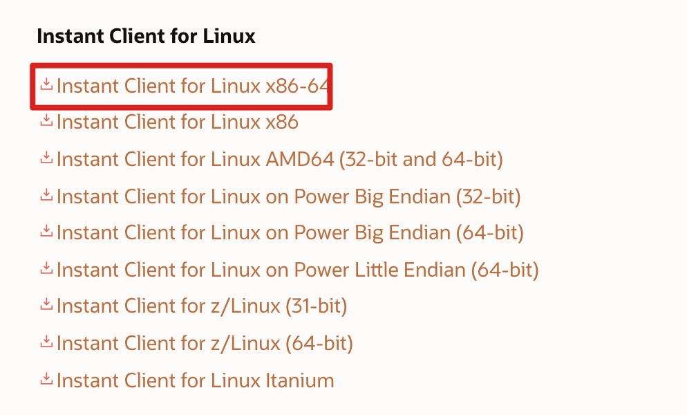
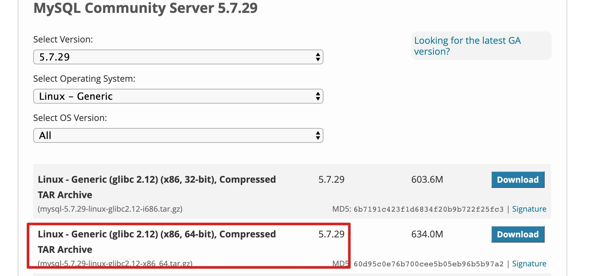

# AntDB 管理手册

- 文档名称：《AntDB管理手册》
- 对象：DBA/运维/系统管理员

---

## 关键字列表

关键字 | 解释
---|---
Adbmgr | 管理AntDB集群的一个管理工具，可以快速部署和方法管理AntDB 集群。 
AntDB 集群 | 即AntDB 分布式数据库，它是有多个单节点组成。 
节点/AntDB节点 | 即AntDB分布式数据库中的单个节点。节点分三种类型：Coordinator节点，Gtmcoord节点和Datanode节点。 
agent | AntDB manager通过agent进程管理AntDB集群。 
hba | 允许哪些IP范围的客户端通过哪种认证方式访问指定的数据库。
doctor | AntDB节点自愈模块组件名称 

--------------------------------------------------------
## 阅读说明

本文档为通用指导文档，用户在参考的时候，对如下情况可能需要根据实际进行替换修改：

- IP地址
- 目录名称、目录路径
- 用户名称

特别提醒：

**在psql客户端中，可以通过 `\h cmd` 快速获取该命令的帮助信息。**


## 环境准备

### 系统要求

* redhat/centos 系列建议选择7.5及以上版本，不建议使用7.2版本
* 主机的防火墙、NUMA、SELINUX 需要关闭
* 最好配置本地YUM源，或者将操作系统ISO文件放在主机上，以便配置本地YUM源
* antdb 用户需要 sudo 权限
* 数据盘建议使用一个挂载点，如 `/data`或 `/antdbdata`
* 如果需要使用数据压缩，数据盘的文件系统需要配置为 `ZFS`

### 创建用户

在root用户下执行：`useradd antdb` 进行`antdb`用户的创建。

执行：`passwd antdb` 修改`antdb`用户密码。

#### 配置用户limit参数

编辑`/etc/security/limits.conf ` 文件，配置`antdb`用户参数：

```
antdb soft nproc 65536
antdb hard nproc 65536
antdb soft nofile 278528
antdb hard nofile 278528
antdb soft stack unlimited
antdb soft core unlimited
antdb hard core unlimited
antdb soft memlock 250000000
antdb hard memlock 250000000
```

保存文件后，执行`su - antdb`切换到`antdb`用户，执行`ulimit -a` 检查是否生效。

#### 配置用户sudo权限

> 可选步骤。

在安全允许的条件下，建议给`antdb`用户加上`sudo`权限。

root用户执行`visudo` 进行编辑界面，找到 `Allow root to run any commands anywhere`所在行，在行下面添加：

```
antdb        ALL=(ALL)       ALL
```

保存文件退出。`su - antdb` 切换到`antdb`用户，执行`sudo id`，预期会提示输入用户密码，输出为：

```
uid=0(root) gid=0(root) groups=0(root)
```

表示`sudo`权限添加成功。

### 安装依赖

如果是离线环境，建议在主机上通过操作系统的镜像文件搭建本地yum源，方便依赖的安装。

> 单机版可以不用安装 `libssh2`。

在cento或者redhat操作系统下，执行如下命令安装依赖：

```
yum install -y perl-ExtUtils-Embed
yum install -y flex
yum install -y bison
yum install -y readline-devel
yum install -y zlib-devel
yum install -y openssl-devel
yum install -y pam-devel
yum install -y libxml2-devel
yum install -y libxslt-devel
yum install -y openldap-devel
yum install -y python-devel
yum install -y gcc-c++ 
yum install -y libssh2-devel
```

Ubuntu操作系统执行如下命令安装依赖：

```
apt-get install flex 
apt-get install bison
apt-get install libreadline6-dev 
apt-get install libssl-dev
apt-get install libpam-dev
apt-get install libxml2
apt-get install libxml2-dev
apt-get install libxslt-dev
apt-get install libldap-dev
apt-get install libperl-dev
apt-get install libpython2-dev
apt-get install zlib1g-dev
apt-get install libssh2-1-dev
```

> `Ubuntu`系统，在使用源码编译之前，还需要执行 `ln -s /usr/lib/x86_64-linux-gnu/libpython2.7.so.1.0 /usr/lib/libpython2.7.so.1.0`,否则可能会出现报错：`Cannot build PL/Python because libpython is not a shared library`.
>
> 其中`libpython2.7.so.1.0 `的路径可以通过`find / -name '*libpython2.7.so.1.0*'` 找到所在环境的实际路径。

suse操作系统执行如下命令安装依赖：

```
zypper install -y flex 
zypper install -y bison
zypper install -y readline-devel
zypper install -y zlib-devel
zypper install -y libopenssl-devel
zypper install -y pam-devel
zypper install -y libxml2-devel
zypper install -y libxslt-devel
zypper install -y openldap-devel
zypper install -y python-devel
zypper install -y gcc-c++ 
zypper install -y libssh2-devel
```

> 其他操作系统请参考操作系统使用手册更换安装命令即可，依赖包名称不变

部分依赖源中没有提供 `libssh2` 的包，可以通过源码编译安装：
- 下载地址：https://www.libssh2.org/，备份地址：http://120.55.76.224/files/libssh2/
- 源码编译安装(root 执行)

```
wget https://www.libssh2.org/download/libssh2-1.9.0.tar.gz
tar xzvf libssh2-1.9.0.tar.gz
cd libssh2-1.9.0
./configure
make
make install
```

> libssh2 可以仅在adbmgr所在主机上安装。


### 调整操作系统参数

参见附录：[操作系统参数部分](#操作系统参数配置)。

## 安装AntDB

AntDB目前分为集群版本和单机版本，两个版本在安装部署和维护上有所区别，在本文档中，对两者之间的差异部分会进行单独说明。

> 集群版本：即分布式数据库，数据打散分布在多个数据节点上。
> 单机版本：即常规单机数据库，数据无分片。

后续操作默认均在`antdb`用户下执行，如有特殊需求，会特别说明。

### 安装单机版本

#### 创建相关目录

```
mkdir -p /data/antdb/{data,tools,app,soft_src} 
chown -R antdb:antdb /data/antdb
chmod -R 755 /data/antdb
```

创建好后续需要用到的目录：

- data：AntDB的数据目录。
- tools：存放相关工具
- app：程序目录
- soft_src:  AntDB以及其他工具的源码目录

> 需要根据实际情况修改目录路径。

#### 修改环境变量

```
vim .bashrc
export ADB_HOME=/data/antdb/app/antdb
export PATH=${ADB_HOME}/bin:$PATH
export LD_LIBRARY_PATH=${ADB_HOME}/lib:$LD_LIBRARY_PATH

export PGPORT=5432
export PGDATABASE=postgres
```

执行 `source ~/.bashrc`使环境变量生效。

Ubuntu系统 `source: not found`，root或者sudo执行 `dpkg-reconfigure dash` 选择 NO 

安装分为 `源码` 和 `RPM` 两种方式，开源社区用户建议使用源码安装，企业版用户建议使用官方针对不同客户提供的RPM安装。

#### 源码安装
源码访问路径：
* github:https://github.com/ADBSQL/AntDB
* gitee: https://gitee.com/adbsql/antdb


获取源码：

```shell
git clone https://github.com/ADBSQL/AntDB  -b ADB5_0_STABLE
```

接着就可以进行编译安装：

* 在源码同级目录下创建 `build` 目录： `mkdir build`
> 由于用同一份代码生成了mgr,gtmcoord，所以需要在源码的同级目录下单独创建`build`编译目录；

* 在 `bulid` 目录下 执行 `configure`：
```shell
../AntDB/configure --prefix=/opt/app/antdb  --disable-cluster 
```
> 其中: `--prefix` 目录为准备安装的目录，可以根据需求灵活设置。`-disable-cluster ` 表示编译的是单机版本。

* 编译安装： `make install-world-contrib-recurse`

操作完成后再 `--prefix` 指定的目录中，可以看到安装后的文件。

#### RPM安装

RPM相对源码安装简单些，但是在[环境准备](#环境准备)中的相关依赖依然需要提前安装好。具体步骤如下：

1. `cd /data/antdb/soft_src`
2. 上传RPM包。
3. `sudo rpm -Uvh adb-5.0.c9ad3c39-10.el7.centos.x86_64.rpm --relocate=/opt/app/antdb=$ADB_HOME`
4. `sudo chown -R antdb:antdb $ADB_HOME`
5. `sudo chmod -R 755 $ADB_HOME`

执行`which postgres` 检查`postgres`执行程序是否在正确位置。

执行`postgres -V`检查执行程序的版本号。


#### 初始化数据目录

在初始化之前，需要先确定AntDB的数据存放目录，在本文档中，假设为：`/data/antdb/data`.

通过`initdb`命令来进行初始化，具体如下：

```shell
initdb -D /data/antdb/data --wal-segsize=1024
```

数据目录不要求存在，如果已经存在，确保目录为空。

`antdb` 操作系统用户需要对数据目录有读写权限。

初始化完成后，在`/data/antdb/data`目录下会生成一系列文件和目录，大致目录结构如下：

```shell
drwx------. 7 antdb antdb    72 Sep 29 19:39 base
-rw-------. 1 antdb antdb    47 Oct 15 18:42 current_logfiles
drwx------. 2 antdb antdb  4096 Oct 15 15:58 global
-rw-------. 1 antdb antdb   530 Sep 29 16:23 patroni.dynamic.json
drwx------. 2 antdb antdb     6 Sep 29 16:12 pg_commit_ts
drwx------. 2 antdb antdb     6 Sep 29 16:12 pg_dynshmem
-rw-------. 1 antdb antdb  5808 Sep 29 16:23 pg_hba.conf
-rw-------. 1 antdb antdb  5808 Oct 15 15:58 pg_hba.conf.backup
-rw-------. 1 antdb antdb  1636 Sep 29 16:23 pg_ident.conf
-rw-------. 1 antdb antdb  1636 Oct 15 15:58 pg_ident.conf.backup
drwx------. 2 antdb antdb 12288 Oct 15 18:42 pg_log
drwx------. 4 antdb antdb    68 Oct 15 19:54 pg_logical
drwx------. 4 antdb antdb    36 Sep 29 16:12 pg_multixact
drwx------. 2 antdb antdb    18 Oct 15 15:58 pg_notify
drwx------. 5 antdb antdb    56 Oct 15 15:56 pg_replslot
drwx------. 2 antdb antdb     6 Sep 29 16:12 pg_serial
drwx------. 2 antdb antdb     6 Sep 29 16:12 pg_snapshots
drwx------. 2 antdb antdb     6 Oct 15 15:58 pg_stat
drwx------. 2 antdb antdb    85 Oct 15 19:53 pg_stat_tmp
drwx------. 2 antdb antdb    54 Oct 15 18:43 pg_subtrans
drwx------. 2 antdb antdb     6 Sep 29 16:23 pg_tblspc
drwx------. 2 antdb antdb     6 Sep 29 16:12 pg_twophase
-rw-------. 1 antdb antdb     3 Sep 29 16:23 PG_VERSION
drwx------. 3 antdb antdb 24576 Oct 15 19:47 pg_wal
drwx------. 2 antdb antdb   150 Oct 14 08:45 pg_xact
-rw-------. 1 antdb antdb   262 Oct 11 16:21 postgresql.auto.conf
-rw-------. 1 antdb antdb 29691 Oct 15 15:54 postgresql.base.conf
-rw-------. 1 antdb antdb   724 Oct 15 15:58 postgresql.conf
-rw-------. 1 antdb antdb   459 Oct 15 15:58 postmaster.opts
-rw-------. 1 antdb antdb    82 Oct 15 15:58 postmaster.pid
```

默认端口为`5432`,如果需要修改端口，则在`postgresql.conf`文件最后追加即可：

```
port = 8432
```

#### 启动数据库

初始化完成后，可以用`pg_ctl`命令启动数据库：

```shell
pg_ctl start -D /data/antdb/data
```

启动完成后，可以用`psql`命令登录数据库：

```shell
psql -p 5432
```

至此，AntDB数据库初始化完成。

启动完成后，需要进行一些参数设置，详情请参考附录：[数据库参数设置](#数据库参数设置)中的`单机版本`部分。

#### 停止数据库

使用 `pg_ctl` 命令来停止数据库：
```shell
pg_ctl stop -D /data/antdb/data
```


> 通过 `pg_ctl --help` 可以获得更多帮助信息。

### 安装集群版本

安装分为 `源码` 和 `RPM` 两种方式，开源社区用户建议使用源码安装，企业版用户建议使用官方针对不同客户提供的RPM安装。

#### 源码安装
源码访问路径：
* github:https://github.com/ADBSQL/AntDB
* gitee: https://gitee.com/adbsql/antdb


获取源码：

```shell
git clone https://github.com/ADBSQL/AntDB  -b ADB5_0_STABLE
```

接着就可以进行编译安装：

* 在源码同级目录下创建 `build` 目录： `mkdir build`
> 由于用同一份代码生成了mgr,gtmcoord，所以需要在源码的同级目录下单独创建`build`编译目录；

* 在 `bulid` 目录下 执行 `configure`：
```shell
../AntDB/configure --prefix=/opt/app/antdb  --with-python
```
> 其中: `--prefix` 目录为准备安装的目录，可以根据需求灵活设置。

* 编译安装： `make install-world-contrib-recurse`

操作完成后再 `--prefix` 指定的目录中，可以看到安装后的文件。
#### RPM安装

rpm需要通过**root** 用户或者具有**sudo**权限的用户安装。

通过交付人员提供的rpm包来安装：

```
sudo rpm -ivh antdb-xxx.rpm
```

> 默认安装路径为：/opt/app/antdb 

如果想安装到其他路径，可以通过如下方式：

```
sudo rpm -ivh antdb-xxx.rpm --relocate=/opt/app/antdb=$ADBHOME
```

> $ADBHOME 为自定义目录，名称最好做到见名知意，比如：`/home/antdb/app/antdb`

RPM包安装完成后，`ADB_HOME`这个变量的值要么是`/opt/app/antdb `,要么是您自定义的目录。接下来需要修改目录权限：

```
chown -R antdb:antdb $ADBHOME
chmod -R 755 $ADBHOME
```

> 若使用具有`sudo`权限的`antdb`用户进行安装，则以上命令：`rpm`、`chown`、`chmod` 前面均需要加上`sudo`。
> 以上安装操作只需在集群中的一台主机上执行即可，选定的这台主机建议是 `adbmgr` 所在的主机。

####  初始化Adbmgr

编译或安装Adbmgr之后，会在指定目录(即`$ADBHOME`目录)的bin目录下产生`initmgr`和`mgr_ctl`可执行文件。要想初始化Adbmgr还需要配置PATH变量才行。
向当前用户下的隐藏文件`.bashrc`中(执行`vim ~/.bashrc`打开文件)追加如下内容：

```shell
export ADBHOME=/opt/app/antdb 
export PATH=$ADBHOME/bin:$PATH
export LD_LIBRARY_PATH=$ADBHOME/lib:$LD_LIBRARY_PATH
export PGDATABASE=postgres

export mgrdata=/data/antdb/mgr1
alias adbmgr='psql -p 6432 -d postgres '
alias mgr_stop='mgr_ctl stop -D $mgrdata -m fast'
alias mgr_start='mgr_ctl start -D $mgrdata'
```
> ADBHOME需要根据AntDB的编译产生的二进制可执行文件的存放路径设置。
> mgrdata 同样需要根据各自环境的实际路径进行修改。

然后执行`source ~/.bashrc` 使其生效即可。

执行下面命令开始初始化Adbmgr：

```
initmgr -D $mgrdata
```

其中`$mgrdata`是用户自己指定的存放Adbmgr 的安装目录(该文件目录需要预先创建)。

初始化后，在指定的目录下生成如下文件：
```shell
[gd@INTEL175 ~]$ cd /data/antdb/mgr1
[gd@INTEL175 mgr1]$ ll
total 112
drwx------ 5 gd gd  4096 Oct 17 17:28 base
drwx------ 2 gd gd  4096 Oct 17 17:28 global
drwx------ 2 gd gd  4096 Oct 17 17:28 pg_clog
drwx------ 2 gd gd  4096 Oct 17 17:28 pg_commit_ts
drwx------ 2 gd gd  4096 Oct 17 17:28 pg_dynshmem
-rw------- 1 gd gd  4450 Oct 17 17:28 pg_hba.conf
-rw------- 1 gd gd  1636 Oct 17 17:28 pg_ident.conf
drwx------ 4 gd gd  4096 Oct 17 17:28 pg_logical
drwx------ 4 gd gd  4096 Oct 17 17:28 pg_multixact
drwx------ 2 gd gd  4096 Oct 17 17:28 pg_notify
drwx------ 2 gd gd  4096 Oct 17 17:28 pg_replslot
drwx------ 2 gd gd  4096 Oct 17 17:28 pg_serial
drwx------ 2 gd gd  4096 Oct 17 17:28 pg_snapshots
drwx------ 2 gd gd  4096 Oct 17 17:28 pg_stat
drwx------ 2 gd gd  4096 Oct 17 17:28 pg_stat_tmp
drwx------ 2 gd gd  4096 Oct 17 17:28 pg_subtrans
drwx------ 2 gd gd  4096 Oct 17 17:28 pg_tblspc
drwx------ 2 gd gd  4096 Oct 17 17:28 pg_twophase
-rw------- 1 gd gd     4 Oct 17 17:28 PG_VERSION
drwx------ 3 gd gd  4096 Oct 17 17:28 pg_xlog
-rw------- 1 gd gd    88 Oct 17 17:28 postgresql.auto.conf
-rw------- 1 gd gd 22234 Oct 17 17:28 postgresql.conf
```
#### 修改Adbmgr配置参数

修改postgresql.conf

```
cat  >> ${mgrdata}/postgresql.conf << EOF
port = 6432
listen_addresses = '*'
log_directory = 'pg_log'
log_destination ='csvlog'
logging_collector = on
log_min_messages = error
max_wal_senders = 3
hot_standby = on
wal_level = replica
EOF
```

> adbmgr 的默认端口是 `6432`,建议使用默认端口，如果 `6432` 端口被其他应用占用，则需要修改为其他可用端口，但是不建议修改为 `5432`，这个是 `postgresql` 的默认端口，不建议 `adbmgr` 使用。

修改pg_hba.conf

```
cat  >> ${mgrdata}/pg_hba.conf << EOF
host    replication     all        10.0.0.0/8                 trust
host    all             all          10.0.0.0/8               trust
EOF
```

> hba中的IP需要根据实际情况进行修改。


#### 启动 Adbmgr

Adbmgr初始化成功后，就可以启动它了。有如下两种启动方式，可以任选一种执行。

```shell
mgr_ctl start -D /data/antdb/mgr1
```

`/data/antdb/mgr1` 要与初始化路径保持一致，均为变量`mgrdata` 的值。


```shell
[gd@INTEL175 ~]$ mgr_ctl start -D /data/antdb/mgr1  
server starting
[gd@INTEL175 ~]$ LOG:  database system was shut down at 2017-10-17 17:38:15 CST
LOG:  MultiXact member wraparound protections are now enabled
LOG:  database system is ready to accept connections
LOG:  autovacuum launcher started
LOG:  adb monitor launcher started
```

若Adbmgr在启动的过程中报端口被占用，原因是当前端口号已经被其他进程使用（**Adbmgr默认使用端口是6432**）。需要修改 `/data/antdb/mgr1/postgresql.conf` 文件中变量 `port` 的值使其不与其他的进程冲突即可。

启动后，查看进程如下：
```shell
 67456 ?        S      0:00 /data/antdb/app/bin/adbmgrd -D mgr
 67458 ?        Ss     0:00  \_ adbmgr: checkpointer process   
 67459 ?        Ss     0:00  \_ adbmgr: writer process   
 67460 ?        Ss     0:00  \_ adbmgr: wal writer process   
 67461 ?        Ss     0:00  \_ adbmgr: autovacuum launcher process  
 67462 ?        Ss     0:00  \_ adbmgr: stats collector process  
 67463 ?        Ss     0:00  \_ adbmgr: adb monitor launcher process 
```
#### 配置备机Adbmgr（可选）

在实际的生产环境中，adbmgr也需要做高可用，所以也需要给adbmgr配置备机。

> 在功能验证阶段可不加adbmgr的备机，在后期验证高可用的时候再进行添加。

在选定的部署adbmgr备机的主机上，使用`antdb`用户执行：

```
pg_basebackup -h adb05 -p 6432 -U antdb -D /data/antdb/mgr --nodename mgr -Xs -Fp -R
```

其中：

- `-h adb05`中的`adb05` 为adbmgr master的主机名，此处也可以使用IP。
- `-p 6432` 为adbmgr master的端口。
- `-U antdb` 表示使用antdb用户去连接adbmgr master
- `-D`  指定了 adbmgr slave 在执行主机上的数据目录，确保权限正确。
- 其他参数保持不变。

执行完成后，启动 adbmgr slave：-

> 此处`adbhome`的值与`.bashrc`中`ADBHOME`的值应该一致。

#### deploy二进制程序

deploy命令会将AntDB的二进制执行文件打包发送到host表中所有主机上。    

在集群内各主机之间如果没有设置互信的情况下，执行deploy all需要输入用户密码（当前用户的登录密码），如果设置主机间互信，则可以省去密码的繁琐设置。
**命令：**

一次部署所有主机| deploy all password ' 123456'; 
---|---
部署指定的主机	| deploy adb01,adb02 password ' 123456';

####  启动agent

有两种方式：一次启动全部agent和单独启动一台主机agent（多个主机需要多次执行）。

> password是host表中主机user对应的linux系统密码，用于与主机通信，而非AntDB数据库的用户密码。

当密码是以数字开头时，需要加上单引号或者双引号，例如password ‘12345z’是正确的，password 12345z则会报错；如果密码不是以数字开头，则加不加引号都行。

一次启动全部agent| start agent all  password ' 123456'; 
---|---
启动指定的agent	|start agent adb01,adb02 password ' 123456';

当密码不对，启动agent失败时，报错如下：
```shell
postgres=# start agent adb01 password '123456abc';    
  hostname  | status |                description                
------------+--------+-------------------------------------------
 adb01      | f      | Authentication failed (username/password)
(1 row)
```

####  配置集群节点

Node表中添加gtmcoord、coordinator、datanode master、datanode slave等节点信息。

> host名称必须来自host表，端口号不要冲突，path指定的文件夹下必须为空，否则初始化将失败并报错。这种设置，是防止用户操作时，忘记当前节点下还有有用的数据信息。

**添加命令：**

add节点 | command
---|---
添加coordinator信息|add coordinator master 名字(path = 'xxx', host='localhost1', port=xxx);
添加datanode master信息|add datanode master 名字(path = 'xxx', host='localhost1', port=xxx);
添加datanode slave信息，从节点与master不同名，所以指定的master必须存在，同异步关系通过SYNC_STATE参数设置|add datanode slave名字 for master_name (host='localhost2', port=xxx, path='xxx', SYNC_STATE='sync');
添加gtmcoord信息，从节点必须与主节点不同名，所以指定的master必须存在，同异步关系通过SYNC_STATE参数设置|add gtmcoord master名字(host='localhost3',port=xxx, path='xxx');add gtmcoord slave名字 for maste_name(host='localhost2',port=xxx, path='xxx')

添加完成后，使用命令`list node`查看刚刚添加的节点信息

**举例：（gtmcoord/datanode 均为一主一从）**

```sql
add host adb01(port=22,protocol='ssh',adbhome='/opt/app/antdb',address="10.1.226.201",agentport=8432,user='antdb');
add host adb02(port=22,protocol='ssh',adbhome='/opt/app/antdb',address="10.1.226.202",agentport=8432,user='antdb');
add host adb03(port=22,protocol='ssh',adbhome='/opt/app/antdb',address="10.1.226.203",agentport=8432,user='antdb');
add coordinator master cn1(host='adb01', port=5432,path = '/home/antdb/data/cn1');
add coordinator master cn2(host='adb02', port=5432,path = '/home/antdb/data/cn2');
add datanode master dn1_1(host='adb01', port=14332,path = '/home/antdb/data/dn1_1');
add datanode slave dn1_2 for dn1_1 (host='db02',port=14332,path='/home/antdb/data/dn1_2');
add datanode master dn2_1(host='adb02', port=24332,path = '/home/antdb/data/dn2_1');
add datanode slave dn2_2 for dn2_1(host='adb01',port=24332,path='/home/antdb/data/dn2_2');
add gtmcoord master gc_1(host='adb03',port=6655, path='/home/antdb/data/gc_1');
add gtmcoord slave gc_2 for gc_1(host='adb02',port=6655,path='/home/antdb/data/gc_2');
```

生产环境节点部署建议：
* 每个主机上最多一个coordinator，每个coordinator的端口保持一致。
* 整个集群中的coordinator数量不建议超过10个。
* 因应用也可以连接gtmcoord，所以在部署的时候，有gtmcoord的主机就不需要再部署coordinator了。
* datanode的端口可以按照一组节点（一主多从为一组，比如dn1_x）在不同的主机上使用同一个端口。


#### init all 初始化集群

集群的节点都已经添加完成，此时就可以使用命令`init all`来初始化集群了。如下所示，可以看到`init all`内部的操作步骤。
```shell
postgres=# init all ;
    operation type     | nodename | status | description 
-----------------------+----------+--------+-------------
 init gtmcoord master  | gc_1      | t      | success
 start gtmcoord master | gc_1      | t      | success
 init coordinator      | cn1        | t      | success
 init coordinator      | cn2        | t      | success
 start coordinator     | cn1        | t      | success
 start coordinator     | cn2        | t      | success
 init datanode master  | dn1_1      | t      | success
 init datanode master  | dn2_1      | t      | success
 start datanode master | dn1_1      | t      | success
 start datanode master | dn2_1      | t      | success
 init gtmcoord slave   | gc_2      | t      | success
 start gtmcoord slave  | gc_2      | t      | success
 init datanode slave   | dn1_2      | t      | success
 init datanode slave   | dn1_2      | t      | success
 start datanode slave  | dn2_2      | t      | success
 start datanode slave  | dn2_2      | t      | success
 config coordinator    | cn1        | t      | success
 config coordinator    | cn2        | t      | success
(18 rows)
```

> 如果 `init all` 中间出现错误，可以先执行 `clean all` 来清空节点数据目录，再次执行 `init all` 来初始化集群。

通过`monitor all `查看集群各个节点的运行状态：

```shell
postgres=# monitor all ;
 nodename |    nodetype           | status | description |     host     | port  | recovery  |  boot time                       |     nodezone 
----------+-----------------+--------+-------------+--------------+------------ --------+----- --------+-------------+--------------+------------
 cn1      | coordinator  master   | t      | running     | 10.1.226.201 |  5432 | false      | 2020-09-01 10:09:30.123+08      | local 
 cn2      | coordinator  master   | t      | running     | 10.1.226.202 |  5432 | false      | 2020-09-01 10:09:30.123+08      | local     
 dn1_1    | datanode master       | t      | running     | 10.1.226.201 | 14332 | false      | 2020-09-01 10:09:30.123+08      | local     
 dn1_2    | datanode slave        | t      | running     | 10.1.226.202 | 14332 | true       | 2020-09-01 10:09:30.123+08      | local     
 dn2_1    | datanode master       | t      | running     | 10.1.226.202 | 24332 | false      | 2020-09-01 10:09:30.123+08      | local     
 dn2_2    | datanode slave        | t      | running     | 10.1.226.201 | 24332 | true       | 2020-09-01 10:09:30.123+08      | local     
 gc_1     | gtmcoord master       | t      | running     | 10.1.226.203 |  6655 | false      | 2020-09-01 10:09:30.123+08      | local     
 gc_2     | gtmcoord slave        | t      | running     | 10.1.226.202 |  6655 | true       | 2020-09-01 10:09:30.123+08      | local     
(8 rows)
```
**至此，AntDB集群初始化完成！**

其中：`recovery` 字段表示节点是否处于 `recovery` 状态，正常情况下，master 节点的值为 `false`, slave 节点的值为 `true`.

> `init all`会包含`start all`操作，仅在初始化集群的时候使用，后续如需启动集群，请使用`start all`命令。

可以通过`psql`命令登录`gtmcoord master`或者`coord master` 节点：

```
psql -p 5432  #登录coord
psql -p 6655  #登录gtmcoord
```

> 注意：应用需要连接`gtmcoord`或者`coord`，而非`adbmgr`。

节点的参数设置，请参考附录：[数据库参数设置](#数据库参数设置)中的`集群版本`部分。


## 管理AntDB集群

> 本章节内容针对AntDB集群版本。

为了方便管理AntDB 集群，Adbmgr提供了一系列的操作命令。根据命令的功能可以划分为下面六类：

- agent相关命令
- host表相关命令
- node表相关命令
- param表相关命令
- hba表相关命令
- 集群管理相关命令

下面分别介绍这些命令的功能和格式。

###  help命令

在管理AntDB 集群的过程中，如果对某个命令的格式或者功能有任何的不明白，可以通过help命令查看该命令的功能描述和命令格式。

在psql客户端只要执行“\h”命令即可查看当前Adbmgr支持的所有命令列表，如下图所示：
```sql
postgres=# \h
Available help:
  ADBMGR PROMOTE              ALTER ITEM                  CLEAN GTMCOORD              DROP USER                   LIST PARAM                  RESET COORDINATOR           START ALL
  ADD COORDINATOR             ALTER JOB                   CLEAN MONITOR               FAILOVER DATANODE           MONITOR AGENT               RESET DATANODE              START COORDINATOR
  ADD DATANODE                ALTER USER                  CONFIG DATANODE             FAILOVER GTMCOORD           MONITOR ALL                 RESET GTMCOORD              START DATANODE
  ADD GTMCOORD                APPEND ACTIVATE COORDINATOR CREATE USER                 FLUSH HOST                  MONITOR COORDINATOR         REVOKE                      START GTMCOORD
  ADD HBA                     APPEND COORDINATOR          DEPLOY                      GRANT                       MONITOR DATANODE            REWIND DATANODE             STOP AGENT
  ADD HOST                    APPEND COORDINATOR FOR      DROP COORDINATOR            INIT ALL                    MONITOR GTMCOORD            REWIND GTMCOORD             STOP ALL
  ADD ITEM                    APPEND DATANODE             DROP DATANODE               LIST ACL                    MONITOR HA                  SET CLUSTER INIT            STOP COORDINATOR
  ADD JOB                     APPEND GTMCOORD             DROP GTMCOORD               LIST HBA                    PROMOTE DATANODE            SET COORDINATOR             STOP DATANODE
  ALTER COORDINATOR           CHECKOUT DN SLAVE STATUS    DROP HBA                    LIST HOST                   PROMOTE GTMCOORD            SET DATANODE                STOP GTMCOORD
  ALTER DATANODE              CLEAN ALL                   DROP HOST                   LIST ITEM                   REMOVE COORDINATOR          SET GTMCOORD                SWITCHOVER DATANODE
  ALTER GTMCOORD              CLEAN COORDINATOR           DROP ITEM                   LIST JOB                    REMOVE DATANODE             SHOW                        SWITCHOVER GTMCOORD
  ALTER HOST                  CLEAN DATANODE              DROP JOB                    LIST NODE                   REMOVE GTMCOORD             START AGENT                 
postgres=#  
```
也可通过在“\h”后面添加具体的命令名称，查看指定命令的功能和格式。如下面所示：
```sql
postgres=# \h start
Command:     START AGENT
Description: start the agent process on the ADB cluster
Syntax:
START AGENT { ALL | host_name [, ...] } [ PASSWORD passwd ]

Command:     START ALL
Description: start all the nodes on the ADB cluster
Syntax:
START ALL

Command:     START COORDINATOR
Description: start the coordinator node type on the ADB cluster
Syntax:
START COORDINATOR [ MASTER | SLAVE ] ALL
START COORDINATOR { MASTER | SLAVE } node_name [, ...]

Command:     START DATANODE
Description: start the datanode node type on the ADB cluster
Syntax:
START DATANODE ALL
START DATANODE { MASTER | SLAVE } { ALL | node_name [, ...] }

Command:     START GTMCOORD
Description: start the gtmcoord node type on the ADB cluster
Syntax:
START GTMCOORD ALL
START GTMCOORD { MASTER | SLAVE } node_name
```
下面章节的所有命令都可以通过上面的方式查看帮助信息。

###  agent相关命令

---
agent进程是Adbmgr 实现管理AntDB 集群的关键。它是Adbmgr和AntDB 集群之间传输命令和返回命令执行结果的中间代理。所以要实现对AntDB 集群的管理，需要agent进程正常运行。管理agent进程的命令有Start agent，
Stop agent和Monitor agent三个命令，下面对这三个命令进行介绍。

#### start agent

---
命令功能：
启动指定主机上的agent进程。指定的主机需在host表中，具体功能可通过帮助命令:
\h start agent 查看。

**命令格式：**

>START AGENT { ALL | host_name [, ...] } [ PASSWORD passwd ]

**命令举例：**
```sql
-- 启动host表中主机上所有主机上的agent进程（主机之间没有配置互信，所有主机上用户密码都为'sdg3565'）：
START AGENT ALL PASSWORD 'sdg3565';
-- 启动host表中主机上所有主机上的agent进程，（主机之间已经配置互信）：
START AGENT ALL ;
-- 启动host表中host1，host2主机上的agent进程（主机之间没有配置互信，host1，host2上用户密码都为'sdg3565'）：
START AGENT host1, host2 PASSWORD 'sdg3565';
-- 启动host表中host1，host2主机上的agent进程（主机之间已经配置互信）：
START AGENT host1, host2 ;
```
#### stop agent
---
命令功能：
停止指定主机上的agent进程。指定的主机需在host表中，具体功能可通过帮助命令:\h stop agent 查看。

**命令格式：**
>STOP AGENT { ALL | host_name [, ...] }

**命令举例：**
```sql
-- 停止host表中所有主机上的agent进程：
STOP AGENT ALL ;
-- 停止host表中host1，host2主机上的agent进程：
STOP AGENT host1, host2 ;
```
#### monitor agent

---
命令功能：
查看host表中指定主机上agent进程的运行状态。Agent进程有running 和not running两种运行状态。具体功能可通过帮助命令 \h stop agent  查看。

**命令格式：**
>MONITOR AGENT [ ALL | host_name [, ...] ]

**命令举例：**
```sql
-- 查看host表中所有主机上的agent进程的运行状态：
MONITOR AGENT ALL ;
-- 查看host表中host1，host2主机上agent进程的运行状态：
MONITOR AGENT host1, host2 ;
```
### host表相关命令

---
Host表存放主机的相关信息，而主机信息又与node节点相关，所以在添加节点之前必须添加agent到host表中，在init all集群之前，必须先start agent，而这张host表就是用来管理host和agent。管理host表的命令有add host，alter host，drop host和list host三个命令，下面对这三个命令进行介绍。

#### add host

---
命令功能：
添加新的主机到host表，参数可以选择添加，但是至少有一个，缺省参数会以默认值加入。
具体功能可通过帮助命令 \h add host 查看。

**命令格式：**
```sql
ADD HOST [IF NOT EXISTS] host_name ( option )

where option must be the following:

    ADDRESS = host_address,
    AGENTPORT = agent_port_number,
    ADBHOME = adb_home_path,
    PORT = port_number,
    PROTOCOL = protocol_type,
    USER = user_name
参数说明：
host_address：主机名对应的IP地址，不支持主机名。
agentport_number:agent进程监听端口号。
adb_home_path：数据库集群安装包存放路径。
host_name：主机名。
user_name：数据库集群安装用户。
protocol_type：数据库集群安装包传输使用的协议，可以为telnet，ssh。现只支持ssh。
port_number：protocol_type对用的协议的端口号，现只支持ssh，默认对应端口号22。
```
**命令举例：**
```sql
-- 添加主机名为host_name1信息：数据库安装用户antdb,数据库安装包使用ssh协议传输，host_name1对应的ip为”10.1.226.202”, agent监听端口5660，安装包存放路径设置为”/opt/antdb/app”：
ADD HOST host_name1(USER=antdb, PROTOCOL=ssh, ADDRESS='10.1.226.202', AGENTPORT=5660, adbhome='/opt/antdb/app');
```

#### alter host

命令功能：
修改host表中的参数，可以是一个，也可以是多个。
具体功能可通过帮助命令 \h alter host 查看。

**注意：**
在集群初始化后，alter host命令无法进行操作。

**命令格式：**
```sql
ADD HOST [IF NOT EXISTS] host_name ( option )

where option must be the following:

    ADDRESS = host_address,
    AGENTPORT = agent_port_number,
    ADBHOME = adb_home_path,
    PORT = port_number,
    PROTOCOL = protocol_type,
    USER = user_name
参数说明：
host_name：主机名。
user_name：数据库集群安装用户。
protocol_type：数据库集群安装包传输使用的协议，可以为telnet，ssh。现只支持ssh。
port_number：protocol_type对用的协议的端口号，现只支持ssh，默认对应端口号22。
agentport_number:agent进程监听端口号。
host_address：主机名对应的IP地址，不支持主机名。
adb_home_path：数据库集群安装包存放路径。
```
**命令举例：**
```sql
--修改host_name1对用的agent端口为5610：
ALTER host_name1 (AGENTPORT=5610);
--修改host_name1对用的agent端口为5610, 安装包存放路径为 /home/data/antdbhome ：
ALTER host_name1 (AGENTPORT=5610, ADBHOME=’/home/data/antdbhome’);
```
#### drop host

命令功能：
从host表中删除指定的主机，但是主机应当没有被依赖使用，不然会报错。
具体功能可通过帮助命令 \h drop host  查看。

**命令格式：**
> DROPHOST [ IF EXISTS ] host_name [, … ]

**命令举例：**
```sql
--连续删除host表中的主机名为localhost1和localhost2的成员：
DROP  HOST  localhost1, localhost2;
--删除host表中的主机名为localhost的成员：
DROP  HOST  localhost1;
```
#### list host
命令功能：
显示host表中的成员变量，可以显示指定的主机部分参数，也可以全部显示，也可以显示host表的所有主机参数内容。

**命令格式：**
```sql
LIST HOST  [ ( option [, ...]) ] [ host_name [, ...] ]
where option can be one of:
    NAME
    USER
    PORT
    PROTOCOL
    AGENTPORT
    ADDRESS
    ADBHOME
参数说明：
NAME：主机名。
USER：数据库集群安装用户。
PORT：protocol_type对用的协议的端口号，现只支持ssh，默认对应端口号22。
PROTOCOL：数据库集群安装包传输使用的协议，可以为telnet，ssh。现只支持ssh。
AGENTPORT:agent进程监听端口号。
ADDRESS：主机名对应的IP地址。
ADBHOME：数据库集群安装包存放路径。
```
**命令举例：**
```sql
--显示host表中所有主机成员的信息：
LIST  host;
--显示host表中指定主机的成员信息：
LIST  host  localhost1;
--显示host表中指定主机的指定参数信息：
LIST  host  (user, agentport, address)  localhost1;
```
#### flush host

命令功能：
集群初始化后，在机器IP地址出现变更时，首先通过alter host修改host表中所有需要修改的主机名对应的IP地址，再通过flush host去更新所有数据库节点中对应的IP地址信息。

**命令格式：**
>FLUSH HOST

**命令举例：**
```sql
--集群初始化后，机器IP发生变更，已完成host表中内容修改，需要刷新各个数据库节点IP地址信息：
FLUSH HOST;
```
> flush host操作会重启slave类型的节点，因为需要修改recovery.conf 中的primary_conninfo信息。

### node表相关命令

Node表用于保存部署AntDB 集群中每个节点的信息，同时包括从节点与主节点之间的同/异步关系等。管理node表的操作命令有:

- add node（包含ADD GTMCOORD、ADD COORDINATOR、ADD DATANODE）
- alter node（包含ALTER GTMCOORD、ALTER COORDINATOR、ALTER DATANODE）
- remove node (包含DROP GTMCOORD、DROP COORDINATOR、DROP DATANODE）
- drop node（包含DROP GTMCOORD、DROP COORDINATOR、DROP DATANODE）
- list node

下面对这五个命令进行介绍

#### add node

---
命令功能：
在node表中添加节点信息。具体功能可通过帮助命令“\h add gtmcoord” 、”\h add coordinator”、”\h add datanode”查看。

**注意：**
Gtmcoord和datanode均可存在多个备机，nodetype为slave。第一个添加的slave节点，默认为同步slave，后续添加的默认为潜在同步，sync_state字段值为`potential`

指定的节点数据存放路径需要为空目录，否则执行初始化时报错。

**命令格式：**
```sql
ADD COORDINATOR MASTER master_name ( option )
ADD DATANODE MASTER master_name ( option )
ADD DATANODE SLAVE slave_name FOR master_name ( option )
ADD GTMCOORD MASTER master_name ( option )
ADD GTMCOORD SLAVE slave_name FOR master_name ( option )
where option must be the following:

    HOST = host_name,
    PORT = port_number,
    SYNC_STATE = sync_mode,
		PATH = pg_data
		ZONE = zone_name
		READONLY = readonly_type (仅仅在add coordinator时有效)
参数说明：
node_name：节点名称，对应node表name列。
host_name：主机名，与host表中主机名对应。
port_number：节点监听端口号。
Sync_mode：备机与主机的同异步关系，”on”、”t”、”true”均表示同步设置，”off”、”f”、”false”均表示异步设置。
pg_data：节点数据路径，需要保证该目录是空目录。
zone_name：节点所属的中心名字，默认是local，用在双中心场景。
readonly_type：该coordinator是否为只读节点
```

注意：datanode和gtmcoord类型的节点支持级联，即slave节点可以挂在slave节点之下，所以for后面可以是slave node的名字。

**命令举例：**

```sql
-- 添加gtmcoord master节点，主机为localhost1, 端口为6768，数据路径”/home/antdb/data/gc”：
ADD GTMCOORD MASTER gc (HOST=localhost1, PORT=6768, PATH='/home/antdb/data/gc');
-- 添加gtmcoord slave节点，主机为localhost2, 端口为6768，数据路径”/home/antdb/data/gc”：
ADD GTMCOORD SLAVE gcs for gc (HOST=localhost2, PORT=6768, SYNC=t, PATH='/home/antdb/data/gc');
-- 添加coordinator节点coord1信息，主机为localhost1，端口为5532，数据路径”/home/antdb/data/coord1”：
ADD COORDINATOR master coord1(HOST=localhost1, PORT=5532,PATH='/home/antdb/data/coord1');
-- 添加datanode master节点db1，主机为localhost1，端口为15533，数据路径为”/home/antdb/data/db1”：
ADD DATANODE MASTER db1(HOST=localhost1, PORT=15533,PATH='/home/antdb/data/db1');
-- 添加datanode slave节点db1，主机为localhost2，端口为15533，数据路径为”/home/antdb/data/db1”：
ADD DATANODE SLAVE db1s for db1(HOST=localhost1, PORT=15533, SYNC=t, PATH= '/home/antdb/data/db1');
-- 添加datanode slave节点db1s的级联slave db11s
ADD DATANODE SLAVE db11s for db1s(HOST=localhost1, PORT=15543, SYNC=t, PATH= '/home/antdb/data/db11'); 

```

####  alter node

---

命令功能：
在node表中修改节点信息。具体功能可通过帮助命令“\h alter gtmcoord” 、”\h alter  coordinator”、”\h alter datanode”查看。

**注意：**
**在集群初始化前，可以通过alter node更新节点信息；在集群初始化后，只允许更新备机slave同异步关系sync_state列。**

**命令格式：**
```sql
ALTER GTMCOORD { MASTER | SLAVE } node_name ( option )
ALTER COORDINATOR MASTER node_name ( option )
ALTER DATANODE { MASTER | SLAVE } node_name ( option )  

where option can be one of:

    HOST =host_name,
    PORT = port_number,
    SYNC_STATE = sync_mode,
		PATH = pg_data
		ZONE = zone_name

参数说明：
node_name：节点名称，对应node表name列。
host_name：主机名，与host表中主机名对应。
port_number：节点监听端口号。
Sync_mode：从节点与主节点的同异步关系。仅对从节点有效。值“sync”表示该从节点是同步从节点，“potential”表示该从节点是潜在同步节点，“async”表示该从节点是异步从节点。
pg_data：节点数据路径，需要保证该目录是空目录。
zone_name：节点所属的中心名字，默认是local，用在双中心场景。
```

**命令举例：**
```sql
-- 集群初始化前，更新gtmcoord master端口号为6666：
ALTER GTMCOORD MASTER gtmcoord (PORT=6666);
-- 更新gtmcoord slave与gtmcoord master为同步关系：
ALTER GTMCOORD SLAVE gcs (SYNC_STATE='sync');
-- 更新gtmcoord extra与gtmcoord master为异步关系：
ALTER GTMCOORD SLAVE gtms (SYNC_STATE='async');
-- 集群初始化前，更新coordinator coord1端口为5532，数据路径为”/home/antdb/data/coord1”:
ALTER COORDINATOR master coord1 (PORT=5532, PATH=’/home/antdb/data/coord1’);
-- 集群初始化前，更新datanode master db1主机为localhost5，数据路径为”/home/antdb/data/db1”:
ALTER DATANODE MASTER db1 (HOST=localhost5, PATH=’/home/antdb/data/coord1’);
-- 更新datanode slave db1与主机datanode master为同步关系：
ALTER DATANODE SLAVE db1s (SYNC_STATE='sync');
-- 更新datanode extra db1与主机datanode master为异步关系：
ALTER DATANODE SLAVE db1s (SYNC_STATE='async');
```

####  remove node

---

命令功能：

在node表中修改节点的initialized和字段值为false，并从pgxc_node表中删除node，但在mgr的node表中保留信息。

**注意**：

目前只能remove coordiantor和datanode slave、gtmcoord slave，且要求节点处于`not running` 状态。

**命令格式**：

```sql
REMOVE COORDINATOR MASTER node_name
REMOVE DATANODE SLAVE node_name
REMOVE GTMCOORD SLAVE node_name
```

**命令举例**

```sql
-- 从集群中删除coordinator节点
remove coordinator master cd2;
-- 从集群中删除datanode slave节点
remove datanode slave db1_2;
-- 从集群中删除gtmcoord slave节点
remove datanode slave gc2;
```

#### drop node

---
命令功能：
在node表中删除节点信息。具体功能可通过帮助命令“\h drop gtmcoord” 、”\h drop coordinator”、”\h drop datanode”查看。

**注意：**
在集群初始化前，可以通过drop node删除节点信息，但是在存在备机的情况下，不允许删除对应的主机节点信息；在集群初始化后，不允许drop node操作。

**命令格式：**

```sql
DROP GTMCOORD { MASTER | SLAVE } node_name
DROP COORDINATOR MASTER node_name [, ...]
DROP DATANODE { MASTER | SLAVE } node_name [, ...]
DROP ZONE zonename # 删除同一个zone的所有节点
```

**命令举例：**
```sql
-- 在集群初始化之前删除datanode slave db1s：
DROP DATANODE SLAVE db1s;
-- 在集群初始化之前删除coordinator coord1：
DROP COORDINATOR master coord1;
-- 在集群初始化之前删除gtmcoord slave gc：
DROP GTMCOORD SLAVE gcs;
-- 在集群初始化之前删除gtmcoord master gc：
DROP GTMCOORD MASTER gc;
```

#### list node

---
命令功能：
显示node表中节点信息。具体功能可通过帮助命令“\h list node” 查看。

**命令格式：**
```sql
LIST NODE COORDINATOR [ MASTER | SLAVE ]
LIST NODE DATANODE [ MASTER | SLAVE ]
LIST NODE DATANODE MASTER node_name
LIST NODE HOST host_name [, ...]
LIST NODE  [ ( option ) ] [ node_name [, ...] ]
LIST NODE ZONE zonename
where option can be one of:

    NAME
    HOST
    TYPE
    MASTERNAME
    PORT
    SYNC_STATE
    PATH
    INITIALIZED
    INCLUSTER

参数说明：
NAME：节点名称，对应node表name列。
HOST：主机名，与host表中主机名对应。
TYPE：节点类型，包含：GTMCOORD MASTER， GTMCOORD SLAVE，COORDINATOR MASTER，DATANODE 	MASTER，DATANODE SLAVE
MASTERNAME：备机对应的主机名，非备机对应为空。
PORT：节点监听端口号。
sync_state：从节点与主节点的同异步关系。仅对从节点有效。值“sync”表示该从节点是同步从节点，“potential”表示该从节点是潜在同步节点，“async”表示该从节点是异步从节点。
PATH：节点数据路径，需要保证该目录是空目录。
INITIALIZED：标识节点是否初始化。
INCLUSTER：标识节点是否在集群中。
```

**命令举例：**
```sql
-- 显示node表节点信息：
LIST NODE;
-- 显示节点名称为”db1”的节点信息：
LIST NODE db1;
-- 显示db1_2的master/slave节点信息：
list node datanode master db1_2;
-- 显示主机localhost1上的节点信息：
list node host localhost1;
```

### param表相关命令

---

param表用于管理存放AntDB集群中所有节点的postgresql.conf文件中的参数，当参数某个被修改后，该参数就会被添加到此表中，用来标识。对于修改配置参数的查询，可以通过list param命令。

#### set param

---
命令功能：
更改postgresql.conf节点配置文件中的参数，如果该参数有效，则系统内部会执行相关的操作，使更改生效，此操作只适用于那些不需要重启集群的参数类型（如sighup, user, superuser），而对于修改其它类型的参数，则会给出相应的提示。
如果在命令尾部加force，则不会检查参数的有效性，而强制写入文件中，系统不执行任何操作，只起到记录作用； 

**命令格式：**
```sql
SET COORDINATOR [ MASTER | SLAVE ] ALL ( { parameter = value } [, ...] ) [ FORCE ]
SET COORDINATOR { MASTER | SLAVE} node_name ( { parameter = value } [, ...] ) [ FORCE ]
SET DATANODE [ MASTER | SLAVE ] ALL ( { parameter = value } [, ...] ) [ FORCE ]
SET DATANODE { MASTER | SLAVE } node_name ( { parameter = value } [, ...] ) [ FORCE ]
SET GTMCOORD ALL ( { parameter = value } [, ...] ) [ FORCE ]
SET GTMCOORD { MASTER | SLAVE } node_name ( { parameter = value } [, ...] ) [ FORCE ]
```

**命令举例：**
```sql
-- 修改coord1上的死锁时间
SET  COORDINATOR  MASTER coord1(deadlock_timeout = '1000ms');
-- 修改所有的datanode上配置文件中的checkpoint_timeout的参数
SET  DATANODE  all(checkpoint_timeout = '1000s');
-- 修改所有的datanode上配置文件中的一个不存在的参数
SET  DATANODE  all(checkpoint = '10s')  FORCE;
```

#### reset param

---
命令功能：
把postgresql.conf文件中的参数变为默认值。

**命令格式：**
```sql
RESET COORDINATOR [ MASTER | SLAVE ] ALL ( parameter [, ...] ) [ FORCE ]
RESET COORDINATOR { MASTER | SLAVE } node_name ( parameter [, ...] ) [ FORCE ]
RESET DATANODE [ MASTER | SLAVE ] ALL ( parameter [, ...] ) [ FORCE ] 
RESET DATANODE { MASTER | SLAVE } node_name ( parameter [, ...] ) [ FORCE ]
RESET GTMCOORD ALL ( parameter [, ...] ) [ FORCE ] 
RESET GTMCOORD { MASTER | SLAVE } node_name ( parameter [, ...] ) [ FORCE ]
```

**命令举例：**
```sql
-- 把datanode master db1的配置参数checkpoint_timeout变为默认值。其中查询结果中的*号是适配符，表示所有满足条件的节点名。
RESET  DATANODE  MASTER  db1 (checkpoint_timeout);
-- 把datanode中所有的配置参数checkpoint_timeout变为默认值
RESET  DATANODE  all (checkpoint_timeout);
```
####  list param

---
命令功能：
查询节点的postgresql.conf配置文件中修改过的参数列表。

**命令格式：**
```sql
LIST PARAM
LIST PARAM node_type node_name [ sub_like_string ]
LIST PARAM cluster_type ALL [ sub_like_string ]

where node_type can be one of:

    GTMCOORD MASTER
    GTMCOORD SLAVE
    COORDINATOR MASTER
    COORDINATOR SLAVE
    DATANODE MASTER
    DATANODE SLAVE

where cluster_type can be one of:

    GTMCOORD
    COORDINATOR
    DATANODE
    DATANODE MASTER
    DATANODE SLAVE
```

**命令举例：**
```sql
--查询节点类型为datanode master ，节点名为db1配置文件中修改后的参数
LIST  param  DATANODE  MASTER  db1;
--查询节点类型为coordinator的所有节点中配置文件中修改后的参数
LIST  param  COORDINATOR  all;
```

#### show

---

命令功能：
​	显示配置文件中的参数信息，支持模糊查询。

**命令格式：**
> SHOW PARAM node_name parameter

**命令举例：**
```sql
-- 模糊查询节点db1的配置文件中有wal的参数
  show param db1  wal;
-- 查询节点db1的配置文件中checkponit_timeout的参数的内容
  show param db1  checkpoint_timeout;
```
### hba表相关命令

---
hba表用于管理存放AntDB集群中所有coordiantor节点的pg_hba.conf文件中的配置项，当配置项被添加后，就会记录到此表中，用来标识。对于添加过的配置项，可以通过list hba命令显示。

#### add hba

命令功能：
​	添加新的hba配置到coordinator中。通过 \h add hba 获取帮助信息。

**命令格式：**
```sql
Syntax:
ADD HBA GTMCOORD { ALL | nodename } ( "hba_value" )
ADD HBA COORDINATOR { ALL | nodename } ( "hba_value" )
ADD HBA DATANODE { ALL | nodename } ( "hba_value" )

where hba_value must be the following:

    host database user IP-address IP-mask auth-method
```

**命令举例：**
```sql
-- 在coordinator的hba中添加 10.0.0.0 IP端的所有用户通过md5认证访问所有数据库的配置：
add hba coordinator all ("host all all 10.0.0.0 8 md5");
```
#### list hba

---
命令功能：
​	显示通过add hba添加的配置项。

**命令格式：**
>LIST HBA [ coord_name [, ...] ]

**命令举例：**
```sql
	postgres=# list hba;
 nodename |          hbavalue           
----------+-----------------------------
 coord1   | host all all 10.0.0.0 8 md5
 coord2   | host all all 10.0.0.0 8 md5
 coord3   | host all all 10.0.0.0 8 md5
 coord4   | host all all 10.0.0.0 8 md5
(4 rows)
```

#### drop hba

---
命令功能：
​	删除通过add hba添加的配置项。

**命令格式：**

```
Syntax:
DROP HBA GTMCOORD { ALL | nodename } ( "hba_value" )
DROP HBA COORDINATOR { ALL | nodename } ( "hba_value" )
DROP HBA DATANODE { ALL | nodename } ( "hba_value" )

where hba_value must be the following:

    host database user IP-address IP-mask auth-method
```

**命令举例：**
```sql
-- 在coordinator的hba中删除 10.0.0.0 IP端的所有用户通过md5认证访问所有数据库的配置：
drop coordinator hba all ("host all all 10.0.0.0 8 trust");
```
#### show hba

---

命令功能：

​	显示节点`pg_hba.conf`中的hba信息。

命令格式：

```
Description: show the content of the pg_hba.conf file
Syntax:
SHOW HBA { ALL | node_name }
```

命令举例：

```sql
-- 显示节点cn1的hba信息
show hba cn1;
  nodetype   | nodename |                 hbavalue                 
-------------+----------+------------------------------------------
 coordinator | cn1      | local all all trust                     +
             |          | host all all 127.0.0.1 32 trust         +
             |          | host all all ::1 128 trust              +
             |          | local replication all trust             +
             |          | host replication all 127.0.0.1 32 trust +
             |          | host replication all ::1 128 trust      +
             |          | host all all 10.21.20.175 32 trust      +
             |          | host all all 10.21.20.176 32 trust      +
             |          | host all all 10.0.0.0 8 trust           +
```

> 与`list hba`不同的是，list仅仅显示通过`add hba` 添加的hba信息，而`show hba` 显示具体节点中`pg_hba.conf` 文件的内容。

### 节点管理相关命令

---
对AntDB集群的节点管理主要包括启停、监控，初始化和清空等各种操作，对应的操作命令为start，stop，monitor，init和clean命令。下面对这些命令的功能和使用方法进行详细的解释。

#### init all

---
命令功能：
初始化整个AntDB集群。Adbmgr 不提供单个节点初始化的命令，只提供对整个集群进行初始化的命令。通过往host表，node表中添加ADB集群所需要的host和node信息，只需要执行init all命令即可初始化并启动整个集群。具体功能可通过帮助命令 \h init all  查看。如果用户要使用rewind功能，需要在init all命令后加上data_checksums 

**命令格式：**
```
INIT ALL
```

**命令举例：**
```sql
-- 配置host表和node表后，初始化整个集群：
  INIT ALL;
```

#### monitor

---
命令功能：
查看AntDB 集群中指定节点名字或者指定节点类型的运行状态。Monitor命令的返回值共有三种：
Running：指节点正在运行且接受新的连接；
Not running：指节点不在运行；
Server is alive but rejecting connections：指节点正在运行但是拒绝新的连接。
具体功能可通过帮助命令 \h monitor  查看。

**命令格式：**
```sql
MONITOR [ ALL ]
MONITOR GTMCOORD [ ALL ]
MONITOR GTMCOORD { MASTER | SLAVE } [ ALL | node_name ]
MONITOR COORDINATOR { MASTER | SLAVE } [ ALL | node_name [, ...] ]
MONITOR DATANODE [ ALL ]
MONITOR DATANODE { MASTER | SLAVE } [ ALL | node_name [, ...] ]
MONITOR AGENT [ ALL | host_name [, ...] ]
MONITOR HA
MONITOR HA [ ( option ) ] [ node_name [, ...] ]
MONITOR HA ZONE zonename
MONITOR ZONE zonename
```
**命令举例：**
```sql
-- 查看当前ADB集群中所有节点的运行状态：
MONITOR ALL;
-- 查看当前集群中所有coordinator节点的运行状态：
MONITOR COORDINATOR ALL;
-- 查看当前集群中节点类型为datanode master，节点名字为db1和db2的运行状态：
MONITOR DATANODE MASTER db1,db2;
-- 查看集群agent状态：
MONITOR agent ;
-- 查看集群流复制状态：
MONITOR ha;
```
#### start

命令功能：
启动指定的节点名字的集群节点，或者启动指定节点类型的所有集群节点。具体功能可通过帮助命令 \h start  查看。

**命令格式：**

```sql
START ALL
START AGENT { ALL | host_name [, ...] } [ PASSWORD passwd ]
START GTMCOORD ALL
START GTMCOORD { MASTER | SLAVE } node_name
START COORDINATOR [ MASTER | SLAVE ] ALL
START COORDINATOR { MASTER | SLAVE } node_name [, ...]
START DATANODE ALL
START DATANODE { MASTER | SLAVE } { ALL | node_name [, ...] }
START ZONE zonename
```

**命令举例：**
```sql
-- 启动集群中所有节点：
START ALL;
-- 启动gtmcoord master节点：
START GTMCOORD MASTER gc;
-- 启动当前集群中节点类型为datanode master，名字为db1和db2的节点：
START DATANODE MASTER db1,db2;
-- 启动集群主机上的agent：
START AGENT all;
```

#### stop
---
命令功能：
此命令与start命令相反，停止指定名字的节点，或者停止指定节点类型的所有集群节点。
Stop命令如果没有指定MODE，默认使用smart模式。
Stop 模式有三种：smart ，fast和immediate。

- Smart：拒绝新的连接，一直等老连接执行结束。
- Fast：拒绝新的连接，断开老的连接，是比较安全的停止节点的模式。
- Immediate：所有数据库连接被中断，用于紧急情况下停止节点。

具体功能可通过帮助命令“\h stop” 查看。

**命令格式：**
```sql
STOP ALL [ stop_mode ]
STOP AGENT { ALL | host_name [, ...] }
STOP COORDINATOR [ MASTER | SLAVE ] ALL [ stop_mode ]
STOP COORDINATOR { MASTER | SLAVE } { node_name [, ...] } [ stop_mode ]
STOP DATANODE ALL [ stop_mode ]
STOP DATANODE { MASTER | SLAVE } { ALL | node_name [, ...] } [ stop_mode ]
STOP GTMCOORD ALL [ stop_mode ]
STOP GTMCOORD { MASTER | SLAVE } node_name [ stop_mode ]
STOP ZONE zonename [ stop_mode ]
where stop_mode can be one of:

    MODE SMART     | MODE S
    MODE FAST      | MODE F
    MODE IMMEDIATE | MODE I
```

**命令举例：**
```sql
-- 使用fast模式停止集群中所有节点：
STOP ALL MODE FAST;
-- 使用immediate模式停止所有coordinator节点：
STOP COORDINATOR ALL MODE IMMEDIATE;
-- 使用smart模式停止当前集群中节点类型为datanode master，名字为db1和db2的节点：
STOP DATANODE MASTER db1,db2; 或者
STOP DATANODE MASTER db1,db2 MODE SMART;	
-- 停止集群主机上的agent：
STOP AGENT all;
```
#### append

命令功能：
Append命令用于向AntDB集群中追加集群节点，用于集群扩容。Gtmcoord master是集群中的核心，append命令不包括追加gtmcoord master命令。
执行append命令以前需要执行下面操作步骤(假设append coordinator到一台新机器上)：

- 1.把这台新机器的host信息添加到host表中。
- 2.把要追加的coordinator信息添加到node表中。
- 3.在新机器上创建用户及其密码。
- 4.执行deploy 命令把集群可执行文件分发到新机器上。
- 5.在新机器上修改当前用户下隐藏文件`.bashrc`，追加如下内容并执行`source ~/.bashrc`使其生效：
```shell
export ADBHOME=/opt/antdb/app (以实际情况修改)
export PATH=$ADBHOME/bin:$PATH
export LD_LIBRARY_PATH=$ADBHOME/lib:$LD_LIBRARY_PATH
```
- 6.执行start agent，启动新机器上的agent 进程。
- 7.执行append命令。
具体功能可通过帮助命令 \h append  查看。

**命令格式：**
```sql
APPEND GTMCOORD SLAVE node_name
APPEND DATANODE { MASTER | SLAVE } node_name
APPEND COORDINATOR MASTER node_name

-- 利用流复制功能加快append coordinator
APPEND COORDINATOR dest_coordinator_name FOR source_coordinator_name
APPEND ACTIVATE COORDINATOR node_name
```

**命令举例：**
```sql
-- 往AntDB集群中追加一个名为coord4的coordinator节点：
APPEND COORDINATOR master coord4;
-- 往AntDB集群中追加一个名为db4的datanode master节点：
APPEND DATANODE MASTER db4;
-- 为AntDB集群中追加一个名为db4的datanode slave节点：
APPEND DATANODE SLAVE db4;
-- 利用流复制功能往AntDB集群中追加coordinator master 节点：
APPEND COORDINATOR coord5 FOR coord1; 
APPEND ACTIVATE COORDINATOR coord5;
```
#### failover

---
命令功能：
当集群中的gtmcoord/datanode master主节点出现问题的时候，可以通过此命令把备节点主机切换过来，保证集群的稳定性。

在主机存在问题等情况下，为保障服务的可持续性，可以通过failover命令操作将备机升为主机。具体功能可通过帮助命令 \h failover gtmcoord  、 \h failover datanode 查看。

> 注意：
>
> failover命令不加”FORCE”则只允许备机为同步备机且运行正常才能升为master，否则报错；Failover命令加”FORCE”备机运行正常即可升为master。
>
> Failover命令通过节点信息验证sync_state列的值，选择其中的同步备机升为master，如无同步备机，使用force选项，则会选择xlog位置离master最近的异步备机提升为主。
>
> **如果通过加”FORCE”命令强制将异步备机升为主机，可能存在数据丢失风险。**

**命令格式：**
```sql
FAILOVER GTMCOORD node_name [ FORCE ]
FAILOVER DATANODE node_name [ FORCE ]
参数说明：
node_name:
节点名称，对应node表name列。
```

**命令举例：**
```sql
-- 将gtmcoord master的同步备机升为主机：
FAILOVER GTMCOORD  gc_1;
-- 将运行正常的异步备机gc_1强制升为主机：
FAILOVER GTMCOORD gc_1 FORCE;
-- 将datanode master db1的同步备机升为主机：
FAILOVER DATANODE db1;
-- 将运行正常的异步备机强制升为主机：
FAILOVER DATANODE  db1 FORCE;
```
####  switchover

命令功能：主备机之间做切换，原来的备机升为主，原来的主机降为备机，从跟随到新的主机上。切换的时候会检测主备之间的xlog位置是否一致，如果一致，则进行切换，不一致，则不进行切换。如果需要进行强制切换，则需要添加force 关键字。

> **如果通过加”FORCE”命令强制进行主备切换，可能存在数据丢失风险。**

**命令格式**

```
Command:     SWITCHOVER DATANODE
Description: datanode master, datanode slave switchover, the original master changes to slave and the original slave changes to master
Syntax:
SWITCHOVER DATANODE SLAVE datanode_name

Command:     SWITCHOVER GTMCOORD
Description: gtmcoord master, gtmcoord slave switchover, the original master changes to slave and the original slave changes to master
Syntax:
SWITCHOVER GTMCOORD SLAVE gtmcoord_name
```

**命令举例：**

```sql
-- datanode master db1_1 与slave db1_2 交换角色
switchover datanode slave db1_2;
-- datanode master db1_2 与slave db1_1 
switchover datanode slave db1_1 force;
```

#### clean

---
命令功能：
Clean 命令用于清空AntDB 集群中节点数据目录下面的所有数据。执行此命令的前提是所有节点都处在stop 状态。执行clean命令不会有交互，所以如果需要保留数据，请慎重执行这个命令。先只支持clean all命令。
具体功能可通过帮助命令 \h clean  查看。

**命令格式：**
```
CLEAN ALL
CLEAN COORDINATOR { MASTER | SLAVE } { node_name [ , ... ] }
CLEAN DATANODE { MASTER | SLAVE } { node_name [ , ... ] }
CLEAN GTMCOORD { MASTER | SLAVE } node_name
CLEAN MONITOR number_days
CLEAN ZONE zonename
```

**命令举例：**
```sql
-- 清空AntDB 集群中所有节点数据目录下的内容(ADB 集群处在stop状态)：
CLEAN ALL;
-- 清空coordinator节点数据目录：
CLEAN COORDINATOR MASTER coord1;
-- 清空15天前的monitor数据：
CLEAN MONITOR 15;
```

#### deploy

---
命令功能：
Deploy 命令用于把Adbmgr所在机器编译的AntDB 集群的可执行文件向指定主机的指定目录上分发。常用于在刚开始部署AntDB集群或者AntDB 集群源码有改动，需要重新编译时。
具体功能可通过帮助命令 \h deploy  查看。

**命令格式：**
>DEPLOY { ALL | host_name [, ...] } [ PASSWORD passwd ]

**命令举例：**
```sql
-- 把可执行文件分发到所有主机上(host 表上所有主机)，主机之间没有配置互信，密码都是“ls86SDf79”：
DEPLOY ALL PASSWORD 'ls86SDf79';
-- 把可执行文件分发到所有主机上(host 表上所有主机)，主机之间已经配置互信：
DEPLOY ALL;
-- 把可执行文件分发到host1和host2主机上，两主机都没有配置互信，密码都是'ls86SDf79'：
DEPLOY host1,host2 PASSWORD 'ls86SDf79';
-- 把可执行文件分发到host1和host2主机上，两主机都已经配置互信：
DEPLOY host1,host2;
```

#### adbmgr promote

---
命令功能：
在NODE表中更改指定名称的节点对应的状态为master,删除该节点对应的master信息；同时在PARAM表中更新该节点对应的参数信息。该命令主要用在执行FAILOVER出错后续分步处理中。具体功能可通过帮助命令“\h adbmgr promote” 查看。

**命令格式：**
>ADBMGR PROMOTE { GTMCOORD | DATANODE } SLAVE node_name

**命令举例:**
```sql
-- 更新adbmgr端node表及param表中datanode slave datanode1状态为master：
ADBMGR PROMOTE DATANODE SLAVE datanode1;
```
#### promote

---
命令功能:
对节点执行PROMOTE操作，将备机的只读状态更改为读写状态，通过SELECT PG_IS_IN_RECOVERY()查看为f结果。该命令主要用在执行FAILOVER出错后续分步处理中。具体功能可通过帮助命令“\h promote gtmcoord” 或者 “\h promote datanode”查看。

**命令格式：**
```
PROMOTE DATANODE { MASTER | SLAVE } { node_name }
PROMOTE GTMCOORD { MASTER | SLAVE } { node_name }
```

**命令举例：**
```sql
-- 将datanode slave datanode1提升为读写状态:
PROMOTE DATANODE SLAVE datanode1;
-- 将gtmcoord slave gc1提升为读写状态:
PROMOTE GTMCOORD SLAVE gc1;
```
#### rewind

---
命令功能:
对GTMCOORD或者DATANODE备机执行rewind操作，使其重建备机与主机的对应关系。

**命令格式：**
```
REWIND DATANODE SLAVE { node_name }
REWIND GTMCOORD SLAVE { node_name }
```

**命令举例：**
```sql
-- 重建备机datanode slave datanode1与master的关系:
REWIND DATANODE SLAVE datanode1;
-- 重建备机gtmcoord slave gc1与master的关系:
REWIND GTMCOORD SLAVE gc1;
```


#### zone

命令功能：

zone init初始化副中心的节点，执行此命令的前提是主中心的所有节点都已经init。

zone switchover用户主备中心切换，即副中心升级为主中心，节点升级为master节点，主中心的节点降为备机，用户主备中心临时切换的场景，后面还可以切换回来；

zone failover备中心升级为主中心，原主中心节点则不再工作，用于主中心down且不可恢复，副中心需要代替主中心工作的场景。

命令格式：

```
ZONE INIT zone_name              						#初始化副中心的所有节点
ZONE SWITCHOVER zonename [FORCE] [maxTrys]  #主备中心互换
ZONE FAILOVER zonename [ FORCE ]   					#备中心升级为主中心
```

命令举例：

```
zone init zone2;
zone switchover zone2 force 30;
zone failover zone2;
```


### Adbmgr 内置job介绍

Adbmgr 可以创建一些定时任务，其中内置了两种类型的任务：

- 数据采集任务
- 节点监控任务

> 在最新版本的AntDB中，节点监控任务已经由`doctor`组件接管，可以不用设置此类任务。

下面分别对两类任务进行介绍。

通过 `\h add job` 可以获取添加内置job的帮助信息：

```
postgres=# \h add job
Command:     ADD JOB
Description: add one row job information in the job table. The column of "interval" requires an integer value, unit is "second"; The input string of "command" column should be in single quote. If using user-defined monitor item, the input of sql string format likes 'insert into tb_name select adbmonitor_job(''host_name'', ''item_name'')', the item_name in job item table.

 the common used functions for monitor are:
 for tps qps 'select monitor_databasetps_insert_data()'
 for database summary 'select monitor_databaseitem_insert_data()'
 for host 'select monitor_get_hostinfo()'
 for slow log 'select monitor_slowlog_insert_data()'
 for gtmcoord handle 'select monitor_handle_gtmcoord(
        name 'nodename' default '''',
        bool bforce default true,
        int reconnect_attempts default 3,
        int reconnect_interval default 2,
        int select_timeout default 15)'
 for coordinator handle 'select monitor_handle_coordinator()'
 for datanode handle 'select monitor_handle_datanode(
        name 'nodename' default '''',
        bool bforce default true,
        int reconnect_attempts default 3,
        int reconnect_interval default 2,
        int select_timeout default 15)

 the limit of monitor_handle_gtmcoord and monitor_handle_datanode functions:
 2<=reconnect_attempts<=60, 2<=reconnect_interval<120, 2<=select_timeout<120
 reconnect_interval and select_timeout unit: "second".
Syntax:
ADD JOB [IF NOT EXISTS] job_name ( option )

where option must be the following:

    NEXTTIME = next_time,
    INTERVAL = interval,
    STATUS = status,
    COMMAND = sql_string,
    DESC = description
```


#### 数据采集任务

数据采集任务启动后，会通过主机上的agent采集相应的信息，存放到adbmgr的相关表中，表的说明参考 `相关表` 章节。

#####  配置主机资源采集任务

```
add job usage_for_host (interval= 60,command = 'select monitor_get_hostinfo();');
```
任务说明：间隔60秒，采集主机信息：包括cpu、memory、disk、network等维度。

##### 配置数据库资源采集任务

```
add job usage_for_adb (interval= 60,command = 'select monitor_databaseitem_insert_data();');
```
任务说明：间隔60秒，采集数据库信息：包括库大小、归档信息、提交回滚率、流复制延迟、长事务等信息。

##### 配置数据库性能指标采集任务

```
add job tps_for_adb (interval= 60,command = 'select monitor_databasetps_insert_data();');
```

任务说明：间隔60秒，采集数据库TPS、QPS信息。

#####  配置数据库慢SQL监控任务

```
add job slowlog_for_adb (interval= 60,command = 'select monitor_slowlog_insert_data();');
```
任务说明：间隔60秒，采集慢SQL信息，需要用到pg_stat_statement插件。

#### 节点监控任务

##### 	配置coordinator监控任务

```
add job  mon_coord (interval = 5, status = true,command ='select monitor_handle_coordinator()' );
```

任务说明：间隔5秒，检查coordinator中是否有失效节点，如果有，进行重试连接，重试三次失败后，从集群中剔除失效coordinator节点。

##### 配置gtmcoord 监控任务

```
add job mon_gtmcoord (interval = 5,status=true,command='select monitor_handle_gtmcoord()');
```

任务说明：间隔5秒，检查gtm是否失效，如果失效，进行重试连接，重试三次失败后，进行failover gtmcoord操作。

##### 配置datanode 监控任务

```
add job mon_datanode (interval = 5,status=true,command='select monitor_handle_datanode()');
```

任务说明：间隔5秒，检查datanode master是否有失效节点，如果有，进行重试连接，重试三次失败后，进行failover datanode操作。每次job运行，处理一个失效的datanode master。

以上均使用默认参数，如果想修改默认参数值，则用如下方式添加

```
add job mon_datanode (interval = 5,status=true,command='select monitor_handle_datanode('''',true,5,3,20)');
```

**注意**：

添加节点监控任务后，会阻止`stop all`、`start all` 操作。

当监控任务状态为true的时候，这两个操作是失败，并给出提示：

```
postgres=# stop all mode fast;
ERROR:  on job table, the content of job "mon_coord" includes "monitor_handle_coordinator" string and its status is "on"; you need do "ALTER JOB "mon_coord" (STATUS=false);" to alter its status to "off" or set "adbmonitor=off" in postgresql.conf of ADBMGR to turn all job off which can be made effect by mgr_ctl reload
HINT:  try "list job" for more information
postgres=# start all;
ERROR:  on job table, the content of job "mon_coord" includes "monitor_handle_coordinator" string and its status is "on"; you need do "ALTER JOB "mon_coord" (STATUS=false);" to alter its status to "off" or set "adbmonitor=off" in postgresql.conf of ADBMGR to turn all job off which can be made effect by mgr_ctl reload
HINT:  try "list job" for more information
postgres=# 
```

解决办法：将节点监控的任务暂时设置为false，参考下面介绍的**暂停任务**。

#### 管理任务

##### 查看添加的任务

```
list job;
```

#####  暂停任务

暂停某一个任务：

```
alter job usage_for_host (status = false);
```
暂停任务表中所有任务：

```
alter job all (status = false);
```

##### 启动任务

启动某一个任务：

```
alter job usage_for_host (status = true);
```

启动任务表中所有任务：

```
alter job all (status = true);
```

#####  删除任务

```
drop job usage_for_host;
```
#### 相关表

|模块|Schema|表名|
|-|-|-|
|主机资源|pg_catalog|monitor_host|
|||monitor_cpu|
|||monitor_mem|
|||monitor_disk|
|||monitor_net|
|数据库资源采集|pg_catalog|monitor_databaseitem|
|||monitor_databasetps|
|慢sql采集|pg_catalog|monitor_slowlog|
|告警信息|pg_catalog|monitor_alarm|
|||monitor_host_threshold|
|||monitor_resolve|
|任务管理|pg_catalog|monitor_job|
|||monitor_jobitem|
|用户管理|pg_catalog|monitor_user|


## 特色功能

###  Oracle兼容性

AntDB除了天然支持Postgresql的SQL语法外，还新增了一些的语法，方便业务端灵活使用。

#### 语法

##### DDL

create，alter，drop，truncate

AntDB除了支持表、视图、函数、触发器、类型等的DDL语法之外，还支持Oracle存储过程、序列。

| **类型** | **名称**         | **ORACLE** | **AntDB** | **Postgresql**     |
| -------- | ---------------- | ---------- | --------- | ------------------ |
| 存储过程 | create procedure | √          | √         | √                  |
|          | alter procedure  | √          | √         | √                  |
|          | drop procedure   | √          | √         | √                  |
| 序列     | create sequence  | √          | √         | √                  |
|          | alter sequence   | √          | √         | √                  |
|          | drop sequence    | √          | √         | √                  |
|          | seq.nextVal      | √          | √         | ╳   nextVal('seq') |
|          | seq.currVal      | √          | √         | ╳   currVal('seq') |

##### DML

insert，update，delete

##### DQL

Select

| SQL查询类型 | **名称**        | **ORACLE** | **AntDB**            | **Postgresql**       |
| ----------- | --------------- | ---------- | -------------------- | -------------------- |
| 去重        | distinct        | √          | √                    | √                    |
|             | unique          | √          | ╳                    | ╳                    |
| 分组        | group by        | √          | √                    | √                    |
| 过滤        | having          | √          | √                    | √                    |
| 排序        | order by        | √          | √                    | √                    |
| 递归        | connect by      | √          | √                    | ╳                    |
| cte         | cte             | √          | √                    | √                    |
| case when   | case when       | √          | √                    | √                    |
| 批量insert  | insert all into | √          | ╳ insert into values | ╳ insert into values |
| merge into  | merge into      | √          | ╳ upsert             | ╳ upsert             |


表连接

| **表连接类型**     | **表连接名称**     | **ORACLE** | **AntDB** | **Postgresql** |
| ------------------ | ------------------ | ---------- | --------- | -------------- |
| 内连接             | (inner) join       | √          | √         | √              |
| from tableA,tableB | √                  | √          | √         |                |
| 左连接             | left (outer) join  | √          | √         | √              |
| 右连接             | right (outer) join | √          | √         | √              |
| 全连接             | full (outer) join  | √          | √         | √              |
| (+)                | (+)                | √          | √         | ╳              |

##### DCL

grant，revoke，alter password

##### TCL

commit，rollback，savepoint

#### 数据类型

AntDB在Postgresql的基础上新增了一些数据类型，如下：

| **ORACLE**   | **AntDB**    | **Postgresql**                                      |
| ------------ | ------------ | --------------------------------------------------- |
| varchar2     | varchar2     | varchar                                             |
| char(n)      | char(n)      | char(n)                                             |
| date（日期） | date（日期） | timestamp（时间日期型）、date（日期）、time（时间） |
| number(n)    | number(n)    | smallint、int、bigint                               |
| number(p,n)  | number(p,n)  | numeric(p,n)（低效）、float（高效）                 |
| clob         | clob         | text                                                |
| blob         | blob         | bytea                                               |
| rownum       | rownum       | 无                                                  |
| rowid        | rowid        | ctid                                                |

 

####  函数

原生支持：√；不支持：╳；扩展支持：○

| 函数类型         | 函数名称              | **ORACLE** | **AntDB**  | **Postgresql** |
| ---------------- | --------------------- | ---------- | ---------- | -------------- |
| 数值函数         | ABS                   | √          | √          | √              |
|                  | ACOS                  | √          | √          | √              |
|                  | ASIN                  | √          | √          | √              |
|                  | ATAN                  | √          | √          | √              |
|                  | ATAN2                 | √          | √          | √              |
|                  | BITAND                | √          | √          | √              |
|                  | CEIL                  | √          | √          | √              |
|                  | COS                   | √          | √          | √              |
|                  | COSH                  | √          | √          | √              |
|                  | EXP                   | √          | √          | √              |
|                  | FLOOR                 | √          | √          | √              |
|                  | LN                    | √          | √          | √              |
|                  | LOG                   | √          | √          | √              |
|                  | MOD                   | √          | √          | √              |
|                  | NANVL                 | √          | √          | ○              |
|                  | POWER                 | √          | √          | √              |
|                  | ROUND (number)        | √          | √          | √              |
|                  | SIGN                  | √          | √          | √              |
|                  | SIN                   | √          | √          | √              |
|                  | SINH                  | √          | √          | ○              |
|                  | SQRT                  | √          | √          | √              |
|                  | TAN                   | √          | √          | √              |
|                  | TANH                  | √          | √          | ○              |
|                  | TRUNC (number)        | √          | √          | √              |
| 字符函数         | CHR                   | √          | √          | √              |
|                  | CONCAT                | √          | √          | √              |
|                  | INITCAP               | √          | √          | √              |
|                  | LOWER                 | √          | √          | √              |
|                  | LPAD                  | √          | √          | √              |
|                  | LTRIM                 | √          | √          | √              |
|                  | REGEXP_REPLACE        | √          | √          | √              |
|                  | REGEXP_SUBSTR         | √          | √          | ╳              |
|                  | REPLACE               | √          | √          | √              |
|                  | RPAD                  | √          | √          | √              |
|                  | RTRIM                 | √          | √          | √              |
|                  | SUBSTR                | √          | √          | √              |
|                  | TRANSLATE             | √          | √          | √              |
|                  | TREAT                 | √          | ╳          | ╳              |
|                  | TRIM                  | √          | √          | √              |
|                  | UPPER                 | √          | √          | √              |
|                  | ASCII                 | √          | √          | √              |
|                  | INSTR                 | √          | √          | ○              |
|                  | LENGTH                | √          | √          | √              |
|                  | REGEXP_INSTR          | √          | √          | ╳              |
|                  | REVERSE               | √          | √          | √              |
| 日期函数         | ADD_MONTHS            | √          | √          | ○              |
|                  | CURRENT_DATE          | √          | √          | √              |
|                  | CURRENT_TIMESTAMP     | √          | √          | √              |
|                  | EXTRACT (datetime)    | √          | √          | √              |
|                  | LAST_DAY              | √          | √          | ○              |
|                  | LOCALTIMESTAMP        | √          | ╳   关键字 | ╳   关键字     |
|                  | MONTHS_BETWEEN        | √          | √          | ○              |
|                  | NEW_TIME              | √          | √          | ╳              |
|                  | NEXT_DAY              | √          | √          | ○              |
|                  | ROUND (date)          | √          | √          | ╳              |
|                  | SYSDATE               | √          | √          | ╳              |
|                  | SYSTIMESTAMP          | √          | √          | ╳              |
|                  | TO_CHAR (datetime)    | √          | √          | √              |
|                  | TO_TIMESTAMP          | √          | √          | √              |
|                  | TRUNC (date)          | √          | √          | √              |
| 编码解码函数     | DECODE                | √          | √          | ○              |
|                  | DUMP                  | √          | √          | ○              |
| 空值比较函数     | COALESCE              | √          | √          | √              |
|                  | LNNVL                 | √          | √          | ○              |
|                  | NANVL                 | √          | √          | ○              |
|                  | NULLIF                | √          | √          | √              |
|                  | NVL                   | √          | √          | ○              |
|                  | NVL2                  | √          | √          | ○              |
| 通用数值比较函数 | GREATEST              | √          | √          | √              |
|                  | LEAST                 | √          | √          | √              |
| 类型转换函数     | CAST                  | √          | √          | √              |
|                  | CONVERT               | √          | √          | ○              |
|                  | TO_CHAR   (character) | √          | √          | √              |
|                  | TO_CHAR (datetime)    | √          | √          | √              |
|                  | TO_CHAR (number)      | √          | √          | √              |
|                  | TO_DATE               | √          | √          | √              |
|                  | TO_NUMBER             | √          | √          | √              |
|                  | TO_TIMESTAMP          | √          | √          | √              |
| 分析函数         | AVG *                 | √          | √          | √              |
|                  | COUNT *               | √          | √          | √              |
|                  | DENSE_RANK            | √          | √          | √              |
|                  | FIRST                 | √          | ╳          | ╳              |
|                  | FIRST_VALUE *         | √          | √          | √              |
|                  | LAG                   | √          | √          | √              |
|                  | LAST                  | √          | ╳          | ╳              |
|                  | LAST_VALUE *          | √          | √          | √              |
|                  | LEAD                  | √          | √          | √              |
|                  | MAX *                 | √          | √          | √              |
|                  | MIN *                 | √          | √          | √              |
|                  | RANK                  | √          | √          | √              |
|                  | ROW_NUMBER            | √          | √          | √              |
|                  | SUM *                 | √          | √          | √              |

 

#### SQL运算符

| SQL运算符类型 | **运算符名称**    | **ORACLE** | **AntDB** | **Postgresql** |
| ------------- | ----------------- | ---------- | --------- | -------------- |
| 算数运算符    | +                 | √          | √         | √              |
|               | -                 | √          | √         | √              |
|               | *                 | √          | √         | √              |
|               | /                 | √          | √         | √              |
| 逻辑运算符    | and               | √          | √         | √              |
|               | or                | √          | √         | √              |
|               | not               | √          | √         | √              |
| 比较运算符    | !=                | √          | √         | √              |
|               | <>                | √          | √         | √              |
|               | ^=                | √          | ╳         | ╳              |
|               | =                 | √          | √         | √              |
|               | <                 | √          | √         | √              |
|               | >                 | √          | √         | √              |
|               | <=                | √          | √         | √              |
|               | >=                | √          | √         | √              |
|               | is (not) null     | √          | √         | √              |
|               | (not) between and | √          | √         | √              |
|               | (not)in           | √          | √         | √              |
|               | all/any           | √          | √         | √              |
|               | exists            | √          | √         | √              |
|               | like              | √          | √         | √              |
| 连接运算符    | \|\|              | √          | √         | √              |
| 合并运算符    | union (all)       | √          | √         | √              |
|               | minus             | √          | √         | except         |
|               | intersect         | √          | ╳         | √              |

#### 其他

| 类型             | **名称**   | **ORACLE** | **AntDB** | **Postgresql** |
| ---------------- | ---------- | ---------- | --------- | -------------- |
| 过程语言         | declare    | √          | √         | √              |
|                  | exception  | √          | √         | √              |
|                  | cursor     | √          | √         | √              |
| 数据类型隐式转换 | 隐式转换   | √          | √         | ╳              |
| oracle别名       | oracle别名 | √          | √         | ╳              |
| 类型复制         | %type      | √          | √         | √              |
|                  | %rowtype   | √          | √         | √              |
|                  | _          | √          | √         | √              |
| dual虚拟表       | dual       | √          | √         | ╳              |

#### 存储过程

AntDB兼容Oracle的存储过程，当前版本在执行Oracle侧的存储过程创建语句需要在psql 中，并打开`PLSQL_MODE`参数，如下所示：

```
创建测试表：create table test (id int,bt date);

set grammar to oracle;
\set PLSQL_MODE  on
CREATE OR REPLACE PROCEDURE test_proc() 
AS 
N_NUM integer :=1; 
BEGIN 
    FOR I IN 1..10 LOOP 
        INSERT INTO test VALUES(I,SYSDATE); 
    END LOOP; 
END; 
/
\set PLSQL_MODE  off
```

##### 游标变量作为存储过程的返回值
```
1. 创建测试表
create table test_table_cursor1(id int,create_time timestamp);

2. 创建存储过程
set grammar to oracle;
\set PLSQL_MODE on
CREATE OR REPLACE PROCEDURE test_proc_cursor1 (V_COUNT   INT,
                                                -- RESULT_OUT   OUT PKG_RETURN_LIST.LIST_CURSOR
                                                RESULT_OUT  OUT refcursor) is
  v_errcode    integer;
  v_errmsg     varchar2(1024);
begin
  INSERT INTO test_table_cursor1(id,create_time)
    select id,sysdate from generate_series(1,V_COUNT) id;
  
  OPEN RESULT_OUT FOR
      select * from test_table_cursor1 t order by t.id;
  
end test_proc_cursor1;

/
\set PLSQL_MODE off

3. 使用
postgres=# begin;
BEGIN
postgres=# select * from test_table_cursor1;
 ID | CREATE_TIME 
----+-------------
(0 rows)

postgres=# select test_proc_cursor1(5);   -- 要在事务内获取游标的内容，Java中使用也是同理
 TEST_PROC_CURSOR1  
--------------------
 <unnamed portal 7>
(1 row)

postgres=# select * from test_table_cursor1;
 ID |        CREATE_TIME         
----+----------------------------
  1 | 2020-04-15 11:29:24.577337
  2 | 2020-04-15 11:29:24.577337
  3 | 2020-04-15 11:29:24.577337
  4 | 2020-04-15 11:29:24.577337
  5 | 2020-04-15 11:29:24.577337
(5 rows)

postgres=# FETCH all in "<unnamed portal 7>";
 ID |        CREATE_TIME         
----+----------------------------
  1 | 2020-04-15 11:29:24.577337
  2 | 2020-04-15 11:29:24.577337
  3 | 2020-04-15 11:29:24.577337
  4 | 2020-04-15 11:29:24.577337
  5 | 2020-04-15 11:29:24.577337
(5 rows)

postgres=# select * from test_table_cursor1;
 ID |        CREATE_TIME         
----+----------------------------
  1 | 2020-04-15 11:29:24.577337
  2 | 2020-04-15 11:29:24.577337
  3 | 2020-04-15 11:29:24.577337
  4 | 2020-04-15 11:29:24.577337
  5 | 2020-04-15 11:29:24.577337
(5 rows)

postgres=# end;
COMMIT
postgres=# select * from test_table_cursor1;
 ID |        CREATE_TIME         
----+----------------------------
  1 | 2020-04-15 11:29:24.577337
  2 | 2020-04-15 11:29:24.577337
  3 | 2020-04-15 11:29:24.577337
  4 | 2020-04-15 11:29:24.577337
  5 | 2020-04-15 11:29:24.577337
(5 rows)

postgres=# FETCH all in "<unnamed portal 7>";
ERROR:  34000: cursor "<unnamed portal 7>" does not exist
```

##### 存储过程内部使用游标
```
1. 创建测试表和测试数据
create table test_table_cursor2(id int,create_time timestamp);
insert into test_table_cursor2 select id,sysdate from generate_series(1,10) id;

2. 创建存储过程
set grammar to oracle;
\set PLSQL_MODE on
CREATE OR REPLACE PROCEDURE test_proc_cursor2()
AS
CURSOR cursor_bp_item IS
        SELECT DISTINCT id,create_time from test_table_cursor2 order by id;
BEGIN 
    FOR bp_item IN cursor_bp_item LOOP
        dbms_output.put_line('项目编号：bu_code：' || bp_item.id ||
                             '，创建时间：' || bp_item.create_time);
    END LOOP;

END test_proc_cursor2;

/
\set PLSQL_MODE off

3. 使用
postgres=# begin;
BEGIN
postgres=# SELECT DISTINCT id,create_time from test_table_cursor2 order by id;
 ID |        CREATE_TIME         
----+----------------------------
  1 | 2020-04-15 11:43:18.818757
  2 | 2020-04-15 11:43:18.818757
  3 | 2020-04-15 11:43:18.818757
  4 | 2020-04-15 11:43:18.818757
  5 | 2020-04-15 11:43:18.818757
  6 | 2020-04-15 11:43:18.818757
  7 | 2020-04-15 11:43:18.818757
  8 | 2020-04-15 11:43:18.818757
  9 | 2020-04-15 11:43:18.818757
 10 | 2020-04-15 11:43:18.818757
(10 rows)

postgres=# select test_proc_cursor2();
NOTICE:  项目编号：bu_code：8，创建时间：2020-04-15 11:43:18.818757
NOTICE:  项目编号：bu_code：2，创建时间：2020-04-15 11:43:18.818757
NOTICE:  项目编号：bu_code：6，创建时间：2020-04-15 11:43:18.818757
NOTICE:  项目编号：bu_code：9，创建时间：2020-04-15 11:43:18.818757
NOTICE:  项目编号：bu_code：5，创建时间：2020-04-15 11:43:18.818757
NOTICE:  项目编号：bu_code：7，创建时间：2020-04-15 11:43:18.818757
NOTICE:  项目编号：bu_code：4，创建时间：2020-04-15 11:43:18.818757
NOTICE:  项目编号：bu_code：10，创建时间：2020-04-15 11:43:18.818757
NOTICE:  项目编号：bu_code：1，创建时间：2020-04-15 11:43:18.818757
NOTICE:  项目编号：bu_code：3，创建时间：2020-04-15 11:43:18.818757
 TEST_PROC_CURSOR2 
-------------------
 
(1 row)

postgres=# end;
COMMIT
postgres=# select test_proc_cursor2();
NOTICE:  项目编号：bu_code：8，创建时间：2020-04-15 11:43:18.818757
NOTICE:  项目编号：bu_code：2，创建时间：2020-04-15 11:43:18.818757
NOTICE:  项目编号：bu_code：6，创建时间：2020-04-15 11:43:18.818757
NOTICE:  项目编号：bu_code：9，创建时间：2020-04-15 11:43:18.818757
NOTICE:  项目编号：bu_code：5，创建时间：2020-04-15 11:43:18.818757
NOTICE:  项目编号：bu_code：7，创建时间：2020-04-15 11:43:18.818757
NOTICE:  项目编号：bu_code：4，创建时间：2020-04-15 11:43:18.818757
NOTICE:  项目编号：bu_code：10，创建时间：2020-04-15 11:43:18.818757
NOTICE:  项目编号：bu_code：1，创建时间：2020-04-15 11:43:18.818757
NOTICE:  项目编号：bu_code：3，创建时间：2020-04-15 11:43:18.818757
 TEST_PROC_CURSOR2 
-------------------
 
(1 row)

postgres=# SELECT DISTINCT id,create_time from test_table_cursor2 order by id;
 ID |        CREATE_TIME         
----+----------------------------
  1 | 2020-04-15 11:43:18.818757
  2 | 2020-04-15 11:43:18.818757
  3 | 2020-04-15 11:43:18.818757
  4 | 2020-04-15 11:43:18.818757
  5 | 2020-04-15 11:43:18.818757
  6 | 2020-04-15 11:43:18.818757
  7 | 2020-04-15 11:43:18.818757
  8 | 2020-04-15 11:43:18.818757
  9 | 2020-04-15 11:43:18.818757
 10 | 2020-04-15 11:43:18.818757
(10 rows)
```

在 Java 中调用返回值包含游标类型的存储过程，游标返回值的类型如下：
```java
String callstat = "{ call CIT_SYS_AIEMP_SYNC() }";
CallableStatement cs = conn.prepareCall("{"+callstat+"}");
cs.registerOutParameter(4, Types.OTHER);
```

##### 动态sql的使用
```
1. 创建测试表和数据
create table test_table3(id int,score int);
insert into test_table3 values(1,100),(2,98),(2,98),(3,98),(4,98),(5,99);
create table test_table3_2(id int,cnt int,current_score int);

2. 创建存储过程
set grammar to oracle;
\set PLSQL_MODE on
CREATE OR REPLACE PROCEDURE test_proc3()
AS
V_FINAL_ID int;
V_FINAL_COUNT int; 
V_INPUT int;
V_BASIC_SQL varchar(1000);
BEGIN 
    V_BASIC_SQL :='select id,count(*) from test_table3 where score = $1 group by id';
    FOR V_INPUT IN (SELECT score FROM test_table3 group by 1) LOOP
    	EXECUTE IMMEDIATE V_BASIC_SQL into V_FINAL_ID,V_FINAL_ID using V_INPUT;
    	INSERT INTO test_table3_2 
    		VALUES (V_FINAL_ID,V_FINAL_ID,V_INPUT);
    END LOOP;
END test_proc3;

/
\set PLSQL_MODE off

3. 使用
postgres=# select * from test_table3_2;
 ID | CNT | CURRENT_SCORE 
----+-----+---------------
(0 rows)

postgres=# select test_proc3();
 TEST_PROC3 
-------------------
 
(1 row)

postgres=# select * from test_table3_2;
 ID | CNT | CURRENT_SCORE 
----+-----+---------------
  2 |   2 |            98
  1 |   1 |            99
  1 |   1 |           100
(3 rows)
```

##### Oracle 存储过程兼容总结
###### tips

- 函数中使用Oracle语法的，建议使用Oracle语法兼容模式创建
- 修改的过程中保留原始SQL的注释

###### type 定义

原始SQL：

```plsql
type t_record is record(
  id number,
  value number
);
  TYPE t_table IS TABLE OF t_record INDEX BY BINARY_INTEGER;
  TYPE num_table IS TABLE OF number INDEX BY BINARY_INTEGER;
  task_status_table t_table;
  task_status_map num_table;
  
  bugstatustrend_records bug_status_trend_table  := bug_status_trend_table();
```

替换SQL：

```
create type t_record as (
  id numeric,
  value numeric
);

TYPE t_table IS TABLE OF t_record ;
  TYPE num_table IS TABLE OF number ;
  task_status_table t_table;
  task_status_map num_table;
  
bugstatustrend_records bug_status_trend_table  ;
```

有些type在不同的Oracle存储过程中是重名的，修改的时候要注意type命名保证唯一;

###### 数组使用

原始SQL：

```
task_status_map(task_status_table(i).id) := task_status_table(i).value;
```

替换SQL：

```
task_status_map(task_status_table[i].id) := task_status_table[i].value;
```

###### 游标返回 

RESULT_OUT  OUT PKG_RETURN_LIST.LIST_CURSOR

原始SQL：

```
作为返回值定义：
RESULT_OUT  OUT PKG_RETURN_LIST.LIST_CURSOR
```

替换SQL：

```
RESULT_OUT  OUT refcursor
```

###### 绑定变量

函数或者存储过程中，`execute immediate SQL using param1,param2` 中使用了绑定变量。

原始SQL：

```
and tn.fnode_id = :node_id 
```

替换SQL：

```
and tn.fnode_id = $1
```

`$`后面的数字，根据在SQL在中的顺序，进行指定。

从事务中获取游标返回值结果：

```
begin;
select AP_LAST_FREEZING_REVIEW('2018','12','118P9006');

FETCH all in "<unnamed portal 1>";
rollback;
```

######  删除临时表

如果在存储过程的开始部分看到有如下语句：

```
DELETE FROM analysis_temp3;           
```

在Oracle环境中检查下`analysis_temp3` 是否是全局的临时表：

```
create global temporary table ANALYSIS_TEMP3
```

如果是，则在执行`delete`之前创建下PG下的临时表：

```
execute immediate '/*pg*/create temporary table IF NOT EXISTS analysis_temp2 (like analysis_temp2 INCLUDING all) ';
```
适用于对表分区键不敏感的操作，如果从性能考虑且对分区键值敏感建议先创建好临时表，然后再执行相关操作（先delete表再insert插入数据）；
并检查`ANALYSIS_TEMP3` 在AntDB中是否已经创建：

```
\d ANALYSIS_TEMP3
```

######  merge into用法

merge into when matched then...when not matched then ...
函数或者存储过程中使用merge into 语法，分为两种：
一种只使用when matched;
一种既用到when matched又用到when not matched
- 针对只使用when matched，可以使用update ... from ... where ...方式替换

```sql
   merge into sys_bp_pro_update a
   using taskplan t
   on (a.pro_code = t.projectcode)
   when matched then
     update set a.pro_id = t.id;
  --转换成postgresql语法 
    update sys_bp_pro_update
    set pro_id = t.id
    FROM
     taskplan t
    WHERE pro_code = t.projectcode;

```

- 即用到when matched又用到when not matched，可以使用with ... as (update ... from ... where ... returning tablename.* )  insert into ... from ... where not exists ()语法替换

```sql
 merge into test01 a
  using  b on (a.id=b.id)
  when matched then update set a.note=b.note
  when not matched then insert (a.id, a.note) values (b.id, b.note);
 --转换成postgresql语法 
  WITH upsert as  
(update test01  set note=b.note from b where id= b.id
  RETURNING test01.*
)
insert into test01 select * from b  where not exists(select 1 from upsert m where m.id=b.id);

```

###### select into数组中的一列

sql如下：

```
select  count (tn.id)  into bugstatustrend_records[lv_count_t].fixing_count
```

修改为：

```
需要有个中间变量来进行转移：
v_tmp_cnt integer;

select  count (tn.id)  into v_tmp_cnt;
select v_tmp_cnt into  bugstatustrend_records[lv_count_t].fixing_count;
```

### 默认的分片方式

AntDB支持四种默认分片方式：

- hash：哈希分布

- replication：复制表，在每个datanode上都保留完整的数据；

- modulo：取模分片

- random：随机分片方式

### 辅助索引

非分片键KV查询时，由于CN节点无法精准确定涉及节点，故而全节点下发查询，导致无关节点资源浪费，可能引起CPU飙升等问题。

通过查询辅助表确定该查询涉及的节点，完成本次查询的精确下发，从而提高查询效率。

#### 语法

命令格式：

```
CREATE [UNLOGGED] AUXILIARY TABLE [ IF NOT EXISTS ] [auxiliary_table_name]
ON table_name ( column_name )
[ with_index_options ]
[ TABLESPACE tablespace_name ]
[ DISTRIBUTE BY XXX ]
[ TO NODE (node_name [, ...] ) | TO GROUP pgxcgroup_name ]
with_index_options:
WITH INDEX [ CONCURRENTLY ] [ name ] [ USING method ]
[ WITH ( storage_parameter = value [, ... ] ) ]
[ TABLESPACE tablespace_name ]
```

说明：

- AUXILIARY 为辅助表关键字；
- auxiliary_table_name 为辅助表表名，可选，若不指定则按照：主表名+辅助字段名+tbl 命名；
- table_name 为主表表名，必选；
- column_name 为主表字段名（需要建辅助表的字段），必选；
- with_index_options 辅助表索引信息，指定时按照指定语法创建索引。未指定时，则按照默认参数创建索引；（辅助表的column_name字段必然创建索引。默认时，索引方法默认btree，命名空间与辅助表
  保持一致。）
- tablespace_name 辅助表命名空间，可选。未指定时，与主表保持一致；
- DISTRIBUTE BY XXX 辅助表分片方式，可选。未指定时，与主表保持一致；
- TO NODE (node_name [, ...] ) | TO GROUP pgxcgroup_name 辅助表分片节点，可选。未指定时，与主表保持一致。

举例：

```
postgres=# create table tt(c1 int, c2 int, c3 text);
CREATE TABLE
postgres=# create auxiliary table aux on tt(c2);
CREATE AUXILIARY TABLE
```

效果：

创建辅助表前，需要去两个datanode上遍历数据：

```
postgres=# explain verbose select * from tt where c2 = 700;
                                    QUERY PLAN                                     
-----------------------------------------------------------------------------------
 Cluster Gather  (cost=1000.00..73772.86 rows=4 width=41)
   Remote node: 16385,16386
   ->  Gather  (cost=1000.00..73771.66 rows=2 width=41)
         Output: c1, c2, c3
         Workers Planned: 2
         ->  Parallel Seq Scan on public.tt  (cost=0.00..72771.46 rows=1 width=41)
               Output: c1, c2, c3
               Filter: (tt.c2 = 700)
               Remote node: 16385,16386
(9 rows)
postgres=#  select * from tt where c2 = 700;
 c1  | c2  |                c3                
-----+-----+----------------------------------
 700 | 700 | e5841df2166dd424a57127423d276bbe
(1 row)

Time: 541.606 ms
```

创建辅助表之后，只需要去一个datanode上找数据，且根据tid获取数据：

```
postgres=#  explain verbose select * from tt where c2 = 700;
                           QUERY PLAN                           
----------------------------------------------------------------
 Cluster Gather  (cost=0.00..4.32 rows=1 width=41)
   Remote node: 16385
   ->  Tid Scan on public.tt  (cost=0.00..4.02 rows=1 width=41)
         Output: c1, c2, c3
         TID Cond: (tt.ctid = '(3,39)'::tid)
         Filter: (tt.c2 = 700)
         Remote node: 16385
(7 rows)
postgres=# select * from tt where c2 = 700;
 c1  | c2  |                c3                
-----+-----+----------------------------------
 700 | 700 | e5841df2166dd424a57127423d276bbe
(1 row)
Time: 3.449 ms
```

#### 辅助索引使用限制

- 只针对分片表的非分片键构建辅助表，复制表、本地表、临时表不需要；
- 只针对单表的非分片键等值查询，非等值查询，多表关联无法使用辅助索引表。

### 分片

#### 分片键(sharding Key)
分片是将一张分布式表按照指定的分片键(sharding Key)和分片模式(sharding Mode)水平拆分成多个数据片，分散在多个数据存储节点中。对于分片的表，要选取一个分片键。一张分布式表只能有一个分片键，分片键是用于划分和定位表的列。

#### 分片模式(sharding Mode)
- 散列hash

即按表的分片键（sharding Key）来计算哈希值，并将取模后的值(哈希值%1024)与数据节点建立映射关系,从而将哈希值不同的数据分布到不同的数据节点上。

#### 分片目的
解决数据库扩展性问题，突破单节点数据库服务器的 I/O 能力限制。

#### 分片后引入的问题
- 跨节点join问题
- 
只要是进行切分，跨节点Join导致的数据重分布问题是不可避免的。但是良好的设计和切分可以减少此类情况的发生。

解决这一问题，要求分片字段和join连接字段保持一致，当查询可以下推至节点运算时，可以有效解决此类问题。

如果运算不允许下推至数据节点，可以将数据量较小的表修改为复制表后(数据量不超过1000万)，也能实现本节点运算的能力。

#### 分片策略
- 1000万以内的表，不建议分片. 通过合适的索引，可以更好地解决性能问题。
- 分片键的value不能update
- 分片键选择时，尽量保证数据能够均匀分布。
- 分片键选择时，尽量保证事务控制在分片范围内(本节点)，避免出现跨分片(跨节点)。
- 继承表的分片键，子表保持和父表一致。

总体上来说，分片键的选择是取决于最频繁的查询 SQL 的条件。找出每个表最频繁的 SQL，分析其查询条件，以及相互的关系，就能比较准确的选择每个表的分片策略。

#### 关联查询多的场景分片策略

准备环境
```
postgres=# create table a1 (id int,id1 int) distribute by hash(id);
CREATE TABLE
postgres=# insert into a1 select id,random()*100  from generate_series(1, 100000) id;
INSERT 0 100000
postgres=# create table a2 (id int,id1 int) distribute by hash(id);
CREATE TABLE
postgres=# create table a3 (id int,id1 int) distribute by replication;
CREATE TABLE
postgres=# insert into a2 select * from a1 where id<=60000;
INSERT 0 60000
postgres=# insert into a3 select * from a1 where id<=1000;
INSERT 0 1000
postgres=# analyze a1;
ANALYZE
postgres=# analyze a2;
ANALYZE
postgres=# analyze a3;
ANALYZE
```

避免数据重分布的一些原则
```
内连接时，关联条件和分片条件一致，不会引起据的重分布问题。关联的左右表中，只要有一张是复制表，也不会引起据的重分布问题。
左连接时，即使关联条件和分片条件一致，也会引起数据重分布。但当右表是全表(复制表或其他手段满足全表要求)，则计算可以在本节点完成，不会引起数据的重分布问题。
右连接相反，左表是全表时，不会引起数据的重分布问题。
```

##### inner join
1. (DISTRIBUTE BY HASH) inner join (DISTRIBUTE BY REPLICATION) [下文简称 hash inner join rep]

1.1 不会引起数据的重分布问题(分片键关联)
```
postgres=# explain  (verbose,analyze) select a.id,count(*) from a1 a inner join a3 b on a.id = b.id group by a.id;
                                                QUERY PLAN                                                
----------------------------------------------------------------------------------------------------------
 Cluster Gather  (cost=928.25..1233.25 rows=1000 width=12) (actual time=13.647..22.118 rows=1000 loops=1)
   Remote node: 16386,16387
   ->  HashAggregate  (cost=928.25..933.25 rows=500 width=12) (actual time=0.001..0.001 rows=0 loops=1)
         Output: a.id, count(*)
         Group Key: a.id
         Node 16386: (actual time=14.961..15.174 rows=492 loops=1)
         Node 16387: (actual time=16.707..16.888 rows=508 loops=1)
         ->  Hash Join  (cost=13.75..925.75 rows=500 width=4) (never executed)
               Output: a.id
               Hash Cond: (a.id = b.id)
               Node 16386: (actual time=0.526..14.787 rows=492 loops=1)
               Node 16387: (actual time=0.575..16.504 rows=508 loops=1)
               ->  Seq Scan on public.a1 a  (cost=0.00..722.00 rows=50000 width=4) (never executed)
                     Output: a.id, a.id1
                     Remote node: 16386,16387
                     Node 16386: (actual time=0.013..6.501 rows=49979 loops=1)
                     Node 16387: (actual time=0.012..7.302 rows=50021 loops=1)
               ->  Hash  (cost=7.50..7.50 rows=500 width=4) (never executed)
                     Output: b.id
                     Node 16386: (actual time=0.494..0.495 rows=1000 loops=1)
                     Node 16387: (actual time=0.550..0.550 rows=1000 loops=1)
                     ->  Seq Scan on public.a3 b  (cost=0.00..7.50 rows=500 width=4) (never executed)
                           Output: b.id
                           Remote node: 16386,16387
                           Node 16386: (actual time=0.037..0.260 rows=1000 loops=1)
                           Node 16387: (actual time=0.046..0.295 rows=1000 loops=1)
 Planning Time: 0.376 ms
 Execution Time: 24.771 ms
(28 rows)
```

1.2 不会引起数据的重分布问题(非分片键关联) 
```
postgres=# explain  (verbose,analyze) select a.id,count(*) from a1 a inner join a3 b on a.id1 = b.id group by a.id;
                                                   QUERY PLAN                                                   
----------------------------------------------------------------------------------------------------------------
 Cluster Gather  (cost=1423.25..31923.25 rows=100000 width=12) (actual time=46.205..331.158 rows=99520 loops=1)
   Remote node: 16386,16387
   ->  HashAggregate  (cost=1423.25..1923.25 rows=50000 width=12) (actual time=0.000..0.001 rows=0 loops=1)
         Output: a.id, count(*)
         Group Key: a.id
         Node 16387: (actual time=46.111..56.935 rows=49765 loops=1)
         Node 16386: (actual time=48.215..62.069 rows=49755 loops=1)
         ->  Hash Join  (cost=13.75..1173.25 rows=50000 width=4) (never executed)
               Output: a.id
               Hash Cond: (a.id1 = b.id)
               Node 16387: (actual time=0.547..26.742 rows=49765 loops=1)
               Node 16386: (actual time=0.590..27.575 rows=49755 loops=1)
               ->  Seq Scan on public.a1 a  (cost=0.00..722.00 rows=50000 width=8) (never executed)
                     Output: a.id, a.id1
                     Remote node: 16386,16387
                     Node 16387: (actual time=0.012..7.523 rows=50021 loops=1)
                     Node 16386: (actual time=0.014..8.386 rows=49979 loops=1)
               ->  Hash  (cost=7.50..7.50 rows=500 width=4) (never executed)
                     Output: b.id
                     Node 16387: (actual time=0.522..0.522 rows=1000 loops=1)
                     Node 16386: (actual time=0.559..0.559 rows=1000 loops=1)
                     ->  Seq Scan on public.a3 b  (cost=0.00..7.50 rows=500 width=4) (never executed)
                           Output: b.id
                           Remote node: 16386,16387
                           Node 16387: (actual time=0.024..0.268 rows=1000 loops=1)
                           Node 16386: (actual time=0.033..0.305 rows=1000 loops=1)
 Planning Time: 0.397 ms
 Execution Time: 340.131 ms
(28 rows)
```

2. hash inner join hash

2.1 不会引起数据的重分布问题(分片键关联)
```
postgres=# explain  (verbose,analyze) select a.id,count(*) from a1 a inner join a2 b on a.id = b.id group by a.id;
                                                  QUERY PLAN                                                   
---------------------------------------------------------------------------------------------------------------
 Cluster Gather  (cost=2018.00..20318.00 rows=60000 width=12) (actual time=47.589..228.048 rows=60000 loops=1)
   Remote node: 16386,16387
   ->  HashAggregate  (cost=2018.00..2318.00 rows=30000 width=12) (actual time=0.000..0.000 rows=0 loops=1)
         Output: a.id, count(*)
         Group Key: a.id
         Node 16387: (actual time=46.688..53.480 rows=30068 loops=1)
         Node 16386: (actual time=51.726..60.680 rows=29932 loops=1)
         ->  Hash Join  (cost=808.50..1868.00 rows=30000 width=4) (never executed)
               Output: a.id
               Hash Cond: (a.id = b.id)
               Node 16387: (actual time=14.150..35.493 rows=30068 loops=1)
               Node 16386: (actual time=15.518..39.535 rows=29932 loops=1)
               ->  Seq Scan on public.a1 a  (cost=0.00..722.00 rows=50000 width=4) (never executed)
                     Output: a.id, a.id1
                     Remote node: 16386,16387
                     Node 16387: (actual time=0.011..6.095 rows=50021 loops=1)
                     Node 16386: (actual time=0.018..7.069 rows=49979 loops=1)
               ->  Hash  (cost=433.50..433.50 rows=30000 width=4) (never executed)
                     Output: b.id
                     Node 16387: (actual time=14.087..14.087 rows=30068 loops=1)
                     Node 16386: (actual time=15.419..15.419 rows=29932 loops=1)
                     ->  Seq Scan on public.a2 b  (cost=0.00..433.50 rows=30000 width=4) (never executed)
                           Output: b.id
                           Remote node: 16386,16387
                           Node 16387: (actual time=0.023..6.677 rows=30068 loops=1)
                           Node 16386: (actual time=0.033..7.604 rows=29932 loops=1)
 Planning Time: 0.414 ms
 Execution Time: 234.434 ms
(28 rows)
```

2.2 引起数据的重分布问题(不完全匹配分片键关联)
```
postgres=# explain  (verbose,analyze) select a.id,count(*) from a1 a inner join a2 b on a.id = b.id1 group by a.id;
                                                  QUERY PLAN                                                  
--------------------------------------------------------------------------------------------------------------
 Cluster Gather  (cost=12548.00..30848.00 rows=60000 width=12) (actual time=82.563..95.964 rows=100 loops=1)
   Remote node: 16386,16387
   ->  HashAggregate  (cost=11548.00..11848.00 rows=30000 width=12) (actual time=0.001..0.001 rows=0 loops=1)
         Output: a.id, count(*)
         Group Key: a.id
         Node 16386: (actual time=82.203..82.491 rows=42 loops=1)
         Node 16387: (actual time=94.560..94.934 rows=58 loops=1)
         ->  Hash Join  (cost=1348.00..11398.00 rows=30000 width=4) (never executed)
               Output: a.id
               Hash Cond: (b.id1 = a.id)
               Node 16386: (actual time=25.199..76.059 rows=25276 loops=1)
               Node 16387: (actual time=21.362..86.827 rows=34425 loops=1)
               ->  Cluster Reduce  (cost=1.00..9788.50 rows=30000 width=4) (never executed)
                     Reduce: ('[0:1]={16386,16387}'::oid[])[COALESCE(hash_combin_mod(2, hashint4(b.id1)), 0)]
                     Node 16386: (actual time=0.287..43.197 rows=25276 loops=1)
                     Node 16387: (actual time=0.191..55.691 rows=34724 loops=1)
                     ->  Seq Scan on public.a2 b  (cost=0.00..433.50 rows=30000 width=4) (never executed)
                           Output: b.id, b.id1
                           Remote node: 16386,16387
                           Node 16386: (actual time=0.014..4.170 rows=29932 loops=1)
                           Node 16387: (actual time=0.010..3.612 rows=30068 loops=1)
               ->  Hash  (cost=722.00..722.00 rows=50000 width=4) (never executed)
                     Output: a.id
                     Node 16386: (actual time=24.758..24.759 rows=49979 loops=1)
                     Node 16387: (actual time=21.055..21.055 rows=50021 loops=1)
                     ->  Seq Scan on public.a1 a  (cost=0.00..722.00 rows=50000 width=4) (never executed)
                           Output: a.id
                           Remote node: 16386,16387
                           Node 16386: (actual time=0.034..12.253 rows=49979 loops=1)
                           Node 16387: (actual time=0.023..10.257 rows=50021 loops=1)
 Planning Time: 0.596 ms
 Execution Time: 99.152 ms
(32 rows)
```

优化建议
```
根据上面介绍的原则，可以将内关联的任何一张表改为复制表。
再从数据量考虑，选择数据量较小的一张表，改造为复制表，即可解决数据重分布问题，提升sql的执行效率。
```

##### left join
1. hash left join rep

1.1 不会引起数据的重分布问题(分片键关联)
```
postgres=# explain  (verbose,analyze) select a.id,count(*) from a1 a left join a3 b on a.id = b.id group by a.id;
                                                   QUERY PLAN                                                    
-----------------------------------------------------------------------------------------------------------------
 Cluster Gather  (cost=1175.75..31675.75 rows=100000 width=12) (actual time=38.602..198.292 rows=100000 loops=1)
   Remote node: 16386,16387
   ->  HashAggregate  (cost=1175.75..1675.75 rows=50000 width=12) (actual time=0.001..0.001 rows=0 loops=1)
         Output: a.id, count(*)
         Group Key: a.id
         Node 16387: (actual time=38.686..50.209 rows=50021 loops=1)
         Node 16386: (actual time=45.036..57.653 rows=49979 loops=1)
         ->  Hash Left Join  (cost=13.75..925.75 rows=50000 width=4) (never executed)
               Output: a.id
               Hash Cond: (a.id = b.id)
               Node 16387: (actual time=0.511..20.700 rows=50021 loops=1)
               Node 16386: (actual time=0.594..24.020 rows=49979 loops=1)
               ->  Seq Scan on public.a1 a  (cost=0.00..722.00 rows=50000 width=4) (never executed)
                     Output: a.id, a.id1
                     Remote node: 16386,16387
                     Node 16387: (actual time=0.011..7.184 rows=50021 loops=1)
                     Node 16386: (actual time=0.014..8.179 rows=49979 loops=1)
               ->  Hash  (cost=7.50..7.50 rows=500 width=4) (never executed)
                     Output: b.id
                     Node 16387: (actual time=0.486..0.487 rows=1000 loops=1)
                     Node 16386: (actual time=0.560..0.561 rows=1000 loops=1)
                     ->  Seq Scan on public.a3 b  (cost=0.00..7.50 rows=500 width=4) (never executed)
                           Output: b.id
                           Remote node: 16386,16387
                           Node 16387: (actual time=0.023..0.255 rows=1000 loops=1)
                           Node 16386: (actual time=0.029..0.304 rows=1000 loops=1)
 Planning Time: 0.411 ms
 Execution Time: 209.474 ms
(28 rows)
```

1.2 不会引起数据的重分布问题(不完全匹配分片键关联，但右表是全表)
```
postgres=# explain  (verbose,analyze) select a.id,count(*) from a1 a left join a3 b on a.id1 = b.id group by a.id;
                                                   QUERY PLAN                                                    
-----------------------------------------------------------------------------------------------------------------
 Cluster Gather  (cost=1423.25..31923.25 rows=100000 width=12) (actual time=43.652..224.399 rows=100000 loops=1)
   Remote node: 16386,16387
   ->  HashAggregate  (cost=1423.25..1923.25 rows=50000 width=12) (actual time=0.000..0.001 rows=0 loops=1)
         Output: a.id, count(*)
         Group Key: a.id
         Node 16387: (actual time=42.950..53.625 rows=50021 loops=1)
         Node 16386: (actual time=52.943..65.403 rows=49979 loops=1)
         ->  Hash Left Join  (cost=13.75..1173.25 rows=50000 width=4) (never executed)
               Output: a.id
               Hash Cond: (a.id1 = b.id)
               Node 16387: (actual time=0.512..23.788 rows=50021 loops=1)
               Node 16386: (actual time=0.654..29.615 rows=49979 loops=1)
               ->  Seq Scan on public.a1 a  (cost=0.00..722.00 rows=50000 width=8) (never executed)
                     Output: a.id, a.id1
                     Remote node: 16386,16387
                     Node 16387: (actual time=0.010..6.736 rows=50021 loops=1)
                     Node 16386: (actual time=0.021..9.231 rows=49979 loops=1)
               ->  Hash  (cost=7.50..7.50 rows=500 width=4) (never executed)
                     Output: b.id
                     Node 16387: (actual time=0.489..0.489 rows=1000 loops=1)
                     Node 16386: (actual time=0.613..0.614 rows=1000 loops=1)
                     ->  Seq Scan on public.a3 b  (cost=0.00..7.50 rows=500 width=4) (never executed)
                           Output: b.id
                           Remote node: 16386,16387
                           Node 16387: (actual time=0.023..0.258 rows=1000 loops=1)
                           Node 16386: (actual time=0.042..0.329 rows=1000 loops=1)
 Planning Time: 0.394 ms
 Execution Time: 234.934 ms
(28 rows)
```

2. rep left join hash

2.1 引起数据的重分布问题(分片键关联)
```
postgres=# explain  (verbose,analyze) select a.id,count(*) from a3 a left join a1 b on a.id = b.id group by a.id;
                                                      QUERY PLAN                                                      
----------------------------------------------------------------------------------------------------------------------
 Cluster Gather  (cost=17754.58..18072.08 rows=1000 width=12) (actual time=228.476..235.548 rows=1000 loops=1)
   Remote node: 16386,16387
   ->  Result  (cost=16754.58..16772.08 rows=1000 width=12) (actual time=0.005..0.005 rows=0 loops=1)
         Output: a.id, (count(*))
         Filter: (adb_node_oid() = '16386'::oid)
         Node 16387: (actual time=102.773..102.773 rows=0 loops=1)
         Node 16386: (actual time=228.099..228.894 rows=1000 loops=1)
         ->  GroupAggregate  (cost=16754.58..16772.08 rows=1000 width=12) (actual time=0.000..0.001 rows=0 loops=1)
               Output: a.id, count(*)
               Group Key: a.id
               Node 16387: (actual time=102.328..102.709 rows=1000 loops=1)
               Node 16386: (actual time=228.097..228.702 rows=1000 loops=1)
               ->  Sort  (cost=16754.58..16757.08 rows=1000 width=4) (never executed)
                     Output: a.id
                     Sort Key: a.id
                     Node 16387: (actual time=102.307..102.371 rows=1000 loops=1)
                     Node 16386: (actual time=228.086..228.177 rows=1000 loops=1)
                     ->  Hash Right Join  (cost=14.75..16704.75 rows=1000 width=4) (never executed)
                           Output: a.id
                           Hash Cond: (b.id = a.id)
                           Node 16387: (actual time=0.812..101.966 rows=1000 loops=1)
                           Node 16386: (actual time=0.894..107.176 rows=1000 loops=1)
                           ->  Cluster Reduce  (cost=1.00..16311.00 rows=100000 width=4) (never executed)
                                 Reduce: unnest('[0:1]={16386,16387}'::oid[])
                                 Node 16387: (actual time=0.207..86.906 rows=100000 loops=1)
                                 Node 16386: (actual time=0.271..89.390 rows=100000 loops=1)
                                 ->  Seq Scan on public.a1 b  (cost=0.00..722.00 rows=50000 width=4) (never executed)
                                       Output: b.id, b.id1
                                       Remote node: 16386,16387
                                       Node 16387: (actual time=0.020..7.970 rows=50021 loops=1)
                                       Node 16386: (actual time=0.042..8.909 rows=49979 loops=1)
                           ->  Hash  (cost=7.50..7.50 rows=500 width=4) (never executed)
                                 Output: a.id
                                 Node 16387: (actual time=0.576..0.576 rows=1000 loops=1)
                                 Node 16386: (actual time=0.601..0.601 rows=1000 loops=1)
                                 ->  Seq Scan on public.a3 a  (cost=0.00..7.50 rows=500 width=4) (never executed)
                                       Output: a.id
                                       Remote node: 16386,16387
                                       Node 16387: (actual time=0.033..0.310 rows=1000 loops=1)
                                       Node 16386: (actual time=0.030..0.312 rows=1000 loops=1)
 Planning Time: 0.427 ms
 Execution Time: 238.150 ms
(42 rows)
```

2.2 引起数据的重分布问题(不完全匹配分片键关联)
```
postgres=# explain  (verbose,analyze) select a.id,count(*) from a3 a left join a1 b on a.id = b.id1 group by a.id;
                                                    QUERY PLAN                                                     
-------------------------------------------------------------------------------------------------------------------
 Cluster Gather  (cost=18699.75..19009.75 rows=1000 width=12) (actual time=105.752..131.699 rows=1000 loops=1)
   Remote node: 16386,16387
   ->  Result  (cost=17699.75..17709.75 rows=1000 width=12) (actual time=0.005..0.005 rows=0 loops=1)
         Output: a.id, (count(*))
         Filter: (adb_node_oid() = '16386'::oid)
         Node 16386: (actual time=105.309..105.768 rows=1000 loops=1)
         Node 16387: (actual time=130.997..130.997 rows=0 loops=1)
         ->  HashAggregate  (cost=17699.75..17709.75 rows=1000 width=12) (actual time=0.000..0.001 rows=0 loops=1)
               Output: a.id, count(*)
               Group Key: a.id
               Node 16386: (actual time=105.306..105.576 rows=1000 loops=1)
               Node 16387: (actual time=130.653..130.902 rows=1000 loops=1)
               ->  Hash Right Join  (cost=14.75..17199.75 rows=100000 width=4) (never executed)
                     Output: a.id
                     Hash Cond: (b.id1 = a.id)
                     Node 16386: (actual time=0.871..81.072 rows=100420 loops=1)
                     Node 16387: (actual time=0.529..108.372 rows=100420 loops=1)
                     ->  Cluster Reduce  (cost=1.00..16311.00 rows=100000 width=4) (never executed)
                           Reduce: unnest('[0:1]={16386,16387}'::oid[])
                           Node 16386: (actual time=0.270..49.493 rows=100000 loops=1)
                           Node 16387: (actual time=0.191..78.918 rows=100000 loops=1)
                           ->  Seq Scan on public.a1 b  (cost=0.00..722.00 rows=50000 width=4) (never executed)
                                 Output: b.id, b.id1
                                 Remote node: 16386,16387
                                 Node 16386: (actual time=0.027..7.746 rows=49979 loops=1)
                                 Node 16387: (actual time=0.008..6.997 rows=50021 loops=1)
                     ->  Hash  (cost=7.50..7.50 rows=500 width=4) (never executed)
                           Output: a.id
                           Node 16386: (actual time=0.583..0.583 rows=1000 loops=1)
                           Node 16387: (actual time=0.325..0.326 rows=1000 loops=1)
                           ->  Seq Scan on public.a3 a  (cost=0.00..7.50 rows=500 width=4) (never executed)
                                 Output: a.id
                                 Remote node: 16386,16387
                                 Node 16386: (actual time=0.033..0.316 rows=1000 loops=1)
                                 Node 16387: (actual time=0.019..0.176 rows=1000 loops=1)
 Planning Time: 0.471 ms
 Execution Time: 134.114 ms
(37 rows)
```

3. hash left join hash

3.1 引起数据的重分布问题(分片键关联)
```
postgres=# explain  (verbose,analyze) select a.id,count(*) from a1 a left join a2 b on a.id = b.id group by a.id;
                                                    QUERY PLAN                                                     
-------------------------------------------------------------------------------------------------------------------
 Cluster Gather  (cost=12910.50..43410.50 rows=100000 width=12) (actual time=103.981..287.237 rows=100000 loops=1)
   Remote node: 16386,16387
   ->  HashAggregate  (cost=11910.50..12410.50 rows=50000 width=12) (actual time=0.000..0.001 rows=0 loops=1)
         Output: a.id, count(*)
         Group Key: a.id
         Node 16387: (actual time=118.666..130.596 rows=50021 loops=1)
         Node 16386: (actual time=102.522..117.400 rows=49979 loops=1)
         ->  Hash Right Join  (cost=1348.00..11660.50 rows=50000 width=4) (never executed)
               Output: a.id
               Hash Cond: (b.id = a.id)
               Node 16387: (actual time=16.736..101.739 rows=50021 loops=1)
               Node 16386: (actual time=27.952..81.383 rows=49979 loops=1)
               ->  Cluster Reduce  (cost=1.00..9788.50 rows=60000 width=4) (never executed)
                     Reduce: unnest('[0:1]={16386,16387}'::oid[])
                     Node 16387: (actual time=0.156..68.134 rows=60000 loops=1)
                     Node 16386: (actual time=0.186..30.019 rows=60000 loops=1)
                     ->  Seq Scan on public.a2 b  (cost=0.00..433.50 rows=30000 width=4) (never executed)
                           Output: b.id, b.id1
                           Remote node: 16386,16387
                           Node 16387: (actual time=0.009..3.604 rows=30068 loops=1)
                           Node 16386: (actual time=0.018..4.959 rows=29932 loops=1)
               ->  Hash  (cost=722.00..722.00 rows=50000 width=4) (never executed)
                     Output: a.id
                     Node 16387: (actual time=16.488..16.489 rows=50021 loops=1)
                     Node 16386: (actual time=27.631..27.632 rows=49979 loops=1)
                     ->  Seq Scan on public.a1 a  (cost=0.00..722.00 rows=50000 width=4) (never executed)
                           Output: a.id
                           Remote node: 16386,16387
                           Node 16387: (actual time=0.018..7.550 rows=50021 loops=1)
                           Node 16386: (actual time=0.033..13.374 rows=49979 loops=1)
 Planning Time: 0.339 ms
 Execution Time: 298.330 ms
(32 rows)
```

优化建议
```
根据上面介绍的原则，可以将左关联的右表改为复制表。
再从数据量考虑，若右表数据量<1000万，则适合改造为复制表;否则会占用太多存储空间。
```

3.2 引起数据的重分布问题(不完全匹配分片键关联)
```
postgres=# explain  (verbose,analyze) select a.id,count(*) from a1 a left join a2 b on a.id = b.id1 group by a.id;
                                                    QUERY PLAN                                                     
-------------------------------------------------------------------------------------------------------------------
 Cluster Gather  (cost=12910.50..43410.50 rows=100000 width=12) (actual time=111.586..284.253 rows=100000 loops=1)
   Remote node: 16386,16387
   ->  HashAggregate  (cost=11910.50..12410.50 rows=50000 width=12) (actual time=0.001..0.001 rows=0 loops=1)
         Output: a.id, count(*)
         Group Key: a.id
         Node 16386: (actual time=110.030..121.980 rows=49979 loops=1)
         Node 16387: (actual time=127.273..137.921 rows=50021 loops=1)
         ->  Hash Right Join  (cost=1348.00..11660.50 rows=50000 width=4) (never executed)
               Output: a.id
               Hash Cond: (b.id1 = a.id)
               Node 16386: (actual time=29.269..86.004 rows=75213 loops=1)
               Node 16387: (actual time=19.562..105.952 rows=84388 loops=1)
               ->  Cluster Reduce  (cost=1.00..9788.50 rows=60000 width=4) (never executed)
                     Reduce: unnest('[0:1]={16386,16387}'::oid[])
                     Node 16386: (actual time=0.268..37.185 rows=60000 loops=1)
                     Node 16387: (actual time=0.198..68.706 rows=60000 loops=1)
                     ->  Seq Scan on public.a2 b  (cost=0.00..433.50 rows=30000 width=4) (never executed)
                           Output: b.id, b.id1
                           Remote node: 16386,16387
                           Node 16386: (actual time=0.020..4.771 rows=29932 loops=1)
                           Node 16387: (actual time=0.009..3.685 rows=30068 loops=1)
               ->  Hash  (cost=722.00..722.00 rows=50000 width=4) (never executed)
                     Output: a.id
                     Node 16386: (actual time=28.827..28.827 rows=49979 loops=1)
                     Node 16387: (actual time=19.267..19.268 rows=50021 loops=1)
                     ->  Seq Scan on public.a1 a  (cost=0.00..722.00 rows=50000 width=4) (never executed)
                           Output: a.id
                           Remote node: 16386,16387
                           Node 16386: (actual time=0.037..13.718 rows=49979 loops=1)
                           Node 16387: (actual time=0.027..8.970 rows=50021 loops=1)
 Planning Time: 0.388 ms
 Execution Time: 293.767 ms
(32 rows)
```

##### right join
不赘述，和left join类似，只是方向正好相反。

### 分区
需要先创建主表，然后创建分区（即子表）。

目前支持list、range分区。

#### 分片/分区的区别
分片，类似于分库，属于水平切分，将一张表按照某种规则放到多个数据节点中。

分区，局限于单一数据节点，将一张表分散存储在不同的物理块中。

分片和分区不冲突。

### 优化建议
```
1. 待导入的数据，尽量采用排过序的数据，增加数据的亲和度
2. 数据导入后,手工执行一次 analyze
3. 避免内存命中率低，shared_buffers 尽量调大，减少shared_buffers和os缓存间的交互
4. 建表原则:小表复制，大表分片
5. 简化复杂sql:采用视图/CTE简化sql
6. 排序的数据量较大,可以提高work_mem的配置
7. 避免返回的结果集太大，可以使用分页功能
8. 避免执行大量的小查询，可以放在一个事务内
9. 分组字段有多个时，可以采用分组数最少的字段作为第一个分组字段
10. 分区表使用较多的场景，可以设置constraint_exclusion=on，避免扫描所有分区
11. 需要排序的字段，可以创建索引
12. 关联条件的字段，可以创建索引
13. where条件的字段，可以创建索引
14. 单表等值查询，可以使用辅助索引
15. 目标列和/或过滤条件较少，可以创建联合索引，即复合索引
16. 过滤条件的字段顺序经常发生变化，可以创建bloom索引
17. 以函数作为过滤条件的，可以创建对应的函数索引
18. 绑定的变量类型与索引字段的数据类型，保持一致，否则由于隐式转换的原因，导致用不上该索引
```

### 读写分离

用户连接Coordinator，执行SQL语句，最终数据的修改和查询都会访问Datanode。一般情况下Datanode有同步或者异步备节点。如果是同步备节点，则数据与主节点实时一致，因此备节点可以提供数据查询的功能。但是当主节点正常工作时，备节点只提供数据备份的功能，造成机器资源的浪费。
	
AntDB从**内核层面**实现了读写分离，打开读写分离的开关，就可以实现，执行的读操作访问备节点，写操作访问主节点，对应用层完全透明，有效提升主从机器资源的使用率，增加数据库的吞吐量。

#### 读写分离控制参数

读写分离涉及的开关有两个，在Adbmgr上通过参数设置的方式开启读写分离功能，如下：

有同步节点的情况下：

```
set coordinator all(enable_readsql_on_slave = on);
```

没有同步节点，只有异步节点，并希望异步节点提供读的功能的情况下：

```
set coordinator all(enable_readsql_on_slave = on);
set coordinator all( enable_readsql_on_slave_async = on);
```

- enable_readsql_on_slave：读写分离总开关。
- enable_readsql_on_slave_async：允许异步节点提供读的功能开关。

二者关系如下：

|                               | 有同步datanode     | 没有同步，只有异步datanode                             |
| ----------------------------- | ------------------ | ------------------------------------------------------ |
| enable_readsql_on_slave = on  | 访问同步节点       | 先设置enable_readsql_on_slave_async = on，访问异步节点 |
| enable_readsql_on_slave = off | 不提供读写分离功能 | 不提供读写分离功                                       |

> 注意：在并发读写的场景中，如果异步节点提供读的功能，可能出现由于数据同步时间差的问题，导致刚写入的数据查询不到。
>

#### 检测读写分离功能

 读写分离启动之前，`pgxc_node`表中的信息：

```
postgres=# select oid, node_name, node_type from pgxc_node;
  oid  | node_name | node_type 
-------+-----------+-----------
 16384 | gcn1      | C
 11955 | cn1       | C
 16385 | cn2       | C
 16386 | cn3       | C
 16387 | cn4       | C
 16388 | dn1_1     | D
 16389 | dn2_1     | D
 16390 | dn3_1     | D
 16391 | dn4_1     | D
(9 rows)
```

没有slave节点信息，所以读操作发到master节点上：

```
postgres=# explain (analyze,verbose) select * from t_demo where id =10;
                                                       QUERY PLAN                                                       
------------------------------------------------------------------------------------------------------------------------
 Data Node Scan on "__REMOTE_FQS_QUERY__"  (cost=0.00..0.00 rows=0 width=0) (actual time=10.700..10.705 rows=1 loops=1)
   Output: t_demo.id, t_demo.name
   Node/s: dn2_1
   Remote query: SELECT id, name FROM public.t_demo t_demo WHERE (id = 10)
 Planning Time: 0.267 ms
 Execution Time: 10.745 ms
(6 rows)
```

`dn2_1` 为master节点。

读写分离启用后，在coord的`pgxc_node`表中，会有slave节点信息：

```
postgres=# select oid, node_name, node_type from pgxc_node;
  oid  | node_name | node_type 
-------+-----------+-----------
 16384 | gcn1      | C
 11955 | cn1       | C
 16385 | cn2       | C
 16386 | cn3       | C
 16387 | cn4       | C
 16388 | dn1_1     | D
 16389 | dn2_1     | D
 16390 | dn3_1     | D
 16391 | dn4_1     | D
 16402 | dn1_2     | E
 16403 | dn2_2     | E
 16404 | dn3_2     | E
 16405 | dn4_2     | E
(13 rows)
```

上述结果中，`E`类型的节点即是slave节点。

读操作发到slave节点上：

```
postgres=# explain (analyze,verbose) select * from t_demo where id =10;
                                                       QUERY PLAN                                                       
------------------------------------------------------------------------------------------------------------------------
 Data Node Scan on "__REMOTE_FQS_QUERY__"  (cost=0.00..0.00 rows=0 width=0) (actual time=17.571..17.576 rows=1 loops=1)
   Output: t_demo.id, t_demo.name
   Node/s: dn2_2
   Remote query: SELECT id, name FROM public.t_demo t_demo WHERE (id = 10)
 Planning Time: 0.319 ms
 Execution Time: 17.636 ms
(6 rows)
```

`dn2_2` 为slave节点。

#### 注意事项

某些场景下，开启读写分离且master流复制为同步的时候，在master节点上执行了DML操作，立即查询的时候，发现查不到对应的数据。原因是master节点的DML操作在slave节点还没apply，导致发送到slave节点的查询操作读不到最新的数据。如果想避免这种情况的出现，可以设置datanode的`synchronous_commit`参数为`remote_apply`,确保master的操作在slave上apply之后，才给客户端返回消息。详细说明可以参考PG官方文档：https://www.postgresql.org/docs/current/runtime-config-wal.html

需要注意的是：设置为`remote_apply`后，会有一定的性能损失。

### 在线扩容

#### 扩容背景

分布式数据库通常面临海量数据场景，持续的增量数据容易提前达到存储瓶颈，此时我们需要为集群增加节点，进行扩容操作，保证数据库集群健康稳定的运行。

#### 扩容准备

扩容过程中会占用较多的网络和IO资源，如果在扩容期间不能减少数据库操作，需要适当调整部分参数，确保扩容顺利完成。

根据数据库负载适当调大wal保留个数：

```
set datanode mastere all (wal_keep_segments = 1024);
```
虽然配置了wal_keep_segments，但是很多情况下，由于master节点数据量巨大，在扩容期间产生的wal数量可能远超1024个。
从更安全的角度考虑，建议打开归档模式。


```sql
set datanode master all (archive_mode = "on");
set datanode master dm0 (archive_command = "rsync -a %p /data2/antdb/data/arch/dm0/%f");
```

wal_sender_timeout 默认值是 60 秒。服务端会中断那些停止活动超过指定毫秒数的复制连接。
若在建立流复制期间，由于某些原因，导致在60s内建链失败，则会影响整个扩容流程。
建议在扩容期间，将该参数调整为0，一直等待建立连接。
待扩容结束后，再恢复为默认的60s。

```
set datanode all (wal_sender_timeout = 0);
```

其他一些环境检测
```sql
--1.测试备机ssh至主机能否成功
ssh datanode_master_ip -p ssh_port
--2.测试备机psql至主机能否成功
psql -p datanode_master_port -h master_ip -d replication

上述任何一个环境检测失败，必然会导致扩容失败
```

#### 扩容过程

##### 新增host

假设目前集群有两台服务器，通过扩容新增一台服务器。

> 实际扩容场景多为成倍的扩容，如2台服务器扩容到4台，这样数据可以继续保持均衡性。

```
[local]:6432 antdb@postgres=# list host;
 name  | user  | port | protocol | agentport |     address     |    adbhome     
-------+-------+------+----------+-----------+-----------------+----------------
 adb01 | antdb |   22 | ssh      |      8432 | 192.168.149.131 | /opt/app/antdb
 adb02 | antdb |   22 | ssh      |      8432 | 192.168.149.132 | /opt/app/antdb
```

add host 添加新的服务器

```
[local]:6432 antdb@postgres=# add host adb03(port=22,protocol='ssh',adbhome='/opt/app/antdb',address="192.168.149.133",agentport=8432,user='antdb');
ADD HOST
```

deploy 数据库程序到新服务器

```
[local]:6432 antdb@postgres=# deploy adb03;
 hostname | status | description 
----------+--------+-------------
 adb03    | t      | success
```

启动新服务器的agent进程

```
[local]:6432 antdb@postgres=# start agent adb03;
 hostname | status | description 
----------+--------+-------------
 adb03    | t      | success
```

此时新服务器已经加入到集群中

##### 新增datanode

在新服务器中创建datanode master

```
[local]:6432 antdb@postgres=# add datanode master dn3_1(host='adb03', port=14332,path = '/home/antdb/data/dn3_1');
ADD NODE
```

> 需要根据实际情况修改对应的参数内容。

##### 搬迁数据

将dn1_1 中的数据扩容到新的dn3_1 中

```sql
expand datanode master dn1_1 to dn3_1;
```

##### 激活新增节点

```sql
expand activate ;
```

此时，扩容工作已经完成，部分数据已经重分布到新的节点上，新插入的表数据也会按照分片规则分布到新的datanode。

#####  数据清除

在数据复制和搬迁过程中会产生冗余数据，通过下列命令，将数据标记删除。

```sql
expand clean;
```

#### 扩容异常情况处理

当用户操作不当，导致扩容失败时，可以根据提示执行命令recover。

##### expand datanode 异常

- basebackup 失败

- [x]  解决方法：执行"expand recover basebackup fail src to dst" ，若命令失败则手动删除数据目录重新执行expand datanode命令


-  更新mgr 信息失败

- [x]  解决方法：执行"expand recover basebackup success src to dst" 命令


##### expand activate 异常

- promote 目标datanode失败
- [x] 解决方法：删除数据目录，重新执行expand命令
- 重启datanode失败
- [x] 解决方法：手动启动datanode 
- 更新pgxc_node失败
- [x] 解决方法：执行"expand activate recover dopromote success dst"命令

### 节点自愈

#### 功能介绍

节点自愈在AntDB V5 开始引入，默认关闭。用户开启后，集群在运行过程中，用户无需关心节点状态，在节点出现异常down等情况时，自愈模块会自动尝试进行修复。

#### 启动自愈

集群初始化后，自愈模块默认为关闭状态，在Adbmgr中手动启动doctor：

```
postgres=# start doctor;
 mgr_doctor_start 
------------------
 t
(1 row)
```

通过`list doctor`命令可以查看：

```
postgres=# list doctor;
   type    |     subtype     |      key       | value |                                                   comment                                                    
-----------+-----------------+----------------+-------+--------------------------------------------------------------------------------------------------------------
 PARAMETER | --              | enable         | 1     | 0:false, 1:true. If true, doctor processes will be launched, or else, doctor processes exit.
 PARAMETER | --              | forceswitch    | 0     | 0:false, 1:true. Whether force to switch the master/slave, note that force switch may cause data loss.
 PARAMETER | --              | switchinterval | 30    | In seconds, The time interval for doctor retry the switching if an error occurred in the previous switching.
 PARAMETER | --              | nodedeadline   | 30    | In seconds. The maximum time for doctor tolerate a NODE running abnormally.
 PARAMETER | --              | agentdeadline  | 5     | In seconds. The maximum time for doctor tolerate a AGENT running abnormally.
 NODE      | gtmcoord master | gcn1           | t     | enable doctor
 NODE      | gtmcoord slave  | gcn2           | t     | enable doctor
 NODE      | coordinator     | cn1            | t     | enable doctor
 NODE      | coordinator     | cn2            | t     | enable doctor
 NODE      | coordinator     | cn3            | t     | enable doctor
 NODE      | datanode master | dn1_1          | t     | enable doctor
 NODE      | datanode master | dn2_1          | t     | enable doctor
 NODE      | datanode master | dn3_1          | t     | enable doctor
 NODE      | datanode slave  | dn1_2          | t     | enable doctor
 NODE      | datanode slave  | dn1_3          | t     | enable doctor
 NODE      | datanode slave  | dn2_2          | t     | enable doctor
 NODE      | datanode master | dn4_1          | t     | enable doctor
 NODE      | coordinator     | cn4            | t     | enable doctor
 NODE      | datanode slave  | dn3_2          | t     | enable doctor
 NODE      | datanode slave  | dn4_2          | t     | enable doctor
 HOST      | --              | adb01          | t     | enable doctor
 HOST      | --              | adb02          | t     | enable doctor
(22 rows)

```

从结果可以看出，自愈监控的组件类型包括：

- node：集群中的各个节点。
- host：集群中主机的agent进程。

在adbmgr中会起多个进程：

```shell
[antdb@intel175 ~]$ ps xuf|grep doctor
antdb   193328  0.0  0.0 112716   984 pts/46   S+   16:02   0:00  |   \_ grep --color=auto doctor
antdb   134782  0.0  0.0 359748  7808 ?        Ss   14:48   0:02  \_ adbmgr: antdb doctor launcher   
antdb   137154  0.0  0.0 358944  6836 ?        Ss   14:49   0:00  \_ adbmgr: antdb doctor node monitor gcn1   
antdb   137155  0.0  0.0 358948  6828 ?        Ss   14:49   0:00  \_ adbmgr: antdb doctor node monitor gcn2   
antdb   137157  0.0  0.0 358948  6852 ?        Ss   14:49   0:00  \_ adbmgr: antdb doctor node monitor cn1   
antdb   137159  0.0  0.0 358948  6848 ?        Ss   14:49   0:00  \_ adbmgr: antdb doctor node monitor cn2   
antdb   137163  0.0  0.0 358948  6848 ?        Ss   14:49   0:00  \_ adbmgr: antdb doctor node monitor cn3   
antdb   137165  0.0  0.0 358948  6848 ?        Ss   14:49   0:00  \_ adbmgr: antdb doctor node monitor dn1_1   
antdb   137167  0.0  0.0 358948  6872 ?        Ss   14:49   0:00  \_ adbmgr: antdb doctor node monitor dn2_1   
antdb   137169  0.0  0.0 358952  6856 ?        Ss   14:49   0:00  \_ adbmgr: antdb doctor node monitor dn3_1   
antdb   137172  0.0  0.0 358952  6860 ?        Ss   14:49   0:00  \_ adbmgr: antdb doctor node monitor dn1_2   
antdb   137175  0.0  0.0 358952  6860 ?        Ss   14:49   0:00  \_ adbmgr: antdb doctor node monitor dn1_3   
antdb   137177  0.0  0.0 358952  6860 ?        Ss   14:49   0:00  \_ adbmgr: antdb doctor node monitor dn2_2   
antdb   137180  0.0  0.0 358952  6848 ?        Ss   14:49   0:00  \_ adbmgr: antdb doctor node monitor dn4_1   
antdb   137183  0.0  0.0 358952  6856 ?        Ss   14:49   0:00  \_ adbmgr: antdb doctor node monitor cn4   
antdb   137186  0.0  0.0 358956  6852 ?        Ss   14:49   0:00  \_ adbmgr: antdb doctor node monitor dn3_2   
antdb   137189  0.0  0.0 358956  6852 ?        Ss   14:49   0:00  \_ adbmgr: antdb doctor node monitor dn4_2   
antdb   137191  0.0  0.0 358948  5888 ?        Ss   14:49   0:00  \_ adbmgr: antdb doctor host monitor   
 
```


#### 关闭自愈

在adbmgr中执行 `stop doctor;`来关闭自愈：

```
postgres=# stop doctor;
NOTICE:  Update pgxc_node successfully in 'gcn1'.
NOTICE:  Update pgxc_node successfully in 'cn1'.
NOTICE:  Update pgxc_node successfully in 'cn2'.
NOTICE:  Update pgxc_node successfully in 'cn3'.
NOTICE:  Update pgxc_node successfully in 'cn4'.
NOTICE:  Updating pgxc_node successfully at all datanode master.
 mgr_doctor_stop 
-----------------
 t
(1 row)

postgres=# list doctor;
   type    |     subtype     |      key       | value |                                                   comment                                                    
-----------+-----------------+----------------+-------+--------------------------------------------------------------------------------------------------------------
 PARAMETER | --              | enable         | 0     | 0:false, 1:true. If true, doctor processes will be launched, or else, doctor processes exit.
 PARAMETER | --              | forceswitch    | 1     | 0:false, 1:true. Whether force to switch the master/slave, note that force switch may cause data loss.
 PARAMETER | --              | switchinterval | 10    | In seconds, The time interval for doctor retry the switching if an error occurred in the previous switching.
 PARAMETER | --              | nodedeadline   | 10    | In seconds. The maximum time for doctor tolerate a NODE running abnormally.
 PARAMETER | --              | agentdeadline  | 5     | In seconds. The maximum time for doctor tolerate a AGENT running abnormally.
 NODE      | gtmcoord master | gcn1           | t     | enable doctor
 NODE      | gtmcoord slave  | gcn2           | t     | enable doctor
 NODE      | coordinator     | cn1            | t     | enable doctor
 NODE      | coordinator     | cn2            | t     | enable doctor
 NODE      | coordinator     | cn3            | t     | enable doctor
 NODE      | datanode master | dn1_1          | t     | enable doctor
 NODE      | datanode master | dn2_1          | t     | enable doctor
 NODE      | datanode master | dn3_1          | t     | enable doctor
 NODE      | datanode slave  | dn1_2          | t     | enable doctor
 NODE      | datanode slave  | dn1_3          | t     | enable doctor
 NODE      | datanode slave  | dn2_2          | t     | enable doctor
 NODE      | datanode master | dn4_1          | t     | enable doctor
 NODE      | coordinator     | cn4            | t     | enable doctor
 NODE      | datanode slave  | dn3_2          | t     | enable doctor
 NODE      | datanode slave  | dn4_2          | t     | enable doctor
 HOST      | --              | adb01          | t     | enable doctor
 HOST      | --              | adb02          | t     | enable doctor
(22 rows)

[antdb@intel175 ~]$ ps xuf|grep doctor
antdb     2435  0.0  0.0 112716   984 pts/46   S+   16:09   0:00  |   \_ grep --color=auto doctor
```

stop 执行完成后，`doctor`的参数`enable`为0 ，且没有了doctor的进程。

#### 修改参数

通过`set doctor`命令来修改`doctor`的全局参数，参数含义如下：

- `enable`：总的开关，1 为开，0 为关。默认为0。
- `forceswitch`：是否强制对异常节点进行切换，1为是，0位否，默认为0。
- `switchinterval`：上次自愈失败后，最长多长时间后再次自愈，默认为30s。
- `nodedeadline`：节点故障后，最长多长时间进行自愈，默认为30s。
- `agentdeadline`：agent进程故障后，最长多长时间进行自愈，默认为5s。

修改参数的命令如下：

```
set doctor (switchinterval=10);
set doctor (nodedeadline=10);
set doctor (forceswitch=1);
```

修改完成后，查看是否生效：

```
postgres=# list doctor;
   type    |     subtype     |      key       | value |                                                   comment                                                    
-----------+-----------------+----------------+-------+--------------------------------------------------------------------------------------------------------------
 PARAMETER | --              | enable         | 1     | 0:false, 1:true. If true, doctor processes will be launched, or else, doctor processes exit.
 PARAMETER | --              | forceswitch    | 1     | 0:false, 1:true. Whether force to switch the master/slave, note that force switch may cause data loss.
 PARAMETER | --              | switchinterval | 10    | In seconds, The time interval for doctor retry the switching if an error occurred in the previous switching.
 PARAMETER | --              | nodedeadline   | 10    | In seconds. The maximum time for doctor tolerate a NODE running abnormally.
 PARAMETER | --              | agentdeadline  | 5     | In seconds. The maximum time for doctor tolerate a AGENT running abnormally.
 NODE      | gtmcoord master | gcn1           | t     | enable doctor
 NODE      | gtmcoord slave  | gcn2           | t     | enable doctor
 NODE      | coordinator     | cn1            | t     | enable doctor
 NODE      | coordinator     | cn2            | t     | enable doctor
 NODE      | coordinator     | cn3            | t     | enable doctor
 NODE      | datanode master | dn1_1          | t     | enable doctor
 NODE      | datanode master | dn2_1          | t     | enable doctor
 NODE      | datanode master | dn3_1          | t     | enable doctor
 NODE      | datanode slave  | dn1_2          | t     | enable doctor
 NODE      | datanode slave  | dn1_3          | t     | enable doctor
 NODE      | datanode slave  | dn2_2          | t     | enable doctor
 NODE      | datanode master | dn4_1          | t     | enable doctor
 NODE      | coordinator     | cn4            | t     | enable doctor
 NODE      | datanode slave  | dn3_2          | t     | enable doctor
 NODE      | datanode slave  | dn4_2          | t     | enable doctor
 HOST      | --              | adb01          | t     | enable doctor
 HOST      | --              | adb02          | t     | enable doctor
(22 rows)

```


#### 自愈工作示例

自愈功能开启后，如果某个节点发生故障，则会尝试执行拉起、切换等操作，保障业务的连续性。

下面我们尝试kill 一个datanode master节点，观察节点是否会自动恢复。

-  kill 节点

选取`dn2_1`进行kill：

```
postgres=# monitor datanode master dn2_1;
 nodename |    nodetype     | status | description |     host     | port  | recovery |           boot time           
----------+-----------------+--------+-------------+--------------+-------+----------+-------------------------------
 dn2_1    | datanode master | t      | running     | 10.21.20.175 | 52541 | false    | 2019-10-16 16:20:06.225503+08
(1 row)

[antdb@intel175 ~]$ ps xuf|grep dn2_1
antdb    35846  0.0  0.0 112712   980 pts/56   S+   16:54   0:00      \_ grep --color=auto dn2_1
antdb    11456  0.0  0.0 442624 92208 ?        S    16:20   0:00 /data/danghb/app/adb50/bin/postgres --datanode -D /data/danghb/data/adb50/d1/dn2_1 -i
antdb    12788  0.0  0.0 358948  6908 ?        Ss   16:22   0:00  \_ adbmgr: antdb doctor node monitor dn2_1    
[antdb@intel175 ~]$ kill -9 11456

postgres=# monitor datanode master dn2_1;
WARNING:  datanode master dn2_1 recovery status is unknown
 nodename |    nodetype     | status | description |     host     | port  | recovery | boot time 
----------+-----------------+--------+-------------+--------------+-------+----------+-----------
 dn2_1    | datanode master | f      | not running | 10.21.20.175 | 52541 | unknown  | unknow
(1 row)
```

- 观察节点状态

等待几秒后，再次观察节点状态：

```
postgres=# monitor datanode master dn2_1;
 nodename |    nodetype     | status | description |     host     | port  | recovery |           boot time           
----------+-----------------+--------+-------------+--------------+-------+----------+-------------------------------
 dn2_1    | datanode master | t      | running     | 10.21.20.175 | 52541 | false    | 2019-10-16 16:55:10.935821+08
(1 row)
```

节点已经恢复，进程信息也可以看到：

```
[antdb@intel175 ~]$ ps xuf|grep dn2_1
antdb    36484  0.0  0.0 112712   980 pts/56   S+   16:55   0:00      \_ grep --color=auto dn2_1
antdb    36441  1.8  0.0 442624 92212 ?        S    16:55   0:00 /data/danghb/app/adb50/bin/postgres --datanode -D /data/danghb/data/adb50/d1/dn2_1 -i
antdb    12788  0.0  0.0 359084  7664 ?        Ss   16:22   0:00  \_ adbmgr: antdb doctor node monitor dn2_1   
```

对应的adbmgr日志信息：

```
2019-10-16 16:55:03.315 CST,,,12788,,5da6d32e.31f4,6,,2019-10-16 16:22:06 CST,12/0,0,LOG,00000,"antdb doctor node monitor dn2_1, CONNECT_FAIL, PQerrorMessage:server closed the connection u
nexpectedly
        This probably means the server terminated abnormally
        before or while processing the request.
",,,,,,,,,""
2019-10-16 16:55:05.818 CST,,,12788,,5da6d32e.31f4,7,,2019-10-16 16:22:06 CST,12/0,0,LOG,00000,"antdb doctor node monitor dn2_1, CONNECT_FAIL, PQerrorMessage:could not connect to server: C
onnection refused
        Is the server running on host ""10.21.20.175"" and accepting
        TCP/IP connections on port 52541?
",,,,,,,,,""
2019-10-16 16:55:10.824 CST,,,12788,,5da6d32e.31f4,8,,2019-10-16 16:22:06 CST,12/0,0,LOG,00000,"antdb doctor node monitor dn2_1, CONNECT_FAIL, PQerrorMessage:could not connect to server: C
onnection refused
        Is the server running on host ""10.21.20.175"" and accepting
        TCP/IP connections on port 52541?
",,,,,,,,,""
2019-10-16 16:55:10.824 CST,,,12788,,5da6d32e.31f4,9,,2019-10-16 16:22:06 CST,12/0,0,LOG,00000,"antdb doctor node monitor dn2_1, node crashed",,,,,,,,,""
2019-10-16 16:55:10.826 CST,,,12788,,5da6d32e.31f4,10,,2019-10-16 16:22:06 CST,12/6,651,LOG,00000,"antdb doctor node monitor dn2_1, try to startup node",,,,,,,,,""
2019-10-16 16:55:11.044 CST,,,12788,,5da6d32e.31f4,11,,2019-10-16 16:22:06 CST,12/6,651,LOG,00000,"start dn2_1 /data/antdb/data/adb50/d1/dn2_1 successfully",,,,,,,,,""
2019-10-16 16:55:11.086 CST,,,12788,,5da6d32e.31f4,12,,2019-10-16 16:22:06 CST,12/0,0,LOG,00000,"antdb doctor node monitor dn2_1, startup node successfully",,,,,,,,,""
2019-10-16 16:55:11.086 CST,,,12788,,5da6d32e.31f4,13,,2019-10-16 16:22:06 CST,12/0,0,LOG,00000,"antdb doctor node monitor dn2_1, reset node monitor",,,,,,,,,""
2019-10-16 16:55:11.092 CST,,,12788,,5da6d32e.31f4,14,,2019-10-16 16:22:06 CST,12/0,0,LOG,00000,"antdb doctor node monitor dn2_1, node running normally",,,,,,,,,""
```

可以看到`dn2_1`节点在7秒后，恢复了正常，恢复过程无需人工干预。

## 高可用

> 最新版本的AntDB中，高可用由自愈模块自动完成，用户无需关注，因此本章节内容仅为用户手动执行的时候作为参考。

涉及到主备切换的命令有3个，分别是failover、rewind、switchover，应用不同的场景。

### 备升主，主移除

当主节点down了之后，通过failover命令实现datanode、coordinator、gtmcoord节点的主备切换。

```

postgres=# failover datanode dn1_1;
WARNING:  An exception occurred during the switching operation, It is recommended to use command such as 'monitor all', 'monitor ha' to check the failure point in the cluster first, and then retry the switching operation!!!
ERROR:  Can't find a Synchronous standby node, Abort switching to avoid data loss
postgres=# failover datanode dn1_1 force;
NOTICE:  dn1_3 have the best wal lsn, choose it as a candidate for promotion
NOTICE:  gcn1 try lock cluster successfully
NOTICE:  dn1_3 was successfully promoted to the new master
NOTICE:  dn1_3 running on correct status of master mode
NOTICE:  set GTM information on dn1_2 successfully
NOTICE:  dn1_2 running on correct status of slave mode
NOTICE:  dn1_1 is waiting for rewinding. If the doctor is enabled, the doctor will automatically rewind it
NOTICE:  gcn1 try unlock cluster successfully
NOTICE:  Switch the datanode master from dn1_1 to dn1_3 has been successfully completed
 nodename | status |    description    
----------+--------+-------------------
 dn1_3    | t      | promotion success
(1 row)
```

从操作中可以看到，如果master节点没有同步slave存在，则不允许进行failover操作，否则会造成数据丢失，需要使用`force`选项来进行强制切换。

### 主备切换

当用户需要将原主机切换被备机，原备机切换为主机，可以使用switchover命令：

```
postgres=# switchover datanode slave dn2_2;
NOTICE:  wait max 10 seconds to wait there are no active connections on coordinators and master nodes
NOTICE:  gcn1 try lock cluster successfully
NOTICE:  wait max 10 seconds to check there are no active locks in pg_locks except the locks on pg_locks table
NOTICE:  wait max 10 seconds to check dn2_1 and dn2_2 have the same xlog position
NOTICE:  dn2_2 was successfully promoted to the new master
NOTICE:  dn2_2 running on correct status of master mode
NOTICE:  dn2_1 running on correct status of slave mode
NOTICE:  gcn1 try unlock cluster successfully
NOTICE:  Switch the datanode master from dn2_1 to dn2_2 has been successfully completed
 nodename | status |    description    
----------+--------+-------------------
 dn2_2    | t      | promotion success
(1 row)

postgres=# list node dn2_2;
 name  | host  |      type       | mastername | port  | sync_state |               path               | initialized | incluster | readonly | zone  
-------+-------+-----------------+------------+-------+------------+----------------------------------+-------------+-----------+----------+-------
 dn2_2 | adb01 | datanode master |            | 52542 |            | /data/antdb/data/adb50/d2/dn2_2 | t           | t         | f        | local
(1 row)

postgres=# list node dn2_1;
 name  | host  |      type      | mastername | port  | sync_state |               path               | initialized | incluster | readonly | zone  
-------+-------+----------------+------------+-------+------------+----------------------------------+-------------+-----------+----------+-------
 dn2_1 | adb01 | datanode slave | dn2_2      | 52541 | sync       | /data/antdb/data/adb50/d1/dn2_1 | t           | t         | f        | local
(1 row)
```

可以看到，主备之间发生了切换。

### 快速恢复备节点

如果master出现故障，执行了failover命令，slave升级为master后，用户想给新master重新添加新slave时，可以有两个选择：

方法一：使用append命令添加一个全新的slave节点，需要进行数据同步，保证主备一致；

方法二：将原来移除的master以slave节点的形式加入到集群中。

第二种方式由于原master节点已经有大量的数据，重新加入到集群中后只需要进行少量的数据同步即可，时间短。rewind的功能正是如此，可以实现快速恢复备节点。具体可以参考 [rewind](#rewind) 章节。

**注意**：要使用rewind功能，需要在datanode上将wal_log_hints和full_page_writes设置为on。

```
set datanode all(wal_log_hints=on, full_page_writes=on);
rewind datanode slave dm1;
```

举例：

```
postgres=# add datanode slave dn1_1 for dn1_3 (host=adb01,port=52531,path='/data/antdb/data/adb50/d1/dn1_1');
ADD NODE
postgres=# rewind datanode slave dn1_1;
NOTICE:  pg_ctl restart datanode slave "dn1_1"
NOTICE:  10.21.20.175, pg_ctl  restart -D /data/antdb/data/adb50/d1/dn1_1 -Z datanode -m fast -o -i -w -c -l /data/antdb/data/adb50/d1/dn1_1/logfile
NOTICE:  wait max 90 seconds to check datanode slave "dn1_1" running normal
NOTICE:  pg_ctl stop datanode slave "dn1_1" with fast mode
NOTICE:  10.21.20.175, pg_ctl  stop -D /data/antdb/data/adb50/d1/dn1_1 -Z datanode -m fast -o -i -w -c
NOTICE:  wait max 90 seconds to check datanode slave "dn1_1" stop complete
NOTICE:  update gtmcoord master "gcn1" pg_hba.conf for the rewind node dn1_1
NOTICE:  update gtmcoord slave "gcn2" pg_hba.conf for the rewind node dn1_1
NOTICE:  update datanode master "dn1_3" pg_hba.conf for the rewind node dn1_1
NOTICE:  update datanode slave "dn1_2" pg_hba.conf for the rewind node dn1_1
NOTICE:  on datanode master "dn1_3" execute "checkpoint"
NOTICE:  10.21.20.175,  /data/antdb/app/adb50/bin/pg_controldata '/data/antdb/data/adb50/d2/dn1_3' | grep 'Minimum recovery ending location:' |awk '{print $5}'
NOTICE:  receive msg: {"result":"0/0"}
NOTICE:  10.21.20.175,  /data/antdb/app/adb50/bin/pg_controldata '/data/antdb/data/adb50/d2/dn1_3' |grep 'Min recovery ending loc' |awk '{print $6}'
NOTICE:  receive msg: {"result":"0"}
NOTICE:  10.21.20.175, adb_rewind  --target-pgdata /data/antdb/data/adb50/d1/dn1_1 --source-server='host=10.21.20.175 port=52533 user=antdb dbname=postgres' -T dn1_1 -S dn1_3
NOTICE:  receive msg: servers diverged at WAL location 0/40001B0 on timeline 1
rewinding from last common checkpoint at 0/4000140 on timeline 1
Done!

NOTICE:  refresh mastername of datanode slave "dn1_1" in the node table
NOTICE:  set parameters in postgresql.conf of datanode slave "dn1_1"
NOTICE:  refresh recovery.conf of datanode slave "dn1_1"
NOTICE:  pg_ctl  start -Z datanode -D /data/antdb/data/adb50/d1/dn1_1 -o -i -w -c -l /data/antdb/data/adb50/d1/dn1_1/logfile
NOTICE:  10.21.20.175, pg_ctl  start -Z datanode -D /data/antdb/data/adb50/d1/dn1_1 -o -i -w -c -l /data/antdb/data/adb50/d1/dn1_1/logfile
NOTICE:  refresh datanode master "dn1_3" synchronous_standby_names='1 (dn1_2,dn1_1)'
 mgr_failover_manual_rewind_func 
---------------------------------
 t
(1 row)

postgres=# list node dn1_3;
 name  | host  |      type       | mastername | port  | sync_state |               path               | initialized | incluster | readonly | zone  
-------+-------+-----------------+------------+-------+------------+----------------------------------+-------------+-----------+----------+-------
 dn1_3 | adb01 | datanode master |            | 52533 |            | /data/antdb/data/adb50/d2/dn1_3 | t           | t         | f        | local
(1 row)

postgres=# list node dn1_1;
 name  | host  |      type      | mastername | port  | sync_state |               path               | initialized | incluster | readonly | zone  
-------+-------+----------------+------------+-------+------------+----------------------------------+-------------+-----------+----------+-------
 dn1_1 | adb01 | datanode slave | dn1_3      | 52531 | potential  | /data/antdb/data/adb50/d1/dn1_1 | t           | t         | f        | local
(1 row)
```

> 再次说明，在最新版本中，如果配置了自愈doctor，以上操作均无需人工干预。
>

## Oracle迁移评估
迁移评估程序整体分为两个部分： **AMCA_Client** 和 **AMCA_Server**。

* **AMCA_Client** : 客户端采集程序，主要用于进行 Oracle 数据采集。
* **AMCA_Server** : 服务端分析程序，用于数据入库，分析，以及对应报告的产生。

用户使用采集程序在待迁移的数据库上采集相关信息，采集完成后，将采集结果发送给AntDB团队，完成分析后，出具兼容度分析报告。

### 客户端下载

客户端下载地址：http://120.55.76.224/files/amca/

### 采集说明

采集的数据分为两个部分（通过 -T 选项控制）：

1. **对象数据**
    * 对象相关的数据，用于判断对象兼容度（还包括数据库整体性能数据）
    * 单次采集，采集时间较短（基本在几十秒到几分钟之间完成）

2. **SQL数据**
    * 数据库中活动会话执行的 SQL 数据，用于判断业务兼容度
    * 持续采集，默认每分钟采集一次，每次采集一分钟内执行过的 SQL


### 采集帮助

```
[oracle@intel175 AMCA]$ perl runMe.pl -h
13:03:13 Common::parseArgs[113] -> Parsing arguments ...
13:03:13 Common::parseArgs[125] -> Options
13:03:13 Common::parseArgs[126] -> ========================================================================
13:03:13 Common::parseArgs[127] ->     Opt  Message                                      Default
13:03:13 Common::parseArgs[128] ->     ---- -------------------------------------------- ------------
13:03:13 Common::parseArgs[129] ->      -d  Specify data directory                       Automatic
13:03:13 Common::parseArgs[130] ->      -T  Specify Collection type [A/M/Q]              A
13:03:13 Common::parseArgs[131] ->          A : Running both META and SQL tasks
13:03:13 Common::parseArgs[132] ->          M : Running only META tasks
13:03:13 Common::parseArgs[133] ->          Q : Running onyl SQL task
13:03:13 Common::parseArgs[134] ->      -h  Show help information
13:03:13 Common::parseArgs[135] ->      -v  Show Robot Version
13:03:13 Common::parseArgs[136] ->      -z  do not zip Result Directory
13:03:13 Common::parseArgs[137] -> 
13:03:13 Common::parseArgs[138] ->      -s  Specify how many days for session sql        7
13:03:13 Common::parseArgs[139] ->      -i  Specify session sql query interval (unit: s) 60
13:03:13 Common::parseArgs[140] -> 
13:03:13 Common::parseArgs[141] ->      -n  NON-LOCAL mode, which needs more options
13:03:13 Common::parseArgs[142] ->          Default is LOCAL mode
13:03:13 Common::parseArgs[143] ->          Which means use SYS to collect current db
13:03:13 Common::parseArgs[144] ->      -H  [NON-LOCAL] Specify database host            1.1.1.1
13:03:13 Common::parseArgs[145] ->      -P  [NON-LOCAL] Specify listener port            1521
13:03:13 Common::parseArgs[146] ->      -S  [NON-LOCAL] Specify service name             ORCL
13:03:13 Common::parseArgs[147] ->      -U  [NON-LOCAL] Specify Oracle user              sys
13:03:13 Common::parseArgs[148] ->      -p  [NON-LOCAL] Specify Oracle password          oracle
13:03:13 Common::parseArgs[149] -> 
13:03:13 Common::parseArgs[150] -> General Tips
13:03:13 Common::parseArgs[151] -> ========================================================================
13:03:13 Common::parseArgs[152] -> 1. Running Methods:
13:03:13 Common::parseArgs[153] ->    If local OS authentication is enabled, like: sqlplus / as sysdba
13:03:13 Common::parseArgs[154] ->    Run scripts with: 
13:03:13 Common::parseArgs[155] ->      perl runMe.pl
13:03:13 Common::parseArgs[156] ->    else you need to create a user with given privileges
13:03:13 Common::parseArgs[157] ->    Run as following steps:
13:03:13 Common::parseArgs[158] ->      1. cd <AMCA_SCRIPT_DIR>/lib
13:03:13 Common::parseArgs[159] ->      2. sqlplus sys/sys_password @MAKE_USER.sql
13:03:13 Common::parseArgs[160] ->      3. perl runMe.pl -n -H <host> -P <port> -S <service> -U <amca_user> -p <amca_password>
13:03:13 Common::parseArgs[161] -> 
13:03:13 Common::parseArgs[162] -> 2. SQL Collection:
13:03:13 Common::parseArgs[163] ->    It takes 7 days in default for SQL collection
13:03:13 Common::parseArgs[164] ->    For testing, you can interrupt it by press [CTRL+C]
13:03:13 Common::parseArgs[165] ->    For Production, you can use nohup to put collection in the background
```


### 采集步骤

#### 直接采集

若脚本在服务器上，且服务器上能使用操作系统认证直接登录数据库（即 sqlplus / as sysdba 能登录），则可以使用直接采集的方式运行，脚本会自动创建需要的查询函数，并使用操作系统认证连入数据库，进行数据采集。

* 后台运行：

```
nohup perl runMe.pl >runMe.log 2>&1 &
```

执行后，持续检查 runMe.log 日志，观察进度以及是否有异常。


#### 间接采集

若无法将脚本部署到数据库服务器上，或无法使用操作系统认证，则需要使用间接采集的方式。通过监听程序，以给定的用户密码连接到数据库，进行数据采集。
    
* 准备工作：

```
-- 脚本已上传到服务器，或者单独将 MAKE_USER.sql 文件拷贝到服务器上（可通过 vi 复制粘贴）
cd <AMCA_SCRIPT_DIR>/lib
sqlplus sys/xxx as sysdba @MAKE_USER.sql
-- MAKE_USER.sql 在运行过程中，会提示输入专用于数据采集的用户名和密码，创建完成后会自动授权

-- 若系统中已有可用于采集的用户，则需要在 sys 用户创建一个采集函数（对应 ANTDB_GET_DDL.sql 文件），
cd <AMCA_SCRIPT_DIR>/lib
sqlplus sys/xxx as sysdba @ANTDB_GET_DDL.sql

-- 并确保授权如下:
GRANT CREATE SESSION TO <amca_user>;
GRANT EXECUTE ON DBMS_STATS TO <amca_user>;
GRANT SELECT ANY DICTIONARY TO <amca_user>;
GRANT ANALYZE ANY TO <amca_user>;
GRANT EXECUTE ON SYS.ANTDB_GET_DDL TO <amca_user>;
```

* 后台运行：

```
nohup perl runMe.pl -n -H <host> -P <port> -S <service> -U <amca_user> -p <amca_password> &
```

执行后，持续检查 runMe.log 日志，观察进度以及是否有异常。

## 一键式数据迁移

AntDB使用改进后的Ora2PG工具，完成对象、数据从Oracle/MySQL到AntDB的迁移。

Ora2pg支持如下功能：

- 导出源端数据库对象：表、分区、视图、序列、函数等。
- 导出源端数据：INSERT方式、COPY方式，可以通过where条件过滤部分数据。
- 支持单表并行导出，多表并行导出。
- 导出数据可以选择落地文件，也可以不落地直接导入到AntDB中。

> 因为要安装一些依赖，建议在安装主机上配置在线yum源或者本地yum源，并最好有sudo权限或者root口令。


### 安装Oracle客户端

> (可选)源端数据库为Oracle的时候安装。

如果源端数据库为Oracle，则需要安装Oracle客户端，Ora2pg在导出过程中会用到Oracle客户端的库文件。

#### 下载Oracle客户端文件

下载链接：http://www.oracle.com/technetwork/database/features/instant-client/index-097480.html



创建目录

```
mkdir -p ~/oracle/
```

以antdb用户进入oracle安装目录

```
cd ~/oracle/
```

上传客户端压缩包至`~/oracle/`目录：

- instantclient-basic-linux.x64-11.2.0.4.0.zip
- instantclient-sdk-linux.x64-11.2.0.4.0.zip
- instantclient-sqlplus-linux.x64-11.2.0.4.0.zip


解压缩后生成`instantclient`目录，即为oracle精简客户端目录

```
unzip instantclient-basic-linux.x64-11.2.0.4.0.zip
unzip instantclient-sdk-linux.x64-11.2.0.4.0.zip
unzip instantclient-sqlplus-linux.x64-11.2.0.4.0.zip
```


#### 配置环境变量

修改antdb用户下的`.bashrc`文件

```
export ORACLE_HOME=${HOME}/oracle/instantclient_11_2
export LD_LIBRARY_PATH=$LD_LIBRARY_PATH:$ORACLE_HOME
export PATH=$PATH:$ORACLE_HOME/bin:$ORACLE_HOME
```

修改完成后，执行 `source ~/.bashrc` 生效。

检查环境变量是否生效：
```
which sqlplus
```
预期输出路径为配置的环境变量。

> Oracle client 解压版本备份地址：http://120.55.76.224/files/ora2pg/
> 如果其他主机上有安装好的客户端，也可以考虑复制过来直接使用。

### 安装MySQL客户端
> (可选)源端数据库为MySQL的时候安装。

#### 下载MySQL客户端

MySQL下载地址：https://dev.mysql.com/downloads/mysql/， 选择解压可用的版本。


创建目录：
```
mkdir -p ~/mysql/
```
下载的MySQL客户端复制到 `~/mysql/` 并解压：
```
tar xzvf mysql-5.7.29-linux-glibc2.12-x86_64.tar.gz
```
#### 配置环境变量

在 `~/.bashrc` 中追加环境变量：
```
export MYSQL_HOME=${HOME}/mysql/mysql-5.7.29-linux-glibc2.12-x86_64
export LD_LIBRARY_PATH=$LD_LIBRARY_PATH:$MYSQL_HOME/lib
export PATH=$PATH:$MYSQL_HOME/bin
```
修改完成后，执行 `source ~/.bashrc` 生效。

检查环境变量是否生效：
```
which mysql
which mysql_config
```
预期输出路径为配置的环境变量。

> MySQL 解压版本的备份地址：http://120.55.76.224/files/ora2pg/
> 如果其他主机上有安装好的客户端，也可以考虑复制过来直接使用。

### 安装依赖
Ora2pg 使用perl语言编写，所以需要的依赖均为perl相关模块。
依赖列表如下：
* perl-CPAN
* perl-Time-HiRes
* perl-DBI
* epel-release   #(可选)某些yum源没有DBD-MySQL和DBD-Oracle，可以通过epel的源安装
* perl-DBD-MySQL  #(可选)源端数据库为MySQL的时候安装
* perl-DBD-Oracle #(可选)源端数据库为Oracle的时候安装
* perl-DBD-Pg  #(可选)数据直接导入到AntDB的时候安装

#### 检查依赖是否安装

在安装之前，可以先检查下依赖是否安装。

编写`check_mod.pl`脚本
```
#!/usr/bin/perl
use strict;
use ExtUtils::Installed;

my $inst=ExtUtils::Installed->new();

my @modules = $inst->modules();

foreach(@modules){
        my $ver = $inst->version($_) || "???";
        printf("%-12s -- %s\n",$_,$ver);
}
```

执行`perl check_mod.pl`.

预期结果：
```
CPAN         -- 2.27
DBD::Oracle  -- 1.80
DBD::mysql   -- 4.050
DBI          -- 1.643
Devel::CheckLib -- 1.14
Perl         -- 5.10.1
Time::HiRes  -- 1.9760
```
这个结果显示本次依赖的模块都已经安装。
如果依赖的模块没有在此显示，则需要进行安装。

#### 在线安装

> 需要使用root用户或者具有sudo权限的普通用户执行。


通过配置好的在线yum源安装：

```
yum install -y perl-CPAN
yum install -y perl-Time-HiRes
yum install -y perl-DBI
yum install -y epel-release   #(可选)某些yum源没有DBD-MySQL和DBD-Oracle，可以通过epel的源安装
yum install -y perl-DBD-MySQL  #(可选)源端数据库为MySQL的时候安装
yum install -y perl-DBD-Oracle #(可选)源端数据库为Oracle的时候安装
yum install -y perl-DBD-Pg  #(可选)数据直接导入到AntDB的时候安装
```

#### 离线安装
> 需要使用root用户或者具有sudo权限的普通用户执行。

如果安装主机无法在线安装，则需要对依赖通过源码编译的方式进行安装。

依赖模块的源码可以在这个网站搜索下载：https://metacpan.org/,以`perl-CPAN`为例说明如何通过源码安装：

```
wget https://cpan.metacpan.org/authors/id/A/AN/ANDK/CPAN-2.27.tar.gz
tar xzvf CPAN-2.27.tar.gz
cd CPAN-2.27
perl Makefile.PL
make
make install
which cpan
```

如果没有root权限，可以通过安装到当前用户目录,修改上述步骤的编译选项：
```
perl Makefile.PL PREFIX=~/perl5
```

选择安装在本用户后，相应的需要修改用户的环境变量`PERL5LIB`:
```
export PERL5LIB=${HOME}/perl5/lib64/perl5:${HOME}/perl5/lib/perl5:${PERL5LIB}
```

其他模块通过同样的方法进行安装。

模块对应的cpan地址：

```
https://metacpan.org/pod/CPAN
https://metacpan.org/pod/Time::HiRes
https://metacpan.org/pod/DBI
https://metacpan.org/pod/DBD::mysql
https://metacpan.org/pod/DBD::Oracle
https://metacpan.org/pod/DBD::Pg
```

模块对应的下载地址（因模块可能会更新，版本号会变化，如果通过如下链接直接下载不到，请通过上面的cpan地址获取最新的下载地址）：

```
wget https://cpan.metacpan.org/authors/id/A/AN/ANDK/CPAN-2.27.tar.gz
wget https://cpan.metacpan.org/authors/id/A/AT/ATOOMIC/Time-HiRes-1.9760.tar.gz
wget https://cpan.metacpan.org/authors/id/T/TI/TIMB/DBI-1.643.tar.gz
wget https://cpan.metacpan.org/authors/id/D/DV/DVEEDEN/DBD-mysql-4.050.tar.gz
wget https://cpan.metacpan.org/authors/id/M/MJ/MJEVANS/DBD-Oracle-1.80.tar.gz
wget https://cpan.metacpan.org/authors/id/T/TU/TURNSTEP/DBD-Pg-3.10.5.tar.gz
```
以上文件的备用地址：http://120.55.76.224/files/ora2pg/

DBD-mysql 的源码安装需要依赖`CheckLib`模块，下载地址如下：
```
https://metacpan.org/pod/Devel::CheckLib
wget https://cpan.metacpan.org/authors/id/M/MA/MATTN/Devel-CheckLib-1.14.tar.gz
```

#### 检查安装是否成功

编写`check_mod.pl`脚本

```
#!/usr/bin/perl
use strict;
use ExtUtils::Installed;

my $inst=ExtUtils::Installed->new();

my @modules = $inst->modules();

foreach(@modules){
        my $ver = $inst->version($_) || "???";
        printf("%-12s -- %s\n",$_,$ver);
}
```

执行该脚本

```
perl checkperl.pl
```

正常显示perl各模块的版本信息。

### 安装部署Ora2pg


#### 下载Ora2pg安装文件

下载地址：http://120.55.76.224/files/ora2pg/ora2pg-antdb.zip

>  如果下载链接失效，请联系AntDB交付人员。

创建目录：
```
mkdir -p ~/tools/
```

上传软件包到`~/tools/`文件夹下。

解压缩安装文件：
```
cd ~/tools/
unzip ora2pg-antdb.zip
```

#### 安装Ora2pg

如果antdb用户有sudo权限，或者有root用户的口令，可以简单一点直接安装：
```
cd ~/tools/ora2pg-antdb
perl Makefile.PL
make 
make install  或者  sudo make install
```


如果没有root权限，可以通过安装到当前用户目录,修改上述步骤的编译选项：
```
perl Makefile.PL PREFIX=~/perl5
```

选择安装在本用户后，相应的需要修改用户的环境变量`PERL5LIB`:
```
export PERL5LIB=${HOME}/perl5/lib64/perl5:${HOME}/perl5/lib/perl5:${HOME}/perl5/usr/local/share/perl5/:${PERL5LIB}
```

追加 `${HOME}/perl5/usr/local/bin/` 到用户的 `$PATH` 变量中：
```
export PATH=${ADB_HOME}/bin:$ORACLE_HOME:${HOME}/perl5/usr/local/bin/:$PATH
```


这样的好处是不需要sudo或者root权限。

#### 检查安装是否成功

以`antdb`用户执行下述命令，查看是否返回ora2pg的版本信息，如正确返回版本号，说明ora2pg安装成功。

```
ora2pg -v
Ora2Pg v20.0
```
### 使用Ora2pg进行数据迁移

建议在进行此项工作之前，浏览本章节全部内容，对迁移流程有个大致的了解和理解，以便后续工作可以更好的进行。

####	准备工作
本文档指导如何使用ora2pg进行oracle到AntDB的数据迁移，但是在参照本文档操作之前，有以下条件必须满足：
- AntDB集群安装并可以正常使用
- AntDB集群中的机器可以正确访问源端Oracle或MySQL数据库
- AntDB集群中的机器上正确安装了ora2pg
- AntDB集群中的机器上有充足的空间存放导出的sql文件
- AntDB集群中的机器上有充足的空间存放需要导入的数据

另外需要说明的是，按照本文档的操作方式，ora2pg导出的数据文件为copy方式，可以直接通过psql -f 方式执行。示例如下：
```sql
COPY table_name (col1,col2,col3,col4) FROM STDIN;
data data data data
....
\.
```
##### 确定迁移范围（可选）
|用户名|表名|备注|
|-|-|-|
|user1|INS_ACCREL||
|user2|INS_OFFER||
|...|...|...|

*	数据量大小查询@Oracle    

在Oracle侧查询迁移数据的大小，包括表大小和索引大小。如果给的用户没有查询dba视图的权限，所以需要通过user视图分用户查询：
表大小：

```sql
select sum(b.bytes)/1024/1024/1024 as table_size
from user_tables a ,user_segments b
where 1=1
and a.table_name=b.segment_name
and a.table_name like 'INS_OFFER_21%'
;
```

* 索引大小：    

```sql
select round(sum(b.bytes)/1024/1024/1024,2) as index_size
from user_indexes a ,user_segments b
where 1=1
and a.index_name=b.segment_name
and a.table_name like 'INS_OFFER_21%'
;
```

编写查询脚本，传参为用户名（大写）和基表名称（大写）：    

```
#!/bin/bash
username=$1
tablelike=$2

oraconn="$username/password@10.10.123.123/crm"

index_size=`sqlplus -S /nolog <<EOF
set heading off feedback off pagesize 0 verify off echo off
conn $oraconn
select round(sum(b.bytes)/1024/1024/1024,2) 
from user_indexes a ,user_segments b
where 1=1
and a.index_name=b.segment_name
and a.table_name like '$tablelike%'
;
exit
EOF`

table_size=`sqlplus -S /nolog <<EOF
set heading off feedback off pagesize 0 verify off echo off
conn $oraconn
select round(sum(b.bytes)/1024/1024/1024,2) as index_size
from user_tables a ,user_segments b
where 1=1
and a.table_name=b.segment_name
and a.table_name like '$tablelike%'
;
exit
EOF`

echo "$username table $tablelike  table_size $table_size,index_size:$index_size"
```

分用户编写查询脚本，然后后台执行：    

```shell
sh s.sh user1  INS_OFFER_21
sh s.sh user2  INS_ACCREL_21

nohup sh s_user1.sh > s_user1.out 2>&1 &
nohup sh s_user2.sh > s_user2.out 2>&1 &
```

查询结果：

|用户|基表名|表大小(GB)|索引大小(GB)|
|-|-|-|-|
|user1|INS_OFFER|10|5|
|user2|INS_ACCREL|25|10|
|...|...|...|...|

####	导出导入对象
##### 创建相关目录
```shell;
mkdir -p /data/antdb/ora2pg/{scripts,conf,ddl,data,log}
```
- scripts 存放导出导入操作需要使用的shell脚本。
- conf 存放导出对象和数据时候需要使用的配置文件。
- ddl 存放导出的对象。
- data 存放导出的数据。
- log 存放导出导入进程产生的日志。


我们使用ora2pg导出迁移范围内的表对象和数据。
##### 导出对象
##### 编写配置文件
ora2pg 导出对象的配置文件如下：
```shell
cat > crm_user1_ddl.conf  << EOF
ORACLE_HOME /home/antdb/oracle/instantclient_11_2  
ORACLE_DSN  dbi:Oracle:host=10.10.123.123;service_name=crm
ORACLE_USER user  
ORACLE_PWD  password  
SCHEMA  user1
TYPE TABLE,PARTITION,SEQUENCE
USER_GRANTS 1
PKEY_IN_CREATE  1
UKEY_IN_CREATE  1
DISABLE_SEQUENCE 1
INDEX_RENAMING 0
STOP_ON_ERROR 0
ALLOW INS_OFFER_21.*
EOF
```
建议配置文件放在 ora2pg/conf 目录下。
参数说明：
- ORACLE_HOME 填写之前安装的Oracle客户端或者MySQL客户端的地址。
- ORACLE_DSN 填写源端Oracle或MySQL的连接信息，注意ip、port、service_name需要进行替换。如果源端数据库为MySQL，则格式为：`ORACLE_DSN  dbi:mysql:host=110.10.123.123;port=13306;database=crm;`
- ORACLE_USER 连接源端数据库的用户名
- ORACLE_PWD 连接源端数据库的用户名密码
- SCHEMA 源端数据库需要导出对象的用户。如果使用有DBA权限的用户连接数据库，而导出用户为其他用户，则此处的`SCHEMA`与上面的`ORACLE_USER`参数值不一样。 该参数也可以通过ora2pg 的命令行选项`-n` 指定。
- TYPE  导出对象的类型，常见可选类型有：TABLE、VIEW、SEQUENCE、TRIGGER、PARTITION、FDW、MVIEW、SYNONYM等。
- ALLOW 允许导出对象名称的模糊匹配，该参数也可以通过ora2pg 的命令行选项`-a` 指定。

更多的参数说明，可参考文档：http://ora2pg.darold.net/documentation.html。

##### 执行导出操作
执行 ora2pg 可以通过 `ora2pg --help` 获取命令行帮助信息。
```shell
nohup ora2pg -c /data/antdb/ora2pg/conf/crm_user1_ddl.conf  -o /data/antdb/ora2pg/ddl/crm_user1_ins.sql -d  > /data/antdb/log/crm_user1_ins.log 2>&1 &
```
> 第一次执行的时候可以放在前台执行，不使用`nohup`方式，以便验证执行命令和参数文件的正确性。

- `-c` 指定参数文件。
- `-o` 指定数据文件。
- `-d` 开启debug模式，打印更多的日志信息。

> 如果源端数据库为MySQL,则需要在命令行参数中添加 `-m` 选项，在ora2pg的命令行帮助信息中有说明：`-m | --mysql      : Export a MySQL database instead of an Oracle schema.`。

##### 查看导出日志
```
tail -f /data/antdb/ora2pg/log/crm_user1_ins.log
```
#####	导入对象
导出的sql文件可以直接通过psql端执行，如下：
```
psql -p 5432 -d crm -U user1 -f /data/antdb/ora2pg/ddl/crm_user1_ins.sql
```

##### 存储过程、函数、视图导出
导出Oracle原始的存储过程、函数、视图的定义，在AntDB中直接创建。

创建 `get_ora_ddl.sh`文件：

```shell
#!/bin/bash 
# https://docs.oracle.com/cd/B28359_01/appdev.111/b28419/d_metada.htm#BGBJBFGE
# https://stackoverflow.com/questions/22018804/oracle-sql-developer-4-0-how-to-remove-double-quotes-in-scripts
# https://asktom.oracle.com/pls/asktom/f?p=100:11:0::::P11_QUESTION_ID:9534496000346133031
# https://blog.csdn.net/itmyhome1990/article/details/50380718

log_print()
{
    echo "--"`date "+%Y-%m-%d %H:%M:%S"` -- $1
}


get_object_ddl ()
{
export NLS_LANG="AMERICAN_AMERICA.ZHS16GBK"
sqlplus -silent /nolog <<EOF > /dev/null 2>${logfile}
conn ${ora_conn}
set echo off;
set heading off;
set feedback off;
set verify off;
set trimspool on;
set long 90000000;
col ddl_sql for a999;
set pagesize 0;
set linesize 20000;
set serveroutput off;
set longchunksize 20000;
exec DBMS_METADATA.SET_TRANSFORM_PARAM(DBMS_METADATA.SESSION_TRANSFORM,'STORAGE',false); 
exec DBMS_METADATA.SET_TRANSFORM_PARAM(DBMS_METADATA.SESSION_TRANSFORM,'TABLESPACE',false); 
exec DBMS_METADATA.SET_TRANSFORM_PARAM(DBMS_METADATA.SESSION_TRANSFORM,'SEGMENT_ATTRIBUTES',false); 
exec dbms_metadata.set_transform_param(dbms_metadata.session_transform, 'PRETTY', true);
exec dbms_metadata.set_transform_param(dbms_metadata.session_transform, 'SQLTERMINATOR', true);
exec dbms_metadata.set_transform_param(dbms_metadata.session_transform, 'FORCE', false);
exec DBMS_METADATA.SET_TRANSFORM_PARAM(DBMS_METADATA.SESSION_TRANSFORM,'EMIT_SCHEMA',false);
spool $outfile
select 
case when object_type in ('FUNCTION','PROCEDURE') then REGEXP_REPLACE(dbms_metadata.get_ddl(object_type,object_name) ,'${object_type}[[:space:]]? "(\w+?)"','${object_type} \1')
else
   replace(dbms_metadata.get_ddl(object_type,object_name),'"')
end
from  user_objects
where object_type=upper('$object_type');
spool off
EOF
}

check_type ()
{
object_type_lower=`echo $object_type |tr '[A-Z]' '[a-z]'`
object_type=`echo $object_type |tr '[a-z]' '[A-Z]'`
outfile=orcl_${username}_${object_type_lower}.sql
t_cnt=`sqlplus -S /nolog <<EOF
set heading off feedback off pagesize 0 verify off echo off
conn ${ora_conn}
select  count(*) 
from user_objects
where object_type=upper('$object_type');
exit
EOF`
if [ $t_cnt -eq 0 ]; then
    log_print "the count of $object_type in $username  is: $t_cnt,export process will continue to next type!"  
elif  [ $t_cnt -gt 0 ];then
    log_print "the count of $object_type in $username  is: $t_cnt,export file is ${outfile}!"  
    get_object_ddl
fi
}


get_all_objects ()
{
for object_type in ${object_types[@]}
do 
  check_type
done
}


check_ora_conn()
{
sqlplus -silent /nolog <<EOF  |grep antdb
conn ${ora_conn}
select 'antdb' from dual;
EOF
if [ $? -eq 0 ];then
   log_print 'source oracle connect is ok !'
else
   log_print 'source oracle connect not ok ,please check!'
   exit 1
fi
}

orahost=$1
#orasid='orcl'
orasid=$2
oraport=1521
username=$3
password=$4
object_type=$5
object_types=(PROCEDURE function view)

ora_conn=${username}/${password}@${orahost}:${oraport}/${orasid}

logfile=ora_object_data_${username}.log

check_ora_conn

if [ "x$object_type" == "x" ];then
   log_print "because you can not input object type,so export ${object_types[@]}   default "
   get_all_objects
else
   check_type
fi
```

导出：
```
sh get_ora_ddl.sh 192.168.56.1 testdb user1 user
```
导出文件为： 
* orcl_testdb_user1_procedure.sql
* orcl_testdb_user1_function.sql
* orcl_testdb_user1_view.sql


修改存储过程、函数文件，在文件头添加：
```
set grammar to oracle;
\set PLSQL_MODE on
```
在文件尾部添加：
```
\set PLSQL_MODE off
```

修改视图文件，在文件头添加：
```
set grammar to oracle;
```

通过 psql 方式执行文件：
```
psql -p 5432 -f orcl_testdb_user1_procedure.sql
```

> 注意：因目前对存储过程的兼容有限，实际操作的时候，建议打开文件，针对每个存储过程、函数、视图进行单独创建，并修正遇到的报错。

##### 对象稽核
对象稽核主要是看两端数据库中在迁移范围内，表数量和索引数量是否一致。
###### Oracle侧查询
Oracle通过 dba_tables/dba_indexes 或者 user_table/user_indexes来查询：
```shell
vi check_obj_ora.sh
#!/bin/bash


sqldir="/data/antdb/ora2pg/data/crm"
owner=$1
type=$2
tablelike=(ORD_BUSI_PRICE_F
ORD_CUST_F ORD_OFFER_F )


usertns="username/passwd@10.10.123.123/crm"

for t in ${tablelike[@]}
do
sqlplus -S /nolog <<EOF
set heading off feedback off pagesize 0 verify off echo off
conn $usertns
select '$t',owner,count(*)
from $type a
where 1=1
and a.owner=upper('$owner')
and a.table_name like '$t%'
group by owner;
EOF
done
```
用法：sh check_obj_ora.sh user1 dba_index
###### AntDB侧查询
ADB侧通过 pg_tables/pg_indexes来查询：
```
vi check_obj_adb.sh
#!/bin/bash


sqldir="/data/antdb/ora2pg/data/crm"
owner=$1
type=$2
tablelike=(ORD_BUSI_PRICE_F
ORD_CUST_F ORD_OFFER_F)


psqlconn="psql -d crm -U $owner -q -t"


for t in ${tablelike[@]}
do
$psqlconn << EOF
select '$t',schemaname,count(*)
from $type a
where 1=1
and a.schemaname='$owner'
and upper(a.tablename) like '$t%'
group by schemaname;
EOF
done
```
用法：sh check_obj_adb.sh user1 pg_tables

> 脚本中的IP、PORT、DBNAME等信息需要根据实际情况进行替换，不可直接复制执行。

#### 导出导入数据
##### 导出数据
###### 编写配置文件
ora2pg 导出数据的配置文件如下：
```
cat > crm_user1_data.conf << EOF
ORACLE_HOME /home/antdb/oracle/instantclient_11_2  
ORACLE_DSN  dbi:Oracle:host=10.10.123.123;sid=crm  
ORACLE_USER user1  
ORACLE_PWD  password  
SCHEMA  user
TYPE COPY 
OUTPUT_DIR  /data/antdb/ora2pg/data/user1
USER_GRANTS 1
FILE_PER_TABLE 1
STOP_ON_ERROR 0
ORACLE_COPIES 10
DATA_LIMIT  100000
SPLIT_FILE 1
SPLIT_LIMIT  10000000
WHERE expire_date >= to_date('2015/06/01 00:00:00','yyyy/MM/dd hh24:mi:ss') and expire_date < to_date('2016/07/01 00:00:00','yyyy/MM/dd hh24:mi:ss')
EOF
```

参数说明：
- TYPE 参数为`COPY`，则会导出数据，且导出格式为COPY命令。
- OUTPUT_DIR 导出数据文件的存放路径
- FILE_PER_TABLE 每张表导出为一个文件
- ORACLE_COPIES 单张表的导出并行，程序会判断表上是有`number`类型的主键或者唯一键，然后对该列进行mod后，分成`ORACLE_COPIES`个查询，并行查询导出该表的数据。
- DATA_LIMIT 程序每次fetch数据的记录数，内存较大的环境可以考虑适当增大。
- SPLIT_FILE 是否按照记录数分割文件，防止宽表导出后，单个文件很大。
- SPLIT_LIMIT 按照指定的记录数进行分割文件。根据表的记录大小进行计算估算，每个导出文件控制在5GB以内比较合适。
- WHERE 导出部分数据的时候，通过where条件进行过滤，若导出全表数据，则需要删除该选项。

###### 创建相关目录
```
mkdir -p /data/antdb/ora2pg/data/{user1,user2}/import_done
```
import_done 存放各个用户下，导入完成后的sql文件。
###### 表数量比较少
如果迁移的表数量比较少，那么直接执行ora2pg命令即可：
```
nohup ora2pg -c /data/antdb/ora2pg/conf/crm_user1_data.conf -a"INS_OFFER_21.*" -d > /data/antdb/ora2pg/log/ora2pg_crm_user1_INS_OFFER_21.log 2>&1 &
```
其中 -a参数指定匹配的表名，"INS_OFFER_21.*"表示以INS_OFFER_21开头的所有表。
也可以封装在脚本中：

> 如果源端数据库为MySQL,则需要在命令行参数中添加 `-m` 选项，在ora2pg的命令行帮助信息中有说明：`-m | --mysql      : Export a MySQL database instead of an Oracle schema.`。
* 脚本封装

```
vi exec_export.sh
username=$1
configfile="/data/antdb/ora2pg/conf/crm_${username}_data.conf"
logdir=/data/antdb/ora2pg/log
tablelike=$2
nohup ora2pg -c $configfile -a"$tablelike.*" -d > ${logdir}/ora2pg_${username}_${tablelike}.log 2>&1 &
```
执行封装脚本：
```
sh exec_export.sh user1   INS_OFFER_21
```
执行后，查看日志：
```
tail -f /data/antdb/ora2pg/log/ora2pg_crm_user1_INS_OFFER_21.log
```
导出的文件会存放配置文件中的OUTPUT_DIR参数值中。正在导出的文件以exporting_table_name_1.sql.tmp命名，导出完成的文件以table_name_1.sql 命名。

###### 表数量比较多
在迁移涉及到的表数量比较多的时候，建议采用配置表的方式来记录迁移表的信息，方便查询表的迁移状态。
> **此方法供参考，可以根据实际情况选择。**

###### 创建配置表
创建配置表用来存放迁移表的信息：
```sql
create table t_ora2adb_tableinfo
(
dbname text,
owner text,
tablename text,
batch_tag text,
o_cnt numeric,
a_cnt numeric,
o_cnt_time timestamp,
a_cnt_time timestamp,
o_minus_a numeric,
a_minus_o numeric,
o_size_m numeric,
a_size_m numeric,
is_export numeric,
export_time timestamp,
where_filter text
);
```

######	初始化配置表
```sql
insert into t_ora2adb_tableinfo
(dbname,owner,tablename,is_export)
select 'crm',a.tableowner,a.tablename,0
from pg_tables a
where 1=1
and a.tableowner not in ('postgres','') 
and a.schemaname not in ('public','pg_catalog','information_schema')
and a.tablename like 'sec%';
;
```

######	更新配置表字段
字段is_export的值在初始化的时候设置为0，需要更新该字段为1或者更新其他字段，则通过update语句来操作：
`update t_ora2adb_tableinfo set xx=xx where xx ..`

###### 编写导出脚本
```shell
vi ora2pg_export.sh
#!/bin/bash 
# ora2pg export 
# ora2pg config: crm_data.conf
# sh ora2pg_export.sh owner tablenamelike tablecnt

# sh ora2pg_export.sh configfile username tablename  logdir tablecnt
 
function check_ora_conn
{
conn_tag=`sqlplus -S /nolog <<EOF
set heading off feedback off pagesize 0 verify off echo off
conn $oraconn
select * from dual;
exit
EOF`
if [ "x$conn_tag" = "x" ]; then
  echo "the oracle connection is invalid!"	
	exit(0)
else
	echo "the oracle connection is ok!"	
fi
}


function check_ora2pg
{
  which ora2pg
  if [ $? -eq 0 ]; then
        return 0
  else
        echo "ora2pg execute program not find!"
        exit        
  fi
}


function check_ora2pgcfg
{
  if [ -f "$configfile" ]; then
        return 0
  else
        echo "ora2pg config file does not exist!"
        exit        
  fi
}

function init_tablecnt
{
if [ "x$tablecnt" = "x" ]; then
  echo "tablecnt apply init value:10"
  tablecnt=10
fi
}


function ora2pg_background
{
selectsql="select tablename 
from t_ora2adb_tableinfo 
where dbname='$dbname' 
and owner='$tableowner' 
and tablename like '%$tablelike%'
and is_export=0
limit $tablecnt;"

tables=(`$psqlconn -c "$selectsql"`)
for t in ${tables[@]}
do
 updatesql="update t_ora2adb_tableinfo set is_export=1,export_time=now() where owner='$tableowner' and tablename='$t'"
 $psqlconn -c "$updatesql"
 ora2pg -c $configfile -n $tableowner -a"$t" -d > ${logdir}/"ora2pg_"$tableowner_$t.log 2>&1 &
 echo "ora2pg to export table: $tableowner.$t"
done
}


# init parameter

configfile=$1
username=$2
tablelike=$3
logdir=$4
tablecnt=$5

tableowner="$username"
dbname="crm"

# Make sure this option is correct,If the oracle database is not connected, the program will exit 
oraconn="$username/password@10.10.123.123/crm"


psqlconn="psql -d $dbname -U $tableowner -q -t"

check_ora2pg
check_ora2pgcfg
init_tablecnt
ora2pg_background
```


###### 执行导出操作
```shell
sh ora2pg_export.sh /data/antdb/ora2pg/conf/crm_user1_data.conf user1 ord_user_ext_f_210_201612 /data/antdb/ora2pg/log 3

```
######	查看导出日志
导出日志存放在脚本指定的日志目录中，每张表一个日志文件：
`/data/antdb/ora2pg/log/ora2pg_ins_offer_f_210_201612.log`
##### 导入数据
导出的数据文件为copy命令的sql文件，可以直接使用`psql -f`参数执行。但是在文件数量比较多的时候，建议采用脚本封装的方式，可控的进行数据导入。

在导入之前，也可以考虑将表上的非唯一索引删除，提升导入速度，数据导入完成后，再创建。

######	编写导入脚本
该脚本通过命令行参数来控制是通过表名查找文件导入还是按照文件大小排序后取一定的文件数来进行导入。用法如下：
```
sh psqlcopy.sh -u user1 -d /data/antdb/ora2pg/data/user1  -l /data/antdb/ora2pg/log -s 11
```
按照文件大小正序排序后取前11个文件
```
sh psqlcopy.sh -u user1 -d /data/antdb/ora2pg/data/user1  -l /data/antdb/ora2pg/log -S 11
```
按照文件大小正序倒序后取前11个文件
```
sh psqlcopy.sh -u user1 -d /data/antdb/ora2pg/data/user1  -l /data/antdb/ora2pg/log -t  INS_DES_ACCREL
```
导入以INS_DES_ACCREL开头的表文件

脚本内容如下：
```shell
vi psqlcopy.sh
#!/bin/bash

source /home/antdb/.bashrc

function check_dir
{
 if [ ! -d "$2" ]; then
     echo "the $1 direcory $2 does not exist!"
     exit 0
 fi
}


function usage
{
  echo "Usage: "
  echo "    `basename $0` -u username -d datadir -t tablename -l logdir"
  echo "    `basename $0` -u username -d datadir -s|S filecnt -l logdir"
  exit 0
}


function psql_copy_file
{
$psqlconn -f ${datadir}/$file"_importing" > ${logdir}/"psqlcopy_"$file.log 2>&1 
errcnt=`grep -E "ERROR|FATAL" ${logdir}/"psqlcopy_"$file.log | wc -l`
if [ "$errcnt" -gt 0 ];then
 echo `date "+%Y-%m-%d %H:%M:%S" `": file ${datadir}/$file"_importing" copy failed,please check log ${logdir}/"psqlcopy_"$file.log!" >> ${logdir}/"psqlcopy_error".log
elif [ "$errcnt" -eq 0 ]; then
 mv ${datadir}/$file"_importing" ${datadir}/import_done/$file"_done"
fi
}


function exe_psql_copy
{
if [ "x$tablelike" != "x" ]; then
   files=`ls -rt $datadir  |grep -E '*sql$' |grep -v tmp | grep -v done |grep -v import |grep $tablelike`
elif [ $filecnt -gt 0 ]; then
   if [ $file_sort -eq 0 ]; then 
      lsopt="ls -rS"
   elif [ $file_sort -eq 1 ]; then
      lsopt="ls -S"
   fi       
   files=`$lsopt $datadir  |grep -E '*sql$' |grep -v tmp | grep -v done |grep -v import |head -$filecnt`
fi

# rename file to filename_importing
for file in ${files[@]}
do 
  mv ${datadir}/$file ${datadir}/$file"_importing"
done 

# execute copy, after move file to done dir
for file in ${files[@]}
do 
  echo `date "+%Y-%m-%d %H:%M:%S"` " execute file: $file ,file size :`du -sh ${datadir}/$file"_importing" |awk '{print $1}'`"
  #echo `date "+%Y-%m-%d %H:%M:%S"` " execute file: $file ,file size :`du -sh ${datadir}/$file |awk '{print $1}'`"

  # sh /data/ora2pg/scripts/psqlcopyfile.sh  $dbname $tableowner $file_dir $file >> ${logdir}/"psqlcopy".log 2>&1 &
  psql_copy_file &
done
}


function check_adb_conn
{
result==`$psqlconn -q -t -c "select 1"`
if [ "x$result" = "x" ];then
    echo "connect to adb is invalid,please check!"
    exit 1
}


function dir_stat
{
exporting_cnt=`ls -rt $datadir  |grep  'exporting' |grep -v done |wc -l`
importing_cnt=`ls -rt $datadir  |grep  'importing' |grep -v done |wc -l`
noimport_cnt=`ls -rt $datadir  |grep -E '*sql$' |grep -v tmp | grep -v done |grep -v import |wc -l`
done_cnt=`ls -rt $datadir/import_done |grep "done" |wc -l`
echo `date "+%Y-%m-%d %H:%M:%S"` "data directory $datadir stat: exporting:$exporting_cnt,noimport:$noimport_cnt,importing:$importing_cnt,import_done:$done_cnt"
}

while getopts 'u:d:t:s:S:l:' OPT; do
    case $OPT in
        u)
            username="$OPTARG";;
        d)
            datadir="$OPTARG";;
        t)
            tablelike="$OPTARG";;
        s)
            file_sort=0
            filecnt="$OPTARG";;
        S)
            file_sort=1
            filecnt="$OPTARG";;            
        l)
            logdir="$OPTARG";;            
        ?)
            usage
    esac
done

check_dir "data" $datadir
check_dir "log" $logdir


# should use -t or -s|S option.
if [ "x$tablelike" != "x" -a "x$filecnt" != "x" ]; then
   echo "you should use -t or -s|S option."
   usage
fi   

dbname='crm'
hostname='10.10.123.123'
port="5432"
psqlconn="psql -h $hostname -p $port -d $dbname -U $username "

echo "username:$username,datadir:$datadir,tablelike:$tablelike,file_sort:$file_sort,filecnt:$filecnt,logdir:$logdir"
check_adb_conn
exe_psql_copy
dir_stat
```

######	查找文件
提供一个脚本，根据文件名查找文件是否存在：
```
vi findfile.sh
echo  "-------------------------------------`date`"
dir=$1
find $dir -maxdepth 2 -name "*$2*"  -exec ls -lhr {} \;
```
因为导出文件是以表名命名的，所以，根据表名(大写)查找出来的文件，通过标识(exporting，done等)可以知道表的状态(导出中、导出完成、导入中、导入完成)。
###### 查看日志
日志文件在指定的日志目录中存放，命名方式为：
`psqlcopy_filename.log `
在日志目录中，会有一个总的记录导入失败的文件的日志：`psqlcopy_error.log`，记录导入失败的文件，并提供对应的日志文件全路径。

###### 资源监控

在执行导出导入过程中，要随时查看进程所在主机的资源。提供一个简单脚本，在操作过程可以查看资源情况：
```
vi stat.sh
#/bin/bash 
# stat.sh

echo  "-------------------------------------`date`"
echo ""
echo "connect to oracle processes: `ps -ef|grep "ora2pg - querying table" |grep -v grep |wc -l`"
echo "sending data to file processes: `ps -ef|grep "ora2pg - sending data from" |grep -v grep | wc -l`"
echo "psql copy processes: `ps -ef|grep COPY |grep -v local| grep -v grep | wc -l`"
dstat -am 1 3
sar -r 1 3
iostat -d sdb -x -k 1 3
```
在资源充足的时候，可以多启动几个进程，资源不足的时候，就要慎重决定启动的进程数量。做到充分利用硬件资源，但不可过度使用硬件资源，造成资源竞争激烈的话，耽误的时间就得不偿失了。

##### 数据不落地直接入库

可以通过数据不落地的方式，将数据从Oracle迁移到AntDB。
> 需要安装`DBI-Pg`。

编写配置文件
```
cat > user1_data.conf << EOF
ORACLE_HOME /data/antdb/oracle/instantclient_11_2 
ORACLE_DSN  dbi:Oracle:host=192.168.56.1;service_name=test
ORACLE_USER user1  
ORACLE_PWD  user1  
SCHEMA  user1
TYPE COPY 
OUTPUT_DIR  /data/antdb/data/ora2pg/data/user1
USER_GRANTS 1
FILE_PER_TABLE 1
STOP_ON_ERROR 0
DATA_LIMIT  100000
SPLIT_FILE 1
SPLIT_LIMIT  10000000
DROP_FKEY 1
TRUNCATE_TABLE 1
PG_DSN dbi:Pg:dbname=db;host=localhost;port=5432
PG_USER user1  
PG_PWD  user1  
EOF
```

执行迁移操作：
```
ora2pg -c /data/antdb/data/ora2pg/conf/user1_data.conf  -d
```


#####	数据稽核

###### 两边数据库计算count(*)结果
同样，表少的情况下，可以直接使用`select count(*)` 在两边数据库查询。
表多的时候，依然建议将查询结果存表。

###### Oracle侧查询
oracle侧查询脚本，默认在Oracle起三个并行进行查询，通过配置表取表名，然后更新配置表的o_cnt字段：
```
vi o_cnt.sh
#/bin/bash
# sh o.sh user1 ins_des_user_ext_210 > o_cnt.log 2>&1 &
dbname="crm"
owner=$1
tablename=$2

psqlconn="psql -d $dbname -U adb -q -t"
selectsql="select tablename 
from t_ora2adb_tableinfo_cnt
where dbname='$dbname' 
and owner='$owner' 
and upper(tablename) like '$tablename%'
--and o_cnt is null or o_cnt=0
"

usertns="username/password@10.10.123.123/crm"
oracleparallel=3


tables=(`$psqlconn -c "$selectsql"`)
# oracle count
for t in ${tables[@]}
do 
# oracle count
o_cnt=`sqlplus -S /nolog <<EOF
set heading off feedback off pagesize 0 verify off echo off
conn $usertns
select /*+ parallel($oracleparallel)*/ count(*) from $owner.$t;
exit
EOF`
# oracle size 
o_size_m=`sqlplus -S /nolog <<EOF
set heading off feedback off pagesize 0 verify off echo off
conn $usertns
select round(sum(bytes)/1024/1024,2)  
from dba_segments
--from user_segments
where 1=1
and owner=upper('$owner')
and segment_name=upper('$t');
exit
EOF`

echo `date "+%Y-%m-%d %H:%M:%S"` "table_cnt on oracle: $owner:$t:$o_cnt:$o_size_m MB"
$psqlconn << EOF
update t_ora2adb_tableinfo_cnt set o_cnt=$o_cnt,o_size_m=$o_size_m,o_cnt_time=now() 
where 1=1
and owner='$owner' 
and tablename like '$t'
;
EOF
done
```

######	AntDB侧查询
同样通过配置表取表名，然后更新配置表的a_cnt字段：
```
vi a_cnt.sh
#!/bin/bash
# sh a.sh user1 ins_des_user_ext_210 > o_cnt.log 2>&1 &

source /home/antdb/.bashrc
# init parameter
dbnname="crm"
owner=$1
tablename=$2

# oracle connect info

# adb connect info
updatepsqlconn="psql -d $dbnname -U adb -q -t"
cntpsqlconn="psql -d $dbnname -U $owner -q -t"
selectsql="select tablename 
from t_ora2adb_tableinfo_cnt
where dbname='$dbnname' 
and owner='$owner' 
and upper(tablename) like '$tablename%'
--and o_cnt>0
--and (a_cnt is null or a_cnt=0 or o_minus_a <> 0)
"

tables=(`$updatepsqlconn -c "$selectsql"`)
# oracle count
for t in ${tables[@]}
do 
a_cnt=`$cntpsqlconn << EOF 
select count(*) from $owner.$t;
EOF`
a_size_m=`$cntpsqlconn << EOF 
select pg_relation_size('$owner.$t')/1024/1024;
EOF`
echo `date "+%Y-%m-%d %H:%M:%S"` "table_cnt on adb: $owner:$t:$a_cnt:$a_size_m MB"
$updatepsqlconn << EOF
update t_ora2adb_tableinfo_cnt set a_cnt=$a_cnt,a_size_m=$a_size_m,a_cnt_time=now() 
where 1=1
and owner='$owner' 
and tablename like '$t'
;
EOF
done 
$updatepsqlconn -c "update t_ora2adb_tableinfo_cnt set o_minus_a=o_cnt-a_cnt;"
```
两个脚本中获取表名的sql为selectsql，可以根据实际情况进行修改。
#### 其他会用到的脚本
##### 索引相关
###### 生成创建删除索引的脚本

```shell
vi generate_create_index.sh
#!/bin/bash
# sh 1.sh user1 ins_des_user_ext_21

dbname="crm"

tableowner=$1
tablelike=$2
filedir=$3
psqlconn="psql -d $dbname -U $tableowner -q -t"
selectsql="select tablename from pg_tables where 1=1 and tableowner='$tableowner' and tablename like '$tablelike%'"
#selectsql="select tablename
#from t_ora2adb_tableinfo
#where 1=1
#and o_cnt>0
#--and a_cnt>0
#and o_minus_a<>0
#and owner='$tableowner'
#and tablename like '$tablelike%'
#order by o_size_m desc"


#echo "$selectsql"

tables=(`$psqlconn -c "$selectsql"`)

for t in ${tables[@]}
do 
echo `date "+%Y-%m-%d %H:%M:%S"` "----generate  create index sql on  table $tableowner.$t"
$psqlconn << EOF > ${filedir}/'create_index_'$tableowner'_'$t'.sql' 2>&1 
\echo select now();
\echo '\\\timing on'
select a.indexdef||';'
from pg_indexes a,pg_index b
where 1=1
and a.indexname::regclass=b.indexrelid::regclass
and a.tablename::regclass=indrelid::regclass
and b.indisunique=false
and b.indisprimary=false
and a.schemaname not in ('pg_catalog','public')
and a.schemaname='$tableowner'
and a.tablename='$t'
;
\echo select now();
EOF
done
```
```shell
vi  generate_drop_index.sh
#!/bin/bash
# sh 1.sh user1 ins_des_user_ext_21

dbname="crm"

tableowner=$1
tablelike=$2
filedir=$3
psqlconn="psql -d $dbname -U $tableowner -q -t"
selectsql="select tablename from pg_tables where 1=1 and tableowner='$tableowner' and tablename like '$tablelike%'"
#selectsql="select tablename
#from t_ora2adb_tableinfo
#where 1=1
#and o_cnt>0
#--and a_cnt>0
#and o_minus_a<>0
#and owner='$tableowner'
#and tablename like '$tablelike%'
#order by o_size_m desc"

#echo "$selectsql"

tables=(`$psqlconn -c "$selectsql"`)

for t in ${tables[@]}
do 
echo `date "+%Y-%m-%d %H:%M:%S"` "----generate  drop index sql on  table $tableowner.$t"
$psqlconn << EOF > ${filedir}/'drop_index_'$tableowner'_'$t'.sql' 2>&1
select 'drop index '||a.schemaname||'.'||a.indexname||';'
from pg_indexes a,pg_index b
where 1=1
and a.indexname::regclass=b.indexrelid::regclass
and a.tablename::regclass=indrelid::regclass
and b.indisunique=false
and b.indisprimary=false
and a.schemaname not in ('pg_catalog','public')
and a.schemaname='$tableowner'
and a.tablename = '$t'
EOF
done
```

###### 执行创建删除索引的脚本
```shell
vi execute_drop_index.sh
#!/bin/bash
# sh 1.sh user1 ins_des_user_ext_21

dbname="crm"
port=5433
tableowner=$1
tablelike=$2
filedir=$3
#psqlconn="psql -d $dbname -U $tableowner -q -t -p $port"
psqlconn="psql -d $dbname -U user1 -q -t -p $port -h 10.11.123.123"
selectsql="select tablename from pg_tables where 1=1 and tableowner='$tableowner' and tablename like '$tablelike%'"
#selectsql="select tablename
#from t_ora2adb_tableinfo
#where 1=1
#and o_cnt>0
#--and a_cnt>0
#and o_minus_a<>0
#and owner='$tableowner'
#and tablename like '$tablelike%'
#order by o_size_m desc"

tables=(`$psqlconn -c "$selectsql"`)

for t in ${tables[@]}
do 
echo `date "+%Y-%m-%d %H:%M:%S"` "----on port $port --- drop index on  table $tableowner.$t"
$psqlconn -f ${filedir}/'drop_index_'$tableowner'_'$t'.sql' >> drop_index_${port}_$tableowner.log 2>&1 
done
```
```shell
vi execute_create_index.sh
#!/bin/bash
# sh 1.sh sodang ins_des_user_ext_21

dbname="crm"

tableowner=$1
tablelike=$2
filedir=$3
psqlconn="psql -d $dbname -U $tableowner -q -t"
selectsql="select tablename from pg_tables where 1=1 and tableowner='$tableowner' and tablename like '$tablelike%'"

tables=(`$psqlconn -c "$selectsql"`)

for t in ${tables[@]}
do 
$psqlconn -f ${filedir}/'create_index_'$tableowner'_'$t'.sql' >> create_index_$tableowner.log 2>&1 &
done
```


#### 注意事项

1. 以上脚本中的参数值，均需要根据实际情况进行修改，不可直接复制执行。
2. 为了提高数据迁移效率，ora2pg提供了一些性能调优参数。 比如 DATA_LIMIT、ORACLE_COPIES、PARALLEL_TABLES等，实际操作过程中，请合理设置这些参数。
3. LOG_ON_ERROR参数可以控制从oracle抽取数据生成的sql文件，当导出时遇到问题，是否退出执行或忽略错误继续执行。

## 数据备份和恢复

利用barman实现数据备份和恢复，AntDB团队对barman做了部分优化，增强了barman的功能。

可实现的功能包括：

- 归档管理
- 全量备份
- 增量备份
- 设置备份策略
- 本地备份
- 远程备份
- 压缩备份
- 全局一致性恢复
- 远程恢复

使用的时候需要确认：
- barman所在主机到需要备份节点所在主机 **ssh 免密**
- 需要备份节点所在主机到barman所在主机 **ssh 免密**
- 各个节点的归档模式需要打开
- 各个节点的`wal log`需要归档到barman所在主机，并由barman管理。

barman的官方文档：http://docs.pgbarman.org/release/2.11/

### 创建barrier

在集群版中，AntDB通过barrier技术来实现全局一致性的恢复，因此需要定期在集群中创建barrier，以便恢复的时候可以选择barrier id进行恢复。
建议通过crontab的方式，在集群中每分钟创建一个barrier，创建barrier的操作不会对集群造成任何压力，放心使用。

连接`coordinator`或者`gtmcoord`创建barrier:
```sql
postgres=# create barrier '20200831';
CLUSTER BARRIER 20200831
```

创建barrier 的定时脚本，每分钟执行一次：
```shell
#!/bin/bash
# * * * * *  sh create_barrier.sh >> /data/antdb/hostmon/log/create_barrier.log 2>&1

source /home/antdb/.bashrc

barrier_id=`date "+%Y_%m_%d_%H_%M" `
coordhost="10.1.226.201"
coordport="17322"
dbname="postgres"
psqlconn="psql -d $dbname -h $coordhost -p $coordport"

$psqlconn -c "create barrier '$barrier_id';"
if [ `echo $?` -eq 0 ]; then
  echo `date "+%Y-%m-%d %H:%M:%S" ` "create barrier $barrier_id succuessed"
else
  echo `date "+%Y-%m-%d %H:%M:%S" ` "create barrier $barrier_id failed" 
fi  
```

- 在可连接外网的主机上通过pip 下载barman的依赖到本地文件夹并打包：

```
pip download -d /tmp/barman barman
pip download -d /tmp/barman argcomplete
tar zcvf barman.tar.gz barman
```


- 将pip、setuptools、barman的打包文件上传到离线环境，解压后安装：

  源码安装pip、setuptools

```
tar zxvf barman.tar.gz
tar zxvf pip-19.3.1.tar.gz
unzip setuptools-42.0.2.zip
cd pip-19.3.1 &&  sudo python setup.py install
cd ..
cd setuptools-42.0.2  &&  sudo python setup.py install
cd ..
```

- 通过pip离线安装barman的依赖：

```
sudo pip install --no-index --ignore-installed  --find-links=barman barman
sudo pip install --no-index --ignore-installed  --find-links=barman argcomplete
```
- `--find-links` 指定 barman打包文件解压后的路径。

文件备用地址：http://120.55.76.224/files/barman/

#### 源码安装adb-barman

下载地址：http://120.55.76.224/files/barman/

**安装barman到当前用户：**

```
unzip adb-barman-master.zip
cd adb-barman-master
./setup.py install --user
...
Installing barman script to /home/antdb/.local/bin
...
```

**配置环境变量：**

将 `$HOME/.local/bin`加载到`$PATH`环境变量中。

```
export PATH=$ADBHOME/bin:$HOME/.local/bin$PATH:$HOME/bin:
```

检查barman的路径：

```
[antdb@localhost1 ~/barman]$ which barman
~/.local/bin/barman
```

### barman配置

barman的配置文件分为两个：

- 一个是全局的：
  全局相关一些参数可以在这个文件中配置，路径为：`~/.barman.conf`
- 一个是节点的
  节点相关的个性化参数可以在这个文件中配置，路径在全局配置的参数目录中。

在barman所在主机上规划好barman使用的目录，示例中假设备份数据存放挂载点为`/backup`。

#### 创建相关目录

```shell
mkdir -p /backup/antdb/barman/{bin,conf,log,data}
```
- conf 存放每个备份节点的配置文件
- data 存放备份的数据
- log  存放备份日志
- bin  存放备份恢复用到的脚本

#### 全局配置文件

> 配置文件的详细参数说明可以参考源码目录中的 `adb-barma-master/doc/barman.conf` 文件说明。

vi ~/.barman.conf

```shell
[barman]
barman_user = antdb
configuration_files_directory = /backup/antdb/barman/conf/
barman_home = /backup/antdb/barman/data/
log_file = /backup/antdb/barman/log/barman.log
compression = gzip
parallel_jobs =3
minimum_redundancy = 1
retention_policy = RECOVERY WINDOW OF 1 WEEKS
reuse_backup = link
```
需要根据实际情况修改如下参数：
  - barman_user barman 程序的运行用户
  - configuration_files_directory 节点配置文件的存放目录
  - barman_home 节点备份数据的存放目录
  - log_file  barman 程序运行的主日志文件
  - minimum_redundancy  最小保留的备份数量
  - retention_policy 备份数据的保留策略


#### 备份节点的配置文件

通常情况下，需要对集群中的`coordinator master`、`gtmcoord master`、`datanode maste`节点进行备份，配置文件示例如下：
```shell
[antdb@antdb06 conf]$ cat datanode_225m.conf
[datanode_225m]
description =  "datanode master  datanode_225m"
ssh_command = ssh antdb@134.78.9.256 -q
conninfo = host=134.78.9.256 port=24330 user=antdb dbname=postgres
backup_method = rsync
backup_options = exclusive_backup
parallel_jobs = 3
archiver = on
archiver_batch_size = 50
```
建议配置文件的`文件名`、文件内容中的`[]`标识、adbmgr中的`nodename`均保持一致，方便识别。   
- 如果使用集群版本，因节点较多，本节后面提供了脚本来批量生成`master`节点的配置文件。
- 如果使用单机版本，则直接编辑节点配置文件即可。
- 相同的参数，节点配置会覆盖全局配置。


#### 检查节点配置
通过`barman check nodename`检查节点的配置文件后，会在barman的数据目录下生产以节点名称命名的文件夹：
```shell
[antdb@kpantdb06 data]$ barman check datanode_225m
Server datanode_225m:
        PostgreSQL: OK
        is_superuser: OK
        wal_level: OK
        directories: OK
        retention policy settings: OK
        backup maximum age: OK (no last_backup_maximum_age provided)
        compression settings: OK
        failed backups: OK (there are 0 failed backups)
        minimum redundancy requirements: FAILED (have 0 backups, expected at least 1)
        ssh: OK (PostgreSQL server)
        not in recovery: OK
        archive_mode: OK
        archive_command: OK
        continuous archiving: OK
        archiver errors: OK
[antdb@kpantdb06 data]$ ll datanode_225m
total 192
drwxrwxr-x 2 antdb antdb     10 Dec 24 21:14 base
drwxrwxr-x 2 antdb antdb     10 Dec 24 21:14 errors
drwxrwxr-x 2 antdb antdb 135168 Dec 25 10:41 incoming
drwxrwxr-x 2 antdb antdb     10 Dec 24 21:14 streaming
drwxrwxr-x 3 antdb antdb     57 Dec 24 21:24 wals
[antdb@kpantdb06 data]$ 
```
集群版本中，节点较多，可以用`barman check all` 进行全部节点的检查。

#### 设置归档命令
增量备份需要使用归档文件，使用`barman`进行备份管理的话，就需要将各个节点的归档文件交给`barman`管理。

- 先获取节点的incoming目录：

```shell
[antdb@antdb06 conf]$ barman show-server datanode_225m |grep incoming_wals_directory
        incoming_wals_directory: /backup/antdb/barman/data//datanode_225m/incoming
```
- 设置节点的归档命令
> 在设置归档命令之前，先确保节点的归档模式已经打开。

  - 单机版本
    管理员用户登录数据库，执行如下命令：
  ```sql
  alter system set archive_command='rsync -a %p antdb@kpantdb06:/backup/antdb/barman/data/datanode_225m/incoming/%f';
  select pg_reload_conf();
  ```
  - 集群版本
    登录`adbmgr`修改`archive_command`：
  ```sql
  set datanode master datanode_225m(archive_command='rsync -a %p antdb@kpantdb06:/backup/antdb/barman/data/datanode_225m/incoming/%f');
  ```

按照上面的步骤继续配置其他节点。
> 如果使用集群版本，因节点较多，本节后面提供了脚本来批量设置节点的归档命令。

检查节点的归档命令：

```
postgres=# show param datanode_225m archive_command;
             type              | status |                                              message                                              
-------------------------------+--------+---------------------------------------------------------------------------------------------------
 datanode master datanode_225m | t      | archive_command = rsync -a %p antdb@kpantdb06:/backup/antdb/barman/data/datanode_225m/incoming/%f
 datanode slave datanode_225s  | t      | archive_command = rsync -a %p antdb@kpantdb06:/backup/antdb/barman/data/datanode_225s/incoming/%f
(2 rows)
```

#### 生成所有master节点配置文件

配置好脚本中的相关参数后，执行 `sh barman-operate.sh generate_config` 生成所有master节点的配置文件。执行完成后，到配置文件目录检查。

#### 设置所有master节点的归档命令

配置文件检查无误后，执行 `sh barman-operate.sh set_archive_cmd` 设置所有master节点的归档命令。执行完成后，登录adbmgr，执行 `show param nodename archive_command` 检查节点的归档命令设置是否正确。

#### 强制日志切换

配置完成后，通过barman执行一次切换日志操作，确保节点可以正确归档：

```shell
barman switch-xlog --force --archive datanode_225m
```
集群版本中，节点较多，可以用`barman switch-xlog --force --archive all` 进行全部节点的日志切换。

#### barman 配置脚本

```shell
#!/bin/bash
# sh barman_operate.sh  generate_config|set_archive_cmd|backup_all

function trans_nodetype
{
nodetype=$1
if    [ "$nodetype" = "g" ]; then
    echo "gtmcoord master"
elif  [ "$nodetype" = "p" ]; then  
    echo "gtmcoord slave"
elif  [ "$nodetype" = "c" ]; then  
    echo "coordinator master"
elif  [ "$nodetype" = "d" ]; then  
    echo "datanode master"
elif  [ "$nodetype" = "b" ]; then  
    echo "datanode slave"
fi    
}

# 只备份master节点，所以只给master节点生产配置文件。

function generate_config 
{
echo "将根据当前集群的最新结构生成master节点的配置文件"
sleep 3


for m_node in ${masternodes[@]}
do 
   hostuser=`echo $m_node |cut -f 1 -d '|'`
   hostaddr=`echo $m_node |cut -f 2 -d '|'`
   hostname=`echo $m_node |cut -f 3 -d '|'`
   nodetype=`echo $m_node |cut -f 4 -d '|'`
   nodetype=`trans_nodetype $nodetype `
   nodename=`echo $m_node |cut -f 5 -d '|'`
   nodeport=`echo $m_node |cut -f 6 -d '|'`
   echo "$hostuser,$hostaddr,$hostname,$nodetype,$nodename,$nodeport"
   cat > ${barman_home}/conf/${nodename}.conf  << EOF
[${nodename}]
description =  "$nodetype  $nodename"
ssh_command = ssh ${hostuser}@${hostaddr} -q
conninfo = host=${hostaddr} port=${nodeport} user=${hostuser} dbname=postgres
backup_method = rsync
backup_options = exclusive_backup
parallel_jobs = 3
archiver = on
archiver_batch_size = 50
EOF
done
}

# 为了防止节点切换后，new master 没来得及设置归档命令导致部分wal log丢失，所以在最开始就把所有节点的归档命令设置好。
function set_archive_cmd 
{
echo "将设置所有节点的归档命令到 barman 所在主机"
sleep 3


for node in ${nodes[@]}
do 
   nodename=`echo $node |cut -f 5 -d '|'`
   nodetype=`echo $node |cut -f 4 -d '|'`
   nodetype=`trans_nodetype $nodetype`
   #echo "$nodename,$nodetype"
   #echo "set $nodetype $nodename(archive_command = 'rsync -a %p $barman_user@$barman_host:$barman_home/data/$nodename/incoming/%f');"
   psql -h $mgrhost -p $mgrport -d postgres << EOF
   set $nodetype $nodename(archive_command = 'rsync -a %p $barman_user@$barman_host:$barman_home/data/$nodename/incoming/%f');
EOF
done
}


function barman_backup_node
{

for m_node in ${masternodes[@]}
do 
   hostuser=`echo $m_node |cut -f 1 -d '|'`
   hostaddr=`echo $m_node |cut -f 2 -d '|'`
   hostname=`echo $m_node |cut -f 3 -d '|'`
   nodetype=`echo $m_node |cut -f 4 -d '|'`
   nodetype=`trans_nodetype $nodetype `
   nodename=`echo $m_node |cut -f 5 -d '|'`
   nodeport=`echo $m_node |cut -f 6 -d '|'`
   logfile=${barman_home}/log/barman_backup_${nodename}.log
   barman switch-xlog --force --archive $nodename
   nohup barman backup --immediate-checkpoint $nodename >> $logfile 2>&1 &
done
}

function barman_replay_resume
{

for m_node in ${masternodes[@]}
do 
   hostuser=`echo $m_node |cut -f 1 -d '|'`
   hostaddr=`echo $m_node |cut -f 2 -d '|'`
   hostname=`echo $m_node |cut -f 3 -d '|'`
   nodetype=`echo $m_node |cut -f 4 -d '|'`
   nodetype=`trans_nodetype $nodetype `
   nodename=`echo $m_node |cut -f 5 -d '|'`
   nodeport=`echo $m_node |cut -f 6 -d '|'`
   echo "execute pg_wal_replay_resume on $nodetype $nodename"
   psql -h $hostaddr -p  $nodeport -d postgres -U $hostuser << EOF
select pg_wal_replay_resume();
EOF
done
}

function usage
{
    echo "          usage:"
    echo "          sh $0 generate_config|set_archive_cmd|backup_all"
    echo "          generate_config :  生成 barman 配置文件"
    echo "          set_archive_cmd :  设置所有节点的归档命令"
    echo "          backup_all      :  备份所有节点的数据"
    echo "          replay_resume   :  恢复后在master节点上执行 pg_wal_replay_resume()"
}


# var


barman_home=/backup/antdb/barman
barman_host="antdb06"
barman_user="antdb"

mgrhost=kpantdb01
mgrport=7432
alias mgrsql='psql "port=$mgrport host=$mgrhost dbname=postgres options='\''-c command_mode=sql'\''"'

nodesql="select host.hostuser||'|'||host.hostaddr||'|'||host.hostname||'|'||node.nodetype||'|'||node.nodename||'|'||node.nodeport
from pg_catalog.mgr_node node, pg_catalog.mgr_host host
where 1=1
and node.nodehost=host.oid
order by node.nodename;"

nodes=`mgrsql -q -t -c "$nodesql"`


masternodesql="select host.hostuser||'|'||host.hostaddr||'|'||host.hostname||'|'||node.nodetype||'|'||node.nodename||'|'||node.nodeport
from pg_catalog.mgr_node node, pg_catalog.mgr_host host
where 1=1
and node.nodehost=host.oid
and node.nodetype in ('g','d','c')
order by node.nodename;"

masternodes=`mgrsql -q -t -c "$masternodesql"`

operate=$1

if [ $operate == 'generate_config' ]; then
    generate_config
elif [ $operate == 'set_archive_cmd' ]; then 
    set_archive_cmd
elif [ $operate == 'backup_all' ]; then 
    barman_backup_node
elif [ $operate == 'replay_resume' ]; then 
    barman_replay_resume
else 
    echo "          option is invalid"
    usage
fi

```
注意修改脚本中的如下变量：
- barman_home
- barman_host
- barman_user
- mgrhost
- mgrport

### 数据备份

#### 备份一个datanode

如果有多个datanode需要备份，则需要分别执行这个命令。如果用户想要后期基于barrier点恢复，则需要在备份前，先登录到任意一个coordinator上，创建barraier。

```shell
[antdb@localhost1 ~/barman]$ barman backup dm0
Starting backup using rsync-exclusive method for server dm0 in /home/antdb/barman/data/dm0/base/20190129T150740
Backup start at LSN: 0/1C000060 (000000010000000000000007, 00000060)
This is the first backup for server dm0
WAL segments preceding the current backup have been found:
        000000010000000000000005 from server dm0 has been removed
Starting backup copy via rsync/SSH for 20190129T150740 (3 jobs)
Copy done (time: 2 seconds)
This is the first backup for server dm0
Asking PostgreSQL server to finalize the backup.
Backup size: 207.2 MiB. Actual size on disk: 207.2 MiB (-0.00% deduplication ratio).
Backup end at LSN: 0/1C000130 (000000010000000000000007, 00000130)
Backup completed (start time: 2019-01-29 15:07:41.584111, elapsed time: 3 seconds)
Processing xlog segments from file archival for dm0
        000000010000000000000006
        000000010000000000000007
        000000010000000000000007.00000060.backup
```

#### 查看某一节点所有备份数据

```
[antdb@localhost1 ~/barman]$ barman list-backup dm0
dm0 20190129T150740 mode: rsync-exclusive tar:None - Tue Jan 29 15:16:29 2019 - Size: 207.3 MiB - WAL Size: 0 B
```

查看某一个备份的详细信息，其中，20190129T150740是backup_id。

```
[antdb@localhost1 ~/barman]$ barman show-backup dm0 20190129T150740
Backup 20190129T150740:
  Server Name            : dm0
  Status                 : DONE
  PostgreSQL Version     : 100004
  PGDATA directory       : /home/antdb/pgdata_xc/datanode/0

  Base backup information:
    Disk usage           : 207.2 MiB (207.3 MiB with WALs)
    Incremental size     : 207.2 MiB (-0.00%)
    Timeline             : 1
    Begin WAL            : 000000010000000000000007
    End WAL              : 000000010000000000000007
    WAL number           : 1
    WAL compression ratio: 99.89%
    Begin time           : 2019-01-29 15:16:25.814768+08:00
    End time             : 2019-01-29 15:16:29.837834+08:00
    Copy time            : 2 seconds
    Estimated throughput : 86.0 MiB/s (3 jobs)
    Begin Offset         : 96
    End Offset           : 304
    Begin LSN           : 0/1C000060
    End LSN             : 0/1C000130

  WAL information:
    No of files          : 0
    Disk usage           : 0 B
    Last available       : 000000010000000000000007

  Catalog information:
    Retention Policy     : VALID
    Previous Backup      : - (this is the oldest base backup)
    Next Backup          : - (this is the latest base backup)
```

#### 删除备份


命令：

```
barman cron
```
该命令会根据配置文件中的备份保留策略，删除过期、多余的备份。


例子：

```
[antdb@localhost1 ~]$ barman list-backup db1
db1 20170926T172835 - Tue Sep 26 17:30:07 2017 - Size: 410.6 MiB - WAL Size: 0 B
db1 20170926T172728 - Tue Sep 26 17:27:23 2017 - Size: 408.0 MiB - WAL Size: 3.0 MiB
db1 20170926T172446 - Tue Sep 26 17:24:23 2017 - Size: 411.1 MiB - WAL Size: 1.8 MiB - OBSOLETE
db1 20170926T172350 - Tue Sep 26 17:23:31 2017 - Size: 411.1 MiB - WAL Size: 1.3 MiB - OBSOLETE
[antdb@localhost1 ~]$ barman cron
Starting WAL archiving for server db1
Enforcing retention policy: removing backup 20170926T172350 for server db1
Deleting backup 20170926T172350 for server db1
Delete associated WAL segments:
0000000A0000000000000046
0000000A0000000000000046.00000028.backup
0000000A0000000000000047
00000001000000000000002B
00000002000000000000002B
Deleted backup 20170926T172350 (start time: Tue Sep 26 17:32:43 2017, elapsed time: less than one second)
Enforcing retention policy: removing backup 20170926T172446 for server db1
Deleting backup 20170926T172446 for server db1
Delete associated WAL segments:
0000000A0000000000000048
0000000A0000000000000048.00000028.backup
0000000A0000000000000049
Deleted backup 20170926T172446 (start time: Tue Sep 26 17:32:43 2017, elapsed time: less than one second)
[dang22@localhost1 ~]$ barman list-backup db1
db1 20170926T172835 - Tue Sep 26 17:30:07 2017 - Size: 410.6 MiB - WAL Size: 0 B
db1 20170926T172728 - Tue Sep 26 17:27:23 2017 - Size: 408.0 MiB - WAL Size: 3.0 MiB
```

删除某一个备份

命令：

```
barman delete  server_name backup_id
```

例子：

```
[antdb@localhost1 ~/barman/conf]$ barman delete db1 20190104T033001
Deleting backup 20190104T033001 for server db1
Delete associated WAL segments:
        000000010000000000000014
...
```

####  备份所有节点

集群中涉及到的节点较多，建议通过提供的`barman-operate.sh`脚本操作。

执行 `sh barman-operate.sh backup_all` 会对所有的master节点发起备份操作。
`coordinator`和`gtmcoord` 相对小一些，备份耗时也会较短，`datanode` 相对耗时会长一些。
通过barman的日志查看节点的备份进度。

### 数据恢复

#### 恢复到某一个备份id

命令：

```
barman recover server_name backup_id destination_directory
```

想了解具体参数意义，可以参考：`barman recover --help`

例子：

```shell
[antdb@localhost1 ~]$ barman recover dm0 20190129T152916 /home/antdb/pgdata/datanode/0 --remote-ssh-command='ssh antdb@10.1.226.201'
Starting remote restore for server dm0 using backup 20190129T152916
Destination directory: /home/antdb/pgdata_xc/datanode/0
Copying the base backup.
Copying required WAL segments.
Generating archive status files
Identify dangerous settings in destination directory.

IMPORTANT
These settings have been modified to prevent data losses

postgresql.conf line 747: archive_command = false

Your PostgreSQL server has been successfully prepared for recovery!
```

要注意最后的提示，恢复完成后，节点的归档命令被关闭了，需要在所有节点恢复完成，数据确认无误，集群开始正式运行后，把所有节点的归档命令重新设置好。


#### 基于时间点的恢复

基于时间点恢复，如果datanode所在主机的时间不一致，容易导致恢复的点不一致。如果可以确定能恢复到同一个时间点，可以在命令中配置参数 `--targettime`。

例子：

```
[antdb@localhost1 ~]$ barman recover db1 20170928T163937 /home/antdb/adb/data/db1_barman --targettime '2017-09-28 16:40:00'
Starting local restore for server db1 using backup 20170928T163937
Destination directory: /home/antdb/adb/data/db1_barman
Doing PITR. Recovery target time: '2017-09-28 16:40:00'
Copying the base backup.
Copying required WAL segments.
Generating recovery.conf
Identify dangerous settings in destination directory.
IMPORTANT
These settings have been modified to prevent data losses
postgresql.conf line 687: archive_command = false
Your PostgreSQL server has been successfully prepared for recovery!
```

#### 基于barrier点的恢复
集群版本中，想要各个节点能够恢复到一致的状态，建议使用AntDB提供的`barrier`技术。

每个节点都恢复到同一个barrier点，才能真正实现全局一致时间点的恢复。

1、此功能需要在备份前，创建barrier，在coordinator上执行如下命令

```
create barrier 'bar1';
```

2、恢复的时候加上参数 `--target-barrier=barrier_name`

```
barman recover dm0 20181227T110223 /home/antdb/pgdata_xc/datanode/0 --remote-ssh-command='ssh antdb@10.1.226.201' --target-barrier='bar1'
```

下面以一个集群为例，实际操作备份和恢复：

- 备份前创建一个barrier，执行一次日志切换，然后备份：


```
create barrier 'bar1';

barman switch-xlog --force --archive dm0
barman switch-xlog --force --archive dm1
barman switch-xlog --force --archive coord0
barman switch-xlog --force --archive gtmcoord

barman backup dm0
barman backup dm1
barman backup coord0
barman backup gtmcoord
```

- 当需要恢复数据的时候，查询备份列表，恢复数据


```
barman list-backup dm0
barman list-backup dm1
barman list-backup coord0
barman list-backup gtmcoord

barman recover dm0 backup_id  /home/antdb/pgdata/datanode/0 --remote-ssh-command='ssh antdb@10.1.226.201' --target-barrier='bar1'

barman recover dm1 backup_id  /home/antdb/pgdata/datanode/1 --remote-ssh-command='ssh antdb@10.1.226.201' --target-barrier='bar1'

barman recover coord0 backup_id  /home/antdb/pgdata/coord/0 --remote-ssh-command='ssh antdb@10.1.226.201' --target-barrier='bar1'

barman recover gtmcoord backup_id  /home/antdb/pgdata/gtmcoord/1 --remote-ssh-command='ssh antdb@10.1.226.203'  --target-barrier='bar1'
```
完成恢复后，启动集群。
各个节点启动完成后，为了保护恢复后的集群数据，节点都还处于恢复状态，无法写入数据，登录节点执行`pg_is_in_recovery`,返回`t`,说明节点处于恢复状态。此时，需要在各个节点上执行`select pg_wal_replay_resume();`以便节点可以接受读写请求。
`barman_operate.sh` 脚本中也提供了在所有master节点执行该命令的操作：`sh barman_operate.sh replay_resume`。

注意事项：
- 恢复后，原来的slave节点数据与master不一致，需要重新append slave节点。
- 如果集群运行过程中master节点发生过切换，则barman的配置文件需要重新生成，以便与集群最新的结构相对应。

## 双中心容灾

主中心和备中心在两地，有各自的ADB-MGR，副中心只提供读的功能。

与副中心相关的mgr命令如下，可供以后参考：

```
add node slave for ...(..., zone = ...)						#添加指定中心的节点，默认是本中心，即local
init all 												#初始化所有节点，包括副中心的节点
zone init zone_name 						#初始化副中心的节点，前提是主中心的节点已经初始化
clean zone zone_name 						#删除指定中心的数据
drop zone zone_name 						#drop掉指定中心的所有节点
zone switchover zone_name 			#主中心和副中心交换
zone failover zone_name 				#副中心升级主中心，主中心不工作
list node zone zone_name				#列出指定中心的节点
monitor zone zone_name					#显示执行中心的节点的运行状态
monitor ha											#显示slave节点的流复制状态，副中心的所有节点都是slave节点
```


### 主中心mgr配置

zone可以不配，默认是local。如下，配置和单中心没有差别，init all后，主中心正常工作。

```
postgres=# list node;
  name  |    host    |        type        | mastername | port  | sync_state |               path                | initialized
 | incluster | readonly | zone  
--------+------------+--------------------+------------+-------+------------+-----------------------------------+------------
-+-----------+----------+-------
 gtmcoord | localhost3 | gtmcoord master |            |  6775 |            | /home/shan2/pgdata_xc/gc         | t          
 | t         | f        | local
 coord0 | localhost1 | coordinator master |            |  4335 |            | /home/shan2/pgdata_xc/coord/0     | t          
 | t         | f        | local
 coord1 | localhost2 | coordinator master |            |  4335 |            | /home/shan2/pgdata_xc/coord/1     | t          
 | t         | f        | local
 dm1    | localhost2 | datanode master    |            | 24335 |            | /home/shan2/pgdata_xc/datanode/1  | t          
 | t         | f        | local
 dm0    | localhost1 | datanode master    |            | 14335 |            | /home/shan2/pgdata_xc/datanode/0  | t          
 | t         | f        | local
 ds0    | localhost2 | datanode slave     | dm0        | 14335 | sync       | /home/shan2/pgdata_xc/datanode/00 | t          
 | t         | f        | local
 ds1    | localhost1 | datanode slave     | dm1        | 24335 | sync       | /home/shan2/pgdata_xc/datanode/11 | t          
 | t         | f        | local
(7 rows)
```

注意：如果主中心的zone没有使用默认值local，则需要手动修改mgr的postgresql.conf文件，将mgr_zone 字段的值从local改为用户指定的值。

#### 修改hba文件

将副中心mgr所在主机IP地址加入主中心mgr的pg_hba.conf文件中，否则，建立流复制将不成功。例如：

```
host    replication     all             10.1.226.202/32          trust
```

在备中心所有节点的hba文件中配置备中心mgr的免密访问权限


#### 修改postgresql.conf文件

将主中心的postgresql.conf文件中listen_addresses字段值由默认的localhost改为*，或者IP地址列表。将wal_level 改为hot_standby，参考如下：

```
listen_addresses = '*'
max_wal_senders = 5 
wal_keep_segments = 32
wal_level = replica
hot_standby = on
log_destination = 'csvlog'
logging_collector = on 
log_directory = 'pg_log'
```

#### 重启mgr

```
mgr_ctl restart -D /home/shan2/mgr
```

### 副中心mgr配置

副中心的ADBMGR是主中心ADBMGR的备机，在副中心需要有主中心所有master类型节点对应的备机，即主中心gtmcoord master, coordinator master, datanode master节点在副中心必须有对应备机存在。备机与主中心节点是异步的关系。

#### 建立副中心节点的mgr

在副中心的机器上，通过pg_basebackup命令，建立副中心mgr，具体使用可以参考"pg_basebackup --help"命令获取帮助信息。

```
pg_basebackup -h 10.1.226.201 -p 7435 -X stream --nodename=mgr -R -D /home/shan2/smgr
```

#### 修改postgresql.conf文件

修改副中心mgr中postgresql.conf文件中的mgr_zone名称，将其改为“zone2”，即副中心的zone名称。

```
mgr_zone = 'zone2'
```

#### 修改文件夹权限

修改副中心mgr所在文件夹的权限为0700

```
chmod 0700 /home/shan2/smgr
```

#### 启动副中心mgr

```
mgr_ctl start -D /home/shan2/smgr
```

### 副中心节点配置

#### 添加副中心节点

由于此时副中心mgr是主中心mgr的备机，因此下面的操作只能在主中心mgr上执行，注意，主中心的所有master节点必须在副中心有一个直属的slave节点，slave节点可以有级联slave节点。

```
add coordinator slave sc0zone2 for coord0(path = '/home/shan2/pgdata_xc/coord/s0', host='localhost2', port=4338,zone='zone2');

add coordinator slave sc1zone2 for coord1(path = '/home/shan2/pgdata_xc/coord/s1', host='localhost1', port=4338,zone='zone2');

add gtmcoord slave gszone2 for gc(host='localhost2',port=6775, path='/home/shan2/pgdata_xc/sgc',zone='zone2');

add datanode slave ds1zone2 for dm1(host='localhost4',port=24335,path='/home/shan2/pgdata_xc/datanode/s1',zone='zone2');

add datanode slave ds0zone2 for dm0(host='localhost3',port=14335,path='/home/shan2/pgdata_xc/datanode/s0',zone='zone2');
```

查看属于指定副中心的所有节点：

```
list node zone zone_name;
```

例如：

```
postgres=# LIST NODE ZONE zone2;
   name   |    host    |       type        | mastername | port  | sync_state |               path                              | initialized | incluster | readonly | zone  
----------+------------+-------------------+------------+-------+------------+-----------------------------------+-----------
--+-----------+----------+-------
 gszone2  | localhost2 | gtmcoord slave      | gtmcoord        |  6775 | async      | /home/shan2/pgdata_xc/sgc         | f          | f         | f        | zone2
 sc0zone2 | localhost2 | coordinator slave   | coord0     |  4338 | async      | /home/shan2/pgdata_xc/coord/s0    | f          | f         | f        | zone2
 sc1zone2 | localhost1 | coordinator slave   | coord1     |  4338 | async      | /home/shan2/pgdata_xc/coord/s1    | f          | f         | f        | zone2
 ds0zone2 | localhost3 | datanode slave      | dm0        | 14335 | async      | /home/shan2/pgdata_xc/datanode/s0 | f          | f         | f        | zone2
 ds1zone2 | localhost4 | datanode slave      | dm1        | 24335 | async      | /home/shan2/pgdata_xc/datanode/s1 | f          | f         | f        | zone2
(5 rows)
```


#### 副中心节点初始化

如果搭建副中心之前，主中心没有初始化，可以add完主中心和副中心的所有节点后，使用命令init all初始化所有的节点。

如果主中心已经初始化，则可以用append命令活着zone init命令将节点添加到集群中，append命令和添加普通的节点命令没有任何区别，例如：

```
append coordinator slave sc0zone2;
append coordinator slave sc1zone2;
append gtmcoord slave gszone2;
append datanode slave ds1zone2;
append datanode slave ds0zone2;
```
使用zone init 命令一次添加zone2中的所有节点
```
ZONE INIT zone2;
```

查看属于指定副中心的所有节点：

```
list node zone zone_name;
```

例如：

```
postgres=# LIST NODE ZONE zone2;
   name   |    host    |       type        | mastername | port  | sync_state |               path                | initialize
d | incluster | readonly | zone  
----------+------------+-------------------+------------+-------+------------+-----------------------------------+-----------
--+-----------+----------+-------
 gszone2  | localhost2 | gtmcoord slave         | gtmcoord        |  6775 | async      | /home/shan2/pgdata_xc/sgc        | t         
  | t         | f        | zone2
 sc0zone2 | localhost2 | coordinator slave | coord0     |  4338 | async      | /home/shan2/pgdata_xc/coord/s0    | t         
  | t         | f        | zone2
 sc1zone2 | localhost1 | coordinator slave | coord1     |  4338 | async      | /home/shan2/pgdata_xc/coord/s1    | t         
  | t         | f        | zone2
 ds0zone2 | localhost3 | datanode slave    | dm0        | 14335 | async      | /home/shan2/pgdata_xc/datanode/s0 | t         
  | t         | f        | zone2
 ds1zone2 | localhost4 | datanode slave    | dm1        | 24335 | async      | /home/shan2/pgdata_xc/datanode/s1 | t         
  | t         | f        | zone2
(5 rows)
```

此时，副中心建立完成。


### 副中心接管服务

当主中心不能使用时，副中心将全面接管成为新的主中心。备中心升级为主中心有两种方式是：zone failover和zone switchover，两者使用场景不同。

zone failover：主中心节点down，不能恢复，导致主中心不可用的时候，执行此命令，则副中心升级为主中心，原主中心的节点则不再继续服务。

zone switchover：用于临时切换主副中心，即主中心降为备中心，备中心升级为主中心，所有节点仍旧在集群中运行。

#### ADBMgr备升主

```
 mgr_ctl promote -D /home/shan2/smgr
```

#### 主备中心failover切换

在备mgr上执行：

```
zone failover zone2;
```

failover切换后原主中心的节点会以slave的形式留在集群中，但是状态是未初始化和不在集群中。

新的主中心如下，相应节点已经升级为master：

```
postgres=# list node zone zone2;
   name   |    host    |        type        | mastername | port  | sync_state |               path                | initialized | incluster | readonly | zone  
----------+------------+--------------------+------------+-------+------------+-----------------------------------+-------------+-----------+----------+-------
 gszone2  | localhost2 | gtmcoord master    |            |  6775 |            | /home/shan2/pgdata_xc/sgc        | t           | t         | f        | zone2
 sc0zone2 | localhost2 | coordinator master |            |  4338 |            | /home/shan2/pgdata_xc/coord/s0    | t           | t         | f        | zone2
 sc1zone2 | localhost1 | coordinator master |            |  4338 |            | /home/shan2/pgdata_xc/coord/s1    | t           | t         | f        | zone2
 ds1zone2 | localhost4 | datanode master    |            | 24335 |            | /home/shan2/pgdata_xc/datanode/s1 | t           | t         | f        | zone2
 ds0zone2 | localhost3 | datanode master    |            | 14335 |            | /home/shan2/pgdata_xc/datanode/s0 | t           | t         | f        | zone2
(5 rows)
```

#### 主备中心switchover切换

在备mgr（当前已经升级为主mgr）上执行。注意，执行zone switchover执行，必须先关闭doctor，即执行stop doctor命令，否则有可能切换失败。：

```
zone switchover zone2;
```


## 实时监控

AntDB可以通过ADBMonitor工具在web页面上展示集群的状态。

### 部署

#### 上传相关包

下载tomcat到机器上，解压到某一用户的目录下

链接:https://tomcat.apache.org/

将项目war包上传到tomecat的webapp目录下

AntDBMonitor的源码链接：http://10.20.16.216:9090/ADB/ADB_monitor

#### 配置环境变量

用户目录下，修改`.bashrc`文件，添加如下内容

```
export CATALINA_HOME=/home/mass2/apache-tomcat-7.0.91/
```

使环境变量生效

```
source ~/.bashrc
```

#### 启动Tomcat

进入bin目录下，启动Tomcat，即可自动解压war包。

```
cd /home/mass2/apache-tomcat-7.0.91/bin
./startup.sh
```

#### 配置jdbc

进入目录$CATALINA_HOME/webapps/adbManager_01/WEB-INF/classes。

```
cd /home/mass2/apache-tomcat-7.0.91/webapps/adbMonitorTool/WEB-INF/classes
```

修改db.properties文件，此处要填写adbmgr的连接地址。

```
jdbc.driverClassName=org.postgresql.Driver
jdbc.username=shan2
jdbc.password=shan2
jdbc.url=jdbc:postgresql://10.1.226.201:7435/postgres?useUnicode=true 
```


### 修改AntDBMgr的连接权限

修改manager的**listen_address和pg_hba.conf**，使manager允许其它IP通过jdbc方式连接。

### **安装插件**

登录到Manager上，修改参数shared_preload_libraries，需要查看该参数原来的值是否为空，如果为空，则可以直接设置，如果不为空，则需要将pg_stat_statements追加到参数值中，比如：shared_preload_libraries='xxx,pg_stat_statements'.

```
show coord1 shared_preload_libraries;
```

```
set coordinator all(
shared_preload_libraries = 'pg_stat_statements',
pg_stat_statements.max = 100,
pg_stat_statements.track = all,
pg_stat_statements.save=true);
```

重启manager，使参数生效。

步骤二：登录到coordinator上，创建所需extension。

CREATE EXTENSION pg_stat_statements;

### 安装配套工具

1、  下载psutil版本

版本要求：psutil-4.1.0以上

```
wget git clone https://github.com/giampaolo/psutil.git
```

2、  安装psutil

```
cd psutil
python setup.py install
```

3、或者通过pip 方式安装

```
pip install psutil
```

### 数据采集

参考4.8.1章节，创建数据采集job任务。

### 安装验证

停止tomcat

```
sh $CATALINA_HOME/bin/shutdown.sh
```

确认已经完全停止tomcat

```
netstat -an|grep 8080
```

清理tomcat缓存

```
rm -Rf $CATALINA_HOME/work/*
```

启动tomcat

登录web

打开浏览器，输入地址：地址：http://10.1.226.201:8080/adbMonitorTool/#，输入默认用户和密码(adbmonitor/admin)。成功则返回如下信息界面：


### 监控项

#### 主机监控


#### 数据库监控

**缓存命中率**

当用户从表中查询数据时，会首先去数据库的缓存中查找，AntDB中是shared buffer。发现你要找的block正好在shared buffers中（hash查找中找到了对应的block），既是命中；如果你要找的block不在shared buffer中，这叫缺失 。如果缺失，就需要访问系统缓存，如果系统缓存中也没有，就会触发磁盘IO，从而导致查询变慢。

**提交回滚率**

数据库中事务提交成功的概率

**年龄**


**连接数**

用户连接到集群中所有coordinator的连接数量。

**Standby延迟**

各个datanode slave同步datanode master数据，产生的延迟的最大值。

**锁等待数量**

当有大量请求时，可能出现等待锁释放的场景，这里是产生锁等待的总数。

**长事务/空闲事务**


**Prepared事务**


**未使用索引数**


#### 告警监控

当满足条件时，会自动产生相关告警，条件如下：

|                 | 警告 | 紧急 | 严重 |
| --------------- | ---- | ---- | ---- |
| 缓存命中率      | <98% | <95% | <90% |
| 提交回滚率      | <95% | <90% | <85% |
| standby延迟     | >200 | >250 | >300 |
| 锁等待数量      | >50  | >80  | >120 |
| 长事务/空闲事务 | >30  | >60  | >80  |
| 未使用索引数    | >100 | >150 | >200 |

产生的告警如下：


## APTP (AntDB Performance Tuning Package)

APTP 作为 AntDB 巡检及优化工具，采用类似 Oracle AWR 的实现逻辑。通过定期采集目标库数据，以供后期获取报告，进行问题分析或定位。

---

### 数据采集

APTP 以库为单位进行数据组织，所有采集的数据，默认保留 8 天的历史数据。

数据通过 pg_cron 插件以定时任务的方式持续采集。
可通过如下方式查询当前APTP中的所有采集任务（集群版中可能查看不到数据，但从日志看是正常调度执行的）：

```
select * from cron.job;
```

数据采集策略如下：

1. 快照数据: 快照数据默认每小时采集

2. 会话数据: 会话数据默认每隔10秒钟采集一次，仅仅采集活动会话数据，且对于SQL数据，会进行去重保存

3. 性能数据: 性能数据默认每隔60秒钟采集一次

---

### 报告获取

APTP 报告可通过专用的函数获取，获取报告的方式如下：

1. 查询快照信息

```
-- 查询数据库信息
select db_id, unique_name, create_time, last_snap_time from aptp_repo.aptp_endpoint_databases order by db_id;

-- 查询1天内快照信息（需要替换:db_id变量，其值来源于上一个查询）
select * from aptp_repo.aptp_snapshots where db_id = :db_id and create_time >= clock_timestamp() - interval '1 day' order by snap_id;
```

2. 生成报告

```
select aptp_repo.aptp_report_html(4, 395, 396, '/home/hongye/APTP/report_pgbench.html');
```

3. 下载报告

报告将会在服务器中生成，可通过ftp工具下载后，使用浏览器查看。

---


### 部署

在客户环境中，若存在多个PostgreSQL库，那么无需部署多个APTP，可在一个库中部署APTP，即可通过dblink连接到所有可访问的数据块，初始化数据之后，即可通过fdw进行远程数据采集。

部署涉及到如下代码文件：

```
[antdb@Server1 ~]$ ls -ltr
-rw-r--r--  1 root  root      17148 Feb 20 00:51 APTP_Repo.sql
-rw-r--r--  1 root  root       1330 Feb 20 23:35 APTP_Collection.sql
drwxr-xr-x  2 root  root       4096 Feb 22 08:28 Collection
-rw-r--r--  1 root  root      21340 Feb 22 20:51 APTP_Data.sql
-rw-r--r--  1 root  root     482675 Feb 25 21:43 APTP_Report.sql


[antdb@Server1 ~]$ ls -ltr Collection/
total 88
-rw-r--r-- 1 root root  3874 Feb 20 23:17 01.aptp_scheduler.sql
-rw-r--r-- 1 root root  3446 Feb 20 23:19 12.aptp_modify_settings.sql
-rw-r--r-- 1 root root  5034 Feb 20 23:20 11.aptp_gather_perf_metrics.sql
-rw-r--r-- 1 root root  3040 Feb 20 23:22 07.aptp_gather_base_metrics.sql
-rw-r--r-- 1 root root 17223 Feb 20 23:22 08.aptp_gather_top_sql.sql
-rw-r--r-- 1 root root  3312 Feb 20 23:23 09.aptp_gather_pg_wal.sql
-rw-r--r-- 1 root root  1560 Feb 20 23:23 06.aptp_gather_db_common.sql
-rw-r--r-- 1 root root  5345 Feb 20 23:24 04.aptp_remove_snapshot.sql
-rw-r--r-- 1 root root  2815 Feb 20 23:25 03.aptp_remove_database.sql
-rw-r--r-- 1 root root  5661 Feb 25 08:18 10.aptp_gather_db_sessions.sql
-rw-r--r-- 1 root root 11865 Feb 25 08:31 02.aptp_add_database.sql
-rw-r--r-- 1 root root  4310 Feb 25 08:35 05.aptp_create_snapshot.sql
```

* APTP_Repo.sql: 资料库初始化（包括用户，库，表，索引等对象）

* APTP_Data.sql: 资料库数据的初始化

* APTP_Collection.sql: 创建采集相关的函数的集中调度创建脚本

* APTP_Report.sql: 创建生成报告的函数

* Collection: 存储了所有的除了生成报告之外的的存储过程（主要是采集相关的存储过程）


部署步骤如下：

1. 安装pg_cron插件，参考： https://github.com/citusdata/pg_cron

```
# Download
git clone https://github.com/citusdata/pg_cron.git
cd pg_cron

# Install
export PATH=/usr/pgsql-11/bin:$PATH     # Ensure pg_config is in your path, e.g.
make && make install

# add to postgresql.conf:
shared_preload_libraries = 'pg_cron'
cron.database_name = 'postgres'

# Restart
pg_ctl restart -D $PGDATA
```

2. 初始化资料库

```
[hongye@intel175 APTP]$ psql
psql (11.5)
Type "help" for help.

postgres=# \i APTP_Repo.sql
CREATE ROLE
CREATE DATABASE
CREATE SCHEMA
CREATE EXTENSION
......
CREATE TABLE
ALTER TABLE
CREATE INDEX
```

3. 初始化采集函数

```
postgres=# \i APTP_Collection.sql
CREATE FUNCTION
CREATE FUNCTION
CREATE FUNCTION
CREATE FUNCTION
CREATE FUNCTION
CREATE FUNCTION
CREATE FUNCTION
CREATE FUNCTION
CREATE FUNCTION
CREATE FUNCTION
CREATE FUNCTION
CREATE FUNCTION
```

4. 初始化报告函数

```
postgres=# \i APTP_Report.sql
CREATE FUNCTION
```

---


### 添加数据库

从部署APTP的数据库上，可以添加所有课通过网络访问的数据库。

添加数据库的步骤如下：

1. 在目标数据库上，创建超级用户，或者使用已有的超级用户

```
create user admin password 'hongye' superuser login;
```

2. 在目标数据库上，启用 pg_stat_statements 插件

```
# add to postgresql.conf:
shared_preload_libraries = 'pg_cron,pg_stat_statements'   # 添加pg_stat_statements即可

# restart
pg_ctl restart -D $PGDATA -l logfile

# create extension
psql -c 'create extension pg_stat_statements;'
```

3. 在APTP数据库上，执行添加数据库函数

```
select aptp_repo.aptp_add_database('127.0.0.1', 55200, 'postgres', 'admin', 'hongye', 'true');
```

4. 在APTP数据库上，查看是否添加成功

```
-- 1. 查看目标库
postgres=# select * from aptp_repo.aptp_endpoint_databases;
 db_id |     identifier      | db_oid | db_name  |                                                             version                                                             |     create_time     |          a
dd_time          |       unique_name        |   last_snap_time    |   last_sess_time    |   last_perf_time    |   host    | port  | user_name 
-------+---------------------+--------+----------+---------------------------------------------------------------------------------------------------------------------------------+---------------------+-----------
-----------------+--------------------------+---------------------+---------------------+---------------------+-----------+-------+-----------
     1 | 6758705465747640617 |  13650 | postgres | PostgreSQL 11.5 ADB 5.0devel 0fcecb2a04 on x86_64-pc-linux-gnu, compiled by gcc (GCC) 4.8.5 20150623 (Red Hat 4.8.5-36), 64-bit | 2019-11-13 16:29:03 | 2020-02-11
 14:32:39.647215 | postgres_55200_127_0_0_1 | 2020-02-11 15:00:00 | 2020-02-11 14:36:00 | 2020-02-11 14:36:00 | 127.0.0.1 | 55200 | admin
(1 row)

-- 2. 查看定时任务
postgres=# select * from cron.job;
 jobid | schedule  |               command               | nodename  | nodeport | database | username | active 
-------+-----------+-------------------------------------+-----------+----------+----------+----------+--------
     1 | * * * * * | select aptp_repo.aptp_scheduler(1); | localhost |    55200 | postgres | hongye   | t
(1 row)
```

## 插件使用

### 定时任务

pg_cron是一个PostgreSQL的一个插件，可以实现定时任务，类似操作系统的crontab，详细可以参考https://github.com/citusdata/pg_cron/。下面在AntDB已经安装，环境变量已经配置的基础上，说明如何在AntDB上配置定时任务。

#### 安装pg_cron插件

下载源码安装

```
git clone https://github.com/citusdata/pg_cron.git
```


保证AntDB已经安装，环境变量已经配置，即PATH路径中能够找到pg_config。

```
[shan2@localhost1 ~]$ which pg_config
~/pgsql_xc/bin/pg_config
```

编译安装

```
cd pg_cron
make
make install
```

在mgr中配置参数shared_preload_libraries

注意这里如果shared_preload_libraries参数已经配置了其他插件，只需要把pg_cron添加到其他插件名字后面，用逗号隔开即可。

```
postgres=# list param;
 nodename |         nodetype         |           key            |   value   
----------+--------------------------+--------------------------+-----------

   ＊     | coordinator master|slave | shared_preload_libraries | 'xxx'
   ＊     | datanode master|slave    | shared_preload_libraries | 'xxx'
  (2 rows)
```

```
set coordinator all(shared_preload_libraries='xxx, pg_cron');
set datanode all(shared_preload_libraries='xxx, pg_cron');
```

默认定时任务表创建在postgres数据库下，用户可以通过配置cron.database_name来修改。

```
flush param;
set coordinator all(cron.database_name = 'postgres');
set datanode all(cron.database_name = 'postgres');
```

执行deploy all，重启集群

```
stop all;
stop agent all;
deploy all;
start all;
```

#### 配置定时任务

创建extension

```
CREATE EXTENSION pg_cron;
```

此时，集群中有一个新建的schema cron，默认情况下，cron创建在postgres数据库下，里面只有一张job表，用户就是在这张表中插入配置的定时任务。

```
postgres=# \dn
   List of schemas
    Name     | Owner 
-------------+-------
 cron        | shan2
 dbms_lock   | shan2
 dbms_output | shan2
 public      | shan2
(4 rows)
postgres=# set search_path='cron';
SET
postgres=# \d+
                        List of relations
 Schema |   Name    |   Type   | Owner |    Size    | Description 
--------+-----------+----------+-------+------------+-------------
 cron   | job       | table    | shan2 | 32 kB      | 
 cron   | jobid_seq | sequence | shan2 | 8192 bytes | 
(2 rows)
postgres=# select * from job;
 jobid | schedule | command | nodename | nodeport | database | username | active 
-------+----------+---------+----------+----------+----------+----------+--------
(0 rows)
```

配置job表

job表各列的意义：

- jobid：自动生成，方便用户根据id号查询／删除任务；
- schedule：配置任务执行的时间，具体可以参考contab的使用。
- command：具体执行的任务sql。
- nodename：这里是主机的地址，即在哪台机器上执行任务。
- nodeport：连接的数据库对应的端口号。
- database：执行任务的数据库的名称。
- username：执行任务的用户。
- active：job的状态，不需要用户配置。

如下例子中，任务是“每隔一分钟，向集群中public.tt表中插入一条数据”。

```
INSERT INTO cron.job (schedule, command, nodename, nodeport, database, username)
VALUES ('*/1 * * * *', 'insert into public.tt values(1);', 'localhost', 4335, 'postgres', 'shan2');
```

检查结果：

查看job表，能够找到刚才配置的任务，jobid是7。

```
postgres=# select * from job;
 jobid |  schedule   |             command              | nodename  | nodeport | database | username | active 
-------+-------------+----------------------------------+-----------+----------+----------+----------+--------
     7 | */1 * * * * | insert into public.tt values(1); | localhost |     4335 | postgres | shan2    | t
(1 row)
```

检查定时任务是否起作用。

```
postgres=#  select * from public.tt;
 id 
----
(0 rows)
一分钟之后：
postgres=#  select * from public.tt;
 id 
----
  1
(1 row)
```

删除任务：

根据jobid直接删除即可。

```
postgres=# delete from job where jobid =7;
DELETE 1
```


### FDW连接PostgreSQL

本小节介绍如何使用fdw跨库连接postgres数据库。

#### 创建extention

```
create extension postgres_fdw;
```

创建完成后，可以在系统表中查询到相应的扩展

```
select * from pg_extension ;
select * from pg_foreign_data_wrapper;
```

#### 创建外部数据封装服务器

该server作用是在本地配置一个连接远程的信息，option，例如创建一个server，名字为fdw_server1，options中是远程数据库所在的主机IP、端口、数据库名称。

```
create server fdw_server1 foreign data wrapper postgres_fdw options  (host'xx.xx.xxx.xxx', port'xxxx',dbname'xx');
```

通过以下系统表可以查看已经创建的 server。

```
select * from pg_foreign_server;
```

#### 创建用户映射

for后面的postgres是本地登录执行的用户名，option里存储的是远程的用户和密码；

```
create user MAPPING FOR xx1  server fdw_server1 options (user'xx2',password'xxx');
```

#### 创建外部表

在本地创建一张foreign table，表结构和远程数据库中要操作的表一样，options中是远程数据库中表所在的schema和表名。

```
create foreign table test_foreign(id int , num int) server fdw_server1 options(schema_name'public',table_name'test');
```


### FDW连接Oracle

AntDB 可以通过 `oracle_fdw` 扩展以外部表的方式访问 Oracle 侧的表数据，外部表可以与本地表关联查询完成业务需求。

使用 Oracle_fdw 的前提是已经安装好 AntDB 和 Oracle 客户端，并且配置好了环境变量。

#### 安装 Oracle 客户端

*  下载Oracle客户端文件

下载链接：http://www.oracle.com/technetwork/database/features/instant-client/index-097480.html


创建目录

```
mkdir -p ~/oracle/
```

以antdb用户进入oracle安装目录

```
cd ~/oracle/
```

上传客户端压缩包至`~/oracle/`目录：

- instantclient-basic-linux.x64-11.2.0.4.0.zip
- instantclient-sdk-linux.x64-11.2.0.4.0.zip
- instantclient-sqlplus-linux.x64-11.2.0.4.0.zip


解压缩后生成`instantclient`目录，即为oracle精简客户端目录

```
unzip instantclient-basic-linux.x64-11.2.0.4.0.zip
unzip instantclient-sdk-linux.x64-11.2.0.4.0.zip
unzip instantclient-sqlplus-linux.x64-11.2.0.4.0.zip
```


* 配置环境变量

修改antdb用户下的`.bashrc`文件

```
export ORACLE_HOME=${HOME}/oracle/instantclient_11_2
export LD_LIBRARY_PATH=$LD_LIBRARY_PATH:$ORACLE_HOME
export PATH=$PATH:$ORACLE_HOME/bin:$ORACLE_HOME
```

> 路径需要根据实际环境进行修改。

修改完成后，执行 `source ~/.bashrc` 生效。

检查环境变量是否生效：
```
which sqlplus
```
预期输出路径为配置的环境变量。

> Oracle client 解压版本备份地址：http://120.55.76.224/files/ora2pg/
> 如果其他主机上有安装好的客户端，也可以考虑复制过来直接使用。
> 在 AntDB 集群涉及到的所有主机上都需要安装 oracle 客户端以及调整环境变量。

通过 sqlplus 连接目标 oracle 数据库，测试连通性：
```
sqlplus antdb/antdb@10.10.10.10:1521/adb
```
可以连接后，再继续后面的步骤。

#### 安装oracle_fdw

* 下载文件

下载链接：https://github.com/laurenz/oracle_fdw

* 解压：

```
unzip oracle_fdw-master.zip
```

* 进入文件夹，编译安装

```
cd oracle_fdw-master
make
make install
```

安装后，会在ADB_HOME（即AntDB的安装目录）目录下生成 oracle_fdw  的相关文件，如下：

```
cd $ADB_HOME
find . -name '*oracle_fdw*'
./share/postgresql/extension/oracle_fdw.control
./share/postgresql/extension/oracle_fdw--1.0--1.1.sql
./share/postgresql/extension/oracle_fdw--1.1.sql
./share/doc/postgresql/extension/README.oracle_fdw
./lib/postgresql/oracle_fdw.so
```

以上步骤只是在当前操作的机器上安装了 oracle_fdw ,由于 antdb 是集群，所以还需要把 oracle 客户端和 adbhome 分发到其他主机上，登录 adbmgr 执行如下命令：

```
stop all;
stop agent all;
deploy all;
start agent all;
start all;
```

如果使用的单机版本，且配置了主备，建议在 master 主机上安装完成之后，将 ADB_HOME scp 到其他主机。

#### 创建extension

使用有 superuser 权限的用户登录需要用到 fdw 的 database，创建插件。

> 如果多个 database 均需要使用 fdw，则需要分别登录各个 database 创建插件。

```
postgres=# CREATE EXTENSION oracle_fdw;
CREATE EXTENSION
```

检查是否创建成功：
```
select * from pg_extension where extname ilike '%oracle_fdw%';
```

预期输出：
```
extname   | extowner | extnamespace | extrelocatable | extversion | extconfig | extcondition 
------------+----------+--------------+----------------+------------+-----------+--------------
 oracle_fdw |       10 |         2200 | t              | 1.1        |           | 
(1 row)

```

查看 oracle_fdw 的相关信息：
```
postgres=# select oracle_diag();
                                                   oracle_diag                                                   
-----------------------------------------------------------------------------------------------------------------
 oracle_fdw 2.1.0, PostgreSQL 11.6, Oracle client 11.2.0.4.0, ORACLE_HOME=/data/danghb/oracle/instantclient_11_2
(1 row)
```

#### 创建 fdw server

```
CREATE SERVER ora_fdw FOREIGN DATA WRAPPER oracle_fdw OPTIONS (dbserver 'adb');
```

> 注：此处dbserver的名字是tnsnames.ora里面配置的本地连接串命名。
>

```
ADB=
   (DESCRIPTION= 
     (ADDRESS= (PROTOCOL=TCP) (HOST=10.10.10.10) (PORT=1521))
     (CONNECT_DATA= 
        (SERVER = DEDICATED)
        (SERVICE_NAME=CSIBM02)
     )
   )
```

如果没有配置tnsname，也可以通过ip、port、sid的方式创建：

```
CREATE SERVER ora_fdw FOREIGN DATA WRAPPER oracle_fdw OPTIONS (dbserver '//10.10.10.10:1521/adb'); 
```

可以通过 系统表 `pg_foreign_server` 查看创建的 server 信息：
```
postgres=# select * from pg_foreign_server ;
 srvname | srvowner | srvfdw | srvtype | srvversion | srvacl |              srvoptions               
---------+----------+--------+---------+------------+--------+---------------------------------------
 ora_fdw |       10 |  16395 |         |            |        | {dbserver=//10.10.10.10:1521/adb}
```

如果信息写错了，可以进行修改：
```
postgres=#  alter   SERVER ora_fdw  OPTIONS (set dbserver '//10.10.10.10:1529/adb');
ALTER SERVER
```

当然也可以删除后重新创建：
```
postgres=# drop server ora_fdw cascade;
NOTICE:  drop cascades to user mapping for cmbase on server ora_fdw
DROP SERVER
```

#### 创建用户(非必要)

在 AntDB 创建用户并授予在外部服务器的使用权，如果已经有用户，则不用重复创建。

```
create user cmbase with password'cmbase';
GRANT USAGE ON FOREIGN SERVER ora_fdw TO cmbase;
```

#### 创建用户映射

这里的用户名和密码是连接oracle数据库使用的用户名和密码。

```
CREATE USER MAPPING FOR cmbase SERVER ora_fdw  OPTIONS (user
'antdb', password 'antdb');
```

可以通过系统表 `pg_user_mapping` 查看 映射关系：

```
postgres=# select * from pg_user_mapping;
 umuser | umserver |          umoptions          
--------+----------+-----------------------------
  16405 |    16408 | {user=antdb,password=antdb}
     10 |    16408 | {user=antdb,password=antdb}
```


`pg_user_mapping` 与 `pg_foreign_server` 关联之后，可以得到更详细的信息：
```
select um.umuser::regrole,fs.srvname,um.umoptions,fs.srvacl,fs.srvoptions
from  pg_user_mapping um ,pg_foreign_server fs
where 1=1
and um.umserver=fs.oid;

 umuser | srvname |          umoptions          |              srvacl               |              srvoptions               
--------+---------+-----------------------------+-----------------------------------+---------------------------------------
 cmbase | ora_fdw | {user=antdb,password=antdb} | {danghb=U/danghb,cmbase=U/danghb} | {dbserver=//10.10.10.10:1521/adb}
 danghb | ora_fdw | {user=antdb,password=antdb} | {danghb=U/danghb,cmbase=U/danghb} | {dbserver=//10.10.10.10:1521/adb}
(2 rows)
```

使用 `drop user MAPPING FOR cmbase SERVER ora_fdw ;`  删除用户映射。

#### 创建外部表

外部表的表结构和oracle中的表结构要完全一样，oracle中的主键列，对应到外部表中，则要将key设置为true，**这里的 schema 和 table 的名字要大写**。

```
CREATE FOREIGN TABLE t_fdw
(id numeric OPTIONS (key 'true'),
name varchar(30),
i_time timestamp) SERVER ora_fdw OPTIONS (schema'ANTDB', table 'T_FDW');
```

> `schema`和`table` 的名称需要为 **大写**

`pg_foreign_table` 与 `pg_foreign_server` 关联之后，可以得到更详细的信息：
```
select ft.ftrelid::regclass,fs.srvname,ft.ftoptions
from  pg_foreign_table ft ,pg_foreign_server fs
where 1=1
and ft.ftserver=fs.oid;
 ftrelid | srvname |         ftoptions          
---------+---------+----------------------------
 t_fdw   | ora_fdw | {schema=ANTDB,table=T_FDW}
```


验证结果

```
postgres=# select * from t_fdw;
 id | name |       i_time        
----+------+---------------------
  1 | a    | 2020-09-17 17:22:33
  2 | b    | 2020-09-17 17:22:33
  3 | b    | 2020-09-17 17:22:33
(3 rows)
```

也可以在 AntDB 对外表进行数据操作，比如 insert、delete 等：
```
postgres=# insert into t_fdw values (4,'d',now());
INSERT 0 1
postgres=# delete from t_fdw where id=2;
DELETE 1
```

分别在 AntDB 和 Oracle 中查询：
AntDB：
```
postgres=# select * from t_fdw;
 id | name |       i_time        
----+------+---------------------
  1 | a    | 2020-09-17 17:22:33
  3 | b    | 2020-09-17 17:22:33
  4 | d    | 2020-09-17 17:50:36
(3 rows)
```


Oracle:
```
SQL> select * from t_fdw;

        ID NAME                           I_TIME
---------- ------------------------------ -------------------
         1 a                              2020-09-17 17:22:33
         3 b                              2020-09-17 17:22:33
         4 d                              2020-09-17 17:50:36
```


可以对外表进行delete，依赖于表上的主键。在没有主键的表上执行delete 会报错：
```
postgres=# delete from t_fdw_nopkey where id=2;
ERROR:  no primary key column specified for foreign Oracle table
DETAIL:  For UPDATE or DELETE, at least one foreign table column must be marked as primary key column.
HINT:  Set the option "key" on the columns that belong to the primary key.
```


如果只需要创建部分表，可以使用如下命令：

```sql
IMPORT FOREIGN SCHEMA remote_schema_name LIMIT TO (table_name,table_name,)   FROM SERVER server_name INTO destination_schema;   
```

> 注意命令中的 `limit to` 关键字

如果不想创建部分表，可以使用如下命令：

```sql
IMPORT FOREIGN SCHEMA remote_schema_name EXCLUDE (table_name,table_name,)FROM SERVER server_name INTO destination_schema; 
```

> 注意命令中的 `exclude` 关键字

创建 oracle侧用户下全部的表为外部表：

```sql
IMPORT FOREIGN SCHEMA remote_schema_name  FROM SERVER server_name INTO destination_schema; 
```

* 需要注意 `remote_schema_name` 要使用大写，并用双引号包住：`"ANTDB"`,否则会报错：
```
postgres=# IMPORT FOREIGN SCHEMA antdb FROM SERVER ora_fdw INTO public;   
ERROR:  remote schema "antdb" does not exist
HINT:  Enclose the schema name in double quotes to prevent case folding.
```

* 如果在 `import` 之前已经有同名普通表或者外部表存在了，则整个 `import` 操作会失败：
```
postgres=# IMPORT FOREIGN SCHEMA "ANTDB"  FROM SERVER ora_fdw INTO public;   
ERROR:  relation "t_fdw" already exists
CONTEXT:  importing foreign table "t_fdw"
```

#### 删除外部表

执行 `drop foreign table ` 即可：
```
postgres=# drop foreign table t_fdw_nopkey;
DROP FOREIGN TABLE
```


### FDW连接hadoop

hive+hadoop+Postgresql集群环境的搭建，请参考下面的链接：

http://note.youdao.com/noteshare?id=5b44c349640982f0789201e0b09e2b2c&sub=E92DEE2F32124F54BAA8BFD1F31CE0EF

下面，将介绍如何在AntDB中连接已经搭建好的hive＋Hadoop＋单PG环境。

#### 下载文件

地址：https://github.com/EnterpriseDB/hdfs_fdw

#### 配置环境变量INSTALL_DIR

```
export JDK_INCLUDE=$JAVA_HOME/include
export INSTALL_DIR=$ADB_HOME/lib
```

#### 编译安装

##### 安装libhive.so文件

这一步会将产生的libhive.so文件，安装到上一步指定的INSTALL_DIR目录下。

```
cd hdfs_fdw-master/libhive
make
make install
```

##### 安装HiveJdbcClient.jar文件

这一步会生成HiveJdbcClient-1.0.jar ，安装到INSTALL_DIR文件夹下：

```
cd hdfs_fdw-master/libhive/jdbc
javac MsgBuf.java
javac HiveJdbcClient.java
jar cf HiveJdbcClient-1.0.jar *.class
cp HiveJdbcClient-1.0.jar $ADB_HOME/lib/
```

##### 安装hdfs_fdw.so文件

```
cd hdfs_fdw-master
make USE_PGXS=1
make USE_PGXS=1 install
```

这一步，会在把生成的hdfs_fdw.so文件安装到AntDB的lib文件夹下，会把相关的control文件和sql文件安装到extension文件夹下。

注意：这一步保证AntDB已经安装，环境变量已经配置，即PATH路径中能够找到pg_config

```
[shan3@localhost2 hdfs_fdw-master]$ make USE_PGXS=1 install  
/bin/mkdir -p '/home/shan3/pgsql_xc/lib'
/bin/mkdir -p '/home/shan3/pgsql_xc/share/extension'
/bin/mkdir -p '/home/shan3/pgsql_xc/share/extension'
/usr/bin/install -c -m 755  hdfs_fdw.so '/home/shan3/pgsql_xc/lib/hdfs_fdw.so'
/usr/bin/install -c -m 644 .//hdfs_fdw.control '/home/shan3/pgsql_xc/share/extension/'
/usr/bin/install -c -m 644 .//hdfs_fdw--2.0.2.sql .//hdfs_fdw--2.0.3.sql .//hdfs_fdw--2.0.1--2.0.2.sql .//hdfs_fdw--2.0.2--2.0.3.sql .//hdfs_fdw--2.0.1.sql .//hdfs_fdw--2.0--2.0.1.sql .//hdfs_fdw--1.0--2.0.sql .//hdfs_fdw--1.0.sql  '/home/shan3/pgsql_xc/share/extension/'
```

上面的例子中将INSTALL_DIR指定为AntDB的lib库，已经在LD_LIBRARY_PATH中。

如果你是安装在别的路经下，则需要在LD_LIBRARY_PATH中包含你的INSTALL_DIR路径。例如：你将INSTALL_DIR指定为ADB_HOME/lib/hdfs，则配置如下：

```
将${ADB_HOME}/lib/postgresql加入$LD_LIBRARY_PATH变量里面
export LD_LIBRARY_PATH=${ADB_HOME}/lib:${ADB_HOME}/lib/hdfs:$LD_LIBRARY_PATH
```

#### AntDB连接hadoop

上面安装完成后，需要在manager上deploy all到各个coordinator所在的主机上。

```
deploy all;
```

创建extension

```
CREATE EXTENSION hdfs_fdw;
```

创建server，这里的主机名称是起动hive client的主机，port是hive客户端端口号

```
CREATE SERVER hdfs_server
FOREIGN DATA WRAPPER hdfs_fdw
OPTIONS (host '10.1.226.202', port '10000');
```

创建user mapping。

```
CREATE USER MAPPING FOR shan3
SERVER hdfs_server OPTIONS (username 'hadoop', password 'hadoop');
```

创建外部表，此表在hive中已经存在。dbname是hive中的数据库名称，table_name是hive中的表名。

```
CREATE FOREIGN TABLE weblogs
(
 client_ip                TEXT,
 full_request_date        TEXT,
 day                      TEXT,
 Month                    TEXT,
 month_num                INTEGER,
 year                     TEXT,
 hour                     TEXT,
 minute                   TEXT,
 second                   TEXT,
 timezone                 TEXT,
 http_verb                TEXT,
 uri                      TEXT,
 http_status_code         TEXT,
 bytes_returned           TEXT,
 referrer                 TEXT,
 user_agent               TEXT
)
SERVER hdfs_server
         OPTIONS (dbname 'default', table_name 'weblogs');
```

验证结果：

```
postgres=#  SELECT DISTINCT client_ip IP, count(*) FROM weblogs GROUP BY IP HAVING count(*) > 5000;
       ip        | count 
-----------------+-------
 14.323.74.653   | 10315
 322.6.648.325   | 13242
 361.631.17.30   | 41412
 363.652.18.65   |  6942
 683.615.622.618 | 10184
(5 rows)
```

### 中文检索

#### 安装SCWS

创建安装目录

```
mkdir /home/shan2/scws
```

直接下载压缩包，解压安装到刚才创建的目录

```
 wget -q -O - http://www.xunsearch.com/scws/down/scws-1.2.3.tar.bz2 
 tar xf -cd scws-1.2.3 ; 
 cd scws-1.2.3
 ./configure --prefix=/home/shan2/scws
 make install
```

#### 安装zhparser

下载zhparser源码

```
 git clone https://github.com/amutu/zhparser.git
```

编译和安装zhparser

```
 SCWS_HOME=/home/shan2/scws make && make install
```

#### 配置中文全文检索

**创建扩展**

```
CREATE EXTENSION zhparser;
```

**创建使用zhparser作为解析器的全文搜索的配置**

```
CREATE TEXT SEARCH CONFIGURATION testzhcfg (PARSER = zhparser);
```

**往全文搜索配置中增加token映射**

```
ALTER TEXT SEARCH CONFIGURATION testzhcfg ADD MAPPING FOR n,v,a,i,e,l WITH simple;
```

上面的token映射只映射了名词(n)，动词(v)，形容词(a)，成语(i),叹词(e)和习用语(l)6种，这6种以外的token全部被屏蔽。词典使用的是内置的simple词典，即仅做小写转换。根据需要可以灵活定义词典和token映射，以实现屏蔽词和同义词归并等功能。

使用结果如下：

```
postgres=# select to_tsvector('testzhcfg','"南京市雨花台区软件大道180号"');
                       to_tsvector                        
----------------------------------------------------------
 '180':5 '南京市':1 '号':6 '大道':4 '软件':3 '雨花台区':2
(1 row)

postgres=# SELECT to_tsquery('testzhcfg', '南京市雨花台区软件大道180号');
                       to_tsquery                       
--------------------------------------------------------
 '南京市' & '雨花台区' & '软件' & '大道' & '180' & '号'
(1 row)

postgres=#  select to_tsvector('testzhcfg','南京市雨花台区软件大道180号') @@ '南京市&软件';
 ?column? 
----------
 t
(1 row)
```

参考：https://github.com/amutu/zhparser

### 加密功能(待写)


## 巡检工具

AntDB提供shell脚本检查集群的状态，脚本内容如下：

http://note.youdao.com/noteshare?id=d4d450204e912ba4c3dbb42f0d360e8c&sub=6063F553748849888EC928B7AEC7C0AB

此脚本主要通过linux系统命令和查询AntDB的视图来检查操作系统和数据库的状态，例如当前内存／慢SQL／长事物／表是否有膨胀等。

使用方法：

根据用户实际的环境，修改脚本前面几行的信息。

```
export PGDATA=/ssd/home/mass/pgdata_xc/datanode/0
export CDDATA=/ssd/home/mass/pgdata_xc/coord/0  ＃Coordinator的数据目录
export PGHOST=10.21.20.175
export PGPORT=4332
export PGDATABASE=postgres
export PGUSER=mass
export PGHOME=/ssd/home/mass/pgsql_xc
```

执行脚本：sh adb_report.sh  > 日志文件 2>&1

例如：

```
sh adb_report.sh  > report_antdb_3_19.rpt 2>&1
```

通过查看日志，检查数据库的整体状态。

## JDBC连接AntDB

* 使用JDBC从文件中copy数据到AntDB，请参考：

```java
package com.asiainfo.task.doTask;

import java.io.File;
import java.io.FileInputStream;
import java.io.FileOutputStream;
import java.io.IOException;
import java.io.OutputStreamWriter;
import java.sql.Connection;
import java.sql.SQLException;
import java.util.Properties;

import org.postgresql.copy.CopyManager;
import org.postgresql.core.BaseConnection;

import com.asiainfo.log.LogUtil;
import com.asiainfo.task.util.HisUtil;

public class PgCopy {
	/**
	 * 
	 * Copyright:  2017 Asiainfo-Linkage
	 *
	 * @ClassName: 解析文件里的数据入表
	 * @Description: 
	 *------------------------------------------------------------*
	 *
	 */
	public static boolean copyFromFile(BaseConnection connection, String ds,String filePath, String tableName)   
	        throws SQLException, IOException {  
	      
	    FileInputStream fileInputStream = null;  
	    boolean flag=true;
	    LogUtil logUtil=new LogUtil("rmlog");
	    try {  
	    
		  // BaseConnection baseconn=(BaseConnection)connection.unwrap(BaseConnection.class);
	        CopyManager copyManager = new CopyManager(connection);  
	        fileInputStream = new FileInputStream(filePath);  
	       copyManager.copyIn("COPY " + tableName + " FROM STDIN delimiter as '^' null AS '\\N' ", fileInputStream);  
	      
	    }catch (Exception e){
	    	 flag=false;
			logUtil.recordRmLog(0L, "error", "",0, null, "解析文件里的数据入表"+e.getMessage());	

	    	e.printStackTrace();
//	    	connection.close();
	    } finally {  
	        if (fileInputStream != null) {  
	            try {  
	                fileInputStream.close();  
//	                connection.close();
	            	File files = new File(filePath);
	    			if(files.exists()){
	    				files.delete();
	    			}
	            } catch (IOException e) {  
	            	 flag=false;
	     			logUtil.recordRmLog(0L, "error", "",0, null, "解析文件里的数据入表"+e.getMessage());	

	                e.printStackTrace();  
//	                connection.close();
	            }  
	        }  
	    }
		return flag;  
	}
	
	/**
	 * 
	 * Copyright:  2017 Asiainfo-Linkage
	 *
	 * @ClassName: 把从oracle查出的数据生成文件，上传
	 * @Description: 
	 *------------------------------------------------------------*
	 *
	 */
			public static int ftp_upload_ploy(Properties[] prop,String path,String type)throws Exception
			{
				OutputStreamWriter out =null;
				int count=0;
			
				try{
					File file=new File (path);
					FileOutputStream files = new FileOutputStream(file);
					 out = new OutputStreamWriter(files, "utf-8");
						for(int i = 0;i<prop.length;i++){
							
							if(prop[i]!=null && prop[i].size()>1) {
								StringBuffer buffer = new StringBuffer();
								String sbStr="";
								int num=prop[i].entrySet().size();
								for(int k=1;k<num;k++){
									Object value = prop[i].get(k);
									buffer.append("null".equals(value)?"\\N":value).append("^");
								}
								if("TO_TEMP".equals(type)){
								buffer.append('0').append("^");
								buffer.append("\\N").append("^");
								buffer.append('0').append("^");
								buffer.append(prop[i].get("tempPK").toString());
								sbStr=buffer.toString();
								}else{
									sbStr=buffer.substring(0, buffer.length()-1);
								}
								out.write(sbStr);
								out.write("\n");
							}
							count++;
						}
						
				}catch (Exception e)
				{ 
					e.printStackTrace();
					throw e;
				}finally {
					if (out != null) {
						//关闭ftp
						out.flush();
						out.close(); 
					}
				}
				return count;
			}

	public static void copyToFile(Connection connection, String filePath, String tableOrQuery)   
	        throws SQLException, IOException {  
	      
	    FileOutputStream fileOutputStream = null;  
	  
	    try {  
	        CopyManager copyManager = new CopyManager((BaseConnection)connection);  
	        fileOutputStream = new FileOutputStream(filePath);  
	        copyManager.copyOut("COPY " + tableOrQuery + " TO STDOUT delimiter as '^' ", fileOutputStream);  
	    }finally {  
	        if (fileOutputStream != null) {  
	            try {  
	                fileOutputStream.close();
	            	File files = new File(filePath);
	    			if(files.exists()){
	    				files.delete();
	    			}
	            } catch (IOException e) {  
	                e.printStackTrace();  
	                connection.close();
	            }  
	        }  
	    }  
	}  
	
	public static void main(String[] args) throws Exception {
		Connection connection=HisUtil.getNewADBCRMConnectionByUser("so1");//
		//Connection connection=HisUtil.getNewADBPUBConnectionByUser("base");//ConnentionProvider.getConnection("so1");;
		String  path="d:/data.txt";
		File file=new File (path);
		FileOutputStream files = new FileOutputStream(file);
		OutputStreamWriter out =  new OutputStreamWriter(files, "utf-8");
		// 将本地d:/data.txt文件中的数据导入到person_info表中  
//		copyFromFile(connection,"so1", "d:/data.txt", "sso1");  
		// 将SO_BUSI_LOG_201610中的数据导出到本地文件d:/data.txt  
		//copyToFile(connection, "d:/data.txt", "sso");  
		// 将SELECT * FROM SO_BUSI_LOG_201610查询结果导出到本地文件d:/data.txt  
		//copyToFile(connection, "d:/main5.txt", "SO_BUSI_LOG_EXT_201612t2");  
	}
}
```

* 批量insert性能提升：

在JDBC连接串中加上参数`reWriteBatchedInserts=true`，批量insert的性能提升 2-3倍。 该参数默认是false。

## 附录
### Adbmgr介绍

#### Adbmgr简介

   Adbmgr 是针对AntDB 集群的管理工具，具有管理AntDB集群的所有功能，包括AntDB集群的初始化，启动，停止；所有集群节点的参数设置；也包括AntDB集群的扩缩容等功能。
Adbmgr 与AntDB 集群之间的关系如下图所示：


AntDB集群部署可以在多台机器上，Adbmgr 为了实现管理AntDB 集群的功能，需要在每台主机上启动一个叫agent的进程，Adbmgr 通过agent进程实现对AntDB集群的管理。Adbmgr 包括对agent进程的管理.

比如，用户执行了一个 start 命令来启动host1主机上的某个集群节点，Adbmgr 就会把start命令传给host1主机上的agent进程，由agent进程执行start命令；然后agent把start命令的执行结果传给Adbmgr 并显示为用户命令的执行结果。所以，AntDB集群所在的主机上都要启动一个agent进程。

为实现方便管理AntDB 集群的目的，在Adbmgr中有4张表，用于存储AntDB集群的基本配置，Adbmgr的所有操作命令都是针对这4张表进行操作的，所以有必要详细介绍这4张表。

#### host表
---
Host表用于存放部署AntDB 集群的主机和agent进程等信息。如下图所示，是存放了2条主机信息的host表：

**示例**：
连接adbmgr执行：

```sql
postgres=# list host;
```
输出结果罗列在下面的表格中：

name| user| port| protocol| agentport|address|adbhome
---|---|---|---|---|---|---
 localhost1 | gd   |   22 | ssh      |     10906 | 10.21.20.175 | /data/antdb/app 
 localhost2 | gd   |   22 | ssh      |     10906 | 10.21.20.176 | /data/antdb/app 


Host表每列的详细解释如下：

列名|	描述
---|---
name|	主机名，即address列的IP address对应的主机名。
user| 用户名，部署AntDB集群的用户名。 
port|	Protocol列使用的协议的端口，ssh协议默认使用22端口。
protocol| Adbmgr 与agent通信使用的协议。默认使用ssh协议。 
agentport| Agent进程使用的端口。这个需要由用户指定一个与其他进程不冲突的端口号。 
address	|IP address，主机的ip 地址。
pghome	|部署AntDB 集群的可执行文件(二进制文件)在主机上的存放路径。

- 使用add host命令可以往host表中添加一行；
- 使用alter host命令可以修改行中的字段；
- 使用drop host可以删除host表中的一行；
- 使用list host命令可以显示host表中指定的host的信息。

上述命令的详细使用请参考第四章中host表相关命令。

下面是对host表常用操作命令例子：
```sql
add host localhost1( user=gd, protocol=ssh, address='10.21.20.175', agentport=10906, adbhome='/data/antdb/app');
alter host localhost1(adbhome='/opt/antdb/app');
drop host localhost1;
list host;
```
#### node表

---
node 表用于保存部署AntDB 集群中每个节点的信息，同时包括从节点与主节点之间的同/异步关系等。

下面是使用list node命令查看的node表中的数据：
**示例**：
连接adbmgr执行：
```sql
postgres=# list node;
```
输出结果选取5条罗列在下面的表格中：

  name  |    host    |      type       | mastername | port  | sync_state |           path            | initialized | incluster | readonly
---|---|---|---|---|---|---|---|---|--
 coord1 | localhost1 | coordinator master |            |  6604 |            | /data/antdb/data/coord1 | t           | t|f
 coord2 | localhost2 | coordinator master |            |  6604 |            | /data/antdb/data/coord1 | t           | t|f
 db1    | localhost1 | datanode master |            | 16323 |            | /data/antdb/data/db1 | t           | t|f
 db2    | localhost2 | datanode master |            | 16323 |            | /data/antdb/data/db2 | t           | t|f
 gc     | localhost1 | gtmcoord master |            |  7693 |            | /data/antdb/data/gc  | t           | t|f

 Node表中每列的解释如下：

 列名	| 描述
 ---|---
name	|AntDB 集群中节点的名字，比如coord2就是其中一个coordinator的名称。
host	|节点所在的主机，比如coord2节点部署在localhost2主机上。
type	|节点的类型，比如coord2就是AntDB集群中其中一个coordinator。
mastername|	主节点名字。本列只有从节点有效，对主节点无效
port	|端口号。节点部署在主机上使用的端口号。
sync_state	|同/异步关系。仅对从节点有效。值“sync”表示该从节点是同步从节点，“potential”表示该从节点是潜在同步节点，“async”表示该从节点是异步从节点。
path	|节点在主机上存放数据文件的路径。
initialized|	本节点是否已经初始化，“t”代表已经初始化，“f”代表没有初始化。
incluster|本节点是否在集群中，“t”代表本节点属于集群，“f”代表本节点不属于集群。
readonly|本节点是否是只读模式的，只针对coordinator类型的节点有效。“t”表示本节点为只读，“f”表示本节点为可读写。

下面是对node表常用操作命令例子（详细命令的使用方法参考第四章中node表相关命令）：
```sql
-- 向node表添加AntDB集群的节点信息：
add gtmcoord master gc_1 (host=localhost1,port=6768,path='/home/antdb/data/gc1');
add gtmcoord slave gc_2 for gtm_1 (host=localhost2,port=6768,path='/home/antdb/data/gc2');
add coordinator master coord1(host=localhost1, port=5532,path='/home/antdb/data/coord1');
add coordinator master coord2(host=localhost2, port=5532,path='/home/antdb/data/coord2');
add datanode master db1_1 (host=localhost1, port=15533,path='/home/antdb/data/db1');
add datanode slave db1_2 for db1_1 (host=localhost2, port=15533,path='/home/antdb/data/db1');
add datanode slave db1_3 for db1_1 (host=localhost3, port=15533,path='/home/antdb/data/db1');
add datanode master db2_1(host=localhost2, port=15436,path='/home/antdb/data/db2');
add datanode slave db2_2 for db2_1 (host=localhost1, port=15436,path='/home/antdb/data/db2');
add datanode slave db2_3 for db2_1 (host=localhost3, port=15436,path='/home/antdb/data/db2');
-- 修改node表中的某一列(在集群没有init以前可以随意修改node表中的值)：
alter datanode slave db1_2(port=34332);
alter datanode master db1_1(port=8899); 
-- 删除node表中的一行(在集群没有init以前可以随意添加和删除node表中的值)：
drop datanode slave db1_2;
drop datanode master db1_1;
drop coordinator master coord1;
drop gtmcoord slave gc_2;
-- 显示node表中所有节点信息：
list node;
```
#### param表
---
Param表用于存放AntDB集群中所有节点的postgresql.conf文件中变量的配置。所有在postgresql.conf文件中的变量都可以在这张表中设置并reload指定的节点。

下面是通过list param命令查看param表中的数据：
**示例**：
连接adbmgr执行：

```sql
postgres=# list param;
```
输出结果示例如下：

 nodename |          nodetype           |            key            | value 
 ---|---|---|---
  '*'        | coordinator master | listen_addresses          | '*'
  '*'        | coordinator master | max_connections           | 800
  '*'        | coordinator master | max_prepared_transactions | 800
  '*'      | datanode master |max_connections|1000
  ‘*’| gtmcoord master |max_connections         | 2000             

param表每列的解释如下：


列名	|描述
---|---
nodename	|AntDB 集群节点名字，星号“*”代表所有nodetype节点配置相同的配置。
nodetype	|节点类型。
key	|postgresql.conf文件中变量名
value|	key对应的变量值。

对param表常用操作命令举例如下(命令的具体使用方法参考第四章param表相关命令)：
```sql
-- 向param表中添加一行：
set gtmcoord all (max_connections=1200);
set gtmcoord master gc_1(superuser_reserved_connections=13);
set gtmcoord slave gc_2(superuser_reserved_connections=14);
set coordinator all(autovacuum_max_workers=5);
set coordinator coord1(checkpoint_segments=128);
set coordinator coord2(checkpoint_segments=200);
set datanode all(default_statistics_target=100);
set datanode master db1_1 (autovacuum_vacuum_cost_delay='30ms');
set datanode slave db1_2 (autovacuum_vacuum_cost_delay='60ms');
set datanode slave db1_3 (autovacuum_vacuum_cost_delay='90ms');
-- 把参数重新设置为默认值：
reset datanode master all ( max_connections);
-- 显示param表中所有数据：
list param;
```
#### hba表
---
hba表用于管理存放AntDB集群中所有节点的pg_hba.conf文件中的配置项，当配置项被添加后，就会记录到此表中，用来标识。对于添加过的配置项，可以通过list hba命令显示。
hba表每列的解释如下：

列名	|描述
---|---
nodename| AntDB 集群节点名字，星号“*”代表所有nodetype节点配置相同的配置。 
hbavalue|	hba配置项的具体值。

对hba表常用操作命令举例如下(命令的具体使用方法参考第四章hba表相关命令)：
```sql
--向hba表中添加coordinator的hba内容:
add hba coordinator all ("host all all 10.0.0.0 8 md5");
-- 向hba表中添加datanode的hba内容:
add hba datanode all ("host all all 10.0.0.0 8 trust");
--显示hba表中的内容：
list hba;
--删除hba表中的内容：
drop hba coordinator all ("host all all 10.0.0.0 8 trust");
```

### 操作系统参数配置

####  关闭防火墙

```shell
# centos 6
servcie iptables stop 
chkconfig iptables off

# centos 7
systemctl stop firewalld.service
systemctl disable firewalld.service

# suse12
systemctl stop SuSEfirewall2.service
systemctl disable SuSEfirewall2.service
```

#### 关闭numa和THP

```shell
# redhat/centos 6
# vim /etc/grub.conf
default=0
timeout=5
splashimage=(hd0,0)/grub/splash.xpm.gz
hiddenmenu
title Red Hat Enterprise Linux 6 (2.6.32-504.el6.x86_64)
        root (hd0,0)
        kernel /vmlinuz-2.6.32-504.el6.x86_64 ro root=/dev/mapper/vg_os-lv_os rd_NO_LUKS LANG=en_US.UTF-8 rd_NO_MD SYSFONT=latarcyrheb-sun16 crashkernel=auto rd_LVM_LV=vg_os/lv_os  KEYBOARDTYPE=pc KEYTABLE=us rd_NO_DM rhgb quiet numa=off transparent_hugepage=never
# 关闭服务
service tuned stop
chkconfig tuned off
service ktune stop
chkconfig ktune off


# redhat/centos 7
grubby --update-kernel=ALL --args="numa=off "  # 该命令修改的是这个文件：/etc/grub2.cfg
grub2-mkconfig 

# 关闭服务
systemctl stop tuned
systemctl disable tuned

这种方式修改后，重启主机生效。

# 重启后，验证grub的cmdline：
cat /proc/cmdline


#检查 numa
numactl --hardware
预期结果为：
available: 1 nodes (0)

#检查 transparent_hugepage
cat /sys/kernel/mm/transparent_hugepage/enabled
预期结果为：
always madvise [never]
```

#### sysctl.conf 配置

```shell

cat >>  /etc/sysctl.conf << EOF
# add for antdb
kernel.shmmax=137438953472 137438953472
kernel.shmall=53689091
kernel.shmmni=4096
kernel.msgmnb=4203520
kernel.msgmax=65536
kernel.msgmni=32768
kernel.sem=501000 641280000 501000 12800

fs.aio-max-nr=6553600
fs.file-max=26289810
net.core.rmem_default=8388608
net.core.rmem_max=16777216
net.core.wmem_default=8388608
net.core.wmem_max=16777216
net.core.netdev_max_backlog=262144
net.core.somaxconn= 65535
net.ipv4.tcp_rmem=8192 87380 16777216
net.ipv4.tcp_wmem=8192 65536 16777216
net.ipv4.tcp_max_syn_backlog=262144
net.ipv4.tcp_keepalive_time=180
net.ipv4.tcp_keepalive_intvl=10
net.ipv4.tcp_keepalive_probes=3
net.ipv4.tcp_fin_timeout=1
net.ipv4.tcp_synack_retries=1
net.ipv4.tcp_syn_retries=1
net.ipv4.tcp_syncookies=1
net.ipv4.tcp_timestamps=1
net.ipv4.tcp_tw_recycle=1
net.ipv4.tcp_tw_reuse=1
net.ipv4.tcp_max_tw_buckets=256000
net.ipv4.tcp_retries1=2
net.ipv4.tcp_retries2=3
vm.dirty_background_ratio=5
vm.dirty_expire_centisecs=6000
vm.dirty_writeback_centisecs=500
vm.dirty_ratio=20
vm.overcommit_memory=0
vm.overcommit_ratio= 120
vm.vfs_cache_pressure = 100
vm.swappiness=10
vm.drop_caches = 2
vm.min_free_kbytes = 2048000
vm.zone_reclaim_mode=0
kernel.core_uses_pid=1
kernel.core_pattern= /data/antdb/core/core-%e-%p-%s-%t
fs.suid_dumpable=1
kernel.sysrq=0
EOF
```

> `kernel.core_pattern`的路径需要根据实际环境信息进行修改。

执行`sysctl -p`让上述参数生效

#### 操作系统时区检查

检查所有服务器操作系统时区是否为中国时区，服务器之间时间是否一致。

```shell
echo `date "+%Y-%m-%d %H:%M:%S %z"`
```

### 数据库参数设置

#### 集群版本

##### adbmgr 参数参考

* 数据库参数

```shell

cat  >> ${mgrdata}/postgresql.conf << EOF
port = 18610
listen_addresses = '*'
log_directory = 'pg_log'
log_destination ='csvlog'
logging_collector = on
log_min_messages = error
max_wal_senders = 3
hot_standby = on
wal_level = replica
EOF

```

* HBA参数    

```shell
cat  >> ${mgrdata}/pg_hba.conf << EOF
host    replication     all        10.0.0.0/8                 trust
host    all             all          10.0.0.0/8               trust
EOF
```
> 其中的`10.0.0.0/8` 需要根据实际情况修改。

##### 其他节点 参数参考
登录`adbmgr`执行，根据命令执行的提示，需要重启集群。    

```sql
--coord:
--Modify according to actual situation/请用户根据主机环境信息，适当调整
SET COORDINATOR ALL (shared_buffers = '1GB' );
SET COORDINATOR ALL (maintenance_work_mem = '1024MB');
SET COORDINATOR ALL (work_mem = '128MB' );
SET COORDINATOR ALL (max_connections = 1000 );
SET COORDINATOR ALL (max_prepared_transactions = 1000 );
SET COORDINATOR ALL (max_parallel_workers = 10 );
SET COORDINATOR ALL (max_worker_processes = 10 );
SET COORDINATOR ALL (max_parallel_workers_per_gather = 10 );
----
SET COORDINATOR ALL (log_truncate_on_rotation = on);
SET COORDINATOR ALL (log_rotation_age = '7d');
SET COORDINATOR ALL (log_rotation_size = '200MB');
SET COORDINATOR ALL (log_min_messages = error );
SET COORDINATOR ALL (log_min_duration_statement = 50 );
SET COORDINATOR ALL (log_connections = on );
SET COORDINATOR ALL (log_disconnections = on);
SET COORDINATOR ALL (log_duration = off);
SET COORDINATOR ALL (log_statement = 'ddl' );
SET COORDINATOR ALL (log_checkpoints = on );
set COORDINATOR all (log_error_verbosity=verbose);
SET COORDINATOR ALL (unix_socket_permissions = '0700');
SET COORDINATOR ALL (listen_addresses = '*' );
SET COORDINATOR ALL (superuser_reserved_connections = 13);
SET COORDINATOR ALL (tcp_keepalives_idle = 180);
SET COORDINATOR ALL (tcp_keepalives_interval = 10 );
SET COORDINATOR ALL (tcp_keepalives_count = 3 );
SET COORDINATOR ALL (track_activity_query_size = 2048 );
SET COORDINATOR ALL (max_locks_per_transaction = 128);
SET COORDINATOR ALL (constraint_exclusion = on);
SET COORDINATOR ALL (wal_level='replica');
SET COORDINATOR ALL (max_wal_senders = 3);
SET COORDINATOR ALL (autovacuum_max_workers = 5 );
SET COORDINATOR ALL (autovacuum_naptime = '60min');
SET COORDINATOR ALL (autovacuum_vacuum_threshold = 500);
SET COORDINATOR ALL (autovacuum_analyze_threshold = 500 );
SET COORDINATOR ALL (autovacuum_vacuum_scale_factor = 0.5 );
SET COORDINATOR ALL (lock_timeout = '180s');
SET COORDINATOR ALL (wal_sync_method = open_datasync);
SET COORDINATOR ALL (full_page_writes = off );
SET COORDINATOR ALL (commit_delay = 10);
SET COORDINATOR ALL (commit_siblings = 10 );
SET COORDINATOR ALL (checkpoint_timeout = '15min'); 
SET COORDINATOR ALL (checkpoint_completion_target=0.9 );
SET COORDINATOR ALL (max_wal_size = 10240);
SET COORDINATOR ALL (archive_mode = on);
SET COORDINATOR ALL (archive_command = '/bin/date');
SET COORDINATOR ALL (bgwriter_delay = '10ms');
SET COORDINATOR ALL (bgwriter_lru_maxpages = 1000 );
SET COORDINATOR ALL (bgwriter_lru_multiplier = 10.0 );
SET COORDINATOR ALL (pool_time_out = 300);
SET COORDINATOR ALL (enable_pushdown_art = on );
SET COORDINATOR ALL (enable_batch_hash = on);
SET COORDINATOR ALL (enable_batch_sort = on );
SET COORDINATOR ALL (enable_fast_query_shipping = off );
SET COORDINATOR ALL (pgxc_enable_remote_query = off );

--datanode:
--Modify according to actual situation/请用户根据主机环境信息，适当调整
SET DATANODE ALL (shared_buffers = '1GB' );
SET DATANODE ALL (maintenance_work_mem = '1024MB');
SET DATANODE ALL (work_mem = '128MB' );
SET DATANODE ALL (max_connections = 3000 );
SET DATANODE ALL (max_prepared_transactions = 3000 );
SET DATANODE ALL (wal_keep_segments = 128 );
SET DATANODE ALL (effective_cache_size = '15GB' );
SET DATANODE ALL (max_parallel_workers = 10 );
SET DATANODE ALL (max_parallel_workers_per_gather = 10 );
----
SET DATANODE ALL (log_truncate_on_rotation = on);
SET DATANODE ALL (log_rotation_age = '7d' );
SET DATANODE ALL (log_rotation_size = '200MB' );
SET DATANODE ALL (log_min_messages = error);
SET DATANODE ALL (log_min_error_statement = error );
SET DATANODE ALL (log_duration = off);
SET DATANODE ALL (log_statement = 'ddl' );
set DATANODE all (log_error_verbosity=verbose);
SET DATANODE ALL (unix_socket_permissions =0700 );
SET DATANODE ALL (listen_addresses = '*');
SET DATANODE ALL (superuser_reserved_connections = 13 );
SET DATANODE ALL (track_activity_query_size = 2048);
SET DATANODE ALL (max_locks_per_transaction = 64);
set DATANODE ALL (wal_level='replica');
SET DATANODE ALL (max_wal_senders = 5 );
set DATANODE all (wal_log_hints = on);
SET DATANODE ALL (autovacuum = on );
SET DATANODE ALL (autovacuum_max_workers = 5);
SET DATANODE ALL (autovacuum_naptime = '60min' );
SET DATANODE ALL (autovacuum_vacuum_threshold = 500 );
SET DATANODE ALL (autovacuum_analyze_threshold = 500);
SET DATANODE ALL (autovacuum_vacuum_scale_factor = 0.1);
SET DATANODE ALL (autovacuum_vacuum_cost_delay = '30ms' );
SET DATANODE ALL (statement_timeout = 0 );
SET DATANODE ALL (lock_timeout = '180s' );
SET DATANODE ALL (wal_sync_method = open_datasync );
SET DATANODE ALL (wal_writer_delay = '200ms');
SET DATANODE ALL (commit_delay = 10 );
SET DATANODE ALL (commit_siblings = 10);
SET DATANODE ALL (checkpoint_timeout = '15min' );
SET DATANODE ALL (checkpoint_completion_target = 0.9);
SET DATANODE ALL (max_wal_size = 10240);
SET DATANODE ALL (archive_mode = on );
SET DATANODE ALL (archive_command = '/bin/date' );
SET DATANODE ALL (max_prepared_transactions = 4800);
SET DATANODE ALL (bgwriter_delay = '10ms' );
SET DATANODE ALL (bgwriter_lru_maxpages = 1000);
SET DATANODE ALL (bgwriter_lru_multiplier = 10.0);
SET DATANODE ALL (rep_max_avail_flag = on );
SET DATANODE ALL (enable_batch_hash = on);
SET DATANODE ALL (enable_batch_sort = on );

--gtmcoord:
SET GTMCOORD ALL (shared_buffers = '1GB' );
SET GTMCOORD ALL(max_connections = 3000);
SET GTMCOORD ALL(max_prepared_transactions = 3000);
set GTMCOORD ALL (wal_level='replica');
SET GTMCOORD ALL (max_wal_senders = 5 );
SET GTMCOORD ALL (enable_batch_hash = on);
SET GTMCOORD ALL (enable_batch_sort = on );
SET GTMCOORD ALL (enable_fast_query_shipping = off );
SET GTMCOORD ALL (pgxc_enable_remote_query = off );
set GTMCOORD all (log_error_verbosity=verbose);
```

#### 单机版本

在数据库主机上通过`psql` 以`superuser`用户登录数据库后执行，执行完成后，需要重启数据库。    

```sql
--Modify according to actual situation/请用户根据主机环境信息，适当调整
alter system set shared_buffers = '4GB' ;
alter system set maintenance_work_mem = '1024MB';
alter system set work_mem = '128MB' ;
alter system set max_connections = 1000 ;
alter system set max_prepared_transactions = 1000 ;
alter system set wal_keep_segments = 128 ;
alter system set effective_cache_size = '10GB' ;
alter system set max_parallel_workers = 10 ;
alter system set max_parallel_workers_per_gather = 10 ;
----
alter system set logging_collector = on;
alter system set log_destination = csvlog ;
alter system set log_directory = pg_log ;
alter system set log_truncate_on_rotation = on;
alter system set log_rotation_age = '7d' ;
alter system set log_rotation_size = '100MB' ;
alter system set log_min_messages = error;
alter system set log_min_error_statement = error ;
alter system set log_duration = off;
alter system set log_statement = 'ddl' ;
alter system set unix_socket_permissions = '0700' ;
alter system set listen_addresses = '*';
alter system set superuser_reserved_connections = 13 ;
alter system set track_counts = on ;
alter system set track_activity_query_size = 2048;
alter system set max_locks_per_transaction = 64;
alter system set constraint_exclusion = on ;
alter system set wal_level='replica';
alter system set max_wal_senders = 5 ;
alter system set wal_log_hints = on;
alter system set autovacuum = on ;
alter system set autovacuum_max_workers = 5;
alter system set autovacuum_naptime = '60min' ;
alter system set autovacuum_vacuum_threshold = 500 ;
alter system set autovacuum_analyze_threshold = 500;
alter system set autovacuum_vacuum_scale_factor = 0.5;
alter system set autovacuum_vacuum_cost_limit = -1 ;
alter system set autovacuum_vacuum_cost_delay = '30ms' ;
alter system set statement_timeout = 0 ;
alter system set lock_timeout = '180s' ;
alter system set wal_sync_method = open_datasync ;
alter system set wal_writer_delay = '200ms';
alter system set commit_delay = 10 ;
alter system set commit_siblings = 10;
alter system set checkpoint_timeout = '15min' ;
alter system set checkpoint_completion_target = 0.9;
alter system set max_wal_size = 10240;
alter system set archive_mode = on ;
alter system set archive_command = '/bin/date' ;
alter system set bgwriter_delay = '10ms' ;
alter system set bgwriter_lru_maxpages = 1000;
alter system set bgwriter_lru_multiplier = 10.0;

```
