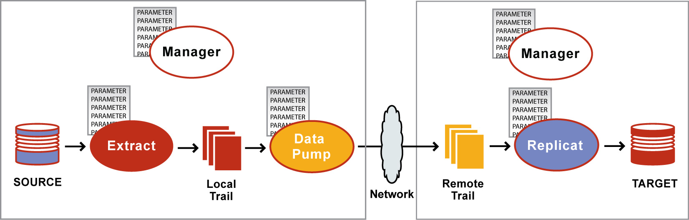
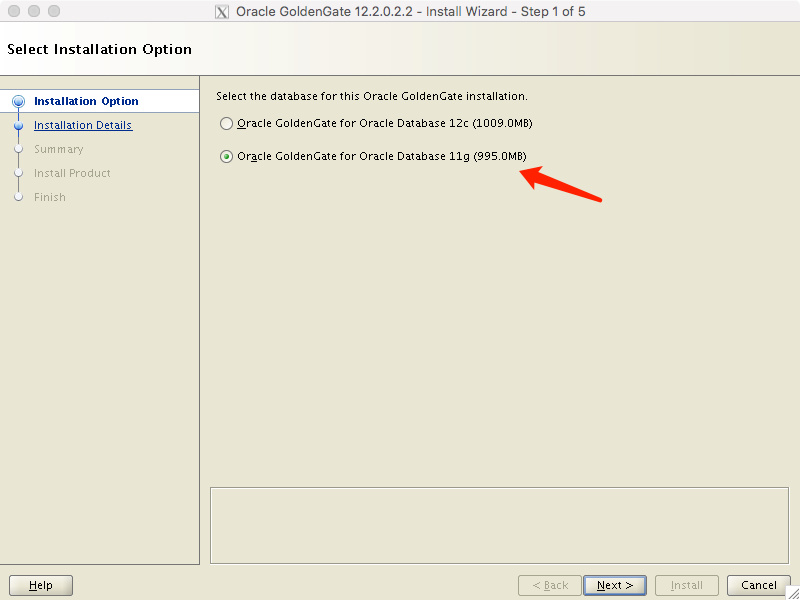
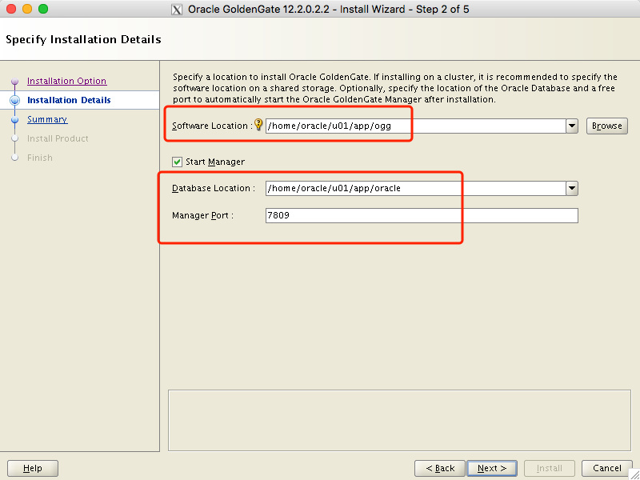

#### OGG架构




#### OGG 下载地址：

```
http://www.oracle.com/technetwork/middleware/goldengate/downloads/index.html
```

选择对应的版本下载即可，PS：需要MOS账号(免费账号即可)。

我们这里选择下载for Oracle on linux  和 For Postgres on linux 两个包，版本为：`12.2.0.2`

#### Oracle端：

##### 解压：

```shell
unzip 122022_fbo_ggs_Linux_x64_shiphome.zip
cd fbo_ggs_Linux_x64_shiphome
```

##### 安装OGG for Oracle

通过xmanager或者xquartz(mac) 登录服务器，通过GUI方式安装OGG

- 启动runInstaller:

```
oracle@localhost4:/home/oracle/fbo_ggs_Linux_x64_shiphome/Disk1-->>./runInstaller 
Starting Oracle Universal Installer...

Checking Temp space: must be greater than 120 MB.   Actual 3994 MB    Passed
Checking swap space: 0 MB available, 150 MB required.    Failed <<<<
Checking monitor: must be configured to display at least 256 colors.    Actual 16777216    Passed

Some requirement checks failed. You must fulfill these requirements before

continuing with the installation,

Continue? (y/n) [n] y

```

- 选择为Oracle 11g database 安装：



- 选择OGG安装路径以及源库路径：



-  点击next，install 安装即可。

11g 安装大小：

```
oracle@localhost4:/home/oracle/u01/app/ogg-->>du -sh
1015M   .
```

##### 进入控制台：

```shell
oracle@localhost4:/home/oracle/u01/app/ogg-->>./ggsci

Oracle GoldenGate Command Interpreter for Oracle
Version 12.2.0.2.2 OGGCORE_12.2.0.2.0_PLATFORMS_170630.0419_FBO
Linux, x64, 64bit (optimized), Oracle 11g on Jun 30 2017 14:42:26
Operating system character set identified as UTF-8.

Copyright (C) 1995, 2017, Oracle and/or its affiliates. All rights reserved.


GGSCI (localhost4) 1> create subdirs 

Creating subdirectories under current directory /home/oracle/u01/app/ogg

Parameter files                /home/oracle/u01/app/ogg/dirprm: already exists
Report files                   /home/oracle/u01/app/ogg/dirrpt: already exists
Checkpoint files               /home/oracle/u01/app/ogg/dirchk: already exists
Process status files           /home/oracle/u01/app/ogg/dirpcs: already exists
SQL script files               /home/oracle/u01/app/ogg/dirsql: already exists
Database definitions files     /home/oracle/u01/app/ogg/dirdef: already exists
Extract data files             /home/oracle/u01/app/ogg/dirdat: already exists
Temporary files                /home/oracle/u01/app/ogg/dirtmp: already exists
Credential store files         /home/oracle/u01/app/ogg/dircrd: already exists
Masterkey wallet files         /home/oracle/u01/app/ogg/dirwlt: already exists
Dump files                     /home/oracle/u01/app/ogg/dirdmp: already exists

-- 通过GUI安装的话，这些子目录都会创建好
GGSCI (localhost4) 2> 
```

##### 配置环境变量

```shell
vi ~/.bashrc

export ORACLE_BASE=/home/oracle/u01/app
export ORACLE_HOME=$ORACLE_BASE/oracle
export ORACLE_SID=adb
export OGG_HOME=/home/oracle/u01/app/ogg
export PATH=$ORACLE_HOME/bin:$PATH:$HOME/bin:$OGG_HOME
export LD_LIBRARY_PATH=$ORACLE_HOME/lib:$LD_LIBRARY_PATH:$OGG_HOME

source ~/.bashrc
```

环境变量生效后，进入控制台的方式为：

```shell
oracle@localhost4:/home/oracle-->>$OGG_HOME/ggsci
```

##### 检查源端归档配置

- 是否开启归档

- ```
  SQL> archive log list
  Database log mode              No Archive Mode
  Automatic archival             Disabled
  Archive destination            USE_DB_RECOVERY_FILE_DEST
  Oldest online log sequence     13723
  Current log sequence           13725
  ```

  检查发现，没有开启归档，调整归档模式，需要重启实例。

- 开启归档

  ```
  shutdown immediate;
  startup mount;
  alter database archivelog;
  alter database open;
  archive log list
  SQL> archive log list
  Database log mode              Archive Mode
  Automatic archival             Enabled
  Archive destination            USE_DB_RECOVERY_FILE_DEST
  Oldest online log sequence     13723
  Next log sequence to archive   13725
  Current log sequence           13725
  SQL>
  ```

##### 添加追加日志

  ```
  alter database force logging;  
  alter database add supplemental log data;
  alter system set ENABLE_GOLDENGATE_REPLICATION=true;
  
 SQL> select log_mode,supplemental_log_data_min,force_logging from v$database;

LOG_MODE     SUPPLEME FOR
------------ -------- ---
ARCHIVELOG   YES      YES

SQL> ALTER SYSTEM SWITCH LOGFILE;

System altered.
  ```

  > 建议在实例mount 状态下执行，否则会很慢很慢。

##### 源端启动mgr

  ```
  GGSCI (localhost4) 5> view param mgr
  
  PORT 7809
  
  
  GGSCI (localhost4) 6> start mgr
  Manager started.
  
  
  GGSCI (localhost4) 7> info all
  
  Program     Status      Group       Lag at Chkpt  Time Since Chkpt
  
  MANAGER     RUNNING                                           
  
  
  GGSCI (localhost4) 8> 
  ```

##### 通过help 查看帮助信息

```
GGSCI (localhost4 as dang1@adb) 14> help

GGSCI Command Summary: 
 
Object:          Command: 
SUBDIRS          CREATE 
DATASTORE        ALTER, CREATE, DELETE, INFO, REPAIR 
ER               INFO, KILL, LAG, SEND, STATUS, START, STATS, STOP 
EXTRACT          ADD, ALTER, CLEANUP, DELETE, INFO, KILL, 
                 LAG, REGISTER, SEND, START, STATS, STATUS, STOP 
                 UNREGISTER 
EXTTRAIL         ADD, ALTER, DELETE, INFO 
GGSEVT           VIEW 
JAGENT           INFO, START, STATUS, STOP 
MANAGER          INFO, SEND, START, STOP, STATUS 
MARKER           INFO 
PARAMETERS       EDIT, VIEW, SET EDITOR, INFO, GETPARAMINFO 
REPLICAT         ADD, ALTER, CLEANUP, DELETE, INFO, KILL, LAG, REGISTER, SEND, 
                 START, STATS, STATUS, STOP, SYNCHRONIZE, UNREGISTER 
REPORT           VIEW 
RMTTRAIL         ADD, ALTER, DELETE, INFO 
TRACETABLE       ADD, DELETE, INFO 
TRANDATA         ADD, DELETE, INFO 
SCHEMATRANDATA   ADD, DELETE, INFO 
CHECKPOINTTABLE  ADD, DELETE, CLEANUP, INFO, UPGRADE 
WALLET           CREATE, OPEN, PURGE 
MASTERKEY        ADD, INFO, RENEW, DELETE, UNDELETE 
CREDENTIALSTORE  ADD, ALTER, INFO, DELETE 
HEARTBEATTABLE   ADD, DELETE, ALTER, INFO 
HEARTBEATENTRY   DELETE 
 
 
Commands without an object: 
(Database)       DBLOGIN, LIST TABLES, ENCRYPT PASSWORD, FLUSH SEQUENCE 
                 MININGDBLOGIN, SET NAMECCSID 
(DDL)            DUMPDDL 
(Miscellaneous)   ! ,ALLOWNESTED | NOALLOWNESTED, CREATE SUBDIRS, 
                 DEFAULTJOURNAL, FC, HELP, HISTORY, INFO ALL, OBEY, SHELL, 
                 SHOW, VERSIONS, VIEW GGSEVT, VIEW REPORT  
                 (note: type the word COMMAND after the ! to display the  
                 ! help topic, for example: GGSCI (sys1)> help ! command 
               
 

For help on a specific command, type HELP <command> <object>.

Example: HELP ADD REPLICAT
```

##### 源端数据库中创建OGG专属表空间和用户

```
create tablespace ogg_tbs datafile '/home/oracle/adb/datafile/ogg_tbs_1.dbf' size 1G;
create user ogg identified by ogg default tablespace ogg_tbs;
grant dba to ogg;
```

##### 在ogg中登录数据库

```
GGSCI (localhost4) 1> dblogin userid ogg password ogg
Successfully logged into database.
```

##### 添加表级别同步

```
GGSCI (localhost4 as ogg@adb) 8> add trandata dang1.BMSQL_CONFIG

Logging of supplemental redo data enabled for table DANG1.BMSQL_CONFIG.
TRANDATA for scheduling columns has been added on table 'DANG1.BMSQL_CONFIG'.
TRANDATA for instantiation CSN has been added on table 'DANG1.BMSQL_CONFIG'.

```

##### 添加整个用户下表同步

```
GGSCI (localhost4 as ogg@adb) 11> add trandata dang1.*

2018-06-12 17:27:47  WARNING OGG-06439  No unique key is defined for table ADB_HA_SYNC_LOG. All viable columns will be used to represent the key, but may not guarantee uniqueness. KEYCOLS may be used to define the key.

Logging of supplemental redo data enabled for table DANG1.ADB_HA_SYNC_LOG.
TRANDATA for scheduling columns has been added on table 'DANG1.ADB_HA_SYNC_LOG'.
TRANDATA for instantiation CSN has been added on table 'DANG1.ADB_HA_SYNC_LOG'.
Logging of supplemental redo log data is already enabled for table DANG1.BMSQL_CONFIG.

TRANDATA for instantiation CSN has been added on table 'DANG1.BMSQL_CONFIG'.
Logging of supplemental redo data enabled for table DANG1.BMSQL_CUSTOMER.
TRANDATA for scheduling columns has been added on table 'DANG1.BMSQL_CUSTOMER'.
TRANDATA for instantiation CSN has been added on table 'DANG1.BMSQL_CUSTOMER'.
Logging of supplemental redo data enabled for table DANG1.BMSQL_DISTRICT.
TRANDATA for scheduling columns has been added on table 'DANG1.BMSQL_DISTRICT'.
TRANDATA for instantiation CSN has been added on table 'DANG1.BMSQL_DISTRICT'.
Logging of supplemental redo data enabled for table DANG1.BMSQL_HISTORY.
TRANDATA for scheduling columns has been added on table 'DANG1.BMSQL_HISTORY'.
TRANDATA for instantiation CSN has been added on table 'DANG1.BMSQL_HISTORY'.
Logging of supplemental redo data enabled for table DANG1.BMSQL_ITEM.
TRANDATA for scheduling columns has been added on table 'DANG1.BMSQL_ITEM'.
TRANDATA for instantiation CSN has been added on table 'DANG1.BMSQL_ITEM'.
Logging of supplemental redo data enabled for table DANG1.BMSQL_NEW_ORDER.
TRANDATA for scheduling columns has been added on table 'DANG1.BMSQL_NEW_ORDER'.
TRANDATA for instantiation CSN has been added on table 'DANG1.BMSQL_NEW_ORDER'.
Logging of supplemental redo data enabled for table DANG1.BMSQL_OORDER.
TRANDATA for scheduling columns has been added on table 'DANG1.BMSQL_OORDER'.
TRANDATA for instantiation CSN has been added on table 'DANG1.BMSQL_OORDER'.
Logging of supplemental redo data enabled for table DANG1.BMSQL_ORDER_LINE.
TRANDATA for scheduling columns has been added on table 'DANG1.BMSQL_ORDER_LINE'.
TRANDATA for instantiation CSN has been added on table 'DANG1.BMSQL_ORDER_LINE'.
Logging of supplemental redo data enabled for table DANG1.BMSQL_STOCK.
TRANDATA for scheduling columns has been added on table 'DANG1.BMSQL_STOCK'.
TRANDATA for instantiation CSN has been added on table 'DANG1.BMSQL_STOCK'.
Logging of supplemental redo data enabled for table DANG1.BMSQL_WAREHOUSE.
TRANDATA for scheduling columns has been added on table 'DANG1.BMSQL_WAREHOUSE'.
TRANDATA for instantiation CSN has been added on table 'DANG1.BMSQL_WAREHOUSE'.
Logging of supplemental redo data enabled for table DANG1.GGS_TRACE.
TRANDATA for scheduling columns has been added on table 'DANG1.GGS_TRACE'.
TRANDATA for instantiation CSN has been added on table 'DANG1.GGS_TRACE'.
```

> 同步方式的选择顺序：主键、唯一键、外键、所有列

##### 生成定义文件

- ggsci 中执行：

```
GGSCI (localhost4 as ogg@adb) 32> edit params defgen
defsfile ./dirdef/dang1.def, purge
userid ogg, password ogg
table dang1.*;
```

- 操作系统上执行：

```
oracle@localhost4:/home/oracle/u01/app/ogg-->>./defgen paramfile ./dirprm/defgen.prm

***********************************************************************
        Oracle GoldenGate Table Definition Generator for Oracle
      Version 12.2.0.2.2 OGGCORE_12.2.0.2.0_PLATFORMS_170630.0419
   Linux, x64, 64bit (optimized), Oracle 11g on Jun 30 2017 11:35:56
 
Copyright (C) 1995, 2017, Oracle and/or its affiliates. All rights reserved.


                    Starting at 2018-06-12 18:09:06
***********************************************************************

Operating System Version:
Linux
Version #1 SMP Wed Oct 5 00:36:12 UTC 2016, Release 2.6.32-642.6.1.el6.x86_64
Node: localhost4
Machine: x86_64
                         soft limit   hard limit
Address Space Size   :    unlimited    unlimited
Heap Size            :    unlimited    unlimited
File Size            :    unlimited    unlimited
CPU Time             :    unlimited    unlimited

Process id: 17287

***********************************************************************
**            Running with the following parameters                  **
***********************************************************************
defsfile ./dirdef/dang1.def, purge
userid ogg, password ***
table dang1.*;
Expanding wildcard table specification dang1.*:

Retrieving definition for DANG1.ADB_HA_SYNC_LOG.

2018-06-12 18:09:08  WARNING OGG-06439  No unique key is defined for table ADB_HA_SYNC_LOG. All viable columns will be used to represent the key, but may not guarantee uniqueness. KEYCOLS may be used to define the key.
Retrieving definition for DANG1.BMSQL_CONFIG.
Retrieving definition for DANG1.BMSQL_CUSTOMER.
Retrieving definition for DANG1.BMSQL_DISTRICT.
Retrieving definition for DANG1.BMSQL_HISTORY.
Retrieving definition for DANG1.BMSQL_ITEM.
Retrieving definition for DANG1.BMSQL_NEW_ORDER.
Retrieving definition for DANG1.BMSQL_OORDER.
Retrieving definition for DANG1.BMSQL_ORDER_LINE.
Retrieving definition for DANG1.BMSQL_STOCK.
Retrieving definition for DANG1.BMSQL_WAREHOUSE.
Retrieving definition for DANG1.GGS_TRACE.


Definitions generated for 12 tables in ./dirdef/dang1.def.
```

- 传输到目标端：

```
scp ./dirdef/dang1.def shboss@10.1.226.201:/home/shboss/oracle/ogg/dirdef/
```

#####   添加data pump extract进程

- 添加extract进程：

  ```
  - GGSCI (localhost4 as ogg@adb) 10> add extract extra1,tranlog,begin now
    EXTRACT added.
  
  GGSCI (localhost4) 1>  add exttrail /home/oracle/u01/app/ogg/dirdat/ex,extract extra1
  EXTTRAIL added.
  
  GGSCI (localhost4 as ogg@adb) 12> edit params extra1
  extract extra1
  userid ogg,password ogg
  exttrail /home/oracle/u01/app/ogg/dirdat/ex
  table dang1.*;
  ```

- 添加data pump进程：

- ```
  GGSCI (localhost4 as ogg@adb) 13> add extract pump1,exttrailsource /home/oracle/u01/app/ogg/dirdat/ex,begin now
    - EXTRACT added.
    
    GGSCI (localhost4 as ogg@adb) 14> add rmttrail /home/shboss/oracle/ogg/dirdat/ex,extract pump1
    RMTTRAIL added.
    
    GGSCI (localhost4) 2> edit params pump1
    extract pump1
    userid ogg,password ogg
    rmthost 10.1.226.201,mgrport 7809
    rmttrail /home/shboss/oracle/ogg/dirdat/ex
    table dang1.*;
  ```

- 启动相关进程

- ```
  GGSCI (localhost4 as ogg@adb) 16> start extract extra1
  
  Sending START request to MANAGER ...
  EXTRACT EXTRA1 starting
  
  GGSCI (localhost4 as ogg@adb) 17> start extract pump1
  
  Sending START request to MANAGER ...
  EXTRACT PUMP1 starting
  ```

- 相关日志：

 ```
  -- extract
  2018-06-13 14:29:30  INFO    OGG-00963  Oracle GoldenGate Manager for Oracle, mgr.prm:  Command received from GGSCI on host [10.1.226.204]:44128 (START EXTRACT EXTRA1 ).
  2018-06-13 14:29:30  INFO    OGG-00960  Oracle GoldenGate Manager for Oracle, mgr.prm:  Access granted (rule #7).
  2018-06-13 14:29:30  INFO    OGG-00975  Oracle GoldenGate Manager for Oracle, mgr.prm:  EXTRACT EXTRA1 starting.
  2018-06-13 14:29:30  INFO    OGG-00992  Oracle GoldenGate Capture for Oracle, extra1.prm:  EXTRACT EXTRA1 starting.
  2018-06-13 14:29:30  INFO    OGG-03059  Oracle GoldenGate Capture for Oracle, extra1.prm:  Operating system character set identified as UTF-8.
  2018-06-13 14:29:30  INFO    OGG-02695  Oracle GoldenGate Capture for Oracle, extra1.prm:  ANSI SQL parameter syntax is used for parameter parsing.
  2018-06-13 14:29:30  INFO    OGG-03522  Oracle GoldenGate Capture for Oracle, extra1.prm:  Setting session time zone to source database time zone 'GMT'.
  2018-06-13 14:29:30  INFO    OGG-01635  Oracle GoldenGate Capture for Oracle, extra1.prm:  BOUNDED RECOVERY: reset to initial or altered checkpoint.
  2018-06-13 14:29:30  INFO    OGG-01815  Oracle GoldenGate Capture for Oracle, extra1.prm:  Virtual Memory Facilities for: BR
      anon alloc: mmap(MAP_ANON)  anon free: munmap
      file alloc: mmap(MAP_SHARED)  file free: munmap
      target directories:
      /home/oracle/u01/app/ogg/BR/EXTRA1.
  2018-06-13 14:29:30  INFO    OGG-01851  Oracle GoldenGate Capture for Oracle, extra1.prm:  filecaching started: thread ID: 139881783228160.
  2018-06-13 14:29:30  INFO    OGG-01815  Oracle GoldenGate Capture for Oracle, extra1.prm:  Virtual Memory Facilities for: COM
      anon alloc: mmap(MAP_ANON)  anon free: munmap
      file alloc: mmap(MAP_SHARED)  file free: munmap
      target directories:
      /home/oracle/u01/app/ogg/dirtmp.
  2018-06-13 14:29:30  WARNING OGG-01842  Oracle GoldenGate Capture for Oracle, extra1.prm:  CACHESIZE PER DYNAMIC DETERMINATION (16G) LESS THAN RECOMMENDED: 64G (64bit system)
  vm found: 29.97G
  Check swap space. Recommended swap/extract: 128G (64bit system).
  2018-06-13 14:29:30  INFO    OGG-02089  Oracle GoldenGate Capture for Oracle, extra1.prm:  Source redo compatibility version is: 11.2.0.4.0.
  2018-06-13 14:29:30  INFO    OGG-01515  Oracle GoldenGate Capture for Oracle, extra1.prm:  Positioning to begin time 2018 M06 13 14:22:53.
  2018-06-13 14:29:30  INFO    OGG-01516  Oracle GoldenGate Capture for Oracle, extra1.prm:  Positioned to Sequence 13741, RBA 10274320, SCN 0.0 (0), 2018 M06 13 14:22:53.
  2018-06-13 14:29:30  INFO    OGG-00993  Oracle GoldenGate Capture for Oracle, extra1.prm:  EXTRACT EXTRA1 started.
  2018-06-13 14:29:30  INFO    OGG-01052  Oracle GoldenGate Capture for Oracle, extra1.prm:  No recovery is required for target file /home/oracle/u01/app/ogg/dirdat/ex000000000, at RBA 0 (file not opened).
  2018-06-13 14:29:30  INFO    OGG-01478  Oracle GoldenGate Capture for Oracle, extra1.prm:  Output file /home/oracle/u01/app/ogg/dirdat/ex is using format RELEASE 12.2.
  2018-06-13 14:29:30  INFO    OGG-01517  Oracle GoldenGate Capture for Oracle, extra1.prm:  Position of first record processed Sequence 13741, RBA 10274320, SCN 0.151190791 (151190791), 2018 M06 13 14:22:53.
  
  
  -- pump
  2018-06-13 14:31:20  INFO    OGG-00987  Oracle GoldenGate Command Interpreter for Oracle:  GGSCI command (oracle): start extract pump1.
  2018-06-13 14:31:20  INFO    OGG-00963  Oracle GoldenGate Manager for Oracle, mgr.prm:  Command received from GGSCI on host [10.1.226.204]:44504 (START EXTRACT PUMP1 ).
  2018-06-13 14:31:20  INFO    OGG-00960  Oracle GoldenGate Manager for Oracle, mgr.prm:  Access granted (rule #7).
  2018-06-13 14:31:20  INFO    OGG-00975  Oracle GoldenGate Manager for Oracle, mgr.prm:  EXTRACT PUMP1 starting.
  2018-06-13 14:31:20  INFO    OGG-00992  Oracle GoldenGate Capture for Oracle, pump1.prm:  EXTRACT PUMP1 starting.
  2018-06-13 14:31:20  INFO    OGG-03059  Oracle GoldenGate Capture for Oracle, pump1.prm:  Operating system character set identified as UTF-8.
  2018-06-13 14:31:20  INFO    OGG-02695  Oracle GoldenGate Capture for Oracle, pump1.prm:  ANSI SQL parameter syntax is used for parameter parsing.
  2018-06-13 14:31:20  INFO    OGG-03522  Oracle GoldenGate Capture for Oracle, pump1.prm:  Setting session time zone to source database time zone 'GMT'.
  2018-06-13 14:31:21  INFO    OGG-01851  Oracle GoldenGate Capture for Oracle, pump1.prm:  filecaching started: thread ID: 139754924566272.
  2018-06-13 14:31:21  INFO    OGG-01815  Oracle GoldenGate Capture for Oracle, pump1.prm:  Virtual Memory Facilities for: COM
      anon alloc: mmap(MAP_ANON)  anon free: munmap
      file alloc: mmap(MAP_SHARED)  file free: munmap
      target directories:
      /home/oracle/u01/app/ogg/dirtmp.
  2018-06-13 14:31:21  WARNING OGG-01842  Oracle GoldenGate Capture for Oracle, pump1.prm:  CACHESIZE PER DYNAMIC DETERMINATION (16G) LESS THAN RECOMMENDED: 64G (64bit system)
  vm found: 29.79G
  Check swap space. Recommended swap/extract: 128G (64bit system).
  2018-06-13 14:31:21  INFO    OGG-02243  Oracle GoldenGate Capture for Oracle, pump1.prm:  Opened trail file /home/oracle/u01/app/ogg/dirdat/ex000000000 at 2018-06-13 14:31:21.052469.
  2018-06-13 14:31:21  WARNING OGG-01015  Oracle GoldenGate Capture for Oracle, pump1.prm:  Positioning with begin time: 2018 M06 13 14:25:38, waiting for data: at extseqno 0, extrba 0.
  2018-06-13 14:31:21  INFO    OGG-00993  Oracle GoldenGate Capture for Oracle, pump1.prm:  EXTRACT PUMP1 started.
  2018-06-13 14:31:26  INFO    OGG-01052  Oracle GoldenGate Capture for Oracle, pump1.prm:  No recovery is required for target file /home/shboss/oracle/ogg/dirdat/ex000000000, at RBA 0 (file not opened).
  2018-06-13 14:31:26  INFO    OGG-01478  Oracle GoldenGate Capture for Oracle, pump1.prm:  Output file /home/shboss/oracle/ogg/dirdat/ex is using format RELEASE 12.2.
  2018-06-13 14:31:26  INFO    OGG-02243  Oracle GoldenGate Capture for Oracle, pump1.prm:  Opened trail file /home/oracle/u01/app/ogg/dirdat/ex000000000 at 2018-06-13 14:31:26.230215.
 ```

- 查看状态

 ```
  GGSCI (localhost4 as ogg@adb) 20> info all
  
  Program     Status      Group       Lag at Chkpt  Time Since Chkpt
  
  MANAGER     RUNNING                                           
  EXTRACT     RUNNING     EXTRA1      00:00:00      00:00:02    
  EXTRACT     RUNNING     PUMP1       00:00:00      00:00:01    
  
  
  GGSCI (localhost4 as ogg@adb) 21> 
 ```

#### AntDB目标端

#####   解压安装包

```
unzip 122022_ggs_Linux_x64_PostgreSQL_64bit.zip
mkdir -p ~/oracle/ogg
cp ggs_Linux_x64_PostgreSQL_64bit.tar ~/oracle/ogg
cd ~/oracle/ogg
tar xvf ggs_Linux_x64_PostgreSQL_64bit.tar
```

##### 配置环境变量

```
export OGG_HOME=/home/shboss/oracle/ogg
export PATH=$PATH:$OGG_HOME
export LD_LIBRARY_PATH=$OGG_HOME/lib:$LD_LIBRARY_PATH
```

##### 进入控制台

```
[shboss@localhost1 ogg]$ ./ggsci 

Oracle GoldenGate Command Interpreter
Version 12.2.0.2.2 OGGCORE_12.2.0.2.0_PLATFORMS_170630.0419
Linux, x64, 64bit (optimized), PostgreSQL on Jun 30 2017 06:27:44
Operating system character set identified as UTF-8.

Copyright (C) 1995, 2017, Oracle and/or its affiliates. All rights reserved.


GGSCI (localhost1) 2> create subdirs

Creating subdirectories under current directory /home/shboss/oracle/ogg

Parameter files                /home/shboss/oracle/ogg/dirprm: created
Report files                   /home/shboss/oracle/ogg/dirrpt: created
Checkpoint files               /home/shboss/oracle/ogg/dirchk: created
Process status files           /home/shboss/oracle/ogg/dirpcs: created
SQL script files               /home/shboss/oracle/ogg/dirsql: created
Database definitions files     /home/shboss/oracle/ogg/dirdef: created
Extract data files             /home/shboss/oracle/ogg/dirdat: created
Temporary files                /home/shboss/oracle/ogg/dirtmp: created
Credential store files         /home/shboss/oracle/ogg/dircrd: created
Masterkey wallet files         /home/shboss/oracle/ogg/dirwlt: created
Dump files                     /home/shboss/oracle/ogg/dirdmp: created
```

##### 目标端配置odbc.ini 文件

```
vi $OGG_HOME/odbc.ini

[ODBC Data Sources]
antdb=AntDB 3.2
[ODBC]
IANAAppCodePage=106
InstallDir=/home/shboss/oracle/ogg
[antdb]
Driver=/home/shboss/oracle/ogg/lib/GGpsql25.so
Description=AntDB 3.2
Database=bmsql5
HostName=10.1.226.201
PortNumber=18613
LogonID=bmsql5_ora
Password=bmsql5_ora

vi ~/.bashrc
export ODBCINI=/home/shboss/oracle/ogg/odbc.ini
```

##### 验证odbc的配置

```
GGSCI (localhost1) 5> dblogin sourcedb antdb  userid bmsql5_ora,password bmsql5_ora;

2018-06-13 15:46:35  INFO    OGG-03036  Database character set identified as UTF-8. Locale: root.

2018-06-13 15:46:35  INFO    OGG-03037  Session character set identified as UTF-8.
Successfully logged into database.

GGSCI (localhost1 as bmsql5_ora@antdb) 6> 
-- 其中sourcedb  antdb 为 odbc.ini 中配置的名称
```

##### 添加replicat进程

```
GGSCI (localhost1 as bmsql5_ora@antdb) 10> add replicat rep1, NODBCHECKPOINT, exttrail /home/shboss/oracle/ogg/dirdat/ex,begin now  
REPLICAT added.

GGSCI (localhost1 as bmsql5_ora@antdb) 12> edit params rep1  
REPLICAT rep1
SOURCEDEFS ./dirdef/dang1.def
SETENV (PGCLIENTENCODING = "UTF8")
SETENV (NLS_LANG="AMERICAN_AMERICA.AL32UTF8")
SETENV (ODBCINI="/home/shboss/oracle/ogg/odbc.ini" )
DISCARDFILE ./dirrpt/diskg.dsc, purge
TARGETDB antdb, USERID bmsql5_ora, PASSWORD bmsql5_ora  
MAP dang1.* ,TARGET bmsql5_ora.*;

start rep1
```

#### 数据同步验证

- Oracle 端执行update


```
SQL> update bmsql_config set CFG_VALUE='102' where CFG_NAME='warehouses';

1 row updated.
SQL> commit;

Commit complete.
```

- Oracle侧ogg 日志


```
2018-06-13 16:54:16  INFO    OGG-06508  Oracle GoldenGate Capture for Oracle, extra1.prm:  Wildcard MAP (TABLE) resolved (entry dang1.*): table "DANG1"."BMSQL_CONFIG".
2018-06-13 16:54:16  INFO    OGG-06509  Oracle GoldenGate Capture for Oracle, extra1.prm:  Using the following key columns for source table DANG1.BMSQL_CONFIG: CFG_NAME.
2018-06-13 16:54:18  INFO    OGG-02262  Oracle GoldenGate Capture for Oracle, pump1.prm:  Passthru wildcard MAP (TABLE) resolved (entry dang1.*): table "DANG1"."BMSQL_CONFIG".
```

- pg侧 ogg日志


```
2018-06-13 17:52:39  INFO    OGG-00987  Oracle GoldenGate Command Interpreter:  GGSCI command (shboss): start rep1.
2018-06-13 17:52:39  INFO    OGG-00963  Oracle GoldenGate Manager, mgr.prm:  Command received from GGSCI on host [10.1.226.201]:49690 (START REPLICAT REP1 ).
2018-06-13 17:52:39  INFO    OGG-00960  Oracle GoldenGate Manager, mgr.prm:  Access granted (rule #7).
2018-06-13 17:52:39  INFO    OGG-00975  Oracle GoldenGate Manager, mgr.prm:  REPLICAT REP1 starting.
2018-06-13 17:52:39  INFO    OGG-00995  Oracle GoldenGate Delivery, rep1.prm:  REPLICAT REP1 starting.
2018-06-13 17:52:39  INFO    OGG-03059  Oracle GoldenGate Delivery, rep1.prm:  Operating system character set identified as UTF-8.
2018-06-13 17:52:39  INFO    OGG-02695  Oracle GoldenGate Delivery, rep1.prm:  ANSI SQL parameter syntax is used for parameter parsing.
2018-06-13 17:52:39  INFO    OGG-02095  Oracle GoldenGate Delivery, rep1.prm:  Successfully set environment variable PGCLIENTENCODING=UTF8.
2018-06-13 17:52:39  INFO    OGG-02095  Oracle GoldenGate Delivery, rep1.prm:  Successfully set environment variable NLS_LANG=AMERICAN_AMERICA.AL32UTF8.
2018-06-13 17:52:39  INFO    OGG-02095  Oracle GoldenGate Delivery, rep1.prm:  Successfully set environment variable ODBCINI=/home/shboss/oracle/ogg/odbc.ini.
2018-06-13 17:52:39  INFO    OGG-03528  Oracle GoldenGate Delivery, rep1.prm:  The source database character set, as determined from the table definition file, is zhs16gbk.
2018-06-13 17:52:39  INFO    OGG-02095  Oracle GoldenGate Delivery, rep1.prm:  Successfully set environment variable PGCLIENTENCODING=UTF8.
2018-06-13 17:52:39  INFO    OGG-02095  Oracle GoldenGate Delivery, rep1.prm:  Successfully set environment variable NLS_LANG=AMERICAN_AMERICA.AL32UTF8.
2018-06-13 17:52:39  INFO    OGG-02095  Oracle GoldenGate Delivery, rep1.prm:  Successfully set environment variable ODBCINI=/home/shboss/oracle/ogg/odbc.ini.
2018-06-13 17:52:39  INFO    OGG-03036  Oracle GoldenGate Delivery, rep1.prm:  Database character set identified as UTF-8. Locale: root.
2018-06-13 17:52:39  INFO    OGG-03037  Oracle GoldenGate Delivery, rep1.prm:  Session character set identified as UTF-8.
2018-06-13 17:52:39  INFO    OGG-01815  Oracle GoldenGate Delivery, rep1.prm:  Virtual Memory Facilities for: COM
    anon alloc: mmap(MAP_ANON)  anon free: munmap
    file alloc: mmap(MAP_SHARED)  file free: munmap
    target directories:
    /home/shboss/oracle/ogg/dirtmp.
2018-06-13 17:52:39  WARNING OGG-05673  Oracle GoldenGate Delivery, rep1.prm:  CSN-based duplicate suppression is disabled because there is no checkpoint table for this Replicat.
2018-06-13 17:52:39  INFO    OGG-00996  Oracle GoldenGate Delivery, rep1.prm:  REPLICAT REP1 started.
2018-06-13 17:52:39  INFO    OGG-02243  Oracle GoldenGate Delivery, rep1.prm:  Opened trail file /home/shboss/oracle/ogg/dirdat/ex000000000 at 2018-06-13 17:52:39.710218.
2018-06-13 17:52:39  WARNING OGG-02761  Oracle GoldenGate Delivery, rep1.prm:  Source definitions file, ./dirdef/dang1.def, is ignored because trail file /home/shboss/oracle/ogg/dirdat/ex000000000 contains table definitions.
2018-06-13 17:52:39  INFO    OGG-03506  Oracle GoldenGate Delivery, rep1.prm:  The source database character set, as determined from the trail file, is zhs16gbk.
2018-06-13 17:52:39  INFO    OGG-06506  Oracle GoldenGate Delivery, rep1.prm:  Wildcard MAP resolved (entry dang1.*): MAP "DANG1"."BMSQL_CONFIG" ,TARGET bmsql5_ora."BMSQL_CONFIG".
2018-06-13 17:52:39  INFO    OGG-02756  Oracle GoldenGate Delivery, rep1.prm:  The definition for table DANG1.BMSQL_CONFIG is obtained from the trail file.
2018-06-13 17:52:39  INFO    OGG-06511  Oracle GoldenGate Delivery, rep1.prm:  Using following columns in default map by name: cfg_name, cfg_value.
2018-06-13 17:52:39  INFO    OGG-06510  Oracle GoldenGate Delivery, rep1.prm:  Using the following key columns for target table bmsql5_ora.bmsql_config: cfg_name.
2018-06-13 17:52:39  INFO    OGG-03010  Oracle GoldenGate Delivery, rep1.prm:  Performing implicit conversion of column data from character set zhs16gbk to UTF-8.

```

- pg侧查询数据

```
  bmsql5=# select * from bmsql_config;
    cfg_name   | cfg_value 
  -------------+-----------
   nURandCLast | 193
   nURandCC_ID | 591
   nURandCI_ID | 3748
   warehouses  | 102
  (4 rows)
```

  可以看到，同步成功。

##### 通过benchmark的数据进行验证

- 在Oracle侧发起10分钟50并发的压测：

  ```shell
  16:42:17,271 [Thread-2] INFO   jTPCC : Term-00, Measured tpmC (NewOrders) = 136.8
  16:42:17,272 [Thread-2] INFO   jTPCC : Term-00, Measured tpmTOTAL = 295.24
  16:42:17,272 [Thread-2] INFO   jTPCC : Term-00, Session Start     = 2018-06-20 16:32:07
  16:42:17,272 [Thread-2] INFO   jTPCC : Term-00, Session End       = 2018-06-20 16:42:17
  16:42:17,272 [Thread-2] INFO   jTPCC : Term-00, Transaction Count = 3001
  ```

- 在PG侧通过oracle_fdw+外表的方式，查询数据的hashtext

  ```
[dangpg@localhost2 scripts]$ cat bmsql5_ora_hashtext.sql;cat bmsql5_ora_fdw_hashtext.sql
   2018-06-20 17:02:29.458803+08
  
   BMSQL_WAREHOUSE   | 9222570356
  
   BMSQL_CONFIG      | -2415073412
  
   BMSQL_ITEM        | 18051450952
  
   BMSQL_STOCK       | 4656629290784
  
   BMSQL_DISTRICT    | -14704180797
  
   BMSQL_CUSTOMER    | -113739363328
  
   BMSQL_HISTORY     | -919558092992
  
   BMSQL_OORDER      | -712223494884
  
   BMSQL_ORDER_LINE  | 11590714856074
  
   BMSQL_NEW_ORDER   | -983040485454
  
   2018-06-20 17:04:39.909656+08
  
   2018-06-20 16:56:00.638911+08
  
   BMSQL_WAREHOUSE   | 9222570356
  
   BMSQL_CONFIG      | -2415073412
  
   BMSQL_ITEM        | 18051450952
  
   BMSQL_STOCK       | 4656629290784
  
   BMSQL_DISTRICT    | -14704180797
  
   BMSQL_CUSTOMER    | -113739363328
  
   BMSQL_HISTORY     | -919558092992
  
   BMSQL_OORDER      | -712223494884
  
   BMSQL_ORDER_LINE  | 11590714856074
  
   BMSQL_NEW_ORDER   | -983040485454
  
   2018-06-20 17:14:52.965318+08
  ```

  两边数据hash值一致，方案验证通过。

#### 目标端数据初始化-- 数据不落地

##### 在源端添加初始化抽取进程

```
GGSCI (localhost4) 16> add extract initext,sourceistable
EXTRACT added.
GGSCI (localhost4) 17> edit param initext
extract initext
userid ogg,password ogg
rmthost 10.1.226.201,mgrport 7809
rmttask replicat,group initrep
table dang1.*;
```

##### 在目标端添加初始化复制进程

```
GGSCI (localhost1 as bmsql5_ora@antdb) 7> add replicat initrep,specialrun
REPLICAT added.

GGSCI (localhost1 as bmsql5_ora@antdb) 8> edit param initrep
replicat initrep
ASSUMETARGETDEFS
DISCARDFILE ./dirrpt/diskg.dsc, purge, APPEND, MEGABYTES 100
TARGETDB antdb, USERID bmsql5_ora, PASSWORD bmsql5_ora
MAP dang1.* ,TARGET bmsql5_ora.*;
```

##### 启动源端抽取进程

```
GGSCI (localhost4) 21> start initext

Sending START request to MANAGER ...
EXTRACT INITEXT starting

```

对应的日志：

```
2018-07-10 15:30:10  INFO    OGG-00987  Oracle GoldenGate Command Interpreter for Oracle:  GGSCI command (oracle): start initext.
2018-07-10 15:30:10  INFO    OGG-00963  Oracle GoldenGate Manager for Oracle, mgr.prm:  Command received from GGSCI on host [10.1.226.204]:49198 (START EXTRACT INITEXT ).
2018-07-10 15:30:10  INFO    OGG-00960  Oracle GoldenGate Manager for Oracle, mgr.prm:  Access granted (rule #7).
2018-07-10 15:30:10  INFO    OGG-00975  Oracle GoldenGate Manager for Oracle, mgr.prm:  EXTRACT INITEXT starting.
2018-07-10 15:30:10  INFO    OGG-01017  Oracle GoldenGate Capture for Oracle, initext.prm:  Wildcard resolution set to IMMEDIATE because SOURCEISTABLE is used.
2018-07-10 15:30:10  INFO    OGG-00992  Oracle GoldenGate Capture for Oracle, initext.prm:  EXTRACT INITEXT starting.
2018-07-10 15:30:10  INFO    OGG-03059  Oracle GoldenGate Capture for Oracle, initext.prm:  Operating system character set identified as UTF-8.
2018-07-10 15:30:10  INFO    OGG-02695  Oracle GoldenGate Capture for Oracle, initext.prm:  ANSI SQL parameter syntax is used for parameter parsing.
2018-07-10 15:30:11  INFO    OGG-03522  Oracle GoldenGate Capture for Oracle, initext.prm:  Setting session time zone to source database time zone 'GMT'.
2018-07-10 15:30:11  INFO    OGG-06508  Oracle GoldenGate Capture for Oracle, initext.prm:  Wildcard MAP (TABLE) resolved (entry dang1.*): table "DANG1"."BMSQL_CONFIG".
2018-07-10 15:30:11  INFO    OGG-06509  Oracle GoldenGate Capture for Oracle, initext.prm:  Using the following key columns for source table DANG1.BMSQL_CONFIG: CFG_NAME.
2018-07-10 15:30:11  INFO    OGG-06508  Oracle GoldenGate Capture for Oracle, initext.prm:  Wildcard MAP (TABLE) resolved (entry dang1.*): table "DANG1"."BMSQL_CUSTOMER".
2018-07-10 15:30:11  INFO    OGG-06509  Oracle GoldenGate Capture for Oracle, initext.prm:  Using the following key columns for source table DANG1.BMSQL_CUSTOMER: C_W_ID, C_D_ID, C_ID.
2018-07-10 15:30:11  INFO    OGG-06508  Oracle GoldenGate Capture for Oracle, initext.prm:  Wildcard MAP (TABLE) resolved (entry dang1.*): table "DANG1"."BMSQL_DISTRICT".
2018-07-10 15:30:11  INFO    OGG-06509  Oracle GoldenGate Capture for Oracle, initext.prm:  Using the following key columns for source table DANG1.BMSQL_DISTRICT: D_W_ID, D_ID.
2018-07-10 15:30:11  INFO    OGG-06508  Oracle GoldenGate Capture for Oracle, initext.prm:  Wildcard MAP (TABLE) resolved (entry dang1.*): table "DANG1"."BMSQL_HISTORY".
2018-07-10 15:30:11  INFO    OGG-06509  Oracle GoldenGate Capture for Oracle, initext.prm:  Using the following key columns for source table DANG1.BMSQL_HISTORY: HIST_ID.
2018-07-10 15:30:11  INFO    OGG-06508  Oracle GoldenGate Capture for Oracle, initext.prm:  Wildcard MAP (TABLE) resolved (entry dang1.*): table "DANG1"."BMSQL_ITEM".
2018-07-10 15:30:11  INFO    OGG-06509  Oracle GoldenGate Capture for Oracle, initext.prm:  Using the following key columns for source table DANG1.BMSQL_ITEM: I_ID.
2018-07-10 15:30:11  INFO    OGG-06508  Oracle GoldenGate Capture for Oracle, initext.prm:  Wildcard MAP (TABLE) resolved (entry dang1.*): table "DANG1"."BMSQL_NEW_ORDER".
2018-07-10 15:30:11  INFO    OGG-06509  Oracle GoldenGate Capture for Oracle, initext.prm:  Using the following key columns for source table DANG1.BMSQL_NEW_ORDER: NO_W_ID, NO_D_ID, NO_O_ID.
2018-07-10 15:30:11  INFO    OGG-06508  Oracle GoldenGate Capture for Oracle, initext.prm:  Wildcard MAP (TABLE) resolved (entry dang1.*): table "DANG1"."BMSQL_OORDER".
2018-07-10 15:30:11  INFO    OGG-06509  Oracle GoldenGate Capture for Oracle, initext.prm:  Using the following key columns for source table DANG1.BMSQL_OORDER: O_W_ID, O_D_ID, O_ID.
2018-07-10 15:30:11  INFO    OGG-06508  Oracle GoldenGate Capture for Oracle, initext.prm:  Wildcard MAP (TABLE) resolved (entry dang1.*): table "DANG1"."BMSQL_ORDER_LINE".
2018-07-10 15:30:11  INFO    OGG-06509  Oracle GoldenGate Capture for Oracle, initext.prm:  Using the following key columns for source table DANG1.BMSQL_ORDER_LINE: OL_W_ID, OL_D_ID, OL_O_ID, OL_NUMBER.
2018-07-10 15:30:11  INFO    OGG-06508  Oracle GoldenGate Capture for Oracle, initext.prm:  Wildcard MAP (TABLE) resolved (entry dang1.*): table "DANG1"."BMSQL_STOCK".
2018-07-10 15:30:11  INFO    OGG-06509  Oracle GoldenGate Capture for Oracle, initext.prm:  Using the following key columns for source table DANG1.BMSQL_STOCK: S_W_ID, S_I_ID.
2018-07-10 15:30:11  INFO    OGG-06508  Oracle GoldenGate Capture for Oracle, initext.prm:  Wildcard MAP (TABLE) resolved (entry dang1.*): table "DANG1"."BMSQL_WAREHOUSE".
2018-07-10 15:30:11  INFO    OGG-06509  Oracle GoldenGate Capture for Oracle, initext.prm:  Using the following key columns for source table DANG1.BMSQL_WAREHOUSE: W_ID.
2018-07-10 15:30:11  INFO    OGG-06508  Oracle GoldenGate Capture for Oracle, initext.prm:  Wildcard MAP (TABLE) resolved (entry dang1.*): table "DANG1"."GGS_TRACE".
2018-07-10 15:30:11  INFO    OGG-06509  Oracle GoldenGate Capture for Oracle, initext.prm:  Using the following key columns for source table DANG1.GGS_TRACE: GROUP_ID.
2018-07-10 15:30:11  INFO    OGG-01851  Oracle GoldenGate Capture for Oracle, initext.prm:  filecaching started: thread ID: 139830042294016.
2018-07-10 15:30:11  INFO    OGG-01815  Oracle GoldenGate Capture for Oracle, initext.prm:  Virtual Memory Facilities for: COM
    anon alloc: mmap(MAP_ANON)  anon free: munmap
    file alloc: mmap(MAP_SHARED)  file free: munmap
    target directories:
    /home/oracle/u01/app/ogg/dirtmp.
2018-07-10 15:30:11  WARNING OGG-01842  Oracle GoldenGate Capture for Oracle, initext.prm:  CACHESIZE PER DYNAMIC DETERMINATION (16G) LESS THAN RECOMMENDED: 64G (64bit system)
vm found: 31.07G
Check swap space. Recommended swap/extract: 128G (64bit system).
2018-07-10 15:30:11  INFO    OGG-00993  Oracle GoldenGate Capture for Oracle, initext.prm:  EXTRACT INITEXT started.
2018-07-10 15:30:16  INFO    OGG-02911  Oracle GoldenGate Capture for Oracle, initext.prm:  Processing table DANG1.BMSQL_CONFIG.
2018-07-10 15:30:16  INFO    OGG-02911  Oracle GoldenGate Capture for Oracle, initext.prm:  Processing table DANG1.BMSQL_CUSTOMER.
```

##### 结论

这种不落地的方式确实可以实现目标端数据的初始化，但就是速度太慢了，测试环境半分钟才2000条数据。

#### 目标端数据初始化-- 数据落地

##### 在源端添加初始化抽取进程

```
GGSCI (localhost4) 24> edit param initext
extract initext
userid ogg,password ogg
rmthost 10.1.226.201,mgrport 7809
rmtfile ./dirdat/ie, maxfiles 999999, megabytes 1500, append
table dang1.*;
```

##### 在目标端添加初始化复制进程

```
GGSCI (localhost1 as bmsql5_ora@antdb) 7> add replicat initrep,exttrail ./dirdat/ie
REPLICAT added.

GGSCI (localhost1 as bmsql5_ora@antdb) 19> edit param initrep
replicat initrep
DISCARDFILE ./dirrpt/diskg.dsc, APPEND, MEGABYTES 100
TARGETDB antdb, USERID bmsql5_ora, PASSWORD bmsql5_ora
MAP dang1.* ,TARGET bmsql5_ora.*;
```

##### 启动源端抽取进程：

```
GGSCI (localhost4) 2> start initext

Sending START request to MANAGER ...
EXTRACT INITEXT starting
```

对应的日志：

```
2018-07-10 15:46:06  INFO    OGG-00993  Oracle GoldenGate Capture for Oracle, initext.prm:  EXTRACT INITEXT started.
2018-07-10 15:46:11  INFO    OGG-01478  Oracle GoldenGate Capture for Oracle, initext.prm:  Output file ./dirdat/initext is using format RELEASE 12.2.
2018-07-10 15:46:11  INFO    OGG-02911  Oracle GoldenGate Capture for Oracle, initext.prm:  Processing table DANG1.BMSQL_CONFIG.
2018-07-10 15:46:11  INFO    OGG-02911  Oracle GoldenGate Capture for Oracle, initext.prm:  Processing table DANG1.BMSQL_CUSTOMER.
2018-07-10 15:46:35  INFO    OGG-01026  Oracle GoldenGate Capture for Oracle, initext.prm:  Rolling over remote file ./dirdat/initext000001.
2018-07-10 15:46:47  INFO    OGG-02911  Oracle GoldenGate Capture for Oracle, initext.prm:  Processing table DANG1.BMSQL_DISTRICT.
2018-07-10 15:46:47  INFO    OGG-02911  Oracle GoldenGate Capture for Oracle, initext.prm:  Processing table DANG1.BMSQL_HISTORY.
2018-07-10 15:47:03  INFO    OGG-02911  Oracle GoldenGate Capture for Oracle, initext.prm:  Processing table DANG1.BMSQL_ITEM.
2018-07-10 15:47:03  INFO    OGG-02911  Oracle GoldenGate Capture for Oracle, initext.prm:  Processing table DANG1.BMSQL_NEW_ORDER.
2018-07-10 15:47:06  INFO    OGG-02911  Oracle GoldenGate Capture for Oracle, initext.prm:  Processing table DANG1.BMSQL_OORDER.
2018-07-10 15:47:08  INFO    OGG-01026  Oracle GoldenGate Capture for Oracle, initext.prm:  Rolling over remote file ./dirdat/initext000002.

2018-07-10 15:47:20  INFO    OGG-02911  Oracle GoldenGate Capture for Oracle, initext.prm:  Processing table DANG1.BMSQL_ORDER_LINE.
2018-07-10 15:47:50  INFO    OGG-01026  Oracle GoldenGate Capture for Oracle, initext.prm:  Rolling over remote file ./dirdat/initext000003.

2018-07-10 15:48:29  INFO    OGG-01026  Oracle GoldenGate Capture for Oracle, initext.prm:  Rolling over remote file ./dirdat/initext000004.
2018-07-10 15:49:06  INFO    OGG-01026  Oracle GoldenGate Capture for Oracle, initext.prm:  Rolling over remote file ./dirdat/initext000005.

2018-07-10 15:49:44  INFO    OGG-01026  Oracle GoldenGate Capture for Oracle, initext.prm:  Rolling over remote file ./dirdat/initext000006.
2018-07-10 15:49:53  INFO    OGG-02911  Oracle GoldenGate Capture for Oracle, initext.prm:  Processing table DANG1.BMSQL_STOCK.
2018-07-10 15:50:11  INFO    OGG-01026  Oracle GoldenGate Capture for Oracle, initext.prm:  Rolling over remote file ./dirdat/initext000007.

2018-07-10 15:50:34  INFO    OGG-01026  Oracle GoldenGate Capture for Oracle, initext.prm:  Rolling over remote file ./dirdat/initext000008.
2018-07-10 15:50:58  INFO    OGG-01026  Oracle GoldenGate Capture for Oracle, initext.prm:  Rolling over remote file ./dirdat/initext000009.
2018-07-10 15:51:03  INFO    OGG-02911  Oracle GoldenGate Capture for Oracle, initext.prm:  Processing table DANG1.BMSQL_WAREHOUSE.
2018-07-10 15:51:03  INFO    OGG-02911  Oracle GoldenGate Capture for Oracle, initext.prm:  Processing table DANG1.GGS_TRACE.
2018-07-10 15:51:03  INFO    OGG-00991  Oracle GoldenGate Capture for Oracle, initext.prm:  EXTRACT INITEXT stopped normally.
```

dang1下的表大小有10GB，五分钟抽取完成。

抽取的文件在目标端的dirdat目录下：

```
[shboss@localhost1 dirdat]$ ls -lrth |grep ie
-rw-r----- 1 shboss shboss 1.5G Jul 10 16:12 ie000000
-rw-r----- 1 shboss shboss 1.5G Jul 10 16:12 ie000001
-rw-r----- 1 shboss shboss 1.5G Jul 10 16:13 ie000002
-rw-r----- 1 shboss shboss 1.5G Jul 10 16:14 ie000003
-rw-r----- 1 shboss shboss 1.5G Jul 10 16:14 ie000004
-rw-r----- 1 shboss shboss 1.5G Jul 10 16:15 ie000005
-rw-r----- 1 shboss shboss 1.5G Jul 10 16:16 ie000006
-rw-r----- 1 shboss shboss 1.5G Jul 10 16:16 ie000007
-rw-r----- 1 shboss shboss 1.5G Jul 10 16:16 ie000008
-rw-r----- 1 shboss shboss 313M Jul 10 16:16 ie000009
```

##### 启动目标端复制进程

```
GGSCI (localhost1) 4> start initrep

Sending START request to MANAGER ...
REPLICAT INITREP starting
```

相关日志：

```
2018-07-10 16:13:02  INFO    OGG-00996  Oracle GoldenGate Delivery, initrep.prm:  REPLICAT INITREP started.
2018-07-10 16:13:03  INFO    OGG-02243  Oracle GoldenGate Delivery, initrep.prm:  Opened trail file ./dirdat/ie000000 at 2018-07-10 16:13:03.371980.
2018-07-10 16:13:03  INFO    OGG-03506  Oracle GoldenGate Delivery, initrep.prm:  The source database character set, as determined from the trail file, is zhs16gbk.
2018-07-10 16:13:03  INFO    OGG-06506  Oracle GoldenGate Delivery, initrep.prm:  Wildcard MAP resolved (entry dang1.*): MAP "DANG1"."BMSQL_CONFIG" ,TARGET bmsql5_ora."BMSQL_CONFIG".
2018-07-10 16:13:03  INFO    OGG-02756  Oracle GoldenGate Delivery, initrep.prm:  The definition for table DANG1.BMSQL_CONFIG is obtained from the trail file.
2018-07-10 16:13:03  INFO    OGG-06511  Oracle GoldenGate Delivery, initrep.prm:  Using following columns in default map by name: cfg_name, cfg_value.
2018-07-10 16:13:03  INFO    OGG-06510  Oracle GoldenGate Delivery, initrep.prm:  Using the following key columns for target table bmsql5_ora.bmsql_config: cfg_name.
2018-07-10 16:13:03  INFO    OGG-03010  Oracle GoldenGate Delivery, initrep.prm:  Performing implicit conversion of column data from character set zhs16gbk to UTF-8.
2018-07-10 16:13:03  INFO    OGG-06506  Oracle GoldenGate Delivery, initrep.prm:  Wildcard MAP resolved (entry dang1.*): MAP "DANG1"."BMSQL_CUSTOMER" ,TARGET bmsql5_ora."BMSQL_CUSTOMER".
2018-07-10 16:13:03  INFO    OGG-02756  Oracle GoldenGate Delivery, initrep.prm:  The definition for table DANG1.BMSQL_CUSTOMER is obtained from the trail file.
2018-07-10 16:13:03  INFO    OGG-06511  Oracle GoldenGate Delivery, initrep.prm:  Using following columns in default map by name: c_w_id, c_d_id, c_id, c_discount, c_credit, c_last, c_first, c_credit_lim, c_balance, c_ytd_payment, c_payment_cnt, c_delivery_cnt, c_street_1, c_street_2, c_city, c_state, c_zip, c_phone, c_since, c_middle, c_data.
2018-07-10 16:13:03  INFO    OGG-06510  Oracle GoldenGate Delivery, initrep.prm:  Using the following key columns for target table bmsql5_ora.bmsql_customer: c_w_id, c_d_id, c_id.
```

开始进程数据初始化。

##### 结论：

依然很慢。。。

##### 对复制进程进行拆分

删除之前的复制进程：

```
GGSCI (localhost1) 3> delete initrep
ERROR: Could not delete DB checkpoint for REPLICAT INITREP (Database login required to delete database checkpoint)

GGSCI (localhost1) 4> dblogin sourcedb antdb  userid bmsql5_ora,password bmsql5_ora;

2018-07-10 16:36:11  INFO    OGG-03036  Database character set identified as UTF-8. Locale: root.

2018-07-10 16:36:11  INFO    OGG-03037  Session character set identified as UTF-8.
Successfully logged into database.

GGSCI (localhost1 as bmsql5_ora@antdb) 5> delete initrep
Deleted REPLICAT INITREP
```

添加5个复制进程：

```
GGSCI (localhost1 as bmsql5_ora@antdb) 7> add replicat initrep1,exttrail ./dirdat/ie
REPLICAT added.

GGSCI (localhost1 as bmsql5_ora@antdb) 19> edit param initrep1
replicat initrep1
DISCARDFILE ./dirrpt/diskg.dsc, APPEND, MEGABYTES 100
TARGETDB antdb, USERID bmsql5_ora, PASSWORD bmsql5_ora
MAP dang1.* ,TARGET bmsql5_ora.*; FILTER (@RANGE (1, 5));

GGSCI (localhost1 as bmsql5_ora@antdb) 7> add replicat initrep2,exttrail ./dirdat/ie
REPLICAT added.

GGSCI (localhost1 as bmsql5_ora@antdb) 19> edit param initrep2
replicat initrep2
DISCARDFILE ./dirrpt/diskg.dsc, APPEND, MEGABYTES 100
TARGETDB antdb, USERID bmsql5_ora, PASSWORD bmsql5_ora
MAP dang1.* ,TARGET bmsql5_ora.*; FILTER (@RANGE (2, 5));

GGSCI (localhost1 as bmsql5_ora@antdb) 7> add replicat initrep3,exttrail ./dirdat/ie
REPLICAT added.

GGSCI (localhost1 as bmsql5_ora@antdb) 19> edit param initrep3
replicat initrep3
DISCARDFILE ./dirrpt/diskg.dsc, APPEND, MEGABYTES 100
TARGETDB antdb, USERID bmsql5_ora, PASSWORD bmsql5_ora
MAP dang1.* ,TARGET bmsql5_ora.*; FILTER (@RANGE (3, 5));

GGSCI (localhost1 as bmsql5_ora@antdb) 7> add replicat initrep4,exttrail ./dirdat/ie
REPLICAT added.

GGSCI (localhost1 as bmsql5_ora@antdb) 19> edit param initrep4
replicat initrep4
DISCARDFILE ./dirrpt/diskg.dsc, APPEND, MEGABYTES 100
TARGETDB antdb, USERID bmsql5_ora, PASSWORD bmsql5_ora
MAP dang1.* ,TARGET bmsql5_ora.*; FILTER (@RANGE (4, 5));

GGSCI (localhost1 as bmsql5_ora@antdb) 7> add replicat initrep5,exttrail ./dirdat/ie
REPLICAT added.

GGSCI (localhost1 as bmsql5_ora@antdb) 19> edit param initrep5
replicat initrep5
DISCARDFILE ./dirrpt/diskg.dsc, APPEND, MEGABYTES 100
TARGETDB antdb, USERID bmsql5_ora, PASSWORD bmsql5_ora
MAP dang1.* ,TARGET bmsql5_ora.*; FILTER (@RANGE (5, 5));
```

启动多个复制进程：

```
GGSCI (localhost1 as bmsql5_ora@antdb) 16> start initrep*

Sending START request to MANAGER ...
REPLICAT INITREP1 starting

Sending START request to MANAGER ...
REPLICAT INITREP2 starting

Sending START request to MANAGER ...
REPLICAT INITREP3 starting

Sending START request to MANAGER ...
REPLICAT INITREP4 starting

Sending START request to MANAGER ...
REPLICAT INITREP5 starting
```

慢的原因可能是，OGG后台进程一条条在insert：

```
2018-07-10 16:47:42.999 CST,"bmsql5_ora","bmsql5",29056,"10.1.226.201:33633",5b44710b.7180,12084,"INSERT",2018-07-10 16:40:43 CST,9/269,72783,LOG,00000,"duration: 2.548 ms  grammar: postgres execute ST4CB15F0/ST4CB15F0: INSERT INTO ""bmsql5_ora"".""bmsql_customer"" (""c_w_id"",""c_d_id"",""c_id"",""c_discount"",""c_credit"",""c_last"",""c_first"",""c_credit_lim"",""c_balance"",""c_ytd_payment"",""c_payment_cnt"",""c_delivery_cnt"",""c_street_1"",""c_street_2"",""c_city"",""c_state"",""c_zip"",""c_phone"",""c_since"",""c_middle"",""c_data"") VALUES ($1,$2,$3,$4,$5,$6,$7,$8,$9,$10,$11,$12,$13,$14,$15,$16,$17,$18,$19,$20,$21)","parameters: $1 = '2', $2 = '2', $3 = '2678', $4 = '0.1780', $5 = 'GC', $6 = 'PRIABLEBAR', $7 = 'q6lg1yF8yI', $8 = '50000.00', $9 = '-10.00', $10 = '10.00', $11 = '1', $12 = '1', $13 = 'fNx0sh4s1tJqnuL7', $14 = 'VhSJeFPiz3PPbLB', $15 = 'mDgReSL7cFWQXtizFd', $16 = 'SS', $17 = '125411111', $18 = '3724618583933836', $19 = '2016-09-12 13:56:28.709', $20 = 'OE', $21 = 'AesDBulDXKnQh82tBz877OlAREOtag5Va0TV2rSHRr0JiasdmmhU7zoDNMHnoyPwYdEKZcItRoLOhwKAZfyRj12MOFSnjFVigI1c085N9d5KdB29h10GZKCpxdXTyK5qD3Pyz3zqpK4jALDYiRL8T4QqZbWv9bT6loKlDae7AePtOzu5UchRIoQadybanVybCCpVXeYqJZNgrwKyFBzF5h5Waj8KbSReviCT2Jbw5rVjvCdtq4U0Q47wIxygjp1qD3JacM5DX63uH8mEStJeyB6gekxVXNJR0jDYiEfLgod0gxlSHl8jNCgFWdeiUiXtnwwDEBsxUr7b4TzzeE83MV70o2UPKGDksddDmad2ABjNov01NYCI4B0mv5vAPEthiyonBgBggdWRGKPqK6S6gpFaKj0ZWxHyjn32BQAsTH13'",,,,,,,,""
```

##### 查看复制进行的统计数据

```
GGSCI (localhost1) 5> stats rep1

Sending STATS request to REPLICAT REP1 ...

Start of Statistics at 2018-07-11 14:07:15.

Replicating from DANG1.BMSQL_CUSTOMER to bmsql5_ora.bmsql_customer:

*** Total statistics since 2018-07-10 21:40:23 ***
        Total inserts                                      0.00
        Total updates                                    863.00
        Total deletes                                      0.00
        Total discards                                     0.00
        Total operations                                 863.00

*** Daily statistics since 2018-07-10 21:40:23 ***
        Total inserts                                      0.00
        Total updates                                    863.00
        Total deletes                                      0.00
        Total discards                                     0.00
        Total operations                                 863.00

*** Hourly statistics since 2018-07-10 22:00:00 ***
        Total inserts                                      0.00
        Total updates                                    433.00
        Total deletes                                      0.00
        Total discards                                     0.00
        Total operations                                 433.00

*** Latest statistics since 2018-07-10 21:40:23 ***
        Total inserts                                      0.00
        Total updates                                    863.00
        Total deletes                                      0.00
        Total discards                                     0.00
        Total operations                                 863.00

Replicating from DANG1.BMSQL_DISTRICT to bmsql5_ora.bmsql_district:

*** Total statistics since 2018-07-10 21:40:23 ***
        Total inserts                                      0.00
        Total updates                                    822.00
        Total deletes                                      0.00
        Total discards                                     0.00
        Total operations                                 822.00

*** Daily statistics since 2018-07-10 21:40:23 ***
        Total inserts                                      0.00
        Total updates                                    822.00
        Total deletes                                      0.00
        Total discards                                     0.00
        Total operations                                 822.00

*** Hourly statistics since 2018-07-10 22:00:00 ***
        Total inserts                                      0.00
        Total updates                                    349.00
        Total deletes                                      0.00
        Total discards                                     0.00
        Total operations                                 349.00

*** Latest statistics since 2018-07-10 21:40:23 ***
        Total inserts                                      0.00
        Total updates                                    822.00
        Total deletes                                      0.00
        Total discards                                     0.00
        Total operations                                 822.00

Replicating from DANG1.BMSQL_HISTORY to bmsql5_ora.bmsql_history:

*** Total statistics since 2018-07-10 21:40:23 ***
        Total inserts                                    403.00
        Total updates                                      0.00
        Total deletes                                      0.00
        Total discards                                     0.00
        Total operations                                 403.00

*** Daily statistics since 2018-07-10 21:40:23 ***
        Total inserts                                    403.00
        Total updates                                      0.00
        Total deletes                                      0.00
        Total discards                                     0.00
        Total operations                                 403.00

*** Hourly statistics since 2018-07-10 22:00:00 ***
        Total inserts                                    173.00
        Total updates                                      0.00
        Total deletes                                      0.00
        Total discards                                     0.00
        Total operations                                 173.00

*** Latest statistics since 2018-07-10 21:40:23 ***
        Total inserts                                    403.00
        Total updates                                      0.00
        Total deletes                                      0.00
        Total discards                                     0.00
        Total operations                                 403.00

Replicating from DANG1.BMSQL_NEW_ORDER to bmsql5_ora.bmsql_new_order:

*** Total statistics since 2018-07-10 21:40:23 ***
        Total inserts                                    419.00
        Total updates                                      0.00
        Total deletes                                    460.00
        Total discards                                     0.00
        Total operations                                 879.00

*** Daily statistics since 2018-07-10 21:40:23 ***
        Total inserts                                    419.00
        Total updates                                      0.00
        Total deletes                                    460.00
        Total discards                                     0.00
        Total operations                                 879.00

*** Hourly statistics since 2018-07-10 22:00:00 ***
        Total inserts                                    176.00
        Total updates                                      0.00
        Total deletes                                    260.00
        Total discards                                     0.00
        Total operations                                 436.00

*** Latest statistics since 2018-07-10 21:40:23 ***
        Total inserts                                    419.00
        Total updates                                      0.00
        Total deletes                                    460.00
        Total discards                                     0.00
        Total operations                                 879.00

Replicating from DANG1.BMSQL_OORDER to bmsql5_ora.bmsql_oorder:

*** Total statistics since 2018-07-10 21:40:23 ***
        Total inserts                                    419.00
        Total updates                                    460.00
        Total deletes                                      0.00
        Total discards                                     0.00
        Total operations                                 879.00

*** Daily statistics since 2018-07-10 21:40:23 ***
        Total inserts                                    419.00
        Total updates                                    460.00
        Total deletes                                      0.00
        Total discards                                     0.00
        Total operations                                 879.00

*** Hourly statistics since 2018-07-10 22:00:00 ***
        Total inserts                                    176.00
        Total updates                                    260.00
        Total deletes                                      0.00
        Total discards                                     0.00
        Total operations                                 436.00

*** Latest statistics since 2018-07-10 21:40:23 ***
        Total inserts                                    419.00
        Total updates                                    460.00
        Total deletes                                      0.00
        Total discards                                     0.00
        Total operations                                 879.00

Replicating from DANG1.BMSQL_ORDER_LINE to bmsql5_ora.bmsql_order_line:

*** Total statistics since 2018-07-10 21:40:23 ***
        Total inserts                                   4303.00
        Total updates                                   4509.00
        Total deletes                                      0.00
        Total discards                                     0.00
        Total operations                                8812.00

*** Daily statistics since 2018-07-10 21:40:23 ***
        Total inserts                                   4303.00
        Total updates                                   4509.00
        Total deletes                                      0.00
        Total discards                                     0.00
        Total operations                                8812.00

*** Hourly statistics since 2018-07-10 22:00:00 ***
        Total inserts                                   1890.00
        Total updates                                   2562.00
        Total deletes                                      0.00
        Total discards                                     0.00
        Total operations                                4452.00

*** Latest statistics since 2018-07-10 21:40:23 ***
        Total inserts                                   4303.00
        Total updates                                   4509.00
        Total deletes                                      0.00
        Total discards                                     0.00
        Total operations                                8812.00

Replicating from DANG1.BMSQL_STOCK to bmsql5_ora.bmsql_stock:

*** Total statistics since 2018-07-10 21:40:23 ***
        Total inserts                                      0.00
        Total updates                                   4303.00
        Total deletes                                      0.00
        Total discards                                     0.00
        Total operations                                4303.00

*** Daily statistics since 2018-07-10 21:40:23 ***
        Total inserts                                      0.00
        Total updates                                   4303.00
        Total deletes                                      0.00
        Total discards                                     0.00
        Total operations                                4303.00

*** Hourly statistics since 2018-07-10 22:00:00 ***
        Total inserts                                      0.00
        Total updates                                   1889.00
        Total deletes                                      0.00
        Total discards                                     0.00
        Total operations                                1889.00

*** Latest statistics since 2018-07-10 21:40:23 ***
        Total inserts                                      0.00
        Total updates                                   4303.00
        Total deletes                                      0.00
        Total discards                                     0.00
        Total operations                                4303.00

Replicating from DANG1.BMSQL_WAREHOUSE to bmsql5_ora.bmsql_warehouse:

*** Total statistics since 2018-07-10 21:40:23 ***
        Total inserts                                      0.00
        Total updates                                    403.00
        Total deletes                                      0.00
        Total discards                                     0.00
        Total operations                                 403.00

*** Daily statistics since 2018-07-10 21:40:23 ***
        Total inserts                                      0.00
        Total updates                                    403.00
        Total deletes                                      0.00
        Total discards                                     0.00
        Total operations                                 403.00

*** Hourly statistics since 2018-07-10 22:00:00 ***
        Total inserts                                      0.00
        Total updates                                    173.00
        Total deletes                                      0.00
        Total discards                                     0.00
        Total operations                                 173.00

*** Latest statistics since 2018-07-10 21:40:23 ***
        Total inserts                                      0.00
        Total updates                                    403.00
        Total deletes                                      0.00
        Total discards                                     0.00
        Total operations                                 403.00

End of Statistics.
```


#### 错误处理

#####  Error reported by MGR : Access denied

源端启动initext报错：

```
ERROR   OGG-01201  Oracle GoldenGate Capture for Oracle, initext.prm:  Error reported by MGR : Access denied.
```

目标端也有对应的报错：

```
2018-07-10 15:18:26  INFO    OGG-00963  Oracle GoldenGate Manager, mgr.prm:  Command received from EXTRACT on host [10.1.226.204]:40850 (START REPLICAT INITREP CPU -1 PRI -1 PARAMS ).
2018-07-10 15:18:26  WARNING OGG-00936  Oracle GoldenGate Manager, mgr.prm:  Access denied (request from 10.1.226.204, rule #0).
```

解决办法：

在目标端mgr配置文件中添加如下内容，并重启mgr进程：

```
ACCESSRULE, PROG *, IPADDR 10.1.226.*, ALLOW

GGSCI (localhost1 as bmsql5_ora@antdb) 14> edit param mgr
PORT 7809
ACCESSRULE, PROG *, IPADDR 10.1.226.*, ALLOW

GGSCI (localhost1 as bmsql5_ora@antdb) 15> stop mgr
Manager process is required by other GGS processes.
Are you sure you want to stop it (y/n)?y

Sending STOP request to MANAGER ...
Request processed.

Manager stopped.

GGSCI (localhost1 as bmsql5_ora@antdb) 16> 
GGSCI (localhost1 as bmsql5_ora@antdb) 16> start mgr
Manager started.
```

##### does not exist in target database

如果需要复制的表在目标端不存在，则会报错：

```
2018-07-10 15:28:09  WARNING OGG-01194  Oracle GoldenGate Capture for Oracle, initext.prm:  EXTRACT task INITREP abended : Table bmsql5_ora.ADB_HA_SYNC_LOG does not exist in target database.
2018-07-10 15:28:09  ERROR   OGG-01203  Oracle GoldenGate Capture for Oracle, initext.prm:  EXTRACT abending.
2018-07-10 15:28:09  ERROR   OGG-01668  Oracle GoldenGate Capture for Oracle, initext.prm:  PROCESS ABENDING.
```

所以：需要现在目标端创建好对象。

##### EXTTRAIL file portion must be two characters

在添加复制进程，特别是指定了exttrail 参数的时候，可能会报错：

```
GGSCI (localhost1) 2> add replicat initrep,exttrail ./dirdat/initext
ERROR: EXTTRAIL file portion must be two characters.
```

解决办法：

exttrail 的文件名只能为2个字符

```
GGSCI (localhost1) 3> add replicat initrep,exttrail ./dirdat/ie
REPLICAT added.
```

#### OGG 如何使用savepoint

```
2018-07-10 17:54:29.636 CST,"bmsql5_ora","bmsql5",4552,"10.1.226.201:36720",5b44516d.11c8,13,"idle in transaction",2018-07-10 14:25:49 CST,5/4,76516,LOG,00000,"duration: 0.090 ms  statement: RELEASE T37F6050;SAVEPOINT T37F6050",,,,,,,,,"
```


#### 结论：

​	使用OGG同步Oracle的DML更改操作到PG的方案是可行的。本方案仅验证DML操作，不涉及到DDL操作。

#### TIPS

- 每个OGG实例支持5000个抽取或者应用进程
- 每个进程大约占用25-55MB 内容
- Oracle端需要启动归档模式
- 在目标端创建好对象

#### 目前存在的问题

##### antdb 端通过odbc连接报错：

指向antdb的coordinator 节点，replicat 进程启动报错：

```
2018-06-13 16:37:59  INFO    OGG-00987  Oracle GoldenGate Command Interpreter:  GGSCI command (shboss): start rep1.
2018-06-13 16:37:59  INFO    OGG-00963  Oracle GoldenGate Manager, mgr.prm:  Command received from GGSCI on host [10.1.226.201]:51226 (START REPLICAT REP1 ).
2018-06-13 16:37:59  INFO    OGG-00960  Oracle GoldenGate Manager, mgr.prm:  Access granted (rule #7).
2018-06-13 16:37:59  INFO    OGG-00975  Oracle GoldenGate Manager, mgr.prm:  REPLICAT REP1 starting.
2018-06-13 16:37:59  INFO    OGG-00995  Oracle GoldenGate Delivery, rep1.prm:  REPLICAT REP1 starting.
2018-06-13 16:37:59  INFO    OGG-03059  Oracle GoldenGate Delivery, rep1.prm:  Operating system character set identified as UTF-8.
2018-06-13 16:37:59  INFO    OGG-02695  Oracle GoldenGate Delivery, rep1.prm:  ANSI SQL parameter syntax is used for parameter parsing.
2018-06-13 16:37:59  INFO    OGG-02095  Oracle GoldenGate Delivery, rep1.prm:  Successfully set environment variable PGCLIENTENCODING=UTF8.
2018-06-13 16:37:59  INFO    OGG-02095  Oracle GoldenGate Delivery, rep1.prm:  Successfully set environment variable NLS_LANG=AMERICAN_AMERICA.AL32UTF8.
2018-06-13 16:37:59  INFO    OGG-02095  Oracle GoldenGate Delivery, rep1.prm:  Successfully set environment variable ODBCINI=/home/shboss/oracle/ogg/odbc.ini.
2018-06-13 16:37:59  INFO    OGG-02095  Oracle GoldenGate Delivery, rep1.prm:  Successfully set environment variable PGCLIENTENCODING=UTF8.
2018-06-13 16:37:59  INFO    OGG-02095  Oracle GoldenGate Delivery, rep1.prm:  Successfully set environment variable NLS_LANG=AMERICAN_AMERICA.AL32UTF8.
2018-06-13 16:37:59  INFO    OGG-02095  Oracle GoldenGate Delivery, rep1.prm:  Successfully set environment variable ODBCINI=/home/shboss/oracle/ogg/odbc.ini.
2018-06-13 16:37:59  WARNING OGG-00869  Oracle GoldenGate Delivery, rep1.prm:  Executing statement for selectOneRowOneColumn().
2018-06-13 16:37:59  ERROR   OGG-00554  Oracle GoldenGate Delivery, rep1.prm:  Failed to execute SQL statement 'SHOW SERVER_ENCODING'.
2018-06-13 16:37:59  ERROR   OGG-01668  Oracle GoldenGate Delivery, rep1.prm:  PROCESS ABENDING.
```

target 指向pg9.6， replicat 进程启动正常：

```
8-06-13 16:32:06  INFO    OGG-00963  Oracle GoldenGate Manager, mgr.prm:  Command received from GGSCI on host [10.1.226.201]:49386 (START REPLICAT REP1 ).
2018-06-13 16:32:06  INFO    OGG-00960  Oracle GoldenGate Manager, mgr.prm:  Access granted (rule #7).
2018-06-13 16:32:06  INFO    OGG-00975  Oracle GoldenGate Manager, mgr.prm:  REPLICAT REP1 starting.
2018-06-13 16:32:07  INFO    OGG-00995  Oracle GoldenGate Delivery, rep1.prm:  REPLICAT REP1 starting.
2018-06-13 16:32:07  INFO    OGG-03059  Oracle GoldenGate Delivery, rep1.prm:  Operating system character set identified as UTF-8.
2018-06-13 16:32:07  INFO    OGG-02695  Oracle GoldenGate Delivery, rep1.prm:  ANSI SQL parameter syntax is used for parameter parsing.
2018-06-13 16:32:07  INFO    OGG-02095  Oracle GoldenGate Delivery, rep1.prm:  Successfully set environment variable PGCLIENTENCODING=UTF8.
2018-06-13 16:32:07  INFO    OGG-02095  Oracle GoldenGate Delivery, rep1.prm:  Successfully set environment variable NLS_LANG=AMERICAN_AMERICA.AL32UTF8.
2018-06-13 16:32:07  INFO    OGG-02095  Oracle GoldenGate Delivery, rep1.prm:  Successfully set environment variable ODBCINI=/home/shboss/oracle/ogg/odbc.ini.
2018-06-13 16:32:07  INFO    OGG-02095  Oracle GoldenGate Delivery, rep1.prm:  Successfully set environment variable PGCLIENTENCODING=UTF8.
2018-06-13 16:32:07  INFO    OGG-02095  Oracle GoldenGate Delivery, rep1.prm:  Successfully set environment variable NLS_LANG=AMERICAN_AMERICA.AL32UTF8.
2018-06-13 16:32:07  INFO    OGG-02095  Oracle GoldenGate Delivery, rep1.prm:  Successfully set environment variable ODBCINI=/home/shboss/oracle/ogg/odbc.ini.
2018-06-13 16:32:07  INFO    OGG-03036  Oracle GoldenGate Delivery, rep1.prm:  Database character set identified as UTF-8. Locale: root.
2018-06-13 16:32:07  INFO    OGG-03037  Oracle GoldenGate Delivery, rep1.prm:  Session character set identified as UTF-8.
2018-06-13 16:32:07  INFO    OGG-01815  Oracle GoldenGate Delivery, rep1.prm:  Virtual Memory Facilities for: COM
    anon alloc: mmap(MAP_ANON)  anon free: munmap
    file alloc: mmap(MAP_SHARED)  file free: munmap
    target directories:
    /home/shboss/oracle/ogg/dirtmp.
2018-06-13 16:32:07  WARNING OGG-05673  Oracle GoldenGate Delivery, rep1.prm:  CSN-based duplicate suppression is disabled because there is no checkpoint table for this Replicat.
2018-06-13 16:32:07  INFO    OGG-02243  Oracle GoldenGate Delivery, rep1.prm:  Opened trail file /home/shboss/oracle/ogg/dirdat/ex000000000 at 2018-06-13 16:32:07.215489.
2018-06-13 16:32:07  WARNING OGG-01015  Oracle GoldenGate Delivery, rep1.prm:  Positioning with begin time: 2018 M06 13 15:56:55, waiting for data: at extseqno 0, extrba 0.
2018-06-13 16:32:07  INFO    OGG-00996  Oracle GoldenGate Delivery, rep1.prm:  REPLICAT REP1 started.
2018-06-13 16:32:07  INFO    OGG-02243  Oracle GoldenGate Delivery, rep1.prm:  Opened trail file /home/shboss/oracle/ogg/dirdat/ex000000000 at 2018-06-13 16:32:07.224646.
```

- 原因

  通过跟踪日志，发现是ogg要用到savepoint，而antdb不支持，所以报错：

  ```
  2018-06-13 18:28:34.048 CST,"bmsql5_ora","bmsql5",24052,"10.1.226.201:58518",5b20f1d1.5df4,8,"SAVEPOINT",2018-06-13 18:28:33 CST,5/11,15758,ERROR,54001,"SAVEPOINT is not yet supported.",,,,,,"SAVEPOINT T3F30D50",,,""
  ```

  

#### 参考链接

[http://blog.51cto.com/arpzhang/1846731](http://blog.51cto.com/arpzhang/1846731)

[http://www.cnblogs.com/jyzhao/articles/5209406.html](http://www.cnblogs.com/jyzhao/articles/5209406.html)

[https://blog.csdn.net/badly9/article/details/50372003](https://blog.csdn.net/badly9/article/details/50372003)

[http://www.zhongweicheng.com/?p=1382](http://www.zhongweicheng.com/?p=1382)

[http://www.zhongweicheng.com/?p=887](http://www.zhongweicheng.com/?p=887)

[http://houseofbrick.com/replication-from-oracle-to-postgresql/](http://houseofbrick.com/replication-from-oracle-to-postgresql/)

[https://docs.oracle.com/goldengate/c1221/gg-winux/](https://docs.oracle.com/goldengate/c1221/gg-winux/)

[http://www.yushulinfeng.cn/599.html/](http://www.yushulinfeng.cn/599.html/)

[https://docs.oracle.com/goldengate/1212/gg-winux/GWURF/ggsci_commands.htm#GWURF110](https://docs.oracle.com/goldengate/1212/gg-winux/GWURF/ggsci_commands.htm#GWURF110)

[https://blog.csdn.net/fly43108622/article/details/47342307](https://blog.csdn.net/fly43108622/article/details/47342307)

[https://medium.com/@iuai1120/goldengate-%E5%BC%82%E6%9E%84%E6%95%B0%E6%8D%AE%E5%88%9D%E5%A7%8B%E5%8C%96%E5%8F%8A%E5%AE%9E%E6%97%B6%E5%90%8C%E6%AD%A5%E5%AE%9E%E6%96%BD-8bb98c42ffd7](https://medium.com/@iuai1120/goldengate-%E5%BC%82%E6%9E%84%E6%95%B0%E6%8D%AE%E5%88%9D%E5%A7%8B%E5%8C%96%E5%8F%8A%E5%AE%9E%E6%97%B6%E5%90%8C%E6%AD%A5%E5%AE%9E%E6%96%BD-8bb98c42ffd7)

[https://blog.csdn.net/lijingkuan/article/details/77512178](https://blog.csdn.net/lijingkuan/article/details/77512178)

[https://blog.csdn.net/Enmotech/article/details/79441570](https://blog.csdn.net/Enmotech/article/details/79441570)

[http://t.askmaclean.com/thread-3574-1-1.html](http://t.askmaclean.com/thread-3574-1-1.html)

